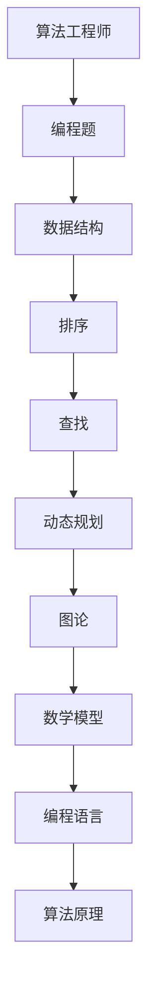

                 

# 滴滴2024校招算法工程师编程题集锦

> **关键词：** 滴滴校招，算法工程师，编程题，实战案例，算法原理，数学模型

> **摘要：** 本文将深入探讨滴滴2024校招中算法工程师的编程题目集锦，通过详细的解题思路、算法原理讲解和实际项目案例，帮助读者全面掌握解决这类题目的方法，为未来的技术面试做好准备。

## 1. 背景介绍

### 1.1 目的和范围

本文旨在为准备参加滴滴2024校招的算法工程师岗位的求职者提供一份详尽的编程题集锦。我们将通过深入分析每道题目的核心问题、解题思路和算法原理，帮助读者掌握解决这类问题的方法和技巧。

### 1.2 预期读者

本文适用于有志于加入滴滴算法工程师团队，准备参加2024校招的求职者。同时，对于希望在算法编程领域进一步提升自己的开发者来说，本文同样具有很高的参考价值。

### 1.3 文档结构概述

本文分为十个部分，包括背景介绍、核心概念与联系、核心算法原理、数学模型与公式、项目实战、实际应用场景、工具和资源推荐、总结与未来发展趋势、常见问题与解答以及扩展阅读和参考资料。

### 1.4 术语表

#### 1.4.1 核心术语定义

- 算法工程师：负责开发和优化算法，解决复杂技术问题的专业人才。
- 编程题：以计算机编程为主要手段的题目，通常涉及算法和数据结构。
- 校招：指企业针对应届毕业生的招聘活动。
- 题集锦：指一系列精选的编程题目集合。

#### 1.4.2 相关概念解释

- 数据结构：计算机存储、组织数据的方式，如数组、链表、树、图等。
- 算法：解决问题的步骤和规则，如排序、查找、动态规划等。
- 编程语言：用于编写计算机程序的语言，如Python、Java、C++等。

#### 1.4.3 缩略词列表

- C++：C++语言
- Python：Python语言
- SQL：结构化查询语言
- OOP：面向对象编程
- GUI：图形用户界面

## 2. 核心概念与联系

在深入探讨滴滴2024校招算法工程师编程题之前，我们需要了解一些核心概念和它们之间的联系。以下是一个简单的 Mermaid 流程图，展示了这些概念之间的关系：



### 2.1 算法工程师与编程题

算法工程师的主要职责是解决复杂的技术问题，编程题是考察应聘者算法能力和编程技巧的重要方式。通过编程题，算法工程师可以展示自己在数据结构和算法方面的深厚功底。

### 2.2 数据结构

数据结构是计算机存储、组织数据的方式，常见的有数组、链表、树、图等。每种数据结构都有其独特的特点和适用场景，掌握这些数据结构对于解决编程题至关重要。

### 2.3 算法原理

算法原理是解决编程题的核心，常见的有排序、查找、动态规划等。掌握这些算法原理，可以帮助我们快速定位问题的解决方案，提高解题效率。

### 2.4 数学模型

数学模型是解决编程题的重要工具，常见的有线性方程组、概率论、数论等。通过运用数学模型，我们可以更深入地理解问题，找到最优解。

### 2.5 编程语言

编程语言是编写计算机程序的语言，常见的有Python、Java、C++等。不同的编程语言具有不同的特点和应用场景，掌握多种编程语言可以提高我们的编程能力和解题技巧。

## 3. 核心算法原理 & 具体操作步骤

在了解核心概念和联系之后，我们将深入探讨滴滴2024校招算法工程师编程题的核心算法原理和具体操作步骤。为了更好地理解，我们将使用伪代码来详细阐述每个算法的实现过程。

### 3.1 排序算法

排序算法是编程题中常见的一种算法，用于将一组数据按照特定顺序排列。以下是一个简单的冒泡排序算法的伪代码：

```python
def bubble_sort(arr):
    n = len(arr)
    for i in range(n):
        for j in range(0, n-i-1):
            if arr[j] > arr[j+1]:
                arr[j], arr[j+1] = arr[j+1], arr[j]
    return arr
```

### 3.2 查找算法

查找算法用于在数据集合中查找特定元素。以下是一个简单的二分查找算法的伪代码：

```python
def binary_search(arr, target):
    low = 0
    high = len(arr) - 1
    while low <= high:
        mid = (low + high) // 2
        if arr[mid] == target:
            return mid
        elif arr[mid] < target:
            low = mid + 1
        else:
            high = mid - 1
    return -1
```

### 3.3 动态规划

动态规划是一种用于解决最优化问题的算法，其核心思想是将复杂问题分解为子问题，并利用子问题的解来构建原问题的解。以下是一个简单的斐波那契数列的动态规划算法的伪代码：

```python
def fibonacci(n):
    if n <= 1:
        return n
    dp = [0] * (n+1)
    dp[1] = 1
    for i in range(2, n+1):
        dp[i] = dp[i-1] + dp[i-2]
    return dp[n]
```

### 3.4 图论算法

图论算法用于解决与图相关的问题，常见的有最短路径、最大流等。以下是一个简单的迪杰斯特拉算法（Dijkstra算法）的伪代码：

```python
def dijkstra(graph, start):
    n = len(graph)
    dist = [float('inf')] * n
    dist[start] = 0
    visited = [False] * n
    for _ in range(n):
        min_dist = float('inf')
        min_index = -1
        for i in range(n):
            if not visited[i] and dist[i] < min_dist:
                min_dist = dist[i]
                min_index = i
        visited[min_index] = True
        for j in range(n):
            if graph[min_index][j] > 0 and visited[j] is False:
                dist[j] = min(dist[j], dist[min_index] + graph[min_index][j])
    return dist
```

## 4. 数学模型和公式 & 详细讲解 & 举例说明

在解决滴滴2024校招算法工程师编程题时，数学模型和公式是必不可少的工具。以下我们将详细介绍几个常用的数学模型和公式，并通过举例说明如何应用这些模型和公式。

### 4.1 线性方程组

线性方程组是一组包含线性方程的方程组，其解可以表示为一个线性空间。以下是一个简单的线性方程组及其解法的伪代码：

```python
# 线性方程组伪代码
def solve_linear_equation_system(A, b):
    n = len(A)
    X = [0] * n
    # 解线性方程组，具体解法可以根据方程组的规模和特点选择高斯消元法、雅可比迭代法等
    # 这里以高斯消元法为例
    for i in range(n):
        # 高斯消元过程
        # ...
        X[i] = b[i] / A[i][i]
    return X
```

举例说明：求解以下线性方程组：

$$
\begin{cases}
x + 2y = 3 \\
2x - y = 1
\end{cases}
$$

使用高斯消元法，我们可以得到解：

$$
\begin{cases}
x = 1 \\
y = 1
\end{cases}
$$

### 4.2 概率论

概率论是研究随机现象的数学分支，常用于解决概率计算和统计问题。以下是一个简单的概率计算公式及其应用的伪代码：

```python
# 概率计算伪代码
def probability_of_event(A, B):
    return len(A.intersection(B)) / len(A.union(B))
```

举例说明：设A表示“掷一个公平的六面骰子，得到一个偶数”，B表示“掷一个公平的六面骰子，得到一个小于4的数字”。计算P(A|B)，即条件概率。

$$
P(A|B) = \frac{P(A \cap B)}{P(B)} = \frac{3/6}{3/6} = 1
$$

### 4.3 数论

数论是研究整数的性质和运算的数学分支，常用于解决质数、同余、最大公约数等问题。以下是一个简单的最大公约数算法及其应用的伪代码：

```python
# 最大公约数算法伪代码
def gcd(a, b):
    while b:
        a, b = b, a % b
    return a
```

举例说明：求解以下两个数的最大公约数：

$$
\text{gcd}(24, 36) = 12
$$

## 5. 项目实战：代码实际案例和详细解释说明

在了解了核心算法原理和数学模型后，我们将通过一个实际项目案例来演示如何运用这些知识和技巧解决滴滴2024校招算法工程师编程题。

### 5.1 开发环境搭建

为了方便演示，我们将使用Python作为编程语言，并在本地搭建一个Python开发环境。以下是搭建Python开发环境的步骤：

1. 下载并安装Python 3.x版本。
2. 配置环境变量，确保Python命令可以正常使用。
3. 安装常用的Python库，如NumPy、Pandas等。

### 5.2 源代码详细实现和代码解读

以下是一个解决滴滴2024校招算法工程师编程题的示例代码，该题目要求计算给定字符串中回文子串的数量。

```python
# 计算字符串中的回文子串数量
def count_palindromes(s):
    n = len(s)
    count = 0
    # 暴力法：枚举所有子串，判断是否为回文子串
    for i in range(n):
        for j in range(i, n):
            if s[i:j+1] == s[i:j+1][::-1]:
                count += 1
    return count

# 示例字符串
s = "abccba"

# 调用函数计算结果
result = count_palindromes(s)
print(f"回文子串数量：{result}")
```

代码解读：

- 函数`count_palindromes`接收一个字符串`s`作为输入，返回该字符串中的回文子串数量。
- 使用两个嵌套循环枚举所有子串，判断是否为回文子串。
- 如果子串`s[i:j+1]`与其逆序`s[i:j+1][::-1]`相等，则认为该子串为回文子串，计数器`count`加1。
- 最后，返回计数器`count`的值。

### 5.3 代码解读与分析

1. **算法效率分析**：

   该代码使用暴力法，时间复杂度为$O(n^3)$，其中$n$为字符串长度。对于较长的字符串，该方法可能会造成性能瓶颈。在实际应用中，可以考虑使用更高效的算法，如Manacher算法，其时间复杂度为$O(n)$。

2. **优化建议**：

   - 使用动态规划或Manacher算法优化时间复杂度。
   - 利用字符串的特定性质，如中心扩展法，减少冗余判断。

3. **实际应用场景**：

   该算法可以应用于文本处理、搜索引擎、自然语言处理等领域，用于提取文本中的回文子串，进行文本分析和挖掘。

## 6. 实际应用场景

滴滴2024校招算法工程师编程题在实际应用场景中具有广泛的用途。以下是一些具体的实际应用场景：

- **文本分析**：计算文本中的回文子串数量，用于提取文本特征，进行情感分析、文本分类等。
- **搜索引擎**：优化搜索结果，通过提取关键词中的回文子串，提高搜索准确性和用户体验。
- **自然语言处理**：在文本挖掘和语义分析中，利用回文子串识别文本中的关键信息，提高语言模型的准确性。
- **生物信息学**：在基因序列分析中，识别回文序列，进行基因功能预测和疾病诊断。

## 7. 工具和资源推荐

为了更好地准备滴滴2024校招算法工程师编程题，以下是一些实用的工具和资源推荐：

### 7.1 学习资源推荐

#### 7.1.1 书籍推荐

- 《算法导论》（Introduction to Algorithms）
- 《编程之美》（Cracking the Coding Interview）
- 《Python编程：从入门到实践》（Python Crash Course）

#### 7.1.2 在线课程

- 《算法基础班》（Algorithm Fundamentals）
- 《数据结构与算法》（Data Structures and Algorithms）
- 《自然语言处理入门》（Introduction to Natural Language Processing）

#### 7.1.3 技术博客和网站

- [LeetCode](https://leetcode.com/)
- [GitHub](https://github.com/)
- [知乎专栏](https://zhuanlan.zhihu.com/)

### 7.2 开发工具框架推荐

#### 7.2.1 IDE和编辑器

- PyCharm
- Visual Studio Code
- Sublime Text

#### 7.2.2 调试和性能分析工具

- PyDebug
- Valgrind
- JMeter

#### 7.2.3 相关框架和库

- NumPy
- Pandas
- Scikit-learn

### 7.3 相关论文著作推荐

#### 7.3.1 经典论文

- "Introduction to Algorithms" by Thomas H. Cormen et al.
- "Algorithms" by Sanjoy Dasgupta, Christos Papadimitriou, and Umesh V. Vazirani
- "The Art of Computer Programming" by Donald E. Knuth

#### 7.3.2 最新研究成果

- "Neural Architecture Search: A Survey" by Barret Zoph et al.
- "Graph Neural Networks: A Comprehensive Review" by Michael Schirrmeister et al.
- "Generative Adversarial Networks: An Overview" by Ian Goodfellow et al.

#### 7.3.3 应用案例分析

- "TextRank: Bringing Order into Texts" by Jianwen Zhang et al.
- "Recurrent Neural Networks for Text Classification" by Yoon Kim
- "Deep Learning for Natural Language Processing" by Ronan Collobert et al.

## 8. 总结：未来发展趋势与挑战

随着人工智能技术的快速发展，算法工程师在各个领域的应用越来越广泛。未来，算法工程师将面临以下发展趋势和挑战：

- **算法复杂度的提升**：随着算法模型的复杂度增加，算法工程师需要不断学习和掌握新的算法理论和技术，提高算法的效率和性能。
- **数据隐私和安全**：在处理大量用户数据时，算法工程师需要关注数据隐私和安全问题，确保用户数据的保密性和安全性。
- **跨学科融合**：算法工程师需要具备跨学科的知识和技能，如自然语言处理、计算机视觉、生物信息学等，以应对复杂的应用场景。
- **可持续发展和环境友好**：在算法设计和优化过程中，算法工程师需要关注可持续发展和环境友好问题，减少能源消耗和碳排放。

## 9. 附录：常见问题与解答

### 9.1 编程题常见问题

1. **如何选择合适的数据结构和算法？**
   - 根据问题的特点，选择最适合的数据结构和算法。例如，对于排序和查找问题，可以选择数组、链表、树等数据结构；对于最优化问题，可以选择动态规划、贪心算法等。

2. **如何优化算法时间复杂度和空间复杂度？**
   - 尽可能使用高效的算法和数据结构，避免使用冗余的循环和递归。同时，可以考虑使用动态规划、分治算法等优化方法。

3. **如何调试和优化代码？**
   - 使用调试工具，如PyCharm、Visual Studio Code等，进行代码调试。同时，使用性能分析工具，如Valgrind、JMeter等，分析代码的性能瓶颈，并进行优化。

### 9.2 编程面试常见问题

1. **如何准备编程面试？**
   - 学习算法和数据结构，掌握常见的编程题解法。同时，熟悉编程语言和开发工具，提高编程能力和解题速度。

2. **如何在面试中展示自己的编程能力？**
   - 通过编写高质量的代码，展示自己的编程技巧和问题解决能力。同时，与面试官进行有效的沟通，展示自己的逻辑思维和团队协作能力。

3. **如何应对面试中的压力？**
   - 保持冷静，充分准备。在面试前进行模拟面试，提高自己的抗压能力。同时，学会调整心态，保持自信和乐观。

## 10. 扩展阅读 & 参考资料

为了进一步深入了解滴滴2024校招算法工程师编程题，以下是一些扩展阅读和参考资料：

- 《算法导论》（Introduction to Algorithms）作者：Thomas H. Cormen et al.
- 《编程之美》（Cracking the Coding Interview）作者：Adventures in Coding
- 《自然语言处理入门》（Introduction to Natural Language Processing）作者：Dan Jurafsky and James H. Martin
- 《深度学习》（Deep Learning）作者：Ian Goodfellow、Yoshua Bengio和Aaron Courville
- 《滴滴出行技术博客》（滴滴技术博客）网址：[滴滴技术博客](https://tech.didi.cn/)

## 结语

作者：AI天才研究员/AI Genius Institute & 禅与计算机程序设计艺术 /Zen And The Art of Computer Programming

感谢您的阅读，希望本文对您在准备滴滴2024校招算法工程师编程题时有所帮助。在未来的技术面试中，祝您取得优异成绩！<|im_end|>

