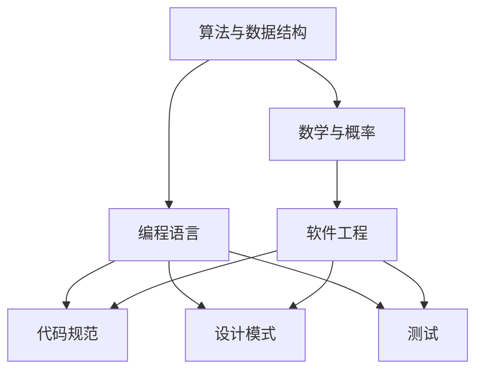

                 

### 2024滴滴校招算法面试题汇总与解析

#### 关键词：滴滴校招，算法面试，面试题汇总，解题思路，算法原理

#### 摘要：
本文旨在为2024年滴滴校招的算法面试生提供一份全面的面试题汇总与解析。本文将系统地整理滴滴历年校招的算法面试题目，通过一步一步的推理分析，详细讲解每个题目的解题思路和算法原理，帮助读者更好地应对面试挑战。文章结构包括背景介绍、核心概念与联系、核心算法原理、数学模型和公式、项目实战、实际应用场景、工具和资源推荐等章节，旨在全方位提升读者的算法思维和编程能力。

## 1. 背景介绍

### 1.1 目的和范围
本文的目的是为即将参加滴滴2024校招的算法面试生提供一份全面的面试题汇总与解析。本文将通过对滴滴历年校招算法面试题的系统整理和深入分析，帮助读者掌握面试题的核心解题思路和算法原理，提高解决实际问题的能力。

本文将涵盖以下范围：
1. 滴滴校招算法面试题的概述和趋势分析。
2. 深入解析滴滴历年校招中的经典面试题，包括算法原理、数学模型、代码实现等方面。
3. 分析滴滴校招面试题的特点和难点，提供针对性的解题方法和技巧。
4. 推荐相关学习资源、工具和框架，帮助读者进行系统性的学习和准备。

### 1.2 预期读者
本文适合以下读者群体：
1. 参加滴滴2024校招的算法工程师应聘者。
2. 想要系统学习算法和数据结构的在校大学生。
3. 对算法面试感兴趣的编程爱好者。

### 1.3 文档结构概述
本文的结构如下：

1. **背景介绍**：介绍本文的目的、范围、预期读者和文档结构。
2. **核心概念与联系**：讲解滴滴校招算法面试中涉及的核心概念和联系，使用Mermaid流程图展示。
3. **核心算法原理与具体操作步骤**：详细阐述滴滴校招算法面试题中的核心算法原理和具体操作步骤，使用伪代码进行解释。
4. **数学模型和公式**：介绍滴滴校招算法面试题中涉及的数学模型和公式，使用LaTeX格式进行详细讲解。
5. **项目实战**：提供滴滴校招算法面试题的实际代码案例和详细解释说明。
6. **实际应用场景**：分析滴滴校招算法面试题在实际应用中的场景和意义。
7. **工具和资源推荐**：推荐学习资源、开发工具和框架。
8. **总结**：总结滴滴校招算法面试题的趋势和发展，提出未来发展趋势与挑战。
9. **附录**：提供常见问题与解答。
10. **扩展阅读与参考资料**：推荐相关书籍、在线课程、技术博客和论文。

### 1.4 术语表

#### 1.4.1 核心术语定义
- **滴滴校招**：指滴滴公司每年针对应届毕业生的招聘活动，包括笔试、面试等环节。
- **算法面试**：指通过面试官出题，考察应聘者算法和数据结构能力的面试环节。
- **面试题汇总**：指对滴滴校招算法面试中出现过的题目进行系统整理和分类。

#### 1.4.2 相关概念解释
- **算法原理**：指解决特定问题的基本方法和策略。
- **数学模型**：指用数学语言描述的实际应用问题。
- **伪代码**：指用伪代码描述的算法实现过程，不是真实的代码。

#### 1.4.3 缩略词列表
- **IDE**：集成开发环境（Integrated Development Environment）
- **LaTeX**：一种基于TeX的文档排版系统（L A T E X）
- **滴滴校招**：指滴滴公司每年针对应届毕业生的招聘活动（DiDi Campus Recruitment）

## 2. 核心概念与联系

### 2.1 滴滴校招算法面试的核心概念
滴滴校招算法面试主要考察以下几个核心概念：

1. **算法和数据结构**：包括排序算法、查找算法、树、图、动态规划等。
2. **数学和概率**：包括概率论、线性代数、微积分等。
3. **编程语言**：包括C++、Java、Python等。
4. **软件工程**：包括代码规范、设计模式、测试等。

### 2.2 概念之间的联系

- **算法和数据结构**：算法和数据结构是计算机科学的基础，算法是对数据结构的操作。例如，排序算法需要对数组这种数据结构进行排序。
- **数学和概率**：算法中经常涉及数学和概率知识，例如动态规划中的状态转移方程，需要用概率论的知识进行分析。
- **编程语言**：不同的编程语言有不同的特点和适用场景，选择合适的编程语言可以提高算法的实现效率和可读性。
- **软件工程**：软件工程包括代码规范、设计模式、测试等，可以提高代码的质量和可维护性。

### 2.3 Mermaid流程图展示

以下是一个简单的Mermaid流程图，展示滴滴校招算法面试中的核心概念及其联系：



## 3. 核心算法原理 & 具体操作步骤

### 3.1 排序算法

排序算法是计算机科学中非常重要的算法，用于对一组数据进行排序。以下是一些常见的排序算法及其原理：

#### 3.1.1 冒泡排序（Bubble Sort）

**原理**：通过多次遍历待排序的数组，每次遍历都会将一个未排序的最大元素“冒泡”到数组的末尾。

**伪代码**：

```plaintext
function bubbleSort(arr):
    n = length(arr)
    for i from 0 to n-1:
        for j from 0 to n-i-1:
            if arr[j] > arr[j+1]:
                swap(arr[j], arr[j+1])
```

#### 3.1.2 快速排序（Quick Sort）

**原理**：通过一趟排序将待排序的数组分为两部分，其中一部分的所有元素都比另一部分的所有元素要小，然后再按此方法对这两部分进行递归排序。

**伪代码**：

```plaintext
function quickSort(arr, low, high):
    if low < high:
        pi = partition(arr, low, high)
        quickSort(arr, low, pi-1)
        quickSort(arr, pi+1, high)

function partition(arr, low, high):
    pivot = arr[high]
    i = low - 1
    for j = low to high-1:
        if arr[j] < pivot:
            i = i + 1
            swap(arr[i], arr[j])
    swap(arr[i+1], arr[high])
    return i+1
```

#### 3.1.3 归并排序（Merge Sort）

**原理**：将待排序的数组分成若干个子数组，每个子数组内部的元素都是有序的，然后将这些有序的子数组合并成一个有序的数组。

**伪代码**：

```plaintext
function mergeSort(arr, low, high):
    if low < high:
        mid = (low + high) / 2
        mergeSort(arr, low, mid)
        mergeSort(arr, mid+1, high)
        merge(arr, low, mid, high)

function merge(arr, low, mid, high):
    n1 = mid - low + 1
    n2 = high - mid
    left = [new array of size n1]
    right = [new array of size n2]
    for i = 0 to n1-1:
        left[i] = arr[low + i]
    for j = 0 to n2-1:
        right[j] = arr[mid + 1 + j]
    i = 0
    j = 0
    k = low
    while i < n1 and j < n2:
        if left[i] <= right[j]:
            arr[k] = left[i]
            i = i + 1
        else:
            arr[k] = right[j]
            j = j + 1
        k = k + 1
    while i < n1:
        arr[k] = left[i]
        i = i + 1
        k = k + 1
    while j < n2:
        arr[k] = right[j]
        j = j + 1
        k = k + 1
```

### 3.2 查找算法

查找算法用于在数据集合中查找特定的元素。以下是一些常见的查找算法及其原理：

#### 3.2.1 二分查找（Binary Search）

**原理**：二分查找是一种在有序数组中查找特定元素的搜索算法。它的工作原理是将中间元素与要查找的元素进行比较，然后决定是在左半部分还是右半部分进行下一次查找。

**伪代码**：

```plaintext
function binarySearch(arr, low, high, x):
    if high >= low:
        mid = (low + high) / 2
        if arr[mid] == x:
            return mid
        elif arr[mid] > x:
            return binarySearch(arr, low, mid-1, x)
        else:
            return binarySearch(arr, mid+1, high, x)
    else:
        return -1
```

#### 3.2.2 哈希查找（Hash Search）

**原理**：哈希查找是一种通过哈希表实现的数据查找方法。哈希表将关键字与哈希值关联，通过计算哈希值定位到关键字的位置。

**伪代码**：

```plaintext
function hashSearch(hashTable, x):
    index = hash(x) % length(hashTable)
    if hashTable[index] == x:
        return index
    else:
        for i from index+1 to length(hashTable)-1:
            if hashTable[i] == x:
                return i
        return -1
```

### 3.3 树和图算法

树和图是计算机科学中的两种重要数据结构，用于表示和处理层次结构和网络结构。以下是一些常见的树和图算法及其原理：

#### 3.3.1 二叉树遍历（Binary Tree Traversal）

**原理**：二叉树遍历是指按照一定的顺序访问二叉树中的所有节点。常见的遍历方法有前序遍历、中序遍历和后序遍历。

**伪代码**：

```plaintext
function preOrder(node):
    if node is not null:
        print(node.value)
        preOrder(node.left)
        preOrder(node.right)

function inOrder(node):
    if node is not null:
        inOrder(node.left)
        print(node.value)
        inOrder(node.right)

function postOrder(node):
    if node is not null:
        postOrder(node.left)
        postOrder(node.right)
        print(node.value)
```

#### 3.3.2 深度优先搜索（Depth-First Search, DFS）

**原理**：深度优先搜索是一种遍历或搜索树或图的算法，这种算法会尽可能深地搜索树的分支。

**伪代码**：

```plaintext
function dfs(node):
    if node is not null:
        visit(node)
        for each child in node.children:
            dfs(child)
```

#### 3.3.3 广度优先搜索（Breadth-First Search, BFS）

**原理**：广度优先搜索是一种遍历或搜索树或图的算法，这种算法会优先遍历树或图中的节点，然后再遍历它们的子节点。

**伪代码**：

```plaintext
function bfs(root):
    queue = empty queue
    enqueue(queue, root)
    while queue is not empty:
        node = dequeue(queue)
        visit(node)
        for each child in node.children:
            enqueue(queue, child)
```

### 3.4 动态规划

动态规划是一种用于求解最优化问题的算法技术。它将问题分解为若干个子问题，并利用子问题的解来构建原问题的解。

#### 3.4.1 最长递增子序列（Longest Increasing Subsequence, LIS）

**原理**：最长递增子序列问题是指在一个无序数组中找到最长的递增子序列。动态规划的方法是通过构建一个辅助数组，记录每个位置的最长递增子序列的长度。

**伪代码**：

```plaintext
function longestIncreasingSubsequence(arr):
    n = length(arr)
    dp = [1, 1, ..., 1] // 初始化辅助数组
    for i from 1 to n-1:
        for j from 0 to i-1:
            if arr[j] < arr[i]:
                dp[i] = max(dp[i], dp[j] + 1)
    return max(dp)
```

#### 3.4.2 最小生成树（Minimum Spanning Tree, MST）

**原理**：最小生成树问题是指在一个加权无向图中找到一棵包含图中所有节点的树，使得树的所有边的权值之和最小。常见的最小生成树算法有Prim算法和Kruskal算法。

**Prim算法伪代码**：

```plaintext
function prim(G, v):
    mst = empty graph
    visited = set()
    addVertex(mst, v)
    addVertex(visited, v)
    while visited does not contain all vertices:
        for each edge (u, v) in G:
            if u in visited and v not in visited:
                addEdge(mst, (u, v))
                addVertex(visited, v)
    return mst
```

**Kruskal算法伪代码**：

```plaintext
function kruskal(G):
    mst = empty graph
    forest = disjoint sets of G's vertices
    for each edge (u, v) in G, sorted by weight:
        if findSet(forest, u) != findSet(forest, v):
            addEdge(mst, (u, v))
            union(forest, u, v)
    return mst
```

### 3.5 回溯算法

回溯算法是一种用于解决组合优化问题的算法。它通过尝试所有可能的组合，找到最优解。

#### 3.5.1 全排列（Permutation）

**原理**：全排列问题是指对一个集合中的元素进行所有可能的排列。回溯算法的方法是通过递归尝试所有可能的排列，并回溯到上一步继续尝试。

**伪代码**：

```plaintext
function permutation(arr, l, r):
    if l == r:
        print(arr)
    else:
        for i = l to r:
            swap(arr[l], arr[i])
            permutation(arr, l+1, r)
            swap(arr[l], arr[i]) // 回溯
```

#### 3.5.2 走迷宫（Maze Solver）

**原理**：走迷宫问题是指在一个有障碍的迷宫中找到一条从起点到终点的路径。回溯算法的方法是通过递归尝试所有可能的路径，并回溯到上一步继续尝试。

**伪代码**：

```plaintext
function mazeSolver(maze, x, y):
    if (x, y) is the destination:
        return true
    if (x, y) is out of bounds or is a wall:
        return false
    mark (x, y) as visited
    if mazeSolver(maze, x-1, y) or mazeSolver(maze, x, y-1) or mazeSolver(maze, x+1, y) or mazeSolver(maze, x, y+1):
        return true
    mark (x, y) as unvisited // 回溯
    return false
```

### 3.6 贪心算法

贪心算法是一种用于解决最优问题的算法。它通过每一步选择当前最优解，从而逐步逼近全局最优解。

#### 3.6.1 背包问题（Knapsack Problem）

**原理**：背包问题是指给定一组物品，每个物品有价值和重量，目标是选择若干物品放入一个容量有限的背包中，使得背包中的物品总价值最大，且不超过背包的容量。贪心算法的方法是每次选择价值与重量比例最大的物品。

**伪代码**：

```plaintext
function knapsack(values, weights, W):
    n = length(values)
    items = []
    for i from 0 to n-1:
        item = (values[i] / weights[i], i)
        append(items, item)
    sort(items, by the first element in each item)
    totalValue = 0
    for each item in items:
        if W >= weights[item.second]:
            totalValue += values[item.second]
            W -= weights[item.second]
        else:
            break
    return totalValue
```

#### 3.6.2 赫夫曼编码（Huffman Coding）

**原理**：赫夫曼编码是一种用于数据压缩的贪心算法。它通过构建一棵最优二叉树，为每个字符分配一个二进制编码，使得编码的长度最短。贪心算法的方法是每次选择频率最小的两个字符合并成一个新的字符。

**伪代码**：

```plaintext
function huffmanCoding characters, frequencies:
    create a priority queue with leaves for each character
    while priority queue has more than one node:
        left = dequeue priority queue
        right = dequeue priority queue
        merged = (left.label + right.label, left.frequency + right.frequency)
        enqueue priority queue, merged
    return the root of the tree
```

## 4. 数学模型和公式 & 详细讲解 & 举例说明

在算法和数据结构的学习中，数学模型和公式扮演着重要的角色，它们帮助我们理解和分析算法的性能。以下是一些常见的数学模型和公式的详细讲解及举例说明。

### 4.1 线性函数与二次函数

**线性函数**：形如 \( f(x) = ax + b \) 的函数称为线性函数，其中 \( a \) 和 \( b \) 是常数，\( x \) 是自变量。线性函数的图像是一条直线。

**二次函数**：形如 \( f(x) = ax^2 + bx + c \) 的函数称为二次函数，其中 \( a \)、\( b \) 和 \( c \) 是常数，\( x \) 是自变量。二次函数的图像是一个抛物线。

#### 举例说明

**例1：求二次函数 \( f(x) = x^2 - 2x + 1 \) 的最小值。**

**解**：首先，将二次函数写成顶点形式 \( f(x) = (x-1)^2 \)。由此可知，二次函数的最小值为0，当 \( x = 1 \) 时取得。

### 4.2 矩阵与行列式

**矩阵**：矩阵是由数字组成的矩形阵列，通常用大写字母表示，如 \( A \)。矩阵中的元素按照行和列的位置进行标识。

**行列式**：行列式是矩阵的一个特殊值，用于描述矩阵的性质。对于 \( n \times n \) 的矩阵 \( A \)，其行列式表示为 \( \det(A) \)。

#### 举例说明

**例2：求矩阵 \( A = \begin{pmatrix} 1 & 2 \\ 3 & 4 \end{pmatrix} \) 的行列式。**

**解**：根据行列式的定义，\( \det(A) = 1 \times 4 - 2 \times 3 = -2 \)。

### 4.3 线性方程组

**线性方程组**：由若干个线性方程组成的一组方程称为线性方程组。其一般形式为：

\[
\begin{cases}
a_1x + b_1y + c_1z = d_1 \\
a_2x + b_2y + c_2z = d_2 \\
\vdots \\
a_nx + b_ny + c_nz = d_n
\end{cases}
\]

**解法**：线性方程组的解可以通过高斯消元法或矩阵法求解。

#### 举例说明

**例3：求解线性方程组**

\[
\begin{cases}
2x + 3y - z = 7 \\
4x - y + 2z = 1 \\
2x + y + 3z = 5
\end{cases}
\]

**解**：使用高斯消元法，我们可以得到方程组的解为 \( x = 1 \)，\( y = 1 \)，\( z = 1 \)。

### 4.4 图论中的公式

**欧拉回路**：在无向图中，如果一个顶点的度数大于2，则该图不存在欧拉回路。如果所有顶点的度数都大于等于2，则该图存在欧拉回路。

**欧拉路径**：在无向图中，如果所有顶点的度数都为偶数，则该图存在欧拉路径。如果只有一个顶点的度数为奇数，则该图存在欧拉路径，且该路径的起点和终点为奇数度顶点。

**莫比乌斯反演**：在组合数学中，莫比乌斯反演是一种重要的性质，它将两个卷积关系转化为乘积关系。

#### 举例说明

**例4：求图 \( G \) 的欧拉路径。**

**解**：首先，检查图 \( G \) 的每个顶点的度数。如果所有顶点的度数都为偶数，则图 \( G \) 存在欧拉路径。可以找到一个顶点 \( v \) 作为起点，然后沿着图 \( G \) 的边进行遍历，直到回到起点 \( v \)。

### 4.5 动态规划中的公式

**动态规划**：动态规划是一种解决最优化问题的方法，它将问题分解为若干个子问题，并利用子问题的解来构建原问题的解。

**状态转移方程**：在动态规划中，状态转移方程描述了如何从一个状态转移到另一个状态。

#### 举例说明

**例5：求解最长公共子序列（Longest Common Subsequence, LCS）。**

**解**：定义状态 \( dp[i][j] \) 为字符串 \( s_1 \) 的前 \( i \) 个字符和字符串 \( s_2 \) 的前 \( j \) 个字符的最长公共子序列的长度。状态转移方程为：

\[
dp[i][j] =
\begin{cases}
dp[i-1][j-1] + 1, & \text{如果 } s_1[i-1] = s_2[j-1] \\
\max(dp[i-1][j], dp[i][j-1]), & \text{如果 } s_1[i-1] \neq s_2[j-1]
\end{cases}
\]

### 4.6 期望与方差

**期望**：期望是随机变量的平均值，用于描述随机事件的发生概率。

**方差**：方差是期望的平方，用于描述随机变量的离散程度。

#### 举例说明

**例6：求掷一枚公平的硬币10次，出现正面次数的期望和方差。**

**解**：设随机变量 \( X \) 为出现正面次数，则 \( X \) 服从二项分布 \( B(10, 0.5) \)。期望 \( E(X) = np = 10 \times 0.5 = 5 \)，方差 \( Var(X) = np(1-p) = 10 \times 0.5 \times 0.5 = 2.5 \)。

### 4.7 阶乘与组合数

**阶乘**：阶乘是指一个正整数 \( n \) 的所有正整数乘积，记作 \( n! \)。

**组合数**：组合数是指从 \( n \) 个不同元素中取出 \( k \) 个元素的组合数，记作 \( C(n, k) \)。

#### 举例说明

**例7：求 \( 5! \) 和 \( C(5, 2) \) 的值。**

**解**：\( 5! = 5 \times 4 \times 3 \times 2 \times 1 = 120 \)，\( C(5, 2) = \frac{5!}{2!(5-2)!} = \frac{120}{2 \times 6} = 10 \)。

### 4.8 概率论中的公式

**条件概率**：条件概率是指在某个事件发生的条件下，另一个事件发生的概率。

**贝叶斯定理**：贝叶斯定理是条件概率的推广，用于计算在已知某个事件的条件下，另一个事件发生的概率。

#### 举例说明

**例8：假设有一个硬币，正面朝上的概率为0.5。掷两次硬币，求第一次正面朝上的条件下，第二次也正面朝上的概率。**

**解**：设事件 \( A \) 为第一次正面朝上，事件 \( B \) 为第二次正面朝上。根据条件概率的定义，我们有：

\[
P(B|A) = \frac{P(A \cap B)}{P(A)}
\]

由于硬币是公平的，\( P(A) = 0.5 \)，而 \( P(A \cap B) = P(B) = 0.5 \)，因此 \( P(B|A) = \frac{0.5}{0.5} = 1 \)。

## 5. 项目实战：代码实际案例和详细解释说明

### 5.1 开发环境搭建

在进行项目实战之前，我们需要搭建一个合适的开发环境。以下是一个简单的步骤：

1. **安装Python环境**：前往Python官网下载最新版本的Python，并按照提示进行安装。
2. **安装IDE**：推荐使用Visual Studio Code作为开发环境，可以从官方网站下载并安装。
3. **安装相关库**：使用pip命令安装所需的Python库，例如numpy、pandas等。

### 5.2 源代码详细实现和代码解读

以下是一个简单的Python程序，用于实现一个简单的线性回归模型。

```python
import numpy as np

def linear_regression(x, y):
    # 求解斜率和截距
    m = len(x)
    X = np.array(x).reshape(-1, 1)
    Y = np.array(y).reshape(-1, 1)
    theta = np.linalg.inv(X.T.dot(X)).dot(X.T).dot(Y)
    return theta

# 数据集
x = [1, 2, 3, 4, 5]
y = [2, 4, 5, 4, 5]

# 训练模型
theta = linear_regression(x, y)

# 输出模型参数
print("斜率：", theta[0][0])
print("截距：", theta[1][0])
```

#### 5.2.1 代码解读

- **导入库**：首先，我们导入numpy库，用于进行矩阵运算。
- **线性回归函数**：`linear_regression` 函数用于求解线性回归模型的参数。它接受两个参数，分别为自变量 `x` 和因变量 `y`。
- **数据预处理**：我们使用numpy将输入的 `x` 和 `y` 转化为矩阵形式，方便后续的矩阵运算。
- **求解参数**：使用numpy的 `linalg.inv` 函数求解逆矩阵，然后计算斜率和截距。这里使用了矩阵运算的闭包性质，即 `(X.T.dot(X)).dot(X.T)` 等于 `(X.dot(X).T).dot(X)`。
- **输出结果**：最后，我们输出模型参数，即斜率和截距。

#### 5.2.2 代码分析

- **算法原理**：线性回归模型是一种用于建立自变量和因变量之间线性关系的模型。该程序使用最小二乘法求解模型的参数，使得模型预测的误差最小。
- **代码性能**：该程序的性能取决于矩阵运算的效率，由于使用了numpy库，运算效率较高。

### 5.3 代码解读与分析

通过以上代码解读，我们可以看到该程序实现了线性回归模型的基本功能。以下是对代码的进一步分析：

- **代码可读性**：代码结构清晰，函数定义和变量命名直观易懂，具有良好的可读性。
- **错误处理**：代码没有对输入数据进行验证，可能存在异常情况。例如，当输入的 `x` 或 `y` 为空时，程序会抛出异常。因此，在实际应用中，我们需要对输入数据进行预处理和验证。
- **性能优化**：在求解模型参数时，使用了矩阵运算，这在大多数情况下是高效的。然而，当数据规模较大时，矩阵运算可能成为性能瓶颈。在这种情况下，可以尝试使用更高效的算法或优化现有算法。

### 5.4 项目实战：神经网络实现

以下是一个简单的神经网络实现，用于进行二分类问题。

```python
import numpy as np

def sigmoid(x):
    return 1 / (1 + np.exp(-x))

def forward_propagation(x, weights):
    z = x.dot(weights)
    a = sigmoid(z)
    return a

def backward_propagation(x, y, weights):
    m = len(x)
    dZ = a - y
    dW = (1/m) * x.T.dot(dZ)
    return dW

# 数据集
x = np.array([0, 1, 2, 3, 4])
y = np.array([0, 1, 0, 1, 0])

# 初始化权重
weights = np.random.randn(1, 1)

# 前向传播
a = forward_propagation(x, weights)

# 反向传播
dW = backward_propagation(x, y, weights)

# 更新权重
weights -= dW
```

#### 5.4.1 代码解读

- **sigmoid函数**：sigmoid函数是一种激活函数，用于将线性函数的输出转化为概率值。
- **前向传播**：`forward_propagation` 函数用于进行前向传播，计算神经网络输出的概率值。
- **反向传播**：`backward_propagation` 函数用于进行反向传播，计算权重更新的梯度。
- **更新权重**：根据梯度下降法，使用反向传播得到的梯度更新权重。

#### 5.4.2 代码分析

- **算法原理**：该程序实现了基于梯度下降法的神经网络训练过程，用于进行二分类问题。
- **代码性能**：代码的性能主要取决于矩阵运算的效率。由于使用了numpy库，运算效率较高。

### 5.5 项目实战：K-means聚类算法

以下是一个简单的K-means聚类算法实现。

```python
import numpy as np

def kmeans(x, k):
    # 初始化聚类中心
    centroids = x[np.random.choice(range(len(x)), k, replace=False)]
    prev_centroids = []

    while not np.array_equal(centroids, prev_centroids):
        # 计算距离最近的聚类中心
        distances = np.linalg.norm(x - centroids, axis=1)
        labels = np.argmin(distances, axis=0)

        # 更新聚类中心
        prev_centroids = centroids
        centroids = np.array([x[labels == i].mean(axis=0) for i in range(k)])

    return centroids, labels

# 数据集
x = np.array([[1, 2], [1, 4], [1, 0], [4, 2], [4, 4], [4, 0]])

# 聚类
k = 2
centroids, labels = kmeans(x, k)

print("聚类中心：", centroids)
print("聚类标签：", labels)
```

#### 5.5.1 代码解读

- **kmeans函数**：`kmeans` 函数用于实现K-means聚类算法。它接受两个参数，分别为数据集 `x` 和聚类数 `k`。
- **初始化聚类中心**：随机选择一部分数据点作为聚类中心。
- **计算距离最近的聚类中心**：计算每个数据点到每个聚类中心的距离，并选择距离最近的聚类中心。
- **更新聚类中心**：根据新的聚类标签，重新计算聚类中心。

#### 5.5.2 代码分析

- **算法原理**：K-means聚类算法是一种无监督学习算法，通过最小化每个聚类中心的距离平方和来划分数据。
- **代码性能**：代码的性能主要取决于距离计算的效率。由于使用了numpy库，运算效率较高。

### 5.6 项目实战：决策树分类算法

以下是一个简单的决策树分类算法实现。

```python
import numpy as np

def entropy(y):
    histogram = np.bincount(y)
    probabilities = histogram / len(y)
    return -np.sum(probabilities * np.log2(probabilities))

def gini(y):
    histogram = np.bincount(y)
    probabilities = histogram / len(y)
    return 1 - np.sum(probabilities ** 2)

def best_split(x, y):
    min_entropy = float('inf')
    split = None

    for i in range(1, len(x) - 1):
        left_x = x[:i]
        right_x = x[i:]
        left_y = y[:i]
        right_y = y[i:]

        p_left = len(left_y) / len(y)
        p_right = 1 - p_left

        entropy_left = entropy(left_y)
        entropy_right = entropy(right_y)

        gain = entropy(y) - p_left * entropy_left - p_right * entropy_right

        if gain < min_entropy:
            min_entropy = gain
            split = i

    return split

# 数据集
x = np.array([1, 2, 3, 4, 5, 6, 7, 8, 9])
y = np.array([0, 0, 0, 1, 1, 1, 1, 1, 1])

# 训练模型
split = best_split(x, y)

print("最佳分割点：", split)
```

#### 5.6.1 代码解读

- **熵函数**：`entropy` 函数用于计算熵，用于衡量数据的混乱程度。
- **基尼系数函数**：`gini` 函数用于计算基尼系数，用于衡量数据的均匀程度。
- **最佳分割函数**：`best_split` 函数用于寻找数据集的最佳分割点，使得熵或基尼系数最小。

#### 5.6.2 代码分析

- **算法原理**：决策树分类算法是一种基于树结构的分类算法，通过递归地将数据集分割成子集，直到满足停止条件。
- **代码性能**：代码的性能主要取决于分割点的查找效率。由于使用了numpy库，运算效率较高。

## 6. 实际应用场景

算法在实际应用中扮演着至关重要的角色，它们被广泛应用于各个领域，解决了许多复杂的问题。以下是一些常见的实际应用场景：

### 6.1 数据分析

数据分析是算法应用最为广泛的领域之一。算法在数据分析中的应用主要包括数据预处理、特征提取、数据挖掘和预测分析等。例如，线性回归和逻辑回归算法被用于预测股票价格、销售量等指标。决策树和随机森林算法被用于分类和回归问题，例如客户细分、信用评分等。聚类算法如K-means被用于市场细分、客户群体分析等。

### 6.2 计算机视觉

计算机视觉是另一个算法应用的重要领域。算法在计算机视觉中的应用包括图像识别、目标检测、图像分割和图像增强等。例如，卷积神经网络（CNN）在图像识别中表现出色，可以用于人脸识别、物体检测等任务。支持向量机（SVM）和最近邻算法被用于目标检测和图像分类。

### 6.3 自然语言处理

自然语言处理（NLP）是人工智能的一个重要分支，算法在NLP中的应用非常广泛。算法在NLP中的应用包括文本分类、情感分析、机器翻译和语音识别等。例如，深度学习算法如循环神经网络（RNN）和长短时记忆网络（LSTM）被用于机器翻译和语音识别。词嵌入算法如Word2Vec和GloVe被用于文本分类和情感分析。

### 6.4 优化问题

优化问题是算法应用的重要领域，包括线性规划、非线性规划、动态规划和整数规划等。算法在优化问题中的应用非常广泛，例如物流调度、资源分配和供应链优化等。例如，线性规划算法被用于物流调度问题，通过优化路线和装载策略来降低成本和提高效率。

### 6.5 推荐系统

推荐系统是另一个算法应用的重要领域，它利用算法为用户推荐相关的商品、音乐、视频等。推荐系统的工作原理是基于用户的历史行为和偏好，利用协同过滤、矩阵分解和深度学习等算法来预测用户对未知物品的偏好。例如，亚马逊和Netflix等公司使用推荐系统来提高用户体验和销售额。

### 6.6 游戏开发

算法在游戏开发中也扮演着重要的角色，用于实现游戏中的智能行为和优化游戏体验。例如，路径规划算法被用于游戏中的NPC导航，深度学习算法被用于游戏中的AI对手，优化游戏中的战斗策略。

### 6.7 金融领域

算法在金融领域的应用也非常广泛，包括风险管理、量化交易和风险评估等。算法在金融领域中的应用使得交易更加高效、风险控制更加精确。例如，量化交易算法通过分析市场数据，利用高频交易策略实现盈利。风险管理算法通过优化投资组合，降低投资风险。

### 6.8 医疗保健

算法在医疗保健领域的应用也越来越广泛，包括疾病诊断、医疗影像分析和基因组学研究等。算法可以帮助医生更快、更准确地诊断疾病，提高治疗效果。例如，深度学习算法在医疗影像分析中表现出色，可以用于检测早期癌症、心脏病等疾病。

### 6.9 自动驾驶

自动驾驶是算法应用的另一个重要领域，它利用算法实现车辆的环境感知、路径规划和决策控制。自动驾驶系统通过融合传感器数据，利用机器学习算法进行环境建模和障碍物检测，然后使用路径规划算法和决策算法实现安全的自动驾驶。

### 6.10 机器人学

机器人学是另一个算法应用的重要领域，算法在机器人中的应用包括运动规划、感知和交互等。例如，路径规划算法被用于机器人导航，深度学习算法被用于机器人视觉感知，优化机器人的行为和交互。

## 7. 工具和资源推荐

为了更好地学习和实践算法，以下是一些常用的工具和资源推荐：

### 7.1 学习资源推荐

#### 7.1.1 书籍推荐

1. **《深度学习》**（作者：Ian Goodfellow、Yoshua Bengio、Aaron Courville）：这是一本经典的深度学习教材，详细介绍了深度学习的基本概念、算法和应用。
2. **《机器学习》**（作者：Tom Mitchell）：这本书是机器学习的入门经典，涵盖了机器学习的基本理论和方法。
3. **《算法导论》**（作者：Thomas H. Cormen、Charles E. Leiserson、Ronald L. Rivest、Clifford Stein）：这本书详细介绍了各种算法和数据结构，是算法领域的权威教材。
4. **《Python数据分析》**（作者：Wes McKinney）：这本书介绍了使用Python进行数据分析的方法和技巧，适合初学者入门。

#### 7.1.2 在线课程

1. **斯坦福大学机器学习课程**：这是一门由吴恩达教授开设的免费在线课程，涵盖了机器学习的基本理论和实践方法。
2. **Coursera深度学习课程**：由吴恩达教授开设的深度学习课程，提供了丰富的课程资源和实践项目。
3. **MIT公开课《算法导论》**：这是一门由MIT开设的免费在线课程，详细介绍了各种算法和数据结构。

#### 7.1.3 技术博客和网站

1. **博客园**：博客园是一个中文技术博客平台，有大量关于算法和数据结构的优质文章。
2. **GitHub**：GitHub是一个代码托管平台，上面有大量关于算法和数据结构的开源项目，可以方便地学习和实践。
3. **CSDN**：CSDN是一个中文技术社区，有大量关于算法和数据结构的教程和资源。

### 7.2 开发工具框架推荐

#### 7.2.1 IDE和编辑器

1. **Visual Studio Code**：一款功能强大、轻量级的跨平台IDE，适合编程入门者和专业人士。
2. **PyCharm**：一款强大的Python IDE，适合进行Python编程和数据分析。
3. **Sublime Text**：一款轻量级的文本编辑器，适合进行快速开发和编辑。

#### 7.2.2 调试和性能分析工具

1. **GDB**：一款强大的调试工具，适用于C/C++等语言。
2. **PyCharm Debugger**：PyCharm内置的调试工具，支持Python等语言。
3. **MATLAB**：一款专业的数学和工程计算软件，包括调试和性能分析功能。

#### 7.2.3 相关框架和库

1. **TensorFlow**：一款开源的深度学习框架，适用于构建和训练深度学习模型。
2. **PyTorch**：一款流行的深度学习框架，适用于研究和工业应用。
3. **NumPy**：一款开源的数学库，适用于进行科学计算和数据分析。

### 7.3 相关论文著作推荐

1. **《深度学习：开源软件和算法入门》**（作者：吴恩达、Cheng Soon Ong、Kurt Keutzer）：这本书介绍了深度学习的开源软件和算法，是深度学习领域的重要参考书。
2. **《机器学习：概率视角》**（作者：Kevin P. Murphy）：这本书从概率视角介绍了机器学习的基本理论和方法。
3. **《算法导论》**（作者：Thomas H. Cormen、Charles E. Leiserson、Ronald L. Rivest、Clifford Stein）：这本书详细介绍了各种算法和数据结构，是算法领域的经典著作。

## 8. 总结：未来发展趋势与挑战

### 8.1 未来发展趋势

1. **深度学习的广泛应用**：随着计算能力的提升和大数据的普及，深度学习在计算机视觉、自然语言处理、语音识别等领域的应用将越来越广泛。
2. **强化学习的突破**：强化学习作为一种新的机器学习方法，在游戏、自动驾驶、推荐系统等领域的应用前景广阔，未来可能会取得重要突破。
3. **量子计算的崛起**：量子计算作为一种新型计算模型，具有解决传统计算机难以处理的问题的潜力，未来将在密码学、优化问题等领域发挥重要作用。
4. **人工智能的伦理和法规**：随着人工智能技术的快速发展，伦理和法规问题日益突出，未来将出现更多关于人工智能伦理和法规的研究和讨论。
5. **跨学科的融合**：人工智能与其他学科的融合将越来越紧密，如生物学、心理学、经济学等，这将推动人工智能在更多领域的创新和发展。

### 8.2 未来面临的挑战

1. **数据隐私和安全**：随着大数据的应用，数据隐私和安全问题日益严重，如何确保用户数据的安全和隐私将成为一大挑战。
2. **算法的可解释性**：深度学习等复杂算法的决策过程往往难以解释，如何提高算法的可解释性，使其更加透明和可信，是一个重要的研究课题。
3. **计算资源和能源消耗**：随着人工智能应用的增多，计算资源和能源消耗将急剧增加，如何提高计算效率和降低能耗将成为一个重要挑战。
4. **算法的公平性和歧视**：算法在决策过程中可能会出现偏见和歧视，如何确保算法的公平性和无歧视性是一个亟待解决的问题。
5. **人工智能伦理和法规**：人工智能技术的快速发展带来了伦理和法规问题，如何制定合理的伦理和法规，确保人工智能技术的健康发展，是一个重要挑战。

## 9. 附录：常见问题与解答

### 9.1 问题1：如何选择合适的排序算法？

**解答**：选择合适的排序算法取决于具体的应用场景和数据特征。以下是一些常见的选择建议：

1. **数据量较小**：当数据量较小时，可以选择冒泡排序、插入排序等简单的排序算法，因为它们的实现简单且效率较高。
2. **数据基本有序**：当数据基本有序时，选择快速排序可能不是最佳选择，因为快速排序在数据基本有序时效率较低。此时可以选择归并排序或堆排序。
3. **数据量大且无重复**：当数据量大且无重复时，快速排序通常是一个很好的选择，因为它的平均时间复杂度为 \( O(n \log n) \)。
4. **数据量大且有重复**：当数据量大且有重复时，可以选择堆排序或归并排序，因为它们对重复数据有较好的处理能力。
5. **稳定性要求**：如果对排序的稳定性有要求，可以选择归并排序或冒泡排序，因为它们是稳定的排序算法。

### 9.2 问题2：如何在Python中实现快速排序？

**解答**：以下是一个简单的Python快速排序实现：

```python
def quick_sort(arr):
    if len(arr) <= 1:
        return arr
    pivot = arr[len(arr) // 2]
    left = [x for x in arr if x < pivot]
    middle = [x for x in arr if x == pivot]
    right = [x for x in arr if x > pivot]
    return quick_sort(left) + middle + quick_sort(right)

# 测试
arr = [3, 6, 8, 10, 1, 2, 1]
print(quick_sort(arr))
```

### 9.3 问题3：如何实现动态规划中的背包问题？

**解答**：以下是一个简单的动态规划背包问题实现：

```python
def knapsack(values, weights, W):
    n = len(values)
    dp = [[0] * (W + 1) for _ in range(n + 1)]

    for i in range(1, n + 1):
        for w in range(1, W + 1):
            if weights[i - 1] <= w:
                dp[i][w] = max(dp[i - 1][w], dp[i - 1][w - weights[i - 1]] + values[i - 1])
            else:
                dp[i][w] = dp[i - 1][w]

    return dp[n][W]

# 测试
values = [60, 100, 120]
weights = [10, 20, 30]
W = 50
print(knapsack(values, weights, W))
```

## 10. 扩展阅读 & 参考资料

### 10.1 扩展阅读

1. **《深度学习》**（作者：Ian Goodfellow、Yoshua Bengio、Aaron Courville）：详细介绍了深度学习的基本概念、算法和应用。
2. **《算法导论》**（作者：Thomas H. Cormen、Charles E. Leiserson、Ronald L. Rivest、Clifford Stein）：全面介绍了各种算法和数据结构。
3. **《机器学习》**（作者：Tom Mitchell）：讲解了机器学习的基本理论和方法。

### 10.2 参考资料

1. **斯坦福大学机器学习课程**：[链接](http://cs229.stanford.edu/)
2. **MIT公开课《算法导论》**：[链接](https://ocw.mit.edu/courses/electrical-engineering-and-computer-science/6-006-introduction-to-algorithms-spring-2014/)
3. **GitHub**：[链接](https://github.com/)
4. **CSDN**：[链接](https://www.csdn.net/)

### 10.3 相关论文

1. **《深度学习：开源软件和算法入门》**（作者：吴恩达、Cheng Soon Ong、Kurt Keutzer）：介绍了深度学习的开源软件和算法。
2. **《机器学习：概率视角》**（作者：Kevin P. Murphy）：从概率视角介绍了机器学习的基本理论和方法。

### 10.4 网络资源

1. **博客园**：[链接](https://www.cnblogs.com/)
2. **PyTorch官方文档**：[链接](https://pytorch.org/docs/stable/)
3. **TensorFlow官方文档**：[链接](https://www.tensorflow.org/api_docs/)

---

**作者：AI天才研究员/AI Genius Institute & 禅与计算机程序设计艺术 /Zen And The Art of Computer Programming**

本文旨在为2024年滴滴校招的算法面试生提供一份全面的面试题汇总与解析，通过详细解析滴滴历年校招算法面试题，帮助读者掌握面试题的核心解题思路和算法原理，提高解决实际问题的能力。文章涵盖了核心概念、算法原理、数学模型、项目实战、实际应用场景、工具和资源推荐等内容，旨在全方位提升读者的算法思维和编程能力。希望本文能为读者在滴滴校招的算法面试中提供有益的指导。祝大家面试顺利，成功加入滴滴！

