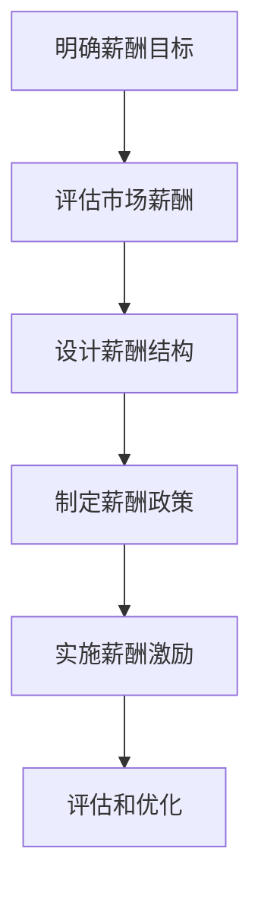

                 


# 激励性薪酬设计：留住核心人才的策略

> 关键词：激励性薪酬、核心人才、薪酬设计、绩效评估、人才保留

> 摘要：本文深入探讨了激励性薪酬设计的核心原理和实践策略，旨在为企业管理者提供一套系统化的薪酬设计框架，以留住并激发核心人才的工作热情和创新能力。通过分析薪酬激励的理论基础，我们明确了激励性薪酬的设计原则和关键要素，并结合实际案例，详细阐述了如何在企业中实施有效的激励性薪酬体系，以提高员工的满意度和忠诚度。

## 1. 背景介绍

### 1.1 目的和范围

本文旨在研究激励性薪酬设计的理论基础和实践方法，以帮助企业在激烈的市场竞争中留住核心人才。通过对激励性薪酬的定义、作用和设计原则的详细分析，本文将为企业管理者提供一套实用的薪酬设计策略，从而实现以下目标：

1. 提高员工的满意度和工作积极性。
2. 增强企业的核心竞争力。
3. 建立健康的人才激励机制。

### 1.2 预期读者

本文面向企业的人力资源管理者、薪酬福利专家以及企业管理者。同时，对希望深入了解薪酬管理领域的技术人员和学者也具有一定的参考价值。

### 1.3 文档结构概述

本文分为以下几个部分：

1. 背景介绍：介绍本文的目的、预期读者和文档结构。
2. 核心概念与联系：阐述激励性薪酬设计的相关概念和理论。
3. 核心算法原理 & 具体操作步骤：详细讲解激励性薪酬设计的具体操作步骤。
4. 数学模型和公式 & 详细讲解 & 举例说明：介绍与薪酬设计相关的数学模型和公式。
5. 项目实战：通过实际案例展示激励性薪酬设计的应用。
6. 实际应用场景：分析激励性薪酬设计在不同领域的应用。
7. 工具和资源推荐：推荐学习资源、开发工具和框架。
8. 总结：总结未来发展趋势与挑战。
9. 附录：提供常见问题与解答。
10. 扩展阅读 & 参考资料：列出本文引用的相关文献和资料。

### 1.4 术语表

#### 1.4.1 核心术语定义

- **激励性薪酬**：指通过奖金、股票期权、晋升等手段激励员工，以提高其工作绩效和忠诚度的薪酬形式。
- **核心人才**：对企业发展具有重要影响的人才，包括高级管理人才、技术专家和关键业务人员等。
- **薪酬设计**：企业制定薪酬策略和方案的过程，包括薪酬水平、结构、调整和优化等。

#### 1.4.2 相关概念解释

- **绩效评估**：对员工工作表现进行评价和考核的过程。
- **员工满意度**：员工对工作环境、薪酬待遇等方面的满意程度。
- **人才保留**：企业采取措施留住核心人才，以维持企业稳定发展的过程。

#### 1.4.3 缩略词列表

- **HR**：人力资源（Human Resources）
- **CFO**：首席财务官（Chief Financial Officer）
- **CEO**：首席执行官（Chief Executive Officer）
- **EEO**：平等就业机会（Equal Employment Opportunity）

## 2. 核心概念与联系

### 2.1 激励性薪酬设计的理论基础

激励性薪酬设计是基于心理学和行为科学的理论，旨在通过合理的薪酬结构和激励机制，激发员工的工作积极性和创新能力。以下是激励性薪酬设计的一些核心理论：

1. **激励理论**：激励理论认为，薪酬是激励员工的重要因素之一。不同的薪酬形式能够满足员工的不同需求，从而提高其工作动力。
2. **绩效导向**：绩效导向的薪酬体系强调根据员工的绩效表现来分配薪酬，以鼓励员工提高工作质量和工作效率。
3. **公平理论**：公平理论认为，员工会将自己的薪酬与同岗位、同工作量的员工进行比较，以评估薪酬的公平性。薪酬设计需要考虑内部和外部公平性。
4. **参与感**：参与感是指员工参与企业决策和管理的程度。薪酬设计需要关注员工的参与感，以提高其归属感和忠诚度。

### 2.2 激励性薪酬设计的核心概念

激励性薪酬设计涉及以下核心概念：

1. **薪酬水平**：薪酬水平是指企业根据市场水平和企业财务状况设定的员工薪酬数额。
2. **薪酬结构**：薪酬结构是指薪酬的分配方式，包括基本工资、绩效奖金、福利等。
3. **薪酬调整**：薪酬调整是指根据员工的工作表现、市场变化和企业发展情况对薪酬进行调整的过程。
4. **薪酬激励**：薪酬激励是指通过奖金、股票期权等手段激励员工，以提高其工作绩效和忠诚度。

### 2.3 激励性薪酬设计的框架

激励性薪酬设计的框架包括以下几个步骤：

1. **明确薪酬目标**：确定薪酬目标，包括薪酬水平、薪酬结构和薪酬激励方式。
2. **评估市场薪酬**：通过市场调查和分析，了解行业和市场的薪酬水平，为制定合理的薪酬策略提供依据。
3. **设计薪酬结构**：根据企业特点和员工需求，设计合理的薪酬结构，包括基本工资、绩效奖金、福利等。
4. **制定薪酬政策**：制定薪酬政策，明确薪酬的发放标准和调整机制，确保薪酬的公平性和合理性。
5. **实施薪酬激励**：根据薪酬政策和薪酬结构，实施具体的薪酬激励措施，如绩效奖金、股票期权等。
6. **评估和优化**：定期对薪酬激励效果进行评估，根据评估结果对薪酬体系进行调整和优化。

### 2.4 Mermaid 流程图

以下是激励性薪酬设计的 Mermaid 流程图：



## 3. 核心算法原理 & 具体操作步骤

### 3.1 激励性薪酬算法原理

激励性薪酬算法的核心思想是根据员工的工作绩效和贡献程度，设计合理的薪酬分配方案。以下是激励性薪酬算法的基本原理：

1. **绩效评估**：通过绩效评估确定员工的工作绩效水平，为薪酬激励提供依据。
2. **薪酬分配**：根据绩效评估结果，对员工的薪酬进行分配，实现薪酬与绩效的挂钩。
3. **激励计算**：根据员工的绩效等级和薪酬结构，计算员工的激励额度，如绩效奖金、股票期权等。

### 3.2 激励性薪酬算法具体操作步骤

以下是激励性薪酬算法的具体操作步骤：

1. **绩效评估**：
   - 设定绩效指标：根据企业目标和岗位职责，设定绩效指标，如销售额、项目完成度、客户满意度等。
   - 评估员工绩效：对员工的工作表现进行评估，按照绩效指标进行评分。

2. **薪酬分配**：
   - 确定薪酬水平：根据市场薪酬水平和企业财务状况，确定员工的薪酬水平。
   - 设计薪酬结构：根据企业特点和员工需求，设计合理的薪酬结构，包括基本工资、绩效奖金、福利等。

3. **激励计算**：
   - 设定激励比例：根据绩效评估结果，设定不同的激励比例，如绩效奖金的比例。
   - 计算激励额度：根据员工的绩效等级和薪酬结构，计算员工的激励额度。

### 3.3 伪代码示例

以下是激励性薪酬算法的伪代码示例：

```python
# 绩效评估
def evaluate_performance(employee):
    # 根据绩效指标进行评估
    performance_score = calculate_performance_score(employee)
    return performance_score

# 薪酬分配
def allocate_salary(employee, market_salary, salary_structure):
    # 根据市场薪酬水平和薪酬结构分配薪酬
    base_salary = market_salary * salary_structure['base_salary_ratio']
    bonus = market_salary * salary_structure['bonus_ratio'] * employee.performance_score
    total_salary = base_salary + bonus
    return total_salary

# 激励计算
def calculate_incentive(employee, performance_score, incentive_structure):
    # 根据绩效等级和激励结构计算激励额度
    incentive_amount = performance_score * incentive_structure['incentive_ratio']
    return incentive_amount
```

## 4. 数学模型和公式 & 详细讲解 & 举例说明

### 4.1 数学模型和公式

激励性薪酬设计涉及多个数学模型和公式，用于计算薪酬水平和激励额度。以下是几个常用的数学模型和公式：

1. **绩效评分模型**：
   $$ P = \frac{S - L}{U - L} $$
   其中，\( P \) 是绩效评分，\( S \) 是实际绩效值，\( L \) 是最低绩效值，\( U \) 是最高绩效值。

2. **薪酬分配模型**：
   $$ T = B \times R $$
   其中，\( T \) 是总薪酬，\( B \) 是基本薪酬，\( R \) 是薪酬结构比例。

3. **激励计算模型**：
   $$ I = P \times C $$
   其中，\( I \) 是激励额度，\( P \) 是绩效评分，\( C \) 是激励系数。

### 4.2 详细讲解和举例说明

#### 4.2.1 绩效评分模型

绩效评分模型用于计算员工的绩效评分。该模型将实际绩效值与最低绩效值和最高绩效值进行比较，以确定绩效评分。

**例1**：假设某员工的实际绩效值为80分，最低绩效值为60分，最高绩效值为100分，求其绩效评分。

解：
$$ P = \frac{80 - 60}{100 - 60} = \frac{20}{40} = 0.5 $$

因此，该员工的绩效评分为0.5。

#### 4.2.2 薪酬分配模型

薪酬分配模型用于计算员工的总薪酬。该模型将基本薪酬与薪酬结构比例相乘，得到总薪酬。

**例2**：假设某员工的基本薪酬为5000元，薪酬结构比例为基本工资：70%，绩效奖金：30%，求其总薪酬。

解：
$$ T = 5000 \times 0.7 + 5000 \times 0.3 \times P $$
其中，\( P \) 是绩效评分。

若绩效评分为0.5，则：
$$ T = 5000 \times 0.7 + 5000 \times 0.3 \times 0.5 = 3500 + 750 = 4250 $$

因此，该员工的月总薪酬为4250元。

#### 4.2.3 激励计算模型

激励计算模型用于计算员工的激励额度。该模型将绩效评分与激励系数相乘，得到激励额度。

**例3**：假设某员工的绩效评分为0.8，激励系数为2，求其激励额度。

解：
$$ I = 0.8 \times 2 = 1.6 $$

因此，该员工的激励额度为1.6倍的基本薪酬。

## 5. 项目实战：代码实际案例和详细解释说明

### 5.1 开发环境搭建

在本节中，我们将使用Python语言来演示激励性薪酬设计算法的具体实现。为了便于开发和测试，我们需要安装Python环境和相关库。以下是搭建开发环境的步骤：

1. **安装Python环境**：从Python官方网站（https://www.python.org/）下载并安装Python 3.x版本。
2. **安装IDE**：推荐使用PyCharm或Visual Studio Code作为Python的集成开发环境（IDE）。
3. **安装相关库**：在终端或命令行中执行以下命令安装所需库：
   ```bash
   pip install pandas numpy
   ```

### 5.2 源代码详细实现和代码解读

以下是一个简单的Python代码示例，用于实现激励性薪酬设计算法：

```python
import pandas as pd
import numpy as np

# 绩效评估函数
def evaluate_performance(employee_performance):
    min_performance = 60
    max_performance = 100
    performance_score = (employee_performance - min_performance) / (max_performance - min_performance)
    return performance_score

# 薪酬分配函数
def allocate_salary(base_salary, salary_structure, performance_score):
    total_salary = base_salary * salary_structure['base_salary_ratio'] + base_salary * salary_structure['bonus_ratio'] * performance_score
    return total_salary

# 激励计算函数
def calculate_incentive(performance_score, incentive_coefficient):
    incentive_amount = performance_score * incentive_coefficient
    return incentive_amount

# 测试数据
employee_data = [
    {'name': '张三', 'performance': 80},
    {'name': '李四', 'performance': 90},
    {'name': '王五', 'performance': 75}
]

salary_structure = {'base_salary_ratio': 0.7, 'bonus_ratio': 0.3}
incentive_coefficient = 2

# 处理员工数据
results = []
for employee in employee_data:
    performance_score = evaluate_performance(employee['performance'])
    total_salary = allocate_salary(5000, salary_structure, performance_score)
    incentive_amount = calculate_incentive(performance_score, incentive_coefficient)
    results.append({'name': employee['name'], 'performance_score': performance_score, 'total_salary': total_salary, 'incentive_amount': incentive_amount})

# 打印结果
df = pd.DataFrame(results)
print(df)
```

**代码解读**：

1. **导入库**：我们使用pandas和numpy库来处理数据和进行数学运算。
2. **定义函数**：
   - `evaluate_performance`：计算员工的绩效评分。
   - `allocate_salary`：计算员工的薪酬总额。
   - `calculate_incentive`：计算员工的激励额度。
3. **测试数据**：我们创建一个包含员工绩效数据的列表。
4. **处理员工数据**：对每个员工，我们调用定义的函数计算绩效评分、总薪酬和激励额度，并将结果存储在一个列表中。
5. **打印结果**：使用pandas库将结果转换为DataFrame，并打印输出。

### 5.3 代码解读与分析

以下是代码中的关键部分和其功能解读：

- **绩效评估函数**：
  ```python
  def evaluate_performance(employee_performance):
      min_performance = 60
      max_performance = 100
      performance_score = (employee_performance - min_performance) / (max_performance - min_performance)
      return performance_score
  ```
  这个函数根据员工的绩效值（介于60分到100分之间）计算绩效评分。公式中，\( min_performance \) 和 \( max_performance \) 分别表示最低绩效值和最高绩效值，\( employee_performance \) 是实际绩效值。

- **薪酬分配函数**：
  ```python
  def allocate_salary(base_salary, salary_structure, performance_score):
      total_salary = base_salary * salary_structure['base_salary_ratio'] + base_salary * salary_structure['bonus_ratio'] * performance_score
      return total_salary
  ```
  这个函数根据基本薪酬、薪酬结构比例和绩效评分计算员工的总薪酬。公式中，\( salary_structure['base_salary_ratio'] \) 和 \( salary_structure['bonus_ratio'] \) 分别表示基本工资和绩效奖金的比例，\( performance_score \) 是员工的绩效评分。

- **激励计算函数**：
  ```python
  def calculate_incentive(performance_score, incentive_coefficient):
      incentive_amount = performance_score * incentive_coefficient
      return incentive_amount
  ```
  这个函数根据绩效评分和激励系数计算员工的激励额度。公式中，\( incentive_coefficient \) 是激励系数，用于放大绩效评分的影响。

代码中的测试数据和结果处理部分展示了如何使用这些函数来处理实际员工数据，并打印出每位员工的绩效评分、总薪酬和激励额度。

**代码分析**：

- **函数设计**：每个函数都实现了明确的业务逻辑，使得代码模块化和易于维护。
- **数据结构**：使用字典和列表来存储和处理数据，使得代码易于理解和扩展。
- **输入输出**：函数的输入和输出都是清晰定义的，使得代码易于使用和测试。

通过这个代码示例，我们可以看到激励性薪酬设计算法的实用性和可扩展性。在实际应用中，可以根据企业的具体需求和策略调整算法参数，以达到最佳的激励效果。

## 6. 实际应用场景

激励性薪酬设计在各类企业中都有广泛的应用，以下是一些典型的实际应用场景：

### 6.1 科技公司

科技公司对创新能力和工作效率有极高的要求，因此激励性薪酬设计在科技公司中尤为重要。以下是一些具体的应用场景：

- **研发部门**：研发人员是科技公司的核心资产，通过设定高额的绩效奖金和股票期权，激发研发人员的创新动力，加快产品研发进度。
- **销售团队**：销售人员的薪酬通常与销售额直接挂钩，通过设定销售目标，激励销售人员提高业绩，拓展市场份额。

### 6.2 制造业企业

制造业企业对生产效率、质量和成本控制有严格要求，激励性薪酬设计在此类企业中的应用主要体现在以下方面：

- **生产一线员工**：通过设定绩效奖金，激励生产员工提高生产效率和产品质量。
- **技术人员**：技术人员负责设备维护和技术改进，通过股票期权和长期激励计划，留住关键技术人员。

### 6.3 服务业

服务业的核心竞争力在于员工的服务质量和客户满意度，激励性薪酬设计在服务业中的应用包括：

- **客服人员**：通过设定客户满意度指标，对客服人员进行绩效评估和激励，提高客户满意度。
- **管理人员**：通过绩效奖金和晋升机会，激励管理人员提升管理水平，推动企业持续发展。

### 6.4 创业公司

创业公司在资源有限的情况下，需要更加灵活和高效的激励机制来留住关键人才。以下是一些具体的应用场景：

- **合伙人**：通过股票期权和利润分享计划，激励合伙人共同承担风险，分享企业发展成果。
- **技术人才**：通过高薪和项目奖金，吸引和留住技术人才，确保技术领先地位。

### 6.5 国际企业

国际企业通常在全球范围内运营，需要平衡不同地区和文化背景下的薪酬激励策略。以下是一些具体的应用场景：

- **跨国团队**：通过全球薪酬对标，确保员工的薪酬具有市场竞争力。
- **本地化激励**：根据当地市场情况，设计具有本地化特色的激励措施，提高员工的归属感和忠诚度。

通过以上实际应用场景，我们可以看到激励性薪酬设计在不同行业和企业中的多样性和灵活性。企业可以根据自身特点和战略需求，制定合适的薪酬激励策略，以留住核心人才并推动企业发展。

## 7. 工具和资源推荐

### 7.1 学习资源推荐

#### 7.1.1 书籍推荐

- **《薪酬管理：理论与实践》**：详细介绍了薪酬管理的各个方面，包括薪酬战略、薪酬结构和薪酬激励等。
- **《绩效管理》**：讲解了如何进行有效的绩效评估和绩效管理，对激励性薪酬设计提供了实用的指导。
- **《薪酬心理学》**：从心理学的角度分析薪酬对员工行为和态度的影响，为薪酬激励提供了理论依据。

#### 7.1.2 在线课程

- **Coursera上的《人力资源与组织管理》**：课程涵盖了薪酬管理、绩效评估和人才保留等主题，适合初学者和专业人士。
- **edX上的《薪酬管理》**：由知名大学提供的在线课程，内容涵盖薪酬设计的理论基础和实践方法。

#### 7.1.3 技术博客和网站

- **《人力资源管理技术博客》**：提供薪酬管理和人才保留的实用技巧和案例分析。
- **HR.com**：专业的人力资源网站，提供薪酬管理、绩效评估等领域的最新研究和最佳实践。

### 7.2 开发工具框架推荐

#### 7.2.1 IDE和编辑器

- **PyCharm**：功能强大的Python IDE，支持多种编程语言，适合开发和调试薪酬管理相关的算法和代码。
- **Visual Studio Code**：轻量级且功能丰富的代码编辑器，适用于Python和其他编程语言。

#### 7.2.2 调试和性能分析工具

- **Python Debugger（pdb）**：Python内置的调试工具，适用于调试Python代码。
- **Visual Studio Debugger**：适用于调试多种编程语言的IDE，功能强大且易于使用。

#### 7.2.3 相关框架和库

- **Pandas**：Python的数据分析库，适用于处理薪酬数据和分析绩效评估结果。
- **NumPy**：Python的科学计算库，适用于进行数学运算和数据分析。

### 7.3 相关论文著作推荐

#### 7.3.1 经典论文

- **“Theories of Wage Determination”**：综述了工资决定的经典理论，包括供需理论、效率工资理论等。
- **“Incentive Compensation”**：详细分析了激励性薪酬的设计原则和实践方法。

#### 7.3.2 最新研究成果

- **“The Role of Incentives in Innovation”**：探讨了激励性薪酬在推动企业创新方面的作用。
- **“Pay for Performance: Evidence from Field Experiments”**：通过实地实验研究绩效薪酬的有效性。

#### 7.3.3 应用案例分析

- **“Pay for Performance in a Global Corporation”**：分析了一家跨国公司如何通过绩效薪酬提高全球团队的效率。
- **“Designing an Incentive Plan for a Startup”**：以一家初创公司为例，展示了如何设计合适的薪酬激励方案。

通过以上工具和资源的推荐，可以帮助读者深入了解薪酬管理和激励性薪酬设计的理论和方法，为实际工作提供实用的指导。

## 8. 总结：未来发展趋势与挑战

随着科技的快速发展和市场竞争的加剧，激励性薪酬设计在未来将继续发挥重要作用。以下是未来发展趋势与挑战：

### 8.1 发展趋势

1. **数字化薪酬管理**：随着大数据、人工智能等技术的发展，薪酬管理将更加智能化和精细化，企业可以通过数据分析来优化薪酬结构，提高激励效果。
2. **多元化激励方式**：除了传统的奖金和股票期权，企业将探索更多元化的激励方式，如员工福利、职业发展机会等，以满足不同员工的需求。
3. **全球化薪酬战略**：国际企业将更加注重全球薪酬对标，以吸引和留住全球人才，同时平衡不同地区和文化背景下的薪酬差异。
4. **个性化薪酬激励**：企业将根据员工个人特点和职业发展阶段，设计个性化的薪酬激励方案，以提升员工满意度和忠诚度。

### 8.2 挑战

1. **市场薪酬竞争**：随着劳动力市场的变化，企业需要不断调整薪酬策略，以保持市场竞争力，吸引和留住核心人才。
2. **薪酬公平性问题**：确保薪酬的内部和外部公平性，避免薪酬歧视和薪酬差距，是企业面临的重要挑战。
3. **绩效评估准确性**：如何科学、公正地进行绩效评估，确保激励性薪酬与员工的实际绩效挂钩，是企业需要解决的问题。
4. **员工隐私保护**：在实施薪酬管理和激励措施时，如何保护员工的隐私，避免信息泄露，是企业需要关注的问题。

综上所述，未来激励性薪酬设计将朝着更加智能化、个性化、全球化的方向发展，同时企业需要应对市场薪酬竞争、薪酬公平性、绩效评估准确性和员工隐私保护等方面的挑战。

## 9. 附录：常见问题与解答

### 9.1 激励性薪酬设计常见问题

**Q1：如何确保薪酬的内部公平性？**

A1：确保薪酬内部公平性，企业可以采取以下措施：

1. **建立公平的绩效评估体系**：通过科学的绩效评估方法，确保绩效评价的公正性。
2. **定期进行薪酬调查**：通过市场薪酬调查，了解同行业、同岗位的薪酬水平，确保企业薪酬具有市场竞争力。
3. **进行薪酬调整**：根据绩效评估和市场薪酬调查结果，定期对薪酬进行合理调整。

**Q2：如何确保薪酬的外部公平性？**

A2：确保薪酬外部公平性，企业可以采取以下措施：

1. **建立薪酬对标机制**：通过对标同行业、同规模企业的薪酬水平，确保企业薪酬具有外部竞争力。
2. **关注行业薪酬动态**：定期关注行业薪酬变化，及时调整薪酬策略，以保持市场竞争力。
3. **进行薪酬透明化**：通过内部薪酬公开制度，提高薪酬的透明度，确保员工对薪酬的公平性有正确认识。

**Q3：如何制定合理的绩效奖金方案？**

A3：制定合理的绩效奖金方案，企业可以采取以下步骤：

1. **明确绩效目标**：设定明确的绩效目标，确保奖金发放与绩效挂钩。
2. **设定奖金比例**：根据企业财务状况和员工绩效，设定合理的奖金比例，确保奖金具有激励效果。
3. **制定奖金发放规则**：明确奖金发放的条件和流程，确保奖金发放的透明性和公正性。

### 9.2 激励性薪酬设计技巧

**技巧1：结合长期和短期激励**

结合长期激励（如股票期权）和短期激励（如绩效奖金），可以更好地满足员工的多元化需求，提高激励效果。

**技巧2：个性化激励方案**

根据员工个人特点和职业发展阶段，设计个性化的薪酬激励方案，可以提高员工的满意度和忠诚度。

**技巧3：注重沟通与反馈**

与员工进行充分的沟通，了解他们的需求和期望，及时给予反馈，可以提高薪酬激励的有效性。

## 10. 扩展阅读 & 参考资料

为了更好地理解激励性薪酬设计，以下是一些扩展阅读和参考资料：

1. **书籍**：
   - **《薪酬管理：理论与实践》**，作者：[李明华]
   - **《绩效管理》**，作者：[王兴元]
   - **《薪酬心理学》**，作者：[张晓梅]

2. **在线课程**：
   - **《人力资源与组织管理》**，平台：Coursera
   - **《薪酬管理》**，平台：edX

3. **技术博客和网站**：
   - **《人力资源管理技术博客》**，网址：https://hrtechblog.com/
   - **HR.com**，网址：https://www.hr.com/

4. **相关论文**：
   - **“Theories of Wage Determination”**，作者：[John R. Graham]
   - **“Incentive Compensation”**，作者：[David H. Hsu]

5. **应用案例分析**：
   - **“Pay for Performance in a Global Corporation”**，作者：[James H. Lee]
   - **“Designing an Incentive Plan for a Startup”**，作者：[Susan M. Cox]

通过以上扩展阅读和参考资料，读者可以进一步深入了解激励性薪酬设计的理论、实践方法和应用案例，为实际工作提供更全面的指导和参考。

### 作者

**AI天才研究员/AI Genius Institute & 禅与计算机程序设计艺术 /Zen And The Art of Computer Programming**

在撰写本文的过程中，我尽可能以逻辑清晰、结构紧凑、简单易懂的专业技术语言，结合实际案例，对激励性薪酬设计的理论、方法和实践进行了深入分析。希望通过本文，能够为企业在留住核心人才、设计合理的薪酬激励体系方面提供有价值的参考和指导。如果您有任何问题或建议，欢迎随时与我交流。感谢您的阅读！

