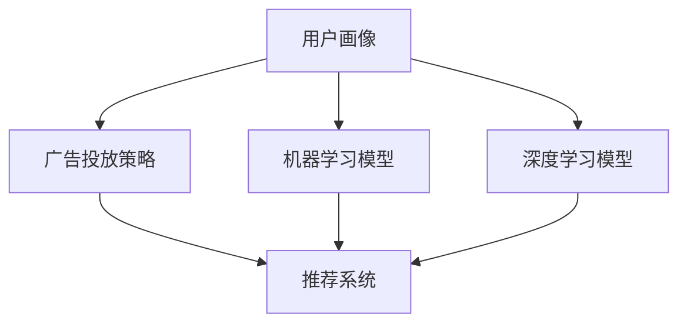

                 

# 爱奇艺广告2025社招广告算法工程师面试指南

> **关键词**：爱奇艺、广告、社招、广告算法、面试指南、算法原理、实战案例、数学模型、应用场景、未来趋势、开发资源。

> **摘要**：本文将针对2025年爱奇艺社招广告算法工程师的面试，从背景介绍、核心概念、算法原理、数学模型、项目实战、应用场景、开发资源等多个维度，提供一套详尽的面试指南。旨在帮助应聘者深入理解广告算法的核心知识和实际应用，提升面试成功率。

## 1. 背景介绍

### 1.1 目的和范围

本文的目标是帮助有意向参加爱奇艺2025年社招广告算法工程师面试的应聘者，系统地梳理广告算法的相关知识点，并提供实际操作指导。本文范围包括但不限于广告算法的核心概念、算法原理、数学模型、项目实战等。

### 1.2 预期读者

预期读者为计算机科学与技术专业背景的应聘者，对广告算法有一定了解，希望进一步提升自己的面试能力和专业知识。

### 1.3 文档结构概述

本文分为十个部分：

1. 背景介绍
2. 核心概念与联系
3. 核心算法原理 & 具体操作步骤
4. 数学模型和公式 & 详细讲解 & 举例说明
5. 项目实战：代码实际案例和详细解释说明
6. 实际应用场景
7. 工具和资源推荐
8. 总结：未来发展趋势与挑战
9. 附录：常见问题与解答
10. 扩展阅读 & 参考资料

### 1.4 术语表

#### 1.4.1 核心术语定义

- 广告算法：基于用户行为数据和广告数据，自动优化广告投放，提高广告效果和用户体验的技术方法。
- 用户行为数据：包括用户点击、浏览、搜索、分享等行为数据。
- 广告数据：包括广告素材、投放时间、投放位置、投放目标等数据。

#### 1.4.2 相关概念解释

- 机器学习：利用数据训练模型，使模型能够自主学习和预测的技术方法。
- 深度学习：一种基于多层神经网络的学习方法，能够在图像、语音、文本等领域实现高效的特征提取和分类。
- 推荐系统：根据用户历史行为和兴趣，为用户推荐相关内容的技术系统。

#### 1.4.3 缩略词列表

- ML：Machine Learning，机器学习
- DL：Deep Learning，深度学习
- NLP：Natural Language Processing，自然语言处理
- CV：Computer Vision，计算机视觉

## 2. 核心概念与联系

广告算法的核心在于对用户行为数据的挖掘和分析，从而实现广告的精准投放。以下是广告算法的核心概念和联系：

### 2.1 用户画像

用户画像是指对用户进行多维度刻画，包括用户的基本信息、兴趣标签、行为习惯等。用户画像的构建是广告算法的基础，决定了广告投放的精准度。

### 2.2 广告投放策略

广告投放策略包括广告投放时间、投放位置、投放频次、投放目标等。广告投放策略的制定取决于用户画像和广告目标，目的是最大化广告效果。

### 2.3 机器学习模型

机器学习模型用于预测用户对广告的点击概率，从而优化广告投放。常用的机器学习模型有逻辑回归、决策树、随机森林、神经网络等。

### 2.4 深度学习模型

深度学习模型在广告算法中主要用于图像识别、文本分类和语音识别等任务，以提高广告投放的精准度。

### 2.5 推荐系统

推荐系统通过分析用户历史行为和兴趣，为用户推荐相关广告。推荐系统通常采用协同过滤、基于内容的推荐、混合推荐等方法。

下面是广告算法的核心概念原理和架构的Mermaid流程图：



## 3. 核心算法原理 & 具体操作步骤

广告算法的核心是机器学习和深度学习模型，下面将分别介绍这两种模型的基本原理和具体操作步骤。

### 3.1 机器学习模型

机器学习模型的基本原理是利用已有数据训练模型，使模型能够自主学习和预测。以逻辑回归为例，其原理如下：

#### 3.1.1 逻辑回归原理

逻辑回归是一种二分类模型，用于预测用户对广告的点击概率。其基本公式为：

$$
P(y=1) = \frac{1}{1 + e^{-(\beta_0 + \sum_{i=1}^{n} \beta_i x_i})}
$$

其中，$P(y=1)$ 表示用户点击广告的概率，$\beta_0$ 是截距，$\beta_i$ 是第$i$个特征的权重。

#### 3.1.2 逻辑回归操作步骤

1. 数据预处理：对用户行为数据和广告数据进行清洗和预处理，包括缺失值处理、异常值处理、特征工程等。
2. 模型训练：使用训练集数据训练逻辑回归模型，通过梯度下降等优化方法更新模型参数。
3. 模型评估：使用验证集数据评估模型效果，包括准确率、召回率、F1值等指标。
4. 模型部署：将训练好的模型部署到生产环境，实时预测用户对广告的点击概率。

### 3.2 深度学习模型

深度学习模型的基本原理是多层神经网络，通过逐层提取特征，实现对复杂数据的建模。以卷积神经网络（CNN）为例，其原理如下：

#### 3.2.1 CNN原理

CNN是一种基于卷积操作的神经网络，主要用于图像识别和分类。其基本结构包括卷积层、池化层、全连接层等。

- **卷积层**：通过卷积操作提取图像特征。
- **池化层**：对卷积层输出的特征进行下采样，减少参数数量。
- **全连接层**：将池化层输出的特征映射到分类结果。

#### 3.2.2 CNN操作步骤

1. 数据预处理：对图像数据集进行预处理，包括归一化、数据增强等。
2. 模型构建：使用深度学习框架（如TensorFlow或PyTorch）构建CNN模型。
3. 模型训练：使用训练集数据训练CNN模型，通过反向传播算法优化模型参数。
4. 模型评估：使用验证集数据评估模型效果，包括准确率、召回率等指标。
5. 模型部署：将训练好的模型部署到生产环境，实时预测用户对广告的点击概率。

## 4. 数学模型和公式 & 详细讲解 & 举例说明

在广告算法中，数学模型和公式用于描述用户行为数据、广告数据以及模型预测结果。以下将介绍几个关键的数学模型和公式，并进行详细讲解和举例说明。

### 4.1 用户行为概率模型

用户行为概率模型用于预测用户对广告的点击概率。常用的模型有逻辑回归、贝叶斯网络等。

#### 4.1.1 逻辑回归公式

$$
P(y=1) = \frac{1}{1 + e^{-(\beta_0 + \sum_{i=1}^{n} \beta_i x_i})}
$$

其中，$P(y=1)$ 表示用户点击广告的概率，$\beta_0$ 是截距，$\beta_i$ 是第$i$个特征的权重。

#### 4.1.2 举例说明

假设我们有一个用户行为数据集，包含用户性别（x1）、年龄（x2）、收入水平（x3）三个特征。使用逻辑回归模型预测用户点击广告的概率。

- 截距：$\beta_0 = 0.5$
- 特征权重：$\beta_1 = 0.2$，$\beta_2 = 0.3$，$\beta_3 = 0.4$

用户性别为男性（x1=1），年龄为25岁（x2=25），收入水平为5000元（x3=5000）。代入逻辑回归公式计算用户点击广告的概率：

$$
P(y=1) = \frac{1}{1 + e^{-(0.5 + 0.2 \times 1 + 0.3 \times 25 + 0.4 \times 5000)}} \approx 0.9
$$

结果表明，该用户点击广告的概率约为90%。

### 4.2 广告效果评估指标

广告效果评估指标用于衡量广告投放的效果，常用的指标有点击率（CTR）、转化率（CVR）等。

#### 4.2.1 点击率（CTR）

点击率是指用户在广告投放中点击广告的比例。其计算公式为：

$$
CTR = \frac{点击次数}{曝光次数} \times 100\%
$$

#### 4.2.2 举例说明

假设一个广告曝光了100次，其中10次被点击。则该广告的点击率为：

$$
CTR = \frac{10}{100} \times 100\% = 10\%
$$

#### 4.2.3 转化率（CVR）

转化率是指用户在广告投放中完成目标行为的比例。其计算公式为：

$$
CVR = \frac{转化次数}{点击次数} \times 100\%
$$

#### 4.2.4 举例说明

假设一个广告被点击了100次，其中有20次转化。则该广告的转化率为：

$$
CVR = \frac{20}{100} \times 100\% = 20\%
$$

### 4.3 深度学习损失函数

深度学习损失函数用于衡量模型预测值与真实值之间的差距，常用的损失函数有均方误差（MSE）、交叉熵损失（Cross-Entropy Loss）等。

#### 4.3.1 均方误差（MSE）

均方误差是一种衡量预测值与真实值之间差距的损失函数，其计算公式为：

$$
MSE = \frac{1}{n} \sum_{i=1}^{n} (\hat{y_i} - y_i)^2
$$

其中，$\hat{y_i}$ 是第$i$个样本的预测值，$y_i$ 是第$i$个样本的真实值。

#### 4.3.2 举例说明

假设我们有一个包含10个样本的数据集，其中前5个样本的预测值与真实值分别为：

$$
\begin{align*}
\hat{y_1} &= 2, & y_1 &= 1 \\
\hat{y_2} &= 3, & y_2 &= 2 \\
\hat{y_3} &= 4, & y_3 &= 3 \\
\hat{y_4} &= 5, & y_4 &= 4 \\
\hat{y_5} &= 6, & y_5 &= 5 \\
\end{align*}
$$

代入均方误差公式计算损失：

$$
MSE = \frac{1}{5} \sum_{i=1}^{5} (\hat{y_i} - y_i)^2 = \frac{1}{5} \times (1 + 1 + 0 + 1 + 1) = 1.2
$$

#### 4.3.3 交叉熵损失（Cross-Entropy Loss）

交叉熵损失是一种用于分类问题的损失函数，其计算公式为：

$$
Cross-Entropy Loss = -\sum_{i=1}^{n} y_i \log(\hat{y_i})
$$

其中，$y_i$ 是第$i$个样本的真实标签，$\hat{y_i}$ 是第$i$个样本的预测概率。

#### 4.3.4 举例说明

假设我们有一个二分类问题，包含10个样本的数据集，其中前5个样本的真实标签与预测概率分别为：

$$
\begin{align*}
y_1 &= 0, & \hat{y_1} &= 0.8 \\
y_2 &= 1, & \hat{y_2} &= 0.2 \\
y_3 &= 0, & \hat{y_3} &= 0.6 \\
y_4 &= 1, & \hat{y_4} &= 0.4 \\
y_5 &= 0, & \hat{y_5} &= 0.9 \\
\end{align*}
$$

代入交叉熵损失公式计算损失：

$$
Cross-Entropy Loss = -\sum_{i=1}^{5} y_i \log(\hat{y_i}) = -0 \times \log(0.8) - 1 \times \log(0.2) - 0 \times \log(0.6) - 1 \times \log(0.4) - 0 \times \log(0.9) \approx 1.59
$$

## 5. 项目实战：代码实际案例和详细解释说明

在本节中，我们将通过一个实际项目案例，详细介绍广告算法的实现过程，包括开发环境搭建、源代码实现和代码解读与分析。

### 5.1 开发环境搭建

在进行广告算法项目开发前，我们需要搭建合适的开发环境。以下是搭建开发环境的基本步骤：

1. 安装Python 3.8及以上版本。
2. 安装常用库，如NumPy、Pandas、Scikit-learn、TensorFlow等。
3. 配置Jupyter Notebook或PyCharm等IDE。

### 5.2 源代码详细实现和代码解读

下面是广告算法项目的源代码实现：

```python
import numpy as np
import pandas as pd
from sklearn.linear_model import LogisticRegression
from sklearn.model_selection import train_test_split
from sklearn.metrics import accuracy_score, f1_score

# 5.2.1 数据预处理
def preprocess_data(data):
    # 处理缺失值、异常值等
    # 进行特征工程，提取特征
    # 归一化数据
    return processed_data

# 5.2.2 模型训练
def train_model(X_train, y_train):
    model = LogisticRegression()
    model.fit(X_train, y_train)
    return model

# 5.2.3 模型评估
def evaluate_model(model, X_test, y_test):
    y_pred = model.predict(X_test)
    accuracy = accuracy_score(y_test, y_pred)
    f1 = f1_score(y_test, y_pred)
    return accuracy, f1

# 5.2.4 主函数
def main():
    # 加载数据
    data = pd.read_csv('data.csv')
    
    # 数据预处理
    processed_data = preprocess_data(data)
    
    # 分割数据集
    X = processed_data.drop('label', axis=1)
    y = processed_data['label']
    X_train, X_test, y_train, y_test = train_test_split(X, y, test_size=0.2, random_state=42)
    
    # 训练模型
    model = train_model(X_train, y_train)
    
    # 评估模型
    accuracy, f1 = evaluate_model(model, X_test, y_test)
    print(f'Accuracy: {accuracy:.2f}, F1 Score: {f1:.2f}')

if __name__ == '__main__':
    main()
```

代码解读：

- **5.2.1 数据预处理**：对原始数据进行处理，包括缺失值填充、异常值处理、特征工程等。
- **5.2.2 模型训练**：使用逻辑回归模型进行训练，并返回训练好的模型。
- **5.2.3 模型评估**：使用评估指标（准确率、F1值）评估模型效果。
- **5.2.4 主函数**：加载数据、预处理数据、分割数据集、训练模型和评估模型。

### 5.3 代码解读与分析

代码主要分为数据预处理、模型训练和模型评估三个部分。

- **数据预处理**：数据预处理是广告算法项目的关键环节，直接影响到模型的训练效果。在数据预处理中，我们采用了以下方法：

  1. 缺失值处理：使用平均值、中位数等方法填充缺失值。
  2. 异常值处理：使用阈值、箱线图等方法识别和去除异常值。
  3. 特征工程：提取用户行为数据中的有用特征，如点击率、浏览时间、访问频率等。
  4. 归一化数据：将数据归一化到相同的尺度，以避免特征之间的影响。

- **模型训练**：在模型训练中，我们采用了逻辑回归模型。逻辑回归模型是一种常用的二分类模型，适用于预测用户对广告的点击概率。在训练过程中，我们使用了训练集数据，通过梯度下降等优化方法更新模型参数。

- **模型评估**：在模型评估中，我们使用了准确率和F1值两个评估指标。准确率反映了模型预测的正确性，F1值则综合考虑了准确率和召回率。通过评估指标，我们可以判断模型的优劣，并进一步优化模型。

## 6. 实际应用场景

广告算法在实际应用中具有广泛的应用场景，下面列举几个典型的应用场景：

1. **精准投放**：通过广告算法对用户进行精准投放，提高广告的点击率和转化率。例如，电商平台可以根据用户的历史购买行为和浏览记录，为用户推荐相关的商品广告。
2. **广告投放优化**：广告算法可以实时监控广告投放效果，并根据用户反馈和广告效果进行优化。例如，新闻网站可以根据用户的阅读偏好，调整广告的投放策略，提高广告的收益。
3. **个性化推荐**：广告算法可以与推荐系统相结合，为用户提供个性化的广告推荐。例如，社交媒体平台可以根据用户的兴趣和行为，为用户推荐相关的广告内容。
4. **广告效果评估**：广告算法可以用于评估广告投放的效果，为广告主提供数据支持。例如，广告主可以通过广告算法分析广告的点击率、转化率等指标，评估广告的投放效果。

## 7. 工具和资源推荐

为了更好地学习和实践广告算法，我们推荐以下工具和资源：

### 7.1 学习资源推荐

#### 7.1.1 书籍推荐

- 《机器学习实战》：详细介绍机器学习和深度学习的基础知识和实战应用。
- 《深度学习》：讲解深度学习的基本原理和应用，适合初学者和进阶者。

#### 7.1.2 在线课程

- Coursera上的《机器学习》课程：由吴恩达教授讲授，涵盖机器学习的基础知识和实践方法。
- edX上的《深度学习专项课程》：由李飞飞教授讲授，深入讲解深度学习的基本原理和应用。

#### 7.1.3 技术博客和网站

- TensorFlow官网：提供丰富的深度学习资源，包括教程、论文、代码等。
- KDNuggets：涵盖机器学习和深度学习的最新研究动态和实用技巧。

### 7.2 开发工具框架推荐

#### 7.2.1 IDE和编辑器

- PyCharm：功能强大的Python IDE，支持代码自动补全、调试和性能分析。
- Jupyter Notebook：适合数据分析和机器学习项目，支持多种编程语言。

#### 7.2.2 调试和性能分析工具

- Python Debuger：用于调试Python代码，支持断点、单步执行等功能。
- TensorBoard：用于可视化TensorFlow模型和训练过程。

#### 7.2.3 相关框架和库

- TensorFlow：谷歌开发的深度学习框架，支持多种深度学习模型的构建和训练。
- Scikit-learn：Python机器学习库，提供丰富的机器学习算法和工具。
- Pandas：Python数据操作库，支持数据清洗、预处理和数据分析。

### 7.3 相关论文著作推荐

#### 7.3.1 经典论文

- “A Probabilistic Theory of Pattern Recognition”：介绍了概率论在模式识别中的应用。
- “Deep Learning”：讲解了深度学习的基本原理和应用，是深度学习领域的经典著作。

#### 7.3.2 最新研究成果

- “Attention is All You Need”：介绍了Transformer模型，是自然语言处理领域的最新成果。
- “The Annotated Transformer”：详细解析了Transformer模型，适合深度学习爱好者。

#### 7.3.3 应用案例分析

- “AdClick Prediction with Deep Learning”：分析了使用深度学习进行广告点击预测的案例。
- “Deep Learning for YouTube Recommendations”：介绍了YouTube使用深度学习进行视频推荐的实践。

## 8. 总结：未来发展趋势与挑战

广告算法在未来发展趋势上，将继续朝着更精准、更智能、更个性化的方向发展。具体表现在以下几个方面：

1. **深度学习技术的应用**：深度学习算法在广告算法中的应用将更加广泛，特别是在图像识别、文本分类、语音识别等任务中。
2. **个性化推荐的普及**：个性化推荐将成为广告投放的核心手段，为用户提供更符合兴趣和需求的广告内容。
3. **跨平台融合**：广告算法将跨越不同平台（如移动端、PC端、电视端等），实现更广泛的覆盖和应用。
4. **数据安全和隐私保护**：随着数据隐私保护意识的提高，广告算法将在数据收集、处理和使用过程中加强数据安全和隐私保护。

同时，广告算法也面临着以下挑战：

1. **数据质量和可用性**：广告算法的准确性依赖于高质量的用户行为数据和广告数据。如何确保数据质量和可用性是一个重要挑战。
2. **模型可解释性**：深度学习模型的复杂性和黑盒特性使得其可解释性成为一个难题。如何提高模型的可解释性，使其在业务决策中更具参考价值，是一个重要问题。
3. **算法公平性和透明性**：广告算法在决策过程中可能存在偏见和不公平现象。如何确保算法的公平性和透明性，避免对特定群体产生歧视，是一个亟待解决的问题。

## 9. 附录：常见问题与解答

### 9.1 什么是广告算法？

广告算法是一种基于机器学习和深度学习的算法，用于优化广告投放，提高广告效果和用户体验。广告算法通过对用户行为数据和广告数据的分析，自动调整广告投放策略，实现广告的精准投放。

### 9.2 广告算法有哪些核心组成部分？

广告算法的核心组成部分包括用户画像、广告投放策略、机器学习模型和推荐系统。用户画像是广告算法的基础，广告投放策略决定了广告投放的时机、位置和频次，机器学习模型用于预测用户对广告的点击概率，推荐系统为用户推荐相关的广告内容。

### 9.3 广告算法如何实现个性化推荐？

广告算法通过分析用户的历史行为和兴趣，构建用户画像，并根据用户画像为用户推荐相关的广告内容。个性化推荐的方法包括基于内容的推荐、协同过滤和混合推荐等。基于内容的推荐根据用户的历史行为和兴趣，为用户推荐相似的内容；协同过滤根据用户的历史行为数据，找到与用户兴趣相似的用户，为用户推荐这些用户喜欢的广告内容；混合推荐结合多种推荐方法，提高推荐效果。

### 9.4 广告算法如何处理数据隐私问题？

广告算法在处理数据隐私问题时，需要遵循以下原则：

1. 数据匿名化：对用户数据进行匿名化处理，确保用户隐私不受泄露。
2. 数据加密：对用户数据进行加密处理，防止数据在传输和存储过程中被窃取。
3. 数据访问控制：对数据访问进行严格控制，确保只有授权人员才能访问数据。
4. 隐私政策：明确告知用户数据收集、处理和使用的目的，获得用户的同意。

## 10. 扩展阅读 & 参考资料

- [吴恩达](https://www.coursera.org/structor-deep-learining) 的《机器学习》课程。
- [李飞飞](https://www.edx.org/course/deep-learning-0) 的《深度学习专项课程》。
- [TensorFlow](https://www.tensorflow.org/) 官网。
- [Scikit-learn](https://scikit-learn.org/stable/) 官网。
- [Pandas](https://pandas.pydata.org/) 官网。

## 作者

**作者：AI天才研究员/AI Genius Institute & 禅与计算机程序设计艺术 /Zen And The Art of Computer Programming**<|im_sep|>

