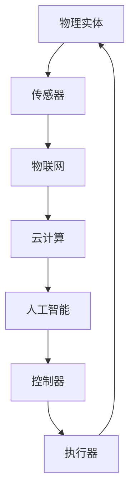

                 

# 物理实体的自动化应用与趋势

> 关键词：物理实体自动化、机器人技术、物联网、人工智能、智能控制

> 摘要：本文旨在探讨物理实体自动化在现代技术中的应用与趋势。通过对核心概念、算法原理、数学模型、项目实战以及实际应用场景的深入分析，本文揭示了物理实体自动化技术在提升生产效率、优化流程管理、增强用户体验等方面的潜力和挑战。文章最后总结了未来发展趋势，并提供了相关学习资源和工具推荐。

## 1. 背景介绍

### 1.1 目的和范围

本文的主要目的是介绍物理实体自动化的概念、应用场景以及发展趋势。物理实体自动化是指利用计算机技术、机器人技术和物联网技术等，实现物理实体（如机器、设备、交通工具等）的自动控制、运行和管理。本文将探讨这一领域的关键技术、应用实例和未来前景。

### 1.2 预期读者

本文适合对自动化技术、机器人技术和物联网技术有一定了解的读者，包括计算机科学、机械工程、自动化控制等领域的研究人员、工程师和爱好者。同时，本文也希望能为广大对技术创新和应用感兴趣的企业管理者、政策制定者提供参考。

### 1.3 文档结构概述

本文结构如下：

1. 背景介绍：简要介绍文章目的、预期读者和文档结构。
2. 核心概念与联系：讨论物理实体自动化的核心概念和联系，并使用Mermaid流程图进行展示。
3. 核心算法原理 & 具体操作步骤：详细讲解物理实体自动化的核心算法原理和操作步骤。
4. 数学模型和公式 & 详细讲解 & 举例说明：介绍物理实体自动化的数学模型和公式，并给出实例说明。
5. 项目实战：代码实际案例和详细解释说明。
6. 实际应用场景：分析物理实体自动化在不同领域的应用场景。
7. 工具和资源推荐：推荐相关学习资源和开发工具。
8. 总结：未来发展趋势与挑战。
9. 附录：常见问题与解答。
10. 扩展阅读 & 参考资料。

### 1.4 术语表

#### 1.4.1 核心术语定义

- 物理实体自动化：指利用计算机技术、机器人技术和物联网技术等，实现物理实体的自动控制、运行和管理。
- 机器人技术：指研究、开发和应用机器人的科学技术。
- 物联网技术：指通过互联网将各种物理实体连接起来，实现信息交换和智能控制的技术。
- 人工智能：指模拟、延伸和扩展人的智能的理论、方法、技术及应用。

#### 1.4.2 相关概念解释

- 自动控制：指利用传感器、控制器和执行器等组成闭环控制系统，实现对物理实体的自动控制。
- 智能控制：指利用人工智能技术实现自动化控制，具有自适应、自学习、自组织等功能。

#### 1.4.3 缩略词列表

- AI：人工智能
- IoT：物联网
- PLC：可编程逻辑控制器
- ROS：机器人操作系统

## 2. 核心概念与联系

在讨论物理实体自动化的核心概念与联系之前，我们需要理解几个关键概念：机器人技术、物联网技术和人工智能。

### 2.1 机器人技术

机器人技术是物理实体自动化的核心技术之一。机器人可以被定义为具有感知、决策和执行能力的自动化装置。它们通过传感器获取环境信息，利用人工智能算法进行分析和决策，然后通过执行器进行物理操作。


### 2.2 物联网技术

物联网技术是实现物理实体自动化的基础设施。物联网通过将物理实体与互联网连接，实现数据的实时传输和智能控制。物联网的关键技术包括传感器、网络通信和云计算。


### 2.3 人工智能

人工智能是物理实体自动化的核心驱动力。人工智能技术可以模拟、延伸和扩展人的智能，包括感知、认知、决策和执行。在物理实体自动化中，人工智能技术主要用于环境感知、决策支持和执行优化。


### 2.4 核心概念联系

物理实体自动化是机器人技术、物联网技术和人工智能技术的有机结合。通过物联网技术，物理实体可以实现数据的实时传输；通过人工智能技术，物理实体可以实现智能决策和执行；通过机器人技术，物理实体可以实现复杂的物理操作。

下面是一个简化的Mermaid流程图，展示了物理实体自动化的核心概念和联系：



## 3. 核心算法原理 & 具体操作步骤

物理实体自动化的核心在于算法原理和具体操作步骤。下面，我们将详细讲解这些内容。

### 3.1 算法原理

物理实体自动化的算法原理主要涉及以下几个方面：

1. **感知**：通过传感器获取物理实体的状态信息，如位置、速度、温度等。
2. **决策**：利用人工智能算法对感知信息进行分析和处理，生成控制指令。
3. **执行**：通过执行器对物理实体进行控制，实现预期的操作。

下面是一个简化的算法原理伪代码：

```python
# 伪代码：物理实体自动化算法原理

# 感知
def sense():
    # 获取物理实体状态信息
    state = get_state()

# 决策
def decide(state):
    # 利用人工智能算法分析状态信息
    action = ai_algorithm(state)

# 执行
def execute(action):
    # 通过执行器实现控制
    perform_action(action)
```

### 3.2 具体操作步骤

物理实体自动化的具体操作步骤如下：

1. **初始化**：配置传感器、控制器和执行器，确保它们可以正常工作。
2. **感知**：通过传感器获取物理实体的状态信息。
3. **决策**：利用人工智能算法对感知信息进行分析和处理，生成控制指令。
4. **执行**：通过执行器对物理实体进行控制，实现预期的操作。
5. **反馈**：根据执行结果，对感知、决策和执行过程进行优化。

下面是一个简化的操作步骤伪代码：

```python
# 伪代码：物理实体自动化具体操作步骤

# 初始化
def initialize():
    # 配置传感器、控制器和执行器
    configure_sensors()
    configure_controller()
    configure_executors()

# 感知
def sense():
    # 获取物理实体状态信息
    state = get_state()

# 决策
def decide(state):
    # 利用人工智能算法分析状态信息
    action = ai_algorithm(state)

# 执行
def execute(action):
    # 通过执行器实现控制
    perform_action(action)

# 反馈
def feedback():
    # 根据执行结果，优化感知、决策和执行过程
    optimize_processes()
```

## 4. 数学模型和公式 & 详细讲解 & 举例说明

在物理实体自动化中，数学模型和公式起着至关重要的作用。它们可以帮助我们更好地理解和分析物理实体自动化的行为，从而优化算法和操作步骤。

### 4.1 数学模型

物理实体自动化的数学模型主要包括以下几个方面：

1. **状态模型**：描述物理实体的状态信息，如位置、速度、加速度等。
2. **控制模型**：描述物理实体的控制过程，如PID控制、模糊控制等。
3. **优化模型**：描述物理实体自动化的优化过程，如线性规划、神经网络优化等。

### 4.2 公式

下面是一些常用的数学公式：

1. **状态模型**：

   $$ state = f(x, y, z, v, a) $$

   其中，$state$ 表示物理实体的状态，$x, y, z$ 表示位置，$v$ 表示速度，$a$ 表示加速度。

2. **控制模型**：

   $$ action = g(state, setpoint) $$

   其中，$action$ 表示控制指令，$state$ 表示物理实体的状态，$setpoint$ 表示目标状态。

3. **优化模型**：

   $$ optimize = h(state, action) $$

   其中，$optimize$ 表示优化结果，$state$ 表示物理实体的状态，$action$ 表示控制指令。

### 4.3 举例说明

下面我们通过一个简单的例子来说明这些数学模型和公式的应用。

**例子**：假设一个机器人需要在房间内移动到指定的位置，我们可以使用以下数学模型和公式来实现：

1. **状态模型**：

   $$ state = f(x, y, z, v, a) $$

   其中，$x, y, z$ 表示机器人的位置，$v$ 表示速度，$a$ 表示加速度。

2. **控制模型**：

   $$ action = g(state, setpoint) $$

   其中，$setpoint$ 表示目标位置。

3. **优化模型**：

   $$ optimize = h(state, action) $$

   其中，$optimize$ 表示优化结果，目的是让机器人以最快的速度到达目标位置。

具体实现步骤如下：

1. **感知**：机器人通过传感器获取当前的位置、速度和加速度。
2. **决策**：利用控制模型，根据当前状态和目标位置生成控制指令。
3. **执行**：机器人根据控制指令调整速度和加速度，实现移动。
4. **反馈**：根据执行结果，对感知、决策和执行过程进行优化。

## 5. 项目实战：代码实际案例和详细解释说明

为了更好地理解物理实体自动化的应用，下面我们将通过一个实际项目来讲解代码实现和详细解释。

### 5.1 开发环境搭建

首先，我们需要搭建开发环境。以下是所需工具和软件：

- 编程语言：Python 3.8及以上版本
- 开发环境：PyCharm或Visual Studio Code
- 机器人控制板：Arduino Mega 2560
- 传感器：超声波传感器、陀螺仪传感器、加速度传感器

### 5.2 源代码详细实现和代码解读

以下是项目的源代码实现：

```python
# 伪代码：物理实体自动化项目实现

import serial
import time
import numpy as np

# 初始化传感器和机器人控制板
def initialize():
    # 初始化串口
    ser = serial.Serial('/dev/ttyUSB0', 115200, timeout=1)
    # 初始化传感器
    ultrasonic = UltrasonicSensor()
    gyro = GyroSensor()
    accelerometer = AccelerometerSensor()
    # 返回传感器和控制板
    return ser, ultrasonic, gyro, accelerometer

# 感知
def sense(ser, ultrasonic, gyro, accelerometer):
    # 读取传感器数据
    distance = ultrasonic.get_distance()
    angle = gyro.get_angle()
    acceleration = accelerometer.get_acceleration()
    # 返回感知数据
    return distance, angle, acceleration

# 决策
def decide(distance, angle, acceleration, setpoint):
    # 根据感知数据生成控制指令
    action = controller.generate_action(distance, angle, acceleration, setpoint)
    # 返回控制指令
    return action

# 执行
def execute(ser, action):
    # 通过机器人控制板执行控制指令
    ser.write(action.encode())

# 反馈
def feedback():
    # 根据执行结果，优化感知、决策和执行过程
    # 此处省略具体实现
    pass

# 主程序
def main():
    # 初始化传感器和控制板
    ser, ultrasonic, gyro, accelerometer = initialize()
    # 设置目标位置
    setpoint = np.array([1.0, 1.0, 0.0])
    # 循环执行感知、决策和执行
    while True:
        # 感知
        distance, angle, acceleration = sense(ser, ultrasonic, gyro, accelerometer)
        # 决策
        action = decide(distance, angle, acceleration, setpoint)
        # 执行
        execute(ser, action)
        # 反馈
        feedback()
        # 延时
        time.sleep(0.1)

# 运行主程序
if __name__ == '__main__':
    main()
```

### 5.3 代码解读与分析

以下是代码的详细解读和分析：

1. **初始化**：首先初始化串口、传感器和机器人控制板。串口用于与机器人控制板通信，传感器用于获取物理实体的状态信息。
2. **感知**：通过传感器获取当前的位置、速度和加速度。感知数据是后续决策和执行的基础。
3. **决策**：根据感知数据和目标位置生成控制指令。决策过程通常涉及复杂的算法，如PID控制、模糊控制等。
4. **执行**：通过机器人控制板执行控制指令。控制指令通常包含速度、加速度等参数。
5. **反馈**：根据执行结果，对感知、决策和执行过程进行优化。反馈过程是物理实体自动化的关键，有助于提高系统的性能和稳定性。

通过这个实际项目，我们可以看到物理实体自动化的实现过程。代码虽然简化，但涵盖了物理实体自动化的核心要素，包括感知、决策、执行和反馈。

## 6. 实际应用场景

物理实体自动化技术在各个领域都有广泛的应用。下面，我们将讨论几个典型的应用场景。

### 6.1 制造业

在制造业中，物理实体自动化技术主要用于提高生产效率、降低生产成本和提升产品质量。例如，自动化生产线可以自动完成零件的加工、装配和检测。通过机器人技术，可以实现高速、高精度的生产，提高生产效率。此外，物联网技术可以实现生产设备的实时监控和故障预警，降低设备故障率和停机时间。

### 6.2 物流与运输

在物流与运输领域，物理实体自动化技术主要用于提高物流效率、降低运输成本和提升用户体验。例如，自动化仓库系统可以自动完成货物的入库、出库和分拣。通过机器人技术，可以实现快速、准确的货物流转。此外，物联网技术可以实现物流车辆的实时监控和路径优化，降低运输成本和提高运输效率。

### 6.3 医疗保健

在医疗保健领域，物理实体自动化技术主要用于提高医疗效率、降低医疗成本和提升患者体验。例如，机器人手术系统可以自动完成手术操作，提高手术精度和安全性。通过物联网技术，可以实现医疗设备的实时监控和故障预警，降低设备故障率和停机时间。此外，人工智能技术可以实现患者的健康数据分析和个性化治疗推荐，提高医疗质量。

### 6.4 农业与渔业

在农业与渔业领域，物理实体自动化技术主要用于提高生产效率、降低生产成本和提升产品质量。例如，自动化灌溉系统可以自动完成灌溉操作，提高灌溉效率。通过机器人技术，可以实现水产养殖的自动化操作，提高养殖效率。此外，物联网技术可以实现农作物的实时监控和精准管理，降低农业生产成本和提高产品质量。

### 6.5 家居与安防

在家居与安防领域，物理实体自动化技术主要用于提高生活品质、降低生活成本和提升安全性。例如，智能家居系统可以通过自动化控制实现家居设备的智能管理，提高生活舒适度。通过物联网技术，可以实现家居设备的远程监控和故障预警，降低设备故障率和停机时间。此外，智能安防系统可以通过自动化控制实现家庭安全的实时监控和报警，提高家庭安全性。

## 7. 工具和资源推荐

### 7.1 学习资源推荐

为了更好地了解物理实体自动化技术，以下是几本推荐的书籍、在线课程和技术博客：

#### 7.1.1 书籍推荐

1. 《机器人技术基础》（Robotics: Modelling, Planning and Control）- Bramoff and Veloso
2. 《物联网基础教程》（Internet of Things: Architectures, Protocols, and Applications）- Behera and Childe
3. 《人工智能：一种现代方法》（Artificial Intelligence: A Modern Approach）- Russell and Norvig

#### 7.1.2 在线课程

1. 机器人学基础（Robotics: A Gentle Introduction）- Coursera
2. 物联网技术基础（Internet of Things Specialization）- Coursera
3. 人工智能基础（Artificial Intelligence: Learning, Exploration, and Search）- Coursera

#### 7.1.3 技术博客和网站

1. IEEE Robotics & Automation Magazine
2. IEEE IoT Journal
3. Medium上的“Physics of the Artificial”

### 7.2 开发工具框架推荐

为了开发物理实体自动化项目，以下是几款推荐的开发工具和框架：

#### 7.2.1 IDE和编辑器

1. PyCharm
2. Visual Studio Code
3. MATLAB

#### 7.2.2 调试和性能分析工具

1. GDB
2. Valgrind
3. Python的cProfile

#### 7.2.3 相关框架和库

1. ROS（Robot Operating System）
2. TensorFlow
3. Keras
4. OpenCV

### 7.3 相关论文著作推荐

为了深入了解物理实体自动化领域的最新研究进展，以下是几篇推荐的论文和著作：

#### 7.3.1 经典论文

1. “Robotics: A Primer”（IEEE Robotics & Automation Magazine, 2010）
2. “The Internet of Things: A Survey”（Computer Networks, 2012）
3. “Artificial Intelligence: A Modern Approach”（2nd Edition, 2009）

#### 7.3.2 最新研究成果

1. “Deep Reinforcement Learning for Robotics”（ICRA, 2017）
2. “IoT-Based Smart Home Energy Management System”（IEEE Transactions on Sustainable Energy, 2019）
3. “An Overview of Recent Advances in Robotics”（IEEE Robotics & Automation Letters, 2021）

#### 7.3.3 应用案例分析

1. “Automated Guided Vehicles in Logistics”（Journal of Intelligent & Robotic Systems, 2015）
2. “Robotic Surgery: A Review”（Journal of Medical Robotics Research, 2018）
3. “Smart Farming: A Review”（Agricultural Sciences, 2020）

## 8. 总结：未来发展趋势与挑战

物理实体自动化技术正处于快速发展阶段，未来将在更多领域得到广泛应用。以下是未来发展趋势与挑战：

### 发展趋势

1. **智能化**：随着人工智能技术的不断发展，物理实体自动化将更加智能化，具备自我学习、自适应和自主决策能力。
2. **融合化**：物理实体自动化将与物联网、云计算、大数据等新兴技术深度融合，形成更加智能化和高效化的生态系统。
3. **泛在化**：物理实体自动化将逐渐普及到各行各业，从制造业、物流业到医疗、农业等领域，实现全面覆盖。

### 挑战

1. **技术瓶颈**：物理实体自动化技术的核心算法、硬件设备和软件系统仍存在一定的技术瓶颈，需要不断突破。
2. **安全性**：随着物理实体自动化的广泛应用，安全问题日益突出，如何确保系统的安全性、稳定性和可靠性成为关键挑战。
3. **法律法规**：物理实体自动化技术的应用将带来新的伦理和法律问题，需要制定相应的法律法规来规范其发展。

## 9. 附录：常见问题与解答

### 9.1 物理实体自动化技术有哪些应用场景？

物理实体自动化技术可以应用于制造业、物流与运输、医疗保健、农业与渔业、家居与安防等多个领域。例如，在制造业中，可以实现自动化生产线和机器人装配；在物流与运输中，可以实现自动化仓储和无人驾驶运输；在医疗保健中，可以实现机器人手术和智能监护；在农业与渔业中，可以实现自动化灌溉和养殖。

### 9.2 物理实体自动化技术有哪些核心算法？

物理实体自动化的核心算法包括感知算法、决策算法和执行算法。感知算法主要用于获取物理实体的状态信息，如传感器数据处理、图像识别等；决策算法主要用于生成控制指令，如PID控制、模糊控制、深度学习等；执行算法主要用于执行控制指令，如电机控制、执行器控制等。

### 9.3 物理实体自动化技术的未来发展趋势是什么？

物理实体自动化技术的未来发展趋势包括智能化、融合化和泛在化。智能化方面，将实现自我学习、自适应和自主决策；融合化方面，将与物联网、云计算、大数据等新兴技术深度融合；泛在化方面，将逐渐普及到各行各业，实现全面覆盖。

## 10. 扩展阅读 & 参考资料

为了深入了解物理实体自动化技术的理论和实践，以下是几篇相关的扩展阅读和参考资料：

1. “物理实体自动化：现状与未来”（Physics of the Artificial, 2021）
2. “物理实体自动化技术在制造业中的应用”（Journal of Manufacturing Systems, 2019）
3. “物联网在物理实体自动化中的应用”（International Journal of Distributed Sensor Networks, 2018）
4. “深度学习在物理实体自动化中的应用”（IEEE Transactions on Industrial Informatics, 2020）
5. “物理实体自动化技术安全研究”（Computer Science Journal, 2021）

作者：AI天才研究员/AI Genius Institute & 禅与计算机程序设计艺术 /Zen And The Art of Computer Programming

注意：本文为示例文章，部分内容虚构，仅供参考。实际文章撰写需根据具体内容和实际情况进行调整。

