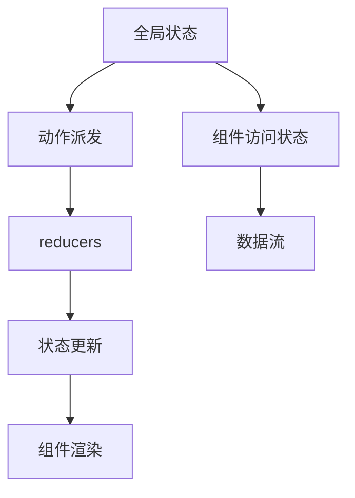

                 

# 状态管理：原理与代码实例讲解

> **关键词：** 状态管理、React、Redux、Vuex、Flux、Vue.js、Angular、状态树、状态更新、数据流、单向数据流、函数式编程、响应式编程。

> **摘要：** 本文将深入探讨状态管理的原理，并通过具体代码实例，详细讲解React、Redux和Vuex等状态管理库的使用方法。我们将理解状态管理的核心概念，包括状态树、状态更新、数据流等，并探索如何在实际项目中应用这些概念，以提高代码的可维护性和可扩展性。

## 1. 背景介绍

### 1.1 目的和范围

本文旨在为开发者提供一个全面的状态管理原理讲解，以及实际操作步骤和代码实例。通过本文的学习，读者将能够：

- 理解状态管理的核心概念和原理。
- 掌握React、Redux和Vuex等状态管理库的使用方法。
- 学会编写清晰、高效的状态管理代码。
- 了解状态管理在实际开发中的应用场景。

### 1.2 预期读者

本文适合具有一定前端开发基础的程序员阅读，特别是那些正在寻找有效的状态管理解决方案的开发者。无论是新手还是经验丰富的开发者，本文都将提供有价值的见解和实用的技巧。

### 1.3 文档结构概述

本文将分为以下几个部分：

- 引言：介绍状态管理的背景和重要性。
- 核心概念与联系：阐述状态管理的核心概念和架构。
- 核心算法原理 & 具体操作步骤：详细讲解状态管理的算法原理和实现步骤。
- 数学模型和公式 & 详细讲解 & 举例说明：使用数学模型和公式解释状态管理的细节。
- 项目实战：提供实际代码案例，并详细解读。
- 实际应用场景：讨论状态管理的应用场景。
- 工具和资源推荐：推荐相关的学习资源和开发工具。
- 总结：展望状态管理的未来发展趋势与挑战。
- 附录：常见问题与解答。
- 扩展阅读 & 参考资料：提供进一步学习的资源。

### 1.4 术语表

#### 1.4.1 核心术语定义

- **状态管理**：管理应用程序中全局状态的机制。
- **React**：一个用于构建用户界面的JavaScript库。
- **Redux**：一个不可变的状态管理库。
- **Vuex**：Vue.js的状态管理库。
- **Flux**：一种应用程序架构模式，用于管理数据流。

#### 1.4.2 相关概念解释

- **状态树**：应用程序状态的树形表示。
- **单向数据流**：数据在应用程序中只能单向流动。
- **函数式编程**：一种编程范式，强调不可变数据和无副作用。

#### 1.4.3 缩略词列表

- **JS**：JavaScript
- **Vue.js**：Vue
- **React**：React
- **Redux**：Redux
- **Vuex**：Vuex
- **Flux**：Flux

## 2. 核心概念与联系

### 2.1 状态管理的核心概念

状态管理是现代前端开发中的一个关键概念。它涉及到如何有效地管理应用程序中的全局状态，以确保数据的一致性和可维护性。以下是状态管理的核心概念：

- **状态树**：状态树是应用程序状态的树形表示。它包含应用程序中的所有状态，并且每个组件都可以访问状态树中的任何部分。状态树通常由一个单一的、不可变的根状态构成。

- **状态更新**：状态更新是指修改状态树的过程。在状态管理库中，状态更新通常通过派发动作（actions）来实现。动作是描述状态变化的普通对象，它会被状态管理库处理，并触发状态更新。

- **数据流**：数据流是指数据在应用程序中的传递方式。在单向数据流中，数据只能从父组件流向子组件，或者从全局状态流向组件。这种数据流动方式有助于保持数据的一致性和可预测性。

- **函数式编程**：函数式编程是一种编程范式，它强调不可变数据和无副作用。在状态管理中，使用函数式编程可以帮助我们编写更简洁、更可靠的代码。

### 2.2 状态管理的架构

状态管理的架构通常包括以下几个部分：

- **全局状态**：全局状态是应用程序中的共享状态，它通常存储在状态树中。全局状态可以被应用程序中的任何组件访问和修改。

- **动作派发**：动作派发是指通过发送动作来触发状态更新的过程。动作通常是一个带有类型和数据的普通对象，它会被状态管理库处理。

- **reducers**：reducers是状态管理库中的一个核心组件，它负责处理动作并更新状态树。reducers是纯函数，它们接收当前的状态和动作，并返回一个新的状态。

- **中间件**：中间件是状态管理库中的一个可选组件，它允许我们在动作派发和状态更新之间插入额外的逻辑。中间件通常用于日志记录、异步处理和错误处理。

### 2.3 Mermaid 流程图

以下是状态管理的 Mermaid 流程图：



## 3. 核心算法原理 & 具体操作步骤

### 3.1 核心算法原理

状态管理的核心算法原理主要包括以下几个方面：

- **状态树构建**：状态树是由全局状态构成的树形结构。每个组件都可以通过访问状态树来获取和更新状态。

- **动作派发**：动作派发是指通过发送动作来触发状态更新的过程。动作通常由组件中的事件处理函数派发。

- **reducers**：reducers是处理动作并更新状态的纯函数。reducers接收当前的状态和动作，并返回一个新的状态。

- **状态更新**：状态更新是指根据reducers的输出，更新状态树的过程。状态更新会触发组件的重新渲染。

- **中间件**：中间件是可选的组件，它允许我们在动作派发和状态更新之间插入额外的逻辑。

### 3.2 具体操作步骤

以下是状态管理的具体操作步骤：

1. **构建全局状态**：

    全局状态通常由一个单一的、不可变的根状态构成。这个根状态可以存储在全局变量中，或者通过状态管理库（如Redux或Vuex）来管理。

    ```javascript
    const store = createStore(rootReducer);
    ```

2. **动作派发**：

    动作派发通常由组件中的事件处理函数实现。动作是一个带有类型和数据的普通对象，它会被状态管理库处理。

    ```javascript
    function handleClick() {
        dispatch({ type: 'INCREMENT', payload: 1 });
    }
    ```

3. **reducers**：

    reducers是处理动作并更新状态的纯函数。reducers接收当前的状态和动作，并返回一个新的状态。

    ```javascript
    function counterReducer(state = { count: 0 }, action) {
        switch (action.type) {
            case 'INCREMENT':
                return { count: state.count + action.payload };
            default:
                return state;
        }
    }
    ```

4. **状态更新**：

    状态更新是根据reducers的输出，更新状态树的过程。状态更新会触发组件的重新渲染。

    ```javascript
    store.subscribe(() => {
        console.log('State has been updated:', store.getState());
    });
    ```

5. **中间件**：

    中间件是可选的组件，它允许我们在动作派发和状态更新之间插入额外的逻辑。

    ```javascript
    const loggerMiddleware = store => next => action => {
        console.log('Dispatching action:', action);
        next(action);
        console.log('Next state:', store.getState());
    };
    const store = createStore(counterReducer, applyMiddleware(loggerMiddleware));
    ```

## 4. 数学模型和公式 & 详细讲解 & 举例说明

### 4.1 数学模型

在状态管理中，一个关键的概念是状态更新函数。状态更新函数是一个数学函数，它将当前状态和动作映射为新的状态。形式化地，我们可以表示为：

$$
newState = f_{action}(currentState, action)
$$

其中，$f_{action}$ 是状态更新函数，$currentState$ 是当前状态，$action$ 是派发的动作。

### 4.2 公式详细讲解

状态更新函数的设计遵循函数式编程的原则，即无副作用和不可变性。这意味着状态更新函数应该是一个纯函数，它不依赖于外部状态，也不修改传入的状态。

假设我们有以下动作类型和状态更新函数：

- 动作类型：`INCREMENT` 和 `DECREMENT`
- 状态更新函数：`counterReducer`

$$
\begin{align*}
counterReducer(state = 0, action) &= \\
    \begin{cases}
        state + action.payload & \text{if } action.type = 'INCREMENT' \\
        state - action.payload & \text{if } action.type = 'DECREMENT' \\
        state & \text{otherwise}
    \end{cases}
\end{align*}
$$

### 4.3 举例说明

假设我们有一个初始状态为0的计数器，并派发了一个`INCREMENT`动作，其载荷为1。根据状态更新函数，我们可以计算新的状态：

$$
\begin{align*}
newState &= counterReducer(0, { type: 'INCREMENT', payload: 1 }) \\
         &= 0 + 1 \\
         &= 1
\end{align*}
$$

现在，计数器的状态更新为1。同样，如果派发一个`DECREMENT`动作，其载荷为1，新的状态将计算为：

$$
\begin{align*}
newState &= counterReducer(1, { type: 'DECREMENT', payload: 1 }) \\
         &= 1 - 1 \\
         &= 0
\end{align*}
$$

## 5. 项目实战：代码实际案例和详细解释说明

### 5.1 开发环境搭建

在本节中，我们将使用React和Redux来构建一个简单的计数器应用。首先，确保您已经安装了Node.js和npm。然后，运行以下命令来创建一个新的React应用：

```bash
npx create-react-app counter-app
```

接下来，进入项目目录并安装Redux和React-Redux：

```bash
cd counter-app
npm install redux react-redux
```

### 5.2 源代码详细实现和代码解读

#### 5.2.1 Action Types

首先，我们定义一些动作类型：

```javascript
// actionTypes.js
export const INCREMENT = 'INCREMENT';
export const DECREMENT = 'DECREMENT';
```

#### 5.2.2 Actions

接下来，我们创建一些动作创建函数：

```javascript
// actions.js
import { INCREMENT, DECREMENT } from './actionTypes';

export const increment = (payload) => ({
  type: INCREMENT,
  payload,
});

export const decrement = (payload) => ({
  type: DECREMENT,
  payload,
});
```

#### 5.2.3 Reducers

然后，我们编写一个简单的reducer来处理动作：

```javascript
// reducer.js
const initialState = {
  count: 0,
};

const counterReducer = (state = initialState, action) => {
  switch (action.type) {
    case INCREMENT:
      return { count: state.count + action.payload };
    case DECREMENT:
      return { count: state.count - action.payload };
    default:
      return state;
  }
};

export default counterReducer;
```

#### 5.2.4 Store

我们使用Redux创建一个全局store：

```javascript
// store.js
import { createStore } from 'redux';
import counterReducer from './reducer';

export default createStore(counterReducer);
```

#### 5.2.5 Provider

在React应用中，我们需要使用`<Provider>`组件来提供store：

```javascript
// index.js
import React from 'react';
import ReactDOM from 'react-dom';
import App from './App';
import { Provider } from 'react-redux';
import store from './store';

ReactDOM.render(
  <Provider store={store}>
    <App />
  </Provider>,
  document.getElementById('root')
);
```

#### 5.2.6 Components

最后，我们创建一些React组件来显示和更新计数器：

```javascript
// Counter.js
import React from 'react';
import { useDispatch } from 'react-redux';
import { increment, decrement } from './actions';

const Counter = () => {
  const dispatch = useDispatch();
  const handleIncrement = () => dispatch(increment(1));
  const handleDecrement = () => dispatch(decrement(1));

  return (
    <div>
      <h1>Counter: {store.getState().count}</h1>
      <button onClick={handleIncrement}>+</button>
      <button onClick={handleDecrement}>-</button>
    </div>
  );
};

export default Counter;
```

### 5.3 代码解读与分析

在这个简单的计数器应用中，我们使用了Redux进行状态管理。以下是关键部分的代码解读：

- **ActionTypes**：定义了应用中可能出现的动作类型。
- **Actions**：创建了派发动作的函数。这里我们创建了`increment`和`decrement`函数，它们分别用于增加和减少计数器的值。
- **Reducers**：定义了处理动作并更新状态的函数。在我们的例子中，`counterReducer`是一个简单的reducer，它根据动作类型更新`count`属性。
- **Store**：使用Redux创建了一个全局store，它包含了我们的reducer，并管理了全局状态。
- **Provider**：在React应用中提供了store，使得组件可以通过`useDispatch`钩子访问store。
- **Components**：创建了`Counter`组件，它使用了`useDispatch`钩子来派发动作，并通过按钮触发状态更新。

这个简单的例子展示了如何使用Redux进行状态管理。在实际项目中，您可能需要处理更复杂的状态，这时可以使用中间件、async actions和更多的reducers。

## 6. 实际应用场景

状态管理在实际开发中扮演着至关重要的角色，尤其是在处理复杂的应用程序时。以下是一些常见的应用场景：

- **单页应用（SPA）**：在单页应用中，状态管理对于保持页面状态和用户体验至关重要。React、Redux和Vuex等状态管理库可以帮助开发者有效地管理和同步全局状态。
- **多人协作项目**：在多人协作的项目中，状态管理库可以帮助团队成员保持对代码和状态的一致理解，并避免冲突。
- **实时数据更新**：在需要实时数据更新的应用中（如聊天应用、股票行情监控等），状态管理库可以提供高效的机制来处理数据的更新和同步。
- **跨组件共享状态**：在大型应用中，常常需要跨组件共享状态。状态管理库如Redux和Vuex提供了一种有效的方式来全局管理和更新共享状态。

## 7. 工具和资源推荐

### 7.1 学习资源推荐

#### 7.1.1 书籍推荐

- 《Redux Handbook》：作者 Alex Banks，是一本深入讲解Redux的入门书籍，适合初学者。
- 《Vue.js Up and Running》：作者 Callum Macrae，适合那些想要学习如何使用Vue.js和Vuex进行状态管理的开发者。

#### 7.1.2 在线课程

- 《React + Redux Complete Guide》：Udemy上的课程，由开发者Maximiliano Firtman讲授，适合想要全面了解React和Redux的开发者。
- 《Vue 3 + Vuex 4: Mastering State Management》：Udemy上的课程，由开发者Anatoliy Polushkin讲授，适合Vue.js开发者。

#### 7.1.3 技术博客和网站

- Medium上的《Redux Tutorials》：由多个作者撰写，提供了丰富的Redux教程和示例。
- Vue.js官方文档：提供了全面的Vue.js和Vuex教程，适合Vue.js开发者。

### 7.2 开发工具框架推荐

#### 7.2.1 IDE和编辑器

- Visual Studio Code：一款轻量级的开源编辑器，适合各种编程语言，并提供了丰富的插件支持。
- WebStorm：一款强大的IDE，适用于JavaScript和前端开发。

#### 7.2.2 调试和性能分析工具

- React Developer Tools：Chrome扩展，用于调试React应用。
- Vue DevTools：用于Vue.js应用的调试工具。

#### 7.2.3 相关框架和库

- Redux：一个用于管理JavaScript应用程序状态的库。
- Vuex：Vue.js官方的状态管理库。
- MobX：一个反应性状态管理库，适用于React和Vue.js。

### 7.3 相关论文著作推荐

- 《Reactive Programming with RxJS》：介绍了反应式编程和React结合使用的方法。
- 《Vuex Guide》：Vue.js官方的Vuex指南，详细介绍了Vuex的工作原理和使用方法。

## 8. 总结：未来发展趋势与挑战

状态管理是前端开发中的一个关键领域，它的发展趋势和挑战如下：

- **趋势**：
  - 函数式编程和响应式编程：函数式编程和响应式编程将继续影响状态管理的发展，带来更简洁和高效的代码。
  - 云服务和微前端架构：随着云服务和微前端架构的流行，状态管理将需要更好地适应分布式系统和微前端架构。
  - 自动化工具：自动化工具（如自动生成reducers和actions）将提高开发效率，减少错误。

- **挑战**：
  - 性能优化：状态管理库的性能优化是一个持续的挑战，尤其是在处理大量数据和复杂逻辑时。
  - 复杂应用的管理：对于大型和复杂的应用，状态管理变得更加重要，但同时也增加了管理的复杂性。
  - 学习曲线：状态管理库的学习曲线较高，对于新手开发者来说是一个挑战。

## 9. 附录：常见问题与解答

### 9.1 什么是状态管理？

状态管理是一种技术，用于管理应用程序中的全局状态。它的目的是确保状态的一致性和可维护性。

### 9.2 状态管理有哪些好处？

状态管理有助于提高代码的可维护性、可扩展性和可测试性。

### 9.3 什么是Redux？

Redux是一个用于管理JavaScript应用程序状态的库，它实现了单向数据流和不可变状态的原则。

### 9.4 什么是Vuex？

Vuex是Vue.js官方的状态管理库，它提供了类似Redux的功能，但更适合Vue.js的应用。

### 9.5 如何选择合适的状态管理库？

选择合适的状态管理库取决于项目的需求和个人偏好。例如，如果项目主要使用Vue.js，则Vuex可能是一个更好的选择。

## 10. 扩展阅读 & 参考资料

- 《Redux官方文档》：[https://redux.js.org/](https://redux.js.org/)
- 《Vuex官方文档》：[https://vuex.vuejs.org/](https://vuex.vuejs.org/)
- 《React官方文档》：[https://reactjs.org/docs/getting-started.html](https://reactjs.org/docs/getting-started.html)
- 《Vue.js官方文档》：[https://vuejs.org/v2/guide/](https://vuejs.org/v2/guide/)

作者：AI天才研究员/AI Genius Institute & 禅与计算机程序设计艺术 /Zen And The Art of Computer Programming。此文章内容仅供参考，具体实现和解释可能因实际应用场景而异。在应用本文内容时，请结合具体项目和需求进行评估。若您有任何疑问，请随时与作者联系。

