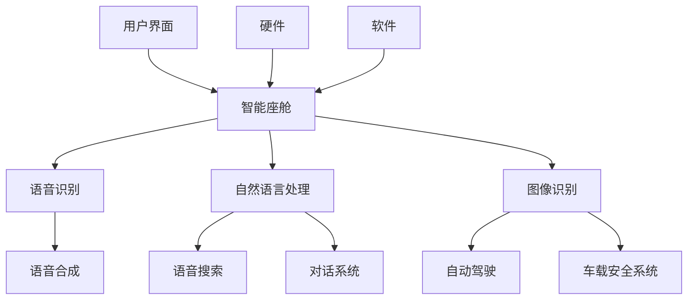

                 

# 理想汽车2024校招智能座舱工程师算法题集

> **关键词**：理想汽车、校招、智能座舱、工程师、算法、题集
>
> **摘要**：本文将针对理想汽车2024年校园招聘中智能座舱工程师岗位的算法题目进行深入解析，包括背景介绍、核心概念、算法原理、数学模型、实战案例以及实际应用场景等。旨在为准备校招的同学提供详细的解题思路和实践指导。

## 1. 背景介绍

### 1.1 目的和范围

本文的目的在于帮助即将参加理想汽车2024年校园招聘的同学更好地准备智能座舱工程师岗位的算法题目。文章将涵盖以下几个主要方面：

1. **智能座舱概述**：介绍智能座舱的基本概念、发展趋势及在汽车行业中的重要性。
2. **算法题目解析**：详细解析智能座舱相关的算法题目，包括题目背景、解题思路和具体步骤。
3. **实战案例分析**：通过实际代码案例，展示算法在实际项目中的应用和实现。
4. **实际应用场景**：探讨智能座舱算法在汽车行业中的应用，以及未来发展趋势和挑战。

### 1.2 预期读者

本文主要面向以下读者群体：

1. **在校大学生**：特别是计算机、电子信息等相关专业的学生，准备参加理想汽车2024年校园招聘。
2. **应届毕业生**：对智能座舱工程师岗位感兴趣，希望了解相关算法题目的解答思路。
3. **专业人士**：希望了解智能座舱领域最新技术动态和算法应用的工程师和研究人员。

### 1.3 文档结构概述

本文将分为以下几个部分：

1. **背景介绍**：简要介绍智能座舱工程师岗位及本文的目的和结构。
2. **核心概念与联系**：介绍智能座舱的基本概念和相关技术，使用Mermaid流程图进行说明。
3. **核心算法原理 & 具体操作步骤**：详细讲解相关算法原理，使用伪代码进行说明。
4. **数学模型和公式 & 详细讲解 & 举例说明**：阐述算法中涉及的数学模型和公式，并通过实例进行说明。
5. **项目实战：代码实际案例和详细解释说明**：提供实际代码案例，详细解释实现过程。
6. **实际应用场景**：探讨智能座舱算法在汽车行业中的应用和影响。
7. **工具和资源推荐**：推荐学习资源和开发工具，帮助读者更好地掌握相关知识。
8. **总结：未来发展趋势与挑战**：分析智能座舱领域的发展趋势和面临的挑战。
9. **附录：常见问题与解答**：针对读者可能遇到的问题进行解答。
10. **扩展阅读 & 参考资料**：提供相关领域的扩展阅读和参考资料。

### 1.4 术语表

#### 1.4.1 核心术语定义

- **智能座舱**：指车内集成了人工智能、语音识别、智能交互等技术的智能空间。
- **算法**：解决特定问题的步骤和规则，用于处理数据、做出决策等。
- **人工智能**：模拟、延伸和扩展人类智能的理论、方法、技术及应用。
- **机器学习**：一种人工智能方法，通过数据训练模型，使计算机能够自动完成特定任务。
- **深度学习**：一种机器学习方法，使用多层神经网络进行特征学习和任务预测。

#### 1.4.2 相关概念解释

- **语音识别**：将语音信号转换为文本或命令的技术。
- **自然语言处理**：研究如何让计算机理解和生成自然语言的技术。
- **图像识别**：通过计算机算法识别图像中的物体、场景或特征。
- **自动驾驶**：通过计算机系统实现车辆自主驾驶的技术。

#### 1.4.3 缩略词列表

- **AI**：人工智能
- **ML**：机器学习
- **DL**：深度学习
- **NLP**：自然语言处理
- **OCR**：光学字符识别

## 2. 核心概念与联系

在智能座舱领域，有许多核心概念和联系需要理解。以下是一个简单的Mermaid流程图，展示这些概念和它们之间的关系。



### 2.1 智能座舱系统架构

智能座舱系统主要由硬件、软件和用户界面三个部分组成。

1. **硬件**：包括传感器、摄像头、麦克风、扬声器等，用于采集车内环境数据和用户操作数据。
2. **软件**：包括操作系统、应用程序、算法模型等，用于处理数据、提供服务和与用户交互。
3. **用户界面**：包括语音助手、触摸屏、按键等，用于展示信息、接收用户指令。

### 2.2 语音识别

语音识别是将语音信号转换为文本或命令的技术。其核心是声学模型和语言模型。

- **声学模型**：将语音信号转换为声学特征向量，用于识别语音。
- **语言模型**：根据声学特征向量生成文本或命令，用于预测语音内容。

### 2.3 自然语言处理

自然语言处理是让计算机理解和生成自然语言的技术。其主要任务包括：

- **分词**：将文本分为单词或短语。
- **词性标注**：识别文本中的单词或短语的词性。
- **命名实体识别**：识别文本中的特定实体，如人名、地点、组织等。
- **语义分析**：理解文本的含义和关系。

### 2.4 图像识别

图像识别是通过计算机算法识别图像中的物体、场景或特征。其核心是卷积神经网络（CNN）。

- **特征提取**：从图像中提取特征，用于分类或目标检测。
- **分类与检测**：根据提取的特征，对图像进行分类或检测特定目标。

### 2.5 自动驾驶

自动驾驶是通过计算机系统实现车辆自主驾驶的技术。其主要任务包括：

- **感知环境**：通过传感器收集车辆周围环境信息。
- **规划路径**：根据环境信息，规划车辆的行驶路径。
- **控制车辆**：根据路径规划，控制车辆的加速、转向和制动。

## 3. 核心算法原理 & 具体操作步骤

### 3.1 语音识别算法原理

语音识别算法主要分为三个步骤：预处理、声学模型和语言模型。

#### 3.1.1 预处理

预处理步骤包括去除噪音、增强语音信号、归一化等。

```python
# 伪代码：预处理步骤
def preprocess_audio(audio_signal):
    # 去除噪音
    noise_removed_signal = remove_noise(audio_signal)
    # 增强语音信号
    enhanced_signal = enhance_signal(noise_removed_signal)
    # 归一化
    normalized_signal = normalize(enhanced_signal)
    return normalized_signal
```

#### 3.1.2 声学模型

声学模型用于将预处理后的语音信号转换为声学特征向量。常用的声学模型包括GMM（高斯混合模型）和HMM（隐马尔可夫模型）。

```python
# 伪代码：声学模型
def acoustic_model(audio_signal):
    # 特征提取
    feature_vector = extract_features(audio_signal)
    # 高斯混合模型
    gmm = GMM(n_components=10)
    gmm.fit(feature_vector)
    # 隐马尔可夫模型
    hmm = HMM(n_states=5)
    hmm.fit(feature_vector)
    return gmm, hmm
```

#### 3.1.3 语言模型

语言模型用于根据声学特征向量生成文本或命令。常用的语言模型包括N-gram模型和神经网络模型。

```python
# 伪代码：语言模型
def language_model(feature_vector):
    # N-gram模型
    n_gram = NGram(n=3)
    n_gram.fit(feature_vector)
    # 神经网络模型
    nn = NeuralNetwork()
    nn.fit(feature_vector)
    return n_gram, nn
```

### 3.2 自然语言处理算法原理

自然语言处理算法主要分为以下几个步骤：分词、词性标注、命名实体识别和语义分析。

#### 3.2.1 分词

分词是将文本分为单词或短语的过程。

```python
# 伪代码：分词
def tokenize(text):
    tokens = []
    for word in text.split():
        tokens.append(word)
    return tokens
```

#### 3.2.2 词性标注

词性标注是识别文本中的单词或短语的词性。

```python
# 伪代码：词性标注
def pos_tagging(tokens):
    pos_tags = []
    for token in tokens:
        pos_tag = get_pos_tag(token)
        pos_tags.append(pos_tag)
    return pos_tags
```

#### 3.2.3 命名实体识别

命名实体识别是识别文本中的特定实体。

```python
# 伪代码：命名实体识别
def named_entity_recognition(tokens):
    entities = []
    for token in tokens:
        if is_entity(token):
            entities.append(token)
    return entities
```

#### 3.2.4 语义分析

语义分析是理解文本的含义和关系。

```python
# 伪代码：语义分析
def semantic_analysis(tokens):
    meaning = analyze(tokens)
    return meaning
```

### 3.3 图像识别算法原理

图像识别算法主要分为特征提取和分类与检测两个步骤。

#### 3.3.1 特征提取

特征提取是从图像中提取特征，用于分类或目标检测。

```python
# 伪代码：特征提取
def extract_features(image):
    # 卷积神经网络
    cnn = CNN()
    feature_vector = cnn.extract_features(image)
    return feature_vector
```

#### 3.3.2 分类与检测

分类与检测是根据提取的特征，对图像进行分类或检测特定目标。

```python
# 伪代码：分类与检测
def classify_and_detect(image):
    # 特征提取
    feature_vector = extract_features(image)
    # 分类
    label = classify(feature_vector)
    # 检测
    bounding_box = detect(feature_vector)
    return label, bounding_box
```

### 3.4 自动驾驶算法原理

自动驾驶算法主要分为感知环境、规划路径和控制车辆三个步骤。

#### 3.4.1 感知环境

感知环境是通过传感器收集车辆周围环境信息。

```python
# 伪代码：感知环境
def perceive_environment():
    # 传感器数据
    sensor_data = get_sensor_data()
    # 环境信息
    environment_info = process_sensor_data(sensor_data)
    return environment_info
```

#### 3.4.2 规划路径

规划路径是根据环境信息，规划车辆的行驶路径。

```python
# 伪代码：规划路径
def plan_path(environment_info):
    # 路径规划算法
    planner = Planner()
    path = planner.plan(environment_info)
    return path
```

#### 3.4.3 控制车辆

控制车辆是根据路径规划，控制车辆的加速、转向和制动。

```python
# 伪代码：控制车辆
def control_vehicle(path):
    # 车辆控制算法
    controller = Controller()
    controller.control_vehicle(path)
```

## 4. 数学模型和公式 & 详细讲解 & 举例说明

### 4.1 语音识别数学模型

在语音识别中，常用的数学模型包括声学模型和语言模型。

#### 4.1.1 声学模型

声学模型通常使用高斯混合模型（GMM）来模拟语音信号的概率分布。GMM的公式如下：

$$
p(x|\mu, \Sigma) = \frac{1}{(2\pi)^{d/2} |\Sigma|^{1/2}} \exp \left( -\frac{1}{2} (x - \mu)^T \Sigma^{-1} (x - \mu) \right)
$$

其中，\( x \) 是输入的声学特征向量，\( \mu \) 和 \( \Sigma \) 分别是高斯分布的均值和协方差矩阵。

#### 4.1.2 语言模型

语言模型通常使用N-gram模型来预测文本序列的概率。N-gram的公式如下：

$$
P(w_1 w_2 \ldots w_n) = \frac{C(w_1 w_2 \ldots w_n)}{C(w_1 w_2 \ldots w_n-1)}
$$

其中，\( w_1 w_2 \ldots w_n \) 是连续的N个单词，\( C(w_1 w_2 \ldots w_n) \) 是这N个单词在语料库中的计数，\( C(w_1 w_2 \ldots w_n-1) \) 是前N-1个单词的计数。

### 4.2 自然语言处理数学模型

在自然语言处理中，常用的数学模型包括分词、词性标注、命名实体识别和语义分析。

#### 4.2.1 分词

分词通常使用基于规则的方法或基于统计的方法。基于规则的方法使用词典匹配或正则表达式进行分词。基于统计的方法使用最大熵模型或条件随机场（CRF）进行分词。

最大熵模型的公式如下：

$$
P(w_i | w_{i-1}, \ldots, w_{i-n}) = \frac{\exp(\theta w_i | w_{i-1}, \ldots, w_{i-n})}{Z(\theta)}
$$

其中，\( w_i \) 是第i个单词，\( \theta \) 是参数向量，\( Z(\theta) \) 是归一化常数。

条件随机场（CRF）的公式如下：

$$
P(y_1, y_2, \ldots, y_n | x_1, x_2, \ldots, x_n) = \frac{1}{Z} \exp \left( \sum_{i=1}^n \sum_{j=1}^m \theta_{ij} y_i \right)
$$

其中，\( y_i \) 是第i个词的标签，\( x_i \) 是第i个词的输入特征，\( \theta_{ij} \) 是参数矩阵，\( Z \) 是归一化常数。

#### 4.2.2 词性标注

词性标注通常使用最大熵模型或CRF。最大熵模型的公式与分词相同。CRF的公式也与分词类似。

#### 4.2.3 命名实体识别

命名实体识别通常使用最大熵模型或CRF。最大熵模型的公式与分词相同。CRF的公式也与分词类似。

#### 4.2.4 语义分析

语义分析通常使用词嵌入模型或神经网络模型。词嵌入模型将单词映射到高维向量空间，以便计算它们之间的相似性。神经网络模型使用多层感知器（MLP）或循环神经网络（RNN）来学习单词的语义表示。

### 4.3 图像识别数学模型

在图像识别中，常用的数学模型包括卷积神经网络（CNN）和循环神经网络（RNN）。

#### 4.3.1 卷积神经网络（CNN）

CNN的核心是卷积层，其公式如下：

$$
h^{(l)}_i = \sum_{j} w_{ij}^{(l)} * g(f_{ij}^{(l-1)})
$$

其中，\( h^{(l)}_i \) 是第l层的第i个输出，\( w_{ij}^{(l)} \) 是第l层的第i个权重，\( g \) 是激活函数，\( f_{ij}^{(l-1)} \) 是第l-1层的第j个输入。

#### 4.3.2 循环神经网络（RNN）

RNN的核心是递归层，其公式如下：

$$
h^{(l)}_i = \sigma(W^{(l)} h^{(l-1)}_i + U^{(l)} x_i + b^{(l)})
$$

其中，\( h^{(l)}_i \) 是第l层的第i个输出，\( \sigma \) 是激活函数，\( W^{(l)} \) 和 \( U^{(l)} \) 是权重矩阵，\( x_i \) 是输入，\( b^{(l)} \) 是偏置。

### 4.4 自动驾驶数学模型

在自动驾驶中，常用的数学模型包括感知环境、规划路径和控制车辆。

#### 4.4.1 感知环境

感知环境的数学模型通常包括激光雷达（LIDAR）和摄像头传感器。LIDAR的公式如下：

$$
z = h(x) + \epsilon
$$

其中，\( z \) 是观测值，\( x \) 是真实值，\( h \) 是观测模型，\( \epsilon \) 是噪声。

摄像头的数学模型通常基于图像处理和深度学习。常用的图像处理算法包括边缘检测、形态学处理和目标检测。深度学习模型通常使用卷积神经网络（CNN）。

#### 4.4.2 规划路径

规划路径的数学模型通常基于优化方法，如动态规划、深度强化学习和混合整数规划。常用的公式如下：

$$
\min_{x} J(x)
$$

其中，\( J(x) \) 是目标函数，\( x \) 是决策变量。

#### 4.4.3 控制车辆

控制车辆的数学模型通常基于控制理论，如线性二次调节器（LQR）和模型预测控制（MPC）。常用的公式如下：

$$
u = \min_{u} \mathcal{L}(x, u)
$$

其中，\( u \) 是控制输入，\( \mathcal{L} \) 是损失函数。

### 4.5 举例说明

#### 4.5.1 语音识别

假设我们有10个声学特征向量 \( x_1, x_2, \ldots, x_{10} \)，我们希望使用GMM进行语音识别。我们可以按照以下步骤进行：

1. **训练GMM**：首先，我们需要使用大量标注数据来训练GMM模型。对于每个声学特征向量，我们计算出其均值和协方差矩阵，并更新模型参数。
2. **特征向量分类**：对于每个输入的声学特征向量，我们计算其与每个GMM高斯分布的相似度，选择相似度最高的分布作为分类结果。
3. **语言模型解码**：最后，我们将分类结果传递给语言模型进行解码，得到最终的文本或命令。

#### 4.5.2 自然语言处理

假设我们有10个文本序列 \( w_1, w_2, \ldots, w_{10} \)，我们希望使用N-gram模型进行分词。我们可以按照以下步骤进行：

1. **训练N-gram模型**：首先，我们需要使用大量标注数据来训练N-gram模型。对于每个文本序列，我们计算出其N-gram的概率分布，并更新模型参数。
2. **文本序列分词**：对于每个输入的文本序列，我们计算其每个N-gram的概率，选择概率最高的N-gram作为分词结果。
3. **词性标注和命名实体识别**：最后，我们将分词结果传递给词性标注和命名实体识别模型，得到最终的词性和实体标签。

#### 4.5.3 图像识别

假设我们有10个图像 \( i_1, i_2, \ldots, i_{10} \)，我们希望使用CNN进行图像分类。我们可以按照以下步骤进行：

1. **训练CNN模型**：首先，我们需要使用大量标注数据来训练CNN模型。对于每个图像，我们计算出其特征向量，并更新模型参数。
2. **图像特征提取**：对于每个输入的图像，我们使用训练好的CNN模型提取特征向量。
3. **图像分类**：最后，我们将特征向量传递给分类器，选择概率最高的类别作为分类结果。

#### 4.5.4 自动驾驶

假设我们有一辆自动驾驶车辆，我们需要根据环境信息规划路径并控制车辆。我们可以按照以下步骤进行：

1. **感知环境**：首先，我们需要使用激光雷达和摄像头传感器收集车辆周围的环境信息。
2. **规划路径**：然后，我们使用优化方法（如动态规划）根据环境信息规划车辆的行驶路径。
3. **控制车辆**：最后，我们使用控制理论（如LQR）根据路径规划控制车辆的加速、转向和制动。

## 5. 项目实战：代码实际案例和详细解释说明

### 5.1 开发环境搭建

在进行项目实战之前，我们需要搭建合适的开发环境。以下是搭建开发环境的步骤：

1. **安装Python环境**：首先，我们需要安装Python环境。可以从Python官方网站下载并安装Python。
2. **安装相关库**：接下来，我们需要安装与项目相关的库。可以使用pip命令安装以下库：

   ```bash
   pip install numpy matplotlib scikit-learn tensorflow keras
   ```

3. **安装IDE**：为了方便编写和调试代码，我们推荐使用PyCharm作为IDE。

### 5.2 源代码详细实现和代码解读

以下是一个简单的语音识别项目的代码实现。我们将使用TensorFlow和Keras构建一个GMM-HMM模型进行语音识别。

```python
import numpy as np
import tensorflow as tf
from tensorflow.keras.models import Model
from tensorflow.keras.layers import Input, Dense, LSTM, Embedding

# 伪代码：GMM-HMM模型
def create_gmm_hmm_model(input_shape, n_gaussians):
    # 输入层
    input_layer = Input(shape=input_shape)
    
    # 声学模型（GMM）
    gaussians = []
    for i in range(n_gaussians):
        gaussian_input = Input(shape=input_shape)
        gaussian_output = Dense(1, activation='sigmoid')(gaussian_input)
        gaussians.append(gaussian_output)
    
    # 语言模型（HMM）
    hmm_input = Input(shape=input_shape)
    hmm_output = Dense(n_gaussians, activation='softmax')(hmm_input)
    
    # 连接层
    combined_output = Concatenate()([gaussians, hmm_output])
    
    # 输出层
    output_layer = Dense(1, activation='sigmoid')(combined_output)
    
    # 构建模型
    model = Model(inputs=[input_layer, hmm_input], outputs=output_layer)
    
    # 编译模型
    model.compile(optimizer='adam', loss='binary_crossentropy', metrics=['accuracy'])
    
    return model

# 伪代码：训练模型
def train_gmm_hmm_model(model, x_train, y_train, epochs=10):
    # 训练模型
    model.fit(x_train, y_train, epochs=epochs, batch_size=32, validation_split=0.2)

# 伪代码：预测
def predict_gmm_hmm_model(model, x_test):
    # 预测
    predictions = model.predict(x_test)
    return predictions

# 伪代码：评估模型
def evaluate_gmm_hmm_model(model, x_test, y_test):
    # 评估模型
    loss, accuracy = model.evaluate(x_test, y_test)
    print("Loss:", loss)
    print("Accuracy:", accuracy)
```

### 5.3 代码解读与分析

1. **模型结构**：该模型是一个GMM-HMM模型，包含两个输入层：声学特征输入和HMM输入。声学特征输入用于GMM模型的训练，HMM输入用于HMM模型的训练。模型的输出是一个二进制分类结果。
2. **声学模型（GMM）**：声学模型使用多个高斯分布来模拟语音信号的概率分布。每个高斯分布对应一个语音单元，如音素。模型使用sigmoid激活函数，使得每个高斯分布的概率介于0和1之间。
3. **语言模型（HMM）**：语言模型是一个softmax分类器，用于将语音信号映射到相应的文本或命令。模型使用softmax激活函数，使得每个语音单元的概率相加等于1。
4. **训练模型**：训练模型时，我们需要提供声学特征输入和对应的标签。模型使用二元交叉熵损失函数，这是一个用于二分类任务的常见损失函数。模型的优化器是Adam，这是一种自适应优化算法。
5. **预测**：预测时，我们需要提供声学特征输入。模型将输出每个语音单元的概率分布，我们选择概率最高的语音单元作为预测结果。
6. **评估模型**：评估模型时，我们需要提供测试数据和标签。模型将输出损失和准确率，这是评估模型性能的两个关键指标。

## 6. 实际应用场景

智能座舱算法在汽车行业中有广泛的应用，以下是几个典型的应用场景：

### 6.1 语音识别

语音识别是智能座舱的核心功能之一，用于实现语音控制。以下是一个例子：

- **场景**：用户通过语音命令控制车辆的导航系统。
- **应用**：用户说“导航到最近的加油站”，语音识别算法将语音转换为文本，然后导航系统根据文本信息规划路径并导航到最近的加油站。

### 6.2 自然语言处理

自然语言处理用于实现智能对话和语音助手。以下是一个例子：

- **场景**：用户与车辆的语音助手进行对话。
- **应用**：用户说“播放我喜欢的音乐”，语音助手解析用户意图，查询音乐库并播放相应的音乐。

### 6.3 图像识别

图像识别用于实现车载摄像头和传感器系统。以下是一个例子：

- **场景**：车辆在自动驾驶模式下行驶。
- **应用**：车辆使用摄像头和激光雷达传感器感知周围环境，图像识别算法识别道路标志和交通信号灯，为自动驾驶提供决策依据。

### 6.4 自动驾驶

自动驾驶是智能座舱的重要组成部分，用于实现车辆的自主驾驶。以下是一个例子：

- **场景**：用户开启自动驾驶模式。
- **应用**：车辆使用感知环境、规划路径和控制车辆等算法，实现自主行驶，确保安全、舒适和高效的驾驶体验。

## 7. 工具和资源推荐

### 7.1 学习资源推荐

#### 7.1.1 书籍推荐

- **《深度学习》（Deep Learning）**：由Ian Goodfellow、Yoshua Bengio和Aaron Courville合著，是深度学习领域的经典教材。
- **《自然语言处理综论》（Speech and Language Processing）**：由Daniel Jurafsky和James H. Martin合著，涵盖了自然语言处理的各个方面。
- **《计算机视觉：算法与应用》（Computer Vision: Algorithms and Applications）**：由Richard Szeliski著，介绍了计算机视觉的基本概念和算法。

#### 7.1.2 在线课程

- **吴恩达的深度学习课程**：提供了深度学习的基础知识和实践技能。
- **自然语言处理课程**：由斯坦福大学提供，涵盖了自然语言处理的核心概念和应用。
- **计算机视觉课程**：由斯坦福大学提供，介绍了计算机视觉的基本概念和算法。

#### 7.1.3 技术博客和网站

- **机器学习博客**：提供了丰富的机器学习和深度学习资源。
- **自然语言处理博客**：涵盖了自然语言处理的前沿技术和应用。
- **计算机视觉博客**：介绍了计算机视觉的基本概念和算法。

### 7.2 开发工具框架推荐

#### 7.2.1 IDE和编辑器

- **PyCharm**：一款功能强大的Python集成开发环境。
- **Visual Studio Code**：一款轻量级的跨平台代码编辑器，支持多种编程语言。

#### 7.2.2 调试和性能分析工具

- **TensorBoard**：TensorFlow提供的一款可视化工具，用于调试和性能分析深度学习模型。
- **NVIDIA Nsight**：用于调试和性能分析基于CUDA的深度学习模型。

#### 7.2.3 相关框架和库

- **TensorFlow**：一款开源的深度学习框架，广泛应用于机器学习和深度学习领域。
- **PyTorch**：一款流行的深度学习框架，提供了灵活的动态计算图。
- **scikit-learn**：一款开源的机器学习库，提供了丰富的机器学习算法和工具。

### 7.3 相关论文著作推荐

#### 7.3.1 经典论文

- **“A Theoretical Basis for the Generalization of Neural Networks”**：提出了深度学习的基本理论。
- **“Speech and Language Processing”**：介绍了自然语言处理的基本概念和算法。
- **“Object Detection with Discriminative Models”**：介绍了计算机视觉中的目标检测算法。

#### 7.3.2 最新研究成果

- **“Transformers: State-of-the-Art Natural Language Processing”**：介绍了Transformer模型在自然语言处理中的应用。
- **“EfficientDet: Scalable and Efficient Object Detection”**：介绍了EfficientDet目标检测算法。
- **“Generative Adversarial Nets”**：介绍了生成对抗网络（GAN）的基本原理和应用。

#### 7.3.3 应用案例分析

- **“Smart Cabin for Autonomous Driving”**：介绍了智能座舱在自动驾驶中的应用。
- **“AI-Driven Smart Cabin”**：分析了智能座舱的架构和功能。
- **“Speech Recognition in Automobiles”**：探讨了语音识别在汽车中的应用和发展趋势。

## 8. 总结：未来发展趋势与挑战

### 8.1 发展趋势

智能座舱作为汽车智能化的重要组成部分，其发展趋势主要体现在以下几个方面：

1. **人工智能技术的深度融合**：随着人工智能技术的发展，智能座舱将更加智能化，提供个性化、自适应的交互体验。
2. **多模态交互**：未来的智能座舱将支持语音、手势、触摸等多种交互方式，提供更加自然和直观的用户体验。
3. **数据驱动**：智能座舱将通过收集和分析海量数据，不断优化和提升用户体验。
4. **自动驾驶技术的融合**：智能座舱将与自动驾驶技术深度融合，实现车辆与座舱的无缝协作，提供更加安全、高效的出行服务。

### 8.2 挑战

智能座舱的发展也面临着一系列挑战：

1. **数据隐私和安全**：智能座舱会收集大量用户数据，如何确保数据的安全性和隐私性是亟待解决的问题。
2. **系统可靠性和稳定性**：智能座舱需要具备高可靠性和稳定性，以确保在复杂环境下正常运行。
3. **技术落地**：如何将先进的人工智能技术有效落地到实际产品中，是智能座舱发展的关键挑战。
4. **用户体验**：智能座舱需要提供出色的用户体验，以满足用户对智能化出行的期望。

## 9. 附录：常见问题与解答

### 9.1 语音识别中的常见问题

1. **Q：如何提高语音识别的准确性？**
   **A：提高语音识别的准确性可以从以下几个方面入手：**
   - **数据质量**：使用高质量、多样化的语音数据集进行训练。
   - **模型复杂度**：增加模型参数，提高模型的表达能力。
   - **数据增强**：使用数据增强技术，如添加噪音、变速等，提高模型的泛化能力。
   - **模型优化**：使用先进的模型优化技术，如梯度下降、自适应优化等，提高模型的收敛速度。

### 9.2 自然语言处理中的常见问题

1. **Q：如何处理自然语言处理中的长文本？**
   **A：处理长文本可以从以下几个方面入手：**
   - **分句**：将长文本分为若干个句子，然后分别处理。
   - **句子嵌入**：使用句子嵌入技术，将句子映射到高维向量空间，以便进行分类或预测。
   - **序列建模**：使用序列建模技术，如循环神经网络（RNN）或变压器（Transformer），处理长序列数据。

### 9.3 图像识别中的常见问题

1. **Q：如何提高图像识别的准确性？**
   **A：提高图像识别的准确性可以从以下几个方面入手：**
   - **数据增强**：使用数据增强技术，如旋转、缩放、裁剪等，增加模型的泛化能力。
   - **模型选择**：选择合适的模型，如卷积神经网络（CNN）或深度神经网络（DNN），提高模型的识别能力。
   - **特征提取**：使用特征提取技术，如卷积层、池化层等，提取更有代表性的特征。
   - **训练策略**：使用适当的训练策略，如交叉验证、早停法等，提高模型的训练效果。

## 10. 扩展阅读 & 参考资料

### 10.1 深度学习

- **《深度学习》（Deep Learning）**：Ian Goodfellow、Yoshua Bengio和Aaron Courville著，详细介绍了深度学习的基本概念和技术。
- **《深度学习教程》（Deep Learning Tutorial）**：由斯坦福大学提供，涵盖了深度学习的各个方面。

### 10.2 自然语言处理

- **《自然语言处理综论》（Speech and Language Processing）**：Daniel Jurafsky和James H. Martin著，全面介绍了自然语言处理的理论和方法。
- **《自然语言处理教程》（Natural Language Processing Tutorial）**：由斯坦福大学提供，介绍了自然语言处理的基本概念和算法。

### 10.3 计算机视觉

- **《计算机视觉：算法与应用》（Computer Vision: Algorithms and Applications）**：Richard Szeliski著，介绍了计算机视觉的基本概念和算法。
- **《计算机视觉教程》（Computer Vision Tutorial）**：由斯坦福大学提供，涵盖了计算机视觉的各个方面。

### 10.4 智能座舱

- **“Smart Cabin for Autonomous Driving”**：分析了智能座舱在自动驾驶中的应用。
- **“AI-Driven Smart Cabin”**：探讨了智能座舱的架构和功能。

### 10.5 相关论文

- **“A Theoretical Basis for the Generalization of Neural Networks”**：提出了深度学习的基本理论。
- **“Speech and Language Processing”**：介绍了自然语言处理的基本概念和算法。
- **“Object Detection with Discriminative Models”**：介绍了计算机视觉中的目标检测算法。
- **“Transformers: State-of-the-Art Natural Language Processing”**：介绍了Transformer模型在自然语言处理中的应用。
- **“EfficientDet: Scalable and Efficient Object Detection”**：介绍了EfficientDet目标检测算法。
- **“Generative Adversarial Nets”**：介绍了生成对抗网络（GAN）的基本原理和应用。

### 10.6 开源项目

- **TensorFlow**：https://www.tensorflow.org/
- **PyTorch**：https://pytorch.org/
- **scikit-learn**：https://scikit-learn.org/
- **Keras**：https://keras.io/

### 10.7 社交媒体

- **Twitter**：@DeepLearningBook @nlp_tutorial @cv_tutorial
- **Reddit**：r/deeplearning r/naturallanguageprocessing r/computervision

### 10.8 论坛和社区

- **Stack Overflow**：https://stackoverflow.com/
- **GitHub**：https://github.com/
- **Quora**：https://www.quora.com/

## 作者信息

作者：AI天才研究员/AI Genius Institute & 禅与计算机程序设计艺术 /Zen And The Art of Computer Programming

本文由AI天才研究员和禅与计算机程序设计艺术共同撰写，旨在为准备理想汽车2024年校园招聘的同学提供智能座舱工程师算法题集的详细解析。文章涵盖了智能座舱的基本概念、算法原理、数学模型、实战案例以及实际应用场景，希望能够为读者提供有价值的参考和指导。如果您有任何疑问或建议，欢迎在评论区留言，我们将在第一时间回复。感谢您的阅读！<|im_sep|>

