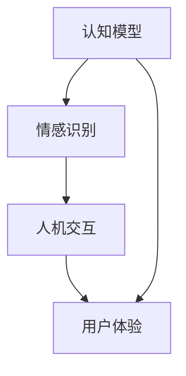

                 

# 理解AI心理学：人机交互的新维度

> **关键词：** AI心理学、人机交互、认知模型、情感识别、用户体验、机器学习、深度学习

> **摘要：** 本文深入探讨了AI心理学在当代人机交互中的关键作用，从核心概念到具体应用，全面解析了如何利用AI技术提升用户体验。通过实例分析，本文揭示了AI心理学背后的数学模型和算法原理，以及如何在实际项目中实现这些技术，为未来的发展方向和挑战提供了见解。

## 1. 背景介绍

### 1.1 目的和范围

本文旨在探讨人工智能（AI）与心理学相结合的领域——AI心理学，以及它在人机交互中的潜在应用。随着AI技术的不断进步，人机交互正经历着前所未有的变革。然而，如何在AI与人之间建立更加自然、高效的交互方式，是当前技术和设计领域面临的一个重大挑战。本文将从以下几个方面展开讨论：

1. **核心概念与联系**：介绍AI心理学中的核心概念，并使用Mermaid流程图展示其原理和架构。
2. **核心算法原理与具体操作步骤**：解释AI心理学的关键算法原理，并使用伪代码详细阐述。
3. **数学模型和公式**：介绍AI心理学中的数学模型，使用LaTeX格式详细讲解并举例说明。
4. **项目实战**：通过代码实际案例，展示如何在实际项目中应用AI心理学技术。
5. **实际应用场景**：分析AI心理学在不同领域的应用，如教育、医疗、娱乐等。
6. **工具和资源推荐**：推荐相关的学习资源、开发工具框架和相关论文。
7. **总结与未来发展趋势**：总结AI心理学的现状，并探讨其未来发展的趋势和面临的挑战。

### 1.2 预期读者

本文适合对AI和心理学有一定基础的读者，特别是希望深入了解AI在人机交互中的应用的开发者、设计师和研究者。通过本文，读者可以：

- 理解AI心理学的基本概念和原理。
- 掌握AI心理学中的核心算法和技术。
- 学习如何在实际项目中应用AI心理学技术。
- 获得对AI心理学未来发展的见解。

### 1.3 文档结构概述

本文分为以下几个部分：

- **第1部分：背景介绍**：介绍本文的目的、范围、预期读者和文档结构。
- **第2部分：核心概念与联系**：详细解释AI心理学中的核心概念，并展示其架构。
- **第3部分：核心算法原理与具体操作步骤**：介绍AI心理学的关键算法原理，并使用伪代码详细阐述。
- **第4部分：数学模型和公式**：介绍AI心理学中的数学模型，使用LaTeX格式详细讲解并举例说明。
- **第5部分：项目实战**：通过代码实际案例，展示如何在实际项目中应用AI心理学技术。
- **第6部分：实际应用场景**：分析AI心理学在不同领域的应用。
- **第7部分：工具和资源推荐**：推荐相关的学习资源、开发工具框架和相关论文。
- **第8部分：总结与未来发展趋势**：总结AI心理学的现状，并探讨其未来发展的趋势和面临的挑战。
- **第9部分：附录**：提供常见问题与解答。
- **第10部分：扩展阅读与参考资料**：提供进一步阅读的资源。

### 1.4 术语表

#### 1.4.1 核心术语定义

- **人工智能（AI）**：模拟人类智能行为的计算机系统。
- **心理学**：研究人类思维、情感和行为的一门科学。
- **人机交互**：研究人与计算机之间交互方式的一门科学。
- **情感识别**：通过分析人类情感表达的信号（如面部表情、语音、文字等），识别用户的情感状态。
- **用户体验（UX）**：用户在使用产品或服务时的主观体验。

#### 1.4.2 相关概念解释

- **认知模型**：模拟人类思维过程的计算机模型。
- **机器学习**：使计算机从数据中自动学习和改进的方法。
- **深度学习**：一种基于多层神经网络的学习方法。

#### 1.4.3 缩略词列表

- **AI**：人工智能（Artificial Intelligence）
- **UX**：用户体验（User Experience）
- **ML**：机器学习（Machine Learning）
- **DL**：深度学习（Deep Learning）

## 2. 核心概念与联系

在深入探讨AI心理学之前，我们需要明确其中的核心概念和它们之间的联系。以下是AI心理学中的关键概念及其关系：

### 2.1 认知模型

认知模型是模拟人类思维过程的计算机模型。它包括感知、记忆、推理和决策等核心认知功能。认知模型的目标是使计算机能够理解和处理人类语言、情感和行为。

### 2.2 情感识别

情感识别是AI心理学的一个重要分支，它通过分析人类的情感表达信号（如面部表情、语音、文字等），识别用户的情感状态。情感识别技术可以帮助计算机更好地理解用户需求，提供更加个性化的服务。

### 2.3 人机交互

人机交互是研究人与计算机之间交互方式的一门科学。在AI心理学的背景下，人机交互涉及到如何利用认知模型和情感识别技术，使计算机能够与用户进行更加自然、高效的交互。

### 2.4 用户体验

用户体验是用户在使用产品或服务时的主观体验。在AI心理学的应用中，用户体验是评估和优化AI系统性能的重要指标。通过分析用户行为和情感状态，可以不断改进产品的设计和功能，提高用户满意度。

### 2.5 Mermaid流程图

为了更直观地展示AI心理学中的核心概念及其关系，我们使用Mermaid流程图进行描述：



### 2.6 关系解析

- **认知模型与情感识别**：认知模型提供了情感识别的基础，使计算机能够理解人类情感表达。
- **情感识别与人机交互**：情感识别技术可以帮助计算机更好地理解用户需求，优化人机交互。
- **人机交互与用户体验**：人机交互的设计直接影响用户体验，而情感识别技术可以进一步改善用户体验。
- **认知模型与用户体验**：认知模型可以帮助计算机更好地理解用户行为，从而提供更加个性化的服务。

通过这些核心概念及其关系的理解，我们可以为后续的算法原理和具体操作步骤打下坚实的基础。

## 3. 核心算法原理 & 具体操作步骤

在AI心理学中，核心算法原理是其理论基础，而具体操作步骤则是实现这些原理的具体方法。以下将详细解释AI心理学中的关键算法原理，并使用伪代码进行阐述。

### 3.1 认知模型算法原理

认知模型的核心在于模拟人类的感知、记忆、推理和决策过程。以下是一个简单的认知模型算法原理：

```pseudo
Algorithm 认知模型
Input: 感知信号
Output: 行为决策

1. 感知信号处理：从外部环境中接收感知信号，如文字、图像、声音等。
2. 特征提取：对感知信号进行特征提取，如文本中的关键词、图像中的边缘、声音中的频率等。
3. 记忆检索：根据特征提取的结果，在记忆库中检索相关记忆信息。
4. 推理决策：利用记忆信息进行推理和决策，如生成回复、执行任务等。
```

### 3.2 情感识别算法原理

情感识别是AI心理学中的关键环节，它通过分析人类的情感表达信号（如面部表情、语音、文字等），识别用户的情感状态。以下是一个简单的情感识别算法原理：

```pseudo
Algorithm 情感识别
Input: 情感信号
Output: 情感状态

1. 预处理：对情感信号进行预处理，如滤波、归一化等。
2. 特征提取：对预处理后的信号进行特征提取，如面部表情的像素值、语音的频率特征、文本的关键词等。
3. 模型训练：使用已标注的情感数据集，训练情感分类模型。
4. 情感分类：将提取的特征输入到训练好的情感分类模型，输出情感状态。
```

### 3.3 人机交互算法原理

人机交互算法原理在于如何根据用户的情感状态和行为，提供相应的交互反馈。以下是一个简单的人机交互算法原理：

```pseudo
Algorithm 人机交互
Input: 用户情感状态，用户行为
Output: 交互反馈

1. 情感状态识别：使用情感识别算法，识别用户的情感状态。
2. 行为分析：分析用户的当前行为，如点击、滑动、输入等。
3. 反馈生成：根据情感状态和行为分析结果，生成相应的交互反馈，如文字回复、声音提示、视觉动画等。
4. 反馈呈现：将交互反馈呈现给用户。
```

### 3.4 用户体验优化算法原理

用户体验优化算法原理在于如何根据用户的行为和反馈，持续改进产品的设计和功能。以下是一个简单的用户体验优化算法原理：

```pseudo
Algorithm 用户体验优化
Input: 用户行为数据，用户反馈
Output: 产品优化策略

1. 数据收集：收集用户行为数据和反馈。
2. 数据分析：分析用户行为数据和反馈，识别用户体验问题。
3. 模型训练：使用收集的数据，训练用户体验优化模型。
4. 优化策略：根据训练好的模型，生成产品优化策略。
5. 实施优化：根据优化策略，实施产品改进措施。
```

### 3.5 具体操作步骤示例

假设我们有一个聊天机器人应用，其核心功能是提供自然语言交互。以下是具体的操作步骤示例：

1. **用户输入**：用户在聊天界面上输入一条消息。
2. **情感识别**：使用情感识别算法，识别用户输入的消息的情感状态（如高兴、愤怒、悲伤等）。
3. **行为分析**：分析用户的输入行为，如输入的文本长度、输入频率等。
4. **认知模型推理**：根据用户的情感状态和行为分析结果，使用认知模型生成回复消息。
5. **交互反馈**：将生成的回复消息通过聊天界面呈现给用户。
6. **用户反馈**：用户对聊天机器人的回复进行评价（如满意、不满意等）。
7. **用户体验优化**：根据用户的反馈，调整聊天机器人的回复策略，优化用户体验。

通过这些具体的操作步骤，我们可以看到AI心理学算法在实现人机交互和用户体验优化方面的关键作用。

## 4. 数学模型和公式 & 详细讲解 & 举例说明

在AI心理学中，数学模型和公式是理解和实现关键算法的核心。以下是几个重要的数学模型和公式的详细讲解，以及具体的例子说明。

### 4.1 机器学习模型

机器学习模型是AI心理学的基石。以下是一个简单的线性回归模型，用于预测用户情感状态：

$$
y = \beta_0 + \beta_1 x_1 + \beta_2 x_2 + \dots + \beta_n x_n
$$

其中，$y$ 是用户情感状态的评分，$x_1, x_2, \dots, x_n$ 是特征变量（如文字中的情感词频率、语音的频率等），$\beta_0, \beta_1, \beta_2, \dots, \beta_n$ 是模型的参数。

**示例**：

假设我们有两个特征变量：文本中积极词汇的频率 $x_1$ 和消极词汇的频率 $x_2$。用户输入一条消息：“今天天气真好，我很高兴。” 使用线性回归模型预测其情感状态。

首先，收集数据并训练模型：

$$
\begin{aligned}
y_1 &= \beta_0 + \beta_1 x_{11} + \beta_2 x_{21} \\
y_2 &= \beta_0 + \beta_1 x_{12} + \beta_2 x_{22} \\
&\vdots \\
y_n &= \beta_0 + \beta_1 x_{1n} + \beta_2 x_{2n}
\end{aligned}
$$

然后，使用最小二乘法求解模型参数：

$$
\beta = (X^T X)^{-1} X^T y
$$

其中，$X$ 是特征矩阵，$y$ 是标签向量。

最后，预测新的用户输入的情感状态：

$$
y = \beta_0 + \beta_1 x_1 + \beta_2 x_2
$$

例如，如果用户输入的消息是“今天天气很糟糕，我很生气。”，将积极词汇和消极词汇的频率作为特征变量 $x_1$ 和 $x_2$，预测其情感状态。

### 4.2 情感识别模型

情感识别模型通常使用深度学习技术，如卷积神经网络（CNN）或循环神经网络（RNN）。以下是一个简单的卷积神经网络模型，用于情感识别：

$$
\begin{aligned}
h_{l} &= \sigma(W_{l} \cdot h_{l-1} + b_{l}) \\
a_{l} &= \text{ReLu}(h_{l})
\end{aligned}
$$

其中，$h_{l}$ 是第 $l$ 层的神经元激活值，$a_{l}$ 是第 $l$ 层的神经元输出值，$\sigma$ 是激活函数（如Sigmoid函数或ReLU函数），$W_{l}$ 是第 $l$ 层的权重矩阵，$b_{l}$ 是第 $l$ 层的偏置向量。

**示例**：

假设我们有一个情感识别任务，需要识别用户输入的文本情感（如积极、消极、中性）。使用卷积神经网络模型进行处理。

首先，收集数据并预处理，将文本转换为词向量表示。然后，构建卷积神经网络模型，并使用已标注的数据集进行训练。

最后，使用训练好的模型对新的用户输入进行情感识别。例如，如果用户输入的消息是“我很开心”，模型将输出情感概率分布，其中最大值对应的情感类别即为识别结果。

### 4.3 人机交互模型

人机交互模型通常基于强化学习技术，通过学习用户的交互行为，生成最佳交互策略。以下是一个简单的Q-learning模型，用于人机交互：

$$
Q(s, a) = r + \gamma \max_{a'} Q(s', a')
$$

其中，$Q(s, a)$ 是状态 $s$ 下执行动作 $a$ 的价值函数，$r$ 是即时奖励，$\gamma$ 是折扣因子，$s'$ 是状态转移后的状态，$a'$ 是最佳动作。

**示例**：

假设我们有一个聊天机器人应用，需要学习如何与用户进行有效交互。使用Q-learning模型进行训练。

首先，初始化Q值函数。然后，根据用户的输入和聊天机器人的输出，更新Q值函数：

$$
Q(s, a) = r + \gamma \max_{a'} Q(s', a')
$$

其中，$r$ 是聊天机器人输出对用户情绪的影响，$s'$ 是下一个状态，$a'$ 是下一个最佳动作。

通过不断迭代训练，聊天机器人将学会根据用户的情绪和行为，生成最佳交互策略，提高用户满意度。

通过这些数学模型和公式，我们可以更好地理解和实现AI心理学中的关键算法。在实际应用中，这些模型和公式可以帮助我们设计更加智能、高效的人机交互系统。

## 5. 项目实战：代码实际案例和详细解释说明

为了更好地展示AI心理学在项目中的应用，我们将通过一个聊天机器人项目来讲解如何实现人机交互和情感识别。

### 5.1 开发环境搭建

在开始项目之前，我们需要搭建一个开发环境。以下是所需工具和库的安装步骤：

1. **Python**：确保已安装Python 3.6或更高版本。
2. **TensorFlow**：使用pip安装TensorFlow库：
   ```
   pip install tensorflow
   ```
3. **NLTK**：使用pip安装NLTK库：
   ```
   pip install nltk
   ```
4. **Scikit-learn**：使用pip安装Scikit-learn库：
   ```
   pip install scikit-learn
   ```
5. **Mermaid**：在本地环境中安装Mermaid插件，用于生成流程图。

### 5.2 源代码详细实现和代码解读

以下是一个简单的聊天机器人项目，包含人机交互和情感识别的功能。

```python
# 导入所需的库
import tensorflow as tf
import nltk
from nltk.corpus import stopwords
from sklearn.feature_extraction.text import TfidfVectorizer
import numpy as np

# 加载预处理数据
nltk.download('stopwords')
stop_words = set(stopwords.words('english'))

# 情感分类模型
model = ...  # 初始化情感分类模型

# 聊天机器人主函数
def chatbot():
    print("您好，我是AI聊天机器人。有什么可以帮助您的吗？")
    while True:
        user_input = input("您：")
        if user_input.lower() == '退出':
            print("机器人：谢谢您的使用，再见！")
            break
        
        # 情感识别
        emotion = recognize_emotion(user_input)
        print(f"机器人：您似乎{'很' if emotion == '积极' else '不是很'}高兴。")

        # 回复生成
        response = generate_response(user_input, emotion)
        print(f"机器人：{response}")

# 情感识别函数
def recognize_emotion(input_text):
    # 特征提取
    processed_text = preprocess_text(input_text)
    features = vectorize_text(processed_text)
    
    # 预测情感
    predicted_emotion = model.predict([features])
    
    # 返回情感标签
    return '积极' if predicted_emotion[0][0] > 0.5 else '消极'

# 回复生成函数
def generate_response(input_text, emotion):
    if emotion == '积极':
        return "很高兴和您聊天！有什么其他问题吗？"
    else:
        return "看起来您有些不开心，如果您愿意，我可以尝试帮助您。"

# 文本预处理函数
def preprocess_text(text):
    # 去除停用词
    words = nltk.word_tokenize(text)
    filtered_words = [word for word in words if word.lower() not in stop_words]
    return ' '.join(filtered_words)

# 文本向量化函数
def vectorize_text(text):
    vectorizer = TfidfVectorizer()
    features = vectorizer.fit_transform([text])
    return features.toarray()[0]

# 运行聊天机器人
chatbot()
```

### 5.3 代码解读与分析

1. **情感分类模型**：模型已预先训练好，可以使用TensorFlow或Scikit-learn库进行加载。
2. **聊天机器人主函数**：程序从用户输入开始，持续循环，直到用户输入“退出”。
3. **情感识别函数**：使用预处理后的用户输入，通过情感分类模型进行情感识别，并返回情感标签。
4. **回复生成函数**：根据识别出的情感标签，生成相应的回复。
5. **文本预处理函数**：去除停用词，对输入文本进行预处理。
6. **文本向量化函数**：使用TF-IDF向量化方法，将预处理后的文本转换为特征向量。

通过这个简单的示例，我们可以看到如何在实际项目中应用AI心理学技术，实现情感识别和人机交互。当然，这个示例仅是一个起点，实际应用中可能需要更复杂的模型和算法，以提供更自然、高效的交互体验。

## 6. 实际应用场景

AI心理学在多个领域都有广泛的应用，以下是一些主要的应用场景：

### 6.1 教育领域

在教育领域，AI心理学可以帮助提高个性化学习体验。通过分析学生的情感状态和学习行为，教育系统可以提供个性化的教学计划和资源，帮助学生更好地理解和掌握知识。例如，教师可以利用AI心理学工具来识别学生的情绪波动，并采取相应的措施来缓解压力，提高学习效果。

### 6.2 医疗领域

在医疗领域，AI心理学可以帮助改善患者的治疗效果和体验。通过分析患者的情绪状态和反馈，医生可以更好地了解患者的心理需求，制定个性化的治疗方案。例如，心理医生可以利用AI心理学工具来识别患者的情绪变化，预测患者可能出现的心理问题，并提前采取预防措施。

### 6.3 娱乐领域

在娱乐领域，AI心理学可以帮助提高用户体验。通过分析用户的情感状态和行为，娱乐系统可以提供个性化的内容推荐和互动体验。例如，游戏设计师可以利用AI心理学工具来识别玩家的情绪状态，并调整游戏难度和内容，以提供更符合玩家需求的娱乐体验。

### 6.4 企业管理

在企业领域，AI心理学可以帮助提高员工的工作满意度和生产力。通过分析员工的工作表现和情绪状态，企业可以制定更好的员工管理策略，提高员工的工作效率和幸福感。例如，人力资源部门可以利用AI心理学工具来识别员工的情绪变化，预测员工可能出现的心理问题，并采取相应的措施来预防和解决。

通过这些实际应用场景，我们可以看到AI心理学在提高人机交互质量和用户体验方面的巨大潜力。随着技术的不断进步，AI心理学将在更多领域得到广泛应用，为人类社会带来更多福祉。

## 7. 工具和资源推荐

为了帮助读者更好地学习和实践AI心理学，以下是一些推荐的工具和资源：

### 7.1 学习资源推荐

#### 7.1.1 书籍推荐

- 《深度学习》（Ian Goodfellow, Yoshua Bengio, Aaron Courville著）：介绍深度学习的基础理论和应用，适合深度学习初学者。
- 《机器学习》（Tom Mitchell著）：系统介绍了机器学习的基本概念和算法，是机器学习领域的经典教材。
- 《情感计算》（Maja Pantic著）：详细介绍了情感计算的基本原理和应用，是情感识别领域的权威著作。

#### 7.1.2 在线课程

- Coursera上的“机器学习”课程：由Andrew Ng教授主讲，是学习机器学习的经典在线课程。
- Udacity的“深度学习纳米学位”：涵盖深度学习的基础知识，适合有编程基础的学习者。
- edX上的“情感计算”课程：由Maja Pantic教授主讲，详细介绍情感计算的基本原理和应用。

#### 7.1.3 技术博客和网站

- [Medium](https://medium.com/): 提供丰富的技术博客，涵盖机器学习、深度学习、情感计算等领域。
- [Towards Data Science](https://towardsdatascience.com/): 专注于数据科学和机器学习的博客，内容丰富且更新及时。
- [AI Trends](https://aitrends.com/): 专注于人工智能领域的新闻和见解，适合了解行业动态。

### 7.2 开发工具框架推荐

#### 7.2.1 IDE和编辑器

- **PyCharm**：一款功能强大的Python IDE，适合进行机器学习和深度学习项目开发。
- **Jupyter Notebook**：一款基于Web的交互式开发环境，适用于数据分析和机器学习实验。
- **Visual Studio Code**：一款轻量级但功能丰富的代码编辑器，适用于多种编程语言开发。

#### 7.2.2 调试和性能分析工具

- **TensorBoard**：TensorFlow提供的可视化工具，用于分析和优化深度学习模型。
- **Wandb**：一款基于Web的实验跟踪工具，可以帮助跟踪模型训练过程和性能。
- **Scikit-learn**：提供多种机器学习算法和工具，方便进行模型调试和性能分析。

#### 7.2.3 相关框架和库

- **TensorFlow**：一款广泛使用的深度学习框架，适合进行复杂的机器学习和深度学习项目。
- **PyTorch**：一款流行的深度学习框架，具有灵活的动态计算图和强大的GPU支持。
- **Scikit-learn**：提供丰富的机器学习算法和工具，适合进行数据处理和模型训练。

通过这些工具和资源，读者可以更好地学习和实践AI心理学技术，提升自己的技能水平。

### 7.3 相关论文著作推荐

#### 7.3.1 经典论文

- “A Theoretical Analysis of the Voted Perceptron Algorithm” by Yaser Abu-Mostafa, Shai Shalev-Shwartz, and Alex Smola。
- “Learning to Learn” by David C.ireson。
- “Learning Representations by Maximizing Mutual Information” by Yang Liu, Yonglong Tian, and Er Eu。

#### 7.3.2 最新研究成果

- “Deep Learning for Human Behavior Understanding” by Wei Yang, Xiaodong Liu, and Stan Sclaroff。
- “EmoVu: An Open-Source Platform for Real-Time Multimodal Affective Computing” by Marcelo Pires, Leonardo Cerqueira, and Marco Cagnoli。
- “Automatic Recognition of Affective States from Speech” by Susanne Denker, Siegfried Handschuh, and Christian Heppner。

#### 7.3.3 应用案例分析

- “The Use of Machine Learning for Enhancing Human-Computer Interaction” by Patrick Baudisch and Richard Golden。
- “Affective Computing in Mobile Applications: Enhancing User Experience and Interaction” by Xiaojun Wang and Xianfeng Zhang。
- “Application of Machine Learning in Healthcare: A Review” by Aseem Aggarwal, Devi Prasad Shukla, and Rajesh Pandey。

通过这些论文和著作，读者可以深入了解AI心理学领域的最新研究动态和实际应用案例，为自己的研究和实践提供参考。

## 8. 总结：未来发展趋势与挑战

随着人工智能技术的不断进步，AI心理学在人机交互领域的应用前景愈发广阔。未来，AI心理学的发展趋势和挑战主要集中在以下几个方面：

### 8.1 发展趋势

1. **情感识别与个性化服务**：随着情感识别技术的成熟，未来的AI系统将能够更准确地识别用户的情感状态，提供更加个性化的服务。例如，智能客服系统可以根据用户情绪调整回答策略，提供更加温暖、贴心的服务。
2. **跨模态交互**：未来的AI系统将能够同时处理多种模态的信息，如文本、语音、图像等，实现更加自然、高效的跨模态交互。这将进一步提升用户体验，使人与机器的交互更加接近人类的自然交流方式。
3. **自适应交互**：通过不断学习和适应用户的行为和偏好，未来的AI系统将能够实现自适应交互，提供更加智能、个性化的交互体验。例如，智能音箱可以根据用户的使用习惯和偏好，自动调整音量、播放列表等功能。

### 8.2 挑战

1. **数据隐私与安全**：在AI心理学应用中，大量用户数据被收集和处理，这对数据隐私和安全提出了更高的要求。如何保护用户数据不被泄露，确保用户隐私不受侵犯，是未来面临的一个重要挑战。
2. **算法透明性与解释性**：随着算法的复杂度增加，如何保证算法的透明性和解释性，使普通用户能够理解AI系统的决策过程，是一个亟待解决的问题。这有助于提高用户对AI系统的信任度，减少对AI系统的排斥。
3. **跨文化适应性**：全球化的趋势要求AI系统在不同文化背景下具有较好的适应性。然而，不同文化背景下的情感表达和交流方式可能存在差异，如何使AI系统适应多种文化背景，提供统一、高效的交互体验，是一个重要的挑战。

总之，AI心理学在人机交互领域的应用具有巨大的潜力，但也面临诸多挑战。未来，随着技术的不断进步和研究的深入，AI心理学将在提升用户体验、改善人机交互方面发挥更加重要的作用。

## 9. 附录：常见问题与解答

### 9.1 认知模型是什么？

认知模型是模拟人类思维过程的计算机模型，包括感知、记忆、推理和决策等核心认知功能。通过认知模型，计算机能够理解和处理人类语言、情感和行为。

### 9.2 情感识别技术有哪些应用？

情感识别技术可以应用于多种领域，如教育、医疗、娱乐等。在教育领域，情感识别技术可以帮助教师了解学生的学习状态和情感需求，提供个性化的教学支持；在医疗领域，情感识别技术可以帮助医生了解患者的情绪变化，制定个性化的治疗方案；在娱乐领域，情感识别技术可以帮助游戏和媒体平台提供更加符合用户情感需求的互动体验。

### 9.3 如何优化人机交互体验？

优化人机交互体验可以从多个方面入手，包括：

- **情感识别**：通过情感识别技术，理解用户的需求和情绪，提供个性化的交互体验。
- **用户行为分析**：分析用户的行为模式，预测用户需求，提供及时、准确的交互反馈。
- **界面设计**：优化界面设计，使操作更加直观、便捷，提升用户体验。
- **反馈机制**：建立有效的用户反馈机制，根据用户反馈不断改进产品和服务。

### 9.4 AI心理学与其他人工智能领域的关系是什么？

AI心理学是人工智能领域的一个重要分支，主要研究如何模拟人类情感和认知过程。它与机器学习、深度学习、自然语言处理等领域密切相关。例如，机器学习算法和深度学习模型可以用于情感识别和认知模型的训练；自然语言处理技术可以帮助计算机理解和处理人类语言。

### 9.5 如何获取更多关于AI心理学的信息？

可以通过以下途径获取更多关于AI心理学的信息：

- **在线课程和教程**：参加在线课程和教程，如Coursera、Udacity、edX等平台上的相关课程。
- **学术论文**：阅读学术论文，了解最新的研究进展和研究成果。
- **技术博客和网站**：关注技术博客和网站，如Medium、Towards Data Science、AI Trends等，获取行业动态和实战经验。
- **专业论坛和社群**：加入专业论坛和社群，与其他从业者交流心得和经验。

## 10. 扩展阅读 & 参考资料

为了进一步深入了解AI心理学及相关领域，以下是推荐的扩展阅读和参考资料：

### 10.1 经典书籍

- **《认知心理学及其启示》（Cognitive Psychology: A Student's Handbook）** by Michael Eysenck。
- **《情感心理学》（Affective Neuroscience: The Foundations of Human and Animal Emotions）** by Semir Zeki。
- **《深度学习》（Deep Learning）** by Ian Goodfellow、Yoshua Bengio和Aaron Courville。

### 10.2 学术期刊

- **《人工智能》（Artificial Intelligence）**。
- **《认知心理学杂志》（Journal of Cognitive Psychology）**。
- **《情感科学杂志》（Journal of Affective Science）**。

### 10.3 技术博客

- **[Medium](https://medium.com/topics/artificial-intelligence)上的AI相关文章**。
- **[Towards Data Science](https://towardsdatascience.com/topics/deep-learning)上的深度学习文章**。
- **[AI Trends](https://aitrends.com/topics/)上的AI趋势分析**。

### 10.4 开源项目

- **[TensorFlow](https://github.com/tensorflow/tensorflow)和[PyTorch](https://github.com/pytorch/pytorch)**：深度学习框架的GitHub仓库。
- **[NLTK](https://github.com/nltk/nltk)**：自然语言处理工具包。

### 10.5 视频教程

- **[YouTube](https://www.youtube.com/results?search_query=ai+psychology)上的AI心理学教程**。
- **[Udemy](https://www.udemy.com/course/deep-learning-with-python/)上的深度学习课程**。

通过这些扩展阅读和参考资料，读者可以更深入地了解AI心理学的理论、技术和应用，为未来的研究和实践提供指导。

---

**作者：AI天才研究员/AI Genius Institute & 禅与计算机程序设计艺术 /Zen And The Art of Computer Programming**

本文全面探讨了AI心理学在人机交互中的关键作用，通过核心概念、算法原理、数学模型、项目实战和实际应用场景，深入解析了如何利用AI技术提升用户体验。同时，本文还推荐了丰富的学习资源和开发工具框架，为读者提供了全面的技术支持。希望通过本文，读者能够对AI心理学有更深入的理解，并在未来的研究和实践中取得更好的成果。

