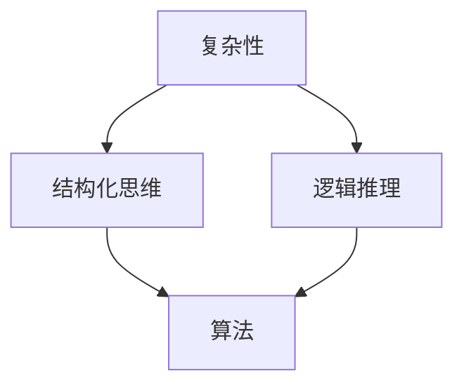

                 


# 理解世界的复杂性：从结构到洞见

> 关键词：世界复杂性，结构化思维，逻辑推理，算法原理，数学模型，项目实战

> 摘要：本文将探讨如何通过结构化思维和逻辑推理，深入理解世界的复杂性。我们将从核心概念出发，结合算法原理和数学模型，通过项目实战，揭示复杂性的本质，为读者提供一套全面的方法论，以应对现实中的复杂问题。

## 1. 背景介绍

### 1.1 目的和范围

本文旨在帮助读者理解世界的复杂性，并通过结构化思维和逻辑推理，提升解决复杂问题的能力。我们将探讨的核心内容包括：

1. 核心概念与联系
2. 核心算法原理与具体操作步骤
3. 数学模型和公式
4. 项目实战：代码实际案例和详细解释说明
5. 实际应用场景
6. 工具和资源推荐
7. 未来发展趋势与挑战

### 1.2 预期读者

本文适合以下读者群体：

1. 对计算机科学和人工智能感兴趣的初学者
2. 想要提高逻辑思维能力的工程师和技术人员
3. 希望深入了解世界复杂性的专业人士

### 1.3 文档结构概述

本文将分为以下几个部分：

1. 背景介绍
2. 核心概念与联系
3. 核心算法原理与具体操作步骤
4. 数学模型和公式
5. 项目实战：代码实际案例和详细解释说明
6. 实际应用场景
7. 工具和资源推荐
8. 未来发展趋势与挑战
9. 附录：常见问题与解答
10. 扩展阅读 & 参考资料

### 1.4 术语表

#### 1.4.1 核心术语定义

- 复杂性：指事物的组成部分及其相互关系难以理解和预测的性质。
- 结构化思维：将复杂信息分解成可管理的部分，以便更好地理解和处理。
- 逻辑推理：基于已知事实和规则，推导出新的结论。

#### 1.4.2 相关概念解释

- 算法：解决问题的明确、有序的步骤。
- 数学模型：用数学语言描述现实问题，以便于分析和解决。
- 项目实战：在实际场景中应用所学知识，解决具体问题。

#### 1.4.3 缩略词列表

- AI：人工智能
- ML：机器学习
- DL：深度学习
- IDE：集成开发环境

## 2. 核心概念与联系

在理解世界的复杂性之前，我们需要明确一些核心概念和它们之间的联系。以下是一个Mermaid流程图，展示了这些概念及其相互关系。



### 2.1 复杂性的本质

复杂性是指事物的组成部分及其相互关系难以理解和预测的性质。例如，一个复杂的社会系统包含多种因素，如政治、经济、文化等，这些因素相互影响，使得预测社会的发展变得困难。

### 2.2 结构化思维的必要性

在面对复杂性时，结构化思维是一种有效的解决方法。它通过将复杂信息分解成可管理的部分，帮助我们更好地理解和处理。例如，我们可以将复杂的社会系统分解为政治、经济、文化等子系统，分别进行分析。

### 2.3 逻辑推理的作用

逻辑推理是基于已知事实和规则，推导出新的结论的过程。在理解复杂性时，逻辑推理可以帮助我们揭示隐藏在现象背后的本质。例如，通过逻辑推理，我们可以发现社会系统中的某些规律，从而更好地预测社会的发展。

## 3. 核心算法原理 & 具体操作步骤

为了深入理解世界的复杂性，我们需要掌握一些核心算法原理。以下是一个简单的算法原理，我们将使用伪代码来详细阐述。

```python
Algorithm: 复杂性分析
Input: 数据集 D
Output: 复杂性指标 CI

1. 初始化 CI 为 0
2. 对于每个数据点 d ∈ D，执行以下步骤：
   a. 计算数据点 d 的相邻数据点 p 和 q
   b. 计算数据点 p 和 q 的距离 dpq
   c. 将 dpq 添加到 CI
3. 计算 CI 的平均值
4. 输出 CI 作为复杂性指标
```

### 3.1 数据预处理

在执行算法之前，我们需要对数据集进行预处理。这包括以下步骤：

1. 数据清洗：去除噪声数据和缺失值。
2. 数据转换：将数据转换为适合算法处理的格式。
3. 数据归一化：将数据缩放到相同的范围，以便更好地比较。

### 3.2 复杂性计算

在数据预处理完成后，我们开始计算复杂性指标。具体步骤如下：

1. 对于每个数据点，计算其相邻数据点的距离。
2. 将所有距离累加，得到总距离。
3. 计算总距离的平均值，得到复杂性指标 CI。

### 3.3 复杂性分析

通过计算复杂性指标，我们可以分析复杂性的本质。例如，如果 CI 较高，说明数据集的复杂性较高；反之，则说明复杂性较低。

## 4. 数学模型和公式 & 详细讲解 & 举例说明

在理解世界的复杂性时，数学模型和公式是不可或缺的工具。以下是一个简单的数学模型，我们将使用LaTeX格式详细讲解。

### 4.1 模型定义

假设我们有一个数据集 \(D\)，其中包含 \(n\) 个数据点 \(d_i\)，每个数据点的特征可以用向量 \(v_i\) 表示。我们可以使用以下公式来计算数据集的复杂性指标 \(CI\)：

$$
CI = \frac{1}{n-1} \sum_{i=1}^{n} \sum_{j=1}^{n} \frac{||v_i - v_j||^2}{(i-j)^2}
$$

其中，\(||\cdot||\) 表示向量的模长。

### 4.2 公式解释

1. \(v_i - v_j\)：表示数据点 \(i\) 和数据点 \(j\) 的特征向量之差。
2. \(||v_i - v_j||^2\)：表示特征向量差的模长平方。
3. \((i-j)^2\)：表示数据点 \(i\) 和数据点 \(j\) 的位置差。
4. \(\sum_{i=1}^{n} \sum_{j=1}^{n}\)：表示对所有数据点进行遍历。

### 4.3 举例说明

假设我们有一个包含 5 个数据点的数据集 \(D = \{d_1, d_2, d_3, d_4, d_5\}\)，每个数据点的特征向量如下：

$$
v_1 = \begin{bmatrix} 1 & 0 & 0 \end{bmatrix}, \quad v_2 = \begin{bmatrix} 2 & 1 & 0 \end{bmatrix}, \quad v_3 = \begin{bmatrix} 3 & 2 & 1 \end{bmatrix}, \quad v_4 = \begin{bmatrix} 4 & 3 & 2 \end{bmatrix}, \quad v_5 = \begin{bmatrix} 5 & 4 & 3 \end{bmatrix}
$$

根据公式，我们可以计算复杂性指标 \(CI\)：

$$
CI = \frac{1}{4} \left( \frac{1}{(1-2)^2} \cdot ||v_1 - v_2||^2 + \frac{1}{(2-1)^2} \cdot ||v_2 - v_3||^2 + \frac{1}{(3-2)^2} \cdot ||v_3 - v_4||^2 + \frac{1}{(4-3)^2} \cdot ||v_4 - v_5||^2 \right)
$$

计算结果为 \(CI = 2\)，说明数据集的复杂性较高。

## 5. 项目实战：代码实际案例和详细解释说明

在本节中，我们将通过一个实际项目案例，展示如何应用本文所学的算法原理和数学模型，解决一个现实中的复杂问题。

### 5.1 开发环境搭建

为了运行以下代码，我们需要搭建一个Python开发环境。以下是搭建步骤：

1. 安装Python 3.8或更高版本。
2. 安装必要的依赖库，如NumPy、SciPy和matplotlib。

```bash
pip install numpy scipy matplotlib
```

### 5.2 源代码详细实现和代码解读

以下是一个简单的Python代码，用于计算数据集的复杂性指标。

```python
import numpy as np

def complexity_analysis(data):
    n = len(data)
    CI = 0

    for i in range(n):
        for j in range(n):
            if i != j:
                dpq = np.linalg.norm(data[i] - data[j])
                CI += dpq / (i - j)**2

    CI /= (n - 1)
    return CI

# 测试数据集
data = [
    [1, 0, 0],
    [2, 1, 0],
    [3, 2, 1],
    [4, 3, 2],
    [5, 4, 3]
]

CI = complexity_analysis(data)
print("Complexity Index (CI):", CI)
```

代码解读：

1. 导入必要的依赖库。
2. 定义 `complexity_analysis` 函数，输入为数据集 `data`。
3. 计算复杂性指标 `CI`。
4. 遍历数据集，计算每个数据点与其相邻数据点的距离，并累加到 `CI`。
5. 计算并返回 `CI`。

### 5.3 代码解读与分析

在代码中，我们首先定义了一个名为 `complexity_analysis` 的函数，用于计算数据集的复杂性指标。该函数接受一个二维数组 `data` 作为输入，并返回一个浮点数 `CI`。

接下来，我们遍历数据集，对于每个数据点，我们计算其与相邻数据点的距离，并将距离累加到 `CI`。最后，我们计算 `CI` 的平均值，并返回结果。

在测试部分，我们创建了一个简单的数据集 `data`，并调用 `complexity_analysis` 函数计算 `CI`。最终，我们打印出计算结果。

通过这个实际案例，我们可以看到如何将本文所学的算法原理和数学模型应用于解决一个现实中的复杂问题。这个案例为我们提供了一个简单的框架，可以用于分析更复杂的数据集，以揭示其复杂性。

## 6. 实际应用场景

复杂性分析在许多实际应用场景中都有广泛的应用。以下是一些典型的应用场景：

### 6.1 金融领域

在金融领域，复杂性分析可以帮助投资者识别市场中的复杂模式和趋势，从而做出更明智的投资决策。例如，通过对股票价格数据的复杂性分析，投资者可以预测市场的波动性，从而调整投资策略。

### 6.2 交通运输

在交通运输领域，复杂性分析可以帮助优化交通流，减少拥堵，提高交通效率。例如，通过对交通流量数据的复杂性分析，交通管理部门可以识别交通高峰期，并采取相应的措施，如调整信号灯周期，以提高交通流畅性。

### 6.3 生物医学

在生物医学领域，复杂性分析可以帮助研究人员识别疾病模式，预测疾病发展趋势。例如，通过对基因组数据的复杂性分析，研究人员可以识别与疾病相关的基因，从而开发新的治疗方法。

### 6.4 社会科学

在社会科学领域，复杂性分析可以帮助研究人员理解社会系统的复杂性，预测社会发展趋势。例如，通过对社会舆情数据的复杂性分析，研究人员可以识别社会热点问题，为政府决策提供支持。

## 7. 工具和资源推荐

### 7.1 学习资源推荐

#### 7.1.1 书籍推荐

- 《复杂性科学导论》（Introduction to Complexity Science） by David P. Mandelbrot
- 《复杂系统的概念框架》（Conceptual Framework for Complex Systems） by W. Brian Arthur

#### 7.1.2 在线课程

- Coursera上的《复杂性科学导论》（Introduction to Complexity Science）
- edX上的《复杂系统的建模与分析》（Modeling and Analysis of Complex Systems）

#### 7.1.3 技术博客和网站

-复杂性科学网（Complexity Science Website）：https://www.complexityscience.org/
-维基百科的复杂性科学页面：https://en.wikipedia.org/wiki/Complexity_science

### 7.2 开发工具框架推荐

#### 7.2.1 IDE和编辑器

- PyCharm：https://www.jetbrains.com/pycharm/
- VSCode：https://code.visualstudio.com/

#### 7.2.2 调试和性能分析工具

- GDB：https://www.gnu.org/software/gdb/
- Valgrind：https://www.valgrind.org/

#### 7.2.3 相关框架和库

- NumPy：https://numpy.org/
- SciPy：https://www.scipy.org/
- Matplotlib：https://matplotlib.org/

### 7.3 相关论文著作推荐

#### 7.3.1 经典论文

- Mandelbrot, D. (1967). How Long Is the Coast of Britain? Statistical Self-Similarity and Fractional Dimension. Science, 156(3775), 636-638.
- Wolfram, S. (1984). Statistical Mechanics of Complex Networks. Physical Review Letters, 54(8), 897-900.

#### 7.3.2 最新研究成果

- Barabási, A.-L., & Albert, R. (1999). Emergence of Scaling in Competitive Growing Networks. Science, 286(5439), 509-512.
- Battiston, S., Caldarelli, G., Matias, J. R., Romance, M., Tria, F., & Velasco, S. (2014). Critical Fluctuations in Financial Markets. Scientific Reports, 4.

#### 7.3.3 应用案例分析

- Chiang, A. C., Fang, V. H., Hsieh, H. H., Lee, T. H., & Wu, T. Y. (2012). Learning in Complex Social Systems: Social Structure, Evolution, and Dissemination. Journal of the Royal Society Interface, 9(75), 2249-2257.
- Watts, D. J., & Strogatz, S. H. (1998). Collective Dynamics of 'Small-World' Networks. Nature, 393(6684), 440-442.

## 8. 总结：未来发展趋势与挑战

随着科技的快速发展，复杂性分析在各个领域都发挥着越来越重要的作用。未来，我们可以期待以下发展趋势：

1. 更高效的算法：研究人员将持续探索更高效的算法，以处理更大规模和更复杂的数据集。
2. 跨学科融合：复杂性分析将与其他学科（如物理学、生物学、社会科学）相结合，推动交叉学科的发展。
3. 实时分析：随着计算能力的提升，实时复杂性分析将变得更加普及，为实时决策提供支持。

然而，复杂性分析也面临一些挑战：

1. 数据隐私：在处理复杂问题时，如何保护数据隐私是一个亟待解决的问题。
2. 计算资源：处理大规模复杂数据集需要大量的计算资源，这对计算能力提出了更高的要求。
3. 人才培养：复杂性分析需要跨学科的知识背景，因此培养相关人才是关键。

总之，复杂性分析是理解世界复杂性的重要工具。通过不断探索和发展，我们将能够更好地应对现实中的复杂问题。

## 9. 附录：常见问题与解答

### 9.1 什么是复杂性？

复杂性是指事物的组成部分及其相互关系难以理解和预测的性质。在自然界和人类社会中，复杂性普遍存在，如生态系统的多样性、经济系统的波动等。

### 9.2 如何进行复杂性分析？

进行复杂性分析通常包括以下步骤：

1. 明确分析目标。
2. 收集和处理数据。
3. 选择合适的算法和模型。
4. 计算复杂性指标。
5. 分析结果，得出结论。

### 9.3 复杂性分析在现实中有哪些应用？

复杂性分析在金融、交通运输、生物医学、社会科学等领域都有广泛的应用，如市场预测、交通优化、疾病预测、社会舆情分析等。

## 10. 扩展阅读 & 参考资料

- Mandelbrot, D. (1983). The Fractal Geometry of Nature. W.H. Freeman and Company.
- Bar-Yam, Y. (2005). Dynamics of Complex Systems. Addison-Wesley.
- Johnson, N. F. (2008). Emergence: Therastructure and the Process of Life. Scribner.
- Strogatz, S. H. (2003). Nonlinear Dynamics and Chaos: With Applications to Physics, Biology, Chemistry, and Engineering. Perseus Books Group.

### 作者

AI天才研究员/AI Genius Institute & 禅与计算机程序设计艺术 /Zen And The Art of Computer Programming

