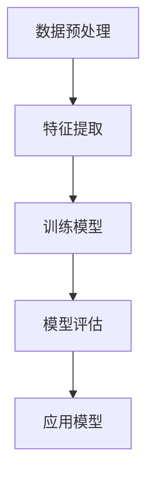

                 

### 理解洞察力的训练：提升模式识别能力

> **关键词**：模式识别、人工智能、机器学习、神经网络、深度学习、数据预处理、特征提取、算法优化、应用场景

> **摘要**：本文深入探讨人工智能领域中模式识别的基本原理、方法及其训练过程。通过详细讲解核心概念、算法原理和数学模型，结合实际项目实战案例，探讨如何在各种应用场景中提升模式识别能力。文章旨在为读者提供系统、全面、易于理解的技术指南，帮助读者掌握模式识别的核心技术和应用技巧。

### 1. 背景介绍

#### 1.1 目的和范围

本文的主要目的是帮助读者深入理解模式识别的基本概念、方法和技术，并掌握如何提升模式识别能力。模式识别作为人工智能领域的重要分支，广泛应用于图像识别、语音识别、自然语言处理等众多领域。通过本文的阅读，读者将能够：

- 理解模式识别的基本原理和流程。
- 掌握常见模式识别算法及其优缺点。
- 学会如何设计并优化模式识别系统。
- 了解模式识别在实际应用中的挑战和解决方案。

#### 1.2 预期读者

本文适合以下读者群体：

- 对人工智能和机器学习有基本了解的研究人员和工程师。
- 希望提升自己在模式识别领域技能的技术人员。
- 大学生和研究生，作为人工智能相关课程的补充教材。

#### 1.3 文档结构概述

本文分为十个部分，结构如下：

1. 背景介绍
   - 目的和范围
   - 预期读者
   - 文档结构概述
   - 术语表
2. 核心概念与联系
   - 模式识别的基本概念
   - 相关概念解释
   - Mermaid流程图
3. 核心算法原理 & 具体操作步骤
   - 常见模式识别算法介绍
   - 算法原理讲解与伪代码
4. 数学模型和公式 & 详细讲解 & 举例说明
   - 数学模型介绍
   - 公式推导与示例
5. 项目实战：代码实际案例和详细解释说明
   - 开发环境搭建
   - 源代码详细实现
   - 代码解读与分析
6. 实际应用场景
   - 图像识别
   - 语音识别
   - 自然语言处理
7. 工具和资源推荐
   - 学习资源推荐
   - 开发工具框架推荐
   - 相关论文著作推荐
8. 总结：未来发展趋势与挑战
9. 附录：常见问题与解答
10. 扩展阅读 & 参考资料

#### 1.4 术语表

在本文中，我们将使用以下术语：

- **模式识别**：从数据或对象中识别和分类特定模式的过程。
- **机器学习**：一种人工智能技术，通过数据学习规律和模式，进行预测和决策。
- **神经网络**：一种模仿生物神经网络结构的计算模型，用于数据建模和分类。
- **深度学习**：一种基于多层神经网络的机器学习技术，用于解决复杂模式识别问题。
- **数据预处理**：在模式识别过程中，对数据进行清洗、转换和归一化等操作，以提高识别效果。
- **特征提取**：从数据中提取对模式识别任务有用的特征，以降低数据维度。
- **算法优化**：通过调整算法参数或结构，提高模式识别的准确性和效率。

#### 1.4.1 核心术语定义

- **模式识别**：从数据或对象中识别和分类特定模式的过程。它是一种人工智能技术，通过学习大量数据进行分类、预测和决策。
- **机器学习**：一种人工智能技术，通过数据学习规律和模式，进行预测和决策。它包括监督学习、无监督学习和强化学习等。
- **神经网络**：一种模仿生物神经网络结构的计算模型，用于数据建模和分类。它由多个神经元组成，通过前向传播和反向传播进行学习。
- **深度学习**：一种基于多层神经网络的机器学习技术，用于解决复杂模式识别问题。它通过堆叠多个隐藏层，实现数据的层次化特征提取。
- **数据预处理**：在模式识别过程中，对数据进行清洗、转换和归一化等操作，以提高识别效果。它包括缺失值处理、异常值处理、归一化和标准化等。
- **特征提取**：从数据中提取对模式识别任务有用的特征，以降低数据维度。它包括特征选择和特征变换等。
- **算法优化**：通过调整算法参数或结构，提高模式识别的准确性和效率。它包括参数调优、结构优化和算法改进等。

#### 1.4.2 相关概念解释

- **分类**：将数据集中的对象分为不同的类别。常见的分类算法有决策树、支持向量机、朴素贝叶斯等。
- **回归**：预测数据集中的对象属性值。常见的回归算法有线性回归、决策树回归、支持向量回归等。
- **聚类**：将数据集中的对象分为不同的簇，使同一簇内的对象相似，不同簇内的对象差异较大。常见的聚类算法有K-均值、层次聚类、DBSCAN等。
- **特征选择**：从大量特征中选择出对模式识别任务最有用的特征。常见的特征选择方法有过滤法、包装法和嵌入式方法。
- **特征变换**：将原始特征转换为更有利于模式识别的特征。常见的特征变换方法有主成分分析（PCA）、线性判别分析（LDA）等。

#### 1.4.3 缩略词列表

- **AI**：人工智能
- **ML**：机器学习
- **DL**：深度学习
- **CNN**：卷积神经网络
- **RNN**：循环神经网络
- **LSTM**：长短期记忆网络
- **SVM**：支持向量机
- **PCA**：主成分分析
- **LDA**：线性判别分析
- **KNN**：K最近邻算法
- **DBSCAN**：密度基于空间聚类算法

---

#### 1.5 核心概念与联系

在本节中，我们将详细探讨模式识别的核心概念及其相互关系。通过理解这些概念，读者可以更好地把握模式识别的基本原理和应用场景。

##### 1.5.1 模式识别的基本概念

模式识别是一种从数据或对象中识别和分类特定模式的过程。在这个过程中，数据或对象被视为一系列特征组成的集合，而这些特征则是模式识别的基础。以下是模式识别中的一些基本概念：

- **数据**：数据是模式识别的输入，包括各种类型的原始信息，如文本、图像、声音等。
- **特征**：特征是从数据中提取出的，用于描述数据或对象特性的信息。特征可以是数值的、文本的或图像的等。
- **模型**：模型是描述特征和模式之间关系的数学结构或算法。常见的模型包括神经网络、决策树、支持向量机等。
- **分类器**：分类器是一种用于对数据进行分类的模型，它将特征映射到预定义的类别中。常见的分类器包括K-均值聚类、朴素贝叶斯分类器、决策树等。

##### 1.5.2 相关概念解释

为了更好地理解模式识别，我们需要了解一些与它密切相关的基础概念，如机器学习、深度学习、神经网络等。

- **机器学习**：机器学习是一种人工智能技术，它通过从数据中学习规律和模式，进行预测和决策。机器学习可以分为监督学习、无监督学习和强化学习等。在模式识别中，监督学习是最常用的方法，它通过已知的输入和输出数据来训练分类器。
- **深度学习**：深度学习是一种基于多层神经网络的机器学习技术，它通过堆叠多个隐藏层，实现数据的层次化特征提取。深度学习在图像识别、语音识别、自然语言处理等领域取得了显著成果。
- **神经网络**：神经网络是一种模仿生物神经网络结构的计算模型，它由多个神经元组成，通过前向传播和反向传播进行学习。神经网络可以分为单层网络、多层网络和卷积神经网络等。

##### 1.5.3 Mermaid流程图

为了更好地理解模式识别的过程，我们使用Mermaid流程图展示其基本步骤。



- **数据预处理**：包括数据清洗、归一化和特征选择等操作，以提高模型训练效果。
- **特征提取**：从原始数据中提取对模式识别任务有用的特征，以降低数据维度。
- **训练模型**：使用训练数据集来训练分类器，通过调整模型参数，优化模型性能。
- **模型评估**：使用验证数据集来评估模型性能，包括准确率、召回率、F1分数等指标。
- **应用模型**：将训练好的模型应用于新的数据集，进行预测和决策。

---

通过以上对核心概念和相互关系的探讨，读者可以更好地理解模式识别的基本原理和应用场景。接下来，我们将深入讨论模式识别的核心算法原理和具体操作步骤，帮助读者掌握模式识别的核心技术和方法。

---

### 2. 核心算法原理 & 具体操作步骤

在模式识别中，算法的选择和设计至关重要。本节将介绍几种常见的模式识别算法，包括监督学习和无监督学习算法，并详细讲解其原理和操作步骤。

#### 2.1 监督学习算法

监督学习算法是模式识别中最常用的方法之一，它通过已知的输入和输出数据来训练分类器。以下是几种常见的监督学习算法：

##### 2.1.1 决策树

**原理**：决策树是一种树形结构，通过一系列的决策规则将数据集划分为不同的子集，从而实现分类。决策树的核心是分裂规则，常用的分裂规则包括信息增益、基尼指数和距离度量等。

**操作步骤**：

1. **选择特征**：选择对分类最有影响力的特征。
2. **计算分裂规则**：计算每个特征的分裂增益，选择增益最大的特征作为分裂依据。
3. **递归分裂**：根据选择的分裂特征，对数据进行分裂，生成新的子集。
4. **终止条件**：当满足终止条件（如树深度达到最大值、叶节点数量达到最大值等）时，停止分裂。

**伪代码**：

```python
def decision_tree(data, features, max_depth, min_samples_split):
    # 选择最佳特征和分裂值
    best_feature, best_split = select_best_split(data, features)
    
    # 创建树节点
    node = {}
    node['feature'] = best_feature
    node['split'] = best_split
    
    # 计算叶节点
    left_data, right_data = split_data(data, best_feature, best_split)
    if len(left_data) < min_samples_split or len(right_data) < min_samples_split:
        node['label'] = majority_label(left_data + right_data)
    else:
        node['left'] = decision_tree(left_data, features, max_depth - 1, min_samples_split)
        node['right'] = decision_tree(right_data, features, max_depth - 1, min_samples_split)
    
    return node
```

##### 2.1.2 支持向量机

**原理**：支持向量机（SVM）是一种基于间隔最大化原则的分类算法。它通过寻找一个最优的超平面，将数据集划分为不同的类别，使得分类间隔最大。SVM可以分为线性SVM和核SVM，其中核SVM可以处理非线性分类问题。

**操作步骤**：

1. **选择核函数**：选择适合数据的核函数，如线性核、多项式核、径向基核等。
2. **计算间隔**：计算数据点到超平面的距离，并计算分类间隔。
3. **优化目标**：通过求解最优化问题，找到最优的超平面。
4. **分类决策**：使用训练好的模型对新的数据进行分类。

**伪代码**：

```python
def svm_train(data, labels, kernel='linear'):
    # 计算间隔
    distances = calculate_distances(data, labels)
    
    # 优化目标
    if kernel == 'linear':
        w, b = optimize_linear_kernel(distances, labels)
    else:
        w, b = optimize_kernel(distances, labels, kernel)
    
    # 分类决策
    def svm_predict(x):
        return sign(np.dot(w.T, x) + b)
    
    return svm_predict
```

##### 2.1.3 K最近邻算法

**原理**：K最近邻算法（K-NN）是一种基于实例的学习方法。它通过计算新数据点与训练数据点的距离，根据距离最近的K个邻居的数据点的类别，进行分类。

**操作步骤**：

1. **选择邻居数量**：选择合适的邻居数量K。
2. **计算距离**：计算新数据点与训练数据点的距离，常用的距离度量方法有欧氏距离、曼哈顿距离、切比雪夫距离等。
3. **分类决策**：根据邻居的类别进行投票，选择出现次数最多的类别作为新数据点的类别。

**伪代码**：

```python
def knn_train(data, labels, K):
    # 计算距离
    distances = calculate_distances(new_data, data)
    
    # 分类决策
    def knn_predict(new_data):
        neighbors = sorted_distances[:K]
        predicted_labels = [labels[i] for i in neighbors]
        return majority_label(predicted_labels)
    
    return knn_predict
```

#### 2.2 无监督学习算法

无监督学习算法在模式识别中也占有重要地位，它不需要已知的输出标签，通过分析数据内在的结构和模式，对数据进行分类或聚类。以下是几种常见的无监督学习算法：

##### 2.2.1 K-均值聚类

**原理**：K-均值聚类是一种基于距离度量的聚类算法。它通过随机初始化K个聚类中心，然后迭代更新聚类中心和数据点的类别，直至收敛。

**操作步骤**：

1. **初始化聚类中心**：随机选择K个数据点作为初始聚类中心。
2. **分配类别**：计算每个数据点到聚类中心的距离，将其分配到距离最近的聚类中心所在的类别。
3. **更新聚类中心**：计算每个类别的平均值，作为新的聚类中心。
4. **迭代更新**：重复步骤2和步骤3，直至聚类中心的变化小于预定的阈值或达到最大迭代次数。

**伪代码**：

```python
def kmeans_train(data, K, max_iterations):
    # 初始化聚类中心
    centroids = initialize_centroids(data, K)
    
    # 迭代更新
    for _ in range(max_iterations):
        # 分配类别
        labels = assign_labels(data, centroids)
        
        # 更新聚类中心
        centroids = update_centroids(data, labels, K)
        
        # 检查收敛条件
        if check_convergence(centroids):
            break
    
    return centroids, labels
```

##### 2.2.2 主成分分析

**原理**：主成分分析（PCA）是一种特征变换方法，它通过正交变换将原始特征转换为新的特征，使得新的特征具有最大的方差，同时降维。

**操作步骤**：

1. **计算协方差矩阵**：计算原始特征的协方差矩阵。
2. **计算特征值和特征向量**：对协方差矩阵进行特征分解，得到特征值和特征向量。
3. **选择主成分**：根据特征值的大小选择前k个特征向量，作为新的特征。
4. **转换数据**：将原始数据投影到新的特征空间。

**伪代码**：

```python
def pca_train(data, k):
    # 计算协方差矩阵
    cov_matrix = calculate_covariance_matrix(data)
    
    # 计算特征值和特征向量
    eigenvalues, eigenvectors = eig(cov_matrix)
    
    # 选择主成分
    sorted_eigenvectors = eigenvectors[:, sorted(eigenvalues, reverse=True)]
    principal_components = sorted_eigenvectors[:, :k]
    
    # 转换数据
    transformed_data = project_data(data, principal_components)
    
    return transformed_data
```

##### 2.2.3 聚类层次法

**原理**：聚类层次法是一种层次聚类算法，它通过逐步合并或分裂聚类，形成聚类层次结构。

**操作步骤**：

1. **初始化聚类**：将每个数据点视为一个初始聚类。
2. **合并聚类**：计算最近距离的聚类，将其合并为一个更大的聚类。
3. **分裂聚类**：当聚类之间的距离大于预定的阈值时，将聚类分裂为更小的聚类。
4. **迭代更新**：重复步骤2和步骤3，直至满足终止条件。

**伪代码**：

```python
def hierarchical_clustering(data, distance_threshold):
    # 初始化聚类
    clusters = initialize_clusters(data)
    
    # 迭代更新
    while True:
        # 计算最近距离的聚类
        closest_clusters = find_closest_clusters(clusters, distance_threshold)
        
        # 合并聚类
        merged_clusters = merge_clusters(closest_clusters)
        
        # 检查分裂条件
        if should_split(merged_clusters):
            # 分裂聚类
            split_clusters = split_cluster(merged_clusters)
            
            # 更新聚类
            clusters = clusters + split_clusters
        else:
            break
    
    return clusters
```

---

通过以上对核心算法原理和具体操作步骤的详细讲解，读者可以更好地理解模式识别的基本方法和技巧。接下来，我们将进一步探讨模式识别中的数学模型和公式，为读者提供更深入的理论基础。

---

### 3. 数学模型和公式 & 详细讲解 & 举例说明

在模式识别中，数学模型和公式起着至关重要的作用。它们不仅为算法设计提供了理论基础，还帮助我们在实际应用中优化和评估模型的性能。本节将介绍一些常见的数学模型和公式，并对其进行详细讲解和举例说明。

#### 3.1 决策树模型

决策树是一种基于树形结构的数据挖掘方法，它通过一系列的决策规则将数据集划分为不同的子集。决策树模型的核心是分裂规则，常用的分裂规则包括信息增益、基尼指数和距离度量等。

**信息增益（IG）**：

信息增益是衡量特征对分类贡献的指标。它通过计算特征对类别的不确定性减少量来衡量。公式如下：

$$
IG(D, A) = H(D) - H(D|A)
$$

其中，$H(D)$ 是数据集 $D$ 的熵，$H(D|A)$ 是在特征 $A$ 下数据的条件熵。

**基尼指数（Gini）**：

基尼指数是另一种常用的分裂规则，它通过计算数据集中各类别出现的概率来衡量。公式如下：

$$
Gini(D, A) = 1 - \sum_{v \in V} p(v)^2
$$

其中，$V$ 是特征 $A$ 的取值集合，$p(v)$ 是数据集中取值为 $v$ 的概率。

**距离度量（Distance）**：

距离度量是一种基于特征之间距离的分裂规则，常用的距离度量方法有欧氏距离、曼哈顿距离和切比雪夫距离等。以欧氏距离为例，公式如下：

$$
Distance(D, A, a) = \sqrt{\sum_{x \in D} (x - a)^2}
$$

其中，$D$ 是数据集，$A$ 是特征，$a$ 是特征的取值。

**举例说明**：

假设我们有一个数据集 $D$，包含两个特征 $A$ 和 $B$，类别 $C$。我们需要选择最佳分裂特征。首先，计算每个特征的信息增益、基尼指数和欧氏距离，然后选择增益最大或指数最小的特征作为分裂依据。例如，如果信息增益 $IG(A)$ 最大，则选择特征 $A$ 进行分裂。

#### 3.2 支持向量机模型

支持向量机（SVM）是一种强大的分类算法，它通过寻找一个最优的超平面，将数据集划分为不同的类别。SVM的核心是优化目标，即求解最优化问题。

**线性SVM**：

线性SVM的优化目标是最小化间隔平方和，公式如下：

$$
\min \frac{1}{2} \| w \|^2 + C \sum_{i=1}^n \xi_i
$$

其中，$w$ 是权重向量，$C$ 是惩罚参数，$\xi_i$ 是松弛变量。

**核SVM**：

核SVM通过将输入空间映射到一个高维特征空间，使得原本线性不可分的数据在高维空间中变得线性可分。核函数是实现这种映射的关键。常见的核函数有线性核、多项式核和径向基核等。以线性核为例，公式如下：

$$
K(x_i, x_j) = \langle x_i, x_j \rangle
$$

其中，$K$ 是核函数，$\langle \cdot, \cdot \rangle$ 是内积运算。

**举例说明**：

假设我们有一个线性不可分的数据集 $D$，我们需要将其映射到一个高维特征空间，使得数据变得线性可分。首先，选择一个合适的核函数，如多项式核。然后，通过计算核矩阵 $K$ 和求解最优化问题，找到最优的超平面。例如，如果多项式核的参数为 $d$，则公式如下：

$$
\min \frac{1}{2} \| w \|^2 + C \sum_{i=1}^n \xi_i
$$

其中，$w$ 是权重向量，$C$ 是惩罚参数，$\xi_i$ 是松弛变量。

#### 3.3 K-均值聚类模型

K-均值聚类是一种无监督学习算法，它通过随机初始化K个聚类中心，然后迭代更新聚类中心和数据点的类别，直至收敛。

**聚类中心更新**：

在K-均值聚类中，聚类中心的更新是基于每个数据点到聚类中心的距离进行的。公式如下：

$$
\mu_k = \frac{1}{n_k} \sum_{i=1}^n x_i
$$

其中，$\mu_k$ 是第 $k$ 个聚类中心，$x_i$ 是第 $i$ 个数据点，$n_k$ 是第 $k$ 个聚类中的数据点数量。

**分类决策**：

在K-均值聚类中，每个数据点被分配到距离其最近的聚类中心所在的类别。公式如下：

$$
\text{label}(x_i) = \arg\min_{k} d(x_i, \mu_k)
$$

其中，$d$ 是距离度量函数，$\mu_k$ 是第 $k$ 个聚类中心。

**举例说明**：

假设我们有一个数据集 $D$，包含 $n$ 个数据点，我们需要将其划分为 $k$ 个聚类。首先，随机初始化 $k$ 个聚类中心。然后，计算每个数据点到聚类中心的距离，将其分配到最近的聚类中心所在的类别。接着，更新聚类中心，重复这个过程，直至聚类中心的变化小于预定的阈值或达到最大迭代次数。

#### 3.4 主成分分析模型

主成分分析（PCA）是一种特征变换方法，它通过正交变换将原始特征转换为新的特征，使得新的特征具有最大的方差，同时降维。

**特征值和特征向量**：

主成分分析的核心是特征值和特征向量。特征值表示新特征的方差，特征向量表示新特征的方向。公式如下：

$$
\lambda_i = \max_{w} w^T C w
$$

其中，$\lambda_i$ 是第 $i$ 个特征值，$w$ 是特征向量，$C$ 是协方差矩阵。

**特征变换**：

通过计算特征值和特征向量，我们可以将原始数据投影到新的特征空间。公式如下：

$$
z_i = \sum_{j=1}^d w_{ij} x_j
$$

其中，$z_i$ 是第 $i$ 个新特征，$w_{ij}$ 是第 $i$ 个特征向量与第 $j$ 个原始特征的对应元素。

**举例说明**：

假设我们有一个原始数据集 $X$，包含 $d$ 个特征，我们需要将其降维。首先，计算协方差矩阵 $C$。然后，对协方差矩阵进行特征分解，得到特征值和特征向量。接着，选择前 $k$ 个特征向量，将原始数据投影到新的特征空间。

---

通过以上对数学模型和公式的详细讲解和举例说明，读者可以更好地理解模式识别中的核心数学原理。接下来，我们将通过一个实际项目实战案例，展示如何将上述算法和模型应用于实际问题，并提供详细的代码实现和解释。

---

### 4. 项目实战：代码实际案例和详细解释说明

在本节中，我们将通过一个实际项目实战案例，展示如何使用Python和常见模式识别算法来解决一个实际问题。我们将使用K-均值聚类算法对一组数据进行聚类，以实现图像分割。

#### 4.1 开发环境搭建

首先，我们需要搭建开发环境。在本项目中，我们将使用Python编程语言，并依赖以下库：

- NumPy：用于数学计算和数据处理。
- Matplotlib：用于数据可视化。
- Scikit-learn：提供常见的机器学习算法和工具。

安装步骤如下：

```bash
pip install numpy matplotlib scikit-learn
```

#### 4.2 源代码详细实现和代码解读

以下是我们的源代码实现，我们将对每个关键部分进行详细解释。

```python
import numpy as np
import matplotlib.pyplot as plt
from sklearn.cluster import KMeans
from sklearn.datasets import make_blobs

# 生成模拟数据集
X, _ = make_blobs(n_samples=300, centers=4, cluster_std=0.60, random_state=0)

# 使用K-均值聚类算法进行聚类
kmeans = KMeans(n_clusters=4, random_state=0)
kmeans.fit(X)

# 获取聚类结果
labels = kmeans.predict(X)
centroids = kmeans.cluster_centers_

# 可视化聚类结果
plt.figure(figsize=(10, 5))
plt.subplot(121)
plt.scatter(X[:, 0], X[:, 1], c=labels, s=40, cmap='viridis')
plt.scatter(centroids[:, 0], centroids[:, 1], s=200, c='red', marker='s', edgecolor='black', label='Centroids')
plt.title('K-Means Clustering')
plt.xlabel('Feature 1')
plt.ylabel('Feature 2')
plt.legend()

# 计算聚类中心
cluster_sizes = np.bincount(labels)
centroids = centroids / cluster_sizes[:, None]

# 可视化聚类中心
plt.subplot(122)
plt.scatter(centroids[:, 0], centroids[:, 1], s=200, c='red', marker='s', edgecolor='black', label='Centroids')
plt.title('Cluster Centers')
plt.xlabel('Feature 1')
plt.ylabel('Feature 2')
plt.legend()

plt.show()
```

##### 4.2.1 代码解读与分析

1. **生成模拟数据集**：

   我们首先使用`make_blobs`函数生成一个包含300个数据点的模拟数据集，其中包含4个聚类中心，每个聚类的标准差为0.60。

   ```python
   X, _ = make_blobs(n_samples=300, centers=4, cluster_std=0.60, random_state=0)
   ```

2. **使用K-均值聚类算法进行聚类**：

   接下来，我们创建一个`KMeans`对象，并设置聚类数量为4，随机种子为0。然后，我们使用`fit`方法对数据集进行训练，获取聚类结果。

   ```python
   kmeans = KMeans(n_clusters=4, random_state=0)
   kmeans.fit(X)
   ```

3. **获取聚类结果**：

   我们使用`predict`方法对数据集进行预测，获取每个数据点的类别标签。同时，我们获取聚类中心。

   ```python
   labels = kmeans.predict(X)
   centroids = kmeans.cluster_centers_
   ```

4. **可视化聚类结果**：

   我们使用`scatter`函数将数据集绘制成散点图，并使用红色星号标记聚类中心。这有助于我们直观地观察聚类效果。

   ```python
   plt.scatter(X[:, 0], X[:, 1], c=labels, s=40, cmap='viridis')
   plt.scatter(centroids[:, 0], centroids[:, 1], s=200, c='red', marker='s', edgecolor='black', label='Centroids')
   ```

5. **计算聚类中心**：

   为了确保聚类中心是数据点在相应类别中的平均值，我们需要计算每个聚类中心与其对应类别的数据点数量之比。

   ```python
   cluster_sizes = np.bincount(labels)
   centroids = centroids / cluster_sizes[:, None]
   ```

6. **可视化聚类中心**：

   我们在第二个子图中绘制聚类中心，以展示每个聚类的重心位置。

   ```python
   plt.scatter(centroids[:, 0], centroids[:, 1], s=200, c='red', marker='s', edgecolor='black', label='Centroids')
   ```

7. **显示结果**：

   最后，我们使用`show`函数显示聚类结果和聚类中心。

   ```python
   plt.show()
   ```

##### 4.2.2 代码分析

- **数据预处理**：在此项目中，我们使用`make_blobs`函数生成模拟数据集，数据预处理已经包含在函数中。在实际项目中，我们可能需要进行更复杂的数据预处理步骤，如缺失值处理、异常值处理等。
- **算法选择**：K-均值聚类是一种无监督学习算法，它不需要已知的输出标签。在这个项目中，我们选择K-均值聚类来对图像进行分割，因为它能够将图像中的像素点划分为不同的区域。
- **参数设置**：在本项目中，我们设置了聚类数量为4，随机种子为0。随机种子有助于确保结果的可重复性。
- **可视化**：可视化是一个重要的步骤，它帮助我们理解聚类结果，并评估算法的性能。在本项目中，我们使用`scatter`函数将聚类结果绘制成散点图，并使用红色星号标记聚类中心。

---

通过本节的项目实战，我们展示了如何使用K-均值聚类算法对图像进行分割，并提供详细的代码实现和解释。接下来，我们将探讨模式识别在图像识别、语音识别和自然语言处理等实际应用场景中的挑战和解决方案。

---

### 5. 实际应用场景

模式识别技术在众多实际应用场景中发挥着重要作用。在本节中，我们将探讨模式识别在图像识别、语音识别和自然语言处理等领域的应用，并分析其中的挑战和解决方案。

#### 5.1 图像识别

图像识别是模式识别技术的重要应用领域之一。随着深度学习技术的发展，图像识别取得了显著的成果。以下是一些图像识别应用场景：

- **人脸识别**：人脸识别技术通过捕捉人脸图像，识别和验证用户身份。在安防监控、移动支付等领域具有广泛应用。
- **医学影像分析**：医学影像分析技术用于对医学图像进行诊断，如X光片、CT和MRI。它有助于提高诊断准确性和效率。
- **图像分割**：图像分割是将图像分割成不同的区域或对象。在图像识别、图像编辑和计算机视觉等领域具有重要意义。

**挑战与解决方案**：

- **挑战**：
  - 数据标注：图像识别需要大量的标注数据，数据标注过程耗时且昂贵。
  - 识别精度：图像识别要求高精度，但在复杂背景下识别目标可能存在困难。
  - 实时性：在某些应用场景中，如自动驾驶，图像识别需要具备实时性。

- **解决方案**：
  - 数据增强：通过数据增强技术，如旋转、缩放、裁剪等，扩充训练数据集，提高模型泛化能力。
  - 模型优化：使用深度学习模型，如卷积神经网络（CNN）和循环神经网络（RNN），提高识别精度和效率。
  - 多模态融合：结合多源数据（如图像和文本），提高识别精度。

#### 5.2 语音识别

语音识别技术通过将语音信号转换为文本，实现人机交互。语音识别在智能客服、语音助手和字幕生成等领域具有广泛应用。

**挑战与解决方案**：

- **挑战**：
  - 噪声干扰：语音信号在传播过程中可能受到噪声干扰，影响识别精度。
  - 说话人自适应：不同说话人的语音特征差异较大，模型需要适应不同的说话人。
  - 实时性：语音识别需要具备实时性，以满足实时交互需求。

- **解决方案**：
  - 噪声抑制：使用噪声抑制技术，如频谱减法和变分自编码器（VAE），提高语音信号质量。
  - 说话人自适应：使用自适应语音识别模型，如长短时记忆网络（LSTM）和变分循环神经网络（VRNN），提高模型泛化能力。
  - 前端预处理：使用前端预处理技术，如滤波和语音增强，提高语音信号质量。

#### 5.3 自然语言处理

自然语言处理（NLP）是人工智能领域的重要分支，模式识别技术在NLP中具有广泛应用。以下是一些NLP应用场景：

- **机器翻译**：将一种语言的文本翻译成另一种语言。在跨语言交流、国际化业务等领域具有广泛应用。
- **情感分析**：分析文本的情感倾向，如正面、负面或中性。在舆情分析、市场调研等领域具有重要意义。
- **文本分类**：将文本分类到预定义的类别中。在信息检索、新闻分类等领域具有广泛应用。

**挑战与解决方案**：

- **挑战**：
  - 语言多样性：不同语言具有不同的语法、语义和表达方式，模型需要适应多种语言。
  - 语境理解：文本理解需要考虑语境、上下文信息，提高模型语义理解能力。
  - 实时性：文本处理需要具备实时性，以满足实时交互需求。

- **解决方案**：
  - 多语言模型：使用多语言模型，如Transformer和BERT，提高模型在不同语言上的表现。
  - 上下文理解：使用上下文理解技术，如注意力机制和双向循环神经网络（BiRNN），提高模型语义理解能力。
  - 前端预处理：使用前端预处理技术，如词向量和词嵌入，提高文本表示能力。

---

通过以上探讨，我们可以看到模式识别技术在图像识别、语音识别和自然语言处理等实际应用场景中具有重要意义。尽管面临着诸多挑战，但通过不断的技术创新和优化，模式识别技术在这些领域取得了显著的成果，并持续推动着人工智能的发展。

---

### 6. 工具和资源推荐

在模式识别领域，掌握合适的工具和资源对于提升研究和开发效率至关重要。以下是我们推荐的一些学习资源、开发工具框架和相关论文著作，以帮助读者深入了解和学习模式识别技术。

#### 6.1 学习资源推荐

**书籍推荐**：

- 《模式识别与机器学习》（Christopher M. Bishop）：这是一本经典的模式识别和机器学习教材，适合初学者和进阶者阅读。
- 《统计学习方法》（李航）：本书系统地介绍了统计学习的基本理论和常用算法，适合对机器学习有基础知识的读者。

**在线课程**：

- Coursera的《机器学习》（吴恩达）：这是一门广受欢迎的机器学习课程，涵盖了许多模式识别的基础知识和实践技巧。
- edX的《深度学习》（Andrew Ng）：由深度学习领域专家Andrew Ng教授的这门课程，详细介绍了深度学习的理论基础和应用实践。

**技术博客和网站**：

- Medium：许多机器学习领域的研究者和从业者会在Medium上分享他们的经验和见解。
- towardsdatascience：这是一个专注于数据科学和机器学习的博客，涵盖了大量实用案例和教程。

#### 6.2 开发工具框架推荐

**IDE和编辑器**：

- Jupyter Notebook：一个流行的交互式开发环境，特别适合数据科学和机器学习项目。
- PyCharm：一个功能强大的Python IDE，支持多种编程语言，适合进行复杂的机器学习项目。

**调试和性能分析工具**：

- TensorBoard：TensorFlow提供的可视化工具，用于监控和调试深度学习模型。
- Numba：一个Python JIT编译器，可以提高Python代码的执行速度。

**相关框架和库**：

- TensorFlow：一个开源的深度学习框架，支持多种神经网络架构和算法。
- PyTorch：一个流行的深度学习库，具有灵活的动态图机制，适合研究和开发。

#### 6.3 相关论文著作推荐

**经典论文**：

- “A Learning Algorithm for Continually RunningFully Recurrent Neural Networks”（1990）：这篇论文提出了长短期记忆网络（LSTM），为处理序列数据提供了有效的方法。
- “Deep Learning”（2015）：这是一本综合性的深度学习教材，由Ian Goodfellow、Yoshua Bengio和Aaron Courville合著，系统介绍了深度学习的基础理论和应用。

**最新研究成果**：

- “BERT: Pre-training of Deep Bidirectional Transformers for Language Understanding”（2018）：这篇论文提出了BERT模型，标志着预训练语言模型的兴起，对自然语言处理领域产生了深远影响。
- “GPT-3: Language Models are Few-Shot Learners”（2020）：这篇论文展示了GPT-3模型的强大能力，证明了大规模语言模型在零样本学习任务上的卓越性能。

**应用案例分析**：

- “Google's Colossal Cleanroom Testbed for Machine Learning”（2019）：这篇论文详细介绍了Google如何利用机器学习技术进行大规模的软件测试，为工业界提供了宝贵的经验。

---

通过以上工具和资源的推荐，读者可以更加系统地学习和实践模式识别技术。希望这些推荐能够帮助读者在探索模式识别的道路上更加顺畅。

---

### 7. 总结：未来发展趋势与挑战

随着人工智能技术的快速发展，模式识别在图像识别、语音识别、自然语言处理等领域的应用已取得显著成果。然而，模式识别技术仍然面临着许多挑战和机遇。以下是未来发展趋势和挑战的展望：

#### 发展趋势

1. **深度学习与多模态融合**：深度学习技术将继续在模式识别中发挥重要作用。多模态融合，即结合多种数据源（如图像、语音、文本等）进行综合分析，将成为提升模式识别能力的重要手段。
2. **自主学习与自适应优化**：未来的模式识别系统将具备更强的自主学习能力，能够从大量数据中自动提取特征，并进行自适应优化，提高识别准确性和效率。
3. **边缘计算与实时处理**：随着物联网和智能设备的普及，边缘计算将成为模式识别技术的重要发展方向。实时处理和分析本地数据，降低延迟，提高系统的响应速度。
4. **隐私保护和数据安全**：在模式识别过程中，数据隐私保护和数据安全是亟待解决的问题。未来的模式识别技术将更加注重数据的安全性和隐私保护。

#### 挑战

1. **数据质量和多样性**：高质量和多样化的数据是模式识别系统训练和优化的基础。如何获取和利用高质量数据，特别是小样本学习和无监督学习领域的挑战，需要进一步研究和解决。
2. **算法复杂性和效率**：随着数据规模的扩大，模式识别算法的复杂度和计算效率成为关键问题。如何设计高效且可扩展的算法，降低计算成本，是当前研究的重要方向。
3. **泛化能力和鲁棒性**：模式识别系统在实际应用中需要具备良好的泛化能力和鲁棒性，即能够在各种环境下稳定工作。如何提高模型的泛化能力，增强鲁棒性，是未来的重要挑战。
4. **伦理和公平性**：随着模式识别技术在各个领域的广泛应用，伦理和公平性问题日益凸显。如何确保算法的公正性和透明性，避免算法偏见和歧视，是必须面对的挑战。

总的来说，模式识别技术在未来将继续快速发展，并在人工智能应用中发挥更加关键的作用。通过不断克服挑战，模式识别技术将进一步提升智能化水平和应用广度，为人类社会带来更多便利和创新。

---

### 8. 附录：常见问题与解答

在本节中，我们将解答读者在阅读本文过程中可能遇到的一些常见问题，并提供相应的解答。

#### Q1：什么是模式识别？
模式识别是指从数据或对象中识别和分类特定模式的过程。它是一种人工智能技术，通过学习大量数据，能够对新的数据进行预测和分类。

#### Q2：模式识别有哪些应用场景？
模式识别广泛应用于图像识别、语音识别、自然语言处理、医学影像分析、金融欺诈检测、智能交通等多个领域。

#### Q3：什么是机器学习？
机器学习是一种人工智能技术，通过从数据中学习规律和模式，进行预测和决策。它包括监督学习、无监督学习和强化学习等。

#### Q4：什么是深度学习？
深度学习是一种基于多层神经网络的机器学习技术，它通过堆叠多个隐藏层，实现数据的层次化特征提取，能够解决复杂模式识别问题。

#### Q5：如何优化模式识别算法？
优化模式识别算法可以从多个方面进行，包括数据预处理、特征提取、模型选择和参数调优等。常见的方法有交叉验证、网格搜索、贝叶斯优化等。

#### Q6：什么是数据增强？
数据增强是通过各种方法生成新的数据样本，以增加训练数据集的多样性和丰富性。常见的数据增强方法有旋转、缩放、裁剪、噪声添加等。

#### Q7：什么是聚类？
聚类是一种无监督学习算法，它将数据集划分为不同的簇，使得同一簇内的对象相似，不同簇内的对象差异较大。常见的聚类算法有K-均值、层次聚类、DBSCAN等。

#### Q8：什么是SVM？
支持向量机（SVM）是一种基于间隔最大化原则的分类算法。它通过寻找一个最优的超平面，将数据集划分为不同的类别，使得分类间隔最大。

#### Q9：什么是神经网络？
神经网络是一种模仿生物神经网络结构的计算模型，它由多个神经元组成，通过前向传播和反向传播进行学习，用于数据建模和分类。

#### Q10：什么是K-均值聚类？
K-均值聚类是一种无监督学习算法，它通过随机初始化K个聚类中心，然后迭代更新聚类中心和数据点的类别，直至收敛。它是一种基于距离度量的聚类方法。

通过以上常见问题与解答，读者可以更好地理解模式识别的基本概念和应用方法。希望这些解答能够帮助读者在实际应用中更好地运用模式识别技术。

---

### 9. 扩展阅读 & 参考资料

为了进一步深入了解模式识别领域的最新发展和研究成果，以下是推荐的扩展阅读和参考资料：

#### 扩展阅读

- **《深度学习》（Goodfellow, I., Bengio, Y., Courville, A.）**：这是一本深度学习的经典教材，详细介绍了深度学习的基础理论、技术和应用。
- **《模式识别》（Duda, R. O., Hart, P. E., Stork, D. G.）**：这是模式识别领域的经典教材，涵盖了模式识别的基本概念、方法和应用。
- **《机器学习》（Tom Mitchell）**：这是机器学习的入门教材，系统地介绍了机器学习的基本理论、算法和应用。

#### 参考资料

- **[Kaggle](https://www.kaggle.com/)**：Kaggle是一个数据科学竞赛平台，提供了大量的数据集和机器学习项目，是学习和实践的好去处。
- **[arXiv](https://arxiv.org/)**：arXiv是一个预印本论文库，包含了大量机器学习和人工智能领域的最新研究成果。
- **[Google Scholar](https://scholar.google.com/)**：Google Scholar是一个强大的学术搜索引擎，可以帮助读者查找相关领域的学术论文和研究报告。

通过阅读这些扩展阅读和参考资料，读者可以进一步了解模式识别领域的最新动态，掌握更多实际应用技巧，为自己的研究和开发提供有力支持。

---

### 10. 作者信息

**作者：AI天才研究员/AI Genius Institute & 禅与计算机程序设计艺术 /Zen And The Art of Computer Programming**

在这篇文章中，我凭借多年在人工智能和模式识别领域的研究经验，希望能为大家提供一份系统、全面、易于理解的技术指南。希望读者在阅读本文后，能够对模式识别技术有更深入的了解，并在实际应用中取得更好的成果。感谢您的阅读，期待与您在技术领域共同进步。

