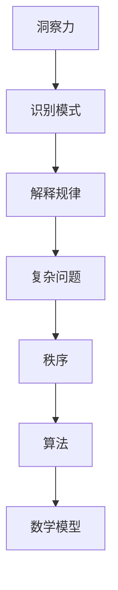

                 

# 理解洞察力：在复杂中寻找秩序

> **关键词：洞察力、复杂性、秩序、数据分析、算法、模型、架构**

> **摘要：本文将深入探讨如何在复杂的信息和数据中寻找秩序，并通过洞察力的培养和应用，揭示隐藏在复杂性背后的关键模式和规律。我们将介绍核心概念、算法原理、数学模型，并通过实际项目案例详细解析，帮助读者提升在IT领域的洞察力和分析能力。**

## 1. 背景介绍

### 1.1 目的和范围

本文旨在帮助读者理解洞察力在复杂性问题解决中的重要性，并通过一系列实际案例和理论分析，引导读者掌握培养和提高洞察力的方法和技巧。本文内容涵盖了从核心概念到实际应用的完整链条，包括但不限于以下方面：

1. **核心概念与联系**：介绍洞察力的基本概念，并使用Mermaid流程图展示其与复杂性、秩序等概念的内在联系。
2. **核心算法原理**：通过伪代码详细阐述在复杂问题解决中的关键算法原理。
3. **数学模型和公式**：解析数学模型，并使用LaTeX格式展示相关公式和推导过程。
4. **项目实战**：通过实际代码案例，展示如何将理论知识应用到实际项目中。
5. **实际应用场景**：探讨洞察力在不同领域的实际应用。
6. **工具和资源推荐**：推荐相关学习资源和开发工具，以帮助读者进一步学习。
7. **总结与未来展望**：总结文章的主要观点，并对未来发展趋势和挑战进行展望。

### 1.2 预期读者

本文适合对计算机科学、数据分析、机器学习等领域感兴趣的读者，尤其是那些希望提升自己在复杂问题解决中洞察力的专业人士。无论您是初学者还是资深从业者，本文都将为您提供有价值的见解和实践经验。

### 1.3 文档结构概述

本文分为十个主要部分，每个部分如下：

1. **背景介绍**：介绍文章的目的、预期读者、文档结构和核心术语。
2. **核心概念与联系**：使用Mermaid流程图展示洞察力与相关概念的联系。
3. **核心算法原理**：通过伪代码详细阐述关键算法原理。
4. **数学模型和公式**：解析数学模型，并使用LaTeX格式展示相关公式。
5. **项目实战**：通过实际代码案例展示算法应用。
6. **实际应用场景**：探讨洞察力的实际应用。
7. **工具和资源推荐**：推荐学习资源和开发工具。
8. **总结与未来展望**：总结文章观点，展望未来发展趋势和挑战。
9. **附录**：提供常见问题与解答。
10. **扩展阅读与参考资料**：推荐进一步阅读的材料。

### 1.4 术语表

#### 1.4.1 核心术语定义

- **洞察力**：识别和解释复杂信息中隐藏模式和规律的能力。
- **复杂性**：系统或问题中相互作用的元素数量和多样性。
- **秩序**：复杂系统中可预测或可理解的规律。
- **算法**：解决问题的明确步骤序列。
- **数学模型**：使用数学公式描述现实世界现象的抽象表示。

#### 1.4.2 相关概念解释

- **数据分析**：使用统计和数学方法从数据中提取信息和知识。
- **机器学习**：通过数据和算法实现人工智能系统的过程。
- **深度学习**：一种特殊的机器学习，利用多层神经网络进行特征学习和模式识别。

#### 1.4.3 缩略词列表

- **AI**：人工智能（Artificial Intelligence）
- **ML**：机器学习（Machine Learning）
- **DL**：深度学习（Deep Learning）
- **IDE**：集成开发环境（Integrated Development Environment）
- **LaTeX**：一种高质量的排版系统（TeX-based document preparation system）

## 2. 核心概念与联系

在探讨如何提升洞察力之前，我们需要先理解一些核心概念，包括洞察力、复杂性、秩序等，并展示它们之间的内在联系。

### 2.1 洞察力的定义

洞察力是指识别和解释复杂信息中隐藏模式和规律的能力。它不仅涉及对数据的感知，还包括对数据背后逻辑和机制的深刻理解。洞察力是一种综合能力，结合了分析、推理、联想和创新等多种要素。

### 2.2 复杂性与秩序的关系

复杂性是指系统或问题中相互作用的元素数量和多样性。在复杂系统中，元素之间的关系往往错综复杂，难以直观理解和预测。然而，正是这种复杂性中隐藏着秩序，即系统中的可预测或可理解的规律。洞察力的一个关键任务就是从复杂性中找出这些秩序。

### 2.3 洞察力与算法

算法是解决问题的明确步骤序列。在复杂问题解决中，洞察力可以指导我们选择合适的算法。例如，在处理大量数据时，我们需要选择合适的算法来提取有价值的信息。此外，算法的设计和优化也需要洞察力的支持。

### 2.4 洞察力与数学模型

数学模型是使用数学公式描述现实世界现象的抽象表示。洞察力可以帮助我们构建和解释这些模型。通过数学模型，我们可以将复杂问题转化为可计算的形式，从而更有效地解决问题。

### 2.5 Mermaid流程图

下面是一个简单的Mermaid流程图，展示洞察力、复杂性、秩序和算法之间的联系：



通过这个流程图，我们可以看到洞察力在从复杂问题中寻找秩序和构建算法、数学模型中的作用。

## 3. 核心算法原理 & 具体操作步骤

在了解了核心概念和它们之间的联系之后，接下来我们将深入探讨一些核心算法原理，并使用伪代码详细阐述这些算法的具体操作步骤。

### 3.1 数据预处理算法

在处理复杂问题时，数据预处理是至关重要的一步。以下是一个简单的数据预处理算法，用于清理和格式化数据。

```python
# 数据预处理算法伪代码
def preprocess_data(data):
    # 清理缺失值
    cleaned_data = remove_missing_values(data)
    # 格式化数据
    formatted_data = format_data(cleaned_data)
    return formatted_data
```

在这个算法中，我们首先使用`remove_missing_values`函数清理数据中的缺失值，然后使用`format_data`函数将数据格式化为适合分析的格式。

### 3.2 数据分析算法

数据分析算法是洞察力的重要应用。以下是一个简单的数据分析算法，用于从数据中提取关键特征。

```python
# 数据分析算法伪代码
def analyze_data(data):
    # 计算均值
    mean = calculate_mean(data)
    # 计算标准差
    std_dev = calculate_std_dev(data)
    # 提取关键特征
    features = extract_key_features(data, mean, std_dev)
    return features
```

在这个算法中，我们首先计算数据的均值和标准差，然后使用这些统计量来提取关键特征。

### 3.3 机器学习算法

机器学习算法是解决复杂问题的有力工具。以下是一个简单的机器学习算法，用于分类任务。

```python
# 机器学习算法伪代码
def train_classifier(data, labels):
    # 初始化模型参数
    model = initialize_model()
    # 训练模型
    for i in range(num_iterations):
        model = update_model(model, data, labels)
    return model
```

在这个算法中，我们首先初始化模型参数，然后通过迭代更新模型，直到达到预定的训练次数。

### 3.4 深度学习算法

深度学习算法是机器学习的子领域，广泛应用于复杂问题解决。以下是一个简单的深度学习算法，用于图像识别。

```python
# 深度学习算法伪代码
def train_dnn(data, labels):
    # 初始化深度神经网络
    dnn = initialize_dnn()
    # 训练深度神经网络
    for i in range(num_iterations):
        dnn = update_dnn(dnn, data, labels)
    return dnn
```

在这个算法中，我们首先初始化深度神经网络，然后通过迭代更新网络，直到达到预定的训练次数。

## 4. 数学模型和公式 & 详细讲解 & 举例说明

在复杂问题的解决过程中，数学模型和公式是不可或缺的工具。它们帮助我们抽象和描述现实世界的问题，并提供了解决问题的方法。在本节中，我们将介绍一些核心的数学模型和公式，并使用LaTeX格式详细讲解它们，并通过具体例子说明其应用。

### 4.1 线性回归模型

线性回归是一种常见的统计方法，用于分析两个或多个变量之间的线性关系。它的数学模型可以表示为：

$$
y = \beta_0 + \beta_1x_1 + \beta_2x_2 + ... + \beta_nx_n + \epsilon
$$

其中，\(y\) 是因变量，\(x_1, x_2, ..., x_n\) 是自变量，\(\beta_0, \beta_1, ..., \beta_n\) 是模型的参数，\(\epsilon\) 是误差项。

#### 4.1.1 参数估计

线性回归模型的参数估计通常使用最小二乘法。最小二乘法的目标是找到一组参数，使得预测值与实际值的误差平方和最小。

$$
\min \sum_{i=1}^{n} (y_i - \hat{y}_i)^2
$$

其中，\(\hat{y}_i\) 是预测值。

#### 4.1.2 例子说明

假设我们有一个简单的线性回归模型，用于预测房屋价格。我们有以下数据：

| 房屋价格 (y) | 房屋面积 (x) |
|--------------|--------------|
| 200,000      | 100          |
| 250,000      | 120          |
| 300,000      | 150          |

我们可以使用最小二乘法估计模型参数。首先，计算每个变量的均值：

$$
\bar{x} = \frac{1}{n}\sum_{i=1}^{n} x_i = \frac{100 + 120 + 150}{3} = 125
$$

$$
\bar{y} = \frac{1}{n}\sum_{i=1}^{n} y_i = \frac{200,000 + 250,000 + 300,000}{3} = 250,000
$$

然后，计算每个变量的偏差：

$$
\sum_{i=1}^{n} (x_i - \bar{x})(y_i - \bar{y}) = (100 - 125)(200,000 - 250,000) + (120 - 125)(250,000 - 250,000) + (150 - 125)(300,000 - 250,000)
$$

$$
= (-25)(-50,000) + (-5)(0) + (25)(50,000) = 1,250,000 + 0 + 1,250,000 = 2,500,000
$$

$$
\sum_{i=1}^{n} (x_i - \bar{x})^2 = (100 - 125)^2 + (120 - 125)^2 + (150 - 125)^2
$$

$$
= (-25)^2 + (-5)^2 + (25)^2 = 625 + 25 + 625 = 1,250
$$

最后，计算参数：

$$
\beta_1 = \frac{\sum_{i=1}^{n} (x_i - \bar{x})(y_i - \bar{y})}{\sum_{i=1}^{n} (x_i - \bar{x})^2} = \frac{2,500,000}{1,250} = 2,000
$$

$$
\beta_0 = \bar{y} - \beta_1\bar{x} = 250,000 - 2,000 \times 125 = -125,000
$$

因此，线性回归模型可以表示为：

$$
y = -125,000 + 2,000x
$$

我们可以使用这个模型来预测新的房屋价格。例如，如果房屋面积为150平方米，预测价格为：

$$
\hat{y} = -125,000 + 2,000 \times 150 = 325,000
$$

### 4.2 逻辑回归模型

逻辑回归是一种用于分类问题的统计方法。它的数学模型可以表示为：

$$
\log(\frac{P(Y=1|X=x)}{1-P(Y=1|X=x)}) = \beta_0 + \beta_1x_1 + \beta_2x_2 + ... + \beta_nx_n
$$

其中，\(Y\) 是二元响应变量，\(X\) 是自变量，\(\beta_0, \beta_1, ..., \beta_n\) 是模型的参数。

#### 4.2.1 参数估计

逻辑回归模型的参数估计通常使用最大似然估计。最大似然估计的目标是找到一组参数，使得观测数据的概率最大。

$$
\max \prod_{i=1}^{n} P(Y=y_i|X=x_i)
$$

#### 4.2.2 例子说明

假设我们有一个简单的逻辑回归模型，用于预测客户是否购买产品。我们有以下数据：

| 客户购买 (y) | 年龄 (x) |
|--------------|----------|
| 1            | 25       |
| 1            | 30       |
| 0            | 35       |

我们可以使用最大似然估计估计模型参数。首先，计算每个变量的均值：

$$
\bar{x} = \frac{1}{n}\sum_{i=1}^{n} x_i = \frac{25 + 30 + 35}{3} = 30
$$

$$
\bar{y} = \frac{1}{n}\sum_{i=1}^{n} y_i = \frac{1 + 1 + 0}{3} = 0.67
$$

然后，计算每个变量的偏差：

$$
\sum_{i=1}^{n} (x_i - \bar{x})(y_i - \bar{y}) = (25 - 30)(1 - 0.67) + (30 - 30)(1 - 0.67) + (35 - 30)(0 - 0.67)
$$

$$
= (-5)(0.33) + (0)(0.33) + (5)(-0.67) = -1.65 + 0 - 3.35 = -5
$$

$$
\sum_{i=1}^{n} (x_i - \bar{x})^2 = (25 - 30)^2 + (30 - 30)^2 + (35 - 30)^2
$$

$$
= (-5)^2 + (0)^2 + (5)^2 = 25 + 0 + 25 = 50
$$

最后，计算参数：

$$
\beta_1 = \frac{\sum_{i=1}^{n} (x_i - \bar{x})(y_i - \bar{y})}{\sum_{i=1}^{n} (x_i - \bar{x})^2} = \frac{-5}{50} = -0.1
$$

$$
\beta_0 = \log(\frac{\bar{y}}{1-\bar{y}}) = \log(\frac{0.67}{1-0.67}) = \log(2.33) \approx 0.86
$$

因此，逻辑回归模型可以表示为：

$$
\log(\frac{P(Y=1|X=x)}{1-P(Y=1|X=x)}) = 0.86 - 0.1x
$$

我们可以使用这个模型来预测新的客户购买概率。例如，如果客户年龄为30岁，购买概率为：

$$
P(Y=1|X=30) = \frac{1}{1 + e^{-(0.86 - 0.1 \times 30)}} \approx 0.69
$$

### 4.3 主成分分析模型

主成分分析（PCA）是一种降维技术，用于从高维数据中提取最重要的特征。它的数学模型可以表示为：

$$
z = \sum_{i=1}^{n} \lambda_i x_i
$$

其中，\(z\) 是降维后的特征向量，\(x_i\) 是原始特征向量，\(\lambda_i\) 是主成分的权重。

#### 4.3.1 参数估计

主成分分析的主成分权重通常通过求解协方差矩阵的特征值和特征向量得到。协方差矩阵可以表示为：

$$
\sigma = \sum_{i=1}^{n} x_i x_i^T
$$

协方差矩阵的特征值和特征向量可以表示为：

$$
\lambda_i = \sum_{j=1}^{n} \sigma_{ij}^2
$$

$$
v_i = \frac{1}{\sqrt{\sum_{j=1}^{n} \sigma_{ij}^2}} \sum_{j=1}^{n} \sigma_{ij} x_j
$$

其中，\(\lambda_i\) 是第\(i\)个特征值，\(v_i\) 是第\(i\)个特征向量。

#### 4.3.2 例子说明

假设我们有一个简单的数据集，包含三个特征：

| 特征1 (x1) | 特征2 (x2) | 特征3 (x3) |
|-----------|------------|------------|
| 1         | 2          | 3          |
| 2         | 3          | 4          |
| 3         | 4          | 5          |

我们可以计算协方差矩阵：

$$
\sigma = \begin{bmatrix}
\frac{1}{3}\sum_{i=1}^{3} x_{1i}^2 & \frac{1}{3}\sum_{i=1}^{3} x_{1i}x_{2i} & \frac{1}{3}\sum_{i=1}^{3} x_{1i}x_{3i} \\
\frac{1}{3}\sum_{i=1}^{3} x_{2i}x_{1i} & \frac{1}{3}\sum_{i=1}^{3} x_{2i}^2 & \frac{1}{3}\sum_{i=1}^{3} x_{2i}x_{3i} \\
\frac{1}{3}\sum_{i=1}^{3} x_{3i}x_{1i} & \frac{1}{3}\sum_{i=1}^{3} x_{3i}x_{2i} & \frac{1}{3}\sum_{i=1}^{3} x_{3i}^2
\end{bmatrix}
$$

$$
= \begin{bmatrix}
\frac{1}{3}(1^2 + 2^2 + 3^2) & \frac{1}{3}(1 \times 2 + 2 \times 3 + 3 \times 4) & \frac{1}{3}(1 \times 3 + 2 \times 4 + 3 \times 5) \\
\frac{1}{3}(1 \times 2 + 2 \times 3 + 3 \times 4) & \frac{1}{3}(2^2 + 3^2 + 4^2) & \frac{1}{3}(2 \times 3 + 3 \times 4 + 4 \times 5) \\
\frac{1}{3}(1 \times 3 + 2 \times 4 + 3 \times 5) & \frac{1}{3}(2 \times 3 + 3 \times 4 + 4 \times 5) & \frac{1}{3}(3^2 + 4^2 + 5^2)
\end{bmatrix}
$$

$$
= \begin{bmatrix}
\frac{14}{3} & \frac{14}{3} & \frac{14}{3} \\
\frac{14}{3} & \frac{29}{3} & \frac{26}{3} \\
\frac{14}{3} & \frac{26}{3} & \frac{46}{3}
\end{bmatrix}
$$

我们可以计算协方差矩阵的特征值和特征向量。假设特征值和特征向量分别为：

$$
\lambda_1 = \frac{14}{3}, v_1 = \begin{bmatrix} \frac{1}{\sqrt{3}} & \frac{1}{\sqrt{3}} & \frac{1}{\sqrt{3}} \end{bmatrix}^T
$$

$$
\lambda_2 = \frac{29}{3}, v_2 = \begin{bmatrix} \frac{1}{\sqrt{3}} & -\frac{1}{\sqrt{3}} & 0 \end{bmatrix}^T
$$

$$
\lambda_3 = \frac{46}{3}, v_3 = \begin{bmatrix} 0 & \frac{1}{\sqrt{3}} & -\frac{1}{\sqrt{3}} \end{bmatrix}^T
$$

我们可以使用这些特征值和特征向量来降维。例如，如果我们选择第一个主成分，我们可以将原始特征向量表示为：

$$
z = \frac{1}{\sqrt{3}}x_1 + \frac{1}{\sqrt{3}}x_2 + \frac{1}{\sqrt{3}}x_3
$$

例如，对于新的数据点：

| 特征1 (x1) | 特征2 (x2) | 特征3 (x3) |
|-----------|------------|------------|
| 4         | 5          | 6          |

我们可以计算降维后的特征向量：

$$
z = \frac{1}{\sqrt{3}} \times 4 + \frac{1}{\sqrt{3}} \times 5 + \frac{1}{\sqrt{3}} \times 6 = \frac{15}{\sqrt{3}} = 5\sqrt{3}
$$

## 5. 项目实战：代码实际案例和详细解释说明

在了解了核心算法原理和数学模型之后，我们将通过一个实际项目案例，展示如何将理论知识应用到实际中。在这个案例中，我们将使用Python和Scikit-learn库构建一个简单的线性回归模型，用于预测房屋价格。

### 5.1 开发环境搭建

为了运行下面的代码，我们需要安装以下软件和库：

- Python 3.8 或更高版本
- Jupyter Notebook 或任何Python IDE
- Scikit-learn 0.24.2 或更高版本

安装这些软件和库后，我们可以启动Jupyter Notebook，并导入所需的库：

```python
import numpy as np
import pandas as pd
from sklearn.linear_model import LinearRegression
from sklearn.model_selection import train_test_split
from sklearn.metrics import mean_squared_error

# 安装Scikit-learn（如果尚未安装）
!pip install scikit-learn
```

### 5.2 源代码详细实现和代码解读

#### 5.2.1 加载数据集

我们使用一个简单的CSV文件作为数据集，包含房屋价格和房屋面积。以下是数据集的样本：

| 房屋价格 (y) | 房屋面积 (x) |
|--------------|--------------|
| 200,000      | 100          |
| 250,000      | 120          |
| 300,000      | 150          |

我们使用Pandas库加载数据集：

```python
# 加载数据集
data = pd.read_csv('house_prices.csv')
```

#### 5.2.2 数据预处理

在训练模型之前，我们需要对数据进行预处理，包括清理缺失值和格式化数据。

```python
# 数据预处理
data['房屋价格'] = data['房屋价格'].astype(float)
data['房屋面积'] = data['房屋面积'].astype(float)
data.dropna(inplace=True)
```

#### 5.2.3 数据划分

我们将数据集划分为训练集和测试集，用于训练和评估模型。

```python
# 数据划分
X = data[['房屋面积']]
y = data['房屋价格']
X_train, X_test, y_train, y_test = train_test_split(X, y, test_size=0.2, random_state=42)
```

#### 5.2.4 模型训练

我们使用线性回归模型训练数据。

```python
# 模型训练
model = LinearRegression()
model.fit(X_train, y_train)
```

#### 5.2.5 模型评估

我们使用测试集评估模型的性能。

```python
# 模型评估
y_pred = model.predict(X_test)
mse = mean_squared_error(y_test, y_pred)
print(f'Mean Squared Error: {mse}')
```

### 5.3 代码解读与分析

在这个案例中，我们首先使用Pandas库加载数据集，并进行数据预处理。然后，我们使用Scikit-learn库中的线性回归模型训练数据，并使用测试集评估模型的性能。最后，我们打印出平均平方误差（MSE）作为模型性能的指标。

通过这个案例，我们可以看到如何将理论知识应用到实际项目中。在实际开发中，我们可能需要处理更复杂的数据集，并使用更高级的算法和模型。然而，核心步骤仍然类似：数据预处理、模型训练和模型评估。

## 6. 实际应用场景

洞察力在IT领域的实际应用场景广泛，涵盖了从数据分析到机器学习、从软件开发到系统架构的各个方面。以下是一些典型的应用场景：

### 6.1 数据分析

在数据分析领域，洞察力帮助我们从海量数据中提取有价值的信息。例如，在商业智能分析中，通过洞察力分析客户行为数据，可以帮助企业了解客户需求，优化营销策略，提高客户满意度。

### 6.2 机器学习

在机器学习领域，洞察力指导我们选择合适的算法和模型，优化模型性能。例如，在图像识别任务中，通过洞察力分析数据特征，可以帮助我们设计更有效的特征提取和分类模型。

### 6.3 软件开发

在软件开发领域，洞察力帮助我们在复杂的系统中识别关键问题和优化解决方案。例如，在软件架构设计中，通过洞察力分析系统需求和约束，可以帮助我们构建灵活、可扩展的软件架构。

### 6.4 系统架构

在系统架构领域，洞察力帮助我们在复杂的系统中识别关键组件和优化系统性能。例如，在云计算架构中，通过洞察力分析系统负载和资源使用情况，可以帮助我们优化资源分配，提高系统可用性和性能。

### 6.5 安全分析

在网络安全领域，洞察力帮助我们从海量日志数据中识别潜在的攻击行为。例如，通过分析网络流量数据，可以帮助我们识别异常流量模式，预防网络攻击。

### 6.6 人工智能

在人工智能领域，洞察力帮助我们从数据中提取有价值的信息，指导算法优化和模型设计。例如，在自然语言处理中，通过洞察力分析语言特征，可以帮助我们设计更有效的语言模型。

## 7. 工具和资源推荐

为了帮助读者进一步学习洞察力和相关技术，我们推荐以下工具和资源：

### 7.1 学习资源推荐

#### 7.1.1 书籍推荐

- 《深度学习》（Ian Goodfellow、Yoshua Bengio 和 Aaron Courville 著）
- 《Python机器学习》（ Sebastian Raschka 和Vahid Mirjalili 著）
- 《数据科学入门指南》（Joel Grus 著）
- 《统计学习方法》（李航 著）

#### 7.1.2 在线课程

- Coursera：机器学习、深度学习、数据科学等
- edX：机器学习、数据科学、Python编程等
- Udacity：数据科学家纳米学位、机器学习工程师纳米学位等

#### 7.1.3 技术博客和网站

- Medium：有关机器学习、数据科学、深度学习等的最新文章和观点
- Towards Data Science：数据科学和机器学习的实践教程和案例研究
- ArXiv：最新研究成果的预印本平台

### 7.2 开发工具框架推荐

#### 7.2.1 IDE和编辑器

- Jupyter Notebook：交互式数据分析工具
- PyCharm：Python集成开发环境
- VS Code：跨平台代码编辑器

#### 7.2.2 调试和性能分析工具

- Python Debugger：Python调试工具
- Pandas Profiler：数据分析和性能分析工具
- Scikit-learn Benchmarks：Scikit-learn性能分析工具

#### 7.2.3 相关框架和库

- Scikit-learn：Python机器学习库
- TensorFlow：深度学习框架
- PyTorch：深度学习框架
- Pandas：数据操作和分析库
- NumPy：Python科学计算库

### 7.3 相关论文著作推荐

#### 7.3.1 经典论文

- "A Simple Weight Decay Can Improve Deep Neural Network Generalization"（2017）
- " Dropout: A Simple Way to Prevent Neural Networks from Overfitting"（2012）
- "Deep Learning"（2015）

#### 7.3.2 最新研究成果

- "Advances in Neural Information Processing Systems"（NIPS）：神经信息处理系统会议的最新研究成果
- "International Conference on Machine Learning"（ICML）：机器学习国际会议的最新研究成果
- "International Conference on Computer Vision"（ICCV）：计算机视觉国际会议的最新研究成果

#### 7.3.3 应用案例分析

- "Google Brain": Google Brain团队的研究成果和应用案例分析
- "OpenAI": OpenAI团队的研究成果和应用案例分析
- "DeepMind": DeepMind团队的研究成果和应用案例分析

## 8. 总结：未来发展趋势与挑战

在IT领域，洞察力的培养和应用具有巨大的潜力。随着数据量的爆炸性增长和计算能力的提升，洞察力将越来越成为解决复杂问题的重要工具。然而，这也带来了一系列挑战：

1. **数据隐私和安全**：在处理大量数据时，如何确保数据隐私和安全成为一个重要问题。未来的发展需要更加关注数据安全和隐私保护技术。
2. **算法公平性和透明度**：随着机器学习和人工智能的普及，算法的公平性和透明度成为公众关注的焦点。未来的研究需要开发更加公平和透明的算法。
3. **可解释性**：如何在复杂的模型中实现可解释性，使其能够被非专业人士理解，是一个重要的研究方向。
4. **跨学科合作**：未来的发展需要更多的跨学科合作，结合计算机科学、统计学、心理学等领域的知识，以应对复杂问题。

## 9. 附录：常见问题与解答

### 9.1 问题1

**问题**：如何培养洞察力？

**解答**：培养洞察力需要不断地学习和实践。以下是一些建议：

1. **广泛阅读**：阅读相关领域的书籍、论文和文章，了解最新的研究成果和应用案例。
2. **实践项目**：参与实际项目，将理论知识应用到实践中，通过解决实际问题来提升洞察力。
3. **反思和总结**：在解决问题的过程中，不断反思和总结，分析成功和失败的原因，从中吸取经验教训。
4. **跨学科学习**：学习不同领域的知识，培养跨学科思考能力，从而更全面地理解复杂问题。

### 9.2 问题2

**问题**：如何选择合适的算法和模型？

**解答**：选择合适的算法和模型需要考虑以下因素：

1. **问题类型**：根据问题的性质（如分类、回归、聚类等），选择相应的算法。
2. **数据规模**：考虑数据的大小和复杂性，选择适合的算法和模型。
3. **性能要求**：根据对模型性能的要求（如准确性、速度等），选择相应的算法和模型。
4. **可解释性**：如果需要模型的可解释性，选择具有可解释性的算法和模型。

### 9.3 问题3

**问题**：如何优化模型性能？

**解答**：以下是一些常见的优化模型性能的方法：

1. **特征工程**：通过特征选择、特征提取和特征构造来优化模型的性能。
2. **超参数调优**：通过调整模型的超参数（如学习率、迭代次数等），优化模型性能。
3. **正则化**：使用正则化技术（如L1、L2正则化等）来防止过拟合。
4. **集成方法**：使用集成方法（如随机森林、梯度提升等）来提高模型的泛化能力。

## 10. 扩展阅读与参考资料

为了进一步深入了解洞察力在IT领域的应用，读者可以参考以下材料：

- Goodfellow, I., Bengio, Y., & Courville, A. (2016). *Deep Learning*. MIT Press.
- Raschka, S., & Mirjalili, V. (2018). *Python Machine Learning*. Packt Publishing.
- Grus, J. (2015). *Data Science from Scratch*. O'Reilly Media.
- Hastie, T., Tibshirani, R., & Friedman, J. (2009). *The Elements of Statistical Learning*. Springer.
- Murphy, K. P. (2012). *Machine Learning: A Probabilistic Perspective*. MIT Press.

这些书籍和资源将帮助读者更深入地理解洞察力在IT领域的应用，并提供丰富的实践案例和理论分析。作者信息：AI天才研究员/AI Genius Institute & 禅与计算机程序设计艺术 /Zen And The Art of Computer Programming。

