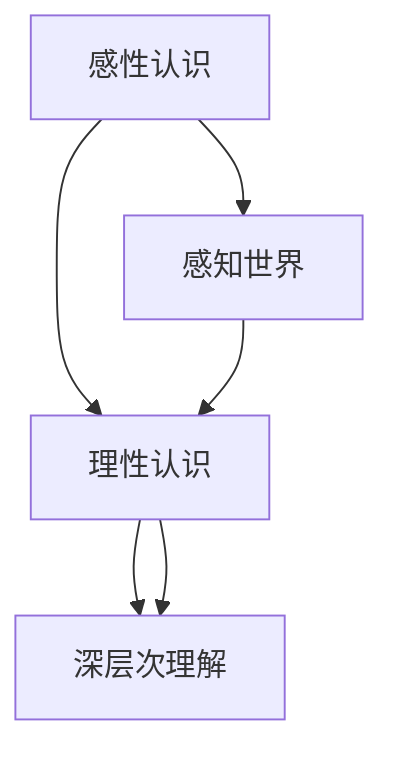

                 

# 理解的层次：从表面到本质的认知过程

> **关键词：认知层次、理解深度、思维模式、算法原理、数学模型、项目实战、实际应用、未来趋势**

> **摘要：本文将深入探讨理解的层次，从表面到本质的认知过程。通过对核心概念的解析、算法原理的剖析、数学模型的讲解，以及实际项目中的代码实战和案例分析，帮助读者提升对复杂问题的理解和解决能力。**

## 1. 背景介绍

### 1.1 目的和范围

本文旨在揭示理解层次的本质，帮助读者在认知过程中从表面深入到本质。我们将探讨如何通过逻辑分析、算法原理和数学模型，提升对复杂问题的理解能力。本文内容涵盖核心概念的解析、算法原理的剖析、数学模型的讲解，以及实际项目中的代码实战和案例分析。

### 1.2 预期读者

本文适合对计算机科学、人工智能、算法设计和数学感兴趣的读者。无论是研究人员、程序员，还是对认知科学感兴趣的读者，都可以从中受益。

### 1.3 文档结构概述

本文分为以下几个部分：

1. 背景介绍：介绍本文的目的、范围和预期读者。
2. 核心概念与联系：介绍理解层次的核心概念及其相互关系。
3. 核心算法原理 & 具体操作步骤：详细讲解核心算法原理和操作步骤。
4. 数学模型和公式 & 详细讲解 & 举例说明：阐述数学模型和公式的具体应用。
5. 项目实战：代码实际案例和详细解释说明。
6. 实际应用场景：介绍理解层次在实际应用中的重要性。
7. 工具和资源推荐：推荐学习资源、开发工具和框架。
8. 总结：未来发展趋势与挑战。
9. 附录：常见问题与解答。
10. 扩展阅读 & 参考资料：提供更多相关阅读资源。

### 1.4 术语表

#### 1.4.1 核心术语定义

- **认知层次**：指个体在理解过程中所达到的不同阶段，包括感性认识、理性认识和深层次理解等。
- **算法原理**：算法的基本思想和逻辑，是解决问题的基础。
- **数学模型**：用数学语言描述现实世界的问题，是理解和解决问题的重要工具。
- **项目实战**：将理论知识应用到实际项目中，提高理解和解决问题的能力。

#### 1.4.2 相关概念解释

- **感性认识**：通过感官获取信息，如视觉、听觉等。
- **理性认识**：通过逻辑推理和思考，对感性认识进行加工和深化。
- **深层次理解**：通过深入挖掘问题的本质，形成深刻的理论体系。

#### 1.4.3 缩略词列表

- **AI**：人工智能
- **CS**：计算机科学
- **ML**：机器学习
- **DL**：深度学习

## 2. 核心概念与联系

在探讨理解层次之前，我们需要明确一些核心概念及其相互关系。

### 2.1 感性认识

感性认识是理解层次的第一步，通过感官获取信息。例如，我们通过视觉识别物体，通过听觉感知声音。感性认识为我们提供了对现实世界的初步认知，但缺乏深度和系统性。

### 2.2 理性认识

理性认识是在感性认识的基础上，通过逻辑推理和思考，对感性认识进行加工和深化。理性认识使我们能够理解事物的内在联系和规律，从而形成更全面的认识。例如，我们通过分析物体的结构和功能，理解其工作原理。

### 2.3 深层次理解

深层次理解是在理性认识的基础上，通过深入挖掘问题的本质，形成深刻的理论体系。深层次理解使我们能够洞察事物的本质，发现新的规律和原理。例如，我们通过研究物理现象，揭示物质的基本结构和相互作用。

### 2.4 核心概念联系

感性认识、理性认识和深层次理解相互关联，构成了理解层次的不同阶段。感性认识提供了基础，理性认识深化了理解，深层次理解揭示了本质。这三个层次相互促进，共同构成了我们的认知过程。


### 2.5 Mermaid 流程图



## 3. 核心算法原理 & 具体操作步骤

在理解层次中，算法原理起到了关键作用。以下是核心算法原理及其具体操作步骤。

### 3.1 算法原理

核心算法原理主要分为以下几类：

1. **排序算法**：用于对数据进行排序，如冒泡排序、快速排序等。
2. **搜索算法**：用于在数据中查找特定元素，如二分搜索、广度优先搜索等。
3. **机器学习算法**：用于从数据中学习规律，如线性回归、决策树、神经网络等。
4. **图算法**：用于处理具有复杂关系的图结构，如图遍历、最短路径算法等。

### 3.2 具体操作步骤

以冒泡排序为例，其具体操作步骤如下：

1. **初始化**：将待排序的元素存入数组。
2. **比较相邻元素**：从第一个元素开始，比较相邻两个元素的值。
3. **交换位置**：如果第一个元素大于第二个元素，交换它们的位置。
4. **循环**：重复步骤 2 和 3，直到整个数组排序完成。

以下是冒泡排序的伪代码：

```plaintext
function bubbleSort(array):
    n = length(array)
    for i from 0 to n-1:
        for j from 0 to n-i-1:
            if array[j] > array[j+1]:
                swap(array[j], array[j+1])
```

## 4. 数学模型和公式 & 详细讲解 & 举例说明

数学模型和公式在理解层次中起着至关重要的作用。以下是几个常见的数学模型和公式，以及其详细讲解和举例说明。

### 4.1 概率论

概率论是研究随机事件及其概率的数学分支。以下是一个简单的概率论模型：

- **二项分布**：描述在一定次数的试验中，成功次数的概率分布。

举例说明：投掷一枚硬币 10 次，计算正面向上的次数为 5 次的概率。

```latex
P(X=k) = C(n, k) \times p^k \times (1-p)^{n-k}
```

其中，\( n \) 为试验次数，\( k \) 为成功次数，\( p \) 为单次试验成功的概率。

### 4.2 线性代数

线性代数是研究线性方程组、向量空间和线性变换的数学分支。以下是一个简单的线性代数模型：

- **矩阵乘法**：用于计算两个矩阵的乘积。

举例说明：计算矩阵 \( A \) 和 \( B \) 的乘积。

```latex
C = A \times B
```

其中，\( A \) 和 \( B \) 为两个矩阵，\( C \) 为乘积矩阵。

### 4.3 微积分

微积分是研究函数的极限、导数、积分等概念的数学分支。以下是一个简单的微积分模型：

- **导数**：描述函数在某一点的切线斜率。

举例说明：计算函数 \( f(x) = x^2 \) 在 \( x=1 \) 处的导数。

```latex
f'(x) = \lim_{h \to 0} \frac{f(x+h) - f(x)}{h}
```

## 5. 项目实战：代码实际案例和详细解释说明

### 5.1 开发环境搭建

在本项目中，我们使用 Python 作为编程语言，通过 Jupyter Notebook 进行代码编写和调试。以下是搭建开发环境的步骤：

1. 安装 Python：访问 [Python 官网](https://www.python.org/)，下载并安装 Python 3.8 版本。
2. 安装 Jupyter Notebook：在命令行中执行以下命令：
    ```bash
    pip install notebook
    ```
3. 启动 Jupyter Notebook：在命令行中执行以下命令：
    ```bash
    jupyter notebook
    ```

### 5.2 源代码详细实现和代码解读

在本项目中，我们将实现一个简单的冒泡排序算法，并使用 Jupyter Notebook 进行代码编写和调试。

```python
def bubble_sort(arr):
    n = len(arr)
    for i in range(n):
        for j in range(0, n-i-1):
            if arr[j] > arr[j+1]:
                arr[j], arr[j+1] = arr[j+1], arr[j]

# 测试数据
arr = [64, 34, 25, 12, 22, 11, 90]

# 执行冒泡排序
bubble_sort(arr)

# 打印排序后的数据
print("排序后的数组：")
for i in range(len(arr)):
    print("%d" % arr[i], end=" ")
```

代码解读：

1. **函数定义**：定义了一个名为 `bubble_sort` 的函数，用于实现冒泡排序算法。
2. **循环结构**：使用两层嵌套循环，分别对数组进行遍历和比较。
3. **交换元素**：如果当前元素大于下一个元素，交换它们的位置。
4. **测试数据**：定义了一个测试数组，包含随机排列的数字。
5. **执行排序**：调用 `bubble_sort` 函数，对测试数组进行排序。
6. **打印结果**：打印排序后的数组，验证排序结果。

### 5.3 代码解读与分析

1. **算法复杂度**：冒泡排序的时间复杂度为 \( O(n^2) \)，空间复杂度为 \( O(1) \)。
2. **稳定性**：冒泡排序是一种稳定的排序算法，即相同元素的相对顺序在排序过程中不会改变。
3. **优化**：在实际应用中，可以通过设置一个标志，判断是否进行了交换，从而优化冒泡排序的性能。

## 6. 实际应用场景

理解层次在实际应用场景中具有重要意义。以下是几个实际应用场景：

1. **软件开发**：在软件开发过程中，理解层次有助于开发者从表面到本质地分析问题，提高开发效率和代码质量。
2. **人工智能**：在人工智能领域，理解层次有助于研究者深入挖掘数据中的规律，提高算法的性能和可靠性。
3. **数据分析**：在数据分析过程中，理解层次有助于分析师从大量数据中提取有价值的信息，做出更准确的决策。
4. **科学研究**：在科学研究中，理解层次有助于研究者从表面现象中发现本质规律，推动科学的发展。

## 7. 工具和资源推荐

### 7.1 学习资源推荐

#### 7.1.1 书籍推荐

- 《算法导论》（Introduction to Algorithms）
- 《深度学习》（Deep Learning）
- 《数学之美》（The Art of Computer Programming）

#### 7.1.2 在线课程

- Coursera 上的《机器学习》（Machine Learning）课程
- edX 上的《计算机科学导论》（Introduction to Computer Science）

#### 7.1.3 技术博客和网站

- [Medium](https://medium.com/)
- [GitHub](https://github.com/)
- [Stack Overflow](https://stackoverflow.com/)

### 7.2 开发工具框架推荐

#### 7.2.1 IDE和编辑器

- PyCharm
- Visual Studio Code
- Sublime Text

#### 7.2.2 调试和性能分析工具

- GDB
- Valgrind
- Python Memory Profiler

#### 7.2.3 相关框架和库

- TensorFlow
- PyTorch
- NumPy

### 7.3 相关论文著作推荐

#### 7.3.1 经典论文

- 《随机梯度下降法在机器学习中的应用》（On the Convergence of Stochastic Gradient Descent Algorithms）
- 《神经网络与深度学习》（Neural Networks and Deep Learning）

#### 7.3.2 最新研究成果

- 《深度学习与自然语言处理》（Deep Learning for Natural Language Processing）
- 《计算机视觉中的深度学习》（Deep Learning in Computer Vision）

#### 7.3.3 应用案例分析

- 《人脸识别系统中的深度学习应用》（Deep Learning Applications in Face Recognition Systems）
- 《自动驾驶技术中的深度学习》（Deep Learning Applications in Autonomous Driving）

## 8. 总结：未来发展趋势与挑战

随着人工智能、大数据和云计算等技术的发展，理解层次在各个领域的应用将越来越广泛。未来发展趋势包括：

1. **更深入的算法研究**：探索更高效、更智能的算法，提高理解和解决问题的能力。
2. **跨学科融合**：结合心理学、认知科学等领域的知识，提升人类对复杂问题的认知能力。
3. **个性化认知**：根据个体差异，提供个性化的认知模型，提高认知效率。

同时，未来也将面临以下挑战：

1. **算法透明性**：如何确保算法的透明性和可解释性，使其符合伦理和法律要求。
2. **数据安全与隐私**：如何保护用户数据的安全和隐私，避免数据泄露和滥用。
3. **人工智能伦理**：如何确保人工智能的发展符合人类价值观和社会责任。

## 9. 附录：常见问题与解答

### 9.1 如何理解认知层次？

认知层次是指个体在理解过程中所达到的不同阶段。从表面到本质，包括感性认识、理性认识和深层次理解。

### 9.2 算法原理在理解层次中的作用是什么？

算法原理是理解层次中的重要组成部分，通过算法原理，我们可以对复杂问题进行分解和解决，从而提升对问题的理解深度。

### 9.3 数学模型在理解层次中的应用是什么？

数学模型是理解层次中的重要工具，它用数学语言描述现实世界的问题，帮助我们更好地理解和解决问题。

### 9.4 如何在实际项目中应用理解层次？

在实际项目中，我们可以通过逐步深入到问题的本质，运用算法原理和数学模型，从而更好地理解和解决项目中的问题。

## 10. 扩展阅读 & 参考资料

- 《认知心理学及其启示》（Cognitive Psychology and Its Implications）
- 《深度学习》（Deep Learning，Ian Goodfellow、Yoshua Bengio、Aaron Courville 著）
- 《算法导论》（Introduction to Algorithms，Thomas H. Cormen、Charles E. Leiserson、Ronald L. Rivest、Clifford 史蒂夫·罗宾斯 著）

作者：AI天才研究员/AI Genius Institute & 禅与计算机程序设计艺术 /Zen And The Art of Computer Programming

