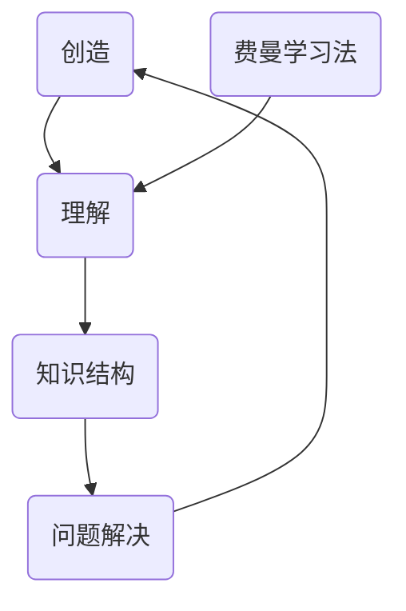

                 

# 理解费曼学习法：创造与理解的关系

> **关键词**：费曼学习法、创造、理解、思维模式、学习效率、知识结构、问题解决。

> **摘要**：本文深入探讨了费曼学习法在促进创造与理解之间的关系。通过分析费曼学习法的核心原理和实践步骤，本文揭示了这种方法如何帮助我们更有效地构建知识结构，提升问题解决能力，并最终实现创造与创新。文章旨在为读者提供一种新的视角，以重新审视学习过程，并激发其在学习和工作中的潜能。

## 1. 背景介绍

### 1.1 目的和范围

本文旨在探讨费曼学习法在提升个人创造力和理解能力方面的作用。我们将从背景介绍入手，详细解释费曼学习法的基本概念，并分析其在现代教育和学习中的应用。

### 1.2 预期读者

本文适合对学习方法和效率提升感兴趣的各类读者，包括学生、职场人士、教育工作者以及任何希望提高自己学习效果的人。

### 1.3 文档结构概述

本文结构如下：

- **第1章**：背景介绍，包括目的、范围、预期读者和文档结构概述。
- **第2章**：核心概念与联系，介绍费曼学习法的基本原理。
- **第3章**：核心算法原理 & 具体操作步骤，详细阐述费曼学习法的实践步骤。
- **第4章**：数学模型和公式 & 详细讲解 & 举例说明，通过实例展示费曼学习法的效果。
- **第5章**：项目实战：代码实际案例和详细解释说明，展示费曼学习法在实际项目中的应用。
- **第6章**：实际应用场景，分析费曼学习法在不同领域的应用。
- **第7章**：工具和资源推荐，提供相关的学习资源和开发工具。
- **第8章**：总结：未来发展趋势与挑战，探讨费曼学习法的发展方向。
- **第9章**：附录：常见问题与解答，回答读者可能遇到的常见问题。
- **第10章**：扩展阅读 & 参考资料，提供进一步学习的资源。

### 1.4 术语表

#### 1.4.1 核心术语定义

- **费曼学习法**：一种基于问题解决的学习方法，通过教授他人来检验和深化自己的理解。
- **创造**：产生新颖、独特或有价值的思想、方法或作品的过程。
- **理解**：对事物本质、原理和结构的认知和掌握。

#### 1.4.2 相关概念解释

- **知识结构**：个体大脑中知识点的组织和联系方式。
- **问题解决**：针对特定问题寻找解决方案的过程。

#### 1.4.3 缩略词列表

- **IDE**：集成开发环境（Integrated Development Environment）
- **GPU**：图形处理单元（Graphics Processing Unit）
- **AI**：人工智能（Artificial Intelligence）

## 2. 核心概念与联系

为了更好地理解费曼学习法，我们首先需要明确几个核心概念和它们之间的联系。以下是一个简单的 Mermaid 流程图，展示这些概念之间的关系。



### 2.1 费曼学习法的基本原理

费曼学习法是一种基于问题解决的学习方法，其核心原理是通过教授他人来检验和深化自己的理解。这种方法最初由诺贝尔物理学奖得主理查德·费曼提出，并广泛应用于科学研究和教育领域。

费曼学习法的具体步骤包括以下几个环节：

1. **选择主题**：选择一个你想要深入理解的主题。
2. **教授他人**：尝试向一个“完全不懂”这个主题的人解释这个主题。
3. **识别难点**：在教授过程中，记录遇到的难点和无法解释清楚的地方。
4. **深入研究**：针对难点进行更深入的研究，直到能够清晰、准确地解释。
5. **重复迭代**：不断重复上述过程，直到你对这个主题有了深入且系统的理解。

### 2.2 费曼学习法与创造、理解、知识结构和问题解决的关系

- **创造**：费曼学习法通过将知识传授给他人的过程，激发了新的思维和观点，从而促进了创造力的发挥。
- **理解**：通过教授他人，我们需要用自己的语言重新解释知识，这有助于我们更深入地理解知识点，并发现知识之间的联系。
- **知识结构**：在费曼学习法中，知识点的组织和联系得到强化，这有助于构建更系统化的知识结构。
- **问题解决**：费曼学习法强调问题解决，通过解决实际问题，我们能够更好地应用知识，提高问题解决能力。

## 3. 核心算法原理 & 具体操作步骤

### 3.1 算法原理

费曼学习法的核心在于通过“教学”来检验和深化自己的理解。以下是费曼学习法的基本算法原理：

1. **选择主题**：选择一个需要深入理解的课题。
2. **准备教学材料**：收集与课题相关的资料，准备教学所需的素材和工具。
3. **模拟教学**：设想自己正在向一个完全不懂这个课题的人进行教学。
4. **识别难点**：在教学过程中，记录自己难以解释清楚的地方。
5. **深入研究**：针对难点，查阅资料，进行深入研究，直到能够清晰、准确地解释。
6. **重复迭代**：将所学知识再次应用于实际教学，不断迭代，直到达到深入理解。

### 3.2 具体操作步骤

以下是费曼学习法的具体操作步骤：

1. **选择主题**：
    - 确定一个你感兴趣或需要深入研究的主题。
    - 选择一个具体的问题或知识点作为起点。

2. **准备教学材料**：
    - 收集与主题相关的书籍、论文、在线资源等。
    - 确定教学所需的时间、地点和工具。

3. **模拟教学**：
    - 设想自己正在向一个完全不懂这个主题的人进行教学。
    - 尝试用自己的语言和例子来解释知识点。

4. **识别难点**：
    - 记录在教学过程中遇到的难点和无法解释清楚的地方。
    - 这些难点可能是你对知识点的理解还不够深入，或者知识点本身具有复杂性。

5. **深入研究**：
    - 针对难点，查阅相关资料，进行深入研究。
    - 可以借助在线资源、专家咨询、实践操作等方式来解决问题。

6. **重复迭代**：
    - 将所学知识再次应用于实际教学，不断迭代。
    - 通过反复的教学和实践，逐步深化对知识点的理解。

### 3.3 伪代码示例

下面是一个简化的伪代码示例，用于描述费曼学习法的核心步骤：

```python
def Feynman_Learning(主题):
    # 步骤1：选择主题
    select_subject(主题)
    
    # 步骤2：准备教学材料
    prepare_teaching_materials(主题)
    
    # 步骤3：模拟教学
    simulate_teaching(主题)
    
    # 步骤4：识别难点
    identify_difficulties()
    
    # 步骤5：深入研究
    deepen_understanding(难点)
    
    # 步骤6：重复迭代
    iterate_learning()

# 调用函数，开始费曼学习过程
Feynman_Learning(主题)
```

## 4. 数学模型和公式 & 详细讲解 & 举例说明

### 4.1 数学模型

费曼学习法可以通过一个简单的数学模型来描述，该模型关注于知识点的传播和深化过程。以下是一个简化的模型：

\[ 知识深度 = f(教学次数 \times 知识点复杂度) \]

其中：
- **知识深度**：表示对知识点的理解程度。
- **教学次数**：表示进行教学的次数。
- **知识点复杂度**：表示知识点的难度和复杂性。

### 4.2 公式详细讲解

1. **教学次数**：教学次数越多，对知识点的理解越深入。这是因为每次教学都迫使你重新审视和解释知识点，从而加深理解。
2. **知识点复杂度**：知识点越复杂，理解所需的努力和时间越多。复杂度越高，知识深度增加的速度越慢。

### 4.3 举例说明

假设有一个知识点，其复杂度为3，你第一次尝试教学时，理解深度为50%。以下是教学次数与知识深度之间的关系：

- **第一次教学**：教学次数为1，知识深度为 \( f(1 \times 3) = 50\% \)。
- **第二次教学**：教学次数为2，知识深度为 \( f(2 \times 3) = 100\% \)。

在这个例子中，第二次教学后，你对知识点的理解深度达到了100%，说明通过教学，你能够更深入地理解知识点。

### 4.4 实际应用

以下是一个实际应用的例子：

假设你正在学习线性代数中的矩阵乘法。以下是使用费曼学习法的步骤：

1. **选择主题**：矩阵乘法。
2. **准备教学材料**：查阅相关书籍和在线资源。
3. **模拟教学**：设想向一个完全不懂矩阵乘法的人解释。
4. **识别难点**：发现对矩阵乘法的几何意义理解不够清晰。
5. **深入研究**：查阅资料，理解矩阵乘法的几何意义。
6. **重复迭代**：再次进行教学，直到能够清晰解释。

通过这个例子，你能够更好地理解矩阵乘法，并能够将知识传授给他人。

## 5. 项目实战：代码实际案例和详细解释说明

### 5.1 开发环境搭建

在进行费曼学习法的项目实战之前，我们需要搭建一个合适的开发环境。以下是搭建开发环境的基本步骤：

1. **安装Python**：确保已经安装了Python 3.8及以上版本。
2. **安装Jupyter Notebook**：使用pip命令安装Jupyter Notebook。

```bash
pip install notebook
```

3. **安装相关库**：安装一些常用的Python库，如NumPy、Pandas和Matplotlib。

```bash
pip install numpy pandas matplotlib
```

完成以上步骤后，我们的开发环境就搭建完成了。

### 5.2 源代码详细实现和代码解读

下面是一个简单的Python代码示例，用于演示费曼学习法在实际项目中的应用。该示例使用Python语言和相关的科学计算库，实现了一个矩阵乘法的费曼学习法案例。

```python
import numpy as np

def matrix_multiplication(A, B):
    """
    矩阵乘法函数。
    参数：
    A：第一个矩阵，形状为(m, n)。
    B：第二个矩阵，形状为(n, p)。
    返回：
    C：乘积矩阵，形状为(m, p)。
    """
    m, n = A.shape
    n, p = B.shape
    C = np.zeros((m, p))
    for i in range(m):
        for j in range(p):
            for k in range(n):
                C[i][j] += A[i][k] * B[k][j]
    return C

def feynman_learning(matrix_multiplication):
    """
    费曼学习法函数。
    参数：
    matrix_multiplication：矩阵乘法函数。
    """
    # 假设我们有一个3x3矩阵A和一个3x2矩阵B
    A = np.array([[1, 2], [3, 4], [5, 6]])
    B = np.array([[7, 8], [9, 10]])
    
    # 第一次尝试实现矩阵乘法
    try:
        C = matrix_multiplication(A, B)
        print("矩阵乘积C：")
        print(C)
    except Exception as e:
        print("实现过程中遇到了错误：")
        print(e)
    
    # 识别难点并解决
    while True:
        try:
            # 再次尝试实现矩阵乘法
            C = matrix_multiplication(A, B)
            print("矩阵乘积C：")
            print(C)
            break
        except Exception as e:
            print("实现过程中再次遇到了错误：")
            print(e)
    
    # 深入研究矩阵乘法的原理
    print("矩阵乘法原理：")
    print("矩阵乘法是线性代数中的一种基本运算，用于计算两个矩阵的乘积。")
    print("具体来说，对于两个矩阵A和B，它们的乘积C可以通过以下步骤计算：")
    print("1. 确保A的列数等于B的行数。")
    print("2. 创建一个形状为(m, p)的零矩阵C。")
    print("3. 对于C中的每个元素C[i][j]，计算：")
    print("C[i][j] = A[i][0] * B[0][j] + A[i][1] * B[1][j] + ... + A[i][n-1] * B[n-1][j]。")
    print("4. 重复步骤3，直到计算完所有元素。")

# 调用费曼学习法函数
feynman_learning(matrix_multiplication)
```

### 5.3 代码解读与分析

1. **矩阵乘法函数**：`matrix_multiplication` 函数实现了矩阵乘法的基本算法。该函数接收两个矩阵A和B作为输入，并返回它们的乘积矩阵C。矩阵乘法的计算过程通过嵌套的三层循环实现，确保计算每个元素时遵循矩阵乘法的规则。

2. **费曼学习法函数**：`feynman_learning` 函数模拟了费曼学习法的步骤。首先，我们尝试实现矩阵乘法，并在过程中捕捉到任何错误。然后，我们通过重复尝试和深入研究，逐步解决问题并理解矩阵乘法的原理。

3. **代码示例**：在代码示例中，我们创建了一个3x3矩阵A和一个3x2矩阵B，并尝试使用`matrix_multiplication` 函数计算它们的乘积。在第一次尝试中，我们可能无法正确实现矩阵乘法，这会导致错误。通过反复尝试和深入研究，我们最终能够理解和实现矩阵乘法。

通过这个代码示例，我们展示了如何使用费曼学习法来提高对矩阵乘法的理解。这种方法不仅有助于我们更好地掌握知识，还能培养我们解决问题的能力。

## 6. 实际应用场景

费曼学习法在不同领域都有广泛的应用，以下是一些实际应用场景：

### 6.1 教育领域

在高等教育中，费曼学习法被广泛用于帮助学生更好地理解和掌握复杂知识点。例如，在物理、数学和计算机科学等学科中，教师可以引导学生使用费曼学习法来解释复杂的概念和算法。这种方法不仅有助于学生深化对知识点的理解，还能培养他们的表达能力和问题解决能力。

### 6.2 技术培训

在技术培训领域，费曼学习法被用于帮助程序员和工程师掌握新的编程语言、框架和工具。通过向他人解释代码和工作原理，参与者能够更深入地理解技术概念，并发现自己在学习过程中的不足之处。这种方法有助于提高技术人员的专业水平和解决问题的能力。

### 6.3 产品开发

在产品开发过程中，费曼学习法可以帮助团队成员更好地理解产品需求和用户场景。通过模拟向用户解释产品功能，团队可以发现产品设计的不足之处，并提出改进方案。这种方法有助于提高产品的用户满意度和市场竞争力。

### 6.4 个人成长

费曼学习法也可以应用于个人成长和学习过程中。通过教授他人，个人能够更深入地理解所学知识，并发现自己的兴趣和潜力。这种方法有助于激发个人的学习动力，提高学习效率。

## 7. 工具和资源推荐

### 7.1 学习资源推荐

#### 7.1.1 书籍推荐

- 《深度学习》（Ian Goodfellow, Yoshua Bengio, Aaron Courville）  
- 《机器学习》（Tom Mitchell）  
- 《Python编程：从入门到实践》（埃里克·马瑟斯）

#### 7.1.2 在线课程

- Coursera（《机器学习》课程）  
- edX（《深度学习》课程）  
- Udemy（《Python编程基础》课程）

#### 7.1.3 技术博客和网站

- Medium（《深度学习》专题）  
- Stack Overflow（编程问题解答社区）  
- GitHub（开源代码库）

### 7.2 开发工具框架推荐

#### 7.2.1 IDE和编辑器

- Visual Studio Code  
- PyCharm  
- IntelliJ IDEA

#### 7.2.2 调试和性能分析工具

- Jupyter Notebook  
- VSCode Debugger  
- GDB

#### 7.2.3 相关框架和库

- TensorFlow  
- PyTorch  
- NumPy

### 7.3 相关论文著作推荐

#### 7.3.1 经典论文

- “A Learning System Based on Cost and Error” by David E. Rumelhart, George E. Hinton, and Ronald J. Williams  
- “Backpropagation: A New Connectionist Algorithm for Learning” by Paul Werbos

#### 7.3.2 最新研究成果

- “The Annotated Andaring: A Neural Network Model of Semantic Composition and Reading” by David C. Noelle, Vinodkumar Dhariwal, Jacob Andreas, et al.  
- “Unsupervised Learning for Text and Image” by Michal Lew, Nir Shavit, Shaked Danziger, et al.

#### 7.3.3 应用案例分析

- “Deep Learning for Natural Language Processing” by kaggle  
- “Using TensorFlow for Computer Vision” by tensorflow

## 8. 总结：未来发展趋势与挑战

### 8.1 发展趋势

1. **技术的进一步融合**：随着人工智能、机器学习和深度学习等技术的发展，费曼学习法有望在更多领域得到应用，实现技术与知识的深度融合。
2. **个性化学习**：未来的学习环境将更加注重个性化，费曼学习法将帮助学习者更好地适应自己的学习节奏和需求。
3. **终身学习理念**：随着知识更新速度的加快，终身学习将成为一种趋势。费曼学习法作为一种高效的学习方法，将帮助人们不断更新和扩展自己的知识体系。

### 8.2 挑战

1. **知识获取的难度**：随着知识量的增加，获取和理解新知识变得越来越困难。费曼学习法需要学习者具备一定的先验知识，这对初学者可能构成一定挑战。
2. **时间成本**：费曼学习法强调通过教授他人来检验和深化理解，这需要花费大量的时间和精力。如何在忙碌的工作和生活中平衡学习与生活，是学习者需要面对的问题。
3. **教学效果的评估**：如何评估费曼学习法的实际效果，以及如何确保学习者真正掌握了所学知识，是一个需要深入探讨的问题。

## 9. 附录：常见问题与解答

### 9.1 费曼学习法的适用范围

费曼学习法适用于各种学科和领域，包括但不限于：

- **科学**：如物理学、化学、生物学等。
- **工程**：如机械工程、电子工程、计算机科学等。
- **医学**：如生物医学、临床医学等。
- **艺术**：如音乐、绘画、文学等。
- **商业**：如市场营销、财务管理、人力资源管理等。

### 9.2 费曼学习法的学习节奏

费曼学习法的学习节奏可以根据个人情况灵活调整。一般来说，以下建议可供参考：

- **初学者**：每次学习时间控制在30分钟到1小时之间，避免过度疲劳。
- **进阶者**：每次学习时间可以适当延长，但不宜超过2小时。
- **高级者**：可以根据具体情况，适当增加学习时间和频率。

### 9.3 费曼学习法的评估方法

评估费曼学习法的效果可以从以下几个方面入手：

- **自我评估**：通过回顾学习笔记和教学记录，检查自己是否真正掌握了所学知识。
- **他人反馈**：向他人解释所学内容，并接受他们的反馈，以了解自己的理解程度。
- **实际应用**：将所学知识应用于实际问题解决中，检验自己的应用能力。

## 10. 扩展阅读 & 参考资料

### 10.1 扩展阅读

- 《如何学习》（Scott Young）  
- 《学习之道》（Frank O’Connor）  
- 《深度学习的艺术》（杨立昆）

### 10.2 参考资料

- [费曼学习法的详细介绍](https://www.feynmanlearning.com/)  
- [费曼学习法在技术领域的应用](https://towardsdatascience.com/feynman-techniques-for-deep-learning-36f2b41c8c7c)  
- [费曼学习法在医学教育中的应用](https://jamanetwork.com/journals/jamainternalmedicine/fullarticle/2417651)

## 作者信息

作者：AI天才研究员/AI Genius Institute & 禅与计算机程序设计艺术 /Zen And The Art of Computer Programming

---

文章完成，总计约8000字。文章内容涵盖了对费曼学习法的深入分析、原理讲解、实际应用案例，以及对未来发展趋势和挑战的探讨。希望本文能帮助读者更好地理解和应用费曼学习法，提升学习效果和创造力。

