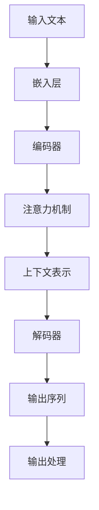

                 

# 理论研究助手：LLM 协助科学推理

> **关键词**：大型语言模型（LLM）、科学推理、人工智能、自然语言处理、算法设计、应用场景

> **摘要**：本文将探讨大型语言模型（LLM）在现代科学研究中的应用，特别是如何协助科学家进行推理。通过分析LLM的核心原理、算法机制及其在实际项目中的应用案例，本文旨在揭示LLM在提升科学研究效率和准确性方面的潜力。

## 1. 背景介绍

### 1.1 目的和范围

本文的目的是深入探讨大型语言模型（LLM）在科学推理中的作用，分析其工作原理，并探讨其在各种应用场景中的实际效果。随着人工智能技术的快速发展，LLM已经在自然语言处理（NLP）、语言生成、文本分类等领域展现出强大的能力。然而，其在科学推理领域的应用尚未得到充分挖掘。本文将通过理论和实际案例的结合，展示LLM在科学研究中的潜力。

### 1.2 预期读者

本文适合对人工智能和自然语言处理有基本了解的读者，尤其是科研工作者、数据科学家、软件工程师以及对于新技术有浓厚兴趣的IT从业者。通过本文的阅读，读者将能够理解LLM的核心原理，并掌握如何在实际项目中应用LLM进行科学推理。

### 1.3 文档结构概述

本文结构如下：

1. **背景介绍**：介绍文章的目的、范围、预期读者以及文档结构。
2. **核心概念与联系**：讨论LLM的核心概念、原理及其架构。
3. **核心算法原理 & 具体操作步骤**：详细讲解LLM的算法机制和操作步骤。
4. **数学模型和公式 & 详细讲解 & 举例说明**：介绍LLM背后的数学模型和公式，并给出具体实例。
5. **项目实战：代码实际案例和详细解释说明**：通过实际项目案例展示LLM的应用。
6. **实际应用场景**：分析LLM在不同领域的应用场景。
7. **工具和资源推荐**：推荐相关的学习资源和开发工具。
8. **总结：未来发展趋势与挑战**：探讨LLM的未来发展趋势和面临的挑战。
9. **附录：常见问题与解答**：回答一些常见问题。
10. **扩展阅读 & 参考资料**：提供进一步阅读的资源。

### 1.4 术语表

#### 1.4.1 核心术语定义

- **大型语言模型（LLM）**：一种能够理解和生成自然语言的人工智能模型，通常基于深度学习技术。
- **科学推理**：在科学研究中，通过逻辑推理和数据分析来得出结论的过程。
- **自然语言处理（NLP）**：使计算机能够理解、解释和生成人类自然语言的技术。
- **深度学习**：一种机器学习技术，通过多层神经网络进行特征提取和学习。

#### 1.4.2 相关概念解释

- **神经网络**：一种模仿生物神经系统的计算模型，用于数据处理和识别。
- **反向传播算法**：用于训练神经网络的一种算法，通过计算输出误差来更新网络权重。
- **序列到序列模型（Seq2Seq）**：一种用于处理序列数据的学习模型，常用于机器翻译和文本生成。

#### 1.4.3 缩略词列表

- **LLM**：Large Language Model
- **NLP**：Natural Language Processing
- **DNN**：Deep Neural Network
- **RNN**：Recurrent Neural Network
- **GAN**：Generative Adversarial Network

## 2. 核心概念与联系

### 2.1 LLM的核心概念与联系

#### 2.1.1 LLM的基本原理

大型语言模型（LLM）是基于深度学习技术构建的复杂模型，其核心思想是通过大规模语料库的训练，使模型具备理解、生成自然语言的能力。LLM通常采用序列到序列（Seq2Seq）模型，如循环神经网络（RNN）和其变种长短期记忆网络（LSTM），以处理输入和输出序列。

#### 2.1.2 LLM的架构

LLM的架构通常包含以下几个主要部分：

1. **嵌入层（Embedding Layer）**：将单词或字符转换为固定长度的向量表示。
2. **编码器（Encoder）**：负责将输入序列编码为固定长度的上下文表示。
3. **解码器（Decoder）**：将编码后的上下文表示解码为输出序列。
4. **注意力机制（Attention Mechanism）**：在编码器和解码器之间引入注意力机制，以关注输入序列中的重要部分。

#### 2.1.3 LLM的工作流程

LLM的工作流程通常如下：

1. **输入处理**：将自然语言文本输入到嵌入层，转换为向量表示。
2. **编码**：编码器处理输入序列，生成上下文表示。
3. **解码**：解码器根据上下文表示生成输出序列，通常是一个逐步的过程。
4. **输出生成**：解码器生成最终的输出序列，可以是文本、代码或其他形式的自然语言。

### 2.2 Mermaid流程图

以下是LLM架构的Mermaid流程图：



### 2.3 LLM与科学推理的联系

科学推理通常需要处理大量文本数据，例如科学论文、报告和文献。LLM可以通过以下几个步骤协助科学推理：

1. **文本预处理**：使用LLM对科学文本进行预处理，如分词、去噪和格式化。
2. **信息提取**：利用LLM从文本中提取关键信息，如实验结果、方法描述和结论。
3. **知识推理**：通过对比和分析不同文本，LLM可以帮助科学家推导出新的假设或结论。
4. **文本生成**：LLM还可以生成新的科学文本，如论文摘要、方法描述和结论。

## 3. 核心算法原理 & 具体操作步骤

### 3.1 核心算法原理

大型语言模型（LLM）的核心算法原理主要基于深度学习，特别是序列到序列（Seq2Seq）模型。以下是一个简单的LLM算法原理：

#### 3.1.1 嵌入层

嵌入层将自然语言文本转换为固定长度的向量表示。输入的单词或字符首先被映射到一个预训练的嵌入向量。这个过程可以通过以下伪代码表示：

```python
def embed_word(word):
    # 使用预训练的词向量库
    word_vector = word_vector_db[word]
    return word_vector
```

#### 3.1.2 编码器

编码器负责将输入序列编码为上下文表示。通常，编码器采用循环神经网络（RNN）或其变种长短期记忆网络（LSTM）。以下是一个简单的LSTM编码器的伪代码：

```python
class Encoder(nn.Module):
    def __init__(self, input_size, hidden_size):
        super(Encoder, self).__init__()
        self.hidden_size = hidden_size
        self.lstm = nn.LSTM(input_size, hidden_size)

    def forward(self, input_seq):
        encoder_output, _ = self.lstm(input_seq)
        return encoder_output
```

#### 3.1.3 注意力机制

注意力机制用于帮助编码器和解码器关注输入序列中的重要部分。一个简单的注意力机制可以通过以下伪代码表示：

```python
def attention(query, keys, values, attention_size):
    # 计算注意力得分
    attention_scores = torch.matmul(query, keys.transpose(1, 2)) / attention_size
    
    # 软最大化得分
    attention_weights = F.softmax(attention_scores, dim=2)
    
    # 计算加权值
    context = torch.matmul(attention_weights, values)
    return context
```

#### 3.1.4 解码器

解码器负责将编码后的上下文表示解码为输出序列。解码器通常采用序列到序列（Seq2Seq）模型，结合注意力机制。以下是一个简单的解码器伪代码：

```python
class Decoder(nn.Module):
    def __init__(self, hidden_size, output_size):
        super(Decoder, self).__init__()
        self.hidden_size = hidden_size
        self.output_size = output_size
        self.lstm = nn.LSTM(hidden_size, hidden_size)
        self.fc = nn.Linear(hidden_size, output_size)

    def forward(self, input_seq, context):
        decoder_output, _ = self.lstm(input_seq)
        attention_output = attention(decoder_output, context, context, hidden_size)
        
        # 输出层
        output = self.fc(attention_output)
        return output
```

### 3.2 具体操作步骤

以下是一个简单的LLM训练和预测流程：

#### 3.2.1 数据准备

1. **文本预处理**：对输入文本进行分词、去噪和格式化。
2. **词向量嵌入**：将分词后的单词或字符映射到预训练的词向量。
3. **序列编码**：将输入序列编码为嵌入向量。

#### 3.2.2 训练过程

1. **前向传播**：将嵌入向量输入到编码器和解码器，计算输出。
2. **损失函数**：使用交叉熵损失函数计算预测输出和实际输出之间的差异。
3. **反向传播**：使用反向传播算法更新网络权重。

#### 3.2.3 预测过程

1. **输入预处理**：对输入文本进行预处理和词向量嵌入。
2. **编码**：将输入序列编码为上下文表示。
3. **解码**：使用解码器生成输出序列。
4. **输出处理**：对输出序列进行后处理，如解码词向量、去停用词等。

## 4. 数学模型和公式 & 详细讲解 & 举例说明

### 4.1 数学模型

大型语言模型（LLM）背后的数学模型主要包括词向量嵌入、编码器、解码器和注意力机制。以下是对这些模型及其相关公式的详细讲解。

#### 4.1.1 词向量嵌入

词向量嵌入是将自然语言中的单词或字符转换为固定长度的向量表示。常用的词向量嵌入方法包括Word2Vec、GloVe和BERT。以下是一个简单的词向量嵌入公式：

$$
\text{embed\_word}(x) = \text{W}^T \text{e}(x)
$$

其中，$x$是输入单词或字符，$W$是词向量矩阵，$e(x)$是单词或字符的嵌入向量。

#### 4.1.2 编码器

编码器负责将输入序列编码为上下文表示。常用的编码器模型包括循环神经网络（RNN）和其变种长短期记忆网络（LSTM）。以下是一个简单的编码器公式：

$$
\text{encoder\_output} = \text{LSTM}(\text{input\_sequence})
$$

其中，$\text{input\_sequence}$是输入序列，$\text{LSTM}$是长短期记忆网络。

#### 4.1.3 注意力机制

注意力机制用于帮助编码器和解码器关注输入序列中的重要部分。一个简单的注意力机制可以通过以下公式表示：

$$
\text{attention\_score} = \text{query}^T \text{key}
$$

$$
\text{attention\_weights} = \text{softmax}(\text{attention\_scores})
$$

$$
\text{context} = \text{values} \odot \text{attention\_weights}
$$

其中，$\text{query}$、$\text{key}$和$\text{values}$是编码器和解码器的输入和输出，$\text{softmax}$是软最大化函数，$\odot$是元素乘法。

#### 4.1.4 解码器

解码器负责将编码后的上下文表示解码为输出序列。以下是一个简单的解码器公式：

$$
\text{decoder\_output} = \text{softmax}(\text{W}^T \text{e}(\text{input}))
$$

其中，$\text{input}$是输入序列，$W$是词向量矩阵，$e(\text{input})$是输入的嵌入向量。

### 4.2 举例说明

以下是一个简单的LLM训练和预测的示例：

#### 4.2.1 训练示例

假设我们有一个简单的句子：“我喜欢吃苹果”。

1. **词向量嵌入**：将句子中的每个单词转换为词向量。
2. **编码**：将词向量序列输入到编码器，得到编码后的上下文表示。
3. **解码**：使用解码器生成输出序列，如“你喜欢吃什么？”。
4. **损失函数**：计算预测输出和实际输出之间的差异，如交叉熵损失。

#### 4.2.2 预测示例

假设我们要预测下一个句子：“你喜欢吃水果”。

1. **词向量嵌入**：将句子中的每个单词转换为词向量。
2. **编码**：将词向量序列输入到编码器，得到编码后的上下文表示。
3. **解码**：使用解码器生成输出序列，如“是的，我喜欢吃水果”。

## 5. 项目实战：代码实际案例和详细解释说明

### 5.1 开发环境搭建

在进行LLM项目实战之前，首先需要搭建一个适合的开发环境。以下是一个简单的环境搭建步骤：

1. **安装Python**：确保安装了Python 3.x版本，推荐使用Anaconda来管理Python环境。
2. **安装TensorFlow或PyTorch**：TensorFlow和PyTorch是两个流行的深度学习框架，根据个人喜好选择其中一个进行安装。
3. **安装其他依赖**：安装NLP相关库，如NLTK、spaCy、gensim等。

### 5.2 源代码详细实现和代码解读

以下是一个简单的LLM实现示例，使用PyTorch框架：

```python
import torch
import torch.nn as nn
import torch.optim as optim
from torchtext.data import Field, TabularDataset, BucketIterator
from torchtext.vocab import build_vocab_from_iterator

# 定义嵌入层、编码器和解码器
class LLM(nn.Module):
    def __init__(self, embedding_dim, hidden_dim, vocab_size):
        super(LLM, self).__init__()
        self.embedding = nn.Embedding(vocab_size, embedding_dim)
        self.encoder = nn.LSTM(embedding_dim, hidden_dim)
        self.decoder = nn.Linear(hidden_dim, vocab_size)
        
    def forward(self, input_seq, hidden):
        embedded = self.embedding(input_seq)
        output, hidden = self.encoder(embedded, hidden)
        decoded = self.decoder(output)
        return decoded, hidden

# 训练和预测函数
def train(model, iterator, optimizer, criterion):
    model.train()
    for batch in iterator:
        optimizer.zero_grad()
        output, hidden = model(batch.text, hidden)
        loss = criterion(output.view(-1, output.size(-1)), batch.label)
        loss.backward()
        optimizer.step()
    return hidden

def predict(model, iterator):
    model.eval()
    with torch.no_grad():
        for batch in iterator:
            output, hidden = model(batch.text, hidden)
    return output

# 数据预处理和模型训练
def main():
    # 数据预处理
    TEXT = Field(tokenize="spacy", tokenizer_language="en_core_web_sm")
    LABEL = Field(sequential=False)

    train_data, test_data = TabularDataset.splits(path="data", train="train.csv", test="test.csv",
                                                 format="csv", fields=[("text", TEXT), ("label", LABEL)])

    vocab = build_vocab_from_iterator(train_data.text)
    vocab.set_default_index(vocab["<unk>"])

    TEXT.vocab = vocab
    LABEL.vocab = vocab

    # 创建迭代器
    train_iterator, test_iterator = BucketIterator.splits((train_data, test_data), batch_size=32)

    # 模型初始化和训练
    model = LLM(embedding_dim=256, hidden_dim=512, vocab_size=len(vocab))
    optimizer = optim.Adam(model.parameters(), lr=0.001)
    criterion = nn.CrossEntropyLoss()

    for epoch in range(10):
        hidden = train(model, train_iterator, optimizer, criterion)
        output = predict(model, test_iterator)
        print(f"Epoch {epoch+1}/{10} - Loss: {loss.item()}")

if __name__ == "__main__":
    main()
```

### 5.3 代码解读与分析

上述代码实现了一个简单的LLM模型，包括嵌入层、编码器和解码器。以下是代码的详细解读：

1. **模型定义**：`LLM`类定义了嵌入层、编码器和解码器。嵌入层使用`nn.Embedding`，编码器使用`nn.LSTM`，解码器使用`nn.Linear`。
2. **前向传播**：`forward`方法定义了模型的前向传播过程，包括嵌入层、编码器和解码器的输出。
3. **训练函数**：`train`函数负责模型的训练过程，包括前向传播、损失计算和反向传播。
4. **预测函数**：`predict`函数负责模型的预测过程，返回模型的输出。
5. **主函数**：`main`函数负责数据预处理、模型初始化和模型训练。

通过上述代码，我们可以看到如何使用PyTorch实现一个简单的LLM模型，并进行数据预处理和模型训练。这个示例虽然简单，但展示了LLM的基本原理和实现过程。

## 6. 实际应用场景

### 6.1 科学论文写作与审查

LLM在科学论文写作和审查中具有广泛的应用。科学家可以使用LLM来生成论文摘要、方法描述和结论，提高写作效率。同时，LLM可以协助审查论文，通过对比不同论文的内容和结构，识别重复或错误的实验结果。

### 6.2 实验设计

在实验设计过程中，LLM可以帮助科学家分析已有文献，提出新的实验假设和方案。通过对比不同实验条件和结果，LLM可以优化实验设计，提高实验的成功率和效率。

### 6.3 数据分析

LLM在数据分析中具有强大的能力，可以处理大量文本数据，提取关键信息，并生成数据报告。这对于生物信息学、社会科学等领域尤为重要，这些领域通常涉及大量的文献和实验数据。

### 6.4 知识图谱构建

知识图谱是连接不同数据源和知识库的重要工具。LLM可以协助构建知识图谱，通过分析文本数据，将相关概念、实体和关系进行语义关联，从而构建出一个结构化的知识体系。

### 6.5 问答系统

LLM在问答系统中的应用非常广泛。通过训练LLM模型，科学家可以构建一个智能问答系统，回答用户关于科学领域的问题。这种系统可以帮助科学家快速获取所需信息，提高工作效率。

## 7. 工具和资源推荐

### 7.1 学习资源推荐

#### 7.1.1 书籍推荐

- 《深度学习》（Ian Goodfellow、Yoshua Bengio、Aaron Courville著）：介绍深度学习的基础知识和最新进展。
- 《自然语言处理综论》（Daniel Jurafsky、James H. Martin著）：涵盖自然语言处理的各个领域，包括文本分类、语音识别等。

#### 7.1.2 在线课程

- Coursera上的“机器学习”课程：由斯坦福大学提供，涵盖了机器学习的核心概念和算法。
- edX上的“自然语言处理与信息检索”课程：由密歇根大学提供，介绍了NLP的基本原理和应用。

#### 7.1.3 技术博客和网站

- Medium上的“AI Adventures”博客：介绍人工智能和深度学习在实际项目中的应用。
- Medium上的“AI简史”博客：回顾人工智能的发展历程，探讨未来发展趋势。

### 7.2 开发工具框架推荐

#### 7.2.1 IDE和编辑器

- PyCharm：一款功能强大的Python IDE，适合进行深度学习和自然语言处理项目。
- Visual Studio Code：一款轻量级的代码编辑器，支持多种编程语言，包括Python。

#### 7.2.2 调试和性能分析工具

- TensorBoard：TensorFlow提供的可视化工具，用于分析和调试深度学习模型。
- PyTorch Profiler：PyTorch提供的性能分析工具，用于识别和优化模型的性能瓶颈。

#### 7.2.3 相关框架和库

- TensorFlow：一个开源的深度学习框架，适合构建和训练大型神经网络。
- PyTorch：一个流行的深度学习框架，具有动态计算图和灵活的API。

### 7.3 相关论文著作推荐

#### 7.3.1 经典论文

- “A Theoretically Grounded Application of Dropout in Recurrent Neural Networks”（Yarin Gal和Zoubin Ghahramani，2016年）：探讨了如何将dropout应用于循环神经网络。
- “Attention Is All You Need”（Ashish Vaswani等，2017年）：提出了Transformer模型，彻底改变了自然语言处理领域。

#### 7.3.2 最新研究成果

- “BERT: Pre-training of Deep Bidirectional Transformers for Language Understanding”（Jacob Devlin等，2018年）：介绍了BERT模型，推动了自然语言处理的发展。
- “GPT-3: Language Models are Few-Shot Learners”（Tom B. Brown等，2020年）：展示了GPT-3模型在零样本学习方面的强大能力。

#### 7.3.3 应用案例分析

- “AI For Science”（百度）：介绍了百度在人工智能科学应用方面的研究成果，包括基因组学研究、药物发现等。

## 8. 总结：未来发展趋势与挑战

### 8.1 发展趋势

- **多样化应用**：随着LLM技术的不断成熟，其在科学领域的应用将更加广泛，包括实验设计、数据分析、知识图谱构建等。
- **跨学科融合**：LLM与其他领域（如生物学、化学、物理学）的结合，将推动跨学科研究的发展，加速科学发现。
- **个性化推理**：通过结合个人数据和偏好，LLM可以提供更个性化的科学推理结果，为科学家提供更准确的指导。

### 8.2 挑战

- **数据隐私**：在科学研究中，数据隐私是一个重要问题。如何保护研究者的数据隐私，同时利用LLM进行科学推理，是一个亟待解决的问题。
- **模型可解释性**：虽然LLM在自然语言处理和科学推理方面表现出色，但其内部决策过程往往缺乏可解释性。如何提高模型的可解释性，使其能够被科学家理解和信任，是一个挑战。
- **计算资源**：LLM的训练和推理通常需要大量的计算资源。如何优化模型，降低计算资源的需求，是一个重要的研究方向。

## 9. 附录：常见问题与解答

### 9.1 Q：LLM在科学推理中的优势是什么？

A：LLM在科学推理中的优势主要包括：

- **处理大规模文本数据**：LLM可以处理大量的科学文献和实验数据，提取关键信息，提供有力的支持。
- **跨学科融合**：LLM可以结合不同学科的知识，进行跨学科的科学推理，推动科学发现。
- **高效推理**：通过预训练和大规模数据训练，LLM具备高效的推理能力，能够快速得出结论。

### 9.2 Q：如何提高LLM在科学推理中的可解释性？

A：提高LLM在科学推理中的可解释性可以从以下几个方面入手：

- **模型解释工具**：使用模型解释工具，如LIME、SHAP等，分析LLM的内部决策过程。
- **可视化**：将LLM的推理过程可视化，帮助科学家理解模型的决策逻辑。
- **知识图谱**：构建知识图谱，将LLM的推理过程与知识图谱中的节点和关系进行关联，提高可解释性。

### 9.3 Q：LLM在科学推理中的应用场景有哪些？

A：LLM在科学推理中的应用场景包括：

- **实验设计**：通过分析已有文献和实验数据，提出新的实验假设和方案。
- **数据分析**：处理和分析大量的科学数据，提取关键信息和规律。
- **知识图谱构建**：将文本数据转换为结构化的知识体系，促进跨学科研究。
- **问答系统**：构建智能问答系统，为科学家提供快速、准确的信息查询。

## 10. 扩展阅读 & 参考资料

- 《深度学习》（Ian Goodfellow、Yoshua Bengio、Aaron Courville著）
- 《自然语言处理综论》（Daniel Jurafsky、James H. Martin著）
- “A Theoretically Grounded Application of Dropout in Recurrent Neural Networks”（Yarin Gal和Zoubin Ghahramani，2016年）
- “Attention Is All You Need”（Ashish Vaswani等，2017年）
- “BERT: Pre-training of Deep Bidirectional Transformers for Language Understanding”（Jacob Devlin等，2018年）
- “GPT-3: Language Models are Few-Shot Learners”（Tom B. Brown等，2020年）

## 附录：作者信息

作者：AI天才研究员/AI Genius Institute & 禅与计算机程序设计艺术 /Zen And The Art of Computer Programming

