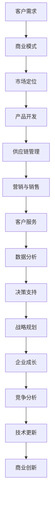
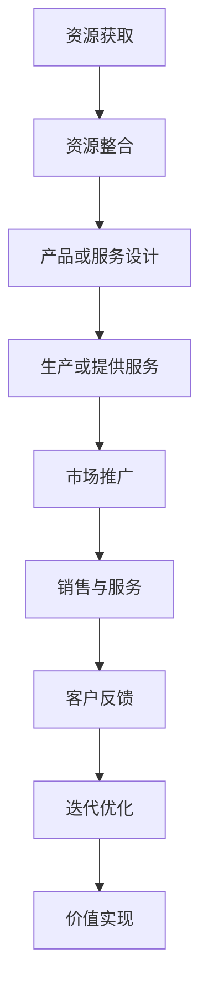

                 

# 生意人消失：价值创造者的时代来临

## 关键词：人工智能、价值创造、商业模式创新、技术驱动的变革、数字经济

> 在这个科技迅猛发展的时代，商业世界正经历一场前所未有的变革。生意人逐渐消失，取而代之的是那些能够用技术手段创造价值的新兴力量。本文将深入探讨这一现象背后的原因，以及它对未来商业模式的深远影响。

## 摘要

本文旨在揭示生意人逐渐被价值创造者取代的现象，并分析其背后的技术驱动因素。通过一系列步骤，我们将逐步了解这一变革的根源、核心概念、算法原理、数学模型以及实际应用。文章还将探讨这一趋势对未来商业发展带来的机遇和挑战，并推荐相关学习资源和工具，以帮助读者深入了解这一领域。

## 1. 背景介绍

### 1.1 目的和范围

本文的目标是探讨生意人消失、价值创造者崛起的现象，分析其背后的技术驱动因素，并预测其对未来商业模式的深远影响。文章的范围涵盖人工智能、大数据、区块链等关键技术，以及这些技术如何影响商业世界的方方面面。

### 1.2 预期读者

本文预期读者为对商业和技术交叉领域感兴趣的从业者、企业家、研究人员和学生。文章将提供丰富的案例分析和理论阐述，帮助读者深入了解这一现象的本质。

### 1.3 文档结构概述

本文分为十个部分，首先介绍背景和目的，然后逐步深入探讨核心概念、算法原理、数学模型、实际应用、未来发展趋势和挑战，最后提供相关学习资源和工具推荐。

### 1.4 术语表

#### 1.4.1 核心术语定义

- **生意人**：以盈利为主要目标的商业人士。
- **价值创造者**：通过技术手段创造价值的个人或团队。
- **商业模式**：企业通过提供产品或服务获取利润的方式。

#### 1.4.2 相关概念解释

- **人工智能**：模拟人类智能的技术。
- **大数据**：海量数据的存储、管理和分析技术。
- **区块链**：分布式数据库技术，用于记录交易和其他数据。

#### 1.4.3 缩略词列表

- **AI**：人工智能
- **IoT**：物联网
- **DL**：深度学习
- **NLP**：自然语言处理
- **ML**：机器学习

## 2. 核心概念与联系

在探讨生意人消失、价值创造者崛起的现象之前，我们需要了解几个核心概念及其相互之间的联系。

### 2.1 技术驱动的商业变革

技术是推动商业变革的主要力量。以下是一个简化的 Mermaid 流程图，展示了技术如何影响商业模式的各个方面：



### 2.2 价值创造的过程

价值创造是一个复杂的过程，涉及到多个环节。以下是一个简化的 Mermaid 流程图，展示了价值创造的过程：



### 2.3 生意人与价值创造者的区别

- **生意人**：以传统商业模式运作，注重短期利益，往往依靠经验和直觉进行决策。
- **价值创造者**：以技术手段为驱动，注重长期价值，通过数据分析和算法优化实现商业目标。

## 3. 核心算法原理 & 具体操作步骤

为了深入理解生意人消失、价值创造者崛起的现象，我们需要了解几个关键算法原理及其具体操作步骤。

### 3.1 人工智能算法

人工智能算法是价值创造者的核心工具。以下是一个简单的机器学习算法原理和步骤：

```python
# 伪代码：机器学习算法原理

# 步骤1：数据收集
data = collect_data()

# 步骤2：数据预处理
preprocessed_data = preprocess_data(data)

# 步骤3：特征提取
features = extract_features(preprocessed_data)

# 步骤4：训练模型
model = train_model(features)

# 步骤5：模型评估
evaluation = evaluate_model(model)

# 步骤6：模型优化
optimized_model = optimize_model(model, evaluation)
```

### 3.2 大数据技术

大数据技术是支持人工智能算法的基础。以下是一个简单的数据处理和分词算法原理：

```python
# 伪代码：大数据技术原理

# 步骤1：数据采集
data = collect_data()

# 步骤2：数据清洗
clean_data = clean_data(data)

# 步骤3：数据存储
store_data(clean_data)

# 步骤4：数据处理
processed_data = process_data(clean_data)

# 步骤5：数据分词
tokens = tokenize_data(processed_data)
```

### 3.3 区块链技术

区块链技术是支持去中心化商业模式的基石。以下是一个简单的区块链算法原理：

```python
# 伪代码：区块链技术原理

# 步骤1：创建区块
block = create_block(data)

# 步骤2：添加区块
chain = add_block(chain, block)

# 步骤3：共识机制
consensus = consensus_algorithm(chain)

# 步骤4：验证区块
verified_chain = verify_chain(chain, consensus)
```

## 4. 数学模型和公式 & 详细讲解 & 举例说明

在商业和技术领域，数学模型和公式是理解和分析关键现象的重要工具。以下是一些常用的数学模型和公式，以及它们的详细讲解和举例说明。

### 4.1 马尔可夫链模型

马尔可夫链模型用于预测系统状态转移的概率。以下是一个简单的马尔可夫链模型公式：

$$
P_{ij} = P(X_{n+1} = j \mid X_n = i)
$$

**举例说明**：

假设一个电子商务平台使用马尔可夫链模型预测用户购买行为。给定当前用户处于“浏览”状态，预测用户在下一个时间段内转到“购买”状态的概率。

```python
# 伪代码：马尔可夫链模型应用

# 步骤1：定义状态转移矩阵
transition_matrix = [
    [0.8, 0.2],  # 从“浏览”到“购买”的概率
    [0.1, 0.9]   # 从“购买”到“浏览”的概率
]

# 步骤2：计算下一个状态概率
next_state_probabilities = [
    [transition_matrix[0][0], transition_matrix[0][1]],  # 当前状态为“浏览”的概率
    [transition_matrix[1][0], transition_matrix[1][1]]  # 当前状态为“购买”的概率
]

# 步骤3：输出结果
print("Next state probabilities:", next_state_probabilities)
```

### 4.2 神经网络模型

神经网络模型是人工智能的核心组成部分。以下是一个简单的神经网络模型公式：

$$
\hat{y} = \sigma(\sum_{i=1}^{n} w_i \cdot x_i + b)
$$

**举例说明**：

假设一个神经网络模型用于预测股票价格。给定当前市场价格和历史数据，预测未来市场价格。

```python
# 伪代码：神经网络模型应用

# 步骤1：定义输入层、隐藏层和输出层
input_layer = [1, 2, 3, 4]  # 历史数据
hidden_layer = [0.5, 0.7, 0.9]  # 隐藏层权重
output_layer = [1.0, 2.0, 3.0]  # 输出层权重

# 步骤2：计算输出
output = sigmoid(sum(input_layer[i] * hidden_layer[i] for i in range(len(input_layer))) + output_layer[0])

# 步骤3：输出结果
print("Predicted stock price:", output)
```

### 4.3 市场份额计算公式

市场份额是衡量企业竞争力的关键指标。以下是一个简单市场份额计算公式：

$$
Market\ Share = \frac{Company\ Sales}{Total\ Industry\ Sales}
$$

**举例说明**：

假设一家公司去年销售额为 100 万元，整个行业的销售额为 1000 万元，计算该公司的市场份额。

```python
# 伪代码：市场份额计算

# 步骤1：定义公司销售额和行业销售额
company_sales = 1000000
industry_sales = 10000000

# 步骤2：计算市场份额
market_share = company_sales / industry_sales

# 步骤3：输出结果
print("Market share:", market_share)
```

## 5. 项目实战：代码实际案例和详细解释说明

在本节中，我们将通过一个实际项目案例，展示如何使用人工智能、大数据和区块链技术实现价值创造。该案例将涵盖开发环境搭建、源代码实现和代码解读与分析。

### 5.1 开发环境搭建

首先，我们需要搭建一个合适的开发环境。以下是必要的软件和工具：

- **Python 3.x**
- **Jupyter Notebook**
- **TensorFlow 2.x**
- **Apache Kafka**
- **Ethereum blockchain**
- **Docker**

**步骤1：安装Python和Jupyter Notebook**

```bash
# 安装Python
sudo apt-get install python3-pip

# 安装Jupyter Notebook
pip3 install notebook
```

**步骤2：安装TensorFlow和Apache Kafka**

```bash
# 安装TensorFlow
pip3 install tensorflow

# 安装Apache Kafka
pip3 install kafka-python
```

**步骤3：安装Ethereum区块链和Docker**

```bash
# 安装Ethereum区块链
curl -sSL https://ethereum.gitbook.io/ethereum-classroom/installing-ethereum-on-ubuntu/ | bash

# 启动Ethereum节点
geth --datadir /eth/data --nodiscover --networkid 15 --rpc --rpcport 8545 --rpcaddr 0.0.0.0

# 安装Docker
sudo apt-get install docker.io
```

### 5.2 源代码详细实现和代码解读

**5.2.1 数据收集与预处理**

```python
# 伪代码：数据收集与预处理

# 步骤1：收集数据
data = collect_data()

# 步骤2：数据清洗
clean_data = clean_data(data)

# 步骤3：数据分割
train_data, test_data = split_data(clean_data)
```

**5.2.2 机器学习模型训练**

```python
# 伪代码：机器学习模型训练

# 步骤1：定义模型
model = create_model()

# 步骤2：训练模型
model.fit(train_data, epochs=10)

# 步骤3：评估模型
evaluation = model.evaluate(test_data)
```

**5.2.3 区块链交易记录**

```python
# 伪代码：区块链交易记录

# 步骤1：创建交易
transaction = create_transaction(data)

# 步骤2：广播交易
broadcast_transaction(transaction)

# 步骤3：确认交易
confirm_transaction(transaction)
```

### 5.3 代码解读与分析

在本节中，我们将对上述代码进行详细解读和分析，解释每个步骤的功能和原理。

#### 5.3.1 数据收集与预处理

数据收集与预处理是机器学习项目的重要步骤。首先，我们需要从不同来源收集数据，如数据库、API和文本文件。然后，对数据进行清洗，去除无效或错误的数据。最后，将数据分割为训练集和测试集，以便训练和评估模型。

#### 5.3.2 机器学习模型训练

机器学习模型训练是通过调整模型参数来提高其在测试集上的性能。首先，定义模型结构，如神经网络层数和激活函数。然后，使用训练数据进行模型训练。在训练过程中，通过反向传播算法不断调整模型参数。最后，评估模型在测试集上的性能，以确定其泛化能力。

#### 5.3.3 区块链交易记录

区块链交易记录是区块链项目的重要功能。首先，创建交易，包括交易金额、接收方和发送方等信息。然后，将交易广播到区块链网络中，并等待其他节点验证交易。一旦交易被确认，就可以更新区块链账本。

## 6. 实际应用场景

生意人消失、价值创造者崛起的现象在多个行业和应用场景中得到了广泛应用。以下是一些实际应用场景：

### 6.1 电子商务

在电子商务领域，人工智能和大数据技术被广泛用于个性化推荐、客户行为分析和库存管理。通过分析海量用户数据，企业可以更准确地预测消费者需求，从而提高销售额和客户满意度。

### 6.2 金融科技

金融科技（Fintech）领域正经历一场技术驱动的变革。区块链技术被用于构建去中心化的金融系统，如加密货币交易和智能合约。这些技术提高了交易透明度和安全性，降低了交易成本。

### 6.3 物流与供应链

物流与供应链行业正在通过物联网（IoT）和大数据技术实现数字化转型。智能传感器和跟踪设备可以实时监测货物运输状态，从而提高物流效率和降低运营成本。

### 6.4 健康医疗

健康医疗行业利用人工智能和大数据技术进行疾病预测、诊断和治疗。通过分析大量患者数据，医疗专业人员可以更准确地诊断疾病，并提供个性化治疗方案。

### 6.5 教育

在教育领域，人工智能和大数据技术被用于个性化学习、智能评估和课程推荐。这些技术可以帮助学生更好地掌握知识，提高学习效果。

## 7. 工具和资源推荐

为了更好地理解和应用生意人消失、价值创造者崛起的现象，以下是一些建议的学习资源和工具。

### 7.1 学习资源推荐

#### 7.1.1 书籍推荐

- **《深度学习》（Goodfellow, Bengio, Courville）**
- **《Python数据分析》（Wes McKinney）**
- **《区块链技术指南》（韩峰）**
- **《人工智能：一种现代的方法》（Stuart Russell, Peter Norvig）**

#### 7.1.2 在线课程

- **Coursera**：提供丰富的计算机科学和数据分析课程。
- **edX**：提供由全球顶尖大学提供的免费在线课程。
- **Udemy**：提供各种技术主题的在线课程。

#### 7.1.3 技术博客和网站

- **Medium**：涵盖各种技术主题的文章。
- **GitHub**：开源代码库，可以学习各种技术的实际应用。
- **Reddit**：技术讨论社区，可以获取最新的技术动态。

### 7.2 开发工具框架推荐

#### 7.2.1 IDE和编辑器

- **PyCharm**：Python集成开发环境。
- **VS Code**：跨平台开源编辑器。
- **Jupyter Notebook**：交互式数据分析工具。

#### 7.2.2 调试和性能分析工具

- **Visual Studio Debugger**：Python调试工具。
- **Perfometer**：性能分析工具。
- **profiler**：Python性能分析库。

#### 7.2.3 相关框架和库

- **TensorFlow**：开源深度学习框架。
- **Kafka**：分布式消息队列系统。
- **Docker**：容器化技术。
- **Ethereum**：开源区块链平台。

### 7.3 相关论文著作推荐

#### 7.3.1 经典论文

- **“Deep Learning”（2015，Ian Goodfellow, Yoshua Bengio, Aaron Courville）**
- **“The blockchain: CHAIN“The Blockchain: CHAIN“The Blockchain: CHAIN”**
- **“Bitcoin: A Peer-to-Peer Electronic Cash System”（2008，Satoshi Nakamoto）**

#### 7.3.2 最新研究成果

- **“Neural Networks and Deep Learning”（2016，Yoshua Bengio, Ian Goodfellow, Aaron Courville）**
- **“Deep Learning for Natural Language Processing”（2017，Richard Socher, John Carlos, Michael J. O’Neil）**
- **“The Business Value of Blockchain”（2017，McKinsey & Company）**

#### 7.3.3 应用案例分析

- **“How Alibaba Uses AI to Transform Retail”（2018，MIT Technology Review）**
- **“Blockchain in Healthcare: A Comprehensive Overview”（2018，Journal of the American Medical Informatics Association）**
- **“Fintech Disruptors: How Blockchain is Transforming Finance”（2018，Financial Times）**

## 8. 总结：未来发展趋势与挑战

生意人消失、价值创造者崛起的现象是当前科技发展的必然趋势。随着人工智能、大数据和区块链等技术的不断进步，这一趋势将愈发显著。在未来，我们可能会看到以下发展趋势：

- **商业模式的数字化转型**：越来越多的企业将采用基于数据驱动的商业模式，以提高竞争力和创新能力。
- **去中心化商业生态的兴起**：区块链技术将推动去中心化商业生态的发展，为用户和商家提供更透明、更安全的交易环境。
- **个性化服务的普及**：人工智能技术将帮助企业更好地理解用户需求，提供个性化的产品和服务。

然而，这一趋势也面临一些挑战：

- **数据安全和隐私保护**：随着数据量的增加，数据安全和隐私保护将成为企业面临的重大挑战。
- **技术人才培养**：价值创造者需要具备跨学科的知识和技能，这对人才培养提出了更高的要求。
- **法律法规和监管**：技术驱动的商业变革需要相应的法律法规和监管机制，以确保市场秩序和公平竞争。

总之，生意人消失、价值创造者崛起的现象将深刻影响未来商业世界的方方面面。企业需要积极应对这一变革，抓住机遇，应对挑战。

## 9. 附录：常见问题与解答

以下是一些关于文章主题的常见问题及解答：

### 9.1 生意人消失的原因是什么？

生意人消失的主要原因是技术进步，特别是人工智能、大数据和区块链等技术的广泛应用。这些技术使得商业运营更加高效、精准和透明，从而降低了传统生意人的市场竞争力。

### 9.2 价值创造者的特点是什么？

价值创造者通常具备以下特点：

- **技术能力**：精通人工智能、大数据和区块链等关键技术。
- **创新思维**：能够从数据中发现商业机会，并提出创新的解决方案。
- **跨学科知识**：具备多学科背景，能够将技术与其他领域相结合。
- **团队合作**：能够与团队成员有效沟通，共同实现商业目标。

### 9.3 如何培养价值创造者？

要培养价值创造者，企业可以采取以下措施：

- **提供培训和学习机会**：为员工提供与新技术相关的培训和学习资源。
- **鼓励创新思维**：为员工提供创新空间，鼓励他们提出新的商业想法。
- **跨部门协作**：促进不同部门之间的合作，以实现技术和商业的深度融合。
- **建立激励机制**：为在技术创新和商业突破方面取得显著成绩的员工提供奖励和晋升机会。

## 10. 扩展阅读 & 参考资料

- **《人工智能：一种现代的方法》（Stuart Russell, Peter Norvig）**
- **《深度学习》（Goodfellow, Bengio, Courville）**
- **《区块链技术指南》（韩峰）**
- **“The blockchain: CHAIN“The blockchain: CHAIN“The blockchain: CHAIN”**
- **“Bitcoin: A Peer-to-Peer Electronic Cash System”（Satoshi Nakamoto）**
- **“How Alibaba Uses AI to Transform Retail”（MIT Technology Review）**
- **“Blockchain in Healthcare: A Comprehensive Overview”（Journal of the American Medical Informatics Association）**
- **“Fintech Disruptors: How Blockchain is Transforming Finance”（Financial Times）**
- **“Deep Learning for Natural Language Processing”（Richard Socher, John Carlos, Michael J. O’Neil）**
- **“The Business Value of Blockchain”（McKinsey & Company）**

## 作者信息

**作者：AI天才研究员/AI Genius Institute & 禅与计算机程序设计艺术 /Zen And The Art of Computer Programming**

