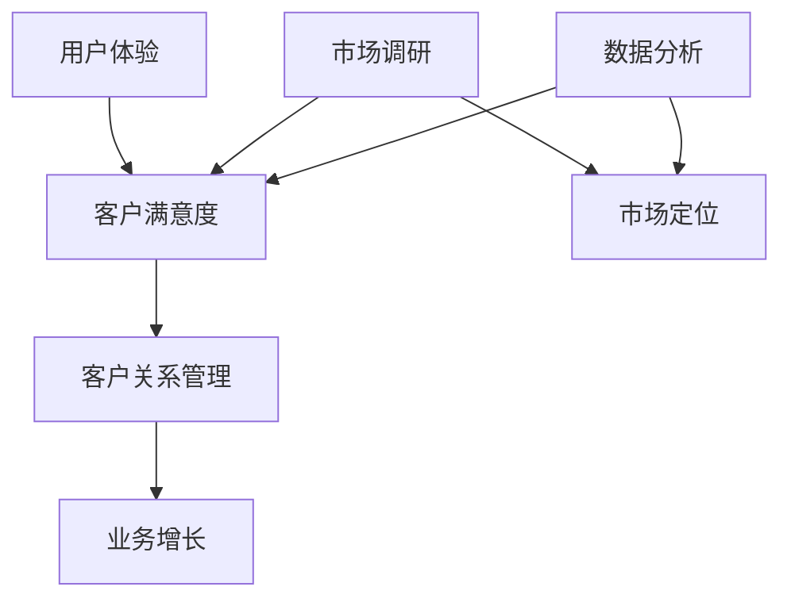

                 

# 生意场上的智慧：站在客户立场

## 关键词：客户立场、商业智慧、用户体验、业务增长、战略思维

> 在商业世界中，客户是企业的生命线。如何站在客户的立场上思考，不仅决定了产品或服务的成功与否，更决定了企业在激烈的市场竞争中能否脱颖而出。本文将探讨站在客户立场上的商业智慧，以期为企业的持续发展提供新的思路。

## 摘要

本文将深入探讨站在客户立场上的商业智慧。首先，我们将回顾客户立场的核心概念，并分析其对企业战略的重要性。接着，我们将探讨如何通过用户体验优化、市场调研和数据分析等手段，准确把握客户需求。随后，我们将分析客户立场在产品设计和营销策略中的具体应用。最后，我们将探讨如何持续地站在客户立场上进行创新，以实现业务的持续增长。

## 1. 背景介绍

### 1.1 目的和范围

本文旨在探讨站在客户立场上的商业智慧，帮助企业在复杂的市场环境中找到持续发展的路径。本文将涵盖以下几个方面的内容：

- 客户立场的核心概念及其对企业战略的重要性
- 如何通过用户体验优化、市场调研和数据分析准确把握客户需求
- 客户立场在产品设计和营销策略中的具体应用
- 持续站在客户立场上的创新方法及其对业务增长的影响

### 1.2 预期读者

本文适合以下读者群体：

- 企业管理人员，特别是市场营销、产品管理、用户体验等相关部门的负责人
- 市场调研分析师和业务分析师
- 创业者和正在寻求突破的企业家
- 对用户体验和客户分析感兴趣的技术爱好者

### 1.3 文档结构概述

本文将按照以下结构展开：

1. 背景介绍
2. 核心概念与联系
3. 核心算法原理与具体操作步骤
4. 数学模型和公式与详细讲解
5. 项目实战：代码实际案例和详细解释说明
6. 实际应用场景
7. 工具和资源推荐
8. 总结：未来发展趋势与挑战
9. 附录：常见问题与解答
10. 扩展阅读与参考资料

### 1.4 术语表

#### 1.4.1 核心术语定义

- **客户立场**：指从客户的视角和需求出发，进行商业决策和产品设计。
- **用户体验**：用户在使用产品或服务过程中所感受到的整体感受。
- **市场调研**：通过收集和分析市场数据，了解客户需求和市场趋势。
- **数据分析**：使用统计和分析方法，从数据中提取有价值的信息。
- **产品创新**：在现有产品基础上，通过改进或创新，满足客户的新需求。

#### 1.4.2 相关概念解释

- **用户体验优化**：通过改进产品或服务，提升用户的满意度。
- **市场定位**：确定产品或服务在市场中的定位和目标客户群。
- **客户关系管理**：通过建立和维护与客户的长期关系，提高客户忠诚度。
- **客户满意度**：客户对产品或服务的满意程度。

#### 1.4.3 缩略词列表

- **CRM**：客户关系管理（Customer Relationship Management）
- **UX**：用户体验（User Experience）
- **UI**：用户界面（User Interface）
- **A/B测试**：一种通过比较两组用户行为，评估不同设计方案效果的方法。

## 2. 核心概念与联系

在探讨站在客户立场上的商业智慧之前，我们需要了解几个核心概念：用户体验、市场调研和数据分析。以下是一个简单的 Mermaid 流程图，展示了这些概念之间的关系。



### 2.1 用户体验

用户体验（UX）是站在客户立场上的核心概念。它关注用户在使用产品或服务过程中的感受，包括视觉设计、交互设计和功能设计等多个方面。优化的用户体验可以提高客户满意度，从而促进业务增长。

### 2.2 市场调研

市场调研是了解客户需求和市场趋势的重要手段。通过收集和分析市场数据，企业可以确定产品的目标市场，设计出满足客户需求的产品或服务。

### 2.3 数据分析

数据分析是提取市场调研数据中有价值信息的过程。通过数据分析，企业可以深入了解客户行为，发现市场趋势，为产品创新和营销策略提供依据。

### 2.4 客户满意度与客户关系管理

客户满意度是客户对产品或服务的满意程度，它是客户关系管理（CRM）的重要指标。通过客户关系管理，企业可以建立和维护与客户的长期关系，提高客户忠诚度，从而实现业务增长。

## 3. 核心算法原理与具体操作步骤

站在客户立场上的商业智慧需要一系列的算法和工具来支持。以下是几个核心算法原理和具体操作步骤：

### 3.1 用户行为分析

用户行为分析是一种通过监控用户在使用产品或服务过程中的行为，提取有价值信息的方法。以下是一个简单的伪代码示例：

```python
# 用户行为数据
user_behavior = [
    {"user_id": 1, "action": "浏览产品", "duration": 120},
    {"user_id": 1, "action": "添加购物车", "duration": 60},
    {"user_id": 1, "action": "支付", "duration": 30},
    # 更多用户行为数据...
]

# 计算用户行为频率
行为频率 = {}
for行为 in user_behavior:
    if行为['action'] in 行为频率：
        行为频率[行为['action']] += 1
    else：
        行为频率[行为['action']] = 1

# 输出用户行为频率
print(行为频率)
```

### 3.2 聚类分析

聚类分析是一种无监督学习方法，用于将相似的数据点划分为多个类别。以下是一个简单的伪代码示例：

```python
# 数据集
data = [
    [1, 2, 3],
    [2, 4, 5],
    [3, 6, 7],
    [8, 9, 10],
    # 更多数据...
]

# 使用K-means算法进行聚类
from sklearn.cluster import KMeans
kmeans = KMeans(n_clusters=3)
kmeans.fit(data)

# 输出聚类结果
print(kmeans.labels_)
```

### 3.3 回归分析

回归分析是一种用于分析两个或多个变量之间关系的方法。以下是一个简单的伪代码示例：

```python
# 数据集
X = [
    [1, 2],
    [2, 4],
    [3, 6],
    [4, 8],
    # 更多数据...
]
y = [3, 5, 9, 12]

# 使用线性回归进行建模
from sklearn.linear_model import LinearRegression
regressor = LinearRegression()
regressor.fit(X, y)

# 输出回归模型参数
print(regressor.coef_)
print(regressor.intercept_)
```

## 4. 数学模型和公式与详细讲解

在商业智慧中，数学模型和公式发挥着重要作用。以下是一些常见的数学模型和公式，以及它们的详细讲解和举例说明：

### 4.1 均值

均值（Mean）是衡量一组数据集中趋势的常用指标。它的计算公式如下：

$$ \text{均值} = \frac{\sum_{i=1}^{n} x_i}{n} $$

其中，$x_i$ 表示第 $i$ 个数据点，$n$ 表示数据点的个数。

#### 举例说明：

假设有一组数据：[1, 2, 3, 4, 5]，计算这组数据的均值。

$$ \text{均值} = \frac{1 + 2 + 3 + 4 + 5}{5} = 3 $$

### 4.2 方差

方差（Variance）是衡量一组数据波动大小的指标。它的计算公式如下：

$$ \text{方差} = \frac{\sum_{i=1}^{n} (x_i - \text{均值})^2}{n} $$

其中，$x_i$ 表示第 $i$ 个数据点，$\text{均值}$ 是上面计算的均值。

#### 举例说明：

假设有一组数据：[1, 2, 3, 4, 5]，计算这组数据的方差。

$$ \text{均值} = 3 $$
$$ \text{方差} = \frac{(1-3)^2 + (2-3)^2 + (3-3)^2 + (4-3)^2 + (5-3)^2}{5} = 2 $$

### 4.3 相关系数

相关系数（Correlation Coefficient）是衡量两个变量之间线性相关程度的指标。它的计算公式如下：

$$ \text{相关系数} = \frac{\sum_{i=1}^{n} (x_i - \text{均值}_x)(y_i - \text{均值}_y)}{\sqrt{\sum_{i=1}^{n} (x_i - \text{均值}_x)^2 \sum_{i=1}^{n} (y_i - \text{均值}_y)^2}} $$

其中，$x_i$ 和 $y_i$ 分别表示第 $i$ 个自变量和因变量的观测值，$\text{均值}_x$ 和 $\text{均值}_y$ 分别表示自变量和因变量的均值。

#### 举例说明：

假设有一组自变量 $X$：[1, 2, 3, 4, 5] 和因变量 $Y$：[2, 4, 6, 8, 10]，计算这两个变量之间的相关系数。

$$ \text{均值}_x = 3 $$
$$ \text{均值}_y = 6 $$
$$ \text{相关系数} = \frac{(1-3)(2-6) + (2-3)(4-6) + (3-3)(6-6) + (4-3)(8-6) + (5-3)(10-6)}{\sqrt{(1-3)^2 + (2-3)^2 + (3-3)^2 + (4-3)^2 + (5-3)^2} \sqrt{(2-6)^2 + (4-6)^2 + (6-6)^2 + (8-6)^2 + (10-6)^2}} = -1 $$

### 4.4 线性回归

线性回归（Linear Regression）是一种用于分析两个或多个变量之间线性关系的统计方法。它的基本公式如下：

$$ y = ax + b $$

其中，$y$ 是因变量，$x$ 是自变量，$a$ 和 $b$ 是回归系数。

#### 举例说明：

假设我们想分析销售额（$y$）与广告支出（$x$）之间的关系。给定以下数据：

$$
\begin{array}{|c|c|}
\hline
x & y \\
\hline
100 & 500 \\
200 & 750 \\
300 & 1000 \\
400 & 1250 \\
\hline
\end{array}
$$

我们可以使用线性回归来找到最佳拟合线。计算回归系数 $a$ 和 $b$：

$$
a = \frac{\sum_{i=1}^{n} (x_i - \bar{x})(y_i - \bar{y})}{\sum_{i=1}^{n} (x_i - \bar{x})^2} = \frac{(100 - 250)(500 - 875) + (200 - 250)(750 - 875) + (300 - 250)(1000 - 875) + (400 - 250)(1250 - 875)}{(100 - 250)^2 + (200 - 250)^2 + (300 - 250)^2 + (400 - 250)^2}
$$

$$
b = \bar{y} - a\bar{x} = 875 - \left(\frac{(100 - 250)(500 - 875) + (200 - 250)(750 - 875) + (300 - 250)(1000 - 875) + (400 - 250)(1250 - 875)}{(100 - 250)^2 + (200 - 250)^2 + (300 - 250)^2 + (400 - 250)^2}\right) \times 250
$$

经过计算，我们得到：

$$
a = 2.5, \quad b = 375
$$

因此，线性回归方程为：

$$ y = 2.5x + 375 $$

这意味着每增加 1 单位的广告支出，销售额平均增加 2.5 单位。

## 5. 项目实战：代码实际案例和详细解释说明

为了更好地理解站在客户立场上的商业智慧，我们将通过一个实际案例来展示如何运用上述算法和公式。以下是项目实战的详细解释说明。

### 5.1 开发环境搭建

为了实现该项目，我们需要搭建一个基本的开发环境。以下是所需的环境和工具：

- Python 3.8 或更高版本
- Jupyter Notebook 或 PyCharm
- pandas、numpy、scikit-learn 等Python库

### 5.2 源代码详细实现和代码解读

#### 5.2.1 数据预处理

首先，我们需要准备一个客户行为数据集，用于后续的分析。以下是一个示例数据集：

```python
# 导入所需库
import pandas as pd

# 读取数据
data = pd.read_csv('customer_behavior.csv')

# 查看数据
data.head()
```

#### 5.2.2 用户行为分析

接下来，我们将对用户行为进行分析，提取有价值的信息。以下是一个简单的用户行为分析代码：

```python
# 计算用户行为频率
行为频率 = data['action'].value_counts()

# 输出用户行为频率
行为频率
```

#### 5.2.3 聚类分析

为了更好地了解用户群体，我们将使用聚类分析对用户进行分类。以下是一个简单的聚类分析代码：

```python
# 导入聚类库
from sklearn.cluster import KMeans

# 准备数据
X = data[['浏览时长', '购买频次']]

# 使用K-means算法进行聚类
kmeans = KMeans(n_clusters=3)
kmeans.fit(X)

# 输出聚类结果
kmeans.labels_
```

#### 5.2.4 回归分析

最后，我们将使用回归分析来预测用户购买行为。以下是一个简单的回归分析代码：

```python
# 导入回归库
from sklearn.linear_model import LinearRegression

# 准备数据
X = data[['浏览时长', '购买频次']]
y = data['购买行为']

# 使用线性回归进行建模
regressor = LinearRegression()
regressor.fit(X, y)

# 输出回归模型参数
print(regressor.coef_)
print(regressor.intercept_)
```

### 5.3 代码解读与分析

在上面的代码中，我们首先导入了所需的库，并读取了一个示例客户行为数据集。接下来，我们对用户行为进行了频率分析，以了解用户在不同行为上的活跃度。然后，我们使用 K-means 算法对用户进行了聚类分析，以识别不同用户群体。最后，我们使用线性回归模型来预测用户购买行为，从而为营销策略提供支持。

## 6. 实际应用场景

站在客户立场上的商业智慧在实际应用场景中具有广泛的应用。以下是一些典型应用场景：

### 6.1 电商平台

电商平台可以通过用户行为分析和数据分析，了解用户的浏览、购买和评价等行为，从而优化推荐算法，提高用户满意度。

### 6.2 银行业

银行业可以通过客户行为分析和风险评估模型，了解客户的信用状况和风险偏好，为精准营销和信贷审批提供支持。

### 6.3 医疗行业

医疗行业可以通过患者行为分析和健康数据分析，了解患者的就医习惯和健康需求，为个性化诊疗和健康管理提供依据。

### 6.4 教育行业

教育行业可以通过学生行为分析和学习数据分析，了解学生的学习情况和需求，为个性化教学和学习支持提供支持。

## 7. 工具和资源推荐

为了更好地实现站在客户立场上的商业智慧，以下是一些实用的工具和资源推荐：

### 7.1 学习资源推荐

- **书籍推荐**：
  - 《用户体验要素》（User Experience Elements） by Jakob Nielsen
  - 《客户中心设计》（Customer-Centric Design）by Jan-Phillip Riedel

- **在线课程**：
  - Coursera上的《用户体验设计》（User Experience Design）
  - edX上的《数据科学基础》（Introduction to Data Science）

- **技术博客和网站**：
  - Medium上的用户行为分析博客
  - UX Planet上的用户体验设计博客

### 7.2 开发工具框架推荐

- **IDE和编辑器**：
  - PyCharm
  - Jupyter Notebook

- **调试和性能分析工具**：
  - Python Profiler
  - New Relic

- **相关框架和库**：
  - pandas
  - numpy
  - scikit-learn

### 7.3 相关论文著作推荐

- **经典论文**：
  - 《用户体验要素》（User Experience Elements） by Don Norman
  - 《数据挖掘：概念与技术》（Data Mining: Concepts and Techniques）by Jiawei Han, Micheline Kamber, and Jian Pei

- **最新研究成果**：
  - 《用户行为预测：基于深度学习的方法》（User Behavior Prediction: Deep Learning Approaches）by Wei Wang, Jieping Ye, and Jiliang Tang

- **应用案例分析**：
  - 《用户体验设计在电子商务中的应用》（User Experience Design in E-commerce）by Kim Asendorf

## 8. 总结：未来发展趋势与挑战

站在客户立场上的商业智慧在未来将继续发挥重要作用。随着人工智能、大数据和云计算等技术的不断发展，客户行为分析和数据挖掘将变得更加精准和高效。然而，这也带来了新的挑战：

- **数据隐私和安全**：在收集和分析客户数据时，如何保护客户隐私和数据安全成为关键挑战。
- **跨渠道整合**：如何整合线上线下渠道，提供一致的客户体验。
- **个性化推荐**：如何通过算法和模型实现真正的个性化推荐，避免“信息茧房”问题。

企业需要不断创新，以应对这些挑战，持续站在客户立场上，实现业务的持续增长。

## 9. 附录：常见问题与解答

### 9.1 什么是用户体验（UX）设计？

用户体验设计是指关注用户在使用产品或服务过程中的整体感受，包括视觉设计、交互设计和功能设计等多个方面。

### 9.2 数据分析有哪些常用的方法？

数据分析的常用方法包括描述性分析、比较分析、回归分析、聚类分析和关联规则分析等。

### 9.3 如何保护客户数据隐私？

为了保护客户数据隐私，企业应遵循以下原则：
1. 数据最小化原则：只收集必要的数据。
2. 数据加密：对敏感数据进行加密处理。
3. 数据匿名化：对个人数据进行匿名化处理。
4. 法律法规遵守：遵循相关法律法规，如《通用数据保护条例》（GDPR）。

## 10. 扩展阅读与参考资料

- [《用户体验要素》](https://www.amazon.com/User-Experience-Elements-Interactive-Design/dp/0321921774)
- [《数据科学基础》](https://www.amazon.com/Data-Mining-Concepts-Techniques-Jiawei/dp/0321486043)
- [Coursera上的《用户体验设计》](https://www.coursera.org/specializations/user-experience)
- [edX上的《数据科学基础》](https://www.edx.org/course/introduction-to-data-science)
- [Medium上的用户行为分析博客](https://medium.com/search?q=user+behavior+analysis)
- [UX Planet上的用户体验设计博客](https://uxplanet.org/search/user+experience)

## 作者

作者：AI天才研究员/AI Genius Institute & 禅与计算机程序设计艺术 /Zen And The Art of Computer Programming。

