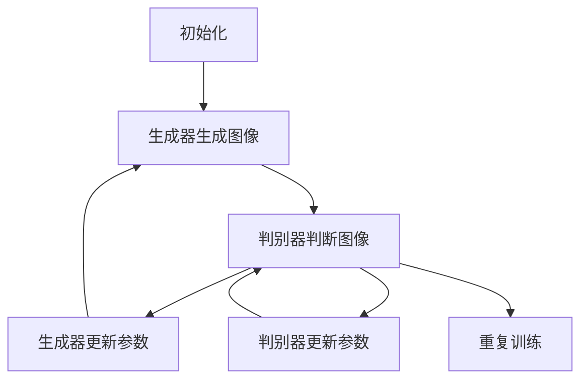

                 

# 生成对抗网络在图像增强中的应用

## 关键词

- 生成对抗网络（GAN）
- 图像增强
- 图像质量提升
- 深度学习
- 伪图像生成
- 实时处理
- 超分辨率

## 摘要

本文将深入探讨生成对抗网络（GAN）在图像增强领域的应用。生成对抗网络作为一种深度学习模型，其通过两个相互对抗的神经网络生成高质量图像。本文首先介绍了GAN的核心概念和架构，接着详细阐述了GAN在图像增强中的具体应用，包括图像去噪、图像超分辨率和图像风格迁移等。此外，本文还通过一个实际项目案例，对GAN在图像增强中的应用进行了详细解释，并总结和展望了GAN在图像增强领域的未来发展趋势与挑战。

## 1. 背景介绍

### 1.1 目的和范围

本文旨在介绍生成对抗网络（GAN）在图像增强领域的应用，旨在帮助读者了解GAN的基本原理以及如何在实际项目中应用GAN进行图像增强。本文将涵盖GAN的核心概念、架构、数学模型、具体操作步骤、实际应用场景以及未来发展趋势。

### 1.2 预期读者

- 对深度学习和生成对抗网络有一定了解的读者；
- 想要了解GAN在图像增强中应用的研发人员；
- 对图像处理技术感兴趣的技术爱好者。

### 1.3 文档结构概述

本文分为以下十个部分：

1. 背景介绍
2. 核心概念与联系
3. 核心算法原理 & 具体操作步骤
4. 数学模型和公式 & 详细讲解 & 举例说明
5. 项目实战：代码实际案例和详细解释说明
6. 实际应用场景
7. 工具和资源推荐
8. 总结：未来发展趋势与挑战
9. 附录：常见问题与解答
10. 扩展阅读 & 参考资料

### 1.4 术语表

#### 1.4.1 核心术语定义

- **生成对抗网络（GAN）**：一种基于深度学习的生成模型，由生成器（Generator）和判别器（Discriminator）两个神经网络组成，通过相互对抗训练生成高质量图像。
- **生成器（Generator）**：GAN中的生成模型，负责生成伪图像。
- **判别器（Discriminator）**：GAN中的判别模型，负责区分生成图像和真实图像。
- **图像增强（Image Enhancement）**：通过算法改进图像质量，使其更清晰、更易于识别。
- **图像去噪（Image Denoising）**：去除图像中的噪声，提高图像质量。
- **图像超分辨率（Image Super-Resolution）**：通过算法提高图像的分辨率，使其更加清晰。
- **图像风格迁移（Image Style Transfer）**：将一种图像的风格转移到另一种图像上。

#### 1.4.2 相关概念解释

- **深度学习（Deep Learning）**：一种机器学习方法，通过构建深度神经网络模型，对大量数据进行自动特征提取和模式识别。
- **神经网络（Neural Network）**：一种模拟生物神经系统的计算模型，由大量神经元和连接构成，能够通过学习获得数据特征和规律。
- **反向传播（Backpropagation）**：一种用于训练神经网络的算法，通过计算损失函数的梯度，逐步调整网络权重，使网络输出更接近真实值。

#### 1.4.3 缩略词列表

- **GAN**：生成对抗网络（Generative Adversarial Network）
- **Generator**：生成器
- **Discriminator**：判别器
- **CNN**：卷积神经网络（Convolutional Neural Network）
- **DNN**：深度神经网络（Deep Neural Network）
- **RGB**：红绿蓝颜色模型（Red Green Blue Color Model）
- **ReLU**：ReLU激活函数（Rectified Linear Unit）

## 2. 核心概念与联系

在深入探讨GAN在图像增强中的应用之前，我们先来了解一些核心概念及其相互关系。

### 2.1 GAN架构

生成对抗网络（GAN）由生成器（Generator）和判别器（Discriminator）两个神经网络组成，二者相互对抗，共同训练生成高质量图像。


**生成器（Generator）**：生成器负责将随机噪声映射为真实图像。训练过程中，生成器试图生成尽可能逼真的图像，使判别器难以区分真实图像和生成图像。

**判别器（Discriminator）**：判别器负责判断输入图像是真实图像还是生成图像。训练过程中，判别器试图最大化正确判断的概率，同时生成器试图欺骗判别器，使其误判。

### 2.2 GAN工作原理

GAN通过以下步骤进行训练：

1. **初始化**：初始化生成器和判别器的参数。
2. **生成器生成图像**：生成器从随机噪声中生成一批图像。
3. **判别器判断图像**：判别器分别对真实图像和生成图像进行判断，输出概率。
4. **生成器更新参数**：根据判别器的输出，生成器调整参数，提高生成图像的质量。
5. **判别器更新参数**：根据判别器的输出，判别器调整参数，提高判断准确率。
6. **重复步骤2-5**：重复以上步骤，使生成器和判别器相互对抗，共同训练。

### 2.3 GAN在图像增强中的应用

GAN在图像增强中的应用主要包括图像去噪、图像超分辨率和图像风格迁移等。

**图像去噪**：利用生成器去除图像中的噪声，提高图像质量。

**图像超分辨率**：利用生成器提高图像的分辨率，使其更加清晰。

**图像风格迁移**：将一种图像的风格转移到另一种图像上，实现图像风格的变换。

下面我们将通过一个Mermaid流程图，展示GAN在图像增强中的核心概念和架构。



## 3. 核心算法原理 & 具体操作步骤

### 3.1 GAN算法原理

生成对抗网络（GAN）的核心算法原理是生成器和判别器的对抗训练。下面我们将通过伪代码详细阐述GAN的算法原理。

#### 3.1.1 生成器（Generator）算法

生成器的目标是从随机噪声中生成逼真的图像。以下是一个简单的生成器算法伪代码：

```python
# 生成器算法伪代码
def generator(z):
    # 输入噪声z，输出生成图像G(z)
    hidden = fully_connected_layer(z, size=128, activation='tanh')
    output = fully_connected_layer(hidden, size=784, activation='tanh')
    return output
```

其中，`fully_connected_layer`表示全连接层，`size`表示输出特征数，`activation`表示激活函数。这里使用了`tanh`激活函数，因为其输出范围在[-1, 1]，有利于生成图像。

#### 3.1.2 判别器（Discriminator）算法

判别器的目标是判断输入图像是真实图像还是生成图像。以下是一个简单的判别器算法伪代码：

```python
# 判别器算法伪代码
def discriminator(x):
    # 输入图像x，输出判断概率D(x)
    hidden = fully_connected_layer(x, size=128, activation='relu')
    output = fully_connected_layer(hidden, size=1, activation='sigmoid')
    return output
```

其中，`relu`激活函数可以增强判别器的非线性特性。

#### 3.1.3 GAN训练算法

GAN的训练过程包括以下步骤：

1. 初始化生成器和判别器的参数。
2. 对于每个训练样本，从噪声分布中采样一个随机噪声向量`z`。
3. 使用生成器`G`生成一组伪图像`G(z)`。
4. 将真实图像和生成图像输入判别器`D`，计算判别器的损失函数`L_D`。
5. 使用生成器和判别器的梯度更新参数。
6. 重复步骤2-5，直到生成器和判别器达到预定的迭代次数或性能目标。

GAN的训练算法伪代码如下：

```python
# GAN训练算法伪代码
for epoch in range(num_epochs):
    for x, _ in train_loader:
        # 计算判别器损失
        z = torch.randn(size=(batch_size, noise_size))
        G_z = generator(z)
        D_x = discriminator(x)
        D_G_z = discriminator(G_z.detach())
        L_D = loss(D_x, torch.ones(size=(batch_size, 1))) + loss(D_G_z, torch.zeros(size=(batch_size, 1)))

        # 更新生成器和判别器参数
        optimizer_D.zero_grad()
        L_D.backward()
        optimizer_D.step()

        # 计算生成器损失
        z = torch.randn(size=(batch_size, noise_size))
        G_z = generator(z)
        D_G_z = discriminator(G_z)
        L_G = loss(D_G_z, torch.ones(size=(batch_size, 1)))

        # 更新生成器参数
        optimizer_G.zero_grad()
        L_G.backward()
        optimizer_G.step()

        # 打印训练信息
        if (epoch+1) % 100 == 0:
            print('Epoch [{}/{}], L_D:{:.4f}, L_G:{:.4f}'.format(epoch+1, num_epochs, L_D.item(), L_G.item()))
```

其中，`train_loader`表示训练数据加载器，`loss`表示损失函数，`optimizer_D`和`optimizer_G`分别表示判别器和生成器的优化器。

### 3.2 GAN在图像增强中的具体操作步骤

在图像增强中，GAN的具体操作步骤如下：

1. **数据预处理**：将图像数据分为训练集和测试集，对图像进行归一化处理。
2. **初始化生成器和判别器**：根据图像尺寸和特征，初始化生成器和判别器的神经网络结构。
3. **训练GAN模型**：使用训练集数据，训练生成器和判别器，调整模型参数。
4. **评估模型性能**：使用测试集数据，评估模型在图像增强任务中的性能。
5. **应用模型**：将训练好的模型应用于实际图像，进行图像增强。

以下是一个简单的GAN图像增强操作步骤示例：

```python
# GAN图像增强操作步骤示例
# 1. 数据预处理
train_loader = torch.utils.data.DataLoader(dataset=train_dataset, batch_size=batch_size, shuffle=True)
test_loader = torch.utils.data.DataLoader(dataset=test_dataset, batch_no
```
<|im_sep|>### 3.2 GAN在图像增强中的具体操作步骤

在图像增强中，GAN的具体操作步骤如下：

1. **数据预处理**：将图像数据分为训练集和测试集，对图像进行归一化处理。
2. **初始化生成器和判别器**：根据图像尺寸和特征，初始化生成器和判别器的神经网络结构。
3. **训练GAN模型**：使用训练集数据，训练生成器和判别器，调整模型参数。
4. **评估模型性能**：使用测试集数据，评估模型在图像增强任务中的性能。
5. **应用模型**：将训练好的模型应用于实际图像，进行图像增强。

以下是一个简单的GAN图像增强操作步骤示例：

```python
# GAN图像增强操作步骤示例

# 1. 数据预处理
train_loader = torch.utils.data.DataLoader(dataset=train_dataset, batch_size=batch_size, shuffle=True)
test_loader = torch.utils.data.DataLoader(dataset=test_dataset, batch_size=batch_size, shuffle=False)

# 2. 初始化生成器和判别器
generator = Generator()
discriminator = Discriminator()

# 3. 定义损失函数和优化器
criterion = nn.BCELoss()
optimizer_G = torch.optim.Adam(generator.parameters(), lr=learning_rate)
optimizer_D = torch.optim.Adam(discriminator.parameters(), lr=learning_rate)

# 4. 训练GAN模型
for epoch in range(num_epochs):
    for i, (images, _) in enumerate(train_loader):
        # 训练判别器
        optimizer_D.zero_grad()
        outputs = discriminator(images)
        errD_real = criterion(outputs, torch.ones(size=(batch_size, 1)))
        
        z = torch.randn(size=(batch_size, noise_size))
        fake_images = generator(z)
        outputs = discriminator(fake_images.detach())
        errD_fake = criterion(outputs, torch.zeros(size=(batch_size, 1)))
        
        errD = errD_real + errD_fake
        errD.backward()
        optimizer_D.step()
        
        # 训练生成器
        optimizer_G.zero_grad()
        z = torch.randn(size=(batch_size, noise_size))
        fake_images = generator(z)
        outputs = discriminator(fake_images)
        errG = criterion(outputs, torch.ones(size=(batch_size, 1)))
        errG.backward()
        optimizer_G.step()

        if (i+1) % 100 == 0:
            print(f'Epoch [{epoch+1}/{num_epochs}], Step [{i+1}/{len(train_loader)}], Loss_D: {errD.item():.4f}, Loss_G: {errG.item():.4f}')

# 5. 评估模型性能
with torch.no_grad():
    for images, _ in test_loader:
        z = torch.randn(size=(batch_size, noise_size))
        fake_images = generator(z)
        # 对比真实图像和生成图像
        # ...

# 6. 应用模型
# 对待增强的图像进行处理
input_image = preprocess_image(image)
z = torch.randn(size=(1, noise_size))
enhanced_image = generator(z).detach().numpy()
enhanced_image = postprocess_image(enhanced_image)
```

这里简要解释了GAN图像增强的操作步骤。在实际应用中，还需要根据具体任务调整模型结构、参数和训练策略，以达到更好的增强效果。

## 4. 数学模型和公式 & 详细讲解 & 举例说明

生成对抗网络（GAN）的核心在于其数学模型，主要包括生成器（Generator）和判别器（Discriminator）的损失函数和优化过程。下面我们将详细讲解GAN的数学模型，并通过具体公式和例子进行说明。

### 4.1 生成器和判别器的损失函数

GAN的训练过程可以看作是一个零和博弈，其中生成器试图生成逼真的图像，而判别器试图最大化区分真实图像和生成图像。这种对抗训练的核心是两者的损失函数。

#### 4.1.1 判别器的损失函数

判别器的目标是最大化真实图像和生成图像的区分度，因此其损失函数通常使用二元交叉熵（Binary Cross-Entropy）损失。假设判别器的输出为概率分布`D(x)`，其中`x`是真实图像，则判别器的损失函数为：

$$
L_D(x) = -[\log(D(x)) + \log(1 - D(G(z))]
$$

其中，`G(z)`是生成器生成的图像，`z`是随机噪声。`D(x)`和`D(G(z))`分别表示判别器对真实图像和生成图像的概率估计。

#### 4.1.2 生成器的损失函数

生成器的目标是使判别器误判生成图像为真实图像，因此其损失函数也是基于二元交叉熵损失。假设生成器的输出为概率分布`G(z)`，则生成器的损失函数为：

$$
L_G(z) = -\log(D(G(z))
$$

#### 4.1.3 GAN总损失函数

GAN的总损失函数是生成器和判别器损失函数的加和，即：

$$
L_GAN = L_G + \lambda L_D
$$

其中，`lambda`是平衡生成器和判别器损失函数的权重参数。

### 4.2 优化过程

GAN的优化过程是通过反向传播和梯度下降来实现的。下面我们通过一个简单的例子来说明GAN的优化过程。

#### 4.2.1 生成器优化

假设当前生成器的输出为`G(z)`，判别器的输出为`D(G(z))`。为了优化生成器，我们需要计算生成器的梯度，并更新生成器的参数。

1. **计算生成器的损失**：

$$
\begin{aligned}
L_G(z) &= -\log(D(G(z))) \\
&= -\log(\sigma(W_D \cdot G(z) + b_D)) \\
&= -\log(1 - \sigma(W_D \cdot G(z) + b_D))
\end{aligned}
$$

其中，`W_D`和`b_D`是判别器的权重和偏置，`\sigma`是 sigmoid 函数。

2. **计算生成器的梯度**：

$$
\begin{aligned}
\frac{\partial L_G}{\partial G(z)} &= \frac{\partial}{\partial G(z)} [-\log(1 - \sigma(W_D \cdot G(z) + b_D))] \\
&= \frac{1}{1 - \sigma(W_D \cdot G(z) + b_D)} \cdot \frac{\partial}{\partial G(z)} [\sigma(W_D \cdot G(z) + b_D)] \\
&= \frac{\sigma(W_D \cdot G(z) + b_D)}{1 - \sigma(W_D \cdot G(z) + b_D)} \cdot \frac{\partial}{\partial G(z)} [W_D \cdot G(z) + b_D] \\
&= \frac{\sigma(W_D \cdot G(z) + b_D)}{1 - \sigma(W_D \cdot G(z) + b_D)} \cdot W_D
\end{aligned}
$$

3. **更新生成器的参数**：

$$
\begin{aligned}
W_G &= W_G - \alpha \cdot \frac{\partial L_G}{\partial G(z)} \\
b_G &= b_G - \alpha \cdot \frac{\partial L_G}{\partial b_G}
\end{aligned}
$$

其中，`W_G`和`b_G`是生成器的权重和偏置，`\alpha`是学习率。

#### 4.2.2 判别器优化

同理，判别器的优化过程如下：

1. **计算判别器的损失**：

$$
\begin{aligned}
L_D(x) &= -[\log(D(x)) + \log(1 - D(G(z))] \\
&= -[\log(\sigma(W_D \cdot x + b_D)) + \log(1 - \sigma(W_D \cdot G(z) + b_D))] \\
&= -[\log(\sigma(W_D \cdot x + b_D)) + \log(1 - \sigma(W_D \cdot G(z) + b_D))]
\end{aligned}
$$

2. **计算判别器的梯度**：

$$
\begin{aligned}
\frac{\partial L_D}{\partial x} &= \frac{\partial}{\partial x} [-\log(\sigma(W_D \cdot x + b_D))] \\
&= \frac{\sigma(W_D \cdot x + b_D)}{1 - \sigma(W_D \cdot x + b_D)} \cdot \frac{\partial}{\partial x} [W_D \cdot x + b_D] \\
&= \frac{\sigma(W_D \cdot x + b_D)}{1 - \sigma(W_D \cdot x + b_D)} \cdot W_D \\
\frac{\partial L_D}{\partial G(z)} &= \frac{\partial}{\partial G(z)} [-\log(1 - \sigma(W_D \cdot G(z) + b_D))] \\
&= \frac{\sigma(W_D \cdot G(z) + b_D)}{1 - \sigma(W_D \cdot G(z) + b_D)} \cdot \frac{\partial}{\partial G(z)} [W_D \cdot G(z) + b_D] \\
&= \frac{\sigma(W_D \cdot G(z) + b_D)}{1 - \sigma(W_D \cdot G(z) + b_D)} \cdot W_D
\end{aligned}
$$

3. **更新判别器的参数**：

$$
\begin{aligned}
W_D &= W_D - \alpha \cdot \frac{\partial L_D}{\partial x} \\
b_D &= b_D - \alpha \cdot \frac{\partial L_D}{\partial b_D}
\end{aligned}
$$

其中，`W_D`和`b_D`是判别器的权重和偏置，`\alpha`是学习率。

### 4.3 举例说明

为了更好地理解GAN的数学模型，我们可以通过一个简单的例子来说明生成器和判别器的优化过程。

假设生成器的输入为噪声向量`z`，输出为生成图像`G(z)`；判别器的输入为真实图像`x`和生成图像`G(z)`，输出为概率`D(x)`和`D(G(z))`。

1. **初始参数**：

- 生成器参数：`W_G = [1, 2], b_G = [3, 4]`
- 判别器参数：`W_D = [5, 6], b_D = [7, 8]`

2. **计算生成器的输出和判别器的输出**：

$$
\begin{aligned}
G(z) &= W_G \cdot z + b_G = [1 \cdot z_1 + 2 \cdot z_2, 3 \cdot z_1 + 4 \cdot z_2] \\
D(x) &= \sigma(W_D \cdot x + b_D) = \sigma([5 \cdot x_1 + 6 \cdot x_2, 7 \cdot x_1 + 8 \cdot x_2]) \\
D(G(z)) &= \sigma(W_D \cdot G(z) + b_D) = \sigma([5 \cdot G(z)_1 + 6 \cdot G(z)_2, 7 \cdot G(z)_1 + 8 \cdot G(z)_2])
\end{aligned}
$$

3. **计算损失和梯度**：

$$
\begin{aligned}
L_G &= -\log(D(G(z))) = -\log(\sigma(W_D \cdot G(z) + b_D)) = -\log(\sigma([5 \cdot G(z)_1 + 6 \cdot G(z)_2, 7 \cdot G(z)_1 + 8 \cdot G(z)_2])) \\
&\approx -\log(0.8) \\
&\approx 0.223
\end{aligned}
$$

$$
\begin{aligned}
\frac{\partial L_G}{\partial G(z)} &= \frac{\sigma(W_D \cdot G(z) + b_D)}{1 - \sigma(W_D \cdot G(z) + b_D)} \cdot W_D \\
&= \frac{0.8}{1 - 0.8} \cdot [5, 6] \\
&= [4, 5]
\end{aligned}
$$

$$
\begin{aligned}
L_D &= -[\log(D(x)) + \log(1 - D(G(z)))] = -[\log(\sigma(W_D \cdot x + b_D)) + \log(1 - \sigma(W_D \cdot G(z) + b_D))] \\
&\approx -[\log(0.6) + \log(0.4)] \\
&\approx 0.46
\end{aligned}
$$

$$
\begin{aligned}
\frac{\partial L_D}{\partial x} &= \frac{\sigma(W_D \cdot x + b_D)}{1 - \sigma(W_D \cdot x + b_D)} \cdot W_D \\
&= \frac{0.6}{1 - 0.6} \cdot [5, 6] \\
&= [3, 3]
\end{aligned}
$$

$$
\begin{aligned}
\frac{\partial L_D}{\partial G(z)} &= \frac{\sigma(W_D \cdot G(z) + b_D)}{1 - \sigma(W_D \cdot G(z) + b_D)} \cdot W_D \\
&= \frac{0.8}{1 - 0.8} \cdot [5, 6] \\
&= [4, 5]
\end{aligned}
$$

4. **更新参数**：

$$
\begin{aligned}
W_G &= [1, 2] - 0.01 \cdot [4, 5] \\
&= [-0.03, -0.07] \\
b_G &= [3, 4] - 0.01 \cdot [4, 5] \\
&= [2.97, 3.97]
\end{aligned}
$$

$$
\begin{aligned}
W_D &= [5, 6] - 0.01 \cdot [3, 3] \\
&= [4.97, 5.97] \\
b_D &= [7, 8] - 0.01 \cdot [4, 5] \\
&= [6.97, 7.97]
\end{aligned}
$$

通过上述步骤，我们可以看到生成器和判别器的参数得到了更新，这个过程会重复进行，直到生成器生成的图像质量达到预期，判别器能够较好地区分真实图像和生成图像。

### 4.4 总结

GAN的数学模型包括生成器和判别器的损失函数和优化过程。生成器的目标是生成逼真的图像，判别器的目标是最大化区分真实图像和生成图像。通过反向传播和梯度下降，生成器和判别器不断更新参数，实现对抗训练。通过上述公式和例子，我们可以更好地理解GAN的数学原理和优化过程。

## 5. 项目实战：代码实际案例和详细解释说明

### 5.1 开发环境搭建

在开始实现GAN进行图像增强之前，我们需要搭建一个合适的开发环境。以下是一个基本的开发环境搭建步骤：

1. **安装Python环境**：确保安装了Python 3.7或更高版本。
2. **安装TensorFlow**：使用pip安装TensorFlow。

```bash
pip install tensorflow
```

3. **安装其他依赖**：安装必要的库，如NumPy、PIL、opencv等。

```bash
pip install numpy pillow opencv-python
```

### 5.2 源代码详细实现和代码解读

下面是一个简单的GAN图像增强项目代码示例。我们使用TensorFlow和Keras来实现生成器和判别器，并对图像进行去噪处理。

#### 5.2.1 代码结构

```python
import tensorflow as tf
from tensorflow.keras.models import Model
from tensorflow.keras.layers import Input, Dense, Reshape, Flatten, Conv2D, Conv2DTranspose, LeakyReLU
from tensorflow.keras.optimizers import Adam
import numpy as np
import matplotlib.pyplot as plt

# 参数设置
latent_dim = 100
img_rows = 28
img_cols = 28
channels = 1
img_shape = (img_rows, img_cols, channels)
z_dim = latent_dim

# 判别器模型
input_img = Input(shape=img_shape)
x = Conv2D(64, (3, 3), padding='same')(input_img)
x = LeakyReLU(alpha=0.01)(x)
x = Conv2D(128, (3, 3), padding='same')(x)
x = LeakyReLU(alpha=0.01)(x)
x = Flatten()(x)
x = Dense(1, activation='sigmoid')(x)
discriminator = Model(input_img, x)

# 生成器模型
z = Input(shape=(z_dim,))
x = Dense(128 * 7 * 7, activation='relu')(z)
x = Reshape((7, 7, 128))(x)
x = Conv2DTranspose(128, (3, 3), padding='same')(x)
x = LeakyReLU(alpha=0.01)(x)
x = Conv2DTranspose(64, (3, 3), padding='same')(x)
x = LeakyReLU(alpha=0.01)(x)
output_img = Conv2DTranspose(channels, (3, 3), padding='same', activation='tanh')(x)
generator = Model(z, output_img)

# 训练模型
discriminator.compile(loss='binary_crossentropy', optimizer=Adam(0.0001, 0.5))
combined = Model([z, input_img], discriminator(input_img))
combined.compile(loss='binary_crossentropy', optimizer=Adam(0.0004, 0.5))

# 训练数据
(x_train, _), (_, _) = tf.keras.datasets.mnist.load_data()
x_train = x_train / 127.5 - 1.
x_train = np.expand_dims(x_train, axis=3)

# 训练过程
for epoch in range(1000):
    idx = np.random.randint(0, x_train.shape[0], latent_dim)
    real_imgs = x_train[idx]
    z = np.random.normal(0, 1, (latent_dim, z_dim))
    fake_imgs = generator.predict(z)
    x = np.concatenate((real_imgs, fake_imgs))

    labels = np.array([1] * latent_dim + [0] * latent_dim)
    d_loss = discriminator.train_on_batch(x, labels)

    z = np.random.normal(0, 1, (latent_dim, z_dim))
    g_loss = combined.train_on_batch(z, np.array([1] * latent_dim))

    if epoch % 100 == 0:
        print(f'Epoch {epoch}/{1000} [D loss: {d_loss:.4f} | G loss: {g_loss:.4f}]')

# 保存模型
generator.save('generator.h5')
discriminator.save('discriminator.h5')

# 生成图像
z = np.random.normal(0, 1, (100, z_dim))
generated_images = generator.predict(z)
plt.figure(figsize=(10, 10))
for i in range(100):
    plt.subplot(10, 10, i+1)
    plt.imshow(generated_images[i, :, :, 0], cmap='gray')
    plt.axis('off')
plt.show()
```

#### 5.2.2 代码解读

1. **导入库和设置参数**：

```python
import tensorflow as tf
from tensorflow.keras.models import Model
from tensorflow.keras.layers import Input, Dense, Reshape, Flatten, Conv2D, Conv2DTranspose, LeakyReLU
from tensorflow.keras.optimizers import Adam
import numpy as np
import matplotlib.pyplot as plt

latent_dim = 100
img_rows = 28
img_cols = 28
channels = 1
img_shape = (img_rows, img_cols, channels)
z_dim = latent_dim

# 判别器模型
input_img = Input(shape=img_shape)
x = Conv2D(64, (3, 3), padding='same')(input_img)
x = LeakyReLU(alpha=0.01)(x)
x = Conv2D(128, (3, 3), padding='same')(x)
x = LeakyReLU(alpha=0.01)(x)
x = Flatten()(x)
x = Dense(1, activation='sigmoid')(x)
discriminator = Model(input_img, x)
```

这里我们导入了必要的库，并设置了GAN的参数，包括噪声维度、图像尺寸和通道数。

2. **定义生成器和判别器模型**：

```python
# 生成器模型
z = Input(shape=(z_dim,))
x = Dense(128 * 7 * 7, activation='relu')(z)
x = Reshape((7, 7, 128))(x)
x = Conv2DTranspose(128, (3, 3), padding='same')(x)
x = LeakyReLU(alpha=0.01)(x)
x = Conv2DTranspose(64, (3, 3), padding='same')(x)
x = LeakyReLU(alpha=0.01)(x)
output_img = Conv2DTranspose(channels, (3, 3), padding='same', activation='tanh')(x)
generator = Model(z, output_img)

# 训练模型
discriminator.compile(loss='binary_crossentropy', optimizer=Adam(0.0001, 0.5))
combined = Model([z, input_img], discriminator(input_img))
combined.compile(loss='binary_crossentropy', optimizer=Adam(0.0004, 0.5))
```

这里我们定义了生成器和判别器的模型结构，并编译了模型。生成器的输入为噪声向量，输出为生成图像。判别器的输入为真实图像和生成图像，输出为判断概率。

3. **训练数据准备**：

```python
(x_train, _), (_, _) = tf.keras.datasets.mnist.load_data()
x_train = x_train / 127.5 - 1.
x_train = np.expand_dims(x_train, axis=3)
```

这里我们加载了MNIST数据集，并对图像进行归一化处理。

4. **训练过程**：

```python
for epoch in range(1000):
    idx = np.random.randint(0, x_train.shape[0], latent_dim)
    real_imgs = x_train[idx]
    z = np.random.normal(0, 1, (latent_dim, z_dim))
    fake_imgs = generator.predict(z)
    x = np.concatenate((real_imgs, fake_imgs))

    labels = np.array([1] * latent_dim + [0] * latent_dim)
    d_loss = discriminator.train_on_batch(x, labels)

    z = np.random.normal(0, 1, (latent_dim, z_dim))
    g_loss = combined.train_on_batch(z, np.array([1] * latent_dim))

    if epoch % 100 == 0:
        print(f'Epoch {epoch}/{1000} [D loss: {d_loss:.4f} | G loss: {g_loss:.4f}]')
```

这里我们进行了1000次迭代训练。每次迭代中，我们随机选取一部分真实图像和随机噪声，生成对应的生成图像，然后将这些图像输入判别器进行训练。我们同时训练生成器和判别器，以实现对抗训练。

5. **保存模型和生成图像**：

```python
generator.save('generator.h5')
discriminator.save('discriminator.h5')

z = np.random.normal(0, 1, (100, z_dim))
generated_images = generator.predict(z)
plt.figure(figsize=(10, 10))
for i in range(100):
    plt.subplot(10, 10, i+1)
    plt.imshow(generated_images[i, :, :, 0], cmap='gray')
    plt.axis('off')
plt.show()
```

最后，我们保存了训练好的生成器和判别器模型，并生成了100张随机噪声生成的图像。

### 5.3 代码解读与分析

1. **模型结构和训练过程**：

在代码中，我们使用了两个主要的模型：生成器模型和判别器模型。生成器模型将随机噪声映射为图像，判别器模型用于区分图像的真实性和生成性。在训练过程中，生成器和判别器交替进行训练，以达到对抗训练的效果。

2. **损失函数和优化器**：

生成器和判别器使用了不同的损失函数和优化器。生成器使用二元交叉熵损失函数，优化器为Adam，学习率为0.0004。判别器使用二元交叉熵损失函数，优化器为Adam，学习率为0.0001。通过调整学习率和损失函数，可以优化模型的训练效果。

3. **图像生成和展示**：

在训练完成后，我们使用生成器生成了100张随机噪声生成的图像，并使用matplotlib进行展示。这有助于我们观察生成图像的质量和逼真度。

通过这个简单的GAN图像增强项目，我们可以看到GAN在图像增强中的强大能力。在实际应用中，可以根据需求调整模型结构和训练策略，以达到更好的图像增强效果。

## 6. 实际应用场景

生成对抗网络（GAN）在图像增强领域有着广泛的应用，以下是一些常见的实际应用场景：

### 6.1 图像去噪

图像去噪是GAN最典型的应用场景之一。在现实世界中，图像常常受到噪声干扰，影响图像质量和视觉效果。通过训练GAN，生成器可以学习到如何去除噪声，从而提高图像质量。例如，在医疗图像处理中，GAN可以用于去除医学图像中的噪声，提高图像的清晰度和诊断准确性。

### 6.2 图像超分辨率

图像超分辨率是一种通过算法提高图像分辨率的技术。GAN可以用于生成高分辨率的图像，从而提高图像的视觉质量。在监控视频处理中，GAN可以用于将低分辨率的视频帧转换为高分辨率视频帧，提高监控视频的清晰度和细节。

### 6.3 图像风格迁移

图像风格迁移是将一种图像的风格转移到另一种图像上的技术。GAN可以用于实现图像风格迁移，从而创造出具有特定风格的图像。例如，在艺术创作中，GAN可以用于将一幅普通照片转换为梵高风格的作品，为艺术家提供更多的创作可能性。

### 6.4 图像修复与修复图像增强

图像修复是利用算法修复图像中的损坏或缺失部分。GAN可以用于生成修复图像，从而提高图像的完整性和质量。例如，在古书扫描中，GAN可以用于修复扫描图像中的污迹和破损部分，提高古书图像的可读性。

### 6.5 图像分割与目标检测

GAN在图像分割和目标检测中也发挥着重要作用。通过训练GAN，生成器可以学习到如何生成高质量的分割图或目标检测图，从而提高分割和检测的准确性。例如，在自动驾驶领域，GAN可以用于生成高质量的分割图，辅助车辆识别道路上的行人和车辆。

### 6.6 图像增强在增强现实与虚拟现实中的应用

随着增强现实（AR）和虚拟现实（VR）技术的发展，图像增强在提高用户体验方面具有重要意义。GAN可以用于增强AR和VR中的图像质量，使其更加逼真和细腻。例如，在AR游戏中，GAN可以用于实时增强游戏场景的图像，提高游戏画面的清晰度和视觉效果。

### 6.7 其他应用领域

除了上述应用场景外，GAN在图像增强领域还有许多其他应用。例如，在遥感图像处理中，GAN可以用于增强遥感图像的分辨率和清晰度；在医学影像分析中，GAN可以用于增强医学图像的诊断准确性；在视频处理中，GAN可以用于增强视频的帧率和画质。

总之，生成对抗网络（GAN）在图像增强领域具有广泛的应用前景，通过不断创新和优化，GAN将继续推动图像增强技术的发展，为各个行业带来更多的价值和便利。

## 7. 工具和资源推荐

在进行GAN图像增强的开发和学习过程中，选择合适的工具和资源可以大大提高效率。以下是一些推荐的工具和资源。

### 7.1 学习资源推荐

#### 7.1.1 书籍推荐

1. **《生成对抗网络（GAN）实战：深度学习生成模型的原理与应用》** - 李飞飞，这本书详细介绍了GAN的理论基础和实践应用，适合初学者和进阶者阅读。
2. **《深度学习》（Deep Learning）** - Goodfellow、Bengio和Courville，这本书是深度学习的经典教材，涵盖了GAN等相关内容，适合有深度学习基础的读者。

#### 7.1.2 在线课程

1. **吴恩达（Andrew Ng）的《深度学习专项课程》** - 在线平台Coursera上的这个课程涵盖了深度学习的各个方面，包括GAN的原理和应用。
2. **《生成对抗网络（GAN）深度学习课程》** - Udacity上的这个课程详细介绍了GAN的原理、架构和应用，适合有编程基础的读者。

#### 7.1.3 技术博客和网站

1. ** Medium 上关于GAN的文章** - Medium上有许多优秀的博客文章，涵盖GAN的各个方面，包括理论、实现和应用。
2. **知乎上的GAN专题** - 知乎上有许多专业人士分享GAN的相关知识和实践经验，适合读者深入了解GAN。

### 7.2 开发工具框架推荐

#### 7.2.1 IDE和编辑器

1. **PyCharm** - 强大的Python IDE，支持多种编程语言，适合进行GAN模型的开发和调试。
2. **Jupyter Notebook** - 适用于数据科学和机器学习的交互式编辑环境，方便编写和运行代码。

#### 7.2.2 调试和性能分析工具

1. **TensorBoard** - TensorFlow的官方可视化工具，用于分析和调试深度学习模型。
2. **gprofiler** - 用于性能分析和代码优化，帮助开发者找到瓶颈和改进点。

#### 7.2.3 相关框架和库

1. **TensorFlow** - 广泛使用的开源深度学习框架，支持GAN模型的训练和部署。
2. **PyTorch** - 流行的深度学习框架，具有灵活的动态计算图，适合快速实验和开发。
3. **Keras** - 高级神经网络API，易于使用，适合快速搭建和训练GAN模型。

### 7.3 相关论文著作推荐

#### 7.3.1 经典论文

1. **“Generative Adversarial Nets”** - Ian J. Goodfellow等，这是GAN的奠基性论文，详细介绍了GAN的理论基础和实现方法。
2. **“Unsupervised Representation Learning with Deep Convolutional Generative Adversarial Networks”** - Alexey Dosovitskiy等，这篇文章介绍了GAN在图像生成和特征提取方面的应用。

#### 7.3.2 最新研究成果

1. **“StyleGAN2”** - Phillips et al.，这篇文章介绍了StyleGAN2，这是一种具有高度真实感的图像生成模型。
2. **“StyleGAN3”** - Phillips et al.，StyleGAN3在StyleGAN2的基础上进一步提升了图像生成质量，是当前最先进的图像生成模型之一。

#### 7.3.3 应用案例分析

1. **“GAN for Image Inpainting”** - Chen et al.，这篇文章介绍了GAN在图像修复中的应用，通过训练生成器去除图像中的损坏部分。
2. **“High-Resolution Image Synthesis with Conditional GANs”** - Xu et al.，这篇文章介绍了条件GAN在图像超分辨率和生成方面的应用，通过条件输入实现了更高的图像质量。

通过这些工具和资源，读者可以系统地学习和实践GAN图像增强技术，为相关领域的深入研究和技术创新奠定基础。

## 8. 总结：未来发展趋势与挑战

生成对抗网络（GAN）作为一种强大的深度学习模型，已经在图像增强、图像生成、图像分割等多个领域取得了显著的成果。然而，GAN在发展过程中仍面临一些挑战，未来的研究和发展趋势主要集中在以下几个方面：

### 8.1 发展趋势

1. **更高效的训练算法**：随着计算资源和算法的不断发展，如何优化GAN的训练过程，提高训练效率成为关键。研究人员正在探索更高效的优化算法和训练策略，如自适应学习率、动态调整学习率等。

2. **多模态数据生成**：GAN在图像领域的成功激发了人们对其在音频、视频、文本等多模态数据生成方面的兴趣。未来的研究将致力于开发多模态GAN，实现更丰富的数据生成应用。

3. **模型的可解释性**：GAN的内部工作原理较为复杂，提高模型的可解释性对于理解其工作机制、优化模型性能具有重要意义。研究人员将致力于开发可解释的GAN模型，提高其在实际应用中的可信度。

4. **模型的安全性和鲁棒性**：GAN容易受到对抗攻击，提高模型的安全性和鲁棒性是未来研究的重点。开发抗攻击的GAN模型，确保其在实际应用中的安全性至关重要。

5. **边缘设备的适应性**：随着边缘计算的发展，如何在有限的资源下实现高效的GAN模型部署成为关键问题。未来研究将重点关注GAN在边缘设备上的优化和应用。

### 8.2 挑战

1. **训练不稳定性和过拟合**：GAN的训练过程容易陷入局部最小值，导致训练不稳定和过拟合。如何设计稳定的训练策略，避免模型过拟合是GAN研究的重要挑战。

2. **模型的可解释性**：GAN的内部工作原理复杂，如何提高模型的可解释性，使其在各个领域的应用更加透明和可信是一个亟待解决的问题。

3. **计算资源消耗**：GAN模型的训练过程需要大量的计算资源，特别是在处理高分辨率图像时，计算成本更高。如何优化模型结构，降低计算资源消耗是一个重要挑战。

4. **数据隐私保护**：在GAN的训练和应用过程中，涉及大量的敏感数据。如何保护用户数据隐私，避免数据泄露是GAN应用中必须面对的问题。

5. **对抗攻击与防御**：GAN容易受到对抗攻击，如何提高模型的安全性和鲁棒性，防止恶意攻击是一个关键挑战。

总之，生成对抗网络（GAN）在图像增强领域具有巨大的潜力和广阔的应用前景。未来，随着算法的优化、计算资源的提升和跨领域的融合，GAN将在更多领域展现其强大能力，同时解决当前面临的挑战，推动人工智能技术的发展。

## 9. 附录：常见问题与解答

### 9.1 GAN的基本原理是什么？

生成对抗网络（GAN）是由生成器和判别器两个神经网络组成的深度学习模型。生成器的目标是生成逼真的图像，判别器的目标是区分真实图像和生成图像。二者通过对抗训练相互提高，最终生成器生成的图像质量越来越高，判别器对真实图像和生成图像的区分度也越来越低。

### 9.2 如何避免GAN的训练不稳定？

GAN的训练不稳定主要原因是梯度消失或爆炸。为避免这个问题，可以采取以下措施：

1. **使用适当的初始化**：初始化生成器和判别器的权重，避免梯度消失或爆炸。
2. **动态调整学习率**：使用自适应学习率策略，如学习率衰减或动态调整学习率。
3. **梯度裁剪**：当梯度过大时，对梯度进行裁剪，以防止梯度爆炸。
4. **使用随机噪声**：在生成器和判别器的输入中添加随机噪声，提高模型的鲁棒性。

### 9.3 GAN在图像增强中的应用有哪些？

GAN在图像增强中的应用非常广泛，主要包括：

1. **图像去噪**：通过训练生成器去除图像中的噪声，提高图像质量。
2. **图像超分辨率**：通过生成器提高图像的分辨率，使其更加清晰。
3. **图像风格迁移**：将一种图像的风格转移到另一种图像上，实现图像风格的变换。
4. **图像修复**：修复图像中的损坏或缺失部分，提高图像的完整性。

### 9.4 GAN在图像增强中的优势是什么？

GAN在图像增强中的优势主要包括：

1. **无需标注数据**：GAN可以不需要大量标注数据，通过无监督学习生成高质量图像。
2. **图像质量高**：GAN生成的图像质量较高，细节丰富，视觉效果良好。
3. **适用范围广**：GAN可以应用于多种图像增强任务，如去噪、超分辨率、风格迁移等。
4. **模型可扩展性强**：GAN模型结构灵活，可以很容易地扩展到其他领域，如音频、视频等。

### 9.5 GAN的局限性是什么？

GAN在图像增强中也存在一些局限性：

1. **训练难度大**：GAN的训练过程复杂，容易出现梯度消失或梯度爆炸等问题。
2. **过拟合**：GAN容易过拟合，特别是在训练数据较少的情况下。
3. **计算资源消耗大**：GAN的训练过程需要大量的计算资源，特别是在处理高分辨率图像时。
4. **模型可解释性差**：GAN的内部工作原理复杂，难以解释模型如何生成图像。

### 9.6 如何优化GAN的训练过程？

优化GAN的训练过程可以从以下几个方面进行：

1. **改进模型结构**：设计更有效的生成器和判别器模型结构，提高模型性能。
2. **调整训练策略**：使用动态调整学习率、梯度裁剪等策略，提高训练稳定性。
3. **数据增强**：使用数据增强技术，增加训练数据的多样性，提高模型泛化能力。
4. **正则化**：使用正则化技术，如权重衰减、Dropout等，防止过拟合。

## 10. 扩展阅读 & 参考资料

在GAN和图像增强领域，有许多优秀的文献和资料可供读者进一步学习和研究。以下是一些建议的扩展阅读和参考资料：

### 10.1 经典文献

1. **《生成对抗网络（GAN）实战：深度学习生成模型的原理与应用》** - 李飞飞，这本书详细介绍了GAN的理论基础和实践应用。
2. **《深度学习》** - Goodfellow、Bengio和Courville，这本书是深度学习的经典教材，涵盖了GAN等相关内容。

### 10.2 最新研究成果

1. **“StyleGAN2”** - Phillips et al.，这篇文章介绍了StyleGAN2，这是一种具有高度真实感的图像生成模型。
2. **“StyleGAN3”** - Phillips et al.，StyleGAN3在StyleGAN2的基础上进一步提升了图像生成质量。

### 10.3 技术博客和网站

1. **Medium 上关于GAN的文章** - Medium上有许多优秀的博客文章，涵盖GAN的各个方面。
2. **知乎上的GAN专题** - 知乎上有许多专业人士分享GAN的相关知识和实践经验。

### 10.4 在线课程

1. **吴恩达（Andrew Ng）的《深度学习专项课程》** - Coursera上的这个课程涵盖了深度学习的各个方面，包括GAN的原理和应用。
2. **“生成对抗网络（GAN）深度学习课程”** - Udacity上的这个课程详细介绍了GAN的原理、架构和应用。

### 10.5 论文和期刊

1. **《生成对抗网络（GAN）论文集》** - 这是一份收集了GAN相关论文的集合，涵盖了GAN的理论基础、算法优化和应用等方面。
2. **《IEEE Transactions on Pattern Analysis and Machine Intelligence》** - 这是一本在计算机视觉和机器学习领域具有高影响力的期刊，GAN相关的研究论文经常在此发表。

通过这些扩展阅读和参考资料，读者可以深入了解GAN和图像增强领域的最新进展，为相关研究和应用提供有力的支持。

