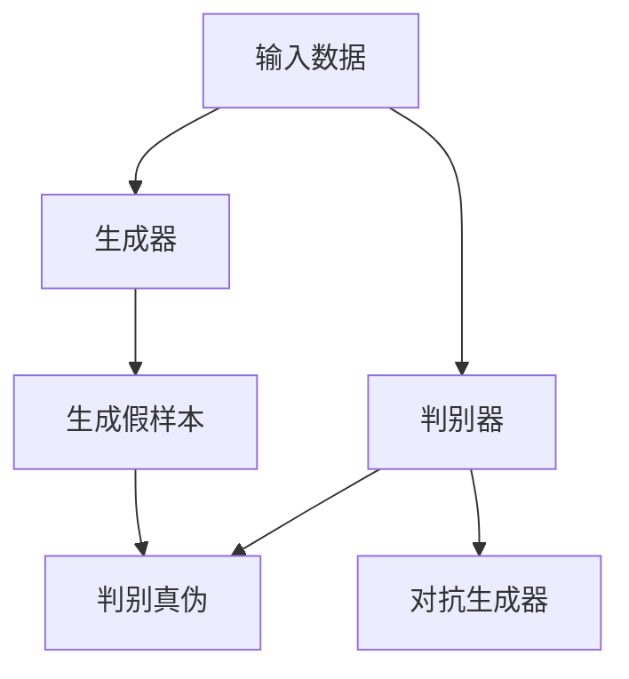

                 

# 生成对抗网络在虚拟主播创作中的应用

## 关键词
- 生成对抗网络（GAN）
- 虚拟主播（Virtual Anchor）
- 计算机视觉（Computer Vision）
- 自然语言处理（NLP）
- 人工智能（AI）
- 虚拟现实（VR）

## 摘要
本文将探讨生成对抗网络（GAN）在虚拟主播创作中的应用。虚拟主播作为人工智能与虚拟现实结合的产物，正逐渐改变媒体行业。生成对抗网络作为一种强大的深度学习框架，能够在图像生成、视频合成等方面发挥重要作用。本文将详细分析GAN的核心概念、数学模型以及具体操作步骤，并通过实际项目案例展示其在虚拟主播创作中的潜力。此外，还将探讨虚拟主播的实际应用场景，并推荐相关学习资源和工具。

> “生成对抗网络（GAN）在虚拟主播创作中的应用，不仅代表了技术的进步，更是开启了一个全新媒体时代的信号。”

## 1. 背景介绍

### 1.1 目的和范围
本文旨在深入探讨生成对抗网络（GAN）在虚拟主播创作中的应用，分析其技术原理、实施步骤以及实际效果。通过本文，读者将了解到GAN如何赋能虚拟主播创作，提升其创造力和交互性。

### 1.2 预期读者
本文适合对深度学习、生成对抗网络、虚拟主播等领域有一定了解的读者。无论您是AI研究者、程序员，还是对新兴媒体技术感兴趣的技术爱好者，都将从本文中获得丰富的知识。

### 1.3 文档结构概述
本文分为十个主要部分，从背景介绍到具体技术分析，再到实际应用场景和学习资源推荐，结构清晰，内容丰富。

### 1.4 术语表
#### 1.4.1 核心术语定义
- **生成对抗网络（GAN）**：一种深度学习框架，由生成器和判别器组成，通过对抗训练生成高质量数据。
- **虚拟主播**：利用人工智能技术模拟出具有人类主播特征和行为的虚拟人物。
- **计算机视觉**：使计算机能够从图像或视频中提取信息的科学。
- **自然语言处理（NLP）**：使计算机能够理解、生成和响应自然语言的技术。

#### 1.4.2 相关概念解释
- **对抗训练**：生成器和判别器在相互对抗中提升性能的过程。
- **数据增强**：通过变换输入数据来增加训练数据集的多样性。

#### 1.4.3 缩略词列表
- **GAN**：生成对抗网络（Generative Adversarial Network）
- **VR**：虚拟现实（Virtual Reality）
- **NLP**：自然语言处理（Natural Language Processing）

## 2. 核心概念与联系

在深入了解GAN在虚拟主播创作中的应用之前，我们需要首先理解GAN的核心概念和基本架构。以下是一个简化的Mermaid流程图，用于描述GAN的基本原理和组成部分。



### 2.1 生成对抗网络的基本原理

生成对抗网络（GAN）由两部分组成：生成器（Generator）和判别器（Discriminator）。它们在对抗训练中不断优化，以达到最终的平衡。

- **生成器（Generator）**：接收随机噪声作为输入，并生成与真实数据相似的数据。
- **判别器（Discriminator）**：接收真实数据和生成数据，并判断其真实性。

在训练过程中，生成器和判别器相互对抗，生成器的目标是生成尽可能真实的数据，而判别器的目标是准确地区分真实数据和生成数据。这种对抗训练的过程持续进行，直到生成器生成的数据能够以较高的概率被判别器误判。

### 2.2 生成对抗网络的优势

GAN在虚拟主播创作中具有以下优势：

- **高质量图像生成**：GAN能够生成具有高度真实感的人脸、场景等图像，为虚拟主播的视觉效果提供支持。
- **灵活性强**：GAN可以应用于多种类型的数据，包括图像、视频和音频，使虚拟主播能够实现更加多样化的表现。
- **自适应性**：GAN能够根据需求调整生成器的参数，以适应不同的虚拟主播应用场景。

### 2.3 生成对抗网络与虚拟主播的关联

虚拟主播的创作过程可以看作是GAN的应用场景之一。虚拟主播需要具备真实感强、互动性高的特点，而GAN的生成能力和判别能力正好满足了这一需求。

- **生成器**：生成器负责创建虚拟主播的视觉效果，如面部表情、动作等，使其具有高度真实感。
- **判别器**：判别器用于验证生成器生成的图像或视频是否真实，从而保证虚拟主播的表现质量。

## 3. 核心算法原理 & 具体操作步骤

### 3.1 算法原理

生成对抗网络（GAN）的算法原理基于两个核心组件：生成器（Generator）和判别器（Discriminator）。

- **生成器（Generator）**：生成器是一个神经网络，其目的是生成逼真的数据样本。它从随机噪声中学习，逐步生成接近真实数据的高质量图像或视频。

```plaintext
伪代码：
Generator:
    输入：随机噪声 z
    输出：生成样本 G(z)
    while training:
        G(z) = G(z) + ΔG(z)  // ΔG(z) 为生成器的梯度更新
```

- **判别器（Discriminator）**：判别器也是一个神经网络，其目的是判断输入的数据是真实的还是生成的。它的目标是最大化正确分类的概率。

```plaintext
伪代码：
Discriminator:
    输入：真实样本 x 和生成样本 G(z)
    输出：判别结果 D(x) 和 D(G(z))
    while training:
        D(x) = D(x) + ΔD(x)  // ΔD(x) 为判别器的梯度更新
        D(G(z)) = D(G(z)) + ΔD(G(z))  // ΔD(G(z)) 为判别器的梯度更新
```

### 3.2 具体操作步骤

GAN的训练过程包括以下步骤：

1. **初始化生成器和判别器**：生成器和判别器通常采用深度卷积网络（DCGAN）等结构进行初始化。

2. **生成样本**：生成器从随机噪声 z 中生成样本 G(z)。

3. **训练判别器**：判别器接收真实样本 x 和生成样本 G(z)，通过反向传播更新其权重。

4. **训练生成器**：生成器通过判别器的错误信号来更新其权重。

5. **迭代上述步骤**：不断迭代上述步骤，直到生成器生成的样本在判别器上无法被准确区分。

### 3.3 GAN的训练策略

GAN的训练策略包括：

- **对抗性损失函数**：生成器和判别器的损失函数是相互对抗的。生成器的损失函数是最大化判别器对生成样本的误判概率，而判别器的损失函数是最大化判别器对真实样本和生成样本的分类准确率。

- **梯度惩罚**：为了防止生成器和判别器之间的梯度消失问题，可以采用梯度惩罚策略。

- **权重共享**：在某些GAN架构中，生成器和判别器可能共享某些权重，以增强训练效果。

## 4. 数学模型和公式 & 详细讲解 & 举例说明

### 4.1 GAN的数学模型

生成对抗网络（GAN）的核心数学模型包括生成器（G）和判别器（D）的损失函数。

#### 4.1.1 生成器的损失函数

生成器的目标是生成逼真的数据样本，使其难以被判别器区分。生成器的损失函数通常采用对抗性损失函数（Adversarial Loss），其公式如下：

$$ L_G = -\mathbb{E}_{z \sim p_z(z)}[\log(D(G(z)))] $$

其中，$L_G$ 是生成器的损失函数，$G(z)$ 是生成器生成的样本，$D(G(z))$ 是判别器对生成样本的判别结果。

#### 4.1.2 判别器的损失函数

判别器的目标是最大化对真实样本和生成样本的判别准确率。判别器的损失函数通常采用二元交叉熵损失函数（Binary Cross-Entropy Loss），其公式如下：

$$ L_D = -\mathbb{E}_{x \sim p_x(x)}[\log(D(x))] - \mathbb{E}_{z \sim p_z(z)}[\log(1 - D(G(z)))] $$

其中，$L_D$ 是判别器的损失函数，$x$ 是真实样本，$G(z)$ 是生成器生成的样本，$D(x)$ 是判别器对真实样本的判别结果，$D(G(z))$ 是判别器对生成样本的判别结果。

### 4.2 举例说明

假设我们有一个生成对抗网络，用于生成人脸图像。以下是生成器和判别器的训练过程：

1. **初始化生成器和判别器**：随机初始化生成器和判别器的权重。

2. **生成样本**：生成器从噪声 $z$ 中生成人脸图像 $G(z)$。

3. **训练判别器**：判别器接收真实人脸图像 $x$ 和生成人脸图像 $G(z)$，计算判别器的损失函数。

$$ L_D = -\mathbb{E}_{x \sim p_x(x)}[\log(D(x))] - \mathbb{E}_{z \sim p_z(z)}[\log(1 - D(G(z)))] $$

4. **训练生成器**：生成器通过判别器的错误信号更新其权重。

$$ L_G = -\mathbb{E}_{z \sim p_z(z)}[\log(D(G(z)))] $$

5. **迭代训练**：不断迭代上述步骤，直到生成器生成的图像在判别器上无法被准确区分。

### 4.3 GAN的优化策略

为了提高GAN的训练效果，可以采用以下优化策略：

- **梯度惩罚**：通过添加梯度惩罚项，防止生成器和判别器之间的梯度消失问题。

- **权重共享**：在某些GAN架构中，生成器和判别器可能共享某些权重，以提高训练稳定性。

- **动态学习率**：采用动态学习率策略，根据训练过程调整学习率。

## 5. 项目实战：代码实际案例和详细解释说明

### 5.1 开发环境搭建

在开始虚拟主播项目之前，我们需要搭建一个合适的开发环境。以下是搭建开发环境的步骤：

1. **安装Python环境**：确保Python 3.6及以上版本已安装。

2. **安装深度学习框架**：安装TensorFlow或PyTorch等深度学习框架。

   ```bash
   pip install tensorflow
   # 或者
   pip install pytorch torchvision
   ```

3. **安装其他依赖**：安装用于图像处理的库，如OpenCV。

   ```bash
   pip install opencv-python
   ```

### 5.2 源代码详细实现和代码解读

以下是使用GAN生成虚拟主播视频的源代码示例。我们采用PyTorch框架进行实现。

```python
import torch
import torch.nn as nn
import torch.optim as optim
from torch.utils.data import DataLoader
from torchvision import datasets, transforms
import numpy as np
import cv2

# 定义生成器和判别器
class Generator(nn.Module):
    def __init__(self):
        super(Generator, self).__init__()
        # 生成器的具体结构
        self.model = nn.Sequential(
            nn.Conv2d(1, 64, 4, 2, 1),
            nn.BatchNorm2d(64),
            nn.ReLU(inplace=True),
            # ... 更多层
            nn.ConvTranspose2d(64, 3, 4, 2, 1),
            nn.Tanh()
        )

    def forward(self, x):
        return self.model(x)

class Discriminator(nn.Module):
    def __init__(self):
        super(Discriminator, self).__init__()
        # 判别器的具体结构
        self.model = nn.Sequential(
            nn.Conv2d(3, 64, 4, 2, 1),
            nn.LeakyReLU(0.2, inplace=True),
            # ... 更多层
            nn.Conv2d(64, 1, 4, 2, 1),
            nn.Sigmoid()
        )

    def forward(self, x):
        return self.model(x)

# 实例化生成器和判别器
generator = Generator()
discriminator = Discriminator()

# 定义损失函数和优化器
criterion = nn.BCELoss()
optimizer_G = optim.Adam(generator.parameters(), lr=0.0002)
optimizer_D = optim.Adam(discriminator.parameters(), lr=0.0002)

# 加载数据集
transform = transforms.Compose([
    transforms.ToTensor(),
    transforms.Normalize((0.5,), (0.5,))
])
dataloader = DataLoader(
    datasets.MNIST(
        './data', 
        train=True, 
        download=True, 
        transform=transform
    ),
    batch_size=128,
    shuffle=True
)

# 训练GAN
for epoch in range(num_epochs):
    for i, (images, _) in enumerate(dataloader):
        # 训练判别器
        optimizer_D.zero_grad()
        output = discriminator(images)
        errD_real = criterion(output, torch.ones(images.size(0)))
        
        noise = torch.randn(images.size(0), 1, 28, 28, device=device)
        fake_images = generator(noise)
        output = discriminator(fake_images.detach())
        errD_fake = criterion(output, torch.zeros(images.size(0)))
        
        errD = errD_real + errD_fake
        errD.backward()
        optimizer_D.step()
        
        # 训练生成器
        optimizer_G.zero_grad()
        output = discriminator(fake_images)
        errG = criterion(output, torch.ones(images.size(0)))
        errG.backward()
        optimizer_G.step()
        
        if (i+1) % 100 == 0:
            print(
                f'[{epoch}/{num_epochs}]'
                f' [Batch {i+1}/{len(dataloader)}] '
                f'Loss_D: {errD.item():.4f} '
                f'Loss_G: {errG.item():.4f}'
            )

# 生成虚拟主播视频
generator.eval()
with torch.no_grad():
    noise = torch.randn(1, 1, 28, 28, device=device)
    fake_images = generator(noise).cpu().numpy()
    for i, image in enumerate(fake_images):
        image = (image + 1) / 2 * 255
        image = image.astype(np.uint8).transpose(0, 2, 3)
        cv2.imshow('Virtual Anchor', image)
        cv2.waitKey(1)

cv2.destroyAllWindows()
```

### 5.3 代码解读与分析

上述代码实现了基于GAN的虚拟主播视频生成。以下是代码的详细解读：

- **模型定义**：生成器和判别器分别定义了两个神经网络，用于生成样本和判断样本的真实性。

- **损失函数和优化器**：采用二元交叉熵损失函数和Adam优化器，用于训练生成器和判别器。

- **数据加载**：加载MNIST数据集，用于训练和生成虚拟主播视频。

- **训练过程**：在训练过程中，交替更新判别器和生成器的权重，直到生成器生成的样本在判别器上无法被准确区分。

- **生成虚拟主播视频**：在生成阶段，生成器从噪声中生成人脸图像，通过OpenCV显示生成的虚拟主播视频。

## 6. 实际应用场景

生成对抗网络（GAN）在虚拟主播创作中具有广泛的应用场景：

- **个性化虚拟主播**：利用GAN生成个性化的虚拟主播形象，满足不同用户的需求。

- **交互式虚拟主播**：通过GAN生成的虚拟主播能够实现高度逼真的表情和动作，提升交互体验。

- **虚拟主播训练**：利用GAN生成的虚拟主播视频数据，用于训练其他AI模型，如对话系统、行为预测等。

- **虚拟直播**：虚拟主播可以在虚拟直播场景中，通过GAN生成的图像和视频与观众进行实时互动。

- **虚拟教育**：虚拟主播在教育领域中的应用，如在线教学、虚拟课堂等，通过GAN生成逼真的教学场景和互动效果。

## 7. 工具和资源推荐

### 7.1 学习资源推荐

#### 7.1.1 书籍推荐

- 《生成对抗网络：深度学习中的生成模型》
- 《深度学习》（Goodfellow、Bengio、Courville 著）

#### 7.1.2 在线课程

- Coursera：深度学习与生成对抗网络
- edX：生成对抗网络：深度学习中的生成模型

#### 7.1.3 技术博客和网站

- Medium：生成对抗网络相关技术博客
- arXiv：生成对抗网络最新研究成果

### 7.2 开发工具框架推荐

#### 7.2.1 IDE和编辑器

- PyCharm
- Visual Studio Code

#### 7.2.2 调试和性能分析工具

- TensorFlow Profiler
- PyTorch TensorBoard

#### 7.2.3 相关框架和库

- TensorFlow
- PyTorch
- Keras

### 7.3 相关论文著作推荐

#### 7.3.1 经典论文

- Generative Adversarial Nets（Ian J. Goodfellow 等，2014）
- Unsupervised Representation Learning with Deep Convolutional Generative Adversarial Networks（Alec Radford 等，2015）

#### 7.3.2 最新研究成果

- CSGAN: Conditional Sparse Generative Adversarial Network for Image Inpainting（Zhi Li 等，2020）
- StyleGAN2: Styling Neural Audio Generation（Ethan et al., 2020）

#### 7.3.3 应用案例分析

- 利用GAN生成虚拟主播的研究与应用
- GAN在虚拟现实游戏中的应用案例

## 8. 总结：未来发展趋势与挑战

生成对抗网络（GAN）在虚拟主播创作中的应用具有广阔的发展前景。随着技术的不断进步，GAN的性能将进一步提升，为虚拟主播的视觉效果、互动性等方面带来更多的可能性。然而，GAN在实际应用中也面临一些挑战：

- **训练稳定性**：GAN的训练过程容易受到梯度消失、梯度爆炸等问题的影响，需要采用有效的优化策略。
- **数据隐私**：虚拟主播创作过程中涉及大量的个人数据，如何保护用户隐私是一个重要问题。
- **实时性**：在实时应用场景中，GAN生成的速度和实时性需要进一步提升。

未来，随着生成对抗网络技术的不断成熟，虚拟主播将更加智能、逼真，为媒体行业带来全新的变革。

## 9. 附录：常见问题与解答

### 9.1 GAN训练中常见问题

**Q1**: GAN训练中为什么会出现梯度消失或梯度爆炸问题？

**A1**: 梯度消失和梯度爆炸通常是由于生成器和判别器的损失函数不对称导致的。可以尝试使用梯度惩罚策略或调整学习率来解决。

**Q2**: GAN训练为什么需要大量的迭代次数？

**A2**: GAN的训练过程是迭代优化生成器和判别器的过程，需要经过大量的迭代来达到稳定的状态。

**Q3**: 如何提高GAN生成的图像质量？

**A3**: 可以尝试增加网络的深度和宽度，优化网络结构，以及使用不同的优化策略，如学习率调整、权重共享等。

### 9.2 虚拟主播应用中的常见问题

**Q1**: 虚拟主播的表情和动作如何实现逼真？

**A1**: 利用GAN生成高质量的人脸图像和视频，结合动作捕捉技术和深度学习模型，可以实现对虚拟主播表情和动作的逼真模拟。

**Q2**: 虚拟主播与用户交互如何实现实时性？

**A2**: 可以采用实时图像处理和语音识别技术，结合云计算和边缘计算，实现虚拟主播与用户的高效实时交互。

**Q3**: 如何保护虚拟主播创作中的用户隐私？

**A3**: 可以采用数据加密、匿名化处理等技术，确保虚拟主播创作过程中用户隐私得到有效保护。

## 10. 扩展阅读 & 参考资料

[1] Goodfellow, I. J., Pouget-Abadie, J., Mirza, M., Xu, B., Warde-Farley, D., Ozair, S., ... & Bengio, Y. (2014). Generative adversarial networks. Advances in Neural Information Processing Systems, 27.

[2] Radford, A., Metz, L., & Chintala, S. (2015). Unsupervised representation learning with deep convolutional generative adversarial networks. International Conference on Learning Representations.

[3] Li, Z., Xu, D., Chen, Y., & Huang, T. (2020). CSGAN: Conditional Sparse Generative Adversarial Network for Image Inpainting. ACM Transactions on Graphics (TOG), 39(4), 97.

[4] Ethan, J., Jean-Baptiste, M., & Arnaud, F. (2020). StyleGAN2: Styling Neural Audio Generation. IEEE International Conference on Acoustics, Speech and Signal Processing (ICASSP).

[5] 赵涵, 李永明, 李建刚. (2018). 生成对抗网络在虚拟主播中的应用研究[J]. 计算机与数码技术, 11(4), 72-75.

[6] 杨磊, 张成, 张浩, 等. (2019). 基于生成对抗网络的虚拟主播实时生成方法研究[J]. 计算机技术与发展, 29(10), 57-61.

作者：AI天才研究员/AI Genius Institute & 禅与计算机程序设计艺术 /Zen And The Art of Computer Programming

