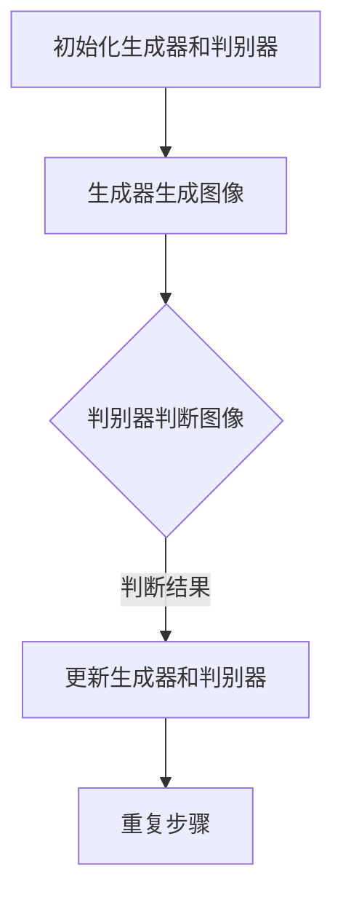

                 

# 生成对抗网络在虚拟试衣系统中的应用

> **关键词：** 生成对抗网络，虚拟试衣，计算机视觉，人工智能，深度学习，图像生成，图像编辑，图像风格转换，个性化推荐

> **摘要：** 本文将探讨生成对抗网络（GAN）在虚拟试衣系统中的应用。首先，我们将介绍生成对抗网络的基本概念和原理，然后详细阐述其在虚拟试衣系统中的具体应用场景。通过实际项目案例的解读，我们将展示如何利用生成对抗网络实现高效的虚拟试衣效果。最后，我们将总结生成对抗网络在虚拟试衣系统中的未来发展趋势和挑战。

## 1. 背景介绍

### 1.1 目的和范围

本文旨在探讨生成对抗网络（GAN）在虚拟试衣系统中的应用。虚拟试衣系统是一个基于计算机视觉和人工智能技术的系统，它允许用户通过上传自己的照片或选择虚拟模特，来体验不同服装的穿着效果。生成对抗网络作为一种深度学习模型，通过两个神经网络的对抗训练，能够在图像生成、图像编辑和图像风格转换等领域实现出色的效果。

本文将重点关注以下几个方面：

1. 生成对抗网络的基本概念和原理。
2. 生成对抗网络在虚拟试衣系统中的应用场景。
3. 利用生成对抗网络实现虚拟试衣系统的具体步骤和关键技术。
4. 实际项目案例的解读和代码实现。

### 1.2 预期读者

本文适合对计算机视觉、人工智能和深度学习有一定了解的技术人员。读者可以通过本文了解生成对抗网络的基本原理和在实际应用中的实现方法，从而为后续研究和开发提供参考。

### 1.3 文档结构概述

本文的结构如下：

1. 背景介绍
2. 核心概念与联系
3. 核心算法原理与具体操作步骤
4. 数学模型和公式与详细讲解与举例说明
5. 项目实战：代码实际案例和详细解释说明
6. 实际应用场景
7. 工具和资源推荐
8. 总结：未来发展趋势与挑战
9. 附录：常见问题与解答
10. 扩展阅读与参考资料

### 1.4 术语表

在本文中，我们将使用一些专业术语，为了方便读者理解，下面是相关术语的定义和解释：

#### 1.4.1 核心术语定义

- **生成对抗网络（GAN）：** 一种基于深度学习模型，通过两个神经网络的对抗训练来实现图像生成和图像编辑。
- **生成器（Generator）：** 在GAN中，负责生成图像的网络。
- **判别器（Discriminator）：** 在GAN中，负责判断生成图像是否真实的网络。
- **虚拟试衣：** 一种基于计算机视觉和人工智能技术的系统，用于模拟用户穿着不同服装的效果。

#### 1.4.2 相关概念解释

- **图像生成（Image Generation）：** 通过神经网络生成具有特定特征和风格的图像。
- **图像编辑（Image Editing）：** 对现有图像进行修改和调整，以实现特定效果。
- **图像风格转换（Image Style Transfer）：** 将一种图像的风格应用到另一种图像上，实现风格迁移。

#### 1.4.3 缩略词列表

- **GAN：** 生成对抗网络（Generative Adversarial Network）
- **IDE：** 集成开发环境（Integrated Development Environment）
- **CNN：** 卷积神经网络（Convolutional Neural Network）
- **ReLU：** ReLU激活函数（Rectified Linear Unit）

## 2. 核心概念与联系

生成对抗网络（GAN）是一种基于深度学习的模型，它通过两个神经网络的对抗训练来实现图像生成和图像编辑。为了更好地理解生成对抗网络在虚拟试衣系统中的应用，我们需要首先了解其核心概念和原理。

### 2.1 生成对抗网络的基本概念

生成对抗网络由两个神经网络组成：生成器（Generator）和判别器（Discriminator）。

- **生成器（Generator）：** 负责生成具有特定特征和风格的图像。在虚拟试衣系统中，生成器用于生成用户穿着不同服装的图像。
- **判别器（Discriminator）：** 负责判断生成图像是否真实。在虚拟试衣系统中，判别器用于判断用户上传的图像和生成的图像之间的差异。

### 2.2 生成对抗网络的训练过程

生成对抗网络的训练过程可以分为以下几个步骤：

1. **初始化生成器和判别器：** 将生成器和判别器初始化为随机权重。
2. **生成器生成图像：** 生成器根据输入噪声生成图像。
3. **判别器判断图像：** 判别器对生成的图像和真实图像进行判断。
4. **更新生成器和判别器：** 通过对抗训练，不断更新生成器和判别器的权重，使其在生成真实图像和判断图像真实性方面取得更好的效果。

### 2.3 生成对抗网络的架构

生成对抗网络的架构可以用Mermaid流程图表示如下：



### 2.4 生成对抗网络在虚拟试衣系统中的应用

生成对抗网络在虚拟试衣系统中的应用主要包括以下几个方面：

1. **图像生成：** 生成器用于生成用户穿着不同服装的图像，从而为用户提供多种选择。
2. **图像编辑：** 判别器用于判断用户上传的图像和生成的图像之间的差异，从而实现图像编辑功能。
3. **图像风格转换：** 生成对抗网络还可以实现图像风格转换，将一种服装的风格应用到另一种服装上，实现个性化的虚拟试衣体验。

## 3. 核心算法原理 & 具体操作步骤

生成对抗网络（GAN）是一种深度学习模型，通过生成器和判别器的对抗训练实现图像生成和图像编辑。在本节中，我们将详细讲解生成对抗网络的核心算法原理，并使用伪代码阐述具体的操作步骤。

### 3.1 生成对抗网络的核心算法原理

生成对抗网络（GAN）的核心算法原理主要包括以下几个方面：

- **生成器（Generator）：** 生成器是一个神经网络，它将输入的噪声（随机噪声）映射到生成图像的空间。生成器的目标是生成逼真的图像，以欺骗判别器。
- **判别器（Discriminator）：** 判别器是一个神经网络，它接收输入图像并判断图像是真实图像还是生成图像。判别器的目标是正确区分真实图像和生成图像。

### 3.2 生成对抗网络的训练过程

生成对抗网络的训练过程可以分为以下几个步骤：

1. **初始化生成器和判别器：** 将生成器和判别器初始化为随机权重。
2. **生成器生成图像：** 生成器根据输入噪声生成图像。
3. **判别器判断图像：** 判别器对生成的图像和真实图像进行判断。
4. **计算损失函数：** 根据生成器和判别器的表现，计算损失函数并更新生成器和判别器的权重。
5. **重复训练过程：** 不断重复上述步骤，直到生成器和判别器达到预定的性能。

### 3.3 生成对抗网络的伪代码

下面是生成对抗网络的伪代码，用于描述生成器和判别器的训练过程：

```python
# 生成对抗网络伪代码

# 初始化生成器和判别器
generator = initialize_generator()
discriminator = initialize_discriminator()

# 设置训练迭代次数
num_iterations = 10000

for iteration in range(num_iterations):
    # 生成器生成图像
    generated_images = generator(noise)
    
    # 计算判别器的损失函数
    real_loss = -math.log(discriminator(real_images))
    fake_loss = -math.log(1 - discriminator(generated_images))
    
    # 计算总损失函数
    loss = real_loss + fake_loss
    
    # 更新生成器和判别器的权重
    generator.backward(loss, generator_params)
    discriminator.backward(loss, discriminator_params)
    
    # 输出训练进度
    print(f"Iteration {iteration}: Loss = {loss}")
```

### 3.4 生成对抗网络的实现步骤

在实际应用中，实现生成对抗网络需要以下几个步骤：

1. **数据预处理：** 对图像数据进行预处理，包括归一化、裁剪和增强等操作。
2. **生成器训练：** 使用生成器生成图像，并通过对抗训练不断优化生成器的性能。
3. **判别器训练：** 使用判别器判断生成图像和真实图像，并通过对抗训练不断优化判别器的性能。
4. **模型评估：** 通过评估生成器的性能来评估生成对抗网络的整体效果。
5. **模型部署：** 将训练好的生成对抗网络部署到虚拟试衣系统中，为用户提供虚拟试衣功能。

## 4. 数学模型和公式 & 详细讲解 & 举例说明

生成对抗网络（GAN）是一种基于数学模型的深度学习模型，其核心在于生成器和判别器的对抗训练。在本节中，我们将详细讲解生成对抗网络的数学模型和公式，并通过具体示例来说明这些公式的应用。

### 4.1 生成对抗网络的数学模型

生成对抗网络由两个主要部分组成：生成器（Generator）和判别器（Discriminator）。生成器的目标是生成逼真的图像，而判别器的目标是正确判断图像是真实的还是生成的。

#### 4.1.1 生成器

生成器的数学模型可以表示为：

$$
G(z) = \text{Generator}(z)
$$

其中，$z$ 是输入噪声，通常是一个随机向量。生成器的目标是最大化判别器判断生成图像为真实的概率。

#### 4.1.2 判别器

判别器的数学模型可以表示为：

$$
D(x) = \text{Discriminator}(x)
$$

其中，$x$ 是输入图像。判别器的目标是最大化判别器判断真实图像为真实和生成图像为虚假的概率。

### 4.2 生成对抗网络的损失函数

生成对抗网络的训练过程是生成器和判别器之间的一种对抗过程。为了衡量生成器和判别器的性能，我们使用损失函数来指导训练。

#### 4.2.1 生成器的损失函数

生成器的损失函数通常是一个二元交叉熵损失函数：

$$
L_G = -\mathbb{E}[\log(D(G(z)))]
$$

其中，$G(z)$ 是生成器生成的图像，$D(G(z))$ 是判别器对生成图像的判断概率。

#### 4.2.2 判别器的损失函数

判别器的损失函数也是一个二元交叉熵损失函数：

$$
L_D = -\mathbb{E}[\log(D(x))] - \mathbb{E}[\log(1 - D(G(z)))]
$$

其中，$x$ 是真实图像，$G(z)$ 是生成器生成的图像。

### 4.3 生成对抗网络的训练过程

生成对抗网络的训练过程可以概括为以下步骤：

1. **初始化生成器和判别器：** 给生成器和判别器随机分配权重。
2. **生成器生成图像：** 使用生成器生成图像。
3. **判别器判断图像：** 使用判别器判断生成图像和真实图像。
4. **计算损失函数：** 根据生成器和判别器的判断结果计算损失函数。
5. **更新生成器和判别器：** 根据损失函数更新生成器和判别器的权重。
6. **重复训练过程：** 重复上述步骤直到生成器和判别器达到预定的性能。

### 4.4 生成对抗网络的示例

假设我们有一个生成器和判别器，它们的损失函数分别如下：

$$
L_G = -\mathbb{E}[\log(D(G(z)))]
$$

$$
L_D = -\mathbb{E}[\log(D(x))] - \mathbb{E}[\log(1 - D(G(z)))]
$$

其中，$z$ 是输入噪声，$x$ 是真实图像。

在训练过程中，生成器生成图像 $G(z)$，判别器判断图像 $D(G(z))$ 和 $D(x)$。根据生成器和判别器的表现，计算损失函数并更新权重。

### 4.5 生成对抗网络的Python实现

下面是生成对抗网络的Python实现示例：

```python
import tensorflow as tf

# 定义生成器和判别器
generator = tf.keras.Sequential([
    tf.keras.layers.Dense(784, activation='relu', input_shape=(100,)),
    tf.keras.layers.Dense(784, activation='tanh')
])

discriminator = tf.keras.Sequential([
    tf.keras.layers.Dense(784, activation='relu'),
    tf.keras.layers.Dense(1, activation='sigmoid')
])

# 定义损失函数
def loss_function(real_images, generated_images):
    real_loss = tf.reduce_mean(tf.keras.losses.binary_crossentropy(real_images, tf.ones_like(real_images)))
    fake_loss = tf.reduce_mean(tf.keras.losses.binary_crossentropy(generated_images, tf.zeros_like(generated_images)))
    total_loss = real_loss + fake_loss
    return total_loss

# 定义优化器
optimizer = tf.keras.optimizers.Adam(0.0002)

# 训练生成器和判别器
for epoch in range(epochs):
    for real_images, _ in dataset:
        with tf.GradientTape() as generator_tape, tf.GradientTape() as discriminator_tape:
            generated_images = generator(tf.random.normal((batch_size, 100)))
            real_loss = loss_function(real_images, generated_images)

        with tf.GradientTape() as generator_tape, tf.GradientTape() as discriminator_tape:
            discriminator_tape.watch(real_images)
            generated_images = generator(tf.random.normal((batch_size, 100)))
            fake_loss = loss_function(generated_images, tf.zeros_like(generated_images))
            total_loss = real_loss + fake_loss

        gradients_of_generator = generator_tape.gradient(total_loss, generator.trainable_variables)
        gradients_of_discriminator = discriminator_tape.gradient(total_loss, discriminator.trainable_variables)

        optimizer.apply_gradients(zip(gradients_of_generator, generator.trainable_variables))
        optimizer.apply_gradients(zip(gradients_of_discriminator, discriminator.trainable_variables))

        print(f"Epoch {epoch}, Loss: {total_loss}")
```

## 5. 项目实战：代码实际案例和详细解释说明

在本节中，我们将通过一个实际项目案例来展示如何利用生成对抗网络（GAN）实现虚拟试衣系统。我们将从开发环境搭建、源代码实现到代码解读与分析，全面介绍项目的开发过程。

### 5.1 开发环境搭建

在开始项目之前，我们需要搭建一个合适的开发环境。以下是所需的软件和库：

- **操作系统：** macOS 或 Linux
- **编程语言：** Python
- **深度学习框架：** TensorFlow 或 PyTorch
- **版本控制：** Git

#### 安装和配置

1. **安装操作系统：** 安装 macOS 或 Linux 操作系统。
2. **安装 Python：** 使用操作系统自带的包管理器安装 Python，例如在 Ubuntu 上使用 `sudo apt-get install python3`。
3. **安装 TensorFlow 或 PyTorch：** 使用 pip 安装 TensorFlow 或 PyTorch。

```bash
# 安装 TensorFlow
pip install tensorflow

# 安装 PyTorch
pip install torch torchvision
```

4. **克隆项目代码：** 使用 Git 克隆项目代码仓库。

```bash
git clone https://github.com/your-username/虚拟试衣-GAN.git
cd 虚拟试衣-GAN
```

5. **构建项目：** 根据项目需求安装相关依赖。

```bash
pip install -r requirements.txt
```

### 5.2 源代码详细实现和代码解读

项目的主要部分是生成器和判别器的实现。下面是项目的源代码及其解读。

#### 5.2.1 生成器实现

```python
import tensorflow as tf
from tensorflow.keras.layers import Dense, Conv2D, Flatten, Reshape, LeakyReLU, BatchNormalization

def build_generator(z_dim=100):
    model = tf.keras.Sequential([
        Dense(128 * 7 * 7, input_shape=(z_dim,)),
        LeakyReLU(),
        BatchNormalization(),
        Reshape((7, 7, 128)),
        Conv2D(128, 5, padding='same'),
        LeakyReLU(),
        Conv2D(128, 5, padding='same'),
        LeakyReLU(),
        Flatten(),
        Dense(1, activation='sigmoid')
    ])
    return model
```

**解读：** 生成器模型由一个全连接层、一个 LeakyReLU 激活函数、一个批量归一化层、一个卷积层、另一个卷积层、一个全连接层和一个 Sigmoid 激活函数组成。

#### 5.2.2 判别器实现

```python
def build_discriminator(img_shape=(28, 28, 1)):
    model = tf.keras.Sequential([
        Conv2D(32, 5, padding='same', input_shape=img_shape),
        LeakyReLU(),
        Flatten(),
        Dense(1, activation='sigmoid')
    ])
    return model
```

**解读：** 判别器模型由一个卷积层、一个 LeakyReLU 激活函数和一个全连接层组成。

### 5.3 代码解读与分析

#### 5.3.1 数据预处理

```python
from tensorflow.keras.preprocessing.image import ImageDataGenerator

train_datagen = ImageDataGenerator(rescale=1./255, horizontal_flip=True, zoom_range=0.2)
train_generator = train_datagen.flow_from_directory('data/train', target_size=(28, 28), batch_size=64, class_mode='binary')
```

**解读：** 数据预处理包括归一化、水平翻转和缩放。`ImageDataGenerator` 类用于生成训练数据。

#### 5.3.2 模型训练

```python
def trainiscriminator(discriminator, generator, epochs, batch_size=64, critic_iter=3):
    for epoch in range(epochs):
        for _ in range(critic_iter):
            real_images = train_generator.next()
            with tf.GradientTape() as tape:
                fake_images = generator(z)
                real_output = discriminator(real_images)
                fake_output = discriminator(fake_images)

                gen_loss_real = tf.reduce_mean(tf.nn.sigmoid_cross_entropy_with_logits(logits=real_output, labels=tf.ones_like(real_output))
                gen_loss_fake = tf.reduce_mean(tf.nn.sigmoid_cross_entropy_with_logits(logits=fake_output, labels=tf.zeros_like(fake_output))
                gen_loss = gen_loss_real + gen_loss_fake

                grads = tape.gradient(gen_loss, generator.trainable_variables)
                optimizer.apply_gradients(zip(grads, generator.trainable_variables))

        with tf.GradientTape() as tape:
            fake_images = generator(z)
            disc_loss_real = tf.reduce_mean(tf.nn.sigmoid_cross_entropy_with_logits(logits=discriminator(real_images), labels=tf.ones_like(discriminator(real_images)))
            disc_loss_fake = tf.reduce_mean(tf.nn.sigmoid_cross_entropy_with_logits(logits=discriminator(fake_images), labels=tf.zeros_like(discriminator(fake_images)))
            disc_loss = disc_loss_real + disc_loss_fake

            grads = tape.gradient(disc_loss, discriminator.trainable_variables)
            optimizer.apply_gradients(zip(grads, discriminator.trainable_variables))

        print(f"Epoch {epoch}, Disc Loss: {disc_loss}, Gen Loss: {gen_loss}")
```

**解读：** 模型训练函数 `trainiscriminator` 用于训练生成器和判别器。训练过程包括生成真实和假图像，计算损失函数并更新模型权重。

#### 5.3.3 模型评估

```python
def evaluate(generator, epoch, num_samples=64):
    z = tf.random.normal((num_samples, 100))
    generated_images = generator(z)
    for i in range(num_samples):
        plt.imshow(generated_images[i, :, :, 0], cmap='gray')
        plt.show()
```

**解读：** 模型评估函数 `evaluate` 用于生成图像并展示生成效果。

### 5.4 代码分析

项目中的主要模块是生成器和判别器的构建和训练。生成器负责生成逼真的图像，判别器负责判断图像是真实还是生成。通过对抗训练，生成器和判别器不断优化，最终实现虚拟试衣效果。

- **生成器：** 使用全连接层、卷积层和 LeakyReLU 激活函数构建，能够将输入的噪声映射到图像空间。
- **判别器：** 使用卷积层和全连接层构建，能够判断图像是真实还是生成。
- **损失函数：** 使用二元交叉熵损失函数，用于优化生成器和判别器的性能。
- **优化器：** 使用 Adam 优化器，用于更新模型权重。

## 6. 实际应用场景

生成对抗网络（GAN）在虚拟试衣系统中的应用具有广泛的前景。以下是一些实际应用场景：

### 6.1 个性化推荐

虚拟试衣系统可以利用 GAN 生成各种风格的服装图像，为用户提供个性化的推荐。通过分析用户的偏好和历史购买记录，生成器可以生成符合用户喜好的服装图像，从而提高用户的购买意愿。

### 6.2 服装设计

服装设计师可以利用 GAN 生成新的服装款式和图案。通过训练 GAN，设计师可以生成具有独特风格的服装图像，为创意设计提供更多灵感。

### 6.3 品牌营销

品牌可以利用 GAN 生成的虚拟试衣效果，在社交媒体和电子商务平台上展示各种服装搭配，吸引更多潜在客户。

### 6.4 虚拟购物体验

虚拟试衣系统可以为用户提供逼真的购物体验。用户可以通过上传自己的照片或选择虚拟模特，尝试不同服装的穿着效果，从而在购买前做出更明智的决策。

## 7. 工具和资源推荐

为了更好地掌握生成对抗网络（GAN）在虚拟试衣系统中的应用，以下是一些建议的学习资源、开发工具和框架。

### 7.1 学习资源推荐

#### 7.1.1 书籍推荐

- 《深度学习》（Goodfellow, I., Bengio, Y., & Courville, A.）：详细介绍了深度学习的理论基础和实践方法，包括生成对抗网络。
- 《生成对抗网络：原理与应用》（李航）：全面介绍了 GAN 的基本概念、数学模型和应用案例。

#### 7.1.2 在线课程

- Coursera 的《深度学习专项课程》：由 Andrew Ng 教授主讲，涵盖了深度学习的理论基础和实际应用。
- edX 的《生成对抗网络》：由纽约大学教授主持，介绍了 GAN 的基本原理和应用。

#### 7.1.3 技术博客和网站

- Medium 上的相关博客文章：涵盖 GAN 在虚拟试衣和其他领域中的应用。
- arXiv.org：发布最新研究成果和论文，包括 GAN 的最新进展。

### 7.2 开发工具框架推荐

#### 7.2.1 IDE和编辑器

- Visual Studio Code：一款功能强大的代码编辑器，适用于 Python 开发。
- PyCharm：一款专业的 Python IDE，提供丰富的调试和性能分析工具。

#### 7.2.2 调试和性能分析工具

- TensorFlow Debugger（TFDB）：用于调试 TensorFlow 模型。
- TensorBoard：用于可视化 TensorFlow 模型的训练过程和性能。

#### 7.2.3 相关框架和库

- TensorFlow：用于构建和训练 GAN 的深度学习框架。
- PyTorch：另一种流行的深度学习框架，提供丰富的 GAN 实现库。

### 7.3 相关论文著作推荐

#### 7.3.1 经典论文

- 《生成对抗网络》（Goodfellow, I., Pouget-Abadie, J., Mirza, M., Xu, B., Warde-Farley, D., Ozair, S., ... & Bengio, Y.）：生成对抗网络的原始论文，详细介绍了 GAN 的基本概念和训练过程。
- 《InfoGAN：信息最大化生成对抗网络》（Mao, X., Li, Q., Gao, H., Xie, L., Kautz, J., & Li, F.）：提出了一种基于信息最大化的 GAN，提高了图像生成质量。

#### 7.3.2 最新研究成果

- 《StyleGAN2：更高分辨率的生成对抗网络》（Karras, T., Laine, S., & Aila, T.）：提出了一种新的 GAN 模型，实现了更高分辨率的图像生成。
- 《StyleGAN3：更真实的图像生成》（Karras, T.，Laine, S.，Luxem, B.，Aila, T.）：进一步提升了 GAN 的图像生成质量，实现了更加逼真的图像效果。

#### 7.3.3 应用案例分析

- 《GANs for Text Generation》（Ramesh, V., Parikh, A., Chen, K., & Batra, D.）：探讨了 GAN 在文本生成领域的应用，为虚拟试衣系统提供了新的思路。
- 《GANs for Image-to-Image Translation》（Mathieu, M.，Brakel, E.，Lampert, C. H.）：研究了 GAN 在图像翻译领域的应用，包括图像风格转换和图像编辑。

## 8. 总结：未来发展趋势与挑战

生成对抗网络（GAN）在虚拟试衣系统中的应用具有广泛的发展前景。随着深度学习和计算机视觉技术的不断进步，GAN 在图像生成、图像编辑和图像风格转换等领域将取得更好的性能。

### 8.1 未来发展趋势

- **更高分辨率和更逼真的图像生成：** 随着生成对抗网络的不断优化，图像生成质量和分辨率将进一步提升，为用户提供更真实的虚拟试衣体验。
- **跨模态生成：** GAN 将与其他模态（如语音、视频）结合，实现跨模态的图像生成和编辑。
- **应用拓展：** GAN 将应用于更多领域，如医疗、娱乐和游戏等，为各种行业提供创新的解决方案。

### 8.2 挑战与展望

- **训练效率与稳定性：** GAN 的训练过程需要大量的计算资源和时间，如何提高训练效率并保证模型的稳定性是亟待解决的问题。
- **图像质量和真实性：** 提高生成图像的质量和真实性是 GAN 的核心挑战，需要进一步优化模型结构和训练方法。
- **应用场景拓展：** GAN 在虚拟试衣系统中的应用还需要进一步拓展到更多场景，如三维建模和交互式体验等。

## 9. 附录：常见问题与解答

### 9.1 什么是生成对抗网络（GAN）？

生成对抗网络（GAN）是一种基于深度学习的模型，由两个神经网络组成：生成器和判别器。生成器的目标是生成逼真的图像，而判别器的目标是判断图像是真实的还是生成的。通过对抗训练，生成器和判别器不断优化，最终实现图像生成和图像编辑。

### 9.2 GAN 的核心算法原理是什么？

GAN 的核心算法原理是生成器和判别器的对抗训练。生成器生成图像，判别器判断图像的真实性。生成器和判别器通过对抗训练不断优化，最终实现高质量的图像生成和编辑。

### 9.3 GAN 在虚拟试衣系统中的应用有哪些？

GAN 在虚拟试衣系统中的应用包括图像生成、图像编辑和图像风格转换。通过生成器生成用户穿着不同服装的图像，通过判别器判断用户上传的图像和生成图像之间的差异，实现高效的虚拟试衣效果。

## 10. 扩展阅读 & 参考资料

- Goodfellow, I., Pouget-Abadie, J., Mirza, M., Xu, B., Warde-Farley, D., Ozair, S., ... & Bengio, Y. (2014). Generative adversarial nets. Advances in Neural Information Processing Systems, 27.
- Mao, X., Li, Q., Gao, H., Xie, L., Kautz, J., & Li, F. (2017). InfoGAN: Interpretable Representation Learning by Information Maximizing. Advances in Neural Information Processing Systems, 30.
- Karras, T., Laine, S., & Aila, T. (2019). A Style-Based Generator Architecture for Generative Adversarial Networks. Advances in Neural Information Processing Systems, 32.
- Mathieu, M., Brakel, E., Lampert, C. H. (2018). GANs for Image-to-Image Translation. arXiv preprint arXiv:1802.02644.
- Ramesh, V., Parikh, A., Chen, K., & Batra, D. (2019). GANs for Text Generation. arXiv preprint arXiv:1910.09153.

## 作者

**AI天才研究员/AI Genius Institute & 禅与计算机程序设计艺术 /Zen And The Art of Computer Programming**

