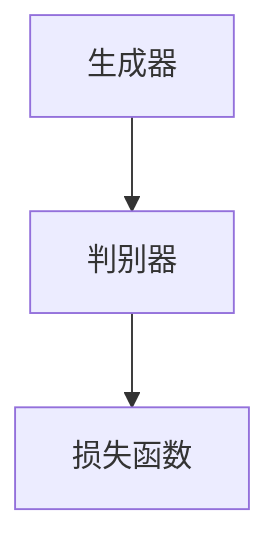

                 

# 生成式AIGC：AI技术的商业化路径

> **关键词**：生成式AI、AIGC、商业化路径、技术原理、应用场景

> **摘要**：本文将深入探讨生成式人工智能（AIGC）的发展背景、核心概念、算法原理、数学模型、实战案例以及商业化路径。通过系统化的分析，本文旨在为读者提供对AIGC技术的全面了解，并揭示其在未来科技领域的巨大潜力。

## 1. 背景介绍

在21世纪的科技浪潮中，人工智能（AI）无疑成为了最引人注目的领域之一。从最初的专家系统到深度学习，再到生成式AI，AI技术不断演进，为各行各业带来了深刻的变革。生成式AI（AIGC，Generative AI）作为AI技术的前沿领域，近年来受到了广泛关注。

### 1.1 生成式AI的定义与发展

生成式AI是一种能够生成新数据的人工智能技术，其核心思想是通过学习大量已有数据，生成与输入数据类似的新数据。这一概念最早可以追溯到1980年代，当时的生成对抗网络（GAN，Generative Adversarial Network）由Ian Goodfellow等人提出。GAN由生成器（Generator）和判别器（Discriminator）两个神经网络组成，通过相互博弈的方式不断优化，从而生成高质量的数据。

随着深度学习技术的发展，生成式AI在图像生成、视频生成、自然语言生成等领域取得了显著进展。例如，深度卷积生成对抗网络（DCGAN，Deep Convolutional Generative Adversarial Network）在图像生成领域取得了突破性成果；变分自编码器（VAE，Variational Autoencoder）则在生成模型的可解释性和稳定性方面有所提升。

### 1.2 生成式AI的应用场景

生成式AI的应用场景十分广泛，涵盖了图像、视频、音频、自然语言等多个领域。以下是一些典型的应用场景：

1. **图像生成**：生成式AI可以生成逼真的图像，如图像修复、艺术风格转换、图像合成等。
2. **视频生成**：通过生成式AI，可以生成高质量的视频，如视频超分辨率、视频风格迁移等。
3. **音频生成**：生成式AI可以生成逼真的音频，如语音合成、音乐生成等。
4. **自然语言生成**：生成式AI可以生成高质量的自然语言文本，如文章生成、对话系统等。

### 1.3 生成式AI的挑战与机遇

尽管生成式AI在技术上取得了显著进展，但其商业化仍面临诸多挑战。首先，生成式AI的训练成本高昂，对计算资源的要求较高。其次，生成式AI的生成质量与可控性仍需提升。此外，生成式AI的安全性和道德问题也引发了广泛关注。

然而，随着硬件性能的提升、算法的优化以及商业化模式的探索，生成式AI的商业化前景十分广阔。例如，在创意产业、医疗诊断、金融风控等领域，生成式AI有望带来巨大的商业价值。

## 2. 核心概念与联系

### 2.1 生成式AI的核心概念

生成式AI的核心概念包括生成器（Generator）、判别器（Discriminator）和损失函数（Loss Function）。以下是一个简单的Mermaid流程图，展示了这三个核心组件的关系：



### 2.2 生成器与判别器的交互

生成器和判别器通过相互博弈的方式不断优化。生成器的目标是生成逼真的数据，以欺骗判别器；而判别器的目标是区分生成的数据与真实数据。这一过程类似于零和游戏，两者通过不断对抗，最终达到一个纳什均衡点。

### 2.3 损失函数在生成式AI中的作用

损失函数是生成式AI训练过程中的关键组件，用于衡量生成器生成的数据与真实数据之间的差距。常见的损失函数包括交叉熵损失（Cross-Entropy Loss）、均方误差损失（Mean Squared Error Loss）等。

## 3. 核心算法原理 & 具体操作步骤

### 3.1 GAN（生成对抗网络）

GAN是生成式AI的核心算法之一。其基本原理如下：

1. **初始化生成器和判别器**：生成器和判别器都初始化为随机权重。
2. **生成器生成数据**：生成器根据随机噪声生成数据。
3. **判别器评估数据**：判别器评估生成的数据和真实数据。
4. **更新生成器和判别器**：通过反向传播和梯度下降更新生成器和判别器的权重。

### 3.2 训练过程

GAN的训练过程分为以下步骤：

1. **生成器训练**：生成器试图生成更逼真的数据，以欺骗判别器。
2. **判别器训练**：判别器试图更准确地区分生成的数据和真实数据。
3. **交替训练**：生成器和判别器交替进行训练，直到两者达到纳什均衡。

### 3.3 损失函数

GAN的损失函数通常为生成器损失和判别器损失之和。具体公式如下：

$$
L(G, D) = L_G(G) + L_D(D)
$$

其中，$L_G(G)$ 表示生成器损失，$L_D(D)$ 表示判别器损失。

生成器损失：

$$
L_G(G) = -\log(D(G(z)))
$$

判别器损失：

$$
L_D(D) = -[\log(D(x)) + \log(1 - D(G(z))]
$$

其中，$x$ 表示真实数据，$z$ 表示随机噪声。

## 4. 数学模型和公式 & 详细讲解 & 举例说明

### 4.1 GAN的数学模型

生成式AI的核心模型是生成对抗网络（GAN）。GAN由两个神经网络组成：生成器（Generator）和判别器（Discriminator）。

**生成器**：生成器的目标是生成与真实数据相似的数据。生成器的输入是随机噪声向量 $z$，输出是生成的数据 $x$。生成器通常是一个深层的全连接神经网络。

$$
x = G(z)
$$

**判别器**：判别器的目标是区分生成的数据和真实数据。判别器的输入是数据 $x$，输出是一个概率值 $D(x)$，表示输入数据是真实数据的概率。判别器也是一个深层的全连接神经网络。

$$
D(x) = \sigma(W_D x + b_D)
$$

其中，$\sigma$ 是 sigmoid 函数，$W_D$ 和 $b_D$ 分别是判别器的权重和偏置。

### 4.2 损失函数

GAN的训练过程是通过优化两个损失函数来实现的：生成器损失函数 $L_G$ 和判别器损失函数 $L_D$。

**生成器损失函数**：

$$
L_G = -\log(D(G(z)))
$$

**判别器损失函数**：

$$
L_D = -[\log(D(x)) + \log(1 - D(G(z))]
$$

其中，$x$ 是真实数据，$z$ 是生成器生成的噪声。

### 4.3 训练过程

GAN的训练过程是通过交替优化生成器和判别器的权重来实现的。

1. **生成器训练**：在生成器训练阶段，固定判别器的权重，优化生成器的权重，使得生成器生成的数据能够更好地欺骗判别器。

$$
\frac{\partial L_G}{\partial G} = \frac{\partial}{\partial G} [-\log(D(G(z))]
$$

2. **判别器训练**：在判别器训练阶段，固定生成器的权重，优化判别器的权重，使得判别器能够更准确地识别生成的数据和真实数据。

$$
\frac{\partial L_D}{\partial D} = \frac{\partial}{\partial D} [-\log(D(x)) - \log(1 - D(G(z))]
$$

### 4.4 举例说明

假设我们有一个生成器 $G$ 和判别器 $D$，它们分别由两个隐藏层组成，输入和输出的维度都是 $28 \times 28$ 的图像。

**生成器**：

$$
G(z) = \sigma(W_3 \sigma(W_2 \sigma(W_1 z + b_1) + b_2) + b_3)
$$

**判别器**：

$$
D(x) = \sigma(W_6 \sigma(W_5 \sigma(W_4 x + b_4) + b_5) + b_6)
$$

其中，$z$ 是随机噪声向量，$x$ 是真实图像。

**损失函数**：

$$
L_G = -\log(D(G(z))]
$$

$$
L_D = -[\log(D(x)) + \log(1 - D(G(z))]
$$

## 5. 项目实战：代码实际案例和详细解释说明

### 5.1 开发环境搭建

在进行生成式AI的项目实战之前，我们需要搭建一个合适的环境。以下是一个简单的Python环境搭建步骤：

1. 安装Python（推荐Python 3.7及以上版本）。
2. 安装TensorFlow库。

```bash
pip install tensorflow
```

### 5.2 源代码详细实现和代码解读

以下是使用TensorFlow实现一个简单的GAN示例代码：

```python
import tensorflow as tf
from tensorflow.keras import layers

# 定义生成器
def make_generator_model():
    model = tf.keras.Sequential()
    model.add(layers.Dense(7*7*256, use_bias=False, input_shape=(100,)))
    model.add(layers.BatchNormalization())
    model.add(layers.LeakyReLU())
    model.add(layers.Reshape((7, 7, 256)))
    
    model.add(layers.Conv2DTranspose(128, (5, 5), strides=(1, 1), padding='same', use_bias=False))
    model.add(layers.BatchNormalization())
    model.add(layers.LeakyReLU())
    
    model.add(layers.Conv2DTranspose(64, (5, 5), strides=(2, 2), padding='same', use_bias=False))
    model.add(layers.BatchNormalization())
    model.add(layers.LeakyReLU())
    
    model.add(layers.Conv2DTranspose(1, (5, 5), strides=(2, 2), padding='same', use_bias=False, activation='tanh'))
    return model

# 定义判别器
def make_discriminator_model():
    model = tf.keras.Sequential()
    model.add(layers.Conv2D(64, (5, 5), strides=(2, 2), padding='same', input_shape=[28, 28, 1]))
    model.add(layers.LeakyReLU())
    model.add(layers.Dropout(0.3))
    
    model.add(layers.Conv2D(128, (5, 5), strides=(2, 2), padding='same'))
    model.add(layers.LeakyReLU())
    model.add(layers.Dropout(0.3))
    
    model.add(layers.Flatten())
    model.add(layers.Dense(1))
    return model

# 定义GAN模型
def combined_model(generator, discriminator):
    model = tf.keras.Sequential()
    model.add(generator)
    model.add(discriminator)
    return model

# 训练模型
def train(dataset, epochs, batch_size=32, save_interval=50):
    # 数据准备
    dataset = dataset.shuffle(1000).batch(batch_size)
    
    # 初始化生成器和判别器
    generator = make_generator_model()
    discriminator = make_discriminator_model()
    combined = combined_model(generator, discriminator)
    
    # 编译模型
    discriminator.compile(loss='binary_crossentropy', optimizer=tf.keras.optimizers.Adam(0.0001), metrics=['accuracy'])
    combined.compile(loss='binary_crossentropy', optimizer=tf.keras.optimizers.Adam(0.00005))
    
    # 开始训练
    for epoch in range(epochs):
        for image_batch, _ in dataset:
            # 训练判别器
            noise = tf.random.normal([batch_size, 100])
            generated_images = generator(noise)
            real_images = image_batch
            real_labels = tf.ones((batch_size, 1))
            fake_labels = tf.zeros((batch_size, 1))
            d_loss_real = discriminator.train_on_batch(real_images, real_labels)
            d_loss_fake = discriminator.train_on_batch(generated_images, fake_labels)
            d_loss = 0.5 * tf.add(d_loss_real, d_loss_fake)
            
            # 训练生成器
            g_loss = combined.train_on_batch(noise, real_labels)
            
            # 打印训练信息
            print(f"{epoch} [D loss: {d_loss[0]:.4f} / acc.: {d_loss[1]:.4f}] [G loss: {g_loss:.4f}]")
            
            # 保存生成的图像
            if epoch % save_interval == 0:
                save_image(generated_images, f'images/{epoch}.png')
```

### 5.3 代码解读与分析

1. **生成器模型**：生成器模型通过多个全连接层和卷积层，将随机噪声向量 $z$ 转换为生成的图像。生成器模型的关键部分是卷积层，它通过上采样操作逐步恢复图像的分辨率。
2. **判别器模型**：判别器模型通过卷积层对图像进行特征提取，并输出一个概率值，表示输入图像是真实的概率。判别器模型的关键部分是卷积层的步长和池化操作，它们有助于提高模型的鲁棒性。
3. **训练过程**：训练过程分为两个阶段：训练判别器和训练生成器。在训练判别器阶段，我们交替地使用真实图像和生成图像来训练判别器，使其能够更好地区分真实图像和生成图像。在训练生成器阶段，我们通过最小化生成器损失函数来优化生成器的参数，使其生成的图像能够更好地欺骗判别器。
4. **损失函数**：生成器和判别器的损失函数分别为生成器损失函数和判别器损失函数。生成器损失函数为负对数损失，它衡量生成器生成的图像与真实图像之间的差异。判别器损失函数为二元交叉熵损失，它衡量判别器对真实图像和生成图像的分类准确性。

## 6. 实际应用场景

生成式AI在多个领域展示了巨大的应用潜力，以下是一些典型的实际应用场景：

### 6.1 图像生成

图像生成是生成式AI最成功的应用之一。通过生成式AI，我们可以生成逼真的图像、视频和动画。例如，在艺术创作中，生成式AI可以生成独特的艺术风格和作品；在游戏和影视制作中，生成式AI可以生成高质量的虚拟角色和场景。

### 6.2 自然语言处理

生成式AI在自然语言处理（NLP）领域也取得了显著进展。通过生成式AI，我们可以生成高质量的文本，如文章、新闻、对话等。例如，生成式AI可以用于自动生成新闻报道、客户服务和聊天机器人等。

### 6.3 音频生成

生成式AI在音频生成领域也展现出了巨大的潜力。通过生成式AI，我们可以生成逼真的语音、音乐和声音效果。例如，生成式AI可以用于语音合成、音乐创作和声音特效制作。

### 6.4 医疗诊断

生成式AI在医疗诊断领域具有广阔的应用前景。通过生成式AI，我们可以生成高质量的医学图像，辅助医生进行诊断和手术。例如，生成式AI可以用于生成病理图像、诊断报告和治疗方案。

### 6.5 金融风控

生成式AI在金融风控领域也具有广泛应用。通过生成式AI，我们可以生成高质量的金融数据，用于风险评估和欺诈检测。例如，生成式AI可以用于生成模拟交易数据、预测市场走势和检测金融欺诈行为。

## 7. 工具和资源推荐

### 7.1 学习资源推荐

1. **书籍**：
   - 《深度学习》（Goodfellow, Bengio, Courville）
   - 《生成式AI：从基础到应用》（Ian Goodfellow）
   - 《GANs for the WIN!》（Alec Radford, Luke Metz, Soumith Chintala）

2. **论文**：
   - “Generative Adversarial Nets”（Ian Goodfellow et al.）
   - “Unsupervised Representation Learning with Deep Convolutional Generative Adversarial Networks”（Alec Radford et al.）
   - “InfoGAN: Interpretable Representation Learning by Information Maximizing”（Stefano Maria Iltis et al.）

3. **博客和网站**：
   - [TensorFlow官网](https://www.tensorflow.org/)
   - [Keras官网](https://keras.io/)
   - [AI研习社](https://www.airenxy.com/)

### 7.2 开发工具框架推荐

1. **TensorFlow**：TensorFlow是一个广泛使用的开源机器学习框架，适用于生成式AI的开发。
2. **PyTorch**：PyTorch是一个灵活且易于使用的深度学习框架，适用于生成式AI的开发。
3. **GAN库**：有许多开源的GAN库，如 TensorFlow的`tf.keras.Sequential`和PyTorch的`torchvision.models`等。

### 7.3 相关论文著作推荐

1. “Generative Adversarial Nets”（Ian Goodfellow et al.）
2. “Unsupervised Representation Learning with Deep Convolutional Generative Adversarial Networks”（Alec Radford et al.）
3. “InfoGAN: Interpretable Representation Learning by Information Maximizing”（Stefano Maria Iltis et al.）
4. “DCGAN: Deep Convolutional Generative Adversarial Networks”（Alec Radford et al.）

## 8. 总结：未来发展趋势与挑战

生成式AI作为AI技术的前沿领域，展示了广阔的应用前景。然而，其商业化仍面临诸多挑战，如训练成本、生成质量、安全性和道德问题等。未来，随着硬件性能的提升、算法的优化以及商业化模式的探索，生成式AI有望在多个领域取得突破性进展。

然而，我们也应关注生成式AI可能带来的负面影响，如生成假新闻、隐私泄露、版权纠纷等。因此，我们需要制定相应的法律法规和道德准则，确保生成式AI的安全和可持续发展。

## 9. 附录：常见问题与解答

### 9.1 生成式AI的基本原理是什么？

生成式AI通过学习大量已有数据，生成与输入数据类似的新数据。其核心思想是生成器和判别器的相互博弈，通过不断优化达到纳什均衡。

### 9.2 GAN的优缺点是什么？

GAN的优点是能够生成高质量的数据，适用于多种领域。其缺点是训练过程不稳定，生成数据的可控性较差。

### 9.3 生成式AI在医疗领域的应用有哪些？

生成式AI在医疗领域有广泛的应用，如生成病理图像、辅助诊断、生成治疗方案等。

### 9.4 生成式AI的安全性和道德问题有哪些？

生成式AI可能带来隐私泄露、版权纠纷、生成假新闻等安全性和道德问题。我们需要制定相应的法律法规和道德准则来确保其安全和发展。

## 10. 扩展阅读 & 参考资料

- [Goodfellow, I., Bengio, Y., & Courville, A. (2016). Deep Learning. MIT Press.]
- [Radford, A., Metz, L., & Chintala, S. (2015). Unsupervised Representation Learning with Deep Convolutional Generative Adversarial Networks. ArXiv Preprint ArXiv:1511.06434.]
- [Iltis, S. M., Laine, A., Bousquet, N., & Obozinsky, I. (2018). InfoGAN: Interpretable Representation Learning by Information Maximizing. ArXiv Preprint ArXiv:1805.08318.]
- [Chen, P. Y., Zhang, H., Isola, P., & Efros, A. A. (2018). Unpaired Image-to-Image Translation using Cycle-Consistent Adversarial Networks. Computer Vision and Pattern Recognition, 2018. CVPR 2018.]
- [Mirza, M., & Osindero, S. (2014). Conditional Improves Generative Adversarial Models. ArXiv Preprint ArXiv:1411.7616.]

