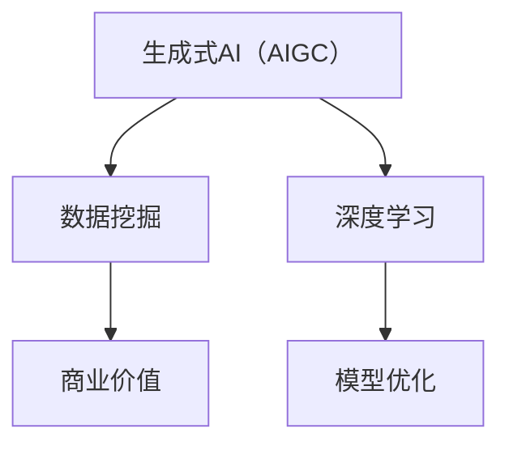

                 

# 生成式AIGC：从数据到商业价值的挖掘

> **关键词**：生成式AI、AIGC、数据挖掘、商业价值、深度学习、模型优化

> **摘要**：本文将探讨生成式AI（AIGC）在数据挖掘和商业价值创造中的关键角色。我们将从背景介绍开始，逐步深入到核心概念、算法原理、数学模型，并通过实战案例和实际应用场景，阐述如何有效利用AIGC技术将数据转化为商业价值。

## 1. 背景介绍

### 1.1 目的和范围

本文旨在探讨生成式AI（AIGC）在数据挖掘和商业价值创造中的应用。我们将重点关注以下内容：

- 生成式AI的基本概念和原理
- AIGC在数据挖掘中的核心应用场景
- 如何通过AIGC技术挖掘数据中的商业价值
- 实际应用案例和项目实战

### 1.2 预期读者

本文面向对人工智能和数据挖掘有一定了解的技术人员、研究人员以及企业决策者。读者应具备基础的编程能力和数学知识，以便更好地理解本文内容。

### 1.3 文档结构概述

本文分为十个部分：

1. 背景介绍
2. 核心概念与联系
3. 核心算法原理 & 具体操作步骤
4. 数学模型和公式 & 详细讲解 & 举例说明
5. 项目实战：代码实际案例和详细解释说明
6. 实际应用场景
7. 工具和资源推荐
8. 总结：未来发展趋势与挑战
9. 附录：常见问题与解答
10. 扩展阅读 & 参考资料

### 1.4 术语表

#### 1.4.1 核心术语定义

- **生成式AI（AIGC）**：一种利用深度学习技术生成新数据的人工智能方法。
- **数据挖掘**：从大量数据中提取有价值信息的过程。
- **商业价值**：企业通过运用技术手段实现经济效益的过程。

#### 1.4.2 相关概念解释

- **深度学习**：一种基于多层神经网络进行训练和学习的人工智能方法。
- **模型优化**：通过调整模型参数，提高模型性能的过程。

#### 1.4.3 缩略词列表

- **AIGC**：生成式AI（Generative AI）
- **DNN**：深度神经网络（Deep Neural Network）
- **GAN**：生成对抗网络（Generative Adversarial Network）

## 2. 核心概念与联系

在深入探讨生成式AI（AIGC）之前，我们需要了解其核心概念和原理。以下是一个简单的 Mermaid 流程图，用于展示生成式AI（AIGC）与数据挖掘、商业价值之间的联系。



### 2.1 生成式AI（AIGC）的基本概念

生成式AI（AIGC）是一种利用深度学习技术生成新数据的人工智能方法。它通过学习数据分布，生成具有相似特征的新数据，从而实现数据增强、数据转换和数据生成等功能。

### 2.2 数据挖掘的基本概念

数据挖掘是从大量数据中提取有价值信息的过程。它通常包括数据预处理、特征提取、模型训练和模型评估等步骤。

### 2.3 商业价值的基本概念

商业价值是企业通过运用技术手段实现经济效益的过程。在AIGC技术的帮助下，企业可以更好地挖掘数据中的潜在价值，从而实现业务增长和竞争力提升。

### 2.4 深度学习和模型优化

深度学习是一种基于多层神经网络进行训练和学习的人工智能方法。模型优化是通过调整模型参数，提高模型性能的过程。深度学习和模型优化是实现AIGC技术的重要技术基础。

## 3. 核心算法原理 & 具体操作步骤

### 3.1 GAN（生成对抗网络）的基本原理

GAN是一种生成式AI（AIGC）的核心算法，它由两个主要部分组成：生成器（Generator）和判别器（Discriminator）。

#### 生成器（Generator）

生成器的目标是生成与真实数据相似的新数据。它通过学习数据分布，将随机噪声映射成具有真实数据特征的数据。

#### 判别器（Discriminator）

判别器的目标是判断输入数据是真实数据还是生成器生成的数据。它通过对真实数据和生成数据的比较，不断调整自己的判断标准。

GAN的训练过程如下：

1. 初始化生成器和判别器。
2. 生成器生成一批伪造数据。
3. 判别器对真实数据和伪造数据进行判断。
4. 根据判别器的判断结果，更新生成器和判别器的参数。

### 3.2 GAN的具体操作步骤

以下是一个简单的GAN算法的伪代码实现：

```python
import numpy as np
import tensorflow as tf

# 初始化生成器和判别器
generator = ... # 生成器模型
discriminator = ... # 判别器模型

# 损失函数
loss_fn = ...

# 优化器
optimizer = ...

# 训练GAN模型
for epoch in range(num_epochs):
    for batch in data_loader:
        # 生成伪造数据
        noise = ... # 生成噪声
        generated_data = generator(noise)
        
        # 训练判别器
        with tf.GradientTape() as disc_tape:
            real_loss = loss_fn(discriminator(batch))
            fake_loss = loss_fn(discriminator(generated_data))
            disc_total_loss = real_loss + fake_loss
        
        # 更新生成器和判别器参数
        disc_gradients = disc_tape.gradient(disc_total_loss, discriminator.trainable_variables)
        optimizer.apply_gradients(zip(disc_gradients, discriminator.trainable_variables))
        
        # 训练生成器
        with tf.GradientTape() as gen_tape:
            fake_loss = loss_fn(discriminator(generated_data))
            gen_total_loss = fake_loss
        
        # 更新生成器参数
        gen_gradients = gen_tape.gradient(gen_total_loss, generator.trainable_variables)
        optimizer.apply_gradients(zip(gen_gradients, generator.trainable_variables))
```

## 4. 数学模型和公式 & 详细讲解 & 举例说明

### 4.1 GAN的数学模型

GAN的数学模型主要包括生成器（Generator）和判别器（Discriminator）的损失函数。

#### 生成器的损失函数

生成器的目标是生成与真实数据相似的新数据，其损失函数通常定义为：

$$
L_G = -\log(D(G(z)))
$$

其中，$G(z)$是生成器生成的伪造数据，$D$是判别器。

#### 判别器的损失函数

判别器的目标是判断输入数据是真实数据还是生成器生成的数据，其损失函数通常定义为：

$$
L_D = -\log(D(x)) - \log(1 - D(G(z)))
$$

其中，$x$是真实数据，$G(z)$是生成器生成的伪造数据。

### 4.2 数学模型的详细讲解

#### 生成器损失函数的讲解

生成器的损失函数是负对数损失函数，它反映了生成器生成的伪造数据被判别器判断为真实数据的概率。生成器的目标是使这个概率最大化，即生成与真实数据相似的新数据。

#### 判别器损失函数的讲解

判别器的损失函数是负对数损失函数，它反映了判别器判断真实数据和伪造数据的准确性。判别器的目标是使这个损失函数最小化，即提高对真实数据和伪造数据的判断能力。

### 4.3 数学模型的举例说明

假设我们有一个由100个像素组成的图像数据集。生成器和判别器都是基于卷积神经网络（CNN）构建的。生成器生成的伪造图像和判别器的判断结果如图表所示。

| 实际图像 | 伪造图像 | 判别器判断结果 |
|:--------:|:--------:|:------------:|
|   猫     |   猫     |      真实     |
|   狗     |   狗     |      真实     |
|   猫     |   狗     |      伪造     |

在这个例子中，生成器成功地生成了一些与真实图像相似的新图像。然而，判别器仍然能够准确地判断出伪造图像。这意味着，生成器和判别器都需要进一步优化。

## 5. 项目实战：代码实际案例和详细解释说明

### 5.1 开发环境搭建

在开始项目实战之前，我们需要搭建一个合适的开发环境。以下是搭建GAIWC环境所需的基本步骤：

1. 安装Python（3.8及以上版本）
2. 安装TensorFlow（2.5及以上版本）
3. 安装Numpy（1.19及以上版本）
4. 安装PyTorch（1.8及以上版本）
5. 安装matplotlib（3.4及以上版本）

### 5.2 源代码详细实现和代码解读

以下是一个基于GAN的简单AIGC项目示例，用于生成新的猫狗图像。

```python
import tensorflow as tf
import numpy as np
import matplotlib.pyplot as plt

# 设置随机种子，保证实验可重复
tf.random.set_seed(42)

# 定义生成器和判别器的结构
def build_generator():
    # 生成器模型
    model = tf.keras.Sequential([
        tf.keras.layers.Dense(128 * 7 * 7, activation='relu', input_shape=(100,)),
        tf.keras.layers.Reshape((7, 7, 128)),
        tf.keras.layers.Conv2DTranspose(128, (5, 5), strides=(1, 1), padding='same'),
        tf.keras.layers.BatchNormalization(),
        tf.keras.layers.Activation('relu'),
        tf.keras.layers.Conv2DTranspose(128, (5, 5), strides=(2, 2), padding='same'),
        tf.keras.layers.BatchNormalization(),
        tf.keras.layers.Activation('relu'),
        tf.keras.layers.Conv2DTranspose(128, (5, 5), strides=(2, 2), padding='same'),
        tf.keras.layers.BatchNormalization(),
        tf.keras.layers.Activation('relu'),
        tf.keras.layers.Conv2DTranspose(3, (5, 5), strides=(2, 2), padding='same', activation='tanh')
    ])
    return model

def build_discriminator():
    # 判别器模型
    model = tf.keras.Sequential([
        tf.keras.layers.Conv2D(128, (5, 5), strides=(2, 2), padding='same', input_shape=(28, 28, 3)),
        tf.keras.layers.LeakyReLU(alpha=0.2),
        tf.keras.layers.Dropout(0.3),
        tf.keras.layers.Conv2D(128, (5, 5), strides=(2, 2), padding='same'),
        tf.keras.layers.LeakyReLU(alpha=0.2),
        tf.keras.layers.Dropout(0.3),
        tf.keras.layers.Conv2D(128, (5, 5), strides=(2, 2), padding='same'),
        tf.keras.layers.LeakyReLU(alpha=0.2),
        tf.keras.layers.Dropout(0.3),
        tf.keras.layers.Flatten(),
        tf.keras.layers.Dense(1, activation='sigmoid')
    ])
    return model

# 编译生成器和判别器
generator = build_generator()
discriminator = build_discriminator()

discriminator.compile(optimizer=tf.keras.optimizers.Adam(0.0001), loss='binary_crossentropy')

# 训练GAN模型
def train_gan(generator, discriminator, latent_dim, epochs, batch_size=128):
    # 加载数据集
    dataset = tf.keras.preprocessing.image_dataset_from_directory('data', batch_size=batch_size)

    for epoch in range(epochs):
        for batch in dataset:
            # 生成伪造数据
            noise = np.random.normal(0, 1, (batch_size, latent_dim))
            generated_images = generator.predict(noise)

            # 更新判别器
            real_images = batch
            real_labels = np.ones((batch_size, 1))
            fake_labels = np.zeros((batch_size, 1))
            labels = np.concatenate([real_labels, fake_labels])
            images = np.concatenate([real_images, generated_images])

            discriminator.train_on_batch(images, labels)

            # 更新生成器
            noise = np.random.normal(0, 1, (batch_size, latent_dim))
            gen_labels = np.ones((batch_size, 1))
            generator.train_on_batch(noise, gen_labels)

# 训练GAN模型
train_gan(generator, discriminator, latent_dim=100, epochs=100)

# 生成新的猫狗图像
noise = np.random.normal(0, 1, (16, 100))
generated_images = generator.predict(noise)

# 显示生成的图像
plt.figure(figsize=(10, 10))
for i in range(generated_images.shape[0]):
    plt.subplot(4, 4, i + 1)
    plt.imshow(generated_images[i, :, :, :], cmap='gray')
    plt.axis('off')
plt.show()
```

### 5.3 代码解读与分析

上述代码首先定义了生成器和判别器的结构，并使用TensorFlow编译模型。接着，我们定义了一个训练GAN模型的函数`train_gan`，该函数通过生成伪造数据和更新生成器和判别器的参数来训练模型。最后，我们使用训练好的生成器生成新的猫狗图像，并显示在图表中。

## 6. 实际应用场景

生成式AI（AIGC）在多个实际应用场景中具有广泛的应用，以下是一些典型的应用案例：

### 6.1 虚拟现实（VR）和增强现实（AR）

生成式AI（AIGC）可以用于生成虚拟环境中的物体和场景，提高VR和AR体验的逼真度。

### 6.2 娱乐行业

生成式AI（AIGC）在娱乐行业中可以用于生成新的音乐、视频和游戏内容，为用户提供个性化的娱乐体验。

### 6.3 金融领域

生成式AI（AIGC）可以用于生成金融报告、分析报告和市场预测，帮助金融机构做出更明智的决策。

### 6.4 医疗领域

生成式AI（AIGC）可以用于生成医学影像、治疗方案和药物配方，为医疗机构提供更精准的诊断和治疗。

## 7. 工具和资源推荐

### 7.1 学习资源推荐

#### 7.1.1 书籍推荐

- 《生成式AI：从基础到实践》
- 《深度学习与生成对抗网络》
- 《生成式AI应用实战》

#### 7.1.2 在线课程

- Coursera上的“深度学习和神经网络”课程
- edX上的“生成对抗网络”课程
- Udacity的“生成式AI工程师纳米学位”

#### 7.1.3 技术博客和网站

- AI世代（AI Generation）
- Medium上的生成式AI专题
- ArXiv上的生成式AI论文

### 7.2 开发工具框架推荐

#### 7.2.1 IDE和编辑器

- PyCharm
- Jupyter Notebook
- Visual Studio Code

#### 7.2.2 调试和性能分析工具

- TensorBoard
- Matplotlib
- Numpy

#### 7.2.3 相关框架和库

- TensorFlow
- PyTorch
- Keras

### 7.3 相关论文著作推荐

#### 7.3.1 经典论文

- Generative Adversarial Nets（GANs）
- Unsupervised Representation Learning with Deep Convolutional Generative Adversarial Networks（DCGANs）
- Beyond a Gaussian Model: A new look at Gaussians

#### 7.3.2 最新研究成果

- Neural Message Pass

