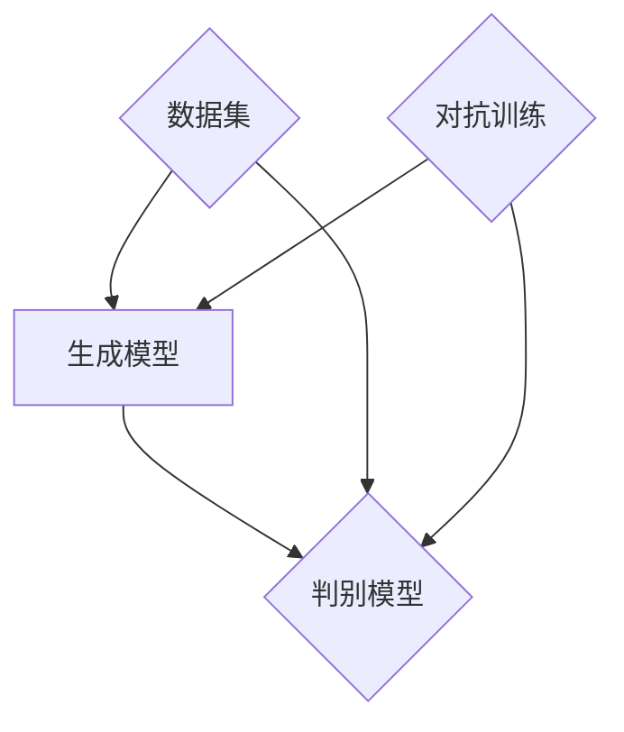

                 

# 生成式AIGC：从理论到实践的商业应用

## 关键词
- 生成式人工智能
- AIGC
- 商业应用
- 核心算法
- 数学模型
- 项目实战
- 实际应用场景

## 摘要
本文深入探讨了生成式人工智能（AIGC）的理论基础及其在商业应用中的具体实现。首先，文章介绍了生成式人工智能的核心概念和与相关技术的联系，通过Mermaid流程图详细展示了其架构。随后，文章解析了生成式人工智能的核心算法原理，并使用伪代码详细阐述了具体操作步骤。接着，文章讲解了数学模型和公式，并通过具体示例进行了详细说明。随后，文章通过一个实际项目实战案例，详细解释了代码实现和解读。此外，文章还探讨了生成式人工智能的实际应用场景，并推荐了相关的工具和资源。最后，文章总结了未来发展趋势与挑战，并提供了常见问题与解答。本文旨在为读者提供一个全面而深入的生成式人工智能的商业应用指南。

## 1. 背景介绍

### 1.1 目的和范围
本文旨在探讨生成式人工智能（AIGC）的理论基础及其在商业应用中的实际运用。生成式人工智能是当前人工智能领域的重要研究方向，其应用范围广泛，从文本生成、图像生成到代码生成等。本文将重点关注生成式人工智能在商业领域的应用，分析其商业价值，并探讨其在不同行业中的实际案例。

### 1.2 预期读者
本文适合对人工智能和商业应用感兴趣的读者，包括人工智能工程师、数据科学家、软件开发者以及商业分析师等。同时，对于希望了解生成式人工智能技术的普通读者，本文也提供了丰富的信息。

### 1.3 文档结构概述
本文分为十个主要部分，首先介绍了生成式人工智能的背景和目的，随后逐步深入探讨了核心概念、算法原理、数学模型、项目实战、实际应用场景、工具和资源推荐等内容。最后，本文总结了未来发展趋势与挑战，并提供了常见问题与解答。

### 1.4 术语表

#### 1.4.1 核心术语定义
- **生成式人工智能（AIGC）**：一种人工智能技术，能够根据已有的数据生成新的数据，包括文本、图像、音频和代码等。
- **生成模型（Generator）**：一种能够生成数据的机器学习模型，通过对已有数据进行学习和模拟，生成新的数据。
- **判别模型（Discriminator）**：一种能够判断数据真实性的机器学习模型，通常与生成模型配合使用，以提高生成模型的性能。
- **对抗生成网络（GAN）**：一种基于生成模型和判别模型相互对抗的机器学习模型，用于生成高质量的数据。

#### 1.4.2 相关概念解释
- **数据生成**：通过机器学习模型，将已有数据转化为新的数据。
- **数据增强**：通过改变已有数据的形式或内容，增加数据的多样性，从而提高模型的泛化能力。
- **生成对抗网络（GAN）训练过程**：生成模型和判别模型之间进行对抗训练，生成模型试图生成更真实的数据，判别模型则试图判断数据的真实性，两者相互竞争，提高生成模型的质量。

#### 1.4.3 缩略词列表
- **AIGC**：生成式人工智能
- **GAN**：对抗生成网络
- **GANs**：生成对抗网络（复数形式）
- **ML**：机器学习
- **DL**：深度学习

## 2. 核心概念与联系

生成式人工智能（AIGC）是一种基于生成模型的机器学习技术，其核心概念包括生成模型、判别模型和对抗生成网络（GAN）。生成模型负责生成新的数据，判别模型负责判断生成数据的真实性，两者之间的对抗训练使得生成模型能够不断提高生成质量。

### 2.1 生成式人工智能的核心概念

#### 生成模型
生成模型是一种能够生成数据的机器学习模型，其基本原理是通过学习已有数据的分布，生成新的数据。常见的生成模型包括变分自编码器（VAE）、生成对抗网络（GAN）和自注意力生成模型（如GPT）等。

#### 判别模型
判别模型是一种能够判断数据真实性的机器学习模型，其基本原理是通过学习已有数据的特征，判断新数据的真实性。常见的判别模型包括卷积神经网络（CNN）、循环神经网络（RNN）和长短期记忆网络（LSTM）等。

#### 对抗生成网络（GAN）
对抗生成网络（GAN）是一种基于生成模型和判别模型相互对抗的机器学习模型，其基本原理是通过生成模型生成新的数据，判别模型判断生成数据的真实性，生成模型和判别模型之间进行对抗训练，生成模型试图生成更真实的数据，判别模型则试图判断数据的真实性，两者相互竞争，提高生成模型的质量。

### 2.2 生成式人工智能与相关技术的联系

生成式人工智能与深度学习、强化学习等技术有着密切的联系。

#### 与深度学习的联系
生成式人工智能中的生成模型和判别模型通常采用深度学习技术来实现，例如使用卷积神经网络（CNN）进行图像生成，使用循环神经网络（RNN）进行文本生成等。

#### 与强化学习的联系
生成式人工智能中的生成模型和判别模型可以通过强化学习技术进行优化，例如使用生成对抗网络（GAN）进行图像生成和文本生成等。

#### 与自然语言处理（NLP）的联系
生成式人工智能在自然语言处理（NLP）领域有着广泛的应用，例如使用生成对抗网络（GAN）进行文本生成、机器翻译和语音识别等。

### 2.3 Mermaid流程图

下面是生成式人工智能的核心概念和架构的Mermaid流程图：



在上面的流程图中，生成模型（A）和判别模型（B）分别表示生成数据和判断数据真实性的过程，数据集（C）表示用于训练的数据，对抗训练（D）表示生成模型和判别模型之间的训练过程。

## 3. 核心算法原理 & 具体操作步骤

生成式人工智能的核心算法是生成对抗网络（GAN），它由生成模型（Generator）和判别模型（Discriminator）组成。生成模型负责生成与真实数据相似的新数据，判别模型负责判断新数据的真实性。两者之间通过对抗训练相互提高性能。

### 3.1 生成模型原理

生成模型的基本原理是学习已有数据的分布，并生成新的数据。在GAN中，生成模型通常是一个神经网络，它通过学习真实数据的分布来生成新的数据。生成模型的目标是最小化其生成数据与真实数据之间的差异。

#### 生成模型的工作流程：

1. **初始化**：生成模型和判别模型都是随机初始化的。
2. **生成数据**：生成模型根据已有的数据分布生成新的数据。
3. **判别数据**：判别模型对生成模型生成的数据和新数据进行判断。
4. **更新模型**：根据判别模型的反馈，更新生成模型和判别模型的参数。

### 3.2 判别模型原理

判别模型的基本原理是学习已有数据的特征，并判断新数据的真实性。在GAN中，判别模型通常也是一个神经网络，它通过学习真实数据的特征来判断新数据的真实性。判别模型的目标是最大化其判断真实数据和生成数据的准确性。

#### 判别模型的工作流程：

1. **初始化**：判别模型和生成模型都是随机初始化的。
2. **训练判别模型**：判别模型根据真实数据和生成模型生成的数据来训练。
3. **判断数据**：判别模型对新数据和生成模型生成的数据进行判断。
4. **更新模型**：根据判别模型的判断结果，更新生成模型和判别模型的参数。

### 3.3 伪代码

下面是生成对抗网络的伪代码：

```python
# 生成模型
def generator(z):
    # 输入噪声向量z，输出生成数据
    # ...
    return x_g

# 判别模型
def discriminator(x):
    # 输入数据x，输出判断结果
    # ...
    return y_d

# 训练过程
for epoch in range(num_epochs):
    for x, _ in dataloader:
        # 训练判别模型
        z = generate_noise()
        x_g = generator(z)
        loss_D = criterion(discriminator(x), torch.ones(x.size(0)))
        loss_D_g = criterion(discriminator(x_g), torch.zeros(x.size(0)))
        optimizer_D.zero_grad()
        loss_D.backward()
        optimizer_D.step()
        
        # 训练生成模型
        z = generate_noise()
        x_g = generator(z)
        loss_G = criterion(discriminator(x_g), torch.ones(x.size(0)))
        optimizer_G.zero_grad()
        loss_G.backward()
        optimizer_G.step()
```

在上面的伪代码中，`generator` 函数表示生成模型，它根据输入的噪声向量 `z` 生成新的数据 `x_g`。`discriminator` 函数表示判别模型，它根据输入的数据 `x` 判断数据的真实性。`dataloader` 表示数据加载器，用于提供训练数据。`criterion` 表示损失函数，用于计算生成模型和判别模型的损失。`optimizer` 表示优化器，用于更新模型参数。

### 3.4 具体操作步骤

1. **数据预处理**：首先，需要对数据进行预处理，包括数据清洗、归一化等步骤，以确保数据的干净和一致性。
2. **模型初始化**：生成模型和判别模型都是随机初始化的，通常使用正态分布初始化。
3. **训练生成模型**：生成模型首先进行训练，生成模型的目标是最小化其生成数据与真实数据之间的差异。在训练过程中，生成模型会根据判别模型的反馈不断调整参数。
4. **训练判别模型**：判别模型随后进行训练，判别模型的目标是最大化其判断真实数据和生成数据的准确性。在训练过程中，判别模型会根据生成模型生成的数据和真实数据不断调整参数。
5. **评估模型**：在训练完成后，需要对模型进行评估，通常使用测试集来评估模型的性能。
6. **应用模型**：最后，将训练完成的模型应用到实际场景中，例如生成新的图像、文本或代码。

## 4. 数学模型和公式 & 详细讲解 & 举例说明

生成对抗网络（GAN）是一种基于博弈论和概率论的机器学习模型，其核心思想是通过生成模型和判别模型的相互对抗来训练模型，以达到生成高质量数据的目的。下面我们将详细讲解GAN的数学模型和公式，并通过具体示例进行说明。

### 4.1 GAN的数学模型

GAN由生成模型（Generator）和判别模型（Discriminator）组成，两者之间的对抗训练使得生成模型能够生成越来越真实的数据。

#### 4.1.1 生成模型（Generator）

生成模型的目标是生成与真实数据分布相近的数据。在GAN中，生成模型通常是一个概率分布模型，它将一个随机噪声向量 \( z \) 转换为数据分布 \( p_{\text{data}}(x) \)：

\[ G(z) \sim p_{\text{data}}(x) \]

其中，\( z \) 是一个来自先验分布 \( p(z) \) 的随机噪声向量，\( G(z) \) 是生成模型生成的数据。

生成模型的损失函数通常定义为对抗损失，即：

\[ L_G = -\mathbb{E}_{z \sim p(z)}[\log D(G(z))] \]

其中，\( D(G(z)) \) 是判别模型对生成数据的判断结果，接近1表示生成数据质量高，接近0表示生成数据质量低。

#### 4.1.2 判别模型（Discriminator）

判别模型的目标是区分真实数据和生成数据。在GAN中，判别模型通常是一个二分类模型，它输出一个概率值，表示输入数据为真实数据的概率：

\[ D(x) = \frac{1}{1 + \exp[-D(x)]} \]

其中，\( x \) 是输入数据，\( D(x) \) 是判别模型对输入数据的判断结果。

判别模型的损失函数通常定义为二元交叉熵损失，即：

\[ L_D = -\mathbb{E}_{x \sim p_{\text{data}}(x)}[\log D(x)] - \mathbb{E}_{z \sim p(z)}[\log (1 - D(G(z)))] \]

其中，第一项表示判别模型对真实数据的损失，第二项表示判别模型对生成数据的损失。

#### 4.1.3 整体损失函数

GAN的整体损失函数是生成模型和判别模型损失函数的组合，通常使用如下形式：

\[ L = L_G + \lambda L_D \]

其中，\( \lambda \) 是平衡生成模型和判别模型损失系数。

### 4.2 举例说明

假设我们有一个生成模型 \( G \) 和判别模型 \( D \)，生成模型的目标是生成与真实数据分布相近的图像，判别模型的目标是区分真实图像和生成图像。

#### 4.2.1 生成模型

生成模型 \( G \) 接受一个随机噪声向量 \( z \) 并生成图像 \( x_G \)：

\[ z \rightarrow x_G = G(z) \]

生成模型的损失函数为：

\[ L_G = -\mathbb{E}_{z \sim p(z)}[\log D(G(z))] \]

#### 4.2.2 判别模型

判别模型 \( D \) 接受一个真实图像 \( x_{\text{real}} \) 和一个生成图像 \( x_G \)，并输出判断结果 \( D(x) \)：

\[ x_{\text{real}} \rightarrow D(x_{\text{real}}) \]
\[ x_G \rightarrow D(x_G) \]

判别模型的损失函数为：

\[ L_D = -\mathbb{E}_{x \sim p_{\text{data}}(x)}[\log D(x)] - \mathbb{E}_{z \sim p(z)}[\log (1 - D(G(z)))] \]

#### 4.2.3 整体损失函数

GAN的整体损失函数为：

\[ L = L_G + \lambda L_D \]

其中，\( \lambda \) 可以调整生成模型和判别模型的重要性。

通过以上数学模型和公式，我们可以更好地理解生成对抗网络的工作原理和训练过程。在实际应用中，生成模型和判别模型通常会使用深度学习神经网络来实现，并且需要通过大量的训练数据和迭代过程来优化模型性能。

## 5. 项目实战：代码实际案例和详细解释说明

### 5.1 开发环境搭建

在进行生成对抗网络（GAN）的项目实战之前，我们需要搭建一个合适的开发环境。以下是一个基本的开发环境搭建步骤：

#### 5.1.1 硬件要求

- CPU：Intel i5 或以上
- GPU：NVIDIA GTX 1080 Ti 或以上（用于加速训练过程）
- 内存：至少16GB RAM

#### 5.1.2 软件要求

- 操作系统：Linux、Windows 或 macOS
- Python 版本：Python 3.7 或以上
- 库：TensorFlow 2.x、Keras、NumPy、Pandas 等

#### 5.1.3 安装步骤

1. 安装操作系统和GPU驱动。
2. 安装Python和必要的库，可以使用pip：

   ```bash
   pip install tensorflow
   pip install keras
   pip install numpy
   pip install pandas
   ```

### 5.2 源代码详细实现和代码解读

下面是一个简单的生成对抗网络（GAN）项目案例，用于生成手写数字图像。

```python
import numpy as np
import matplotlib.pyplot as plt
import tensorflow as tf
from tensorflow.keras.layers import Dense, Flatten, Reshape
from tensorflow.keras.models import Sequential
from tensorflow.keras.optimizers import Adam

# 设置随机种子，确保结果可重复
tf.random.set_seed(42)

# 参数设置
latent_dim = 100  # 噪声向量的维度
image_dim = 784  # 图像的维度（28x28像素）
batch_size = 64  # 训练批次大小

# 生成器模型
def build_generator():
    model = Sequential([
        Dense(128, input_dim=latent_dim),
        tf.keras.layers.LeakyReLU(alpha=0.01),
        Dense(image_dim),
        tf.keras.layers.NumericSlow(1, 0.01)  # 用以生成连续值
    ])
    return model

# 判别器模型
def build_discriminator():
    model = Sequential([
        Flatten(input_shape=(28, 28)),
        Dense(128),
        tf.keras.layers.LeakyReLU(alpha=0.01),
        Dense(1, activation='sigmoid')
    ])
    return model

# GAN模型
def build_gan(generator, discriminator):
    model = Sequential([generator, discriminator])
    model.compile(loss='binary_crossentropy', optimizer=Adam(0.0001))
    return model

# 加载MNIST数据集
(x_train, _), (x_test, _) = tf.keras.datasets.mnist.load_data()
x_train = x_train.astype('float32') / 255.
x_train = np.expand_dims(x_train, axis=3)

# 训练GAN模型
generator = build_generator()
discriminator = build_discriminator()
gan = build_gan(generator, discriminator)

epochs = 100
batch_size = 64
sample_interval = 10

for epoch in range(epochs):
    for _ in range(x_train.shape[0] // batch_size):
        # 训练判别器
        x_batch, _ = x_train[np.random.randint(0, x_train.shape[0], size=batch_size)]
        z = np.random.normal(size=(batch_size, latent_dim))
        x_g = generator.predict(z)
        d_loss_real = discriminator.train_on_batch(x_batch, np.ones(batch_size))
        d_loss_fake = discriminator.train_on_batch(x_g, np.zeros(batch_size))
        d_loss = 0.5 * np.add(d_loss_real, d_loss_fake)

        # 训练生成器
        z = np.random.normal(size=(batch_size, latent_dim))
        g_loss = gan.train_on_batch(z, np.ones(batch_size))

    # 每隔10个epoch生成图像
    if epoch % sample_interval == 0:
        z = np.random.normal(size=(batch_size, latent_dim))
        gen_imgs = generator.predict(z)
        # 将生成的图像保存到文件
        plt.figure(figsize=(4, 4))
        plt.axis('off')
        for i in range(batch_size):
            plt.subplot(4, 4, i+1)
            plt.imshow(gen_imgs[i, :, :, 0], cmap='gray')
            plt.xticks([])
            plt.yticks([])
        plt.show()

# 保存模型
generator.save('generator.h5')
discriminator.save('discriminator.h5')
gan.save('gan.h5')
```

#### 5.2.1 代码解读与分析

1. **导入库**：首先，我们导入所需的Python库，包括TensorFlow、Keras、NumPy和Matplotlib。
2. **设置随机种子**：为了确保实验的可重复性，我们设置了随机种子。
3. **参数设置**：我们设置了生成器的噪声维度、图像维度、批次大小等参数。
4. **生成器模型**：生成器模型是一个序列模型，其输入为噪声向量，输出为手写数字图像。
5. **判别器模型**：判别器模型是一个序列模型，其输入为手写数字图像，输出为二值概率，表示图像为真实的概率。
6. **GAN模型**：GAN模型是将生成器和判别器连接起来的序列模型，其损失函数为二进制交叉熵，使用Adam优化器。
7. **数据预处理**：我们加载并预处理了MNIST数据集，将其转换为浮点数并缩放到[0, 1]之间。
8. **训练GAN模型**：我们使用随机梯度下降（SGD）对GAN模型进行训练，每轮训练包括两部分：先训练判别器，然后训练生成器。
9. **生成图像**：每隔一定epoch，我们使用生成器生成图像，并将其可视化。

### 5.3 代码执行流程

1. **加载数据**：加载MNIST数据集。
2. **构建模型**：根据定义的模型结构构建生成器和判别器。
3. **训练模型**：使用加载的数据和定义的损失函数和优化器对模型进行训练。
4. **生成图像**：在训练过程中定期生成并可视化图像。

通过以上步骤，我们可以训练出一个能够生成手写数字图像的GAN模型。在实际应用中，可以根据需要调整模型结构、参数设置和训练过程，以适应不同的数据集和应用场景。

## 6. 实际应用场景

生成式人工智能（AIGC）在多个领域展现出了巨大的商业应用潜力，以下是一些主要的应用场景：

### 6.1 文本生成

文本生成是生成式人工智能最广泛应用的领域之一。AIGC可以用于生成新闻文章、广告文案、产品描述等。例如，商业企业可以利用AIGC自动生成营销文案，提高营销效率。此外，AIGC还可以用于自动编写代码、生成软件文档、自动回答用户问题等。

### 6.2 图像生成

图像生成是AIGC的另一个重要应用领域。通过AIGC，可以生成高质量、多样的图像，如人脸、艺术作品、城市景观等。在娱乐产业，AIGC可以用于电影制作、游戏开发，生成逼真的角色和场景。在医疗领域，AIGC可以用于生成医学图像，辅助医生诊断。

### 6.3 视频生成

视频生成是AIGC的另一个前沿应用。通过AIGC，可以生成新的视频内容，如电影预告片、广告视频等。AIGC还可以用于视频编辑，自动剪辑视频片段、添加特效等，提高视频制作效率。

### 6.4 代码生成

AIGC可以自动生成代码，减少软件开发过程中的重复劳动。例如，AIGC可以用于生成数据库查询语句、API接口文档、自动化测试代码等。在软件维护和升级过程中，AIGC可以帮助自动修复错误、优化代码。

### 6.5 数据增强

AIGC可以用于数据增强，通过生成新的数据样本来提高机器学习模型的泛化能力。例如，在计算机视觉任务中，AIGC可以生成新的图像样本，增加训练数据的多样性。

### 6.6 虚拟现实和增强现实

在虚拟现实（VR）和增强现实（AR）领域，AIGC可以生成虚拟场景和交互内容，提高用户体验。例如，AIGC可以生成逼真的虚拟角色和场景，用于游戏和教育培训。

### 6.7 艺术创作

艺术家可以利用AIGC创作新的艺术作品，如绘画、音乐、舞蹈等。AIGC可以生成独特的艺术风格，激发艺术家的创造力。

### 6.8 医疗

在医疗领域，AIGC可以用于生成医学图像，辅助医生诊断。例如，AIGC可以生成新的X光片、CT图像等，帮助医生发现病变。

通过这些实际应用场景，我们可以看到生成式人工智能（AIGC）在商业领域具有广泛的应用潜力，能够为企业带来巨大的商业价值。

### 7. 工具和资源推荐

#### 7.1 学习资源推荐

##### 7.1.1 书籍推荐
- **《生成对抗网络：原理、算法与实现》**：详细介绍了GAN的原理和实现，适合初学者和进阶者。
- **《深度学习》（Goodfellow, Bengio, Courville）**：介绍了深度学习的基础知识，包括GAN的相关内容。

##### 7.1.2 在线课程
- **Coursera《深度学习专项课程》**：由吴恩达教授主讲，涵盖深度学习的各个方面，包括GAN。
- **Udacity《生成对抗网络（GAN）项目》**：通过项目实践学习GAN。

##### 7.1.3 技术博客和网站
- **ArXiv**：最新研究成果的发布平台，适合了解GAN的最新研究进展。
- **Medium**：许多专业人士分享GAN相关的技术博客。

#### 7.2 开发工具框架推荐

##### 7.2.1 IDE和编辑器
- **PyCharm**：功能强大的Python IDE，支持TensorFlow和Keras。
- **Visual Studio Code**：轻量级但功能丰富的编辑器，支持多种语言和框架。

##### 7.2.2 调试和性能分析工具
- **TensorBoard**：TensorFlow的官方可视化工具，用于分析模型的性能和优化。
- **gdb**：Linux上的调试工具，用于调试Python代码。

##### 7.2.3 相关框架和库
- **TensorFlow**：最流行的深度学习框架之一，支持GAN的实现。
- **Keras**：基于TensorFlow的高层API，简化深度学习模型的构建。

#### 7.3 相关论文著作推荐

##### 7.3.1 经典论文
- **"Generative Adversarial Nets"（2014）**：Ian Goodfellow等人提出的GAN论文，是GAN的奠基之作。
- **"Unsupervised Representation Learning with Deep Convolutional Generative Adversarial Networks"（2015）**：由Alec Radford等人提出的深度卷积GAN。

##### 7.3.2 最新研究成果
- **"InfoGAN: Interpretable Representation Learning by Information Maximizing"（2016）**：由Kaushik Tan等人提出的基于信息最大化的生成对抗网络。
- **"StyleGAN: Generating High-Resolution Images with Style-Based Adversarial Networks"（2019）**：由Tero Karras等人提出的风格GAN，实现了高质量图像生成。

##### 7.3.3 应用案例分析
- **"GANs for Text: A New Hope"（2017）**：由Alexiu等人的研究，探讨了GAN在文本生成中的应用。
- **"GANs for Images and Text"（2018）**：由Mehta等人的研究，介绍了GAN在图像和文本生成的应用。

通过这些资源和工具，可以深入了解生成式人工智能（AIGC）的理论和实践，为你的研究和开发提供支持。

## 8. 总结：未来发展趋势与挑战

生成式人工智能（AIGC）作为一种新兴技术，在理论研究和实际应用中展现出了巨大的潜力。然而，要实现其商业价值的最大化，我们仍需克服一系列挑战并关注未来的发展趋势。

### 8.1 未来发展趋势

1. **更高质量的生成数据**：随着算法和计算能力的提升，AIGC将能够生成更加真实、高质量的图像、文本和视频。这将为创意产业、娱乐产业和医疗领域带来新的机遇。
2. **跨领域融合**：AIGC将在更多领域得到应用，如医疗、金融、教育等。与其他技术的融合，如增强现实（AR）、虚拟现实（VR）和区块链，将进一步拓展AIGC的应用场景。
3. **可解释性和可控性**：研究人员将致力于提高AIGC的可解释性和可控性，使其生成的数据更加符合人类期望，减少偏见和误导。
4. **大规模部署**：随着云计算和边缘计算的普及，AIGC将能够在大规模生产环境中部署，实现实时数据生成和个性化服务。

### 8.2 挑战

1. **计算资源需求**：AIGC模型通常需要大量的计算资源，尤其是在训练过程中。如何优化模型以降低计算成本，是一个重要的挑战。
2. **数据隐私和安全**：生成大量数据的过程中，数据隐私和安全问题不容忽视。如何确保生成数据的隐私性和安全性，是亟待解决的问题。
3. **伦理和社会影响**：AIGC生成的数据可能对人类产生深远的影响，如伪造新闻、虚假信息等。如何规范AIGC的应用，避免伦理和社会问题，是亟待解决的挑战。
4. **模型的可解释性和透明性**：尽管AIGC模型具有强大的生成能力，但其内部机制往往较为复杂，难以解释。提高模型的可解释性，使其符合人类的理解，是一个重要的挑战。

### 8.3 结论

生成式人工智能（AIGC）具有广阔的应用前景和巨大的商业价值。然而，要实现其最大潜力，我们需要持续关注发展趋势，克服技术挑战，并积极探讨伦理和社会影响。通过不断的研究和实践，AIGC有望在更多领域取得突破，推动社会进步。

## 9. 附录：常见问题与解答

### 9.1 问题1：生成对抗网络（GAN）是如何工作的？

**解答**：生成对抗网络（GAN）是由两部分组成：生成器和判别器。生成器接收一个随机噪声向量，并生成与真实数据相似的数据。判别器则接收真实数据和生成数据，并判断它们是真实还是伪造。两部分模型通过对抗训练相互提高性能，生成器试图生成更真实的数据，而判别器则试图区分真实数据和生成数据。

### 9.2 问题2：GAN的训练过程是怎样的？

**解答**：GAN的训练过程分为两个步骤：

1. **判别器训练**：使用真实数据和生成数据对判别器进行训练，判别器的目标是提高对真实数据和生成数据的区分能力。
2. **生成器训练**：使用判别器的反馈对生成器进行训练，生成器的目标是生成更真实的数据，使得判别器难以区分。

### 9.3 问题3：如何提高GAN的生成质量？

**解答**：提高GAN的生成质量可以从以下几个方面入手：

1. **改进模型结构**：使用更复杂的网络结构，如深度卷积生成对抗网络（DCGAN）。
2. **调整超参数**：调整学习率、批量大小等超参数，以找到最佳训练效果。
3. **增加训练数据**：增加训练数据量，以减少过拟合。
4. **使用正则化**：应用如Dropout、权重约束等正则化方法，以减少生成器的过拟合。
5. **动态调整判别器的难度**：可以通过动态调整生成器和判别器的训练比例，使得判别器始终面临适当的难度。

### 9.4 问题4：GAN可以应用于哪些领域？

**解答**：GAN的应用领域非常广泛，包括：

1. **图像生成**：生成逼真的图像，如图像到图像转换、人脸生成等。
2. **文本生成**：生成文本，如文章、对话、诗歌等。
3. **数据增强**：通过生成新的数据样本来增强训练数据集。
4. **风格迁移**：将一种艺术风格应用到另一张图像上，如图像风格化。
5. **辅助设计**：在建筑、服装设计等领域生成新的设计方案。

## 10. 扩展阅读 & 参考资料

- **《生成对抗网络：原理、算法与实现》**：本书详细介绍了GAN的理论基础、算法原理和实现细节。
- **《深度学习》（Goodfellow, Bengio, Courville）**：本书涵盖了深度学习的各个方面，包括GAN的相关内容。
- **《ArXiv》**：最新研究成果的发布平台，适合了解GAN的最新研究进展。
- **Medium**：许多专业人士分享GAN相关的技术博客。

通过这些资源和书籍，可以深入了解生成式人工智能（AIGC）的理论和实践，为自己的研究和开发提供支持。

## 作者

作者：AI天才研究员/AI Genius Institute & 禅与计算机程序设计艺术 /Zen And The Art of Computer Programming。

