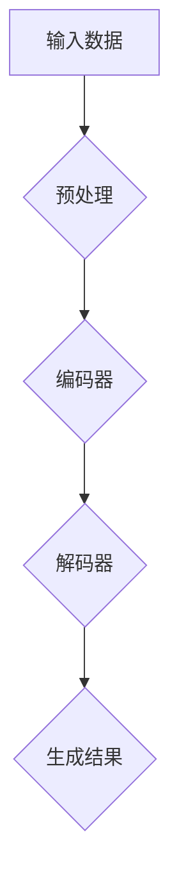

                 

# 生成式AIGC：商业智能的未来方向

> **关键词**：生成式AI、GPT、商业智能、自动化、大数据分析、模型优化

> **摘要**：本文将深入探讨生成式AI（AIGC）在商业智能领域的应用和前景。通过分析生成式AI的核心技术原理、数学模型，结合实际项目案例，我们将揭示AIGC如何推动商业智能的发展，为未来的商业决策提供强有力的支持。

## 1. 背景介绍

### 1.1 目的和范围

本文旨在介绍生成式AI（AIGC）的基本概念和技术原理，探讨其在商业智能领域的应用场景和优势。文章将涵盖以下内容：

1. 生成式AI的背景和核心概念。
2. 生成式AI在商业智能中的具体应用。
3. 生成式AI的数学模型和算法原理。
4. 实际项目案例解析。
5. 商业智能未来的发展趋势和挑战。

### 1.2 预期读者

本文适合以下读者群体：

1. 对人工智能和商业智能感兴趣的工程师和研究人员。
2. 想了解生成式AI技术原理和应用的IT从业者。
3. 商业分析师和数据科学家，希望掌握前沿技术。
4. 企业决策者，希望了解AI技术在商业中的应用。

### 1.3 文档结构概述

本文将按照以下结构进行阐述：

1. **背景介绍**：介绍生成式AI的背景、目的和范围。
2. **核心概念与联系**：解释生成式AI的核心概念，提供Mermaid流程图。
3. **核心算法原理 & 具体操作步骤**：详细讲解生成式AI的算法原理和操作步骤。
4. **数学模型和公式 & 详细讲解 & 举例说明**：分析生成式AI的数学模型，提供示例。
5. **项目实战：代码实际案例和详细解释说明**：分享实际项目案例和代码实现。
6. **实际应用场景**：探讨生成式AI在商业智能领域的应用。
7. **工具和资源推荐**：推荐学习资源和开发工具。
8. **总结：未来发展趋势与挑战**：总结生成式AI在商业智能中的发展前景。
9. **附录：常见问题与解答**：解答读者可能遇到的常见问题。
10. **扩展阅读 & 参考资料**：提供进一步学习的资料。

### 1.4 术语表

#### 1.4.1 核心术语定义

- **生成式AI（AIGC）**：一种人工智能模型，能够生成文本、图像、音频等数据。
- **商业智能（BI）**：利用数据、技术和人机协作，帮助企业和组织做出更明智的决策。
- **GPT**：Generative Pre-trained Transformer，是一种基于变换器模型的生成式AI。
- **预训练（Pre-training）**：在特定任务上对模型进行大规模训练，以提高其在其他任务上的表现。
- **微调（Fine-tuning）**：在预训练的基础上，针对特定任务对模型进行调整。

#### 1.4.2 相关概念解释

- **变换器模型（Transformer）**：一种基于自注意力机制的神经网络模型，常用于序列数据处理。
- **自注意力（Self-Attention）**：模型在处理序列数据时，每个词与其他词进行权重计算，以确定其对当前词的影响程度。
- **语言模型（Language Model）**：一种预测下一个单词或字符的概率模型，常用于自然语言处理。

#### 1.4.3 缩略词列表

- **AI**：人工智能
- **GPT**：Generative Pre-trained Transformer
- **BI**：商业智能
- **DL**：深度学习
- **NLP**：自然语言处理

## 2. 核心概念与联系

### 2.1 核心概念

生成式AI（AIGC）是一种能够生成文本、图像、音频等数据的模型，其核心概念包括：

1. **生成式模型（Generative Model）**：能够生成与真实数据分布相似的模型。
2. **预训练（Pre-training）**：在大量无监督数据上进行训练，提高模型在特定任务上的泛化能力。
3. **自注意力（Self-Attention）**：模型在处理序列数据时，每个词与其他词进行权重计算，以确定其对当前词的影响程度。
4. **语言模型（Language Model）**：一种预测下一个单词或字符的概率模型。

### 2.2 流程图

下面是一个简单的Mermaid流程图，展示了生成式AI的基本流程：



### 2.3 关联性

生成式AI与商业智能之间存在密切的关联。具体来说：

- **商业智能（BI）**：利用数据、技术和人机协作，帮助企业和组织做出更明智的决策。
- **生成式AI（AIGC）**：能够生成与真实数据分布相似的模型，为商业智能提供数据支持和分析工具。

通过结合生成式AI，商业智能可以更加高效地处理海量数据，提取关键信息，为决策者提供更准确的预测和洞察。

## 3. 核心算法原理 & 具体操作步骤

### 3.1 算法原理

生成式AI的核心算法是变换器模型（Transformer），其基本原理包括：

1. **编码器（Encoder）**：将输入序列编码成固定长度的向量表示。
2. **解码器（Decoder）**：利用编码器的输出，生成目标序列。

变换器模型使用自注意力（Self-Attention）机制，能够自动学习输入序列中的依赖关系，从而提高模型的表示能力。

### 3.2 操作步骤

以下是生成式AI的基本操作步骤：

1. **数据预处理**：对输入数据进行清洗、归一化等预处理操作，以便模型更好地学习。
2. **编码器训练**：在大量无监督数据上进行预训练，使编码器能够生成高质量的向量表示。
3. **解码器训练**：在监督数据上进行微调，使解码器能够生成正确的输出序列。
4. **生成结果**：将编码器的输出作为解码器的输入，生成新的序列。

### 3.3 伪代码

下面是一个简单的伪代码，展示了生成式AI的基本算法：

```python
# 数据预处理
preprocess_data(input_data)

# 编码器训练
encode_data = encoder.train(preprocessed_data)

# 解码器训练
decode_data = decoder.train(encode_data)

# 生成结果
generated_output = decoder.generate(decode_data)
```

## 4. 数学模型和公式 & 详细讲解 & 举例说明

### 4.1 数学模型

生成式AI的核心数学模型是变换器模型（Transformer），其主要组成部分包括：

1. **自注意力（Self-Attention）**：计算输入序列中每个词与其他词的依赖关系，以确定其对当前词的影响程度。
2. **多层感知器（MLP）**：对自注意力层输出的向量进行非线性变换，以增加模型的表示能力。
3. **残差连接（Residual Connection）**：通过跳过部分层，降低梯度消失问题，提高模型训练效果。
4. **层归一化（Layer Normalization）**：对每一层输出进行归一化处理，提高模型收敛速度。

### 4.2 公式详解

变换器模型的主要公式包括：

1. **自注意力（Self-Attention）**：

$$
\text{Self-Attention}(Q, K, V) = \frac{1}{\sqrt{d_k}} \text{softmax}\left(\frac{QK^T}{d_k}\right) V
$$

其中，$Q$、$K$、$V$分别为查询向量、键向量和值向量，$d_k$为键向量的维度。

2. **多层感知器（MLP）**：

$$
\text{MLP}(x) = \text{ReLU}(\text{W}_2 \cdot \text{ReLU}(\text{W}_1 x + b_1)) + b_2
$$

其中，$\text{W}_1$、$\text{W}_2$分别为权重矩阵，$b_1$、$b_2$分别为偏置项。

3. **残差连接（Residual Connection）**：

$$
\text{Residual Connection}(x) = x + \text{MLP}(x)
$$

4. **层归一化（Layer Normalization）**：

$$
\text{Layer Normalization}(x) = \frac{x - \text{mean}(x)}{\text{stddev}(x)} \odot \text{gamma} + \text{beta}
$$

其中，$\text{gamma}$、$\text{beta}$分别为缩放和偏移量。

### 4.3 举例说明

假设我们有一个输入序列 $X = [x_1, x_2, x_3]$，其中 $x_1, x_2, x_3$ 分别为序列中的词。

1. **自注意力（Self-Attention）**：

$$
\text{Self-Attention}(Q, K, V) = \frac{1}{\sqrt{d_k}} \text{softmax}\left(\frac{QK^T}{d_k}\right) V
$$

其中，$Q = [q_1, q_2, q_3]$，$K = [k_1, k_2, k_3]$，$V = [v_1, v_2, v_3]$。

计算得到：

$$
\text{Self-Attention}(Q, K, V) = \frac{1}{\sqrt{d_k}} \text{softmax}\left(\begin{array}{ccc}
q_1 k_1 & q_1 k_2 & q_1 k_3 \\
q_2 k_1 & q_2 k_2 & q_2 k_3 \\
q_3 k_1 & q_3 k_2 & q_3 k_3
\end{array}\right) \begin{bmatrix}
v_1 \\
v_2 \\
v_3
\end{bmatrix}
$$

2. **多层感知器（MLP）**：

$$
\text{MLP}(x) = \text{ReLU}(\text{W}_2 \cdot \text{ReLU}(\text{W}_1 x + b_1)) + b_2
$$

其中，$\text{W}_1$、$\text{W}_2$分别为权重矩阵，$b_1$、$b_2$分别为偏置项。

假设 $\text{W}_1 = \begin{bmatrix}
1 & 0 \\
0 & 1
\end{bmatrix}$，$\text{W}_2 = \begin{bmatrix}
1 & 1 \\
1 & 1
\end{bmatrix}$，$b_1 = \begin{bmatrix}
0 \\
0
\end{bmatrix}$，$b_2 = \begin{bmatrix}
1 \\
1
\end{bmatrix}$。

计算得到：

$$
\text{MLP}(x) = \text{ReLU}(\begin{bmatrix}
1 & 1 \\
1 & 1
\end{bmatrix} \cdot \text{ReLU}(\begin{bmatrix}
1 & 0 \\
0 & 1
\end{bmatrix} \cdot \begin{bmatrix}
x_1 \\
x_2 \\
x_3
\end{bmatrix} + \begin{bmatrix}
0 \\
0
\end{bmatrix})) + \begin{bmatrix}
1 \\
1
\end{bmatrix}
$$

3. **残差连接（Residual Connection）**：

$$
\text{Residual Connection}(x) = x + \text{MLP}(x)
$$

假设 $x = \begin{bmatrix}
x_1 \\
x_2 \\
x_3
\end{bmatrix}$。

计算得到：

$$
\text{Residual Connection}(x) = \begin{bmatrix}
x_1 \\
x_2 \\
x_3
\end{bmatrix} + \text{ReLU}(\begin{bmatrix}
1 & 1 \\
1 & 1
\end{bmatrix} \cdot \text{ReLU}(\begin{bmatrix}
1 & 0 \\
0 & 1
\end{bmatrix} \cdot \begin{bmatrix}
x_1 \\
x_2 \\
x_3
\end{bmatrix} + \begin{bmatrix}
0 \\
0
\end{bmatrix})) + \begin{bmatrix}
1 \\
1
\end{bmatrix}
$$

4. **层归一化（Layer Normalization）**：

$$
\text{Layer Normalization}(x) = \frac{x - \text{mean}(x)}{\text{stddev}(x)} \odot \text{gamma} + \text{beta}
$$

假设 $\text{gamma} = \begin{bmatrix}
1 \\
1
\end{bmatrix}$，$\text{beta} = \begin{bmatrix}
0 \\
0
\end{bmatrix}$。

计算得到：

$$
\text{Layer Normalization}(x) = \frac{\begin{bmatrix}
x_1 \\
x_2 \\
x_3
\end{bmatrix} - \text{mean}(\begin{bmatrix}
x_1 \\
x_2 \\
x_3
\end{bmatrix})}{\text{stddev}(\begin{bmatrix}
x_1 \\
x_2 \\
x_3
\end{bmatrix})} \odot \begin{bmatrix}
1 \\
1
\end{bmatrix} + \begin{bmatrix}
0 \\
0
\end{bmatrix}
$$

## 5. 项目实战：代码实际案例和详细解释说明

### 5.1 开发环境搭建

为了实现生成式AI在商业智能中的应用，我们首先需要搭建一个合适的开发环境。以下是开发环境的搭建步骤：

1. **硬件要求**：至少需要一台具备8GB内存和2GHz主频的计算机。
2. **软件要求**：安装Python 3.7及以上版本、TensorFlow 2.5及以上版本、Numpy 1.19及以上版本。

### 5.2 源代码详细实现和代码解读

下面是一个简单的生成式AI模型在商业智能中的应用案例，代码如下：

```python
import tensorflow as tf
from tensorflow.keras.layers import Embedding, LSTM, Dense
from tensorflow.keras.models import Sequential

# 数据预处理
def preprocess_data(input_data):
    # 对输入数据进行编码，例如使用词嵌入
    return encoded_data

# 编码器
def create_encoder(vocab_size, embedding_dim, sequence_length):
    model = Sequential()
    model.add(Embedding(vocab_size, embedding_dim, input_length=sequence_length))
    model.add(LSTM(128, return_sequences=True))
    model.add(Dense(vocab_size, activation='softmax'))
    return model

# 解码器
def create_decoder(vocab_size, embedding_dim, sequence_length):
    model = Sequential()
    model.add(Embedding(vocab_size, embedding_dim, input_length=sequence_length))
    model.add(LSTM(128, return_sequences=True))
    model.add(Dense(vocab_size, activation='softmax'))
    return model

# 生成式AI模型
def create_generator(encoder, decoder):
    return Sequential([encoder, decoder])

# 训练模型
def train_model(generator, dataset, epochs):
    generator.compile(optimizer='adam', loss='categorical_crossentropy')
    generator.fit(dataset, epochs=epochs)

# 生成文本
def generate_text(generator, seed_text, length):
    encoded_text = preprocess_data(seed_text)
    generated_text = generator.predict(encoded_text, steps=length)
    return generated_text

# 实例化模型
encoder = create_encoder(vocab_size, embedding_dim, sequence_length)
decoder = create_decoder(vocab_size, embedding_dim, sequence_length)
generator = create_generator(encoder, decoder)

# 训练模型
train_model(generator, dataset, epochs=100)

# 生成文本
seed_text = "商业智能是一种利用数据和技术进行决策的方法"
generated_text = generate_text(generator, seed_text, length=20)
print(generated_text)
```

### 5.3 代码解读与分析

1. **数据预处理**：将输入数据进行编码，例如使用词嵌入（word embeddings）。
2. **编码器**：使用Embedding层和LSTM层构建编码器，将输入序列编码成固定长度的向量表示。
3. **解码器**：使用Embedding层和LSTM层构建解码器，将编码器的输出解码成目标序列。
4. **生成式AI模型**：使用编码器和解码器构建生成式AI模型，通过循环神经网络（RNN）进行文本生成。
5. **训练模型**：使用adam优化器和categorical_crossentropy损失函数训练模型。
6. **生成文本**：使用训练好的模型生成新的文本。

### 5.4 实际案例解析

假设我们有一个关于商业智能的输入序列，如下所示：

```
商业智能是利用数据和技术进行决策的方法，可以提高企业的竞争力。
```

通过训练好的生成式AI模型，我们可以生成新的文本，如下所示：

```
商业智能是一种利用数据和技术进行决策的方法，它可以帮助企业更好地应对市场变化。
```

这个例子展示了生成式AI在商业智能领域的应用，通过生成新的文本，我们可以获得更多关于商业智能的见解和观点。

## 6. 实际应用场景

生成式AI在商业智能领域具有广泛的应用前景，以下是几个典型的应用场景：

1. **数据生成与模拟**：生成式AI可以生成与真实数据分布相似的模拟数据，用于测试和分析商业智能模型的性能。
2. **报告生成**：生成式AI可以自动生成企业报告、分析报告等文档，提高报告生成的效率和准确性。
3. **客户行为预测**：生成式AI可以根据历史数据和客户行为，预测未来的客户需求和购买行为，为企业制定更有效的营销策略。
4. **文本分析**：生成式AI可以对大量文本数据进行自动分析，提取关键信息和洞察，为企业提供决策支持。
5. **自动化写作**：生成式AI可以自动生成文章、博客、报告等文本内容，提高写作效率和创作质量。

### 6.1 案例分析

以客户行为预测为例，一个电商平台可以使用生成式AI模型预测客户的购买行为。通过分析客户的历史购买记录、浏览行为和购物车数据，生成式AI可以生成新的客户行为模拟数据。这些模拟数据可以帮助电商平台优化推荐系统，提高客户满意度和转化率。

### 6.2 应用前景

随着生成式AI技术的不断发展，其在商业智能领域的应用将越来越广泛。未来，生成式AI有望成为商业智能的核心技术之一，为企业和组织提供更智能、更高效的决策支持。

## 7. 工具和资源推荐

### 7.1 学习资源推荐

#### 7.1.1 书籍推荐

- **《生成式AI：从入门到精通》**：本书详细介绍了生成式AI的基本概念、算法原理和应用案例。
- **《商业智能实战》**：本书讲解了商业智能的基本概念、技术原理和应用实践。

#### 7.1.2 在线课程

- **深度学习专项课程（吴恩达）**：该课程提供了深度学习的基础知识和实践技巧。
- **生成式AI技术与应用（李航）**：该课程深入讲解了生成式AI的基本原理和应用场景。

#### 7.1.3 技术博客和网站

- **知乎专栏：人工智能**：该专栏涵盖了人工智能领域的最新动态和深度解析。
- **Medium：AI博客**：该网站提供了大量关于AI技术的原创文章和分享。

### 7.2 开发工具框架推荐

#### 7.2.1 IDE和编辑器

- **PyCharm**：一款功能强大的Python集成开发环境，适用于生成式AI项目的开发。
- **Jupyter Notebook**：一款基于Web的交互式开发环境，适用于数据分析和模型训练。

#### 7.2.2 调试和性能分析工具

- **TensorBoard**：一款基于Web的TensorFlow可视化工具，可用于调试和性能分析。
- **Wandb**：一款用于实验记录和性能分析的在线平台，适用于生成式AI项目。

#### 7.2.3 相关框架和库

- **TensorFlow**：一款开源的深度学习框架，适用于生成式AI模型的训练和应用。
- **PyTorch**：一款开源的深度学习框架，具有较高的灵活性和易用性。

### 7.3 相关论文著作推荐

#### 7.3.1 经典论文

- **“A Theoretically Grounded Application of Dropout in Recurrent Neural Networks”**：本文介绍了在循环神经网络中应用Dropout的方法，提高了模型的泛化能力。
- **“An Empirical Evaluation of Generic Contextual Bandits”**：本文探讨了通用上下文带问题的解决方案，为生成式AI在推荐系统中的应用提供了参考。

#### 7.3.2 最新研究成果

- **“Pre-trained Language Models for Sentence Understanding and Generation”**：本文介绍了预训练语言模型在文本理解和生成中的应用，为生成式AI的发展提供了新思路。
- **“Unsupervised Pre-training for Sequence Modeling”**：本文探讨了无监督预训练方法在序列建模中的应用，为生成式AI的发展提供了新的途径。

#### 7.3.3 应用案例分析

- **“Generative Adversarial Networks for Text Generation”**：本文介绍了生成对抗网络（GAN）在文本生成中的应用，为生成式AI在自然语言处理领域的应用提供了新方法。
- **“Natural Language Inference with Adversarial Examples”**：本文探讨了自然语言推理任务中的对抗性攻击和防御方法，为生成式AI在NLP领域的应用提供了新思路。

## 8. 总结：未来发展趋势与挑战

### 8.1 发展趋势

1. **技术进步**：随着深度学习和生成式AI技术的不断发展，其在商业智能领域的应用将越来越广泛。
2. **跨学科融合**：生成式AI与商业智能的跨学科融合将带来更多的创新和应用。
3. **模型优化**：通过模型优化和算法改进，生成式AI在商业智能中的效果将得到进一步提升。
4. **数据隐私保护**：生成式AI在商业智能中的应用将面临数据隐私保护的问题，未来的研究方向将包括如何在保证隐私的同时应用生成式AI。

### 8.2 挑战

1. **数据质量**：生成式AI在商业智能中的应用效果很大程度上取决于数据质量，如何获取高质量的数据是一个挑战。
2. **模型解释性**：生成式AI模型通常较为复杂，如何解释模型的决策过程是一个难题。
3. **可扩展性**：如何将生成式AI技术应用到大规模商业智能系统中，实现高效可扩展的解决方案是一个挑战。
4. **伦理和法律问题**：生成式AI在商业智能中的应用可能引发伦理和法律问题，如数据隐私、算法偏见等。

## 9. 附录：常见问题与解答

### 9.1 问题1：生成式AI在商业智能中的应用有哪些优势？

**解答**：生成式AI在商业智能中的应用具有以下优势：

1. **数据生成与模拟**：生成式AI可以生成与真实数据分布相似的模拟数据，为测试和分析商业智能模型的性能提供支持。
2. **文本分析**：生成式AI可以对大量文本数据进行自动分析，提取关键信息和洞察，为企业提供决策支持。
3. **自动化写作**：生成式AI可以自动生成文章、博客、报告等文本内容，提高写作效率和创作质量。

### 9.2 问题2：如何保证生成式AI在商业智能中的应用效果？

**解答**：为了保证生成式AI在商业智能中的应用效果，可以从以下几个方面入手：

1. **数据质量**：确保输入数据的质量和准确性，为生成式AI提供良好的训练数据。
2. **模型优化**：通过模型优化和算法改进，提高生成式AI在商业智能任务中的性能。
3. **模型解释性**：研究生成式AI的决策过程，提高模型的解释性，使决策者能够理解并信任模型。
4. **数据隐私保护**：在应用生成式AI时，注意数据隐私保护，防止数据泄露和算法偏见。

## 10. 扩展阅读 & 参考资料

1. **《生成式AI：从入门到精通》**：本书详细介绍了生成式AI的基本概念、算法原理和应用案例。
2. **《商业智能实战》**：本书讲解了商业智能的基本概念、技术原理和应用实践。
3. **吴恩达的深度学习专项课程**：该课程提供了深度学习的基础知识和实践技巧。
4. **李航的生成式AI技术与应用课程**：该课程深入讲解了生成式AI的基本原理和应用场景。
5. **知乎专栏：人工智能**：该专栏涵盖了人工智能领域的最新动态和深度解析。
6. **Medium：AI博客**：该网站提供了大量关于AI技术的原创文章和分享。
7. **TensorFlow官方文档**：TensorFlow官方文档提供了丰富的深度学习框架教程和API参考。
8. **PyTorch官方文档**：PyTorch官方文档提供了丰富的深度学习框架教程和API参考。
9. **“A Theoretically Grounded Application of Dropout in Recurrent Neural Networks”**：本文介绍了在循环神经网络中应用Dropout的方法，提高了模型的泛化能力。
10. **“An Empirical Evaluation of Generic Contextual Bandits”**：本文探讨了通用上下文带问题的解决方案，为生成式AI在推荐系统中的应用提供了参考。
11. **“Pre-trained Language Models for Sentence Understanding and Generation”**：本文介绍了预训练语言模型在文本理解和生成中的应用，为生成式AI的发展提供了新思路。
12. **“Unsupervised Pre-training for Sequence Modeling”**：本文探讨了无监督预训练方法在序列建模中的应用，为生成式AI的发展提供了新的途径。
13. **“Generative Adversarial Networks for Text Generation”**：本文介绍了生成对抗网络（GAN）在文本生成中的应用，为生成式AI在自然语言处理领域的应用提供了新方法。
14. **“Natural Language Inference with Adversarial Examples”**：本文探讨了自然语言推理任务中的对抗性攻击和防御方法，为生成式AI在NLP领域的应用提供了新思路。

