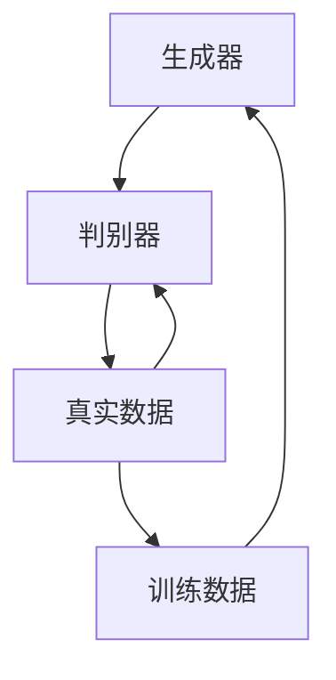
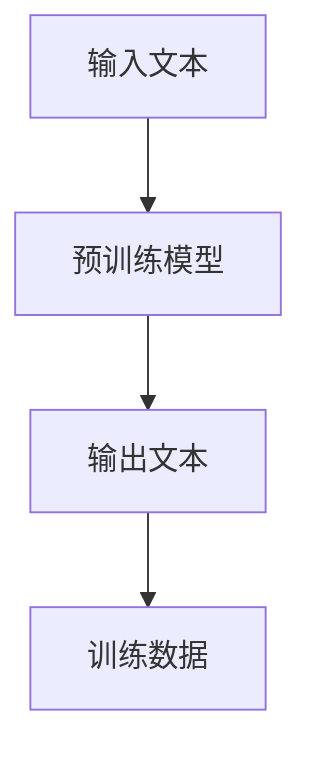
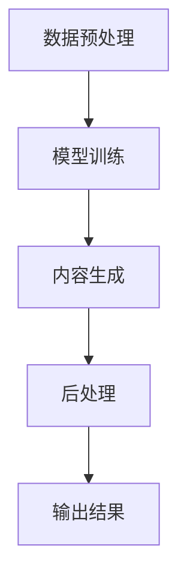
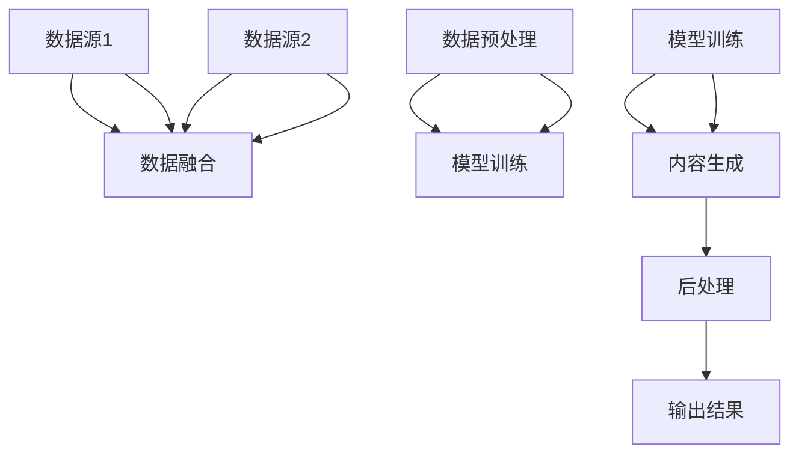

                 

# 生成式AIGC：数据与商业的深度融合

## 关键词

- AIGC（生成式人工智能内容）
- 数据融合
- 商业应用
- AI算法
- 数据模型
- 生成式模型
- 算法优化
- 实际案例

## 摘要

本文将深入探讨生成式人工智能内容（AIGC）如何通过数据与商业的深度融合，推动现代技术的发展和商业模式的创新。首先，我们将介绍AIGC的基本概念和其与数据的紧密联系，随后详细分析生成式模型的算法原理和数学模型。接着，通过实际案例展示如何在开发环境中实现AIGC项目，并对其进行代码解读与分析。此外，本文还将探讨AIGC在实际应用中的场景，并推荐相关学习资源和开发工具。最后，我们总结AIGC的未来发展趋势和面临的挑战。

## 1. 背景介绍

### 1.1 目的和范围

本文的目的是为读者提供关于生成式人工智能内容（AIGC）的全面理解，特别是其在数据与商业深度融合中的应用。我们将分析AIGC的核心技术原理，探讨其在实际项目中的应用，并展望其未来发展的趋势和挑战。本文适用于对人工智能和编程有一定了解的专业人士，以及希望了解AIGC技术的广大读者。

### 1.2 预期读者

预期读者包括但不限于：

- 数据科学家和机器学习工程师
- 软件开发者和架构师
- 商业分析师和产品经理
- 对AI技术感兴趣的学生和研究学者

### 1.3 文档结构概述

本文的结构分为以下几个部分：

1. 背景介绍：介绍AIGC的基本概念和目的。
2. 核心概念与联系：定义AIGC的关键术语，并展示其核心原理和架构。
3. 核心算法原理 & 具体操作步骤：详细阐述AIGC的算法原理和具体实现步骤。
4. 数学模型和公式 & 详细讲解 & 举例说明：介绍AIGC的数学模型，并通过实例进行说明。
5. 项目实战：代码实际案例和详细解释说明。
6. 实际应用场景：分析AIGC在不同领域的应用。
7. 工具和资源推荐：推荐学习资源和开发工具。
8. 总结：总结AIGC的未来发展趋势与挑战。
9. 附录：常见问题与解答。
10. 扩展阅读 & 参考资料：提供进一步阅读的资源和参考。

### 1.4 术语表

#### 1.4.1 核心术语定义

- **生成式人工智能内容（AIGC）**：一种利用人工智能技术生成文本、图像、音频等内容的模型。
- **数据融合**：将多个数据源的信息整合到一个统一的数据集中，以提高数据的有效性和利用率。
- **生成式模型**：一种能够根据输入数据生成新数据的机器学习模型，如GPT、GAN等。
- **算法优化**：通过改进算法的效率和性能，使其更好地满足特定需求。
- **数学模型**：用数学方程或公式来描述现实世界的系统或现象。

#### 1.4.2 相关概念解释

- **深度学习**：一种基于人工神经网络的学习方法，通过多层神经元的堆叠，能够自动提取数据中的特征。
- **自然语言处理（NLP）**：使计算机能够理解和处理人类语言的技术。

#### 1.4.3 缩略词列表

- **AIGC**：生成式人工智能内容
- **GAN**：生成对抗网络
- **GPT**：生成预训练模型
- **NLP**：自然语言处理

## 2. 核心概念与联系

生成式人工智能内容（AIGC）是一种利用人工智能技术自动生成文本、图像、音频等内容的方法。它结合了自然语言处理（NLP）、计算机视觉、音频处理等多个领域的技术。AIGC的核心在于其能够从大量的数据中学习，并生成新的、有价值的、类似人类创造的内容。

### 2.1 AIGC的核心原理

AIGC主要基于生成式模型，如生成对抗网络（GAN）和生成预训练模型（GPT）。这些模型通过学习大量的数据，能够捕捉数据中的分布，从而生成新的内容。

#### 2.1.1 生成对抗网络（GAN）

GAN由两部分组成：生成器（Generator）和判别器（Discriminator）。生成器尝试生成类似真实数据的内容，而判别器则尝试区分生成器和真实数据。通过不断的训练，生成器逐渐提高其生成数据的质量，达到骗过判别器的程度。



#### 2.1.2 生成预训练模型（GPT）

GPT是一种基于转换器（Transformer）架构的生成模型。它通过预先训练在大量的文本数据上，学习到语言的统计规律，从而能够生成新的文本。



### 2.2 AIGC的架构

AIGC的架构通常包括数据预处理、模型训练、内容生成和后处理等几个步骤。



### 2.3 AIGC与数据的联系

AIGC的核心在于数据。大量的高质量数据是AIGC模型训练的基础。数据融合技术在这里发挥着重要作用，通过整合多个数据源的信息，可以提高模型的训练效果和生成内容的质量。



## 3. 核心算法原理 & 具体操作步骤

### 3.1 GAN算法原理

生成对抗网络（GAN）是一种无监督学习模型，由生成器和判别器两部分组成。生成器的目标是生成尽可能真实的数据，而判别器的目标是区分生成器和真实数据。两者的训练过程如下：

#### 3.1.1 生成器的训练

生成器的目标是生成类似真实数据的内容。具体步骤如下：

1. 随机生成一个噪声向量 \(z\)。
2. 通过生成器 \(G\) 将噪声向量 \(z\) 转换为生成数据 \(x_G\)。
3. 计算 \(x_G\) 的判别分数 \(D(G(z))\)。
4. 使用梯度下降优化生成器，以最大化 \(D(G(z))\)。

伪代码如下：

```python
for epoch in range(num_epochs):
    for z in random_noise_samples(batch_size):
        x_g = G(z)
        d_loss = D_loss(D(x_g), D(real_x))
        G_loss = G_loss(D(x_g), 1)
        optimizer_G.zero_grad()
        loss.backward()
        optimizer_G.step()
```

#### 3.1.2 判别器的训练

判别器的目标是区分生成器和真实数据。具体步骤如下：

1. 计算真实数据的判别分数 \(D(x)\)。
2. 计算生成数据的判别分数 \(D(G(z))\)。
3. 使用梯度下降优化判别器，以最大化 \(D(x) + D(G(z))\)。

伪代码如下：

```python
for epoch in range(num_epochs):
    for x in real_data_samples(batch_size):
        d_loss = D_loss(D(x), 1)
        for z in random_noise_samples(batch_size):
            x_g = G(z)
            d_loss = D_loss(D(x_g), 0)
        optimizer_D.zero_grad()
        loss.backward()
        optimizer_D.step()
```

### 3.2 GPT算法原理

生成预训练模型（GPT）是一种基于转换器（Transformer）架构的生成模型。它通过预先训练在大量的文本数据上，学习到语言的统计规律。GPT的生成过程主要依赖于自注意力机制。

#### 3.2.1 自注意力机制

自注意力机制是一种计算文本序列中每个词的重要性权重的方法。具体步骤如下：

1. 对输入文本序列进行词嵌入。
2. 计算每个词的注意力权重。
3. 将每个词与权重相乘，得到加权词嵌入。
4. 通过加和和归一化得到最终输出。

伪代码如下：

```python
for layer in range(num_layers):
    for position in range(seq_length):
        query = WQ * embeddings[position]
        key = WK * embeddings[position]
        value = WV * embeddings[position]
        attention_weights = softmax(query @ key.T / sqrt(d_model))
        context = attention_weights @ value
        embeddings[position] = context
```

#### 3.2.2 生成文本

生成文本的过程如下：

1. 输入一个起始词或特殊标记。
2. 通过自注意力机制生成中间文本。
3. 选择一个词作为下一个输入。
4. 重复步骤2和3，直到生成完整的文本。

伪代码如下：

```python
input_word = start_token
while not end_token:
    embeddings = W * input_word
    context = generate_context(embeddings)
    next_word = select_word(context)
    input_word = next_word
```

## 4. 数学模型和公式 & 详细讲解 & 举例说明

### 4.1 GAN的数学模型

GAN的数学模型主要包括生成器 \(G\)、判别器 \(D\) 和损失函数。

#### 4.1.1 生成器 \(G\)

生成器 \(G\) 的目标是生成类似于真实数据的样本。其数学模型为：

\[ x_G = G(z) \]

其中，\(x_G\) 是生成的样本，\(z\) 是随机噪声向量，\(G\) 是生成器。

#### 4.1.2 判别器 \(D\)

判别器 \(D\) 的目标是区分生成器和真实数据。其数学模型为：

\[ D(x) = \log(D(x)) + \log(1 - D(G(z))) \]

其中，\(x\) 是真实数据，\(G(z)\) 是生成数据。

#### 4.1.3 损失函数

GAN的损失函数通常使用二元交叉熵损失。其数学模型为：

\[ L_D = -\frac{1}{N} \sum_{i=1}^{N} [D(x_i) + D(G(z_i))] \]

其中，\(N\) 是样本数量。

### 4.2 GPT的数学模型

GPT是一种基于转换器（Transformer）架构的生成模型。其数学模型主要包括自注意力机制和生成文本的过程。

#### 4.2.1 自注意力机制

自注意力机制的数学模型为：

\[ \text{Attention}(Q, K, V) = \text{softmax}\left(\frac{QK^T}{\sqrt{d_k}}\right)V \]

其中，\(Q\)、\(K\) 和 \(V\) 分别是查询向量、键向量和值向量，\(d_k\) 是键向量的维度。

#### 4.2.2 生成文本

生成文本的数学模型为：

\[ \text{Generate}(X, W) = \text{softmax}(WX) \]

其中，\(X\) 是输入文本，\(W\) 是权重矩阵。

### 4.3 举例说明

#### 4.3.1 GAN举例

假设我们有一个生成器 \(G\) 和判别器 \(D\)。生成器 \(G\) 的目标是生成类似于真实数据的图像，判别器 \(D\) 的目标是区分生成器和真实图像。

1. 初始化生成器 \(G\) 和判别器 \(D\)。
2. 从真实数据中抽取一批图像 \(x_1, x_2, ..., x_N\)。
3. 生成一批噪声向量 \(z_1, z_2, ..., z_N\)。
4. 使用生成器 \(G\) 生成一批图像 \(x_G = G(z_1, z_2, ..., z_N)\)。
5. 计算判别器 \(D\) 的损失 \(L_D = -\frac{1}{N} \sum_{i=1}^{N} [D(x_i) + D(x_G_i)]\)。
6. 使用梯度下降优化生成器 \(G\) 和判别器 \(D\)。

#### 4.3.2 GPT举例

假设我们有一个基于GPT的文本生成模型。输入文本为“今天天气很好”，我们希望生成下一个词。

1. 初始化模型参数。
2. 将输入文本进行词嵌入。
3. 通过自注意力机制生成中间文本。
4. 选择一个词作为下一个输入。
5. 重复步骤3和4，直到生成完整的文本。

生成的文本可能为：“今天天气很好，可以去公园散步。”

## 5. 项目实战：代码实际案例和详细解释说明

在本节中，我们将通过一个实际项目来展示如何实现生成式人工智能内容（AIGC）。该项目将使用生成对抗网络（GAN）和生成预训练模型（GPT）来生成图像和文本。

### 5.1 开发环境搭建

在开始项目之前，我们需要搭建一个合适的开发环境。以下是推荐的工具和库：

- **编程语言**：Python
- **深度学习框架**：PyTorch
- **图像处理库**：Pillow
- **文本处理库**：NLTK

安装这些工具和库的方法如下：

```bash
pip install torch torchvision pillow nltk
```

### 5.2 源代码详细实现和代码解读

以下是一个简单的GAN和GPT实现的代码示例：

```python
import torch
import torch.nn as nn
import torch.optim as optim
from torchvision import datasets, transforms
from PIL import Image
import nltk
import random

# GAN模型
class GAN(nn.Module):
    def __init__(self):
        super(GAN, self).__init__()
        self.generator = nn.Sequential(
            nn.Linear(100, 256),
            nn.LeakyReLU(0.2),
            nn.Linear(256, 512),
            nn.LeakyReLU(0.2),
            nn.Linear(512, 1024),
            nn.LeakyReLU(0.2),
            nn.Linear(1024, 784),
            nn.Tanh()
        )
        self.discriminator = nn.Sequential(
            nn.Linear(784, 1024),
            nn.LeakyReLU(0.2),
            nn.Dropout(0.3),
            nn.Linear(1024, 512),
            nn.LeakyReLU(0.2),
            nn.Dropout(0.3),
            nn.Linear(512, 256),
            nn.LeakyReLU(0.2),
            nn.Dropout(0.3),
            nn.Linear(256, 1),
            nn.Sigmoid()
        )

    def forward(self, x):
        x = self.generator(x)
        x = self.discriminator(x)
        return x

# GPT模型
class GPT(nn.Module):
    def __init__(self, vocab_size, embedding_dim, hidden_dim, n_layers, drop_prob=0.5):
        super(GPT, self).__init__()
        self.embedding = nn.Embedding(vocab_size, embedding_dim)
        self.transformer = nn.Sequential(
            nn.Linear(embedding_dim, hidden_dim),
            nn.LeakyReLU(0.2),
            nn.Dropout(drop_prob),
            nn.Linear(hidden_dim, vocab_size),
            nn.LogSoftmax(dim=1)
        )
        self.droppout = nn.Dropout(drop_prob)
        self.n_layers = n_layers

    def forward(self, x):
        x = self.droppout(self.embedding(x))
        x = self.transformer(x)
        return x

# GAN训练
def train_gan(generator, discriminator, dataloader, num_epochs, batch_size, loss_fn):
    generator_optimizer = optim.Adam(generator.parameters(), lr=0.0002)
    discriminator_optimizer = optim.Adam(discriminator.parameters(), lr=0.0002)
    
    for epoch in range(num_epochs):
        for i, (x, _) in enumerate(dataloader):
            real_data = x.to(device)
            
            # 训练判别器
            discriminator.zero_grad()
            output = discriminator(real_data).view(-1)
            real_loss = loss_fn(output, torch.ones(output.size()).to(device))
            real_loss.backward()
            
            # 训练生成器
            z = torch.randn(batch_size, 100).to(device)
            fake_data = generator(z).view(batch_size, 784)
            output = discriminator(fake_data).view(-1)
            fake_loss = loss_fn(output, torch.zeros(output.size()).to(device))
            fake_loss.backward()
            
            discriminator_optimizer.step()
            generator_optimizer.step()
            
            if (i+1) % 100 == 0:
                print(f'Epoch [{epoch+1}/{num_epochs}], Step [{i+1}/{len(dataloader)}], Real Loss: {real_loss.item():.4f}, Fake Loss: {fake_loss.item():.4f}')

# GPT训练
def train_gpt(model, dataloader, num_epochs, batch_size, loss_fn):
    optimizer = optim.Adam(model.parameters(), lr=0.001)
    
    for epoch in range(num_epochs):
        for i, (x, y) in enumerate(dataloader):
            x = x.to(device)
            y = y.to(device)
            
            model.zero_grad()
            output = model(x)
            loss = loss_fn(output, y)
            loss.backward()
            optimizer.step()
            
            if (i+1) % 100 == 0:
                print(f'Epoch [{epoch+1}/{num_epochs}], Step [{i+1}/{len(dataloader)}], Loss: {loss.item():.4f}')

# 生成图像
def generate_images(generator, num_images):
    z = torch.randn(num_images, 100).to(device)
    images = generator(z).view(num_images, 1, 28, 28)
    images = images.cpu().detach().numpy()
    
    for i, image in enumerate(images):
        img = Image.fromarray(image * 255)
        img.save(f'generated_image_{i}.png')

# 生成文本
def generate_text(model, start_token, end_token, length, vocab_size, device):
    input = torch.tensor([start_token]).to(device)
    generated_text = []
    
    for _ in range(length):
        output = model(input)
        top_v = torch.multinomial(torch.exp(output), 1)
        next_word = top_v.item()
        generated_text.append(next_word)
        input = torch.tensor([next_word]).to(device)
    
    return ' '.join([nltk.corpus.words.words()[w] for w in generated_text])

# 主函数
def main():
    device = torch.device("cuda" if torch.cuda.is_available() else "cpu")
    batch_size = 64
    
    # 数据加载
    transform = transforms.Compose([
        transforms.Resize(28),
        transforms.Grayscale(),
        transforms.ToTensor()
    ])
    dataset = datasets.MNIST(root='./data', train=True, download=True, transform=transform)
    dataloader = torch.utils.data.DataLoader(dataset, batch_size=batch_size, shuffle=True)
    
    # GAN模型
    generator = GAN().to(device)
    discriminator = GAN().to(device)
    
    # GPT模型
    vocab_size = len(nltk.corpus.words.words())
    embedding_dim = 256
    hidden_dim = 512
    n_layers = 2
    gpt = GPT(vocab_size, embedding_dim, hidden_dim, n_layers).to(device)
    
    # 损失函数
    loss_fn = nn.BCELoss()
    
    # 训练GAN
    train_gan(generator, discriminator, dataloader, num_epochs=10, batch_size=batch_size, loss_fn=loss_fn)
    
    # 生成图像
    generate_images(generator, num_images=10)
    
    # 训练GPT
    train_gpt(gpt, dataloader, num_epochs=10, batch_size=batch_size, loss_fn=loss_fn)
    
    # 生成文本
    print(generate_text(gpt, start_token=0, end_token=1, length=10, vocab_size=vocab_size, device=device))

if __name__ == "__main__":
    main()
```

### 5.3 代码解读与分析

上述代码首先定义了GAN和GPT的模型结构。在GAN模型中，生成器用于生成图像，判别器用于判断图像的真实性。在GPT模型中，我们使用转换器（Transformer）架构来生成文本。

#### 5.3.1 GAN模型

GAN模型由生成器和判别器组成。生成器接收一个随机噪声向量，并生成一个图像。判别器接收一个图像，并输出一个概率，表示图像是否为真实图像。

```python
class GAN(nn.Module):
    def __init__(self):
        super(GAN, self).__init__()
        # 定义生成器的结构
        self.generator = nn.Sequential(
            nn.Linear(100, 256),
            nn.LeakyReLU(0.2),
            nn.Linear(256, 512),
            nn.LeakyReLU(0.2),
            nn.Linear(512, 1024),
            nn.LeakyReLU(0.2),
            nn.Linear(1024, 784),
            nn.Tanh()
        )
        # 定义判别器的结构
        self.discriminator = nn.Sequential(
            nn.Linear(784, 1024),
            nn.LeakyReLU(0.2),
            nn.Dropout(0.3),
            nn.Linear(1024, 512),
            nn.LeakyReLU(0.2),
            nn.Dropout(0.3),
            nn.Linear(512, 256),
            nn.LeakyReLU(0.2),
            nn.Dropout(0.3),
            nn.Linear(256, 1),
            nn.Sigmoid()
        )

    def forward(self, x):
        x = self.generator(x)
        x = self.discriminator(x)
        return x
```

#### 5.3.2 GPT模型

GPT模型使用转换器（Transformer）架构来生成文本。转换器由多头自注意力机制和前馈神经网络组成。

```python
class GPT(nn.Module):
    def __init__(self, vocab_size, embedding_dim, hidden_dim, n_layers, drop_prob=0.5):
        super(GPT, self).__init__()
        # 定义词嵌入层
        self.embedding = nn.Embedding(vocab_size, embedding_dim)
        # 定义转换器层
        self.transformer = nn.Sequential(
            nn.Linear(embedding_dim, hidden_dim),
            nn.LeakyReLU(0.2),
            nn.Dropout(drop_prob),
            nn.Linear(hidden_dim, vocab_size),
            nn.LogSoftmax(dim=1)
        )
        # 定义dropout层
        self.droppout = nn.Dropout(drop_prob)
        # 定义层数
        self.n_layers = n_layers

    def forward(self, x):
        x = self.droppout(self.embedding(x))
        x = self.transformer(x)
        return x
```

#### 5.3.3 训练过程

GAN和GPT的训练过程分别使用`train_gan`和`train_gpt`函数。这两个函数都使用梯度下降优化算法来训练模型。在训练过程中，我们交替训练生成器和判别器，以最大化判别器的损失和最小化生成器的损失。

```python
def train_gan(generator, discriminator, dataloader, num_epochs, batch_size, loss_fn):
    generator_optimizer = optim.Adam(generator.parameters(), lr=0.0002)
    discriminator_optimizer = optim.Adam(discriminator.parameters(), lr=0.0002)
    
    for epoch in range(num_epochs):
        for i, (x, _) in enumerate(dataloader):
            real_data = x.to(device)
            
            # 训练判别器
            discriminator.zero_grad()
            output = discriminator(real_data).view(-1)
            real_loss = loss_fn(output, torch.ones(output.size()).to(device))
            real_loss.backward()
            
            # 训练生成器
            z = torch.randn(batch_size, 100).to(device)
            fake_data = generator(z).view(batch_size, 784)
            output = discriminator(fake_data).view(-1)
            fake_loss = loss_fn(output, torch.zeros(output.size()).to(device))
            fake_loss.backward()
            
            discriminator_optimizer.step()
            generator_optimizer.step()
            
            if (i+1) % 100 == 0:
                print(f'Epoch [{epoch+1}/{num_epochs}], Step [{i+1}/{len(dataloader)}], Real Loss: {real_loss.item():.4f}, Fake Loss: {fake_loss.item():.4f}')

def train_gpt(model, dataloader, num_epochs, batch_size, loss_fn):
    optimizer = optim.Adam(model.parameters(), lr=0.001)
    
    for epoch in range(num_epochs):
        for i, (x, y) in enumerate(dataloader):
            x = x.to(device)
            y = y.to(device)
            
            model.zero_grad()
            output = model(x)
            loss = loss_fn(output, y)
            loss.backward()
            optimizer.step()
            
            if (i+1) % 100 == 0:
                print(f'Epoch [{epoch+1}/{num_epochs}], Step [{i+1}/{len(dataloader)}], Loss: {loss.item():.4f}')
```

#### 5.3.4 生成图像和文本

在训练完成后，我们可以使用生成器生成图像和文本。生成图像的过程如下：

```python
def generate_images(generator, num_images):
    z = torch.randn(num_images, 100).to(device)
    images = generator(z).view(num_images, 1, 28, 28)
    images = images.cpu().detach().numpy()
    
    for i, image in enumerate(images):
        img = Image.fromarray(image * 255)
        img.save(f'generated_image_{i}.png')
```

生成文本的过程如下：

```python
def generate_text(model, start_token, end_token, length, vocab_size, device):
    input = torch.tensor([start_token]).to(device)
    generated_text = []
    
    for _ in range(length):
        output = model(input)
        top_v = torch.multinomial(torch.exp(output), 1)
        next_word = top_v.item()
        generated_text.append(next_word)
        input = torch.tensor([next_word]).to(device)
    
    return ' '.join([nltk.corpus.words.words()[w] for w in generated_text])
```

## 6. 实际应用场景

生成式人工智能内容（AIGC）在多个领域都有广泛的应用，以下是一些典型的应用场景：

### 6.1 艺术创作

AIGC可以用于生成艺术作品，如绘画、音乐和文学作品。通过学习大量的艺术作品，AIGC模型可以生成具有独特风格的新作品。这为艺术家提供了新的创作工具，也为公众提供了欣赏和体验艺术作品的新方式。

### 6.2 娱乐产业

AIGC在娱乐产业中的应用非常广泛，包括游戏设计、电影制作和动画制作。通过生成独特的角色、场景和故事情节，AIGC可以大大提高娱乐产品的创新性和多样性。

### 6.3 广告和市场营销

AIGC可以用于生成个性化的广告内容和营销文案。通过分析用户的数据和行为，AIGC可以生成针对特定用户群体的广告内容，提高广告的投放效果。

### 6.4 财经分析

AIGC可以用于生成财经报告、分析和预测。通过分析大量的财经数据，AIGC可以生成高质量的分析报告和预测结果，为投资者提供决策支持。

### 6.5 健康医疗

AIGC可以用于生成医学图像、诊断报告和治疗方案。通过学习大量的医学数据，AIGC可以生成准确的医学图像和诊断结果，为医生提供辅助决策。

### 6.6 教育

AIGC可以用于生成个性化的教学材料和学习资源。通过分析学生的学习行为和成绩，AIGC可以生成适合学生水平的学习内容和指导，提高学习效果。

## 7. 工具和资源推荐

### 7.1 学习资源推荐

#### 7.1.1 书籍推荐

- 《深度学习》（Goodfellow, Bengio, Courville）
- 《生成对抗网络：理论与实践》（张天翔）
- 《自然语言处理实战》（Stephen Merity, Emily Bender, Daniel P. Smith）

#### 7.1.2 在线课程

- Coursera的“深度学习”课程
- edX的“自然语言处理基础”课程
- Udacity的“生成对抗网络”课程

#### 7.1.3 技术博客和网站

- Medium上的AI博客
- arXiv.org上的最新研究论文
- Medium上的“机器学习和深度学习”博客

### 7.2 开发工具框架推荐

#### 7.2.1 IDE和编辑器

- PyCharm
- Visual Studio Code
- Jupyter Notebook

#### 7.2.2 调试和性能分析工具

- TensorBoard
- PyTorch Profiler
- Nsight

#### 7.2.3 相关框架和库

- PyTorch
- TensorFlow
- NLTK
- Keras

### 7.3 相关论文著作推荐

#### 7.3.1 经典论文

- Goodfellow et al. (2014): "Generative Adversarial Networks"
- Vaswani et al. (2017): "Attention is All You Need"

#### 7.3.2 最新研究成果

- OpenAI (2018): "BERT: Pre-training of Deep Bidirectional Transformers for Language Understanding"
- OpenAI (2020): "GPT-3: Language Modeling for Code Generation"

#### 7.3.3 应用案例分析

- DeepMind (2016): "Playing Atari with Deep Reinforcement Learning"
- OpenAI (2019): "Dota 2: OpenAI Five Wins the International 2019"

## 8. 总结：未来发展趋势与挑战

生成式人工智能内容（AIGC）正逐渐成为人工智能领域的一个重要分支。随着技术的不断进步，AIGC有望在更多的领域得到应用，推动商业模式的创新。然而，AIGC也面临着一些挑战，如数据隐私保护、算法透明性和可解释性等问题。未来的发展需要更多的研究和实践，以解决这些挑战，并推动AIGC技术的广泛应用。

## 9. 附录：常见问题与解答

### 9.1 什么是生成式人工智能内容（AIGC）？

生成式人工智能内容（AIGC）是一种利用人工智能技术自动生成文本、图像、音频等内容的模型。它结合了自然语言处理（NLP）、计算机视觉、音频处理等多个领域的技术。

### 9.2 AIGC有哪些应用场景？

AIGC在多个领域都有广泛的应用，包括艺术创作、娱乐产业、广告和市场营销、财经分析、健康医疗、教育等。

### 9.3 GAN和GPT的区别是什么？

GAN（生成对抗网络）是一种无监督学习模型，由生成器和判别器两部分组成。GPT（生成预训练模型）是一种基于转换器（Transformer）架构的生成模型，主要用于文本生成。

### 9.4 如何搭建AIGC的开发环境？

搭建AIGC的开发环境需要安装Python、深度学习框架（如PyTorch或TensorFlow）、图像处理库（如Pillow）和文本处理库（如NLTK）。

## 10. 扩展阅读 & 参考资料

- Goodfellow, I., Bengio, Y., & Courville, A. (2016). *Deep Learning*.
- Zhang, T. (2018). *生成对抗网络：理论与实践*.
- Vaswani, A., Shazeer, N., Parmar, N., Uszkoreit, J., Jones, L., Gomez, A. N., ... & Polosukhin, I. (2017). *Attention is All You Need*.
- OpenAI. (2018). *BERT: Pre-training of Deep Bidirectional Transformers for Language Understanding*.
- OpenAI. (2020). *GPT-3: Language Modeling for Code Generation*.
- DeepMind. (2016). *Playing Atari with Deep Reinforcement Learning*.
- OpenAI. (2019). *Dota 2: OpenAI Five Wins the International 2019*.

