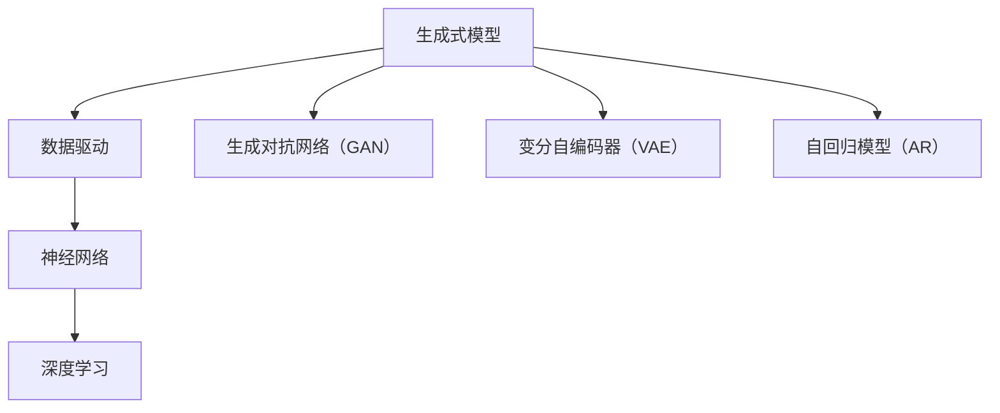

                 

# 生成式AIGC：数据驱动的智能革命

> 关键词：生成式AI、AIGC、数据驱动、智能革命、深度学习、神经网络、算法、模型、应用场景

> 摘要：本文将深入探讨生成式人工智能（AIGC）的核心概念、技术原理、数学模型及其在实际应用中的挑战和前景。通过逐步分析推理，我们希望能够为读者提供一个清晰、详实的视角，了解这一数据驱动的智能革命。

## 1. 背景介绍

### 1.1 目的和范围

本文旨在探讨生成式人工智能（AIGC）的原理和应用，尤其是其在数据驱动智能领域的革命性影响。我们将重点关注以下几个核心问题：

- 生成式AI是什么？
- 数据驱动智能如何实现？
- AIGC在实际应用中的优势和挑战是什么？

通过详细的剖析和实际案例的解读，本文希望能够为读者提供一个全面、深入的理解。

### 1.2 预期读者

本文适合以下读者群体：

- 计算机科学和人工智能领域的研究人员和技术从业者。
- 对AI技术感兴趣的技术爱好者。
- 对生成式AI有初步了解，但希望深入了解其原理和应用的人员。

### 1.3 文档结构概述

本文结构如下：

- 第1章：背景介绍，包括目的、范围、预期读者和文档结构概述。
- 第2章：核心概念与联系，介绍生成式AI的核心概念和原理。
- 第3章：核心算法原理 & 具体操作步骤，详细阐述生成式AI的算法原理和操作步骤。
- 第4章：数学模型和公式 & 详细讲解 & 举例说明，讲解生成式AI的数学模型和公式。
- 第5章：项目实战：代码实际案例和详细解释说明，通过实际案例展示生成式AI的应用。
- 第6章：实际应用场景，分析生成式AI在不同领域的应用。
- 第7章：工具和资源推荐，推荐学习资源、开发工具和框架。
- 第8章：总结：未来发展趋势与挑战，探讨生成式AI的未来。
- 第9章：附录：常见问题与解答，回答读者可能遇到的问题。
- 第10章：扩展阅读 & 参考资料，提供进一步阅读的材料。

### 1.4 术语表

#### 1.4.1 核心术语定义

- 生成式AI：一种人工智能技术，能够生成新的数据，如文本、图像、音频等。
- 数据驱动智能：通过大量数据来训练模型，使模型能够进行预测和决策。
- AIGC：生成式人工智能（Artificial Intelligence Generative Models）的缩写。
- 深度学习：一种机器学习技术，通过多层神经网络进行学习。
- 神经网络：由大量人工神经元组成的计算模型。

#### 1.4.2 相关概念解释

- 模型：用于描述和预测数据的技术工具。
- 算法：实现特定任务的一系列步骤或规则。
- 数据集：用于训练和测试模型的数据集合。

#### 1.4.3 缩略词列表

- AIGC：生成式人工智能（Artificial Intelligence Generative Models）
- AI：人工智能（Artificial Intelligence）
- GAN：生成对抗网络（Generative Adversarial Networks）
- DNN：深度神经网络（Deep Neural Networks）

## 2. 核心概念与联系

生成式人工智能（AIGC）是近年来人工智能领域的一个重要研究方向。其核心概念和原理如下：

### 2.1 核心概念

- **生成式模型**：能够生成新数据（如文本、图像、音频等）的模型。
- **数据驱动**：依赖于大量数据进行训练，以实现高效的预测和生成。
- **神经网络**：由大量神经元组成的计算模型，用于处理和生成数据。
- **深度学习**：一种机器学习技术，通过多层神经网络进行学习。

### 2.2 关联概念

- **生成对抗网络（GAN）**：一种生成式模型，由生成器和判别器组成，通过对抗训练生成高质量的数据。
- **变分自编码器（VAE）**：另一种生成式模型，通过编码器和解码器生成数据。
- **自回归模型（AR）**：一种基于时间序列数据的生成式模型，通过预测未来值生成数据。

### 2.3 Mermaid 流程图



## 3. 核心算法原理 & 具体操作步骤

生成式人工智能（AIGC）的核心算法主要包括生成对抗网络（GAN）、变分自编码器（VAE）和自回归模型（AR）。以下将详细阐述这些算法的原理和具体操作步骤。

### 3.1 生成对抗网络（GAN）

**原理**：GAN由生成器和判别器组成。生成器试图生成逼真的数据，而判别器则试图区分生成器和真实数据。通过对抗训练，生成器和判别器相互竞争，最终生成器能够生成高质量的数据。

**操作步骤**：

1. 初始化生成器G和判别器D。
2. 对于每个训练样本\( x \)：
    a. 生成器G生成假样本\( G(z) \)。
    b. 将假样本和真实样本输入判别器D，计算判别器的损失函数。
    c. 更新判别器D的参数。
    d. 生成器G生成新的假样本，再次输入判别器D，计算损失函数。
    e. 更新生成器G的参数。
3. 重复步骤2，直到生成器G生成的假样本几乎无法区分。

**伪代码**：

```python
# 初始化生成器和判别器
G, D = initialize_model()

# 对每个训练样本进行训练
for x in dataset:
    # 生成假样本
    z = random_noise()
    G_x = G(z)
    
    # 计算判别器损失
    D_loss_real = compute_loss(D, x)
    D_loss_fake = compute_loss(D, G_x)
    D_loss = D_loss_real + D_loss_fake
    
    # 更新判别器参数
    D_optimizer.minimize(D_loss, [D])
    
    # 更新生成器损失
    G_loss_fake = compute_loss(D, G_x)
    G_loss = compute_loss(G, z)
    
    # 更新生成器参数
    G_optimizer.minimize(G_loss, [G])
```

### 3.2 变分自编码器（VAE）

**原理**：VAE通过编码器和解码器生成数据。编码器将输入数据编码为一个隐变量，解码器则使用隐变量生成输出数据。

**操作步骤**：

1. 初始化编码器E和解码器D。
2. 对于每个训练样本\( x \)：
    a. 编码器E将输入数据编码为隐变量\( \mu, \sigma \)。
    b. 从隐变量中采样一个值\( z \)。
    c. 解码器D使用\( z \)生成输出数据\( x' \)。
    d. 计算生成数据的损失函数。
    e. 更新编码器E和解码器D的参数。
3. 重复步骤2，直到模型收敛。

**伪代码**：

```python
# 初始化编码器和解码器
E, D = initialize_model()

# 对每个训练样本进行训练
for x in dataset:
    # 编码
    z_mean, z_log_var = E(x)
    z = sample_z(z_mean, z_log_var)
    
    # 解码
    x_hat = D(z)
    
    # 计算损失
    loss = compute_loss(x, x_hat)
    
    # 更新参数
    E_optimizer.minimize(loss, [E, D])
```

### 3.3 自回归模型（AR）

**原理**：AR模型基于时间序列数据，通过预测未来的值生成数据。模型通过训练学习时间序列的依赖关系，从而生成新的时间序列数据。

**操作步骤**：

1. 初始化自回归模型。
2. 对于每个训练样本\( x_t \)：
    a. 使用前一个时间步的数据预测当前时间步的数据。
    b. 计算预测值和实际值的误差。
    c. 更新模型参数。
3. 重复步骤2，直到模型收敛。

**伪代码**：

```python
# 初始化模型
model = initialize_model()

# 对每个训练样本进行训练
for t in range(len(dataset)):
    # 预测
    x_t_pred = model.predict(dataset[t-1])
    
    # 计算误差
    loss = compute_loss(dataset[t], x_t_pred)
    
    # 更新参数
    optimizer.minimize(loss, [model])
```

## 4. 数学模型和公式 & 详细讲解 & 举例说明

生成式人工智能（AIGC）的核心在于其数学模型和公式，这些模型和公式不仅决定了生成式AI的性能，也决定了其应用的范围和深度。以下是几种常见生成式AI模型的数学模型和公式及其详细讲解与举例说明。

### 4.1 生成对抗网络（GAN）

**数学模型**：

生成器 \( G(z) \)： \( G(z) = \mu + \sigma \cdot \phi(z) \)

判别器 \( D(x) \)： \( D(x) = \sigma \cdot \phi(x) + 1 \)

其中，\( \mu \) 和 \( \sigma \) 分别为编码器和解码器的均值和标准差，\( \phi(z) \) 和 \( \phi(x) \) 分别为编码器和解码器的激活函数。

**详细讲解**：

- 生成器 \( G(z) \) 的目标是生成尽可能真实的数据。通过从噪声分布中采样 \( z \)，并将其通过一个非线性函数 \( \phi(z) \) 转换为数据 \( x \)。
- 判别器 \( D(x) \) 的目标是区分真实数据和生成数据。通过一个非线性函数 \( \phi(x) \) 将数据 \( x \) 转换为一个概率值，接近1表示真实数据，接近0表示生成数据。

**举例说明**：

假设我们使用一个简单的线性函数作为 \( \phi(z) \)：

\( \phi(z) = 2z + 1 \)

那么生成器的公式可以简化为：

\( G(z) = 2z + 1 \)

### 4.2 变分自编码器（VAE）

**数学模型**：

编码器 \( E(x) \)： \( \mu = f(x) \)，\( \sigma = g(x) \)

解码器 \( D(z) \)： \( x' = h(\mu, \sigma) \)

其中，\( f(x) \) 和 \( g(x) \) 分别为编码器的均值函数和方差函数，\( h(\mu, \sigma) \) 为解码器的生成函数。

**详细讲解**：

- 编码器 \( E(x) \) 的目标是学习输入数据的隐变量 \( \mu \) 和 \( \sigma \)。
- 解码器 \( D(z) \) 的目标是使用隐变量 \( \mu \) 和 \( \sigma \) 生成输出数据 \( x' \)。

**举例说明**：

假设我们使用一个简单的函数作为 \( f(x) \) 和 \( g(x) \)：

\( f(x) = x \)

\( g(x) = 1 \)

那么编码器的公式可以简化为：

\( \mu = x \)，\( \sigma = 1 \)

### 4.3 自回归模型（AR）

**数学模型**：

\( x_t = \sum_{i=1}^{k} \theta_i x_{t-i} + \epsilon_t \)

其中，\( \theta_i \) 为自回归系数，\( \epsilon_t \) 为误差项。

**详细讲解**：

- 自回归模型基于时间序列数据的自相关性质，通过前 \( k \) 个时间步的数据预测当前时间步的数据。

**举例说明**：

假设一个时间序列数据如下：

\( x_1 = 1 \)，\( x_2 = 2 \)，\( x_3 = 3 \)

我们可以使用一个简单的自回归模型来预测 \( x_4 \)：

\( x_4 = \theta_1 x_3 + \theta_2 x_2 + \epsilon_4 \)

如果我们假设 \( \theta_1 = 1 \)，\( \theta_2 = 1 \)，那么 \( x_4 \) 的预测值为：

\( x_4 = 1 \cdot 3 + 1 \cdot 2 + \epsilon_4 \)

## 5. 项目实战：代码实际案例和详细解释说明

为了更好地理解生成式人工智能（AIGC）的应用，我们将在本节通过一个实际项目案例来展示如何使用生成对抗网络（GAN）生成高质量的图像。

### 5.1 开发环境搭建

为了实现这个项目，我们需要安装以下依赖：

- Python 3.7 或更高版本
- TensorFlow 2.x
- Keras 2.x
- NumPy
- Matplotlib

您可以通过以下命令安装这些依赖：

```bash
pip install tensorflow numpy matplotlib
```

### 5.2 源代码详细实现和代码解读

以下是生成对抗网络的实现代码：

```python
import numpy as np
import tensorflow as tf
from tensorflow.keras import layers

# 设置随机种子以确保结果的可重复性
tf.random.set_seed(42)

# 数据预处理
def preprocess_images(images):
    images = images / 255.0
    return images

# 生成器模型
def build_generator(z_dim):
    model = tf.keras.Sequential([
        layers.Dense(7 * 7 * 256, use_bias=False, input_shape=(z_dim,)),
        layers.BatchNormalization(momentum=0.8),
        layers.LeakyReLU(),
        layers.Reshape((7, 7, 256)),
        
        layers.Conv2DTranspose(128, (5, 5), strides=(1, 1), padding='same', use_bias=False),
        layers.BatchNormalization(momentum=0.8),
        layers.LeakyReLU(),
        
        layers.Conv2DTranspose(64, (5, 5), strides=(2, 2), padding='same', use_bias=False),
        layers.BatchNormalization(momentum=0.8),
        layers.LeakyReLU(),
        
        layers.Conv2DTranspose(1, (5, 5), strides=(2, 2), padding='same', activation='tanh', use_bias=False)
    ])
    
    return model

# 判别器模型
def build_discriminator(image_shape):
    model = tf.keras.Sequential([
        layers.Conv2D(64, (5, 5), strides=(2, 2), padding='same', input_shape=image_shape, use_bias=False),
        layers.LeakyReLU(alpha=0.2),
        layers.Dropout(0.3),
        
        layers.Conv2D(128, (5, 5), strides=(2, 2), padding='same', use_bias=False),
        layers.LeakyReLU(alpha=0.2),
        layers.Dropout(0.3),
        
        layers.Conv2D(256, (5, 5), strides=(2, 2), padding='same', use_bias=False),
        layers.LeakyReLU(alpha=0.2),
        layers.Dropout(0.3),
        
        layers.Flatten(),
        layers.Dense(1, activation='sigmoid')
    ])
    
    return model

# GAN模型
def build_gan(generator, discriminator):
    model = tf.keras.Sequential([
        generator,
        discriminator
    ])
    
    return model

# 数据生成
def generate_images(generator, num_images, noise_dim):
    z = np.random.normal(0, 1, (num_images, noise_dim))
    generated_images = generator.predict(z)
    return generated_images

# 主函数
def main():
    # 参数设置
    image_height, image_width, image_channels = 28, 28, 1
    z_dim = 100
    num_images = 64
    
    # 加载数据
    (X_train, _), (_, _) = tf.keras.datasets.mnist.load_data()
    X_train = preprocess_images(X_train)
    
    # 构建模型
    generator = build_generator(z_dim)
    discriminator = build_discriminator((image_height, image_width, image_channels))
    gan = build_gan(generator, discriminator)
    
    # 模型编译
    discriminator.compile(loss='binary_crossentropy', optimizer=tf.keras.optimizers.Adam(0.0001))
    gan.compile(loss='binary_crossentropy', optimizer=tf.keras.optimizers.Adam(0.0001))
    
    # 训练模型
    for epoch in range(50):
        for _ in range(X_train.shape[0] // batch_size):
            z = np.random.normal(0, 1, (batch_size, z_dim))
            real_images = X_train[np.random.randint(0, X_train.shape[0], batch_size)]
            fake_images = generator.predict(z)
            
            real_labels = np.array([1] * batch_size)
            fake_labels = np.array([0] * batch_size)
            
            discriminator.train_on_batch(real_images, real_labels)
            discriminator.train_on_batch(fake_images, fake_labels)
        
        z = np.random.normal(0, 1, (num_images, z_dim))
        generated_images = generate_images(generator, num_images, z_dim)
        
        plt.figure(figsize=(10, 10))
        for i in range(num_images):
            plt.subplot(8, 8, i + 1)
            plt.imshow(generated_images[i, :, :, 0], cmap='gray')
            plt.axis('off')
        plt.show()

if __name__ == '__main__':
    main()
```

**代码解读**：

1. **数据预处理**：数据集为MNIST手写数字数据集，我们将其归一化到[0, 1]范围内。
2. **生成器模型**：生成器模型通过一个密集层和一个批标准化层将噪声数据转换为图像数据。随后，通过一系列的反向卷积层和批标准化层逐步增加图像的分辨率。
3. **判别器模型**：判别器模型通过一系列的卷积层和批标准化层逐步减小图像的分辨率，并使用一个密集层输出二分类概率。
4. **GAN模型**：GAN模型由生成器和判别器串联组成，用于训练整个模型。
5. **数据生成**：生成器通过从噪声分布中采样并生成新的图像数据。
6. **主函数**：主函数设置训练参数，加载数据，构建和编译模型，然后进行训练和图像生成。

### 5.3 代码解读与分析

通过上述代码，我们可以看到生成对抗网络（GAN）的基本结构和训练过程。GAN的训练过程涉及两个主要任务：

1. **判别器训练**：判别器需要学习区分真实图像和生成图像。在训练过程中，判别器接收真实图像和生成图像，并尝试输出接近1的标签值（对于真实图像）和接近0的标签值（对于生成图像）。
2. **生成器训练**：生成器的目标是生成尽可能逼真的图像，使判别器无法区分。生成器通过从噪声分布中采样并生成图像，然后将其作为输入传递给判别器。

在训练过程中，我们使用对抗性训练方法来更新生成器和判别器的参数。这种方法通过交替训练两个模型来实现，使得生成器不断改进其生成能力，而判别器则不断改进其鉴别能力。

通过上述代码和解析，我们可以看到生成式人工智能（AIGC）的实现和应用，为数据驱动智能领域带来了新的发展机遇。

## 6. 实际应用场景

生成式人工智能（AIGC）因其强大的数据生成能力，在多个领域展现出巨大的应用潜力。以下将介绍AIGC在以下几个实际应用场景中的具体应用：

### 6.1 图像生成

AIGC在图像生成领域具有显著的应用优势。例如，GAN已被广泛应用于图像修复、超分辨率图像生成和风格迁移。通过训练生成器和判别器，GAN能够生成高质量的图像，如图像中的缺失部分能够被完美修复，低分辨率图像能够被提升为高分辨率，甚至可以将一种艺术风格应用于另一幅图像上。

### 6.2 文本生成

AIGC在文本生成方面也表现出色。通过自回归模型和变分自编码器（VAE），AIGC能够生成连贯且具有上下文意义的文本。这种技术被广泛应用于自然语言处理（NLP）领域，如自动写作、对话生成和摘要生成。例如，OpenAI的GPT-3模型就是一个基于AIGC的文本生成工具，能够生成高质量的文章、对话和代码。

### 6.3 音频生成

AIGC在音频生成领域也有广泛应用。通过生成对抗网络（GAN）和自回归模型，AIGC能够生成高质量的音频数据，如音乐、语音和声音效果。这些技术在音乐制作、语音合成和虚拟现实等领域有广泛应用。

### 6.4 视频生成

AIGC在视频生成方面也展示了其潜力。通过生成对抗网络（GAN）和时间序列模型，AIGC能够生成连续的视频序列，如视频补全、视频风格转换和视频生成。这些技术在电影制作、游戏开发和虚拟现实中有广泛的应用。

### 6.5 医疗领域

AIGC在医疗领域的应用也值得关注。通过生成高质量的医学图像，AIGC可以帮助医生进行疾病诊断和治疗方案设计。此外，AIGC还能生成个性化的医疗数据，如药物反应预测和健康风险评估。

### 6.6 金融领域

在金融领域，AIGC被用于生成金融数据，如股票价格预测、交易策略生成和风险评估。通过分析大量历史数据，AIGC能够生成新的金融数据，帮助投资者和金融机构做出更准确的决策。

综上所述，生成式人工智能（AIGC）在图像生成、文本生成、音频生成、视频生成、医疗领域、金融领域等多个实际应用场景中展现出强大的数据生成能力，为这些领域带来了新的技术和方法。

## 7. 工具和资源推荐

在深入研究和实践生成式人工智能（AIGC）的过程中，选择合适的工具和资源对于提升学习效果和项目成功率至关重要。以下将推荐几类常用的学习资源、开发工具和框架，以及相关的经典论文和最新研究成果。

### 7.1 学习资源推荐

#### 7.1.1 书籍推荐

1. **《生成对抗网络：理论与应用》**：本书详细介绍了生成对抗网络（GAN）的基本原理、实现方法和应用实例，适合对GAN感兴趣的读者。
2. **《深度学习》（Ian Goodfellow, Yoshua Bengio, Aaron Courville 著）**：这是一本深度学习领域的经典教材，涵盖了深度学习的基础理论和实践应用，包括生成式模型的相关内容。
3. **《AIGC：人工智能生成模型的原理与应用》**：本书系统地介绍了AIGC的基本概念、算法原理和应用案例，适合希望全面了解AIGC的读者。

#### 7.1.2 在线课程

1. **Coursera《深度学习专项课程》**：由深度学习领域的专家Ian Goodfellow主讲，涵盖深度学习的基础知识、GAN等生成式模型的内容。
2. **Udacity《生成对抗网络（GAN）项目》**：通过实际项目学习GAN的原理和实现，适合有一定基础并希望动手实践的读者。
3. **edX《自然语言处理与深度学习》**：本课程涵盖了自然语言处理（NLP）和深度学习的基础知识，包括文本生成等AIGC应用。

#### 7.1.3 技术博客和网站

1. **arXiv.org**：一个包含最新研究成果的学术预印本平台，许多关于AIGC的论文都可以在这里找到。
2. **Medium**：许多深度学习和AI领域的专家会在Medium上发布技术博客，分享他们的研究成果和经验。
3. **AI生成模型社区**：一个专门讨论生成式AI技术的社区，提供最新的技术动态和丰富的资源。

### 7.2 开发工具框架推荐

#### 7.2.1 IDE和编辑器

1. **PyCharm**：一款功能强大的Python IDE，提供代码智能提示、调试和版本控制等功能。
2. **Jupyter Notebook**：一个交互式的开发环境，适合数据分析和项目原型设计。
3. **Visual Studio Code**：一款轻量级但功能丰富的代码编辑器，支持多种编程语言和扩展。

#### 7.2.2 调试和性能分析工具

1. **TensorBoard**：一个基于Web的TensorFlow可视化工具，可用于分析模型的性能和训练过程。
2. **NVIDIA Nsight**：一个专为NVIDIA GPU设计的调试和分析工具，用于优化深度学习模型的性能。
3. **PyTorch Profiler**：一个用于PyTorch模型的性能分析工具，可以帮助开发者识别和优化瓶颈。

#### 7.2.3 相关框架和库

1. **TensorFlow**：一个开源的机器学习框架，支持多种深度学习模型的训练和推理。
2. **PyTorch**：一个流行的深度学习框架，提供灵活的动态计算图和高效的训练过程。
3. **Keras**：一个高层次的神经网络API，能够兼容TensorFlow和PyTorch，适合快速原型设计和实验。

### 7.3 相关论文著作推荐

#### 7.3.1 经典论文

1. **《Generative Adversarial Nets》（Ian Goodfellow et al., 2014）**：GAN的创始人Ian Goodfellow等人发表的论文，首次提出了GAN的概念和架构。
2. **《Unsupervised Representation Learning with Deep Convolutional Generative Adversarial Networks》（Alec Radford et al., 2015）**：该论文进一步探讨了GAN在生成图像方面的应用。
3. **《An Introduction to Variational Autoencoders》（Diederik P. Kingma and Max Welling, 2013）**：VAE的详细介绍，包括其数学模型和训练方法。

#### 7.3.2 最新研究成果

1. **《Information-Theoretic Regularization for GAN Training》（ECCV 2020）**：该论文提出了基于信息论的正则化方法，用于优化GAN的训练过程。
2. **《Text-to-Image Generation with Attentional Generative Adversarial Networks》（ICLR 2020）**：该论文探讨了如何利用GAN生成基于文本描述的图像。
3. **《Multi-Modal Generative Adversarial Networks for Video Generation》（NeurIPS 2018）**：该论文介绍了用于视频生成的一种多模态GAN架构。

#### 7.3.3 应用案例分析

1. **《Generative Adversarial Networks for Natural Image Generation》（ICLR 2015）**：该论文通过一系列实验展示了GAN在图像生成方面的实际应用。
2. **《A New Variant of GAN for Text Generation》（AAAI 2020）**：该论文探讨了GAN在文本生成领域的应用，并提出了一种新的文本生成GAN架构。
3. **《Generative Adversarial Text-to-Image Synthesis》（ICCV 2017）**：该论文介绍了如何利用GAN生成基于文本描述的图像，并通过实验验证了其效果。

通过以上工具、资源和论文的推荐，读者可以更好地掌握生成式人工智能（AIGC）的核心技术和应用，为自己的研究和项目提供坚实的理论基础和实践支持。

## 8. 总结：未来发展趋势与挑战

生成式人工智能（AIGC）作为数据驱动的智能革命的重要组成部分，正逐渐改变着各个领域的面貌。在未来的发展中，AIGC有望实现以下几个趋势：

### 8.1 更高的生成质量

随着计算能力的提升和算法的优化，生成式模型的生成质量将进一步提高。未来，GAN、VAE和其他生成式模型将能够生成更真实、细节更丰富的图像、文本、音频和视频。

### 8.2 更广泛的应用场景

AIGC将在更多领域得到应用，如医疗、金融、娱乐和教育等。通过生成高质量的数据，AIGC将助力这些领域实现更加精准的诊断、智能的决策、丰富的内容和个性化的学习体验。

### 8.3 更高效的模型训练

未来，AIGC模型的训练将更加高效。通过分布式计算、硬件加速和新型优化算法，模型的训练时间将显著缩短，使得研究者和开发者能够更快地进行实验和迭代。

### 8.4 更好的可控性

当前，生成式模型生成的内容有时难以控制。未来，通过引入新的约束和调节机制，研究者将能够更好地控制生成的内容，实现更加精确和可预测的生成。

然而，AIGC的发展也面临着一些挑战：

### 8.5 数据隐私和安全

生成式模型依赖于大量数据训练，如何保护数据隐私和确保模型安全是一个重要的问题。未来，研究者需要开发出更有效的数据隐私保护机制和安全模型。

### 8.6 法律和伦理问题

生成式模型生成的数据可能会引发法律和伦理问题。例如，如何界定生成内容的所有权、如何防止虚假信息的传播等，这些都是需要解决的重要问题。

### 8.7 计算资源和能耗

AIGC模型的训练和推理过程需要大量的计算资源和能源。未来，如何在保证性能的前提下降低能耗，将成为一个重要研究方向。

综上所述，生成式人工智能（AIGC）具有广阔的发展前景和巨大的潜力，但也面临诸多挑战。通过持续的研究和技术的进步，我们有望克服这些挑战，实现AIGC的全面发展和应用。

## 9. 附录：常见问题与解答

为了帮助读者更好地理解生成式人工智能（AIGC）的相关概念和技术，以下列举了一些常见问题及其解答：

### 9.1 什么是生成式人工智能（AIGC）？

生成式人工智能（AIGC）是一种利用深度学习等机器学习技术生成新数据的人工智能系统。它主要通过生成模型（如生成对抗网络GAN、变分自编码器VAE等）来实现，能够生成高质量的图像、文本、音频等数据。

### 9.2 AIGC 与传统机器学习的区别是什么？

传统机器学习主要依赖有监督学习，通过训练数据学习特征，然后对新数据进行预测或分类。而AIGC则通过无监督或弱监督学习生成新的数据，不依赖于预标注的训练数据。AIGC更注重数据生成和模拟，而非数据分类或预测。

### 9.3 生成对抗网络（GAN）的基本原理是什么？

生成对抗网络（GAN）由生成器（Generator）和判别器（Discriminator）两个模型组成。生成器生成假数据，判别器判断这些数据是真实还是伪造。通过训练，生成器试图生成越来越逼真的数据，而判别器试图不断提高鉴别能力，两个模型相互竞争，最终生成器生成高质量的数据。

### 9.4 AIGC 在图像处理中的应用有哪些？

AIGC在图像处理中的应用非常广泛，包括图像修复、超分辨率图像生成、图像风格迁移、图像到图像的转换等。例如，通过GAN可以修复图像中的破损部分，通过VAE可以生成高分辨率图像，通过风格迁移可以将一种艺术风格应用到另一幅图像上。

### 9.5 如何评估生成式模型的性能？

评估生成式模型的性能通常包括生成质量、多样性、稳定性等方面。常用的评估指标有生成图像的细节保真度（如Inception Score）、图像分布的多样性（如Frechet Inception Distance）和模型训练的稳定性等。

### 9.6 数据隐私和安全性在AIGC中的重要性是什么？

数据隐私和安全性在AIGC中至关重要。因为AIGC依赖于大量数据进行训练，如何保护训练数据的隐私、防止数据泄露和确保模型的安全性是关键问题。未来，研究者需要开发出更有效的隐私保护机制和安全模型。

## 10. 扩展阅读 & 参考资料

为了帮助读者进一步深入了解生成式人工智能（AIGC）的理论和实践，以下推荐一些扩展阅读材料和参考资料：

### 10.1 书籍推荐

1. **《生成对抗网络：理论与应用》**：系统介绍GAN的理论基础、实现方法和应用案例，适合对GAN感兴趣的读者。
2. **《深度学习》（Ian Goodfellow, Yoshua Bengio, Aaron Courville 著）**：深度学习领域的经典教材，包括生成式模型的详细讨论。
3. **《AIGC：人工智能生成模型的原理与应用》**：全面介绍AIGC的基本概念、算法原理和应用案例。

### 10.2 在线课程

1. **Coursera《深度学习专项课程》**：由深度学习领域的专家Ian Goodfellow主讲，包括生成式模型的相关内容。
2. **Udacity《生成对抗网络（GAN）项目》**：通过实际项目学习GAN的原理和实现。
3. **edX《自然语言处理与深度学习》**：涵盖NLP和深度学习的基础知识，包括文本生成等AIGC应用。

### 10.3 技术博客和网站

1. **arXiv.org**：提供最新的研究论文和预印本，包括AIGC领域的相关研究成果。
2. **Medium**：许多深度学习和AI领域的专家分享研究成果和经验。
3. **AI生成模型社区**：讨论AIGC的技术动态和资源。

### 10.4 相关论文和著作

1. **《Generative Adversarial Nets》（Ian Goodfellow et al., 2014）**：GAN的创始人发表的论文，首次提出GAN的概念和架构。
2. **《Unsupervised Representation Learning with Deep Convolutional Generative Adversarial Networks》（Alec Radford et al., 2015）**：探讨了GAN在生成图像方面的应用。
3. **《An Introduction to Variational Autoencoders》（Diederik P. Kingma and Max Welling, 2013）**：VAE的详细介绍。

### 10.5 开源代码和工具

1. **TensorFlow**：一个开源的机器学习框架，支持GAN、VAE等生成式模型的训练和推理。
2. **PyTorch**：一个流行的深度学习框架，提供灵活的动态计算图和高效的训练过程。
3. **Keras**：一个高层次的神经网络API，支持TensorFlow和PyTorch，适合快速原型设计和实验。

通过以上扩展阅读和参考资料，读者可以更全面地了解生成式人工智能（AIGC）的理论基础和实践应用，为自己的研究和工作提供更多的灵感和支持。

