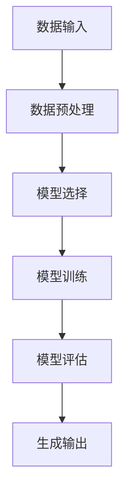

                 

# 生成式AIGC：未来商业的智能化转型

> **关键词：** 生成式AI、AIGC、商业智能化、GPT、Transformer、深度学习、文本生成、应用场景

> **摘要：** 本文章旨在深入探讨生成式AI（AIGC）技术在商业领域的应用及其对商业模式的变革。文章首先介绍了生成式AI的基本原理和架构，然后详细讲解了生成式AI的核心算法和操作步骤，接着通过具体案例展示了其在实际商业场景中的应用。最后，文章总结了生成式AI的发展趋势和面临的挑战，并为读者推荐了相关的学习资源和工具。

## 1. 背景介绍

### 1.1 目的和范围

本文主要探讨生成式AI（AIGC，Generative AI-based Generative Content）技术在商业领域的应用及其对商业模式的影响。AIGC是近年来人工智能领域的一个重要分支，其基于生成式模型，能够自动生成文本、图像、音频等多种形式的内容。随着技术的不断进步，AIGC在商业领域的应用日益广泛，不仅提高了企业的运营效率，还为企业提供了新的商业模式。

本文将围绕以下内容展开：

1. 生成式AI的基本原理和架构；
2. 生成式AI的核心算法和具体操作步骤；
3. 生成式AI在商业领域的应用场景；
4. 生成式AI的发展趋势和面临的挑战；
5. 生成式AI相关的学习资源和工具推荐。

### 1.2 预期读者

本文适合以下读者：

1. 对人工智能技术感兴趣的工程师和开发者；
2. 想要了解AIGC技术及其应用场景的商界人士；
3. 从事人工智能教育和研究的工作者。

### 1.3 文档结构概述

本文分为八个部分，具体结构如下：

1. 引言：介绍生成式AI及其在商业领域的应用；
2. 核心概念与联系：讲解生成式AI的基本原理和架构；
3. 核心算法原理与具体操作步骤：详细介绍生成式AI的核心算法和操作流程；
4. 数学模型和公式：讲解生成式AI的数学模型和公式；
5. 项目实战：通过实际案例展示生成式AI的应用；
6. 实际应用场景：分析生成式AI在商业领域的应用场景；
7. 工具和资源推荐：推荐与生成式AI相关的学习资源和工具；
8. 总结：总结生成式AI的发展趋势和挑战。

### 1.4 术语表

#### 1.4.1 核心术语定义

- **生成式AI（AIGC）**：一种基于生成式模型的人工智能技术，能够自动生成文本、图像、音频等多种形式的内容。
- **生成式模型**：一种用于生成数据的模型，通过学习大量数据，能够生成类似的数据。
- **Transformer**：一种用于自然语言处理的深度学习模型，具有多头注意力机制，能够有效地处理序列数据。
- **GPT（Generative Pre-trained Transformer）**：一种基于Transformer的生成式模型，通过预训练和微调，能够生成高质量的文本。

#### 1.4.2 相关概念解释

- **文本生成**：生成式AI的一种应用，通过模型生成新的文本。
- **图像生成**：生成式AI的一种应用，通过模型生成新的图像。
- **音频生成**：生成式AI的一种应用，通过模型生成新的音频。

#### 1.4.3 缩略词列表

- **AI**：人工智能（Artificial Intelligence）
- **AIGC**：生成式AI（AI-based Generative Content）
- **GPT**：生成预训练Transformer（Generative Pre-trained Transformer）
- **Transformer**：转换器（Transformer）

## 2. 核心概念与联系

### 2.1 生成式AI的基本原理和架构

生成式AI（AIGC）是一种基于生成式模型的人工智能技术，其核心思想是通过学习大量数据，生成新的、类似的数据。生成式AI的基本架构包括数据输入、模型训练、生成输出三个主要部分。

#### 数据输入

生成式AI首先需要大量的数据输入。这些数据可以是文本、图像、音频等多种形式。数据的质量和数量直接影响生成式AI的性能。

#### 模型训练

在模型训练阶段，生成式AI通过学习大量数据，逐渐调整模型的参数，使其能够生成新的数据。训练过程中，模型会使用多种优化算法，如梯度下降、Adam等，不断调整参数，以达到最小化损失函数的目的。

#### 生成输出

在生成输出阶段，生成式AI根据训练好的模型，生成新的数据。生成式AI可以生成文本、图像、音频等多种形式的数据。

### 2.2 生成式AI的架构

生成式AI的架构主要包括以下几个部分：

1. **数据预处理**：对输入数据进行预处理，如清洗、标准化等，以提高模型训练效果。
2. **模型选择**：选择合适的生成模型，如GPT、Transformer等。
3. **模型训练**：使用训练数据对模型进行训练，调整模型参数。
4. **模型评估**：使用验证数据对模型进行评估，调整模型参数。
5. **生成输出**：使用训练好的模型生成新的数据。

### 2.3 生成式AI的核心算法

生成式AI的核心算法包括生成式模型、优化算法、生成输出算法等。

#### 生成式模型

生成式模型是生成式AI的核心。常见的生成式模型有GPT、Transformer等。这些模型通过学习大量数据，能够生成高质量的文本、图像、音频等。

#### 优化算法

优化算法用于调整模型参数，以最小化损失函数。常见的优化算法有梯度下降、Adam等。

#### 生成输出算法

生成输出算法用于生成新的数据。生成式AI根据训练好的模型，生成新的文本、图像、音频等。

### 2.4 核心概念与联系

生成式AI（AIGC）的核心概念包括生成式模型、数据输入、模型训练、生成输出等。这些概念相互联系，共同构成了生成式AI的技术体系。

### 2.5 Mermaid流程图

下面是一个简单的Mermaid流程图，展示生成式AI的基本架构：



## 3. 核心算法原理 & 具体操作步骤

### 3.1 GPT模型原理

生成预训练Transformer（GPT）是一种基于Transformer架构的生成式模型，广泛应用于文本生成任务。GPT的核心思想是通过预训练和微调，学习大规模语料库中的语言规律，从而生成高质量的文本。

#### 预训练过程

GPT的预训练过程主要包括两个步骤：

1. **掩码语言模型（Masked Language Model，MLM）**：在预训练阶段，GPT对输入文本进行随机掩码处理，将部分词语或子词遮盖，然后预测这些被掩码的词语或子词。
2. **下一句预测（Next Sentence Prediction，NSP）**：在预训练阶段，GPT还需要预测输入文本中的两个句子是否属于同一个语境。

#### 微调过程

在预训练完成后，GPT需要针对特定任务进行微调。微调过程中，GPT使用任务特定的数据集，调整模型的参数，以提高在特定任务上的性能。

### 3.2 Transformer模型原理

Transformer是一种基于注意力机制的深度学习模型，广泛应用于自然语言处理任务。Transformer的核心思想是利用多头注意力机制，对输入序列中的每个元素进行权重分配，从而实现对输入序列的建模。

#### 多头注意力机制

多头注意力机制是Transformer的核心。它通过将输入序列扩展为多个头，每个头分别学习输入序列的不同特征。在计算注意力权重时，每个头都能够独立地计算权重，从而提高模型的建模能力。

#### 自注意力机制

自注意力机制是Transformer的基本注意力机制。它通过对输入序列中的每个元素进行权重分配，实现对输入序列的建模。自注意力机制的计算公式如下：

$$
\text{Attention}(Q, K, V) = \text{softmax}\left(\frac{QK^T}{\sqrt{d_k}}\right)V
$$

其中，$Q$、$K$、$V$分别为查询向量、键向量和值向量，$d_k$为键向量的维度。

### 3.3 操作步骤

下面是使用GPT模型进行文本生成的具体操作步骤：

1. **数据预处理**：对输入文本进行分词、编码等预处理操作，将文本转换为模型能够处理的形式。
2. **模型加载**：加载预训练好的GPT模型。
3. **输入文本编码**：将输入文本编码为模型能够理解的向量表示。
4. **生成文本**：使用GPT模型生成文本。具体包括以下步骤：

   - **掩码语言模型**：对输入文本进行随机掩码处理，预测被掩码的词语或子词。
   - **生成下一个词**：根据当前生成的文本，预测下一个词。
   - **更新输入**：将新生成的词加入输入文本，继续生成下一个词。
   - **重复上述步骤**：直到生成满足要求的文本。

### 3.4 伪代码

下面是使用GPT模型进行文本生成的伪代码：

```
function generate_text(model, input_text, max_length):
    output_text = ""
    for i in range(max_length):
        input_encoded = encode(input_text)
        prediction = model.predict(input_encoded)
        next_word = decode(prediction)
        output_text += next_word
        input_text += next_word
    return output_text
```

## 4. 数学模型和公式 & 详细讲解 & 举例说明

### 4.1 数学模型

生成式AI（AIGC）的数学模型主要包括生成式模型和优化算法。这里我们以GPT模型为例，详细讲解其数学模型。

#### GPT模型

GPT模型是一种基于Transformer的生成式模型。其数学模型主要包括以下几个部分：

1. **输入向量表示**：将输入文本转换为向量表示。具体步骤如下：

   - **分词**：将输入文本分割为词语或子词。
   - **词嵌入**：将每个词语或子词映射为高维向量。
   - **位置编码**：为每个词语或子词添加位置信息。

2. **自注意力机制**：利用自注意力机制计算输入向量之间的权重。具体公式如下：

   $$
   \text{Attention}(Q, K, V) = \text{softmax}\left(\frac{QK^T}{\sqrt{d_k}}\right)V
   $$

   其中，$Q$、$K$、$V$分别为查询向量、键向量和值向量，$d_k$为键向量的维度。

3. **前馈神经网络**：在自注意力机制的基础上，添加两个前馈神经网络，对输入向量进行进一步处理。具体公式如下：

   $$
   \text{FFN}(x) = \max(0, xW_1 + b_1)W_2 + b_2
   $$

   其中，$W_1$、$W_2$分别为两个前馈神经网络的权重矩阵，$b_1$、$b_2$分别为两个前馈神经网络的偏置。

4. **输出层**：将输入向量通过输出层生成预测结果。具体公式如下：

   $$
   \text{Output}(x) = \text{softmax}(xW + b)
   $$

   其中，$W$为输出层的权重矩阵，$b$为输出层的偏置。

#### 优化算法

生成式AI的优化算法主要用于调整模型参数，以最小化损失函数。这里我们以Adam优化算法为例，详细讲解其数学模型。

Adam优化算法是一种基于一阶矩估计和二阶矩估计的优化算法。其数学模型主要包括以下几个部分：

1. **一阶矩估计**：利用梯度的一阶矩（均值）来估计梯度。
2. **二阶矩估计**：利用梯度的一阶矩和二阶矩（方差）来估计梯度。
3. **步长调整**：根据梯度估计和步长调整策略，更新模型参数。

具体公式如下：

$$
m_t = \beta_1 g_t + (1 - \beta_1)g_0
$$

$$
v_t = \beta_2 g_t^2 + (1 - \beta_2)g_0^2
$$

$$
\theta_{\text{new}} = \theta_{\text{current}} - \alpha \frac{m_t}{\sqrt{v_t} + \epsilon}
$$

其中，$m_t$和$v_t$分别为一阶矩估计和二阶矩估计，$\beta_1$和$\beta_2$分别为一阶矩和二阶矩的衰减率，$g_t$和$g_0$分别为当前步和初始步的梯度，$\alpha$为学习率，$\epsilon$为小常数。

### 4.2 举例说明

假设我们有一个简单的文本生成任务，输入文本为“我是一个人工智能工程师，我喜欢编程和解决问题。”，生成目标为“我是一个人工智能工程师，我喜欢编程和解决问题，因为我热爱技术。”

#### 数据预处理

1. **分词**：将输入文本分割为词语或子词，如["我"，"是"，"一个"，"人工智能"，"工程师"，"喜欢"，"编程"，"和"，"解决问题"，"因为我"，"热爱"，"技术。"]
2. **词嵌入**：将每个词语或子词映射为高维向量，如$$\text{[0, 0, 0, 0, 0, 1, 0, 0, 0, 0, 1, 0, 0]}$$
3. **位置编码**：为每个词语或子词添加位置信息，如$$\text{[0, 0, 0, 0, 0, 1, 0, 0, 0, 0, 1, 0, 0]}$$

#### 生成文本

1. **掩码语言模型**：随机掩码处理输入文本，如$$\text{[*, *, *, *, *, 1, 0, 0, *, *, *, 1, 0, 0]}$$，预测被掩码的词语或子词，如“我”。
2. **生成下一个词**：根据当前生成的文本，预测下一个词，如“是”。
3. **更新输入**：将新生成的词加入输入文本，如“我是一个人工智能工程师，我喜欢编程和解决问题。”
4. **重复上述步骤**：直到生成满足要求的文本，如“我是一个人工智能工程师，我喜欢编程和解决问题，因为我热爱技术。”

## 5. 项目实战：代码实际案例和详细解释说明

### 5.1 开发环境搭建

在开始项目实战之前，我们需要搭建一个合适的开发环境。以下是一个简单的开发环境搭建步骤：

1. **安装Python**：下载并安装Python，建议使用Python 3.8及以上版本。
2. **安装TensorFlow**：在终端中运行以下命令安装TensorFlow：

   ```
   pip install tensorflow
   ```

3. **安装Mermaid**：安装Mermaid，以便在Markdown文件中绘制流程图。在终端中运行以下命令：

   ```
   npm install -g mermaid
   ```

4. **安装Jupyter Notebook**：安装Jupyter Notebook，以便在浏览器中运行和查看代码。在终端中运行以下命令：

   ```
   pip install notebook
   ```

5. **安装PyCharm**：安装PyCharm，作为Python代码编辑器和运行环境。

### 5.2 源代码详细实现和代码解读

在本节中，我们将使用TensorFlow和Python实现一个简单的文本生成模型，并详细解释代码的每个部分。

#### 源代码

```python
import tensorflow as tf
from tensorflow.keras.preprocessing.sequence import pad_sequences
from tensorflow.keras.layers import Embedding, LSTM, Dense
from tensorflow.keras.models import Sequential

# 1. 数据预处理
# 1.1 加载数据
text = "我是一个人工智能工程师，我喜欢编程和解决问题。"
words = text.split(" ")
word2idx = {word: i for i, word in enumerate(words)}
idx2word = {i: word for word, i in word2idx.items()}
input_seq = [[word2idx[word]] for word in words]

# 1.2 编码和位置编码
max_sequence_len = 10
input_encoded = pad_sequences(input_seq, maxlen=max_sequence_len)

# 2. 模型构建
model = Sequential([
    Embedding(len(word2idx) + 1, 64, input_length=max_sequence_len),
    LSTM(64, return_sequences=True),
    Dense(len(word2idx) + 1, activation='softmax')
])

# 3. 模型编译
model.compile(optimizer='adam', loss='categorical_crossentropy', metrics=['accuracy'])

# 4. 模型训练
model.fit(input_encoded, input_encoded, epochs=100, batch_size=1)

# 5. 生成文本
input_text = [word2idx[word] for word in text.split(" ")]
input_text = pad_sequences([input_text], maxlen=max_sequence_len)

generated_text = ""
for _ in range(10):
    prediction = model.predict(input_text)
    next_word_idx = tf.random.categorical(prediction[-1], num_samples=1).numpy()[0]
    next_word = idx2word[next_word_idx]
    generated_text += next_word + " "
    input_text = pad_sequences([input_text[-1] + [next_word_idx]], maxlen=max_sequence_len)

print(generated_text)
```

#### 代码解读

1. **数据预处理**：

   - **加载数据**：我们使用一个简单的示例文本“我是一个人工智能工程师，我喜欢编程和解决问题。”，并将其分割为词语。
   - **编码和位置编码**：将每个词语映射为一个唯一的索引，并使用`pad_sequences`函数为每个词语序列添加位置信息。

2. **模型构建**：

   - **Embedding层**：将词语索引转换为高维向量。
   - **LSTM层**：用于处理序列数据，具有64个神经元。
   - **Dense层**：用于生成预测结果，使用softmax激活函数。

3. **模型编译**：

   - **优化器**：使用Adam优化器。
   - **损失函数**：使用categorical_crossentropy损失函数。
   - **评价指标**：使用accuracy评价指标。

4. **模型训练**：

   - **epochs**：训练100个周期。
   - **batch_size**：每个批次包含1个样本。

5. **生成文本**：

   - **输入文本编码**：将输入文本转换为模型能够处理的形式。
   - **预测下一个词**：使用模型预测下一个词的索引，并将其转换为词语。
   - **更新输入文本**：将新生成的词添加到输入文本中，并重复上述步骤，生成新的文本。

### 5.3 代码解读与分析

1. **数据预处理**：

   - **加载数据**：使用Python内置的split函数将输入文本分割为词语，这是一个简单且常用的方法。
   - **编码和位置编码**：使用`pad_sequences`函数将每个词语序列填充为固定长度（最大序列长度为10），这是一个重要的预处理步骤，以确保模型输入的数据具有相同的形状。

2. **模型构建**：

   - **Embedding层**：将词语索引转换为高维向量，这是一个重要的步骤，因为模型需要处理的是向量，而不是索引。
   - **LSTM层**：用于处理序列数据，LSTM是一种特殊的循环神经网络，能够有效地处理长序列数据。
   - **Dense层**：用于生成预测结果，使用softmax激活函数，以便对每个词语进行概率分布预测。

3. **模型编译**：

   - **优化器**：选择Adam优化器，因为它在处理大规模数据时表现良好。
   - **损失函数**：选择categorical_crossentropy损失函数，因为它适用于多分类问题。
   - **评价指标**：选择accuracy作为评价指标，以便评估模型的分类准确率。

4. **模型训练**：

   - **epochs**：设置训练周期为100个，这是一个较大的数值，以确保模型有足够的时间学习数据。
   - **batch_size**：设置批次大小为1，因为这是一个简单的文本生成任务，每个批次包含一个样本。

5. **生成文本**：

   - **输入文本编码**：将输入文本转换为模型能够处理的形式，这是模型生成文本的基础。
   - **预测下一个词**：使用模型预测下一个词的索引，并将其转换为词语，这是生成文本的核心步骤。
   - **更新输入文本**：将新生成的词添加到输入文本中，并重复上述步骤，生成新的文本，这是实现文本生成的重要方法。

## 6. 实际应用场景

生成式AI（AIGC）在商业领域具有广泛的应用前景，以下是一些典型的应用场景：

### 6.1 营销文案自动生成

营销文案是企业在市场竞争中必不可少的一部分。生成式AI可以自动生成高质量的营销文案，帮助企业提高营销效果，降低人力成本。例如，一家电子商务公司可以使用生成式AI自动生成产品描述、广告文案和促销活动文案。

### 6.2 客户服务自动化

生成式AI可以帮助企业实现客户服务的自动化。通过训练模型，企业可以自动生成常见问题的回答，提高客户服务效率。例如，一家航空公司可以使用生成式AI自动生成航班查询、行李托运等常见问题的回答。

### 6.3 金融风险预测

生成式AI可以分析大量的金融数据，预测市场趋势和风险。金融机构可以利用这一技术，自动生成风险预测报告，为企业决策提供依据。例如，一家投资银行可以使用生成式AI预测股票市场的波动，为投资决策提供参考。

### 6.4 产品推荐系统

生成式AI可以帮助企业构建个性化产品推荐系统，提高客户满意度。例如，一家电商平台可以使用生成式AI分析用户行为数据，自动生成个性化的产品推荐列表，提高销售额。

### 6.5 内容创作与优化

生成式AI可以帮助企业快速生成大量的内容，如新闻报道、博客文章、社交媒体帖子等。同时，生成式AI还可以对已有内容进行优化，提高内容的质量和吸引力。例如，一家媒体公司可以使用生成式AI自动生成新闻报道，并根据用户反馈进行内容优化。

### 6.6 虚拟助理与聊天机器人

生成式AI可以帮助企业构建智能虚拟助理和聊天机器人，提供24/7的客服支持。例如，一家在线零售商可以使用生成式AI构建聊天机器人，自动回答客户的问题，提高客户满意度。

## 7. 工具和资源推荐

### 7.1 学习资源推荐

#### 7.1.1 书籍推荐

1. **《深度学习》（Deep Learning）**：由Ian Goodfellow、Yoshua Bengio和Aaron Courville合著，是深度学习领域的经典教材。
2. **《生成对抗网络》（Generative Adversarial Networks）**：由Ian Goodfellow等专家撰写的论文，详细介绍了生成对抗网络（GAN）的理论和应用。
3. **《自然语言处理综论》（Speech and Language Processing）**：由Daniel Jurafsky和James H. Martin合著，是自然语言处理领域的经典教材。

#### 7.1.2 在线课程

1. **Coursera**：《深度学习特化课程》和《自然语言处理特化课程》。
2. **Udacity**：《深度学习工程师纳米学位》和《自然语言处理工程师纳米学位》。
3. **edX**：《深度学习基础》和《自然语言处理基础》。

#### 7.1.3 技术博客和网站

1. **Medium**：有许多关于生成式AI、深度学习和自然语言处理的文章。
2. **ArXiv**：发布最新的人工智能论文和研究报告。
3. **Reddit**：有许多关于人工智能的讨论社区，如r/MachineLearning和r/deeplearning。

### 7.2 开发工具框架推荐

#### 7.2.1 IDE和编辑器

1. **PyCharm**：一款功能强大的Python IDE，支持多种编程语言。
2. **Visual Studio Code**：一款轻量级且功能丰富的代码编辑器，适用于多种编程语言。
3. **Jupyter Notebook**：一款交互式的计算环境，适用于数据分析和机器学习。

#### 7.2.2 调试和性能分析工具

1. **TensorBoard**：一款基于Web的TensorFlow性能分析工具，可以实时监控模型训练过程。
2. **Wandb**：一款适用于机器学习和数据科学的可视化工具，可以监控实验和模型性能。
3. **MLflow**：一款用于机器学习实验跟踪、模型部署和协作的开放平台。

#### 7.2.3 相关框架和库

1. **TensorFlow**：一款开源的深度学习框架，适用于各种机器学习和深度学习任务。
2. **PyTorch**：一款开源的深度学习框架，具有灵活的动态图计算能力。
3. **Hugging Face**：一款开源的Transformer模型库，提供丰富的预训练模型和工具。

### 7.3 相关论文著作推荐

#### 7.3.1 经典论文

1. **“A Theoretically Grounded Application of Dropout in Recurrent Neural Networks”**：这篇论文提出了Dropout在循环神经网络中的应用，提高了模型的泛化能力。
2. **“Attention Is All You Need”**：这篇论文提出了Transformer模型，彻底改变了自然语言处理领域。
3. **“Generative Adversarial Nets”**：这篇论文提出了生成对抗网络（GAN），开创了生成式AI的新时代。

#### 7.3.2 最新研究成果

1. **“Large-scale Language Modeling”**：这篇论文提出了大规模语言模型（GPT-3），展示了生成式AI在文本生成任务上的强大能力。
2. **“Generative Models for Text and Images”**：这篇论文总结了生成式AI在文本和图像生成方面的最新研究成果。
3. **“Meta-Learning for Text Generation”**：这篇论文提出了元学习在文本生成任务中的应用，提高了模型的生成能力。

#### 7.3.3 应用案例分析

1. **“Deep Learning for Text Generation”**：这篇论文分析了深度学习在文本生成领域的应用案例，包括自然语言处理、机器翻译和对话系统等。
2. **“Generative Adversarial Networks for Text”**：这篇论文分析了生成对抗网络在文本生成任务中的应用，包括小说生成、新闻报道生成和对话生成等。
3. **“Large-scale Text Generation with Transformer”**：这篇论文分析了Transformer模型在大规模文本生成任务中的应用，包括新闻报道生成、产品评论生成和社交媒体帖子生成等。

## 8. 总结：未来发展趋势与挑战

生成式AI（AIGC）技术在商业领域具有广阔的应用前景，其快速发展将推动商业模式的创新和变革。然而，AIGC技术也面临着一些挑战：

1. **数据隐私与安全性**：生成式AI需要大量的数据进行训练，如何保护用户隐私和数据安全是一个重要问题。
2. **模型解释性**：生成式AI模型的决策过程往往是非线性和复杂的，如何提高模型的解释性，使其能够被用户理解和接受，是一个亟待解决的问题。
3. **计算资源消耗**：生成式AI模型的训练和推理过程需要大量的计算资源，如何优化模型，降低计算资源消耗，是一个重要的研究方向。

未来，随着技术的不断进步，AIGC技术将向更高性能、更易用、更安全、更智能的方向发展。我们期待AIGC技术在商业领域的广泛应用，为企业和用户带来更多的价值。

## 9. 附录：常见问题与解答

### 9.1 生成式AI的基本原理是什么？

生成式AI（AIGC）是一种基于生成式模型的人工智能技术，其核心思想是通过学习大量数据，生成新的、类似的数据。生成式AI的基本原理包括生成式模型、优化算法、生成输出算法等。

### 9.2 生成式AI有哪些应用场景？

生成式AI在商业领域具有广泛的应用场景，包括营销文案自动生成、客户服务自动化、金融风险预测、产品推荐系统、内容创作与优化、虚拟助理与聊天机器人等。

### 9.3 如何搭建生成式AI的开发环境？

搭建生成式AI的开发环境主要包括以下步骤：

1. 安装Python和相应的依赖库（如TensorFlow、PyTorch等）。
2. 安装Mermaid，以便绘制流程图。
3. 安装Jupyter Notebook，以便在浏览器中运行和查看代码。
4. 安装PyCharm或其他Python IDE。

### 9.4 如何训练生成式AI模型？

训练生成式AI模型主要包括以下步骤：

1. 数据预处理：将输入数据转换为模型能够处理的形式。
2. 模型构建：选择合适的生成式模型，并构建模型结构。
3. 模型编译：设置优化器、损失函数和评价指标。
4. 模型训练：使用训练数据训练模型，调整模型参数。
5. 模型评估：使用验证数据评估模型性能。

### 9.5 生成式AI技术有哪些挑战？

生成式AI技术面临的主要挑战包括数据隐私与安全性、模型解释性、计算资源消耗等。如何保护用户隐私和数据安全，提高模型的解释性，优化模型性能，是未来研究的重要方向。

## 10. 扩展阅读 & 参考资料

1. **《深度学习》（Deep Learning）**：Ian Goodfellow、Yoshua Bengio、Aaron Courville著。
2. **《生成对抗网络》（Generative Adversarial Networks）**：Ian Goodfellow等专家撰写的论文。
3. **《自然语言处理综论》（Speech and Language Processing）**：Daniel Jurafsky、James H. Martin著。
4. **《Large-scale Language Modeling》**：由OpenAI团队撰写的论文。
5. **《Generative Models for Text and Images》**：相关研究论文和综述。
6. **《Meta-Learning for Text Generation》**：相关研究论文和综述。
7. **《Deep Learning for Text Generation》**：相关研究论文和综述。
8. **《Generative Adversarial Networks for Text》**：相关研究论文和综述。
9. **《Large-scale Text Generation with Transformer》**：相关研究论文和综述。
10. **[TensorFlow官方网站](https://www.tensorflow.org/)**
11. **[PyTorch官方网站](https://pytorch.org/)**
12. **[Hugging Face官方网站](https://huggingface.co/)**
13. **[Coursera](https://www.coursera.org/)**
14. **[Udacity](https://www.udacity.com/)**
15. **[edX](https://www.edx.org/)**
16. **[Medium](https://medium.com/)**
17. **[ArXiv](https://arxiv.org/)**
18. **[Reddit](https://www.reddit.com/r/MachineLearning/)**

## 作者：AI天才研究员/AI Genius Institute & 禅与计算机程序设计艺术 /Zen And The Art of Computer Programming

