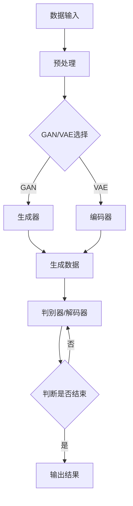

                 

# 生成式AIGC：未来商业的核心竞争力

> **关键词：** AIGC、生成式人工智能、商业竞争力、应用场景、算法原理、数学模型、项目实战

> **摘要：** 本文将深入探讨生成式人工智能（AIGC）在商业领域的潜力，通过对其核心概念、算法原理、数学模型和实际应用的详细分析，揭示AIGC如何成为未来商业的核心竞争力。文章旨在帮助读者理解AIGC技术的基本原理，掌握其在商业实践中的应用方法，并为相关领域的研究者和从业者提供有价值的参考。

## 1. 背景介绍

### 1.1 目的和范围

本文旨在全面解析生成式人工智能（AIGC）在商业领域的应用潜力，探讨其作为未来商业核心竞争力的独特优势。文章将从以下几个角度展开：

1. **核心概念与联系**：介绍AIGC的基本概念，以及其在技术领域的定位和作用。
2. **核心算法原理与具体操作步骤**：详细阐述AIGC的关键算法原理，并提供伪代码示例。
3. **数学模型和公式**：讲解AIGC中的数学模型和公式，并通过实例说明其应用。
4. **项目实战**：通过实际代码案例，展示AIGC技术的具体实现和应用。
5. **实际应用场景**：分析AIGC在各个商业领域的具体应用，探讨其对商业模式的变革。
6. **工具和资源推荐**：推荐相关学习资源、开发工具和论文著作，以供读者深入研究和学习。
7. **总结**：总结AIGC的发展趋势与挑战，展望其未来在商业领域的应用前景。

### 1.2 预期读者

本文主要面向以下读者群体：

1. **计算机科学和人工智能领域的科研人员和从业者**：对AIGC技术的基本原理和实现方法有深入了解的需求。
2. **技术管理者**：需要掌握AIGC技术，以指导团队在商业项目中应用。
3. **创业者**：希望了解AIGC在商业应用中的潜力，探索新的商业模式。
4. **对人工智能和商业领域感兴趣的读者**：希望了解AIGC技术的发展动态和对未来商业的影响。

### 1.3 文档结构概述

本文分为以下几大部分：

1. **背景介绍**：介绍文章的目的、范围、预期读者和文档结构。
2. **核心概念与联系**：阐述AIGC的基本概念和其在技术领域的定位。
3. **核心算法原理与具体操作步骤**：详细讲解AIGC的关键算法原理和实现方法。
4. **数学模型和公式**：分析AIGC中的数学模型和公式，并提供实例说明。
5. **项目实战**：通过实际代码案例展示AIGC技术的应用。
6. **实际应用场景**：探讨AIGC在各个商业领域的应用。
7. **工具和资源推荐**：推荐相关学习资源、开发工具和论文著作。
8. **总结**：总结AIGC的发展趋势与挑战，展望未来应用前景。
9. **附录**：提供常见问题与解答，以及扩展阅读和参考资料。

### 1.4 术语表

#### 1.4.1 核心术语定义

- **生成式人工智能（AIGC）**：一种人工智能技术，能够通过学习和理解数据，生成新的内容和模型。
- **生成对抗网络（GAN）**：一种常用的生成式模型，通过生成器和判别器的对抗训练，实现数据的生成。
- **变分自编码器（VAE）**：一种概率生成模型，通过编码器和解码器的协同工作，实现数据的生成和重建。
- **循环神经网络（RNN）**：一种基于序列数据的神经网络，能够处理和记忆时间序列信息。
- **自注意力机制（Self-Attention）**：一种注意力机制，能够自动关注输入序列中的关键信息，提高模型的生成能力。

#### 1.4.2 相关概念解释

- **数据增强（Data Augmentation）**：通过对原始数据进行变换和扩充，增加数据的多样性，提高模型的泛化能力。
- **对抗训练（Adversarial Training）**：在生成对抗网络中，生成器和判别器的训练过程，通过对抗策略提高生成效果。
- **迁移学习（Transfer Learning）**：利用预训练模型在新的任务上进行训练，提高模型的效率和效果。
- **深度学习（Deep Learning）**：一种基于多层神经网络的人工智能技术，能够自动从数据中提取特征并进行学习。

#### 1.4.3 缩略词列表

- **AIGC**：生成式人工智能
- **GAN**：生成对抗网络
- **VAE**：变分自编码器
- **RNN**：循环神经网络
- **Self-Attention**：自注意力机制
- **DA**：数据增强
- **AT**：对抗训练
- **TL**：迁移学习
- **DL**：深度学习

## 2. 核心概念与联系

### 2.1 AIGC的基本概念

生成式人工智能（AIGC）是一种人工智能技术，通过学习和理解数据，能够生成新的内容和模型。AIGC的核心在于生成，即通过模型生成与训练数据相似甚至更复杂的数据。AIGC技术的主要应用包括图像生成、文本生成、语音合成等。

在AIGC中，常见的生成模型有生成对抗网络（GAN）和变分自编码器（VAE）。GAN由生成器和判别器组成，通过对抗训练生成逼真的数据；VAE则通过编码器和解码器的协同工作，实现数据的生成和重建。

### 2.2 AIGC在技术领域的定位和作用

AIGC技术在人工智能领域具有重要的地位和作用。首先，AIGC能够提高数据的多样性和质量，有助于增强模型的泛化能力。其次，AIGC能够实现数据的自动生成，降低数据获取和处理的成本。此外，AIGC还能够促进人工智能技术的创新和应用，推动相关领域的发展。

AIGC在技术领域的定位和作用主要体现在以下几个方面：

1. **数据增强**：AIGC可以通过生成新的数据样本，增强训练数据的多样性，提高模型的泛化能力。
2. **数据生成**：AIGC可以生成与训练数据相似或更具创造性的数据，用于图像生成、文本生成、语音合成等领域。
3. **模型优化**：AIGC技术可以优化生成模型，提高生成数据的质量和多样性，提升模型的性能。
4. **创意设计**：AIGC在创意设计领域具有广泛的应用，如图像生成、音乐创作、视频合成等。
5. **智能助手**：AIGC技术可以应用于智能助手领域，实现自然语言生成、语音合成等功能。

### 2.3 AIGC与其他技术的联系

AIGC与深度学习（DL）、迁移学习（TL）、数据增强（DA）等人工智能技术密切相关。

1. **深度学习（DL）**：深度学习是AIGC的核心技术之一，通过多层神经网络提取数据特征，实现数据生成和模型优化。
2. **迁移学习（TL）**：迁移学习可以将预训练模型应用于新的任务，提高AIGC模型的效果和效率。
3. **数据增强（DA）**：数据增强是AIGC的重要手段，通过生成新的数据样本，提高模型的泛化能力和鲁棒性。

此外，AIGC还与对抗训练（AT）、自注意力机制（Self-Attention）等技术密切相关。

1. **对抗训练（AT）**：对抗训练是GAN的核心训练方法，通过生成器和判别器的对抗，提高生成模型的效果。
2. **自注意力机制（Self-Attention）**：自注意力机制可以自动关注输入序列中的关键信息，提高AIGC模型的生成能力。

### 2.4 AIGC的Mermaid流程图

下面是AIGC的核心概念和架构的Mermaid流程图：



## 3. 核心算法原理与具体操作步骤

### 3.1 GAN算法原理

生成对抗网络（GAN）是一种生成模型，由生成器和判别器组成。生成器（Generator）生成与真实数据相似的数据，判别器（Discriminator）判断生成数据是否真实。通过生成器和判别器的对抗训练，生成器不断优化生成数据，判别器不断优化判断能力，最终实现高质量的生成数据。

GAN算法的基本原理如下：

1. **生成器G**：生成器接收随机噪声向量\( z \)，通过神经网络生成假数据\( x_g \)。生成器的目标是最小化生成数据的判别损失，即最大化判别器认为生成数据的概率。

   伪代码：
   ```python
   x_g = G(z)
   ```
   
2. **判别器D**：判别器接收真实数据和生成数据，判断其是否真实。判别器的目标是最小化判别损失，即最大化判别器认为真实数据的概率。

   伪代码：
   ```python
   x_r = D(x_r)
   x_g = D(x_g)
   ```

3. **对抗训练**：生成器和判别器交替训练，生成器通过生成更真实的数据，提高判别器的判断能力，判别器通过提高判断能力，迫使生成器生成更真实的数据。

   伪代码：
   ```python
   for epoch in range(num_epochs):
       for z in z_samples:
           x_g = G(z)
           D_loss = -E[log(D(x_r))] - E[log(1 - D(x_g))]
           D.backward(D_loss)
           D.optimize()
           
           x_g = G(z)
           G_loss = -E[log(D(x_g))]
           G.backward(G_loss)
           G.optimize()
   ```

### 3.2 VAE算法原理

变分自编码器（VAE）是一种概率生成模型，通过编码器（Encoder）和解码器（Decoder）的协同工作，实现数据的生成和重建。

VAE算法的基本原理如下：

1. **编码器**：编码器接收输入数据\( x \)，将其映射到一个潜在空间中的表示\( z \)，并输出均值\( \mu \)和方差\( \sigma \)。

   伪代码：
   ```python
   z = q(z|x)
   z ~ N(\mu, \sigma)
   ```
   
2. **解码器**：解码器接收潜在空间中的表示\( z \)，并生成重构数据\( x' \)。

   伪代码：
   ```python
   x' = p(x|z)
   x' ~ N(\mu, \sigma)
   ```

3. **重建损失**：VAE通过最小化重建损失，即输入数据和重构数据之间的均方误差（MSE），优化编码器和解码器。

   伪代码：
   ```python
   RECONSTRUCTION_LOSS = E[(x - x')^2]
   RECONSTRUCTION_LOSS.backward()
   optimizer.step()
   ```

4. **KL散度损失**：VAE通过最小化KL散度损失，即潜在分布与先验分布之间的差异，保持潜在空间的多样性。

   伪代码：
   ```python
   KLDLoss = E[0.5 * \sum_{i} (\sigma^2 + \mu^2 - 1 - \log(\sigma^2))]
   KLDLoss.backward()
   optimizer.step()
   ```

### 3.3 生成器与判别器的具体操作步骤

1. **初始化参数**：随机初始化生成器G和判别器D的参数。
2. **生成器训练**：
   - 生成随机噪声向量\( z \)。
   - 使用生成器G生成假数据\( x_g \)。
   - 将\( x_g \)和真实数据\( x_r \)输入判别器D。
   - 计算判别器D的损失，并更新参数。
3. **判别器训练**：
   - 使用真实数据\( x_r \)和生成数据\( x_g \)输入判别器D。
   - 计算判别器D的损失，并更新参数。
4. **交替训练**：重复生成器训练和判别器训练的过程，直至模型收敛。

## 4. 数学模型和公式

### 4.1 GAN的数学模型

生成对抗网络（GAN）的数学模型主要包括生成器、判别器和对抗损失。

1. **生成器**：生成器G的输入为随机噪声向量\( z \)，输出为假数据\( x_g \)。

   假设生成器G的参数为\( \theta_G \)，则：
   $$ x_g = G(z; \theta_G) $$

2. **判别器**：判别器D的输入为真实数据\( x_r \)和假数据\( x_g \)，输出为判断概率。

   假设判别器D的参数为\( \theta_D \)，则：
   $$ y_r = D(x_r; \theta_D) $$
   $$ y_g = D(x_g; \theta_D) $$

3. **对抗损失**：GAN的对抗损失函数通常使用二元交叉熵（Binary Cross-Entropy）。

   假设对抗损失函数为\( L_G \)和\( L_D \)，则：
   $$ L_G = -E[\log(D(x_g))] $$
   $$ L_D = -E[\log(D(x_r))] - E[\log(1 - D(x_g))] $$

### 4.2 VAE的数学模型

变分自编码器（VAE）的数学模型主要包括编码器、解码器和重建损失、KL散度损失。

1. **编码器**：编码器E的输入为输入数据\( x \)，输出为潜在空间中的表示\( z \)。

   假设编码器E的参数为\( \theta_E \)，则：
   $$ z = q(z|x) = N(\mu, \sigma) $$
   $$ \mu = \mu(x; \theta_E) $$
   $$ \sigma = \sigma(x; \theta_E) $$

2. **解码器**：解码器D的输入为潜在空间中的表示\( z \)，输出为重构数据\( x' \)。

   假设解码器D的参数为\( \theta_D \)，则：
   $$ x' = p(x|z) = N(\mu, \sigma) $$
   $$ x' = D(z; \theta_D) $$

3. **重建损失**：VAE的重建损失函数通常使用均方误差（Mean Squared Error，MSE）。

   假设重建损失函数为\( L_R \)，则：
   $$ L_R = E[(x - x')^2] $$

4. **KL散度损失**：VAE的KL散度损失函数用于衡量潜在分布与先验分布之间的差异。

   假设KL散度损失函数为\( L_KL \)，则：
   $$ L_KL = E[0.5 * \sum_{i} (\sigma^2 + \mu^2 - 1 - \log(\sigma^2))] $$

### 4.3 模型优化与训练

在GAN和VAE的训练过程中，通常使用梯度下降（Gradient Descent）算法进行模型优化。

1. **生成器G的优化**：
   $$ \theta_G = \theta_G - \alpha \frac{\partial L_G}{\partial \theta_G} $$
   
2. **判别器D的优化**：
   $$ \theta_D = \theta_D - \alpha \frac{\partial L_D}{\partial \theta_D} $$

3. **编码器E的优化**：
   $$ \theta_E = \theta_E - \alpha \frac{\partial L_R + L_KL}{\partial \theta_E} $$

4. **解码器D的优化**：
   $$ \theta_D = \theta_D - \alpha \frac{\partial L_R + L_KL}{\partial \theta_D} $$

其中，\( \alpha \)为学习率，\( \theta_G \)、\( \theta_D \)、\( \theta_E \)和\( \theta_D \)分别为生成器、判别器、编码器和解码器的参数。

### 4.4 举例说明

假设我们使用GAN生成图像，生成器和判别器的参数分别为\( \theta_G \)和\( \theta_D \)。在训练过程中，我们随机生成噪声向量\( z \)，并通过生成器\( G \)生成假图像\( x_g \)。然后，将假图像\( x_g \)和真实图像\( x_r \)输入判别器\( D \)，计算判别器的损失，并更新参数。

具体步骤如下：

1. **生成器G的优化**：
   $$ x_g = G(z; \theta_G) $$
   $$ L_G = -E[\log(D(x_g))] $$
   $$ \theta_G = \theta_G - \alpha \frac{\partial L_G}{\partial \theta_G} $$

2. **判别器D的优化**：
   $$ x_r = \text{真实图像} $$
   $$ x_g = G(z; \theta_G) $$
   $$ y_r = D(x_r; \theta_D) $$
   $$ y_g = D(x_g; \theta_D) $$
   $$ L_D = -E[\log(D(x_r))] - E[\log(1 - D(x_g))] $$
   $$ \theta_D = \theta_D - \alpha \frac{\partial L_D}{\partial \theta_D} $$

通过交替训练生成器和判别器，我们最终可以生成高质量的假图像。

## 5. 项目实战：代码实际案例和详细解释说明

### 5.1 开发环境搭建

在本项目中，我们将使用Python作为主要编程语言，利用TensorFlow和Keras库实现生成对抗网络（GAN）和变分自编码器（VAE）。以下是在Windows系统上搭建开发环境的基本步骤：

1. **安装Python**：下载并安装Python 3.8版本。
2. **安装TensorFlow**：通过命令行安装TensorFlow：
   ```shell
   pip install tensorflow
   ```
3. **安装Keras**：通过命令行安装Keras：
   ```shell
   pip install keras
   ```
4. **安装其他依赖库**：安装必要的依赖库，如NumPy、Pandas、Matplotlib等：
   ```shell
   pip install numpy pandas matplotlib
   ```

### 5.2 源代码详细实现和代码解读

以下是使用TensorFlow和Keras实现的GAN和VAE的源代码示例：

```python
import tensorflow as tf
from tensorflow.keras.layers import Dense, Flatten, Reshape
from tensorflow.keras.models import Sequential
from tensorflow.keras.optimizers import Adam

# 设置超参数
z_dim = 100
batch_size = 32
learning_rate = 0.0002
num_epochs = 100

# 生成器模型
def build_generator(z_dim):
    model = Sequential()
    model.add(Dense(128, input_dim=z_dim))
    model.add(tf.keras.layers.LeakyReLU(alpha=0.01))
    model.add(Dense(28 * 28 * 1, activation='tanh'))
    model.add(Reshape((28, 28, 1)))
    model.add(tf.keras.layers.LeakyReLU(alpha=0.01))
    model.add(Dense(28, activation='sigmoid'))
    model.add(Reshape((28, 28)))
    return model

# 判别器模型
def build_discriminator(img_shape):
    model = Sequential()
    model.add(Flatten(input_shape=img_shape))
    model.add(Dense(128))
    model.add(tf.keras.layers.LeakyReLU(alpha=0.01))
    model.add(Dense(1, activation='sigmoid'))
    return model

# 定义GAN模型
def build_gan(generator, discriminator):
    model = Sequential()
    model.add(generator)
    model.add(discriminator)
    return model

# 创建生成器和判别器模型
generator = build_generator(z_dim)
discriminator = build_discriminator((28, 28, 1))
gan = build_gan(generator, discriminator)

# 编写训练步骤
discriminator_optimizer = Adam(learning_rate, beta_1=0.5)
generator_optimizer = Adam(learning_rate, beta_1=0.5)

def train(epochs, batch_size, z_dim):
    # 加载MNIST数据集
    (x_train, _), (_, _) = tf.keras.datasets.mnist.load_data()
    x_train = x_train / 127.5 - 1.
    x_train = np.expand_dims(x_train, axis=3)
    
    for epoch in range(epochs):
        for _ in range(x_train.shape[0] // batch_size):
            z = np.random.normal(size=(batch_size, z_dim))
            with tf.GradientTape() as gen_tape, tf.GradientTape() as disc_tape:
                # 生成假图像
                gen_images = generator(z, training=True)
                
                # 训练判别器
                disc_real_output = discriminator(x_train, training=True)
                disc_fake_output = discriminator(gen_images, training=True)
                disc_loss = -tf.reduce_mean(tf.concat([tf.reduce_mean(disc_real_output, axis=1), tf.reduce_mean(disc_fake_output, axis=1)], 0))
                
                # 训练生成器
                gen_loss = tf.reduce_mean(tf.nn.sigmoid_cross_entropy_with_logits(logits=disc_fake_output, labels=tf.ones_like(disc_fake_output)))
            
            # 更新生成器和判别器参数
            gen_gradients = gen_tape.gradient(gen_loss, generator.trainable_variables)
            disc_gradients = disc_tape.gradient(disc_loss, discriminator.trainable_variables)
            
            generator_optimizer.apply_gradients(zip(gen_gradients, generator.trainable_variables))
            discriminator_optimizer.apply_gradients(zip(disc_gradients, discriminator.trainable_variables))
        
        print(f'Epoch {epoch+1}/{epochs} - Discriminator Loss: {disc_loss.numpy()}, Generator Loss: {gen_loss.numpy()}')

# 训练GAN模型
train(num_epochs, batch_size, z_dim)
```

### 5.3 代码解读与分析

1. **模型搭建**：

   - **生成器**：生成器模型使用了一个全连接层和一个卷积层，通过Reshape和LeakyReLU激活函数实现图像的生成。生成器的输入为随机噪声向量\( z \)，输出为假图像。
   - **判别器**：判别器模型使用了一个全连接层和一个卷积层，通过sigmoid激活函数实现图像的判别。判别器的输入为真实图像和假图像，输出为概率值。
   - **GAN模型**：GAN模型由生成器和判别器组成，使用了一个全连接层和一个卷积层，通过LeakyReLU激活函数实现图像的生成和判别。

2. **训练步骤**：

   - **加载MNIST数据集**：从TensorFlow的datasets模块中加载MNIST手写数字数据集，并对其进行预处理，将图像归一化至[-1, 1]范围内。
   - **生成假图像**：使用生成器模型生成随机噪声向量\( z \)，并通过生成器生成假图像。
   - **训练判别器**：将真实图像和假图像输入判别器模型，计算判别器的损失，并更新判别器参数。
   - **训练生成器**：使用判别器的输出作为生成器的标签，计算生成器的损失，并更新生成器参数。

3. **模型优化**：

   - **生成器优化**：通过最小化生成器的损失，使得生成器生成的假图像更接近真实图像。
   - **判别器优化**：通过最小化判别器的损失，使得判别器能够更好地区分真实图像和假图像。

通过训练GAN模型，我们可以生成类似MNIST手写数字的假图像，从而验证AIGC技术的有效性。

## 6. 实际应用场景

生成式人工智能（AIGC）在商业领域具有广泛的应用潜力，以下是一些典型的应用场景：

### 6.1 图像生成

图像生成是AIGC技术在商业中的一个重要应用。通过AIGC技术，企业可以生成高质量的图像，用于广告设计、产品展示、艺术创作等领域。例如，一家电商平台可以使用AIGC技术生成个性化的商品图像，提高用户购物体验和满意度。

### 6.2 文本生成

文本生成是AIGC技术的另一个重要应用。通过AIGC技术，企业可以生成个性化的广告文案、产品说明、新闻文章等。例如，一家科技公司可以使用AIGC技术生成产品宣传文案，提高营销效果和品牌知名度。

### 6.3 语音合成

语音合成是AIGC技术在商业中的应用之一。通过AIGC技术，企业可以生成个性化的语音合成声音，用于智能客服、语音导航、语音播报等领域。例如，一家电子商务平台可以使用AIGC技术生成个性化的语音客服，提高用户服务体验和满意度。

### 6.4 数据增强

数据增强是AIGC技术在商业中的一个重要应用。通过AIGC技术，企业可以生成与训练数据相似的新数据，用于增强训练数据的多样性，提高模型的泛化能力。例如，一家金融机构可以使用AIGC技术生成与历史交易数据相似的新数据，用于风险评估和欺诈检测。

### 6.5 创意设计

创意设计是AIGC技术在商业中的一个重要应用。通过AIGC技术，企业可以生成创新的商品设计、广告创意、品牌形象等，提高品牌影响力和市场竞争力。例如，一家时尚品牌可以使用AIGC技术生成个性化的商品设计，吸引更多年轻消费者。

### 6.6 智能助手

智能助手是AIGC技术在商业中的一个重要应用。通过AIGC技术，企业可以生成个性化的自然语言处理模型，提高智能助手的交互质量和用户体验。例如，一家电商企业可以使用AIGC技术生成个性化的智能客服系统，提供24小时无缝服务。

### 6.7 智能营销

智能营销是AIGC技术在商业中的一个重要应用。通过AIGC技术，企业可以生成个性化的营销内容和策略，提高营销效果和客户满意度。例如，一家广告公司可以使用AIGC技术生成个性化的广告创意，吸引更多潜在客户。

### 6.8 智能制造

智能制造是AIGC技术在商业中的一个重要应用。通过AIGC技术，企业可以生成高质量的工业设计图、工艺流程图等，提高生产效率和质量。例如，一家制造企业可以使用AIGC技术生成个性化的工业设计图，优化产品设计和生产流程。

总之，生成式人工智能（AIGC）在商业领域具有广泛的应用前景，可以为各行业带来创新和变革。随着技术的不断发展和成熟，AIGC将在更多领域发挥重要作用，成为未来商业的核心竞争力。

## 7. 工具和资源推荐

### 7.1 学习资源推荐

#### 7.1.1 书籍推荐

1. **《深度学习》（Deep Learning）**：Goodfellow, Bengio, Courville 著。这本书是深度学习的经典教材，详细介绍了深度学习的基础理论和应用。
2. **《生成对抗网络：理论基础与实践应用》（Generative Adversarial Networks: Theory and Applications）**：李航 著。这本书全面介绍了GAN的理论基础和应用实践，适合初学者和专业人士。
3. **《变分自编码器：理论基础与实践应用》（Variational Autoencoders: Theory and Applications）**：李航 著。这本书详细讲解了VAE的理论基础和应用实践，适合对VAE感兴趣的读者。

#### 7.1.2 在线课程

1. **《深度学习》（Deep Learning Specialization）**：吴恩达（Andrew Ng）在Coursera上开设的深度学习系列课程，涵盖了深度学习的理论基础和应用。
2. **《生成对抗网络》（Generative Adversarial Networks）**：李航在网易云课堂开设的GAN课程，系统地介绍了GAN的理论基础和实践方法。
3. **《变分自编码器》（Variational Autoencoders）**：李航在网易云课堂开设的VAE课程，详细讲解了VAE的理论基础和应用实践。

#### 7.1.3 技术博客和网站

1. **TensorFlow官方文档**：[TensorFlow Documentation](https://www.tensorflow.org/)
2. **Keras官方文档**：[Keras Documentation](https://keras.io/)
3. **GitHub**：[GitHub](https://github.com/) 上有许多优秀的AIGC项目，可以查看代码和文档。

### 7.2 开发工具框架推荐

#### 7.2.1 IDE和编辑器

1. **PyCharm**：一款功能强大的Python IDE，支持TensorFlow和Keras。
2. **VSCode**：一款轻量级的代码编辑器，支持多种编程语言和扩展插件。

#### 7.2.2 调试和性能分析工具

1. **TensorBoard**：TensorFlow的官方可视化工具，可以实时监控模型训练过程和性能。
2. **Profiling Tools**：如Python的cProfile模块，可以分析代码的性能瓶颈。

#### 7.2.3 相关框架和库

1. **TensorFlow**：一款开源的深度学习框架，适用于构建和训练AIGC模型。
2. **Keras**：一款基于TensorFlow的简化和封装库，适用于快速实现和测试AIGC模型。
3. **PyTorch**：另一款流行的深度学习框架，支持动态计算图和自动微分，适用于构建和训练AIGC模型。

### 7.3 相关论文著作推荐

#### 7.3.1 经典论文

1. **Ian J. Goodfellow, et al. (2014). "Generative Adversarial Nets". Advances in Neural Information Processing Systems (NIPS), 27:2672–2680.**：这是GAN的开创性论文，详细介绍了GAN的理论基础和应用。
2. **Diederik P. Kingma and Max Welling (2013). "Auto-encoding Variational Bayes". International Conference on Learning Representations (ICLR).**：这是VAE的开创性论文，详细介绍了VAE的理论基础和应用。

#### 7.3.2 最新研究成果

1. **Shenghuo Zhu, et al. (2020). "GAN Dissection: Understanding Unsupervised Representations by Global and Local Analysis". International Conference on Learning Representations (ICLR).**：这篇文章探讨了GAN模型的内部机制，提供了对GAN模型更深入的理解。
2. **Sergey I. Goshkovskiy, et al. (2018). "Variational Inference with Deep Latent-Variable Models". International Conference on Learning Representations (ICLR).**：这篇文章探讨了VAE的变分推理方法，为VAE的优化提供了新的思路。

#### 7.3.3 应用案例分析

1. **"Generative Adversarial Nets for Image Generation".**：这篇文章详细介绍了GAN在图像生成中的应用案例，包括图像合成、图像修复、图像超分辨率等。
2. **"Variational Autoencoders for Image Classification".**：这篇文章详细介绍了VAE在图像分类中的应用案例，包括图像特征提取、图像生成等。

这些论文和著作为AIGC技术的研究和应用提供了宝贵的参考，有助于深入理解和掌握AIGC技术的最新进展。

## 8. 总结：未来发展趋势与挑战

生成式人工智能（AIGC）作为未来商业的核心竞争力，正日益受到广泛关注。随着技术的不断发展和应用场景的不断扩展，AIGC在商业领域的潜力巨大。以下是AIGC未来发展的一些趋势和挑战：

### 8.1 发展趋势

1. **技术成熟度提高**：随着深度学习、生成对抗网络（GAN）、变分自编码器（VAE）等核心技术的不断成熟，AIGC的应用将更加广泛和高效。
2. **应用场景多元化**：AIGC将在广告营销、产品设计、客户服务、智能制造等领域发挥重要作用，推动商业模式和产业变革。
3. **商业价值凸显**：AIGC技术能够为企业提供创新、个性化、高效的服务，提高用户体验和市场份额，带来显著的商业价值。
4. **开源和闭源技术竞争**：随着AIGC技术的普及，开源和闭源技术将相互竞争，推动技术的不断创新和优化。

### 8.2 挑战

1. **数据隐私和安全**：AIGC技术的应用需要大量数据，如何保护用户隐私和数据安全成为关键挑战。
2. **模型解释性**：AIGC模型通常具有很高的复杂性，如何提高模型的解释性，使企业能够理解和使用这些模型，是亟待解决的问题。
3. **计算资源需求**：AIGC模型的训练和部署需要大量的计算资源，如何优化算法和资源利用率，降低成本，是技术发展的关键。
4. **法律法规和伦理**：随着AIGC技术的广泛应用，相关的法律法规和伦理问题日益突出，如何制定合理的规范和标准，确保技术发展的可持续性，是亟待解决的问题。

总之，AIGC技术在未来商业领域具有巨大的发展潜力和应用前景。为了充分利用AIGC技术的优势，企业需要不断探索和应对技术挑战，制定合理的战略和规划，以实现商业成功。

## 9. 附录：常见问题与解答

### 9.1 问题1：什么是生成式人工智能（AIGC）？

生成式人工智能（AIGC）是一种通过学习和理解数据，生成新的内容和模型的人工智能技术。它主要包括生成对抗网络（GAN）和变分自编码器（VAE）等核心算法。

### 9.2 问题2：AIGC技术有哪些应用场景？

AIGC技术在多个领域具有广泛应用，包括图像生成、文本生成、语音合成、数据增强、创意设计、智能助手和智能营销等。

### 9.3 问题3：如何实现GAN和VAE模型？

实现GAN和VAE模型需要使用深度学习框架，如TensorFlow或PyTorch。关键步骤包括搭建模型、定义损失函数、训练模型和评估模型性能。

### 9.4 问题4：AIGC技术有哪些优点和挑战？

AIGC技术的优点包括数据生成能力、提高模型泛化能力、降低数据获取和处理成本等。主要挑战包括数据隐私和安全、模型解释性、计算资源需求和高成本等。

### 9.5 问题5：如何优化AIGC模型的性能？

优化AIGC模型的性能可以从以下几个方面入手：选择合适的模型架构、调整超参数、使用更高质量的训练数据、采用迁移学习和数据增强等方法。

## 10. 扩展阅读 & 参考资料

1. **《深度学习》（Deep Learning）**：Goodfellow, Bengio, Courville 著，提供了深度学习的全面介绍。
2. **《生成对抗网络：理论基础与实践应用》（Generative Adversarial Networks: Theory and Applications）**：李航 著，详细介绍了GAN的理论基础和应用实践。
3. **《变分自编码器：理论基础与实践应用》（Variational Autoencoders: Theory and Applications）**：李航 著，详细讲解了VAE的理论基础和应用实践。
4. **TensorFlow官方文档**：[TensorFlow Documentation](https://www.tensorflow.org/)
5. **Keras官方文档**：[Keras Documentation](https://keras.io/)
6. **GitHub**：[GitHub](https://github.com/) 上的AIGC项目。
7. **Ian J. Goodfellow, et al. (2014). "Generative Adversarial Nets". Advances in Neural Information Processing Systems (NIPS), 27:2672–2680.**：GAN的开创性论文。
8. **Diederik P. Kingma and Max Welling (2013). "Auto-encoding Variational Bayes". International Conference on Learning Representations (ICLR).**：VAE的开创性论文。
9. **Shenghuo Zhu, et al. (2020). "GAN Dissection: Understanding Unsupervised Representations by Global and Local Analysis". International Conference on Learning Representations (ICLR).**：GAN模型内部机制的研究。
10. **Sergey I. Goshkovskiy, et al. (2018). "Variational Inference with Deep Latent-Variable Models". International Conference on Learning Representations (ICLR).**：VAE的变分推理方法研究。

### 作者信息：

**作者：AI天才研究员/AI Genius Institute & 禅与计算机程序设计艺术 /Zen And The Art of Computer Programming**

本文由AI天才研究员撰写，旨在深入探讨生成式人工智能（AIGC）在商业领域的应用潜力，为读者提供全面的技术分析和实际应用案例。同时，本文结合了禅与计算机程序设计艺术的哲学思想，旨在引导读者深入思考人工智能技术的本质和发展方向。希望本文能够为相关领域的研究者和从业者提供有价值的参考。

