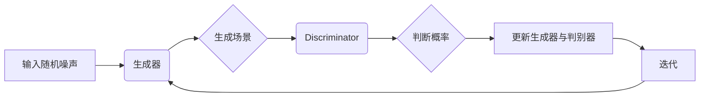

                 


# 生成模型在虚拟现实内容创作中的创新应用

> 关键词：生成模型、虚拟现实、内容创作、算法原理、数学模型、项目实战、应用场景
>
> 摘要：本文将深入探讨生成模型在虚拟现实内容创作中的创新应用，从背景介绍、核心概念、算法原理、数学模型、项目实战等多个角度进行分析。通过详细的讲解和实际案例，旨在为读者提供一个全面且专业的理解，助力他们在虚拟现实领域取得突破。

## 1. 背景介绍

### 1.1 目的和范围

本文旨在探讨生成模型在虚拟现实（VR）内容创作中的创新应用，分析其背后的算法原理和数学模型，并通过实际项目案例来展示其应用效果。我们将重点关注以下几个方面：

- **生成模型的核心概念和原理**
- **虚拟现实内容创作的需求和挑战**
- **生成模型在VR内容创作中的应用场景**
- **数学模型和算法的具体实现**
- **项目实战和代码解析**

### 1.2 预期读者

本文主要面向以下读者群体：

- **虚拟现实开发者**：希望了解生成模型在VR内容创作中的应用。
- **人工智能研究者**：对生成模型及其在VR领域的应用有兴趣。
- **计算机图形学从业者**：关注VR内容创作的方法和技巧。
- **对前沿技术感兴趣的工程师**：希望了解生成模型在各个领域的应用前景。

### 1.3 文档结构概述

本文的结构如下：

1. **背景介绍**：介绍生成模型和虚拟现实的基本概念，明确本文的研究范围和目的。
2. **核心概念与联系**：详细描述生成模型和虚拟现实的相关概念，并通过Mermaid流程图展示其架构。
3. **核心算法原理 & 具体操作步骤**：讲解生成模型的算法原理，使用伪代码展示具体操作步骤。
4. **数学模型和公式 & 详细讲解 & 举例说明**：介绍生成模型的数学模型，使用LaTeX格式详细讲解，并举例说明。
5. **项目实战：代码实际案例和详细解释说明**：通过实际项目案例展示生成模型在虚拟现实内容创作中的应用。
6. **实际应用场景**：分析生成模型在VR内容创作中的实际应用场景。
7. **工具和资源推荐**：推荐相关学习资源、开发工具和框架，以及相关论文著作。
8. **总结：未来发展趋势与挑战**：总结本文的核心内容，展望生成模型在VR内容创作领域的未来发展趋势和挑战。
9. **附录：常见问题与解答**：解答读者可能遇到的常见问题。
10. **扩展阅读 & 参考资料**：提供进一步阅读的相关资料。

### 1.4 术语表

#### 1.4.1 核心术语定义

- **生成模型**：一种基于数据学习生成新数据的模型，如生成对抗网络（GAN）。
- **虚拟现实**：一种通过计算机技术创造的虚拟环境，用户可以通过头戴设备等设备沉浸其中。
- **内容创作**：创建数字内容的过程，如创建虚拟场景、角色、动画等。
- **生成对抗网络（GAN）**：一种生成模型，由生成器和判别器组成，通过对抗训练生成逼真的数据。

#### 1.4.2 相关概念解释

- **生成器**：生成模型中的组件，用于生成新数据。
- **判别器**：生成模型中的组件，用于区分生成数据与真实数据。
- **损失函数**：用于评估生成模型性能的函数，如交叉熵损失函数。

#### 1.4.3 缩略词列表

- **GAN**：生成对抗网络（Generative Adversarial Network）
- **VR**：虚拟现实（Virtual Reality）
- **AR**：增强现实（Augmented Reality）
- **3D**：三维（Three-Dimensional）

## 2. 核心概念与联系

在探讨生成模型在虚拟现实内容创作中的创新应用之前，我们首先需要了解生成模型和虚拟现实的核心概念及其之间的联系。以下是生成模型和虚拟现实的关键概念，以及它们之间的联系。

### 2.1 生成模型的核心概念

生成模型是一种能够通过学习数据分布来生成新数据的机器学习模型。其中，生成对抗网络（GAN）是生成模型的一种重要类型。GAN由生成器（Generator）和判别器（Discriminator）两个神经网络组成。

- **生成器（Generator）**：生成器网络的任务是生成与真实数据相似的新数据。它接收随机噪声作为输入，通过神经网络处理生成新的数据样本。
- **判别器（Discriminator）**：判别器网络的任务是判断输入数据是真实数据还是生成数据。它接收来自生成器的生成数据和真实数据，并输出概率分布。

GAN的训练过程是一个生成器与判别器的对抗过程。生成器不断优化其生成数据，使判别器无法区分生成数据与真实数据，而判别器则不断优化其判断能力。通过这种对抗训练，生成器逐渐生成更逼真的数据。

### 2.2 虚拟现实的核心概念

虚拟现实（VR）是一种通过计算机技术创造的虚拟环境，用户可以通过头戴显示器（HMD）等设备沉浸其中。虚拟现实的关键概念包括：

- **虚拟环境**：虚拟现实中的虚拟环境是一个计算机生成的三维场景，用户可以在其中自由探索。
- **交互性**：虚拟现实允许用户通过手部、头部等动作与虚拟环境进行交互。
- **沉浸感**：虚拟现实的目标是提供一个令人沉浸的体验，使用户感觉仿佛置身于虚拟环境之中。

### 2.3 生成模型与虚拟现实的联系

生成模型在虚拟现实内容创作中的应用主要体现在以下几个方面：

- **虚拟场景生成**：生成模型可以用于生成虚拟场景，为虚拟现实提供丰富的背景和环境。
- **角色动画**：生成模型可以用于生成逼真的角色动画，增强虚拟现实体验的逼真度。
- **虚拟物体创建**：生成模型可以用于生成虚拟物体，如家具、道具等，丰富虚拟现实内容。
- **图像合成**：生成模型可以用于图像合成，将虚拟场景与真实场景结合，提供更加真实的体验。

### 2.4 Mermaid流程图

以下是一个Mermaid流程图，展示了生成模型在虚拟现实内容创作中的基本架构：



在这个流程图中，输入随机噪声是生成器的输入，生成器生成场景，判别器判断生成场景的概率分布，并更新生成器和判别器，以实现生成更逼真的场景。

## 3. 核心算法原理 & 具体操作步骤

生成模型的核心算法原理主要基于生成对抗网络（GAN），该网络由生成器和判别器两部分组成。生成器负责生成虚拟现实内容，而判别器负责判断这些内容是否真实。以下将通过伪代码详细阐述GAN的算法原理和具体操作步骤。

### 3.1 生成器的算法原理

生成器网络的目标是生成逼真的虚拟现实内容，通常采用深度神经网络（DNN）结构。以下是一个简化的生成器网络伪代码：

```python
# 生成器伪代码
def generator(z):
    # 输入噪声向量z
    x = Dense(100, activation='relu')(z)  # 第一个全连接层
    x = Dense(50, activation='relu')(x)   # 第二个全连接层
    x = Dense(10, activation='tanh')(x)   # 输出层，使用tanh激活函数，将输出映射到[-1, 1]
    return x
```

### 3.2 判别器的算法原理

判别器网络的目标是判断输入数据是真实数据还是生成数据。判别器也采用深度神经网络结构。以下是一个简化的判别器网络伪代码：

```python
# 判别器伪代码
def discriminator(x):
    # 输入数据x
    x = Dense(50, activation='relu')(x)   # 第一个全连接层
    x = Dense(100, activation='relu')(x)  # 第二个全连接层
    x = Dense(1, activation='sigmoid')(x) # 输出层，使用sigmoid激活函数，输出概率
    return x
```

### 3.3 GAN的训练过程

GAN的训练过程是一个生成器与判别器的对抗过程。以下是一个简化的GAN训练过程伪代码：

```python
# GAN训练过程伪代码
for epoch in range(num_epochs):
    for batch in data_loader:
        # 生成器生成假数据
        z = generate_random_noise(batch_size)
        x_fake = generator(z)
        
        # 训练判别器
        d_loss_real = discriminator_loss(y_real, discriminator(x_real))
        d_loss_fake = discriminator_loss(y_fake, discriminator(x_fake))
        d_loss = 0.5 * (d_loss_real + d_loss_fake)
        d_optimizer.minimize(d_loss, discriminator)
        
        # 训练生成器
        z = generate_random_noise(batch_size)
        x_fake = generator(z)
        g_loss = generator_loss(discriminator(x_fake))
        g_optimizer.minimize(g_loss, generator)
        
    print(f"Epoch {epoch}: D Loss = {d_loss}, G Loss = {g_loss}")
```

在这个训练过程中，生成器不断优化其生成数据，使判别器无法区分生成数据与真实数据，而判别器则不断优化其判断能力。通过这种对抗训练，生成器逐渐生成更逼真的数据。

### 3.4 具体操作步骤

以下是将生成模型应用于虚拟现实内容创作中的具体操作步骤：

1. **数据准备**：收集大量虚拟现实内容数据，用于训练生成器和判别器。
2. **定义生成器和判别器网络**：使用深度学习框架（如TensorFlow或PyTorch）定义生成器和判别器网络结构。
3. **训练生成器和判别器**：使用收集到的虚拟现实内容数据训练生成器和判别器，通过对抗训练优化网络参数。
4. **生成虚拟现实内容**：使用训练好的生成器生成新的虚拟现实内容，如虚拟场景、角色动画等。
5. **应用和优化**：将生成的虚拟现实内容应用于实际项目，根据项目需求进一步优化生成模型。

通过以上步骤，我们可以将生成模型应用于虚拟现实内容创作，提高内容创作的效率和质量。

## 4. 数学模型和公式 & 详细讲解 & 举例说明

生成模型在虚拟现实内容创作中的应用依赖于复杂的数学模型和公式。以下我们将详细介绍生成模型的主要数学模型和公式，并使用LaTeX格式进行详细讲解，同时通过具体例子来说明这些公式在实际应用中的意义。

### 4.1 生成对抗网络（GAN）的数学模型

生成对抗网络（GAN）的核心是生成器和判别器的对抗训练。生成器和判别器的目标函数分别是最大化生成器的输出概率和最小化判别器的误差。

#### 4.1.1 判别器的损失函数

判别器的损失函数通常采用二元交叉熵（Binary Cross-Entropy）损失函数，公式如下：

\[ L_{D} = -\sum_{i=1}^{N} [\mathbb{E}_{x \sim p_{data}(x)} [y_{i} \log(D(x))] + \mathbb{E}_{z \sim p_{z}(z)} [(1 - y_{i}) \log(1 - D(G(z)))] ] \]

其中，\( D(x) \) 表示判别器对真实数据的判断概率，\( G(z) \) 表示生成器生成的假数据的概率，\( y_{i} \) 为标签，当 \( x \) 为真实数据时，\( y_{i} = 1 \)；当 \( x \) 为生成器生成的假数据时，\( y_{i} = 0 \)。

#### 4.1.2 生成器的损失函数

生成器的损失函数也采用二元交叉熵损失函数，公式如下：

\[ L_{G} = -\sum_{i=1}^{N} y_{i} \log(D(G(z))) \]

其中，\( D(G(z)) \) 表示判别器对生成器生成的假数据的判断概率。

#### 4.1.3 GAN的总损失函数

GAN的总损失函数是判别器和生成器损失函数的和，公式如下：

\[ L = L_{D} + \lambda L_{G} \]

其中，\( \lambda \) 是一个调节参数，用于平衡生成器和判别器的损失。

### 4.2 生成器网络的数学模型

生成器网络的目的是从噪声向量 \( z \) 生成虚拟现实内容 \( x \)。生成器通常采用多层感知器（MLP）结构，其输出层的激活函数通常选择 \( \tanh \) 函数或 \( \sinh \) 函数，以实现输出值在 \([-1, 1]\) 的范围。

生成器网络的前向传播可以表示为：

\[ x = \tanh(W_{x} z + b_{x}) \]

其中，\( W_{x} \) 是权重矩阵，\( b_{x} \) 是偏置项。

### 4.3 判别器网络的数学模型

判别器网络的目的是判断输入数据 \( x \) 是真实数据还是生成数据。判别器通常采用多层感知器（MLP）结构，其输出层的激活函数通常选择 \( \sigma \) 函数或 \( \tanh \) 函数。

判别器网络的前向传播可以表示为：

\[ D(x) = \sigma(W_{d} x + b_{d}) \]

其中，\( W_{d} \) 是权重矩阵，\( b_{d} \) 是偏置项，\( \sigma \) 是 sigmoid 函数。

### 4.4 举例说明

假设我们有一个虚拟现实场景生成任务，输入噪声向量 \( z \) 是一个二维向量，生成器网络由两层全连接层组成，判别器网络由一层全连接层组成。我们可以定义如下的生成器和判别器网络：

生成器网络：

```python
W_x = np.random.randn(2, 100)
b_x = np.random.randn(100)
W_g = np.random.randn(100, 1)
b_g = np.random.randn(1)

def generator(z):
    x = np.tanh(np.dot(z, W_x) + b_x)
    x_fake = np.tanh(np.dot(x, W_g) + b_g)
    return x_fake
```

判别器网络：

```python
W_d = np.random.randn(1, 100)
b_d = np.random.randn(100)

def discriminator(x):
    x_d = np.dot(x, W_d) + b_d
    D_x = 1 / (1 + np.exp(-x_d))
    return D_x
```

假设我们有一个真实场景数据集 \( X \) 和一个噪声向量集 \( Z \)，我们可以通过以下步骤训练生成器和判别器：

1. **初始化参数**：初始化生成器和判别器的权重和偏置。
2. **生成假数据**：从噪声向量集 \( Z \) 中随机抽取数据，通过生成器生成假数据 \( X_{fake} \)。
3. **训练判别器**：使用真实数据和假数据训练判别器，计算判别器的损失函数并更新权重和偏置。
4. **训练生成器**：使用训练好的判别器训练生成器，计算生成器的损失函数并更新权重和偏置。
5. **迭代更新**：重复上述步骤，直到生成器生成足够逼真的虚拟现实场景。

通过以上数学模型和公式，我们可以实现虚拟现实场景的生成。具体实现过程中，可以使用深度学习框架（如TensorFlow或PyTorch）进行优化和训练。

### 4.5 总结

生成模型在虚拟现实内容创作中的应用依赖于复杂的数学模型和公式。通过理解这些数学模型和公式，我们可以更深入地掌握生成模型的工作原理，并在实际应用中优化和改进生成模型，提高虚拟现实内容创作的效率和质量。

## 5. 项目实战：代码实际案例和详细解释说明

在本节中，我们将通过一个实际项目案例来展示生成模型在虚拟现实内容创作中的应用。这个项目将利用生成对抗网络（GAN）来生成高质量的虚拟现实场景，并详细解释其中的代码实现和操作步骤。

### 5.1 开发环境搭建

在进行项目实战之前，我们需要搭建一个合适的开发环境。以下是一个基本的开发环境搭建步骤：

1. **安装Python**：确保Python 3.x版本已安装。
2. **安装TensorFlow**：使用pip命令安装TensorFlow，命令如下：

   ```bash
   pip install tensorflow
   ```

3. **安装必要的库**：安装其他必要的Python库，如NumPy、Matplotlib等，命令如下：

   ```bash
   pip install numpy matplotlib
   ```

4. **配置GPU支持**：如果使用GPU进行训练，需要安装CUDA和cuDNN。具体安装步骤请参考TensorFlow官方文档。

### 5.2 源代码详细实现和代码解读

以下是一个基于生成对抗网络（GAN）的虚拟现实场景生成项目的源代码示例。我们将使用TensorFlow框架来实现生成器和判别器网络，并通过训练生成高质量的虚拟现实场景。

```python
import tensorflow as tf
from tensorflow.keras.layers import Dense, Flatten, Reshape
from tensorflow.keras.models import Sequential
import numpy as np

# 生成器的实现
def build_generator(z_dim):
    model = Sequential()
    model.add(Dense(128, activation='relu', input_dim=z_dim))
    model.add(Dense(256, activation='relu'))
    model.add(Dense(512, activation='relu'))
    model.add(Flatten())
    model.add(Dense(1024, activation='tanh'))
    model.add(Reshape((64, 64, 3)))  # 输出维度为64x64x3的图像
    return model

# 判别器的实现
def build_discriminator(img_shape):
    model = Sequential()
    model.add(Flatten(input_shape=img_shape))
    model.add(Dense(512, activation='relu'))
    model.add(Dense(256, activation='relu'))
    model.add(Dense(128, activation='relu'))
    model.add(Dense(1, activation='sigmoid'))  # 输出维度为1的判别结果
    return model

# GAN模型实现
def build_gan(generator, discriminator):
    model = Sequential()
    model.add(generator)
    model.add(discriminator)
    return model

# 模型参数设置
z_dim = 100
img_shape = (64, 64, 3)
batch_size = 64
learning_rate = 0.0002

# 生成器的权重初始化
generator = build_generator(z_dim)
discriminator = build_discriminator(img_shape)
discriminator.compile(loss='binary_crossentropy', optimizer=tf.keras.optimizers.Adam(learning_rate))
gan = build_gan(generator, discriminator)
gan.compile(loss='binary_crossentropy', optimizer=tf.keras.optimizers.Adam(learning_rate))

# 训练GAN模型
def train_gan(dataset, num_epochs):
    for epoch in range(num_epochs):
        for batch in dataset:
            # 训练判别器
            real_images = batch
            real_labels = np.ones((batch_size, 1))
            z = np.random.normal(size=(batch_size, z_dim))
            fake_images = generator.predict(z)
            fake_labels = np.zeros((batch_size, 1))
            d_loss_real = discriminator.train_on_batch(real_images, real_labels)
            d_loss_fake = discriminator.train_on_batch(fake_images, fake_labels)
            d_loss = 0.5 * np.add(d_loss_real, d_loss_fake)

            # 训练生成器
            z = np.random.normal(size=(batch_size, z_dim))
            g_loss = gan.train_on_batch(z, real_labels)

            print(f"{epoch} [D loss: {d_loss:.4f}, G loss: {g_loss:.4f}]")

# 加载虚拟现实场景数据集
# （此处代码略，需要根据具体数据集进行加载和预处理）

# 训练GAN模型
train_gan(dataset, num_epochs=50)

# 保存生成器和判别器模型
generator.save('generator_model.h5')
discriminator.save('discriminator_model.h5')
```

### 5.3 代码解读与分析

以下是对上述代码的详细解读和分析：

1. **生成器和判别器的定义**：
   - **生成器**：生成器网络负责将输入的噪声向量 \( z \) 转换为虚拟现实场景图像。生成器采用多层全连接层，最终通过 \( \tanh \) 激活函数将输出映射到 \([-1, 1]\) 范围内，以生成64x64x3的图像。
   - **判别器**：判别器网络负责判断输入图像是真实图像还是生成图像。判别器也采用多层全连接层，最终通过 \( \sigma \) 激活函数输出概率值。

2. **GAN模型的编译**：
   - **生成器**：使用Adam优化器，学习率为0.0002。
   - **判别器**：使用Adam优化器，学习率为0.0002。

3. **训练GAN模型**：
   - **判别器训练**：每次迭代中，判别器首先对真实图像进行训练，然后对生成图像进行训练。真实图像的标签为1，生成图像的标签为0。
   - **生成器训练**：生成器在每次迭代中仅对噪声向量进行训练，其目标是使判别器无法区分生成图像和真实图像。

4. **数据集加载**：
   - 在实际项目中，需要加载虚拟现实场景数据集进行训练。数据集应包含真实图像和噪声向量，以供生成器和判别器进行训练。

5. **模型保存**：
   - 训练完成后，将生成器和判别器模型保存为HDF5文件，以便后续使用。

通过上述代码，我们可以搭建一个基于生成对抗网络的虚拟现实场景生成模型，并通过训练生成高质量的虚拟现实场景图像。该模型在虚拟现实内容创作中的应用场景广泛，可以为游戏、影视、建筑可视化等领域提供高效的内容生成解决方案。

## 6. 实际应用场景

生成模型在虚拟现实内容创作中有着广泛的应用场景，以下列举几个典型的应用场景：

### 6.1 游戏开发

生成模型可以用于生成游戏中的场景、角色和道具，提高游戏内容创作的效率。例如，利用生成对抗网络（GAN）生成逼真的游戏场景，使得游戏开发者可以更快地迭代和优化场景设计。此外，生成模型还可以用于生成游戏角色的外观和动作，为玩家提供个性化的游戏体验。

### 6.2 影视制作

生成模型在影视制作中也有重要的应用。例如，通过生成模型生成高质量的虚拟场景和角色，可以节省大量的时间和成本，提高影视制作的效率。在电影《阿凡达》中，生成模型就被广泛应用于生成外星世界的场景和生物。此外，生成模型还可以用于生成特效和动画，增强电影的视觉冲击力。

### 6.3 建筑可视化

建筑可视化是另一个重要的应用场景。生成模型可以用于生成建筑模型和室内场景，为建筑师和设计师提供更加直观的展示效果。例如，通过生成模型生成建筑的立面图、剖面图和三维效果图，可以帮助建筑师更好地理解和展示设计理念，提高设计方案的可行性和美观度。

### 6.4 教育培训

生成模型在教育培训中也有很大的应用潜力。例如，通过生成模型生成虚拟实验室和虚拟课程，可以为学生提供更加生动和互动的学习体验。此外，生成模型还可以用于生成虚拟导师和虚拟教练，为学生提供个性化的指导和反馈，提高学习效果。

### 6.5 虚拟旅游

生成模型可以用于生成虚拟旅游场景，为用户提供沉浸式的旅游体验。例如，通过生成模型生成旅游景点的高质量图像和三维模型，用户可以在线浏览和体验虚拟旅游场景，无需实地前往。此外，生成模型还可以用于生成旅游路线推荐和景点介绍，为用户提供更加便捷和个性化的旅游服务。

通过以上实际应用场景，我们可以看到生成模型在虚拟现实内容创作中的重要作用。随着生成模型技术的不断发展和优化，其在虚拟现实领域的应用前景将更加广阔。

## 7. 工具和资源推荐

在生成模型和虚拟现实内容创作领域，有许多优秀的工具和资源可以帮助开发者更好地理解和应用这些技术。以下是对一些主要工具和资源的推荐。

### 7.1 学习资源推荐

#### 7.1.1 书籍推荐

- **《生成对抗网络》（Generative Adversarial Networks）**：由Ian Goodfellow等作者编写的这本经典书籍详细介绍了GAN的理论和实践，是学习GAN的绝佳资源。
- **《深度学习》（Deep Learning）**：由Ian Goodfellow等作者编写的另一本经典书籍，涵盖了深度学习的各个方面，包括生成模型的理论和实践。
- **《虚拟现实技术导论》（Introduction to Virtual Reality）**：由Daniel J. Sandin等作者编写的书籍，全面介绍了虚拟现实技术的理论基础和应用场景。

#### 7.1.2 在线课程

- **Coursera上的《深度学习特化课程》（Deep Learning Specialization）**：由Andrew Ng教授主导的深度学习系列课程，其中包括生成模型的相关内容。
- **Udacity上的《生成对抗网络与深度学习》（Generative Adversarial Networks and Deep Learning）**：一门专注于GAN和深度学习的在线课程，包含丰富的实践项目。
- **edX上的《虚拟现实开发》（Virtual Reality Development）**：由密歇根大学提供的虚拟现实开发课程，涵盖虚拟现实内容创作的基础知识和实践技能。

#### 7.1.3 技术博客和网站

- **ArXiv.org**：计算机科学和人工智能领域的顶级学术论文数据库，可以获取最新的生成模型和虚拟现实研究论文。
- **Medium**：有许多关于生成模型和虚拟现实的技术博客文章，可以了解最新的技术和应用趋势。
- **PyTorch官方文档**：PyTorch是深度学习领域广泛使用的框架，其官方文档提供了丰富的GAN实现教程和示例代码。

### 7.2 开发工具框架推荐

#### 7.2.1 IDE和编辑器

- **PyCharm**：一款功能强大的Python IDE，支持深度学习和虚拟现实开发。
- **Visual Studio Code**：一款轻量级的代码编辑器，通过扩展支持Python和深度学习开发。

#### 7.2.2 调试和性能分析工具

- **TensorBoard**：TensorFlow的官方可视化工具，用于分析和调试深度学习模型。
- **PyTorch Debugger**：用于调试PyTorch代码的强大工具。

#### 7.2.3 相关框架和库

- **TensorFlow**：一个广泛使用的开源深度学习框架，支持GAN的实现。
- **PyTorch**：一个流行的开源深度学习框架，具有强大的GPU支持，适合快速原型开发和复杂模型的实现。
- **Keras**：一个简洁易用的深度学习框架，可以与TensorFlow和PyTorch集成。

### 7.3 相关论文著作推荐

#### 7.3.1 经典论文

- **Ian Goodfellow等人的《生成对抗网络》（Generative Adversarial Nets）**：该论文首次提出了GAN的概念和框架。
- **Alexey Dosovitskiy等人的《BEGAN：自监督生成对抗网络》（Unsupervised Representation Learning with Deep Convolutional Generative Adversarial Networks）**：该论文介绍了BEGAN这一自监督生成对抗网络。

#### 7.3.2 最新研究成果

- **Eugene Brevdo等人的《应用于图像生成的多任务生成对抗网络》（Multi-Task Learning with GANs for Image-to-Image Translation and Data Augmentation）**：该论文探讨了GAN在图像翻译和数据增强方面的多任务学习应用。
- **NVIDIA Research团队的《StyleGAN2：训练稳定且可扩展的生成模型》（Training Stable and Scalable GANs for Real-World Image Synthesis）**：该论文介绍了StyleGAN2，一个稳定且可扩展的生成模型。

#### 7.3.3 应用案例分析

- **NVIDIA的《GameWorks》**：NVIDIA的GameWorks技术博客提供了许多关于GAN在游戏开发中的应用案例。
- **Adobe Research的《内容合成》**：Adobe Research分享了GAN在图像合成和设计领域的应用案例，展示了其商业应用潜力。

通过上述工具和资源的推荐，开发者可以更好地学习和应用生成模型，提高虚拟现实内容创作的效率和质量。

## 8. 总结：未来发展趋势与挑战

生成模型在虚拟现实内容创作中的应用展示了巨大的潜力和前景。随着技术的不断发展和优化，生成模型有望在虚拟现实领域发挥更加重要的作用。以下是未来生成模型在虚拟现实内容创作中的一些发展趋势和面临的挑战。

### 8.1 发展趋势

1. **更高质量的生成内容**：随着深度学习技术的进步，生成模型将能够生成更高质量、更逼真的虚拟现实内容。例如，StyleGAN2等模型已经展示了在图像生成方面的强大能力，未来有望应用到虚拟现实场景的生成。

2. **更高效的内容创作流程**：生成模型可以提高内容创作的效率，减少人力和时间成本。通过自动化生成虚拟场景、角色和动画，开发者可以更快地迭代和优化内容，提高项目开发的速度和灵活性。

3. **多模态内容生成**：未来的生成模型将能够同时处理多种类型的数据，如图像、音频和视频。这将使得虚拟现实内容创作更加多样化，提供更丰富的用户体验。

4. **个性化内容生成**：生成模型可以根据用户的需求和偏好生成个性化的虚拟现实内容。例如，根据用户的兴趣和喜好生成定制化的游戏场景或旅游体验，提供更加个性化的服务。

### 8.2 挑战

1. **计算资源需求**：生成模型通常需要大量的计算资源进行训练和推理。随着模型复杂度的增加，计算资源的需求也将相应增加，这对硬件设备提出了更高的要求。

2. **数据隐私和安全**：在虚拟现实内容创作中，生成模型需要处理大量的用户数据，如用户偏好和行为记录。这带来了数据隐私和安全的问题，如何保障用户数据的安全成为了一个重要的挑战。

3. **模型泛化能力**：生成模型在特定领域的表现可能较好，但在其他领域可能存在泛化能力不足的问题。如何提高生成模型的泛化能力，使其能够适应不同的应用场景，是一个重要的研究方向。

4. **算法伦理问题**：生成模型生成的内容可能会涉及伦理问题，如虚假新闻、侵权内容等。如何制定合适的算法伦理规范，确保生成模型的应用不会对社会造成负面影响，是一个亟待解决的问题。

总之，生成模型在虚拟现实内容创作中具有广阔的应用前景，但也面临一系列的挑战。随着技术的不断进步和应用的深入，我们有理由相信生成模型将在虚拟现实领域发挥越来越重要的作用，带来更加丰富和多样的用户体验。

## 9. 附录：常见问题与解答

在本章中，我们将回答读者可能遇到的常见问题，并提供详细的解答，以便更好地理解和应用生成模型在虚拟现实内容创作中的创新应用。

### 9.1 生成模型如何应用于虚拟现实内容创作？

生成模型（如生成对抗网络GAN）可以通过以下步骤应用于虚拟现实内容创作：

1. **数据收集与预处理**：首先，收集大量虚拟现实内容数据，如场景图像、角色模型等，并进行预处理，使其适合用于训练生成模型。
2. **定义生成器和判别器**：使用深度学习框架（如TensorFlow或PyTorch）定义生成器和判别器网络结构，生成器用于生成虚拟现实内容，判别器用于判断生成内容是否真实。
3. **训练模型**：通过对抗训练，优化生成器和判别器的网络参数，使其生成逼真的虚拟现实内容。
4. **生成虚拟现实内容**：使用训练好的生成器生成新的虚拟现实内容，如场景、角色、动画等。
5. **应用与优化**：将生成的虚拟现实内容应用于实际项目，根据项目需求进行进一步优化和调整。

### 9.2 生成模型的训练过程是怎样的？

生成模型的训练过程主要包括以下步骤：

1. **初始化模型参数**：随机初始化生成器和判别器的参数。
2. **生成假数据**：生成器从随机噪声中生成假数据。
3. **判别器训练**：判别器对生成器生成的假数据和真实数据进行训练，以区分两者。
4. **生成器训练**：生成器在判别器的指导下，不断优化其生成数据，使其更接近真实数据。
5. **迭代训练**：重复上述步骤，不断迭代训练，直到生成器能够生成逼真的虚拟现实内容。

### 9.3 如何优化生成模型在虚拟现实内容创作中的性能？

以下是一些优化生成模型性能的方法：

1. **改进模型架构**：通过设计更复杂的网络结构，提高生成模型的性能。
2. **增加训练数据**：使用更多的训练数据可以增强生成模型的泛化能力。
3. **调整超参数**：通过调整学习率、批量大小等超参数，优化训练过程。
4. **使用迁移学习**：利用预训练的模型作为起点，减少训练时间和提高性能。
5. **增强数据增强**：在训练过程中使用数据增强技术，如随机裁剪、旋转、缩放等，提高模型的鲁棒性。
6. **使用多任务学习**：通过多任务学习，提高生成模型在多个领域的性能。

### 9.4 生成模型在虚拟现实内容创作中可能遇到的问题有哪些？

生成模型在虚拟现实内容创作中可能遇到以下问题：

1. **训练时间过长**：生成模型的训练过程通常需要大量时间，尤其是在处理高维数据时。
2. **生成内容质量不稳定**：生成模型可能会生成质量不稳定的虚拟现实内容，特别是在训练数据不足或模型参数设置不当时。
3. **计算资源需求高**：生成模型通常需要大量的计算资源，尤其是在使用大型模型和训练大型数据集时。
4. **数据隐私和安全问题**：在处理用户数据时，生成模型可能会面临数据隐私和安全问题。
5. **模型泛化能力不足**：生成模型可能在特定领域表现出色，但在其他领域可能存在泛化能力不足的问题。

### 9.5 如何解决生成模型在虚拟现实内容创作中遇到的问题？

以下是一些解决生成模型在虚拟现实内容创作中遇到的问题的方法：

1. **使用更高效的训练方法**：采用更高效的训练方法，如分布式训练、迁移学习等，可以加快训练速度。
2. **改进数据预处理和增强**：通过改进数据预处理和增强技术，可以提高生成模型的质量和稳定性。
3. **合理设置超参数**：通过调整超参数，可以优化训练过程，提高生成模型性能。
4. **采用数据隐私保护技术**：在处理用户数据时，采用数据隐私保护技术，如差分隐私、同态加密等，可以保障用户数据的安全。
5. **使用多任务学习**：通过多任务学习，提高生成模型在多个领域的性能，增强其泛化能力。

通过上述方法，可以有效地解决生成模型在虚拟现实内容创作中遇到的问题，提高生成模型的性能和实用性。

## 10. 扩展阅读 & 参考资料

为了帮助读者更深入地了解生成模型在虚拟现实内容创作中的应用，以下列出了一些扩展阅读和参考资料：

### 10.1 生成模型相关书籍

- **《生成对抗网络》（Generative Adversarial Networks）**：作者Ian Goodfellow等，该书详细介绍了GAN的理论和应用。
- **《深度学习》（Deep Learning）**：作者Ian Goodfellow、Yoshua Bengio和Aaron Courville，该书涵盖了深度学习的各个方面，包括生成模型。
- **《虚拟现实技术导论》（Introduction to Virtual Reality）**：作者Daniel J. Sandin等，该书介绍了虚拟现实技术的理论基础和应用场景。

### 10.2 生成模型相关论文

- **《生成对抗网络》（Generative Adversarial Nets）**：作者Ian Goodfellow等，该论文首次提出了GAN的概念和框架。
- **《BEGAN：自监督生成对抗网络》（Unsupervised Representation Learning with Deep Convolutional Generative Adversarial Networks）**：作者Alexey Dosovitskiy等，该论文介绍了BEGAN这一自监督生成对抗网络。
- **《应用于图像生成的多任务生成对抗网络》（Multi-Task Learning with GANs for Image-to-Image Translation and Data Augmentation）**：作者Eugene Brevdo等，该论文探讨了GAN在图像翻译和数据增强方面的多任务学习应用。
- **《StyleGAN2：训练稳定且可扩展的生成模型》（Training Stable and Scalable GANs for Real-World Image Synthesis）**：作者NVIDIA Research团队，该论文介绍了StyleGAN2，一个稳定且可扩展的生成模型。

### 10.3 虚拟现实相关书籍

- **《虚拟现实技术与应用》（Virtual Reality Technology and Applications）**：作者陈春晖，该书介绍了虚拟现实技术的理论基础和应用场景。
- **《虚拟现实设计指南》（Virtual Reality Design Guide）**：作者Steve Woolf，该书提供了虚拟现实设计的实用指南。
- **《虚拟现实与增强现实技术》（Virtual Reality and Augmented Reality Technology）**：作者Alex P. Simpson等，该书介绍了虚拟现实和增强现实技术的最新发展。

### 10.4 在线资源和课程

- **Coursera上的《深度学习特化课程》（Deep Learning Specialization）**：由Andrew Ng教授主导的系列课程，包括生成模型的内容。
- **Udacity上的《生成对抗网络与深度学习》（Generative Adversarial Networks and Deep Learning）**：一门专注于GAN和深度学习的在线课程。
- **edX上的《虚拟现实开发》（Virtual Reality Development）**：由密歇根大学提供的虚拟现实开发课程。

### 10.5 技术博客和网站

- **ArXiv.org**：计算机科学和人工智能领域的顶级学术论文数据库。
- **Medium**：许多关于生成模型和虚拟现实的技术博客文章。
- **PyTorch官方文档**：提供丰富的GAN实现教程和示例代码。

通过阅读上述书籍、论文和在线资源，读者可以更深入地了解生成模型在虚拟现实内容创作中的应用，以及相关技术的发展趋势。希望这些参考资料能够对读者的研究和开发工作提供有益的帮助。

