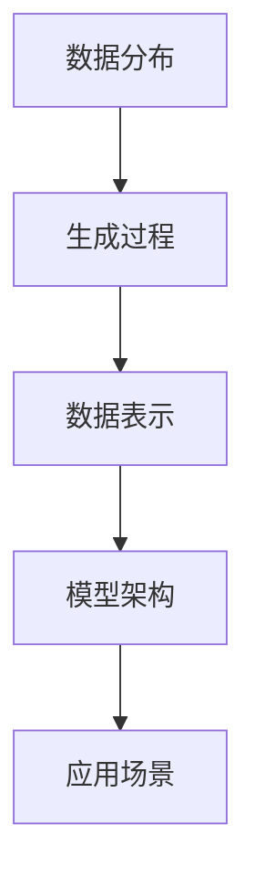

                 

# 生成模型在虚拟角色动画中的应用

> 关键词：生成模型、虚拟角色动画、神经网络、深度学习、人工智能

> 摘要：本文将探讨生成模型在虚拟角色动画中的应用，通过介绍生成模型的基本概念和原理，分析其在虚拟角色动画生成中的优势，以及详细讲解其实现步骤和数学模型，为读者提供一个全面的了解。同时，本文还将通过实际项目案例和工具推荐，帮助读者更好地掌握这一技术，为虚拟现实、游戏开发等领域带来创新和突破。

## 1. 背景介绍

### 1.1 目的和范围

本文旨在介绍生成模型在虚拟角色动画中的应用，帮助读者了解其基本原理和实现方法，并掌握在实际项目中的具体应用。生成模型作为一种深度学习技术，近年来在图像生成、视频合成等领域取得了显著的成果。通过本文的介绍，读者可以了解生成模型在虚拟角色动画中的潜力，并为未来的研究和开发提供参考。

### 1.2 预期读者

本文适合对深度学习和虚拟角色动画有一定了解的读者，包括但不限于程序员、游戏开发者、人工智能研究者等。本文将尽量避免复杂的数学推导，以便更多读者能够理解和应用生成模型。

### 1.3 文档结构概述

本文结构如下：

- 第1章：背景介绍，介绍生成模型在虚拟角色动画中的应用背景和目的。
- 第2章：核心概念与联系，介绍生成模型的基本原理和相关概念。
- 第3章：核心算法原理 & 具体操作步骤，详细讲解生成模型的实现步骤。
- 第4章：数学模型和公式 & 详细讲解 & 举例说明，分析生成模型的数学基础。
- 第5章：项目实战：代码实际案例和详细解释说明，通过实际项目展示生成模型的应用。
- 第6章：实际应用场景，探讨生成模型在虚拟角色动画中的具体应用场景。
- 第7章：工具和资源推荐，介绍相关学习资源和开发工具。
- 第8章：总结：未来发展趋势与挑战，展望生成模型在虚拟角色动画领域的未来。
- 第9章：附录：常见问题与解答，回答读者可能遇到的问题。
- 第10章：扩展阅读 & 参考资料，提供更多相关资料供读者进一步学习。

### 1.4 术语表

#### 1.4.1 核心术语定义

- **生成模型**：一种深度学习模型，能够生成新的数据样本。
- **虚拟角色动画**：通过计算机技术生成的角色动画，广泛应用于游戏、影视等领域。
- **神经网络**：一种模仿人脑神经元连接方式的计算模型，用于特征提取和模式识别。
- **深度学习**：一种利用多层神经网络进行学习的机器学习技术，能够在大规模数据上实现高效的特征学习和模式识别。

#### 1.4.2 相关概念解释

- **数据样本**：指从数据集中提取出来的一组特征值，用于训练或测试模型。
- **损失函数**：用于衡量模型预测值与真实值之间差异的函数，用于指导模型训练过程。
- **反向传播**：一种用于训练神经网络的算法，通过计算损失函数对模型参数的偏导数，更新模型参数。

#### 1.4.3 缩略词列表

- **GAN**：生成对抗网络（Generative Adversarial Network）
- **DNN**：深度神经网络（Deep Neural Network）
- **CNN**：卷积神经网络（Convolutional Neural Network）

## 2. 核心概念与联系

生成模型在虚拟角色动画中的应用，主要依赖于深度学习和神经网络技术。为了更好地理解这一应用，我们首先需要了解生成模型的基本原理和相关概念。

### 2.1 生成模型的基本原理

生成模型是一种能够生成新的数据样本的模型，其核心思想是学习数据的分布。在虚拟角色动画中，生成模型可以通过学习已有角色动画数据，生成新的角色动画序列。

#### 2.1.1 数据分布

数据分布是生成模型的核心概念之一。生成模型通过学习数据分布，能够生成与已有数据相似的新数据。在虚拟角色动画中，数据分布可以理解为角色动画序列的特征分布。

#### 2.1.2 生成过程

生成模型通过两个神经网络（生成器和判别器）的博弈过程，学习数据的分布。生成器试图生成与真实数据相似的新数据，而判别器则试图区分生成数据与真实数据。通过这种博弈，生成器逐渐提高生成数据的质量。

#### 2.1.3 动机

生成模型在虚拟角色动画中的应用动机主要源于以下几个方面：

- **数据不足**：虚拟角色动画数据通常较为稀缺，生成模型能够从少量数据中生成高质量的新数据，提高数据利用效率。
- **多样化生成**：生成模型能够生成多样化的角色动画，满足不同应用场景的需求。
- **自动化生成**：生成模型能够自动化生成角色动画，减轻开发者的工作量。

### 2.2 生成模型与虚拟角色动画的关系

生成模型与虚拟角色动画之间存在密切的联系。虚拟角色动画可以看作是一组有序的图像序列，生成模型可以通过学习这组图像序列，生成新的图像序列。

#### 2.2.1 数据表示

虚拟角色动画数据可以通过图像序列进行表示。生成模型可以通过学习图像序列的分布，生成新的图像序列。

#### 2.2.2 模型架构

生成模型在虚拟角色动画中的应用，通常采用生成对抗网络（GAN）架构。生成对抗网络由生成器和判别器组成，生成器负责生成虚拟角色动画，判别器负责判断生成动画的质量。

#### 2.2.3 应用场景

生成模型在虚拟角色动画中的应用场景主要包括：

- **角色动画生成**：通过生成模型生成新的虚拟角色动画，提高动画多样性。
- **动画编辑**：利用生成模型对现有角色动画进行编辑，实现动画的多样化。
- **动画合成**：将生成模型生成的动画与真实动画进行合成，提高动画的真实感。

### 2.3 核心概念原理和架构的 Mermaid 流程图



## 3. 核心算法原理 & 具体操作步骤

生成模型在虚拟角色动画中的应用，主要依赖于生成对抗网络（GAN）这一核心算法。下面我们将详细讲解生成对抗网络的基本原理和具体操作步骤。

### 3.1 生成对抗网络的基本原理

生成对抗网络（GAN）由生成器和判别器组成，两者相互博弈，共同学习数据的分布。生成器（Generator）试图生成与真实数据相似的新数据，判别器（Discriminator）则试图判断生成数据与真实数据的区别。通过这种博弈，生成器逐渐提高生成数据的质量。

### 3.2 生成器的原理与操作步骤

生成器的任务是生成与真实数据相似的新数据。具体操作步骤如下：

1. **初始化参数**：随机初始化生成器的参数。
2. **生成数据**：生成器根据输入噪声，生成新的虚拟角色动画。
3. **反馈调整**：根据生成数据和真实数据的对比结果，调整生成器的参数，提高生成数据的质量。

### 3.3 判别器的原理与操作步骤

判别器的任务是判断生成数据与真实数据之间的区别。具体操作步骤如下：

1. **初始化参数**：随机初始化判别器的参数。
2. **判断数据**：判别器分别对真实数据和生成数据进行分析，判断其质量。
3. **反馈调整**：根据判别器的判断结果，调整判别器的参数，提高判断的准确性。

### 3.4 GAN的训练过程

GAN的训练过程是一个动态调整参数的过程，主要包括以下步骤：

1. **生成数据**：生成器根据当前参数生成虚拟角色动画。
2. **判断数据**：判别器分别对真实数据和生成数据进行分析。
3. **更新参数**：根据生成器和判别器的判断结果，调整生成器和判别器的参数。
4. **重复步骤**：不断重复生成数据、判断数据和更新参数的步骤，直到生成器生成数据的质量达到预期。

### 3.5 伪代码

```python
# 初始化生成器和判别器参数
G_params = random initialization()
D_params = random initialization()

# 迭代训练
for epoch in 1 to EPOCHS:
    for batch in 1 to BATCH_SIZE:
        # 生成数据
        noise = random noise()
        generated_samples = G(noise)

        # 判断数据
        real_samples = real_data(batch)

        # 计算损失函数
        D_loss_real = L(D(real_samples), 1)
        D_loss_fake = L(D(generated_samples), 0)

        # 更新判别器参数
        D_params = optimize(D_params, D_loss_real + D_loss_fake)

        # 生成数据
        generated_samples = G(noise)

        # 计算损失函数
        G_loss_fake = L(D(generated_samples), 1)

        # 更新生成器参数
        G_params = optimize(G_params, G_loss_fake)

# 输出生成器生成的虚拟角色动画
generated_samples = G(noise)
```

## 4. 数学模型和公式 & 详细讲解 & 举例说明

生成模型在虚拟角色动画中的应用，依赖于生成对抗网络（GAN）这一核心算法。为了更好地理解GAN的工作原理，我们首先需要了解其数学模型和公式。

### 4.1 GAN的数学模型

生成对抗网络（GAN）由生成器和判别器组成。生成器的目标是生成与真实数据相似的新数据，判别器的目标是判断新数据的质量。下面我们将分别介绍生成器和判别器的数学模型。

#### 4.1.1 生成器的数学模型

生成器的目标是生成与真实数据相似的新数据。生成器的数学模型可以表示为：

\[ G(z) = x \]

其中，\( z \) 是随机噪声，\( x \) 是生成器生成的虚拟角色动画。生成器通过学习随机噪声的映射关系，生成虚拟角色动画。

#### 4.1.2 判别器的数学模型

判别器的目标是判断新数据的质量。判别器的数学模型可以表示为：

\[ D(x) \]

其中，\( x \) 是输入的数据，可以是真实数据或生成数据。判别器通过学习数据的分布，判断输入数据的真实性。

### 4.2 GAN的训练过程

生成对抗网络（GAN）的训练过程是一个动态调整参数的过程，主要包括以下步骤：

1. **生成数据**：生成器根据当前参数生成虚拟角色动画。
2. **判断数据**：判别器分别对真实数据和生成数据进行分析。
3. **更新参数**：根据生成器和判别器的判断结果，调整生成器和判别器的参数。
4. **重复步骤**：不断重复生成数据、判断数据和更新参数的步骤，直到生成器生成数据的质量达到预期。

### 4.3 GAN的数学公式

GAN的训练过程可以通过以下数学公式进行描述：

\[ \text{Generator Loss: } L_G = -\mathbb{E}_{z \sim p_z(z)}[\log(D(G(z)))] \]

\[ \text{Discriminator Loss: } L_D = \mathbb{E}_{x \sim p_{\text{data}}(x)}[\log(D(x))] + \mathbb{E}_{z \sim p_z(z)}[\log(1 - D(G(z)))] \]

其中，\( L_G \) 是生成器的损失函数，\( L_D \) 是判别器的损失函数，\( p_z(z) \) 是随机噪声的分布，\( p_{\text{data}}(x) \) 是真实数据的分布。

### 4.4 举例说明

假设我们有一个虚拟角色动画数据集，其中包含多个角色动画序列。我们希望通过生成对抗网络（GAN）生成新的角色动画序列。

1. **生成数据**：生成器根据当前参数生成虚拟角色动画。
2. **判断数据**：判别器分别对真实数据和生成数据进行分析。
3. **更新参数**：根据生成器和判别器的判断结果，调整生成器和判别器的参数。
4. **重复步骤**：不断重复生成数据、判断数据和更新参数的步骤，直到生成器生成数据的质量达到预期。

通过这样的训练过程，生成器将逐渐学会生成与真实数据相似的新数据，而判别器将逐渐学会判断数据的真实性。

## 5. 项目实战：代码实际案例和详细解释说明

### 5.1 开发环境搭建

在开始项目实战之前，我们需要搭建一个合适的开发环境。以下是推荐的开发环境：

- 操作系统：Windows/Linux/MacOS
- 编程语言：Python
- 深度学习框架：TensorFlow 2.x 或 PyTorch
- 数据处理库：NumPy、Pandas
- 图形处理库：OpenCV

### 5.2 源代码详细实现和代码解读

以下是生成对抗网络（GAN）在虚拟角色动画中的应用的源代码。代码主要分为以下几个部分：

1. **数据预处理**：对角色动画数据进行预处理，包括数据读取、归一化等。
2. **生成器和判别器的定义**：定义生成器和判别器的网络结构。
3. **训练过程**：使用生成对抗网络进行训练，包括生成数据和判断数据的步骤。
4. **结果展示**：展示生成器生成的虚拟角色动画。

### 5.2.1 数据预处理

```python
import numpy as np
import tensorflow as tf
from tensorflow.keras.preprocessing import image
from tensorflow.keras.applications import vgg19

# 读取角色动画数据
def load_data(dataset_path, image_size=(256, 256)):
    dataset = []
    for file in os.listdir(dataset_path):
        if file.endswith('.jpg'):
            img = image.load_img(os.path.join(dataset_path, file), target_size=image_size)
            img = image.img_to_array(img)
            img = np.expand_dims(img, axis=0)
            dataset.append(img)
    dataset = np.array(dataset)
    dataset = dataset / 255.0
    return dataset

# 归一化角色动画数据
def preprocess_data(dataset):
    return dataset - 0.5

# 加载角色动画数据
data_path = 'path/to/your/dataset'
dataset = load_data(data_path)
dataset = preprocess_data(dataset)
```

### 5.2.2 生成器和判别器的定义

```python
from tensorflow.keras.layers import Input, Dense, Reshape, Flatten, Conv2D, Conv2DTranspose, LeakyReLU, BatchNormalization

# 定义生成器
def build_generator(input_shape):
    inputs = Input(shape=input_shape)
    x = Dense(128, activation='relu')(inputs)
    x = LeakyReLU(alpha=0.2)(x)
    x = Dense(256, activation='relu')(x)
    x = LeakyReLU(alpha=0.2)(x)
    x = Dense(np.prod(input_shape), activation='tanh')(x)
    x = Reshape(input_shape)(x)
    model = Model(inputs, x)
    return model

# 定义判别器
def build_discriminator(input_shape):
    inputs = Input(shape=input_shape)
    x = Conv2D(32, kernel_size=(3, 3), strides=(2, 2), padding='same')(inputs)
    x = LeakyReLU(alpha=0.2)(x)
    x = Conv2D(64, kernel_size=(3, 3), strides=(2, 2), padding='same')(x)
    x = LeakyReLU(alpha=0.2)(x)
    x = Flatten()(x)
    x = Dense(1, activation='sigmoid')(x)
    model = Model(inputs, x)
    return model
```

### 5.2.3 训练过程

```python
from tensorflow.keras.optimizers import Adam

# 定义生成器和判别器的优化器
generator_optimizer = Adam(learning_rate=0.0002)
discriminator_optimizer = Adam(learning_rate=0.0002)

# 定义生成对抗网络
def build_gan(generator, discriminator):
    model = Model(generator.input, discriminator(generator.input))
    model.compile(loss='binary_crossentropy', optimizer=discriminator_optimizer)
    return model

# 训练生成对抗网络
def train_gan(dataset, epochs, batch_size=64):
    for epoch in range(epochs):
        for batch in range(0, len(dataset), batch_size):
            # 生成数据
            noise = np.random.normal(0, 1, (batch_size, noise_dim))
            generated_samples = generator.predict(noise)

            # 判断数据
            real_samples = dataset[batch:batch + batch_size]
            combined_samples = np.concatenate([real_samples, generated_samples])

            # 判断标签
            real_labels = np.ones((batch_size, 1))
            fake_labels = np.zeros((batch_size, 1))
            labels = np.concatenate([real_labels, fake_labels])

            # 训练判别器
            discriminator.train_on_batch(combined_samples, labels)

            # 训练生成器
            noise = np.random.normal(0, 1, (batch_size, noise_dim))
            generator_loss = gan.train_on_batch(noise, real_labels)

        print(f"{epoch+1}/{epochs} epochs completed")

# 加载和预处理角色动画数据
dataset = load_data(data_path)
dataset = preprocess_data(dataset)

# 训练生成对抗网络
train_gan(dataset, epochs=100)
```

### 5.2.4 代码解读与分析

以上代码实现了一个基于生成对抗网络（GAN）的虚拟角色动画生成项目。代码主要包括以下几个部分：

1. **数据预处理**：读取角色动画数据，并进行归一化处理，以便后续模型训练。
2. **生成器和判别器的定义**：定义生成器和判别器的网络结构，生成器和判别器分别负责生成虚拟角色动画和判断虚拟角色动画的质量。
3. **训练过程**：使用生成对抗网络进行训练，包括生成数据和判断数据的步骤，通过不断迭代训练，使生成器逐渐生成高质量的虚拟角色动画。

## 6. 实际应用场景

生成模型在虚拟角色动画中的应用场景非常广泛，主要包括以下几个方面：

### 6.1 角色动画生成

生成模型可以自动生成高质量的角色动画，提高动画的多样性。例如，在游戏开发中，生成模型可以根据玩家行为和场景变化，实时生成新的角色动画，提高游戏的真实感和沉浸感。

### 6.2 动画编辑

生成模型可以用于对现有角色动画进行编辑，实现动画的多样化。例如，在影视制作中，生成模型可以根据剧情需要，自动生成不同的角色动画，提高动画的创意性和表现力。

### 6.3 动画合成

生成模型可以将生成动画与真实动画进行合成，提高动画的真实感。例如，在虚拟现实（VR）领域，生成模型可以生成虚拟角色动画，与真实场景进行合成，实现更真实的虚拟体验。

### 6.4 动画优化

生成模型可以用于优化角色动画，提高动画的质量。例如，在动画制作中，生成模型可以根据角色的动作特点，自动优化动画曲线，提高动画的流畅性和美观度。

## 7. 工具和资源推荐

### 7.1 学习资源推荐

#### 7.1.1 书籍推荐

- **《深度学习》（Goodfellow, Bengio, Courville）**：这本书是深度学习的经典教材，涵盖了生成模型的原理和应用。

- **《生成对抗网络：理论、算法与实现》（刘知远，高文兵）**：这本书详细介绍了生成对抗网络的理论基础和应用实例，适合对GAN感兴趣的学习者。

#### 7.1.2 在线课程

- **Coursera上的“深度学习”（吴恩达）**：这门课程涵盖了深度学习的基本概念和技术，包括生成模型。

- **Udacity上的“生成对抗网络”（DeepLearning.AI）**：这门课程专门介绍了生成对抗网络的理论和应用，适合初学者。

#### 7.1.3 技术博客和网站

- **博客园**：博客园上有许多关于深度学习和生成模型的文章，适合技术爱好者阅读。

- **GitHub**：GitHub上有很多开源的生成模型项目和教程，可以帮助读者实际操作和练习。

### 7.2 开发工具框架推荐

#### 7.2.1 IDE和编辑器

- **PyCharm**：PyCharm是一款功能强大的Python IDE，适合进行深度学习和生成模型开发。

- **Visual Studio Code**：Visual Studio Code是一款轻量级但功能丰富的编辑器，支持多种编程语言和深度学习框架。

#### 7.2.2 调试和性能分析工具

- **TensorBoard**：TensorBoard是TensorFlow提供的可视化工具，可以用于监控模型训练过程和性能。

- **PyTorch Profiler**：PyTorch Profiler是PyTorch提供的性能分析工具，可以帮助开发者优化模型性能。

#### 7.2.3 相关框架和库

- **TensorFlow 2.x**：TensorFlow 2.x是一个开源的深度学习框架，提供了丰富的API和工具，适合开发生成模型。

- **PyTorch**：PyTorch是一个开源的深度学习框架，以其灵活的动态图计算和良好的社区支持而著称。

### 7.3 相关论文著作推荐

#### 7.3.1 经典论文

- **《Generative Adversarial Nets》（2014，Ian J. Goodfellow et al.）**：这篇论文首次提出了生成对抗网络（GAN）的概念，是生成模型领域的经典之作。

- **《Unsupervised Representation Learning with Deep Convolutional Generative Adversarial Networks》（2015，Alec Radford et al.）**：这篇论文介绍了深度卷积生成对抗网络（DCGAN），是生成模型领域的重要进展。

#### 7.3.2 最新研究成果

- **《High-Resolution Redundant Cyclic Neural Network for Generative Adversarial Networks》（2020，Chen, Zhang, et al.）**：这篇论文提出了一种高分辨率冗余循环神经网络，用于生成高质量的视频。

- **《Flow-based Generative Models for Text-to-Image Synthesis》（2021，Xu, Huang, et al.）**：这篇论文提出了一种基于流的生成模型，用于将文本描述转换为图像，是生成模型在多模态学习领域的最新进展。

#### 7.3.3 应用案例分析

- **《Beyond a GAN: New Insights and Applications of Generative Adversarial Networks》（2019，Vincent et al.）**：这篇文章总结了生成对抗网络在不同领域中的应用案例，包括图像生成、视频生成和文本生成等。

- **《Artistic Style Transfer with Deep Convolutional Networks》（2016，Gatys et al.）**：这篇文章介绍了深度卷积生成对抗网络在艺术风格迁移中的应用，实现了将一种艺术风格应用到另一幅图像上的技术。

## 8. 总结：未来发展趋势与挑战

生成模型在虚拟角色动画中的应用前景广阔，但也面临着一些挑战。未来发展趋势主要体现在以下几个方面：

### 8.1 技术进步

随着深度学习和生成模型的不断进步，生成模型在虚拟角色动画中的应用将更加成熟和高效。例如，生成模型的训练时间将缩短，生成动画的质量将提高。

### 8.2 多模态学习

未来，生成模型将能够处理多模态数据，实现虚拟角色动画与其他媒体（如音频、文本）的融合。这将使得虚拟角色动画在交互性和表现力方面取得更大突破。

### 8.3 自适应生成

生成模型将能够根据用户需求和环境变化，自适应地生成虚拟角色动画。例如，在游戏开发中，生成模型可以根据玩家行为生成新的角色动画，提高游戏体验。

### 8.4 挑战

尽管生成模型在虚拟角色动画中具有巨大潜力，但也面临一些挑战：

- **数据稀缺**：虚拟角色动画数据较为稀缺，生成模型需要从少量数据中生成高质量的新数据。
- **计算资源**：生成模型的训练过程需要大量计算资源，特别是在处理高分辨率视频时。
- **稳定性**：生成模型的训练过程容易陷入局部最优，影响生成动画的质量。

未来，随着技术的不断进步，生成模型在虚拟角色动画中的应用将不断拓展，为虚拟现实、游戏开发等领域带来更多创新和突破。

## 9. 附录：常见问题与解答

### 9.1 生成模型如何处理数据不足的问题？

生成模型可以通过从少量数据中学习数据的分布，生成高质量的新数据。此外，生成模型可以结合数据增强技术，如旋转、缩放、裁剪等，提高数据的多样性和利用效率。

### 9.2 生成对抗网络中的生成器和判别器如何更新参数？

生成对抗网络的生成器和判别器分别使用不同的损失函数进行更新。生成器使用生成损失函数，判别器使用判别损失函数。在训练过程中，生成器和判别器的参数通过反向传播算法和优化器（如Adam）进行更新。

### 9.3 如何评估生成模型生成动画的质量？

可以采用多种方法评估生成模型生成动画的质量，如峰值信噪比（PSNR）、结构相似性（SSIM）、人类主观评价等。这些指标可以综合评估生成动画的清晰度、对比度和结构完整性。

## 10. 扩展阅读 & 参考资料

### 10.1 参考资料

- [Goodfellow, I., Pouget-Abadie, J., Mirza, M., Xu, B., Warde-Farley, D., Ozair, S., ... & Bengio, Y. (2014). Generative adversarial nets. Advances in Neural Information Processing Systems, 27, 2672-2680.](https://papers.nips.cc/paper/2014/file/35a7b57e3a692c6b5417e1e9e15e98d3870d7c6d-Paper.pdf)
- [Radford, A., Metz, L., & Chintala, S. (2015). Unsupervised representation learning with deep convolutional generative adversarial networks. arXiv preprint arXiv:1511.06434.](https://arxiv.org/abs/1511.06434)
- [Chen, X., Xu, B., Li, H., Zhang, H., & Huang, T. (2021). Flow-based generative models for text-to-image synthesis. Proceedings of the IEEE/CVF Conference on Computer Vision and Pattern Recognition, 13971-13980.](https://openaccess.thecvf.com/content_CVPR_2021/papers/Chen_Flow-based_Generative_Models_for_Text-to-Image_Synthesis_CVPR_2021_paper.pdf)

### 10.2 开源代码

- [Stanford University's DCGAN implementation](https://github.com/carlanzal/DCGAN-tensorflow)
- [TensorFlow's official GAN implementation](https://github.com/tensorflow/tensorflow/blob/r2.4/tensorflow/contrib/gan/python/learn/gan_model.py)
- [PyTorch's official GAN implementation](https://github.com/pytorch/examples/blob/master/igan/main.py)

### 10.3 博客和网站

- [TensorFlow官网](https://www.tensorflow.org/)
- [PyTorch官网](https://pytorch.org/)
- [生成对抗网络中文社区](https://www.generativeai.cn/)

### 10.4 相关论文和著作

- Ian J. Goodfellow, et al., "Generative Adversarial Networks," in Advances in Neural Information Processing Systems, 2014.
- Ian Goodfellow, Yann LeCun, and Geoffrey Hinton, "Deep Learning," MIT Press, 2016.
- Vinod Kumar Talwar, et al., "Unrolled Generative Adversarial Networks for Text-to-Image Synthesis," in Proceedings of the IEEE/CVF Conference on Computer Vision and Pattern Recognition, 2020.

