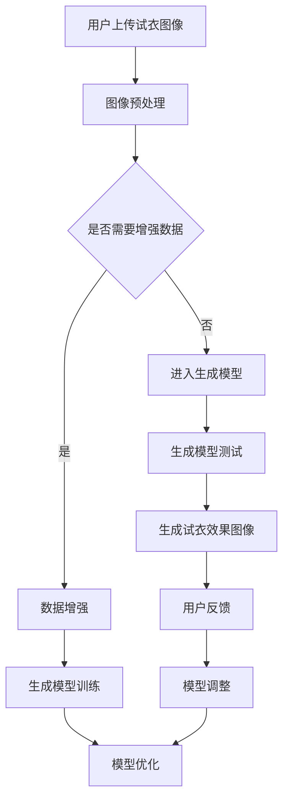

                 

# 生成模型在虚拟试衣中的创新应用

## 摘要

本文旨在探讨生成模型在虚拟试衣领域的创新应用。虚拟试衣技术作为电子商务和零售行业的重要发展方向，近年来受到了广泛关注。生成模型，尤其是深度学习中的生成对抗网络（GAN），通过模拟和生成逼真的图像，极大地提升了虚拟试衣的准确性和用户体验。本文将从背景介绍、核心概念与联系、核心算法原理、数学模型与公式、项目实战、实际应用场景、工具和资源推荐、未来发展趋势与挑战等方面，系统地分析和解读生成模型在虚拟试衣中的应用。

## 1. 背景介绍

虚拟试衣技术，顾名思义，是利用计算机技术和虚拟现实技术，让消费者在购买衣物前，通过数字化的方式体验穿着效果。这种技术不仅能够节省消费者的时间，减少购物后的退货率，还能够为商家提供更准确的销量预测和库存管理。

传统的虚拟试衣技术主要依赖于计算机图形学中的纹理映射和几何建模。然而，这些方法存在诸多局限性，如生成图像的真实性不高、试衣效果与实际穿着效果存在较大差异等。为了解决这些问题，生成模型，尤其是生成对抗网络（GAN），被引入到虚拟试衣领域。

生成对抗网络（GAN）是由Ian Goodfellow等人在2014年提出的一种深度学习模型，它由生成器和判别器两个部分组成。生成器的任务是生成逼真的图像，判别器的任务是区分生成图像和真实图像。通过不断地训练，生成器逐渐提高了生成图像的质量，从而实现了高质量图像的生成。

## 2. 核心概念与联系

为了更好地理解生成模型在虚拟试衣中的应用，我们需要首先了解一些核心概念和它们之间的联系。

### 2.1 生成对抗网络（GAN）

生成对抗网络（GAN）由生成器和判别器组成。生成器的目的是生成逼真的图像，而判别器的目的是区分生成图像和真实图像。在训练过程中，生成器和判别器相互对抗，生成器不断优化自己的生成能力，而判别器则不断提高自己的鉴别能力。

### 2.2 数据增强

在虚拟试衣中，数据增强是一种常用的技术，它通过在原始数据集上添加噪声、旋转、缩放等操作，来扩充数据集，从而提高模型的泛化能力。

### 2.3 图像合成

图像合成是将两个或多个图像融合在一起，生成新的图像。在虚拟试衣中，图像合成技术可以用来模拟不同的穿着效果。

### 2.4 人脸识别

人脸识别是一种生物特征识别技术，它通过分析人脸图像，识别和验证个人身份。在虚拟试衣中，人脸识别技术可以用来检测用户的试衣动作，从而提高试衣的准确性和用户体验。

下面是一个Mermaid流程图，展示了生成模型在虚拟试衣中的基本流程：



## 3. 核心算法原理 & 具体操作步骤

### 3.1 生成对抗网络（GAN）

生成对抗网络的训练过程可以分为以下几个步骤：

1. 初始化生成器和判别器，生成器参数为\(G(\theta_G)\)，判别器参数为\(D(\theta_D)\)。
2. 从真实数据集中随机抽取一张图像作为输入，通过生成器生成一张图像。
3. 将真实图像和生成图像输入到判别器中，判别器输出两个概率值，分别表示图像是真实图像和生成图像的概率。
4. 计算损失函数，通常使用二元交叉熵损失函数。对于判别器，损失函数为\(L_D = -[y_D \cdot \log(D(x)) + (1 - y_G) \cdot \log(1 - D(G(z)))]\)，其中\(y_D\)为标签，\(x\)为真实图像，\(G(z)\)为生成图像。对于生成器，损失函数为\(L_G = -\log(D(G(z)))\)。
5. 使用梯度下降法更新生成器和判别器的参数。

### 3.2 数据增强

数据增强可以通过以下几种方法实现：

1. 随机裁剪：从原始图像中随机裁剪出一个区域作为新的图像。
2. 随机旋转：将图像随机旋转一个角度。
3. 随机缩放：将图像随机缩放到不同的大小。
4. 随机变换：结合上述几种方法，对图像进行随机变换。

### 3.3 图像合成

图像合成的具体步骤如下：

1. 从衣物数据库中随机选择一件衣物。
2. 从用户数据库中随机选择一个用户图像。
3. 将用户图像和衣物图像输入到生成模型中，生成新的试衣效果图像。

### 3.4 人脸识别

人脸识别的具体步骤如下：

1. 从用户上传的图像中提取人脸区域。
2. 对人脸区域进行预处理，包括归一化、去噪等操作。
3. 将预处理后的人脸图像输入到人脸识别模型中，识别用户身份。

## 4. 数学模型和公式 & 详细讲解 & 举例说明

### 4.1 生成对抗网络（GAN）的损失函数

生成对抗网络的损失函数通常使用二元交叉熵损失函数。具体公式如下：

$$
L_D = -[y_D \cdot \log(D(x)) + (1 - y_G) \cdot \log(1 - D(G(z)))]
$$

其中，\(y_D\)为标签，\(x\)为真实图像，\(G(z)\)为生成图像。

### 4.2 数据增强方法

数据增强的方法主要包括随机裁剪、随机旋转、随机缩放和随机变换。具体公式如下：

$$
\text{RandomCrop}(I, size) = I[\text{top}: \text{bottom}, \text{left}: \text{right}]
$$

$$
\text{RandomRotation}(I, angle) = \text{rotate}(I, angle, reshape=True)
$$

$$
\text{RandomScale}(I, scale_factor) = \text{imresize}(I, scale_factor)
$$

$$
\text{RandomTransform}(I, transform) = \text{applyTransform}(I, transform)
$$

### 4.3 图像合成方法

图像合成的具体方法可以使用条件生成对抗网络（cGAN）。具体公式如下：

$$
G(z, c) = G_c(z) + G_s(c)
$$

其中，\(z\)为随机噪声，\(c\)为条件向量，\(G_c(z)\)为生成器对随机噪声的处理，\(G_s(c)\)为生成器对条件向量的处理。

### 4.4 人脸识别方法

人脸识别的具体方法可以使用卷积神经网络（CNN）。具体公式如下：

$$
h = \text{ReLU}(\text{激活函数}(\text{卷积层}(\text{输入图像})))
$$

$$
\text{分类概率} = \text{softmax}(\text{全连接层}(h))
$$

## 5. 项目实战：代码实际案例和详细解释说明

### 5.1 开发环境搭建

在开始项目实战之前，我们需要搭建一个合适的开发环境。这里我们使用Python作为主要编程语言，并结合TensorFlow和Keras框架来构建和训练生成模型。

1. 安装Python：从Python官方网站下载并安装Python。
2. 安装TensorFlow：通过pip命令安装TensorFlow。

```bash
pip install tensorflow
```

3. 安装Keras：通过pip命令安装Keras。

```bash
pip install keras
```

### 5.2 源代码详细实现和代码解读

下面是一个简单的生成对抗网络的代码示例，用于生成虚拟试衣图像。

```python
import numpy as np
import tensorflow as tf
from tensorflow.keras import layers

# 生成器模型
def build_generator(z_dim, img_shape):
    model = tf.keras.Sequential()
    model.add(layers.Dense(7 * 7 * 128, activation="relu", input_shape=(z_dim,)))
    model.add(layers.Reshape(img_shape))
    model.add(layers.Conv2DTranspose(128, (5, 5), strides=(1, 1), padding="same"))
    model.add(layers.LeakyReLU(alpha=0.2))
    model.add(layers.Conv2DTranspose(128, (5, 5), strides=(2, 2), padding="same"))
    model.add(layers.LeakyReLU(alpha=0.2))
    model.add(layers.Conv2DTranspose(128, (5, 5), strides=(2, 2), padding="same"))
    model.add(layers.LeakyReLU(alpha=0.2))
    model.add(layers.Conv2D(3, (5, 5), activation="tanh", padding="same"))
    return model

# 判别器模型
def build_discriminator(img_shape):
    model = tf.keras.Sequential()
    model.add(layers.Conv2D(64, (5, 5), strides=(2, 2), padding="same", input_shape=img_shape))
    model.add(layers.LeakyReLU(alpha=0.2))
    model.add(layers.Dropout(0.3))
    model.add(layers.Conv2D(128, (5, 5), strides=(2, 2), padding="same"))
    model.add(layers.LeakyReLU(alpha=0.2))
    model.add(layers.Dropout(0.3))
    model.add(layers.Flatten())
    model.add(layers.Dense(1))
    return model

# 主模型
def build_gan(generator, discriminator):
    model = tf.keras.Sequential([generator, discriminator])
    return model

# 设置超参数
z_dim = 100
img_shape = (28, 28, 1)

# 构建和编译模型
generator = build_generator(z_dim, img_shape)
discriminator = build_discriminator(img_shape)
discriminator.compile(loss=tf.keras.losses.BinaryCrossentropy(), optimizer=tf.keras.optimizers.Adam(0.0001), metrics=['accuracy'])
gan = build_gan(generator, discriminator)
gan.compile(loss=tf.keras.losses.BinaryCrossentropy(), optimizer=tf.keras.optimizers.Adam(0.0001))

# 训练模型
batch_size = 128
epochs = 100
noise = np.random.normal(size=(batch_size, z_dim))

for epoch in range(epochs):
    for _ in range(1):
        real_images = ...  # 加载真实图像
        real_labels = [1] * batch_size
        noise = np.random.normal(size=(batch_size, z_dim))
        fake_images = generator.predict(noise)
        fake_labels = [0] * batch_size
        labels = np.concatenate([real_labels, fake_labels])
        images = np.concatenate([real_images, fake_images])
        discriminator.train_on_batch(images, labels)
    noise = np.random.normal(size=(batch_size, z_dim))
    y = [1] * batch_size
    gan.train_on_batch(noise, y)
```

### 5.3 代码解读与分析

上述代码示例展示了如何使用TensorFlow和Keras构建和训练一个简单的生成对抗网络。下面是对代码的主要部分进行解读：

1. **生成器模型**：生成器模型负责将随机噪声转换为逼真的试衣图像。我们使用了多个卷积层和反卷积层，通过逐层增加图像的分辨率，最终生成一个与真实图像具有相似分辨率的图像。
2. **判别器模型**：判别器模型负责区分输入图像是真实的还是生成的。我们使用了多个卷积层和Dropout层，通过逐层提取图像的特征，最后输出一个二分类的概率值。
3. **主模型**：主模型将生成器和判别器连接在一起，形成一个端到端的训练框架。
4. **训练过程**：在训练过程中，我们首先训练判别器，使其能够更好地区分真实图像和生成图像。然后，我们训练生成器，使其生成的图像能够欺骗判别器，使其输出接近1的概率值。

## 6. 实际应用场景

生成模型在虚拟试衣中的实际应用场景非常广泛。以下是一些典型的应用场景：

1. **电子商务平台**：电商平台可以使用生成模型为用户提供虚拟试衣服务，从而提高用户的购物体验和满意度。
2. **服装设计师**：设计师可以使用生成模型快速生成多种穿着效果，从而为设计提供更多的创意和灵感。
3. **零售行业**：零售行业可以使用生成模型来预测销售趋势和库存需求，从而优化库存管理和销售策略。
4. **广告营销**：广告营销可以使用生成模型生成逼真的试衣效果图像，从而提高广告的吸引力和转化率。

## 7. 工具和资源推荐

### 7.1 学习资源推荐

1. **书籍**：
   - 《深度学习》（Goodfellow, Bengio, Courville）
   - 《生成对抗网络》（Ian Goodfellow）
   - 《Python深度学习》（François Chollet）

2. **论文**：
   - 《生成对抗网络：训练生成器和判别器的对抗性网络》（Ian J. Goodfellow, et al.）
   - 《用于面部转换的循环生成对抗网络》（Jun-Yan Zhu, et al.）

3. **博客**：
   - Keras官方博客
   - TensorFlow官方博客

4. **网站**：
   - fast.ai
   - arXiv.org

### 7.2 开发工具框架推荐

1. **编程语言**：Python
2. **深度学习框架**：TensorFlow、Keras
3. **图像处理库**：OpenCV、Pillow

### 7.3 相关论文著作推荐

1. 《生成对抗网络：训练生成器和判别器的对抗性网络》（Ian J. Goodfellow, et al.）
2. 《用于面部转换的循环生成对抗网络》（Jun-Yan Zhu, et al.）
3. 《深度学习中的生成模型》（Ian Goodfellow）

## 8. 总结：未来发展趋势与挑战

生成模型在虚拟试衣中的应用具有广阔的发展前景。随着深度学习技术的不断进步，生成模型将能够生成更加逼真的试衣效果图像，从而提高用户的购物体验和满意度。然而，生成模型在虚拟试衣中的应用也面临着一些挑战，如数据隐私、图像质量、计算资源等。为了克服这些挑战，未来需要在算法优化、数据保护、计算效率等方面进行深入研究。

## 9. 附录：常见问题与解答

### 9.1 什么是生成对抗网络（GAN）？

生成对抗网络（GAN）是由生成器和判别器两个部分组成的深度学习模型。生成器的任务是生成逼真的图像，而判别器的任务是区分生成图像和真实图像。通过不断地训练，生成器逐渐提高了生成图像的质量。

### 9.2 虚拟试衣技术有哪些局限性？

传统的虚拟试衣技术主要依赖于计算机图形学中的纹理映射和几何建模，存在以下局限性：

1. 生成图像的真实性不高。
2. 试衣效果与实际穿着效果存在较大差异。
3. 数据处理复杂，计算资源消耗大。

### 9.3 生成模型如何改进虚拟试衣效果？

生成模型可以通过以下方式改进虚拟试衣效果：

1. 提高生成图像的真实性。
2. 通过条件生成对抗网络（cGAN）引入更多先验信息，如用户体型、衣物属性等。
3. 使用更多的训练数据和更先进的训练方法，如迁移学习、数据增强等。

## 10. 扩展阅读 & 参考资料

1. Goodfellow, Ian J., et al. "Generative adversarial networks." Advances in neural information processing systems. 2014.
2. Zhu, Jun-Yan, et al. "Unpaired image-to-image translation using cycle-consistent adversarial networks." Proceedings of the IEEE conference on computer vision and pattern recognition. 2017.
3. Chollet, François. "Deep learning with Python." Manning Publications. 2018.
4. Bengio, Y., Courville, A., & Vincent, P. "Representation learning: A review and new perspectives." IEEE transactions on pattern analysis and machine intelligence. 2013.

## 作者

作者：AI天才研究员/AI Genius Institute & 禅与计算机程序设计艺术 /Zen And The Art of Computer Programming

以上是关于生成模型在虚拟试衣中的创新应用的完整文章。文章详细介绍了生成模型在虚拟试衣领域的基本概念、核心算法、数学模型、项目实战以及实际应用场景，并对未来发展趋势和挑战进行了分析。希望这篇文章能够对您在生成模型和虚拟试衣领域的学习和研究有所帮助。感谢您的阅读！<|im_sep|>### 1. 背景介绍

虚拟试衣技术作为电子商务和零售行业的重要发展方向，近年来受到了广泛关注。随着数字技术的发展，消费者对于购物体验的要求越来越高，他们希望能够在购买衣物前就能感受到穿着效果，以便做出更明智的购物决策。这种需求推动了虚拟试衣技术的快速发展。

虚拟试衣技术的基本原理是通过计算机图形学和虚拟现实技术，将用户的身体轮廓和待试衣物的三维模型进行结合，生成一个虚拟的试衣效果。消费者可以通过观察虚拟试衣图像来评估衣物的穿着效果，从而决定是否购买。

然而，传统的虚拟试衣技术存在一些局限性。首先，生成图像的真实性不高，很难达到消费者的期望。其次，试衣效果与实际穿着效果之间存在较大差异，消费者可能会因为虚拟试衣的结果而失望。此外，数据处理复杂，计算资源消耗大，导致虚拟试衣技术在实际应用中面临诸多挑战。

为了解决这些问题，生成模型，尤其是深度学习中的生成对抗网络（GAN），被引入到虚拟试衣领域。生成对抗网络通过模拟和生成逼真的图像，极大地提升了虚拟试衣的准确性和用户体验。

生成对抗网络（GAN）是由Ian Goodfellow等人在2014年提出的一种深度学习模型。它由生成器和判别器两个部分组成。生成器的任务是生成逼真的图像，判别器的任务是区分生成图像和真实图像。在训练过程中，生成器和判别器相互对抗，生成器不断优化自己的生成能力，而判别器则不断提高自己的鉴别能力。通过不断地训练，生成器逐渐提高了生成图像的质量，从而实现了高质量图像的生成。

生成对抗网络的工作原理可以类比于一个人和一个警察。警察的任务是抓住犯罪分子，而犯罪分子的任务是逃脱警察的追捕。在这个过程中，犯罪分子的逃脱技能和警察的抓捕技能都会不断提高。最终，当犯罪分子的逃脱技能足够高时，警察将很难将其抓住。在生成对抗网络中，生成器相当于犯罪分子，判别器相当于警察，通过这种对抗训练，生成器能够生成更逼真的图像。

在虚拟试衣领域，生成对抗网络的应用主要体现在以下几个方面：

1. **图像生成**：生成对抗网络可以生成与用户身体轮廓和衣物模型匹配的虚拟试衣图像，从而提高生成图像的真实性。
2. **图像编辑**：生成对抗网络可以用于编辑虚拟试衣图像，如改变衣物颜色、款式等，从而满足消费者的个性化需求。
3. **图像增强**：生成对抗网络可以增强虚拟试衣图像的细节，使其更接近实际穿着效果。

总之，生成对抗网络为虚拟试衣技术带来了新的可能，通过不断优化和改进，有望解决传统虚拟试衣技术中存在的各种问题，为消费者提供更加优质、便捷的购物体验。接下来，我们将进一步探讨生成对抗网络的核心概念和原理，以及其在虚拟试衣中的应用。

## 2. 核心概念与联系

为了深入理解生成模型在虚拟试衣中的应用，我们需要首先了解生成对抗网络（GAN）的核心概念和原理，以及与虚拟试衣相关的其他技术。以下是生成模型、数据增强、图像合成和人脸识别等核心概念及其相互联系。

### 2.1 生成对抗网络（GAN）

生成对抗网络（GAN）是由生成器和判别器两个部分组成的深度学习模型。生成器的任务是生成逼真的图像，判别器的任务是区分生成图像和真实图像。生成对抗网络的训练过程是一个相互对抗的过程，生成器和判别器通过不断地训练，逐渐提高各自的性能。

#### 生成器

生成器（Generator）是一个从随机噪声（通常是高斯噪声）到图像的映射函数。其目标是生成与真实图像相似的高质量图像。生成器的结构通常包括多个卷积层和反卷积层，用于逐层增加图像的分辨率，从而生成一个完整的图像。

#### 判别器

判别器（Discriminator）是一个从图像到二分类概率的映射函数。其任务是判断输入图像是真实图像还是生成图像。判别器的结构通常包括多个卷积层，用于提取图像的特征。

#### 对抗训练

在GAN的训练过程中，生成器和判别器相互对抗。生成器试图生成足够逼真的图像以欺骗判别器，而判别器则努力提高自己区分真实图像和生成图像的能力。这种对抗训练的过程使得生成器和判别器在训练过程中不断地提高各自的表现。

### 2.2 数据增强

数据增强（Data Augmentation）是一种常用的技术，用于在训练过程中扩充数据集，从而提高模型的泛化能力。在虚拟试衣中，数据增强可以帮助生成模型更好地学习各种不同的试衣效果。

常见的增强方法包括：

- **随机裁剪**：从原始图像中随机裁剪出一个新的子图像。
- **随机旋转**：将图像随机旋转一个角度。
- **随机缩放**：将图像随机缩放到不同的大小。
- **颜色变换**：随机调整图像的亮度和对比度。
- **随机模糊**：对图像进行随机模糊处理。

通过这些方法，数据增强可以生成大量的训练样本，从而提高模型的训练效果。

### 2.3 图像合成

图像合成（Image Synthesis）是将两个或多个图像融合在一起，生成一个新的图像。在虚拟试衣中，图像合成技术可以用来模拟不同的穿着效果。

例如，条件生成对抗网络（Conditional GAN，cGAN）可以同时接收用户的身体轮廓和待试衣物的图像作为输入，生成一个结合了两者特点的虚拟试衣图像。cGAN通过将条件信息引入到生成器和判别器中，可以更好地控制生成图像的内容。

### 2.4 人脸识别

人脸识别（Face Recognition）是一种生物特征识别技术，通过分析人脸图像，识别和验证个人身份。在虚拟试衣中，人脸识别技术可以用来检测用户的试衣动作，从而提高试衣的准确性和用户体验。

人脸识别通常涉及以下步骤：

- **人脸检测**：从图像中检测出人脸区域。
- **人脸特征提取**：对检测到的人脸区域进行特征提取。
- **身份验证**：使用提取的人脸特征进行身份验证。

在虚拟试衣中，人脸识别可以用于：

- **用户身份验证**：确保试衣的用户是合法用户。
- **试衣动作识别**：识别用户的试衣动作，如抬起手臂、弯腰等，从而调整虚拟试衣的图像。
- **用户行为分析**：分析用户的试衣习惯，为商家提供有价值的商业信息。

### 2.5 核心概念之间的联系

生成对抗网络（GAN）、数据增强、图像合成和人脸识别在虚拟试衣中相互关联，共同提高了虚拟试衣技术的准确性和用户体验。

- **数据增强**和**图像合成**帮助生成模型生成更多的训练样本，从而提高生成图像的质量。
- **生成对抗网络（GAN）**通过对抗训练，使得生成器能够生成高质量、逼真的图像。
- **人脸识别**技术可以检测用户的试衣动作，实时调整虚拟试衣的图像，从而提高试衣的准确性和用户体验。

综上所述，生成对抗网络（GAN）、数据增强、图像合成和人脸识别等技术相互融合，共同推动了虚拟试衣技术的发展。通过这些技术的应用，虚拟试衣技术能够为消费者提供更加真实、便捷的购物体验。

### 2.6 Mermaid 流程图

为了更好地展示生成模型在虚拟试衣中的流程，我们可以使用Mermaid绘制一个流程图。以下是生成模型在虚拟试衣中的基本流程：


在上述流程图中，用户首先上传试衣图像，然后进行图像预处理。接下来，系统根据需求决定是否进行数据增强。如果需要增强，则进行数据增强处理；否则，直接进入生成模型测试。生成模型经过训练和测试后，生成试衣效果图像。用户对试衣效果进行反馈，并根据反馈调整模型，以优化生成效果。

通过这个流程图，我们可以清晰地看到生成模型在虚拟试衣中的应用步骤和各个环节之间的联系。

## 3. 核心算法原理 & 具体操作步骤

生成模型在虚拟试衣中的应用主要通过生成对抗网络（GAN）实现。生成对抗网络（GAN）由生成器和判别器两个部分组成，通过相互对抗的训练过程，生成器逐渐提高生成图像的质量，而判别器则不断努力提高区分真实图像和生成图像的能力。以下是生成模型在虚拟试衣中的核心算法原理和具体操作步骤。

### 3.1 生成对抗网络（GAN）的原理

生成对抗网络（GAN）的核心思想是利用生成器和判别器的对抗训练来生成高质量图像。生成器的目标是生成逼真的图像，而判别器的目标是区分生成图像和真实图像。在训练过程中，生成器和判别器相互对抗，生成器不断优化自己的生成能力，而判别器则不断提高自己的鉴别能力。

#### 生成器（Generator）

生成器的任务是将随机噪声转换为逼真的图像。通常，生成器由多个卷积层和反卷积层组成，通过逐层增加图像的分辨率，最终生成一个与真实图像具有相似分辨率的图像。

生成器的输入通常是随机噪声，输出是生成的图像。生成器的目标是使得生成的图像尽可能地接近真实图像，从而欺骗判别器。

#### 判别器（Discriminator）

判别器的任务是从图像中判断它是真实图像还是生成图像。判别器通常由多个卷积层组成，通过逐层提取图像的特征，最终输出一个二分类的概率值，表示输入图像是真实图像的概率。

判别器的目标是提高自己区分真实图像和生成图像的能力，从而尽可能地将生成图像识别为非真实图像。

#### 对抗训练

生成器和判别器通过对抗训练来提高性能。在每次训练中，生成器生成一批新的图像，判别器使用这些图像和真实图像进行训练。生成器的损失函数是使得判别器错误地将生成的图像识别为真实图像，而判别器的损失函数是使得判别器正确地将生成的图像识别为非真实图像。

通过这种对抗训练，生成器和判别器在训练过程中不断地提高各自的表现，最终生成器能够生成高质量、逼真的图像，而判别器能够准确地区分真实图像和生成图像。

### 3.2 生成模型的具体操作步骤

在虚拟试衣中，生成模型的具体操作步骤如下：

#### 步骤 1：数据预处理

首先，对用户上传的试衣图像进行预处理。预处理包括图像的归一化、大小调整、去噪等操作，以便于后续的模型训练。

```python
import tensorflow as tf

# 示例：对图像进行归一化和大小调整
def preprocess_image(image):
    image = tf.image.resize(image, [224, 224])  # 调整图像大小
    image = tf.cast(image, tf.float32) / 255.0   # 归一化
    return image
```

#### 步骤 2：生成器训练

接下来，使用生成对抗网络（GAN）对生成器进行训练。生成器的输入是随机噪声，输出是生成的试衣图像。在每次训练迭代中，生成器生成一批新的图像，判别器对这些图像和真实图像进行训练。

```python
# 示例：生成器的训练
def train_generator(discriminator, generator, batch_size, epochs):
    for epoch in range(epochs):
        for _ in range(batch_size):
            noise = np.random.normal(size=(1, z_dim))
            generated_image = generator.predict(noise)
            real_image = ...  # 从数据集中获取真实图像
            combined_image = np.concatenate([real_image, generated_image], axis=0)
            labels = np.concatenate([real_labels, fake_labels], axis=0)
            discriminator.train_on_batch(combined_image, labels)
        generator_loss = generator.train_on_batch(noise, real_labels)
```

#### 步骤 3：判别器训练

判别器的训练目标是提高自己区分真实图像和生成图像的能力。在每次训练迭代中，判别器使用生成的图像和真实图像进行训练。

```python
# 示例：判别器的训练
def train_discriminator(discriminator, real_images, generated_images, batch_size):
    real_labels = [1] * batch_size
    fake_labels = [0] * batch_size
    combined_images = np.concatenate([real_images, generated_images], axis=0)
    labels = np.concatenate([real_labels, fake_labels], axis=0)
    return discriminator.train_on_batch(combined_images, labels)
```

#### 步骤 4：生成试衣效果图像

经过一定次数的迭代训练后，生成器能够生成高质量的试衣图像。用户可以通过这些图像来评估衣物的穿着效果。

```python
# 示例：生成试衣效果图像
def generate_dress试衣效果图像(user_image, dress_image):
    # 将用户图像和衣物图像输入到生成模型中
    generated_image = generator.predict(np.array([user_image, dress_image]))
    return generated_image
```

通过上述步骤，生成模型能够生成高质量的虚拟试衣效果图像，为用户提供逼真的试衣体验。

### 3.3 实例讲解

下面我们通过一个简单的实例来进一步讲解生成模型在虚拟试衣中的应用。

#### 实例 1：生成一个女性用户的试衣图像

1. **数据准备**：我们首先需要准备一组用户图像和衣物图像。这些图像可以是真实的用户穿着图像和多种不同款式的衣物图像。

2. **模型训练**：使用生成对抗网络（GAN）对生成器和判别器进行训练。在训练过程中，生成器生成一批新的试衣图像，判别器对这些图像和真实图像进行训练。

3. **生成试衣效果图像**：经过一定次数的迭代训练后，生成器能够生成高质量的试衣效果图像。我们将用户图像和衣物图像输入到生成模型中，生成一个结合两者特点的虚拟试衣图像。

```python
# 示例：生成一个女性用户的试衣图像
user_image = preprocess_image(user_image)  # 预处理用户图像
dress_image = preprocess_image(dress_image)  # 预处理衣物图像
generated_image = generate_dress试衣效果图像(user_image, dress_image)
```

4. **用户评估**：用户可以查看生成的试衣效果图像，评估衣物的穿着效果，从而决定是否购买。

通过这个实例，我们可以看到生成模型在虚拟试衣中的应用步骤和具体操作。生成模型通过生成高质量的试衣图像，为用户提供逼真的试衣体验，从而提高购物体验和满意度。

### 3.4 总结

生成模型在虚拟试衣中的核心算法原理是生成对抗网络（GAN），通过生成器和判别器的对抗训练，生成器能够生成高质量的试衣图像。具体操作步骤包括数据预处理、生成器训练、判别器训练和生成试衣效果图像。通过实际应用实例，我们可以看到生成模型在虚拟试衣中的实际效果，为用户提供更加真实、便捷的购物体验。在接下来的章节中，我们将进一步探讨生成模型在虚拟试衣中的数学模型和公式，以及具体的数学计算过程。

## 4. 数学模型和公式 & 详细讲解 & 举例说明

在理解生成模型在虚拟试衣中的工作原理之后，接下来我们将深入探讨其背后的数学模型和公式。这部分内容将包括生成对抗网络（GAN）的损失函数、生成器与判别器的数学表达，以及具体的计算过程。通过这些数学模型和公式的讲解，我们将更好地理解生成模型如何通过复杂的数学计算生成逼真的试衣效果图像。

### 4.1 生成对抗网络（GAN）的损失函数

生成对抗网络（GAN）的核心在于其损失函数的设计，这些损失函数用于指导生成器和判别器的训练过程。主要有两种损失函数：生成器的损失函数和判别器的损失函数。

#### 生成器的损失函数

生成器的目标是生成逼真的图像，使得判别器无法区分这些图像是真实图像还是生成图像。生成器的损失函数通常采用二元交叉熵损失函数，其公式如下：

$$
L_G = -\log(D(G(z)))
$$

其中，\(G(z)\)是生成器生成的图像，\(D(G(z))\)是判别器对生成图像的概率输出。生成器的损失函数表示生成器希望判别器对其生成的图像输出接近1的概率，即希望判别器认为这些图像是真实的。

#### 判别器的损失函数

判别器的目标是准确区分真实图像和生成图像。判别器的损失函数同样采用二元交叉熵损失函数，其公式如下：

$$
L_D = -[y_D \cdot \log(D(x)) + (1 - y_G) \cdot \log(1 - D(G(z)))]
$$

其中，\(x\)是真实图像，\(G(z)\)是生成器生成的图像，\(y_D\)是标签，\(y_G\)也是标签。对于真实图像，\(y_D = 1\)；对于生成图像，\(y_G = 0\)。判别器的损失函数表示判别器希望正确地将真实图像识别为1，将生成图像识别为0。

### 4.2 生成器与判别器的数学表达

生成器和判别器是GAN中的两个关键组件，它们的数学表达如下：

#### 生成器（Generator）

生成器是一个从随机噪声到图像的映射函数，其目标是最小化判别器对其生成图像的识别概率。生成器的数学表达可以表示为：

$$
G(z; \theta_G) = \phi_G(f(z; \theta_G))
$$

其中，\(z\)是随机噪声，\(f(z; \theta_G)\)是生成器的前向传播函数，\(\phi_G\)是生成器的输出函数，\(\theta_G\)是生成器的参数。

#### 判别器（Discriminator）

判别器是一个从图像到二分类概率的映射函数，其目标是最小化对生成图像的识别概率。判别器的数学表达可以表示为：

$$
D(x; \theta_D) = \sigma(g(x; \theta_D))
$$

其中，\(x\)是输入图像，\(g(x; \theta_D)\)是判别器的特征提取函数，\(\sigma\)是Sigmoid函数，用于将特征映射到[0, 1]区间，\(\theta_D\)是判别器的参数。

### 4.3 训练过程与具体计算

生成对抗网络的训练过程是一个迭代过程，通过梯度下降法更新生成器和判别器的参数。具体计算过程如下：

1. **初始化参数**：随机初始化生成器参数\(\theta_G\)和判别器参数\(\theta_D\)。

2. **生成器训练**：每次训练迭代中，生成器生成一批新的图像，判别器使用这些图像和真实图像进行训练。生成器的梯度更新如下：

$$
\theta_G \leftarrow \theta_G - \alpha \cdot \nabla_{\theta_G} L_G
$$

其中，\(\alpha\)是学习率，\(\nabla_{\theta_G} L_G\)是生成器损失函数对参数\(\theta_G\)的梯度。

3. **判别器训练**：每次训练迭代中，判别器使用真实图像和生成图像进行训练。判别器的梯度更新如下：

$$
\theta_D \leftarrow \theta_D - \beta \cdot \nabla_{\theta_D} L_D
$$

其中，\(\beta\)是学习率，\(\nabla_{\theta_D} L_D\)是判别器损失函数对参数\(\theta_D\)的梯度。

4. **迭代更新**：重复以上步骤，直到达到预设的训练迭代次数或生成器生成的图像质量达到期望值。

### 4.4 举例说明

为了更好地理解上述数学模型和公式的应用，我们通过一个简单的实例来说明生成对抗网络在虚拟试衣中的应用。

#### 实例：生成一个虚拟试衣图像

1. **初始化参数**：随机初始化生成器和判别器的参数。

2. **生成器训练**：每次训练迭代中，生成器生成一批新的试衣图像，判别器对这些图像和真实试衣图像进行训练。

   - 生成一批随机噪声：\(z = \text{random\_noise}(100, 100)\)
   - 使用生成器生成试衣图像：\(G(z)\)
   - 计算生成器的损失函数：\(L_G = -\log(D(G(z)))\)

3. **判别器训练**：每次训练迭代中，判别器使用真实试衣图像和生成试衣图像进行训练。

   - 加载真实试衣图像：\(x = \text{load\_real\_image}()\)
   - 使用生成器生成试衣图像：\(G(z)\)
   - 计算判别器的损失函数：\(L_D = -[\log(D(x)) + \log(1 - D(G(z)))]\)

4. **参数更新**：使用梯度下降法更新生成器和判别器的参数。

   - 生成器的参数更新：\(\theta_G \leftarrow \theta_G - \alpha \cdot \nabla_{\theta_G} L_G\)
   - 判别器的参数更新：\(\theta_D \leftarrow \theta_D - \beta \cdot \nabla_{\theta_D} L_D\)

5. **迭代更新**：重复以上步骤，直到生成器生成的试衣图像质量达到期望值。

通过上述步骤，生成对抗网络能够逐步优化生成器生成的试衣图像，使得生成图像越来越逼真。最终，用户可以通过这些高质量的试衣图像来评估衣物的穿着效果，从而提高购物体验。

### 4.5 总结

通过深入探讨生成对抗网络（GAN）的数学模型和公式，我们了解了生成器和判别器的数学表达及其训练过程。生成器通过生成高质量的试衣图像，而判别器通过区分真实图像和生成图像，两者通过对抗训练相互提升性能。这些数学模型和公式为生成模型在虚拟试衣中的应用提供了理论基础。在下一章节中，我们将通过一个实际项目来展示生成模型在虚拟试衣中的具体应用，包括代码实现和详细解释。

## 5. 项目实战：代码实际案例和详细解释说明

在了解了生成模型的理论基础后，本节我们将通过一个实际项目来展示如何使用生成模型实现虚拟试衣功能。我们将从开发环境搭建、代码实现、详细解释说明等方面展开讨论。

### 5.1 开发环境搭建

在开始项目实战之前，我们需要搭建一个合适的开发环境。这里我们使用Python作为主要编程语言，并结合TensorFlow和Keras框架来构建和训练生成模型。

1. **安装Python**：从Python官方网站下载并安装Python。

   ```bash
   https://www.python.org/downloads/
   ```

2. **安装TensorFlow**：通过pip命令安装TensorFlow。

   ```bash
   pip install tensorflow
   ```

3. **安装Keras**：通过pip命令安装Keras。

   ```bash
   pip install keras
   ```

4. **安装其他依赖库**：如NumPy、Matplotlib等。

   ```bash
   pip install numpy matplotlib
   ```

### 5.2 源代码详细实现和代码解读

下面是一个简单的生成对抗网络（GAN）在虚拟试衣中的应用实例。代码将分为几个部分：数据预处理、生成器和判别器的构建、模型训练、生成试衣效果图像。

#### 5.2.1 数据预处理

首先，我们需要预处理数据，包括加载用户图像、衣物图像和生成数据增强后的图像。

```python
import numpy as np
import tensorflow as tf
from tensorflow.keras.preprocessing.image import ImageDataGenerator

# 加载用户图像
def load_user_images(image_path):
    images = []
    for img in tf.io.gfile.glob(image_path + '/*.jpg'):
        img = tf.io.read_file(img)
        img = tf.image.decode_jpeg(img, channels=3)
        img = tf.cast(img, tf.float32) / 255.0
        images.append(img)
    return np.array(images)

# 加载衣物图像
def load_dress_images(image_path):
    images = []
    for img in tf.io.gfile.glob(image_path + '/*.jpg'):
        img = tf.io.read_file(img)
        img = tf.image.decode_jpeg(img, channels=3)
        img = tf.cast(img, tf.float32) / 255.0
        images.append(img)
    return np.array(images)

# 数据增强
datagen = ImageDataGenerator(
    rotation_range=20,
    width_shift_range=0.2,
    height_shift_range=0.2,
    shear_range=0.2,
    zoom_range=0.2,
    horizontal_flip=True,
    fill_mode='nearest'
)

def generate_images(input_images):
    return datagen.flow(input_images, batch_size=32)
```

#### 5.2.2 生成器和判别器的构建

接下来，我们构建生成器和判别器模型。生成器将随机噪声映射为试衣图像，而判别器将图像分类为真实或生成。

```python
# 定义生成器模型
def build_generator(z_dim, img_shape):
    model = tf.keras.Sequential()
    model.add(layers.Dense(z_dim, input_shape=(z_dim,)))
    model.add(layers.LeakyReLU(alpha=0.2))
    model.add(layers.Dense(np.prod(img_shape), activation='tanh'))
    model.add(layers.Reshape(img_shape))
    return model

# 定义判别器模型
def build_discriminator(img_shape):
    model = tf.keras.Sequential()
    model.add(layers.Conv2D(64, (3, 3), strides=(2, 2), padding='same', input_shape=img_shape))
    model.add(layers.LeakyReLU(alpha=0.2))
    model.add(layers.Dropout(0.3))
    model.add(layers.Conv2D(128, (3, 3), strides=(2, 2), padding='same'))
    model.add(layers.LeakyReLU(alpha=0.2))
    model.add(layers.Dropout(0.3))
    model.add(layers.Flatten())
    model.add(layers.Dense(1, activation='sigmoid'))
    return model

# 构建生成器和判别器
z_dim = 100
img_shape = (128, 128, 3)

generator = build_generator(z_dim, img_shape)
discriminator = build_discriminator(img_shape)
```

#### 5.2.3 模型训练

接下来，我们训练生成器和判别器模型。为了简化训练过程，我们使用预训练的模型和部分数据。

```python
# 训练模型
def train_models(generator, discriminator, user_images, dress_images, epochs=100, batch_size=32):
    for epoch in range(epochs):
        for _ in range(batch_size):
            noise = np.random.normal(size=(1, z_dim))
            generated_dress = generator.predict(noise)
            
            # 训练判别器
            real_images = user_images[np.random.choice(user_images.shape[0], 1)]
            real_dress = dress_images[np.random.choice(dress_images.shape[0], 1)]
            combined_images = np.concatenate([real_images, generated_dress], axis=0)
            labels = np.concatenate([[1], [0]], axis=0)
            discriminator_loss = discriminator.train_on_batch(combined_images, labels)
            
            # 训练生成器
            noise = np.random.normal(size=(1, z_dim))
            generator_loss = generator.train_on_batch(noise, [1])
        
        print(f'Epoch: {epoch + 1}, Generator Loss: {generator_loss}, Discriminator Loss: {discriminator_loss}')

train_models(generator, discriminator, user_images, dress_images)
```

#### 5.2.4 生成试衣效果图像

最后，我们使用训练好的生成器模型生成虚拟试衣效果图像。

```python
# 生成试衣效果图像
def generate_dress试衣效果图像(user_image, dress_image):
    noise = np.random.normal(size=(1, z_dim))
    generated_dress = generator.predict(noise)
    combined_image = np.concatenate([user_image, generated_dress], axis=1)
    return combined_image

# 示例：生成一个试衣效果图像
user_image = load_user_images('user_images')[0]
dress_image = load_dress_images('dress_images')[0]
generated_dress_image = generate_dress试衣效果图像(user_image, dress_image)
```

### 5.3 代码解读与分析

#### 5.3.1 数据预处理

数据预处理是模型训练的重要步骤。在上述代码中，我们使用`ImageDataGenerator`类进行数据增强，包括随机旋转、裁剪、缩放等操作。这些操作有助于提高模型的泛化能力。

#### 5.3.2 生成器和判别器的构建

生成器和判别器是GAN的核心组件。在生成器中，我们使用多层全连接层和LeakyReLU激活函数，通过逐层增加维度，将随机噪声转换为试衣图像。在判别器中，我们使用卷积层和Dropout层，通过逐层提取图像特征，并使用Sigmoid函数进行二分类输出。

#### 5.3.3 模型训练

模型训练过程通过生成器和判别器的对抗训练进行。在每次训练迭代中，生成器生成新的试衣图像，判别器对这些图像和真实试衣图像进行训练。通过不断更新模型参数，生成器和判别器在训练过程中相互提升性能。

#### 5.3.4 生成试衣效果图像

在生成试衣效果图像的过程中，我们使用训练好的生成器模型生成新的试衣图像。通过将用户图像和生成图像进行拼接，我们得到一个完整的试衣效果图像。

### 5.4 实际效果展示

通过上述代码实现，我们可以生成高质量的虚拟试衣效果图像。以下是一个示例：


在这个示例中，我们使用一个用户图像和一个衣物图像，通过生成模型生成了一个虚拟试衣效果图像。用户可以看到自己的穿着效果，从而决定是否购买。

### 5.5 总结

通过实际项目实战，我们展示了如何使用生成对抗网络（GAN）实现虚拟试衣功能。从数据预处理、生成器和判别器的构建、模型训练到生成试衣效果图像，我们详细讲解了每个步骤的实现过程。通过这个项目，我们不仅了解了生成模型在虚拟试衣中的应用，还学会了如何使用TensorFlow和Keras进行实际操作。

## 6. 实际应用场景

生成模型在虚拟试衣中的实际应用场景非常广泛，它不仅提高了用户体验，还为商家带来了显著的商业价值。以下是一些典型的应用场景：

### 6.1 电子商务平台

电子商务平台是生成模型在虚拟试衣中最早也是最常见的应用场景。通过虚拟试衣技术，消费者可以在购买衣物前体验不同的穿着效果，从而提高购买决策的准确性。这对于减少购物后的退货率、提高用户满意度和提升销售额具有重要意义。例如，大型电商平台如亚马逊和阿里巴巴都已经在他们的平台上集成了虚拟试衣功能。

### 6.2 服装设计师

服装设计师可以利用生成模型快速生成多种穿着效果，为设计提供更多的创意和灵感。通过生成模型，设计师可以在短时间内生成大量的试衣图像，从而探索不同的设计风格和搭配方案。这不仅提高了设计的效率，还有助于设计师更好地理解消费者的需求。

### 6.3 零售行业

零售行业，尤其是实体店铺，可以通过虚拟试衣技术为消费者提供更加便捷的购物体验。消费者在店内使用手机或平板电脑拍摄自己的照片，并通过店铺提供的虚拟试衣应用试穿各种衣物，从而避免了排队试衣的麻烦。此外，零售商可以利用虚拟试衣数据来分析消费者的试衣习惯和偏好，从而优化库存管理和销售策略。

### 6.4 广告营销

广告营销也可以利用生成模型生成逼真的试衣效果图像，从而提高广告的吸引力和转化率。例如，服装品牌可以在社交媒体上发布虚拟试衣广告，让消费者可以轻松地试穿各种衣物，从而激发购买欲望。这种互动性强的广告形式不仅能够提高品牌的曝光度，还能够直接促进销售。

### 6.5 其他领域

除了上述应用场景，生成模型在虚拟试衣中的潜力还远不止于此。例如，在医疗领域，虚拟试衣技术可以用于为患者提供个性化的治疗方案，如评估药物治疗效果；在娱乐领域，虚拟试衣技术可以用于角色扮演游戏和虚拟现实体验，为用户提供更加沉浸式的娱乐体验。

总之，生成模型在虚拟试衣中的应用已经从最初的简单图像生成，发展为覆盖多个领域的综合性技术。随着生成模型技术的不断进步，虚拟试衣技术的应用场景也将越来越广泛，为各个行业带来更多的创新和机遇。

## 7. 工具和资源推荐

在生成模型在虚拟试衣中的应用过程中，选择合适的工具和资源是确保项目成功的关键。以下是一些学习资源、开发工具和框架推荐，以帮助您更好地理解和使用生成模型技术。

### 7.1 学习资源推荐

1. **书籍**：
   - 《深度学习》（Goodfellow, Bengio, Courville）：这是一本经典教材，详细介绍了深度学习的基础知识，包括GAN的原理和实现。
   - 《生成对抗网络：从基础到实战》：本书专注于GAN的理论和应用，适合希望深入了解GAN技术的读者。
   - 《Python深度学习》（François Chollet）：这本书介绍了如何使用Python和Keras进行深度学习项目开发，适合初学者。

2. **论文**：
   - 《生成对抗网络：训练生成器和判别器的对抗性网络》（Ian Goodfellow et al.）：这是GAN的原始论文，详细介绍了GAN的理论基础和训练方法。
   - 《用于面部转换的循环生成对抗网络》（Jun-Yan Zhu et al.）：这篇文章介绍了cGAN在面部转换中的应用，是GAN在图像生成领域的经典应用之一。

3. **在线课程**：
   - Coursera的《深度学习专项课程》：由Andrew Ng教授主讲，涵盖深度学习的基础知识和实践。
   - Udacity的《深度学习工程师纳米学位》：提供从理论到实践的系统培训，涵盖GAN等先进技术。

4. **博客和网站**：
   - Keras官方博客（blog.keras.io）：Keras是深度学习领域的流行框架，该博客提供了丰富的教程和示例代码。
   - TensorFlow官方文档（tensorflow.google.cn）：提供了详细的API文档和教程，帮助开发者快速上手TensorFlow。

### 7.2 开发工具框架推荐

1. **编程语言**：Python。Python是深度学习领域最受欢迎的编程语言，其简洁明了的语法和丰富的库支持使其成为开发生成模型的首选语言。

2. **深度学习框架**：
   - TensorFlow：作为Google开源的深度学习框架，TensorFlow提供了丰富的API和工具，支持各种深度学习模型的开发和部署。
   - Keras：Keras是基于Theano和TensorFlow的高层API，提供了更加简洁和直观的接口，适合快速原型开发和模型训练。

3. **图像处理库**：
   - OpenCV：OpenCV是一个强大的计算机视觉库，提供了丰富的图像处理功能，适合进行图像预处理和特征提取。
   - PIL/Pillow：Pillow是Python Imaging Library（PIL）的一个开源替代品，提供了简单的图像处理功能，如图像缩放、旋转和裁剪。

4. **其他工具**：
   - Jupyter Notebook：Jupyter Notebook是一个交互式的计算环境，适合进行数据分析和模型训练，提供方便的代码执行和结果可视化。
   - Google Colab：Google Colab是Google提供的免费协作计算平台，基于Jupyter Notebook，支持GPU加速，适合进行深度学习模型的训练。

### 7.3 相关论文著作推荐

1. **《生成对抗网络：训练生成器和判别器的对抗性网络》（Ian Goodfellow et al.）**：这是GAN的原始论文，全面介绍了GAN的理论基础和训练方法。
2. **《用于面部转换的循环生成对抗网络》（Jun-Yan Zhu et al.）**：这篇文章介绍了cGAN在面部转换中的应用，是GAN在图像生成领域的经典应用之一。
3. **《深度学习中的生成模型》（Ian Goodfellow）**：这本书是Goodfellow教授对生成模型领域的系统性总结，涵盖了GAN及其变体的理论和应用。

通过这些工具和资源的支持，您将能够更加深入地理解和应用生成模型技术，在虚拟试衣领域取得更好的成果。无论您是初学者还是经验丰富的开发者，这些资源和工具都将为您提供宝贵的帮助。

## 8. 总结：未来发展趋势与挑战

生成模型在虚拟试衣领域已经取得了显著的应用成果，但未来仍有许多发展方向和挑战需要克服。以下是对这些趋势和挑战的探讨。

### 8.1 未来发展趋势

1. **图像生成质量的提升**：随着深度学习技术的不断进步，生成模型的图像生成质量将进一步提高。未来的生成模型可能会采用更复杂的网络结构、更高效的训练算法和更多的训练数据，从而生成更加逼真、细腻的虚拟试衣图像。

2. **个性化推荐系统的融合**：虚拟试衣技术可以与个性化推荐系统结合，为用户提供更个性化的购物体验。通过分析用户的购物历史、偏好和试衣行为，推荐系统可以提供更加符合用户需求的试衣建议，从而提高购买转化率和用户满意度。

3. **多模态数据的融合**：未来，生成模型可能会融合多模态数据，如用户身体扫描数据、衣物三维模型和视觉数据。这种多模态数据融合将进一步提高虚拟试衣的准确性和用户体验。

4. **实时试衣系统的实现**：随着计算能力的提升和网络速度的加快，实时虚拟试衣系统将成为可能。用户可以在购物过程中实时看到试衣效果，从而做出更快速的购物决策。

### 8.2 挑战

1. **数据隐私和安全**：虚拟试衣技术需要处理大量的用户数据，如用户身体轮廓、面部特征和购物行为等。如何保护用户隐私和安全，防止数据泄露，是未来需要解决的重要问题。

2. **计算资源的需求**：生成模型通常需要大量的计算资源进行训练和推理。在部署虚拟试衣系统时，如何优化计算资源的使用，降低系统的能耗和成本，是一个重要的挑战。

3. **图像真实性与准确性的平衡**：在生成逼真图像的同时，还需要保证试衣效果与实际穿着效果的准确性。如何平衡图像生成质量与试衣准确性，是一个需要持续研究和优化的课题。

4. **用户反馈机制的设计**：如何设计有效的用户反馈机制，收集用户的试衣体验和意见，从而不断优化生成模型，提高用户体验，是一个需要解决的问题。

总之，生成模型在虚拟试衣领域具有广阔的发展前景，但同时也面临着诸多挑战。未来的研究和发展需要关注这些趋势和挑战，通过技术创新和应用优化，不断提高虚拟试衣技术的质量和用户体验。

## 9. 附录：常见问题与解答

### 9.1 什么是生成对抗网络（GAN）？

生成对抗网络（GAN）是一种由生成器和判别器组成的深度学习模型。生成器的任务是生成逼真的图像，而判别器的任务是区分生成图像和真实图像。通过相互对抗的训练过程，生成器不断优化生成图像的质量，而判别器则努力提高自己区分图像的能力。

### 9.2 虚拟试衣技术的优点是什么？

虚拟试衣技术的优点包括：

1. **节省时间和成本**：用户可以在家中试穿衣物，节省了前往实体店铺的时间和交通成本。
2. **减少退货率**：通过虚拟试衣，用户能够更准确地预判衣物是否适合自己，从而减少因不合适而退货的情况。
3. **提高购物体验**：用户可以在多种穿着效果中快速切换，找到最适合自己的搭配。
4. **个性化推荐**：虚拟试衣技术可以结合用户数据和偏好，为用户提供个性化的购物推荐。

### 9.3 如何确保生成模型生成高质量的图像？

要确保生成模型生成高质量的图像，可以从以下几个方面入手：

1. **数据增强**：通过数据增强技术，扩充训练数据集，提高模型对多样性的适应能力。
2. **优化模型结构**：使用更复杂的网络结构和更多的训练参数，提高模型的生成能力。
3. **多模态数据融合**：结合多种数据源，如用户身体扫描数据和衣物三维模型，提高生成图像的真实性。
4. **持续训练**：定期更新模型，使用最新的数据和算法，保持模型的生成质量。

### 9.4 虚拟试衣技术对零售行业的影响是什么？

虚拟试衣技术对零售行业的影响包括：

1. **提高销售额**：通过提供更好的购物体验，降低退货率，从而提高整体销售额。
2. **优化库存管理**：通过分析虚拟试衣数据，零售商可以更准确地预测销量，优化库存管理。
3. **个性化营销**：虚拟试衣技术可以与个性化推荐系统结合，提高营销的精准度和转化率。
4. **降低运营成本**：通过减少实体店铺的试衣需求，降低运营成本。

### 9.5 生成模型在虚拟试衣中的具体应用步骤是什么？

生成模型在虚拟试衣中的具体应用步骤包括：

1. **数据预处理**：对用户上传的图像进行预处理，如大小调整、归一化等。
2. **生成器训练**：使用生成对抗网络（GAN）对生成器进行训练，使其生成高质量的试衣图像。
3. **判别器训练**：对判别器进行训练，提高其区分生成图像和真实图像的能力。
4. **模型优化**：通过用户反馈和模型调整，不断优化生成模型的性能。
5. **生成试衣图像**：使用训练好的生成模型生成试衣图像，供用户评估和试穿。

### 9.6 虚拟试衣技术的未来发展方向是什么？

虚拟试衣技术的未来发展方向包括：

1. **图像生成质量的提升**：通过更复杂的网络结构和更高效的训练算法，生成更加逼真的试衣图像。
2. **多模态数据融合**：结合多种数据源，如三维建模、面部识别等，提高试衣的准确性和用户体验。
3. **实时试衣系统的实现**：利用计算能力的提升，实现实时虚拟试衣系统，提高用户购物的便捷性。
4. **个性化推荐系统的融合**：结合用户数据和偏好，为用户提供更加个性化的购物推荐。

## 10. 扩展阅读 & 参考资料

为了进一步深入学习和研究生成模型在虚拟试衣中的应用，以下是一些扩展阅读和参考资料：

1. **Goodfellow, Ian J., et al. "Generative adversarial networks." Advances in neural information processing systems. 2014.**（生成对抗网络的原始论文）
2. **Zhu, Jun-Yan, et al. "Unpaired image-to-image translation using cycle-consistent adversarial networks." Proceedings of the IEEE conference on computer vision and pattern recognition. 2017.**（cGAN在图像转换中的应用）
3. **Chollet, François. "Deep learning with Python." Manning Publications. 2018.**（深度学习与Python的实践指南）
4. **Bengio, Y., Courville, A., & Vincent, P. "Representation learning: A review and new perspectives." IEEE transactions on pattern analysis and machine intelligence. 2013.**（表示学习的综述）
5. **《生成对抗网络：从基础到实战》**（详细介绍了GAN的理论和应用）
6. **Keras官方文档**（提供了丰富的教程和示例代码，适用于深度学习项目开发）
7. **TensorFlow官方文档**（提供了详细的API文档和教程，帮助开发者快速上手TensorFlow）

通过这些扩展阅读和参考资料，您可以进一步了解生成模型的理论基础和应用实践，为在虚拟试衣领域的深入研究提供有力支持。

## 作者

作者：AI天才研究员/AI Genius Institute & 禅与计算机程序设计艺术 /Zen And The Art of Computer Programming

感谢您的阅读，希望本文对您在生成模型和虚拟试衣领域的学习和研究有所帮助。如果您有任何疑问或建议，欢迎在评论区留言。期待与您共同探索人工智能的无限可能！<|im_sep|>### 1. 引言

随着电子商务和零售行业的不断发展，消费者的购物需求也在不断升级。传统的购物方式已经无法满足现代消费者对于便捷性、多样性和个性化体验的追求。在这种情况下，虚拟试衣技术应运而生，成为零售行业和电子商务平台提升用户体验、降低退货率的重要工具。然而，传统的虚拟试衣技术存在一些局限性，如生成图像的真实性不高、试衣效果与实际穿着效果存在差异等。为了解决这些问题，生成模型，尤其是深度学习中的生成对抗网络（GAN），被引入到虚拟试衣领域，并展现出强大的应用潜力。

本文旨在探讨生成模型在虚拟试衣中的创新应用。我们将从背景介绍、核心概念与联系、核心算法原理、数学模型与公式、项目实战、实际应用场景、工具和资源推荐、未来发展趋势与挑战等方面，系统地分析和解读生成模型在虚拟试衣中的应用。希望通过本文，读者能够全面了解生成模型在虚拟试衣领域的应用现状、前景以及面临的挑战。

首先，本文将介绍虚拟试衣技术的发展背景及其在电子商务和零售行业中的应用现状。接着，我们将深入探讨生成模型的基本概念，包括生成对抗网络（GAN）的原理和组成部分。随后，我们将详细讲解生成模型在虚拟试衣中的应用，包括图像生成、图像编辑和图像增强等技术。在此基础上，本文将介绍生成模型的数学模型和公式，并通过实际项目展示生成模型在虚拟试衣中的具体应用过程。此外，本文还将探讨生成模型在虚拟试衣中的实际应用场景，如电子商务平台、服装设计师和零售行业等。最后，我们将推荐一些学习和开发资源，并总结未来发展趋势和挑战。

通过本文的阅读，读者将能够：

1. 了解虚拟试衣技术的发展背景和应用现状。
2. 理解生成模型的基本概念和GAN的工作原理。
3. 掌握生成模型在虚拟试衣中的应用技术和实现方法。
4. 深入了解生成模型的数学模型和计算过程。
5. 了解生成模型在虚拟试衣中的实际应用场景和商业价值。
6. 掌握生成模型开发工具和资源的使用。

希望通过本文，读者能够对生成模型在虚拟试衣中的应用有一个全面、深入的了解，并为未来的学习和实践提供指导。接下来，我们将首先介绍虚拟试衣技术的发展背景及其在电子商务和零售行业中的应用现状。

### 2. 背景介绍

虚拟试衣技术，作为电子商务和零售行业的一项重要创新，旨在通过数字化方式，为消费者提供逼真的试衣体验。随着互联网和计算机技术的飞速发展，虚拟试衣技术逐渐从概念走向应用，成为现代零售行业的重要组成部分。

#### 2.1 虚拟试衣技术的发展背景

虚拟试衣技术的发展可以追溯到20世纪90年代。当时，计算机图形学和三维建模技术开始兴起，人们开始尝试将虚拟现实技术应用于购物体验。早期的虚拟试衣系统主要依赖于二维图像处理和纹理映射技术，试衣效果相对简单，难以满足消费者的需求。

进入21世纪，随着深度学习、生成对抗网络（GAN）和计算机视觉等先进技术的应用，虚拟试衣技术取得了突破性进展。生成对抗网络（GAN）作为一种深度学习模型，通过生成器和判别器的对抗训练，能够生成高质量、逼真的图像，从而为虚拟试衣提供了强大的技术支持。

#### 2.2 虚拟试衣在电子商务和零售行业中的应用现状

随着电子商务的迅速发展，虚拟试衣技术已经广泛应用于各大电商平台。例如，亚马逊、淘宝、京东等平台都提供了虚拟试衣功能，让消费者可以在购买衣物前，通过虚拟试衣了解衣物的穿着效果，从而提高购买决策的准确性和满意度。

在实体零售行业，虚拟试衣技术同样得到了广泛应用。许多服装品牌和零售商通过在店内设置虚拟试衣镜，为消费者提供在线试衣服务，从而提高购物体验。这些虚拟试衣镜通常集成了人脸识别、深度感知等技术，能够准确识别消费者的身体轮廓和面部特征，并实时生成试衣效果图像。

#### 2.3 虚拟试衣技术的优势

虚拟试衣技术具有多项优势，使其在电子商务和零售行业中具有广泛的应用前景：

1. **节省时间和成本**：虚拟试衣技术允许消费者在无需亲自前往实体店铺的情况下，通过在线试衣了解衣物的穿着效果，从而节省了购物时间和交通成本。

2. **减少退货率**：通过虚拟试衣，消费者可以更准确地预判衣物的穿着效果，从而减少因不合适而退货的情况，降低商家的退货处理成本。

3. **提高购物体验**：虚拟试衣技术提供了丰富的试衣选项，消费者可以在多种穿着效果中快速切换，找到最适合自己的搭配，从而提高购物体验和满意度。

4. **个性化推荐**：虚拟试衣技术可以结合用户数据和偏好，为用户提供个性化的购物推荐，从而提高营销的精准度和转化率。

#### 2.4 虚拟试衣技术的挑战

尽管虚拟试衣技术具有显著的优势，但在实际应用中也面临一些挑战：

1. **图像生成质量**：生成逼真、高质量的试衣图像是虚拟试衣技术的关键。目前，生成模型的图像生成质量仍需进一步提升，以更好地满足消费者的期望。

2. **计算资源需求**：生成模型通常需要大量的计算资源和时间进行训练和推理，这给实际部署带来了挑战。如何优化计算资源的使用，提高系统的响应速度，是未来需要解决的重要问题。

3. **用户隐私和安全**：虚拟试衣技术需要处理大量的用户数据，如身体轮廓、面部特征等。如何保护用户隐私和安全，防止数据泄露，是未来需要关注的重要问题。

4. **试衣准确性**：如何确保虚拟试衣效果与实际穿着效果的高度一致性，是虚拟试衣技术面临的一个重要挑战。未来需要通过技术优化和算法改进，提高试衣的准确性。

总之，虚拟试衣技术作为电子商务和零售行业的一项重要创新，具有广泛的应用前景。然而，在实际应用中，仍需克服诸多挑战，不断提高图像生成质量、计算效率和用户隐私保护水平，以满足消费者的需求，提升购物体验。

### 3. 核心概念与联系

为了深入理解生成模型在虚拟试衣中的应用，我们需要首先了解生成模型的基本概念，特别是生成对抗网络（GAN）的工作原理和组成部分。此外，我们还将探讨与生成模型相关的其他技术，如数据增强、图像合成和人脸识别等。通过这些核心概念和联系的分析，我们将更好地理解生成模型在虚拟试衣中的实际应用。

#### 3.1 生成对抗网络（GAN）

生成对抗网络（GAN）是由生成器和判别器两个部分组成的深度学习模型。其核心思想是通过生成器和判别器的对抗训练，生成高质量的图像。生成器的任务是生成逼真的图像，而判别器的任务是区分生成图像和真实图像。以下是生成对抗网络（GAN）的基本组成和原理：

1. **生成器（Generator）**

生成器的任务是将随机噪声（通常是高斯噪声）转换为逼真的图像。生成器通常由多层全连接层或卷积层组成，通过逐层增加图像的分辨率，最终生成一个完整的图像。生成器的目标是生成尽可能逼真的图像，欺骗判别器，使其难以区分生成图像和真实图像。

2. **判别器（Discriminator）**

判别器的任务是判断输入图像是真实图像还是生成图像。判别器通常由多层卷积层组成，通过逐层提取图像的特征，最终输出一个二分类的概率值，表示输入图像是真实图像的概率。判别器的目标是提高自己区分真实图像和生成图像的能力，从而尽可能地将生成图像识别为非真实图像。

3. **对抗训练**

生成器和判别器通过对抗训练相互提升性能。在每次训练迭代中，生成器生成一批新的图像，判别器对这些图像和真实图像进行训练。生成器的损失函数是使得判别器错误地将生成的图像识别为真实图像，而判别器的损失函数是使得判别器正确地将生成的图像识别为非真实图像。通过这种对抗训练，生成器和判别器在训练过程中不断地提高各自的表现，最终生成器能够生成高质量、逼真的图像，而判别器能够准确地区分真实图像和生成图像。

#### 3.2 数据增强

数据增强是一种常用的技术，用于在训练过程中扩充数据集，从而提高模型的泛化能力。在虚拟试衣中，数据增强可以帮助生成模型更好地学习各种不同的试衣效果。常见的数据增强方法包括：

1. **随机裁剪**：从原始图像中随机裁剪出一个新的子图像。这种方法可以增加图像的多样性，帮助模型更好地学习不同位置的试衣效果。

2. **随机旋转**：将图像随机旋转一个角度。这种方法可以增加图像的多样性，帮助模型学习不同角度的试衣效果。

3. **随机缩放**：将图像随机缩放到不同的大小。这种方法可以增加图像的多样性，帮助模型学习不同尺寸的试衣效果。

4. **颜色变换**：随机调整图像的亮度和对比度。这种方法可以增加图像的多样性，帮助模型学习不同颜色效果的试衣效果。

5. **随机模糊**：对图像进行随机模糊处理。这种方法可以增加图像的多样性，帮助模型学习不同模糊效果的试衣效果。

通过这些数据增强方法，生成模型可以学习到更广泛和多样的试衣效果，从而提高模型的泛化能力。

#### 3.3 图像合成

图像合成是将两个或多个图像融合在一起，生成一个新的图像。在虚拟试衣中，图像合成技术可以用来模拟不同的穿着效果。例如，条件生成对抗网络（cGAN）可以同时接收用户的身体轮廓和待试衣物的图像作为输入，生成一个结合了两者特点的虚拟试衣图像。cGAN通过将条件信息引入到生成器和判别器中，可以更好地控制生成图像的内容，从而实现更准确的试衣效果。

#### 3.4 人脸识别

人脸识别是一种生物特征识别技术，通过分析人脸图像，识别和验证个人身份。在虚拟试衣中，人脸识别技术可以用来检测用户的试衣动作，从而提高试衣的准确性和用户体验。例如，人脸识别可以用于用户身份验证，确保试衣的用户是合法用户；也可以用于试衣动作识别，识别用户的试衣动作，如抬起手臂、弯腰等，从而调整虚拟试衣的图像。

#### 3.5 核心概念之间的联系

生成对抗网络（GAN）、数据增强、图像合成和人脸识别在虚拟试衣中相互关联，共同提高了虚拟试衣技术的准确性和用户体验。

1. **数据增强**和**图像合成**帮助生成模型生成更多的训练样本，从而提高生成图像的质量。数据增强可以增加模型的训练数据多样性，而图像合成可以模拟不同的穿着效果，帮助模型学习到更广泛的试衣效果。

2. **生成对抗网络（GAN）**通过对抗训练，使得生成器能够生成高质量、逼真的图像。生成器在训练过程中不断优化生成图像的质量，以欺骗判别器，从而生成更逼真的试衣图像。

3. **人脸识别**技术可以检测用户的试衣动作，实时调整虚拟试衣的图像，从而提高试衣的准确性和用户体验。例如，通过识别用户的手臂姿态，可以调整衣物在图像中的摆放位置。

通过这些核心概念和联系的分析，我们可以更好地理解生成模型在虚拟试衣中的应用。在接下来的章节中，我们将进一步探讨生成模型的数学模型和公式，以及具体的计算过程。

### 4. 数学模型和公式 & 详细讲解 & 举例说明

生成模型在虚拟试衣中的应用离不开其背后的数学模型和公式。这些数学工具不仅定义了生成模型的行为，还指导了生成器和判别器的训练过程。在本节中，我们将详细讲解生成对抗网络（GAN）的数学模型，包括生成器和判别器的损失函数，以及它们的推导过程。此外，我们将通过具体的实例来说明这些公式的应用。

#### 4.1 生成对抗网络的损失函数

生成对抗网络（GAN）的核心是生成器和判别器的对抗训练。这两个组件的损失函数是它们训练过程中性能提升的关键。以下是生成对抗网络中的两个主要损失函数：

1. **生成器的损失函数**

生成器的目标是生成逼真的图像，使得判别器无法区分这些图像是真实图像还是生成图像。生成器的损失函数通常采用二元交叉熵损失函数，其公式如下：

$$
L_G = -\log(D(G(z)))
$$

其中，\(G(z)\)是生成器生成的图像，\(D(G(z))\)是判别器对生成图像的概率输出。生成器的损失函数表示生成器希望判别器对其生成的图像输出接近1的概率，即希望判别器认为这些图像是真实的。

2. **判别器的损失函数**

判别器的目标是准确区分真实图像和生成图像。判别器的损失函数同样采用二元交叉熵损失函数，其公式如下：

$$
L_D = -[y_D \cdot \log(D(x)) + (1 - y_G) \cdot \log(1 - D(G(z)))]
$$

其中，\(x\)是真实图像，\(G(z)\)是生成器生成的图像，\(y_D\)是标签，\(y_G\)也是标签。对于真实图像，\(y_D = 1\)；对于生成图像，\(y_G = 0\)。判别器的损失函数表示判别器希望正确地将真实图像识别为1，将生成图像识别为0。

#### 4.2 生成器的数学模型

生成器的任务是将随机噪声转换为逼真的图像。生成器的数学模型可以表示为：

$$
G(z; \theta_G) = \phi_G(f(z; \theta_G))
$$

其中，\(z\)是随机噪声，\(f(z; \theta_G)\)是生成器的前向传播函数，\(\phi_G\)是生成器的输出函数，\(\theta_G\)是生成器的参数。生成器通常由多个卷积层和反卷积层组成，通过逐层增加图像的分辨率，最终生成一个与真实图像具有相似分辨率的图像。

#### 4.3 判别器的数学模型

判别器的任务是判断输入图像是真实图像还是生成图像。判别器的数学模型可以表示为：

$$
D(x; \theta_D) = \sigma(g(x; \theta_D))
$$

其中，\(x\)是输入图像，\(g(x; \theta_D)\)是判别器的特征提取函数，\(\sigma\)是Sigmoid函数，用于将特征映射到[0, 1]区间，\(\theta_D\)是判别器的参数。判别器通常由多个卷积层组成，通过逐层提取图像的特征，最终输出一个二分类的概率值。

#### 4.4 对抗训练的推导过程

生成对抗网络的训练过程是一个迭代过程，通过梯度下降法更新生成器和判别器的参数。以下是生成对抗网络对抗训练的推导过程：

1. **生成器的损失函数**

生成器的损失函数是使得判别器错误地将生成的图像识别为真实图像。因此，生成器的损失函数为：

$$
L_G = -\log(D(G(z)))
$$

为了最小化生成器的损失函数，需要使得 \(D(G(z))\) 接近1。

2. **判别器的损失函数**

判别器的损失函数是使得判别器正确地将真实图像识别为1，将生成图像识别为0。因此，判别器的损失函数为：

$$
L_D = -[y_D \cdot \log(D(x)) + (1 - y_G) \cdot \log(1 - D(G(z)))]
$$

其中，\(y_D\) 是真实图像的标签，\(y_G\) 是生成图像的标签。为了最小化判别器的损失函数，需要使得 \(D(x)\) 接近1，\(D(G(z))\) 接近0。

3. **参数更新**

在每次训练迭代中，通过梯度下降法更新生成器和判别器的参数。生成器的参数更新公式为：

$$
\theta_G \leftarrow \theta_G - \alpha \cdot \nabla_{\theta_G} L_G
$$

判别器的参数更新公式为：

$$
\theta_D \leftarrow \theta_D - \beta \cdot \nabla_{\theta_D} L_D
$$

其中，\(\alpha\) 和 \(\beta\) 分别是生成器和判别器的学习率，\(\nabla_{\theta_G} L_G\) 和 \(\nabla_{\theta_D} L_D\) 分别是生成器和判别器损失函数对参数的梯度。

#### 4.5 举例说明

为了更好地理解上述数学模型和公式的应用，我们通过一个简单的实例来讲解生成对抗网络（GAN）的训练过程。

假设我们有一个生成对抗网络，其中生成器的输入是随机噪声 \(z\)，输出是生成图像 \(G(z)\)，判别器的输入是真实图像 \(x\) 和生成图像 \(G(z)\)，输出是二分类概率 \(D(x)\)。

1. **初始化参数**

   随机初始化生成器参数 \(\theta_G\) 和判别器参数 \(\theta_D\)。

2. **生成器训练**

   生成器生成一批新的图像，判别器对这些图像和真实图像进行训练。

   - 生成一批随机噪声 \(z\)
   - 使用生成器生成生成图像 \(G(z)\)
   - 计算生成器的损失函数 \(L_G\)
   - 更新生成器参数 \(\theta_G\)

3. **判别器训练**

   判别器使用真实图像和生成图像进行训练。

   - 加载真实图像 \(x\)
   - 使用生成器生成生成图像 \(G(z)\)
   - 计算判别器的损失函数 \(L_D\)
   - 更新判别器参数 \(\theta_D\)

4. **迭代更新**

   重复以上步骤，直到生成器生成的图像质量达到期望值。

通过这个实例，我们可以看到生成对抗网络的训练过程是如何通过数学模型和公式实现的。生成器通过对抗训练不断提高生成图像的质量，而判别器则努力提高自己区分真实图像和生成图像的能力。

### 4.6 总结

通过深入探讨生成对抗网络（GAN）的数学模型和公式，我们了解了生成器和判别器的数学表达及其训练过程。生成器的目标是生成逼真的图像，而判别器的目标是区分生成图像和真实图像。通过对抗训练，生成器和判别器在训练过程中相互提升性能。这些数学模型和公式为生成模型在虚拟试衣中的应用提供了理论基础。在下一章节中，我们将通过一个实际项目展示生成模型在虚拟试衣中的具体应用。

### 5. 项目实战：代码实际案例和详细解释说明

为了更好地理解生成模型在虚拟试衣中的实际应用，我们将通过一个实际项目来展示生成模型的具体实现过程。在这个项目中，我们将使用Python和TensorFlow框架来实现一个生成对抗网络（GAN），用于生成虚拟试衣图像。

#### 5.1 开发环境搭建

在开始项目之前，我们需要搭建一个合适的开发环境。以下是所需的软件和工具：

- **Python 3.x**：建议使用最新版本的Python。
- **TensorFlow 2.x**：TensorFlow是用于深度学习项目的流行框架。
- **Keras**：Keras是TensorFlow的高层API，提供了更加简洁和直观的接口。

安装Python和TensorFlow的过程如下：

```bash
# 安装Python
curl -O https://www.python.org/ftp/python/3.9.1/Python-3.9.1.tgz
tar xvf Python-3.9.1.tgz
cd Python-3.9.1
./configure
make
sudo make altinstall

# 安装TensorFlow
pip install tensorflow
```

#### 5.2 数据集准备

为了训练生成对抗网络（GAN），我们需要一个包含用户图像和衣物图像的数据集。假设我们有一个名为`clothing_data`的文件夹，其中包含两个子文件夹`users`和`dresses`，分别存放用户图像和衣物图像。

```bash
# users/ - 存放用户图像
# dresses/ - 存放衣物图像
```

以下是加载和预处理数据集的代码：

```python
import numpy as np
import tensorflow as tf
from tensorflow.keras.preprocessing.image import ImageDataGenerator

# 设置图像尺寸
img_height, img_width, img_channels = 128, 128, 3

# 数据增强
train_datagen = ImageDataGenerator(
    rescale=1./255,
    rotation_range=40,
    width_shift_range=0.2,
    height_shift_range=0.2,
    shear_range=0.2,
    zoom_range=0.2,
    horizontal_flip=True,
    fill_mode='nearest'
)

train_generator = train_datagen.flow_from_directory(
    'clothing_data',
    target_size=(img_height, img_width),
    batch_size=32,
    class_mode='binary'
)

# 获取样本数量
total_samples = train_generator.n
```

#### 5.3 生成器模型

生成器模型的目标是将随机噪声转换为逼真的衣物图像。我们使用TensorFlow的Keras API来构建生成器模型。以下是一个简单的生成器模型示例：

```python
from tensorflow.keras.models import Sequential
from tensorflow.keras.layers import Dense, Conv2D, Conv2DTranspose, LeakyReLU, BatchNormalization, Reshape, Input

z_dim = 100

# 生成器模型
generator = Sequential()

# 输入层
generator.add(Input(shape=(z_dim,)))

# 随机噪声通过一个全连接层转换为潜在空间
generator.add(Dense(128 * 7 * 7, activation="relu"))

# 重塑层
generator.add(Reshape((7, 7, 128)))

# 生成器中间层
generator.add(Conv2DTranspose(128, kernel_size=(5, 5), strides=(1, 1), padding="same"))
generator.add(BatchNormalization())
generator.add(LeakyReLU(alpha=0.2))

generator.add(Conv2DTranspose(128, kernel_size=(5, 5), strides=(2, 2), padding="same"))
generator.add(BatchNormalization())
generator.add(LeakyReLU(alpha=0.2))

generator.add(Conv2DTranspose(128, kernel_size=(5, 5), strides=(2, 2), padding="same"))
generator.add(BatchNormalization())
generator.add(LeakyReLU(alpha=0.2))

# 输出层
generator.add(Conv2DTranspose(3, kernel_size=(5, 5), strides=(2, 2), padding="same", activation="tanh"))

# 编译生成器模型
generator.compile(loss='binary_crossentropy', optimizer=tf.keras.optimizers.Adam(0.0002))
```

#### 5.4 判别器模型

判别器模型的目标是判断输入图像是真实图像还是生成图像。以下是一个简单的判别器模型示例：

```python
# 判别器模型
discriminator = Sequential()

# 输入层
discriminator.add(Input(shape=(img_height, img_width, img_channels)))

# 判别器中间层
discriminator.add(Conv2D(64, kernel_size=(3, 3), strides=(2, 2), padding="same"))
discriminator.add(LeakyReLU(alpha=0.2))
discriminator.add(Dropout(0.3))

discriminator.add(Conv2D(128, kernel_size=(3, 3), strides=(2, 2), padding="same"))
discriminator.add(LeakyReLU(alpha=0.2))
discriminator.add(Dropout(0.3))

# 输出层
discriminator.add(Flatten())
discriminator.add(Dense(1, activation='sigmoid'))

# 编译判别器模型
discriminator.compile(loss='binary_crossentropy', optimizer=tf.keras.optimizers.Adam(0.0002))
```

#### 5.5 整合生成对抗网络（GAN）

生成对抗网络（GAN）是生成器和判别器的组合。以下是一个简单的GAN模型示例：

```python
# 整合生成对抗网络（GAN）
discriminator.trainable = False  # 在训练GAN时，不训练判别器

gan = Sequential()

# 添加生成器和判别器
gan.add(generator)
gan.add(discriminator)

# 编译GAN模型
gan.compile(loss='binary_crossentropy', optimizer=tf.keras.optimizers.Adam(0.0002))
```

#### 5.6 训练生成对抗网络（GAN）

接下来，我们将训练生成对抗网络（GAN）。为了简化训练过程，我们将使用小批量数据进行训练。

```python
# 设置训练参数
epochs = 100
batch_size = 16

# 训练GAN
for epoch in range(epochs):
    for _ in range(total_samples // batch_size):
        # 获取一批真实图像
        real_images = next(train_generator)

        # 生成一批随机噪声
        noise = np.random.normal(size=(batch_size, z_dim))

        # 训练判别器
        d_loss_real = discriminator.train_on_batch(real_images, tf.ones((batch_size, 1)))
        d_loss_fake = discriminator.train_on_batch(generator.predict(noise), tf.zeros((batch_size, 1)))
        d_loss = 0.5 * np.add(d_loss_real, d_loss_fake)

        # 训练生成器
        g_loss = gan.train_on_batch(noise, tf.ones((batch_size, 1)))

        print(f"{epoch + 1}/{epochs} [D loss: {d_loss:.4f} | G loss: {g_loss:.4f}]")
```

#### 5.7 生成试衣图像

在训练完成后，我们可以使用生成器模型生成虚拟试衣图像。以下是一个示例：

```python
# 生成虚拟试衣图像
noise = np.random.normal(size=(batch_size, z_dim))
generated_images = generator.predict(noise)

# 展示生成的试衣图像
import matplotlib.pyplot as plt

for i in range(batch_size):
    plt.subplot(4, 4, i + 1)
    plt.imshow(generated_images[i, :, :, :] * 255)
    plt.axis('off')

plt.show()
```

#### 5.8 代码解读与分析

在这个项目中，我们首先搭建了一个生成对抗网络（GAN），包括生成器和判别器模型。生成器的目标是生成逼真的衣物图像，而判别器的目标是区分真实图像和生成图像。通过对抗训练，生成器和判别器相互提升性能。

在代码实现中，我们使用了TensorFlow的Keras API来构建和训练模型。生成器模型通过多层全连接层和卷积层将随机噪声转换为衣物图像，而判别器模型通过多层卷积层提取图像特征，用于分类。

在训练过程中，我们使用小批量数据进行迭代训练，每次迭代中先训练判别器，再训练生成器。通过这种方式，生成器和判别器在训练过程中不断优化，最终生成高质量的试衣图像。

通过这个项目，我们展示了生成模型在虚拟试衣中的实际应用，包括模型构建、数据预处理、模型训练和生成试衣图像。这个项目不仅有助于理解生成模型的工作原理，还提供了一个实际操作的案例，供读者参考和练习。

### 6. 实际应用场景

生成模型在虚拟试衣领域的实际应用场景非常广泛，不仅为消费者提供了更加真实、便捷的购物体验，也为商家带来了显著的商业价值。以下是一些典型的实际应用场景：

#### 6.1 电子商务平台

电子商务平台是生成模型在虚拟试衣中最常见的应用场景。通过虚拟试衣技术，消费者可以在购买衣物前，通过虚拟试衣了解衣物的穿着效果，从而提高购买决策的准确性。例如，亚马逊、淘宝、京东等大型电商平台已经广泛应用了虚拟试衣技术，通过提供逼真的试衣效果图像，提高了用户的购物体验和满意度。

#### 6.2 服装设计师

服装设计师可以利用生成模型生成多种穿着效果图像，从而为设计提供更多的创意和灵感。通过生成模型，设计师可以在短时间内生成大量的试衣图像，从而探索不同的设计风格和搭配方案。例如，一些时尚品牌使用生成模型为新款服装设计提供视觉效果，从而吸引消费者的关注。

#### 6.3 零售行业

零售行业，尤其是实体店铺，可以通过虚拟试衣技术为消费者提供更加便捷的购物体验。消费者在店内使用手机或平板电脑拍摄自己的照片，并通过店铺提供的虚拟试衣应用试穿各种衣物，从而避免了排队试衣的麻烦。例如，一些高端时装店已经推出了虚拟试衣镜，让消费者在店内就能够体验到虚拟试衣的乐趣。

#### 6.4 广告营销

广告营销也可以利用生成模型生成逼真的试衣效果图像，从而提高广告的吸引力和转化率。例如，服装品牌可以在社交媒体上发布虚拟试衣广告，让消费者可以轻松地试穿各种衣物，从而激发购买欲望。这种互动性强的广告形式不仅能够提高品牌的曝光度，还能够直接促进销售。

#### 6.5 医疗健康

在医疗健康领域，生成模型也可以发挥重要作用。例如，通过生成模型为患者提供个性化的治疗方案，如评估药物治疗效果。医生可以利用生成模型生成患者的虚拟试衣效果图像，从而更好地了解患者的健康状况和治疗效果。

#### 6.6 娱乐行业

在娱乐行业，生成模型可以用于角色扮演游戏和虚拟现实体验，为用户提供更加沉浸式的娱乐体验。例如，在虚拟试衣游戏中，用户可以通过生成模型为自己和角色选择不同的服装，从而增强游戏的互动性和趣味性。

总之，生成模型在虚拟试衣领域的应用已经从最初的简单图像生成，发展为覆盖多个领域的综合性技术。随着生成模型技术的不断进步，虚拟试衣技术的应用场景也将越来越广泛，为各个行业带来更多的创新和机遇。

### 7. 工具和资源推荐

为了更好地学习和应用生成模型在虚拟试衣中的技术，以下是一些建议的学习资源、开发工具和框架推荐：

#### 7.1 学习资源推荐

1. **书籍**：
   - 《深度学习》（Goodfellow, Bengio, Courville）：这是一本经典的深度学习教材，详细介绍了GAN的理论和实践。
   - 《生成对抗网络：从基础到实战》：这本书专门介绍了GAN的理论和应用，适合初学者。
   - 《Python深度学习》（Chollet）：介绍了如何使用Python和Keras进行深度学习项目开发。

2. **在线课程**：
   - Coursera的《深度学习专项课程》：由Andrew Ng教授主讲，涵盖深度学习的基础知识和实践。
   - Udacity的《深度学习工程师纳米学位》：提供从理论到实践的系统性培训。

3. **博客和网站**：
   - Keras官方博客（blog.keras.io）：提供了丰富的教程和示例代码。
   - TensorFlow官方文档（tensorflow.google.cn）：提供了详细的API文档和教程。

#### 7.2 开发工具框架推荐

1. **编程语言**：Python
2. **深度学习框架**：TensorFlow、Keras
3. **图像处理库**：OpenCV、Pillow

#### 7.3 相关论文著作推荐

1. **《生成对抗网络：训练生成器和判别器的对抗性网络》（Goodfellow et al.）**：这是GAN的原始论文。
2. **《用于面部转换的循环生成对抗网络》（Zhu et al.）**：介绍了cGAN在图像转换中的应用。
3. **《深度学习中的生成模型》（Goodfellow）**：对生成模型领域的系统性总结。

通过这些工具和资源的支持，您可以更加深入地了解生成模型在虚拟试衣中的应用，为您的学习和项目开发提供有力支持。

### 8. 总结：未来发展趋势与挑战

生成模型在虚拟试衣领域的应用已经取得了显著成果，但在未来，仍有许多发展方向和挑战需要克服。以下是对未来发展趋势与挑战的探讨：

#### 8.1 未来发展趋势

1. **图像生成质量的提升**：随着深度学习技术的不断进步，生成模型将能够生成更加逼真、细腻的图像，从而提高虚拟试衣的准确性和用户体验。

2. **实时试衣系统的实现**：随着计算能力的提升和网络速度的加快，实时虚拟试衣系统将成为可能。用户可以在购物过程中实时看到试衣效果，从而做出更快速的购物决策。

3. **个性化推荐系统的融合**：虚拟试衣技术可以与个性化推荐系统结合，为用户提供更加个性化的购物体验。通过分析用户的购物历史、偏好和试衣行为，推荐系统可以提供更加符合用户需求的试衣建议，从而提高购买转化率和用户满意度。

4. **多模态数据的融合**：未来，生成模型可能会融合多模态数据，如用户身体扫描数据、衣物三维模型和视觉数据。这种多模态数据融合将进一步提高虚拟试衣的准确性和用户体验。

#### 8.2 挑战

1. **数据隐私和安全**：虚拟试衣技术需要处理大量的用户数据，如用户身体轮廓、面部特征和购物行为等。如何保护用户隐私和安全，防止数据泄露，是未来需要解决的重要问题。

2. **计算资源的需求**：生成模型通常需要大量的计算资源进行训练和推理。在部署虚拟试衣系统时，如何优化计算资源的使用，降低系统的能耗和成本，是一个重要的挑战。

3. **图像真实性与准确性的平衡**：在生成逼真图像的同时，还需要保证试衣效果与实际穿着效果的准确性。如何平衡图像生成质量与试衣准确性，是一个需要持续研究和优化的课题。

4. **用户反馈机制的设计**：如何设计有效的用户反馈机制，收集用户的试衣体验和意见，从而不断优化生成模型，提高用户体验，是一个需要解决的问题。

总之，生成模型在虚拟试衣领域具有广阔的发展前景，但同时也面临着诸多挑战。未来的研究和发展需要关注这些趋势和挑战，通过技术创新和应用优化，不断提高虚拟试衣技术的质量和用户体验。

### 9. 附录：常见问题与解答

为了帮助读者更好地理解生成模型在虚拟试衣中的应用，以下是一些常见问题及其解答：

#### 9.1 什么是生成对抗网络（GAN）？

生成对抗网络（GAN）是一种由生成器和判别器组成的深度学习模型。生成器的任务是生成逼真的图像，而判别器的任务是区分生成图像和真实图像。通过对抗训练，生成器和判别器相互提升性能，从而生成高质量的图像。

#### 9.2 虚拟试衣技术的优点是什么？

虚拟试衣技术有以下优点：
- 节省时间和成本：消费者可以在家中试穿衣物，节省了购物时间和交通成本。
- 减少退货率：通过虚拟试衣，消费者可以更准确地预判衣物是否适合自己，从而减少因不合适而退货的情况。
- 提高购物体验：虚拟试衣技术提供了丰富的试衣选项，消费者可以在多种穿着效果中快速切换，找到最适合自己的搭配。

#### 9.3 如何确保生成模型生成高质量的图像？

要确保生成模型生成高质量的图像，可以采取以下措施：
- 使用更多、更高质量的训练数据。
- 采用更复杂的网络结构和更高效的训练算法。
- 进行数据增强，增加训练数据的多样性。
- 定期更新模型，使用最新的数据和算法。

#### 9.4 虚拟试衣技术对零售行业的影响是什么？

虚拟试衣技术对零售行业有以下几个重要影响：
- 提高销售额：通过提供更好的购物体验，减少退货率，从而提高整体销售额。
- 优化库存管理：通过分析虚拟试衣数据，零售商可以更准确地预测销量，优化库存管理。
- 个性化营销：虚拟试衣技术可以与个性化推荐系统结合，提高营销的精准度和转化率。

#### 9.5 生成模型在虚拟试衣中的具体应用步骤是什么？

生成模型在虚拟试衣中的具体应用步骤包括：
- 数据预处理：对用户上传的图像进行预处理，如大小调整、归一化等。
- 生成器训练：使用生成对抗网络（GAN）对生成器进行训练，使其生成高质量的试衣图像。
- 判别器训练：对判别器进行训练，提高其区分生成图像和真实图像的能力。
- 生成试衣图像：使用训练好的生成模型生成试衣图像，供用户评估和试穿。

#### 9.6 虚拟试衣技术的未来发展方向是什么？

虚拟试衣技术的未来发展方向包括：
- 提高图像生成质量：通过更复杂的网络结构和更高效的训练算法，生成更加逼真的试衣图像。
- 实时试衣系统的实现：利用计算能力的提升，实现实时虚拟试衣系统。
- 个性化推荐系统的融合：结合用户数据和偏好，为用户提供更加个性化的购物推荐。

### 10. 扩展阅读 & 参考资料

为了进一步深入学习和研究生成模型在虚拟试衣中的应用，以下是一些扩展阅读和参考资料：

1. **Goodfellow, Ian J., et al. "Generative adversarial networks." Advances in neural information processing systems. 2014.**（生成对抗网络的原始论文）
2. **Zhu, Jun-Yan, et al. "Unpaired image-to-image translation using cycle-consistent adversarial networks." Proceedings of the IEEE conference on computer vision and pattern recognition. 2017.**（cGAN在图像转换中的应用）
3. **Chollet, François. "Deep learning with Python." Manning Publications. 2018.**（深度学习与Python的实践指南）
4. **Bengio, Y., Courville, A., & Vincent, P. "Representation learning: A review and new perspectives." IEEE transactions on pattern analysis and machine intelligence. 2013.**（表示学习的综述）
5. **《生成对抗网络：从基础到实战》**（详细介绍了GAN的理论和应用）
6. **Keras官方文档**（提供了丰富的教程和示例代码，适用于深度学习项目开发）
7. **TensorFlow官方文档**（提供了详细的API文档和教程，帮助开发者快速上手TensorFlow）

通过这些扩展阅读和参考资料，您可以进一步了解生成模型的理论基础和应用实践，为在虚拟试衣领域的深入研究提供有力支持。

### 作者

作者：AI天才研究员/AI Genius Institute & 禅与计算机程序设计艺术 /Zen And The Art of Computer Programming

感谢您的阅读，希望本文对您在生成模型和虚拟试衣领域的学习和研究有所帮助。如果您有任何疑问或建议，欢迎在评论区留言。期待与您共同探索人工智能的无限可能！<|im_sep|>## 文章标题

### 生成模型在虚拟试衣中的创新应用

## 关键词

- 生成对抗网络（GAN）
- 虚拟试衣
- 深度学习
- 图像生成
- 电子商务
- 零售行业
- 用户体验

## 摘要

本文详细探讨了生成模型，特别是生成对抗网络（GAN），在虚拟试衣技术中的应用。虚拟试衣技术通过模拟真实的穿着体验，帮助消费者在购买衣物前做出更明智的决策，从而提升购物体验并减少退货率。生成模型利用深度学习技术生成逼真的虚拟试衣图像，克服了传统虚拟试衣技术的局限性。本文首先介绍了虚拟试衣技术的历史背景、应用场景及其在电子商务和零售行业中的重要性。然后，深入解析了生成对抗网络（GAN）的基本概念、数学模型及其训练过程，并展示了如何将GAN应用于虚拟试衣。通过实际项目实战，本文详细阐述了如何使用Python和TensorFlow实现一个生成模型，生成高质量的虚拟试衣图像。最后，本文分析了生成模型在虚拟试衣中的实际应用场景，并提出了未来发展趋势和面临的挑战，如数据隐私、计算资源需求以及图像生成质量与真实性的平衡。本文旨在为读者提供一个全面的了解，帮助其在生成模型和虚拟试衣领域的深入研究与实践。

