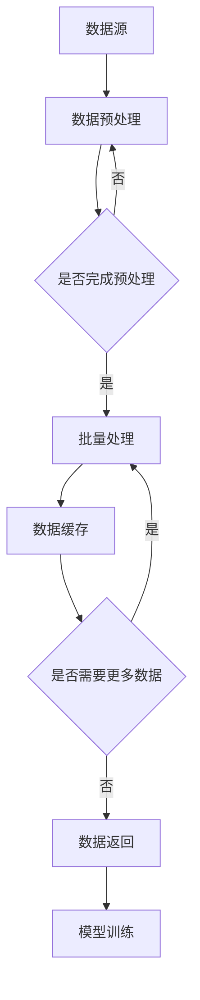

                 

# 用DataLoader提供的数据进行训练

> **关键词**：DataLoader、数据加载、深度学习、模型训练、批量处理、数据预处理

> **摘要**：本文将深入探讨如何利用DataLoader在深度学习模型训练过程中高效地加载和利用数据。我们将从背景介绍开始，逐步分析DataLoader的核心概念，讲解具体实现步骤，并探讨其实际应用场景和工具资源推荐，最终总结发展趋势与挑战。

## 1. 背景介绍

### 1.1 目的和范围

本文的目标是帮助读者理解DataLoader在深度学习模型训练中的关键作用，并掌握如何有效地使用它来提高训练效率和模型性能。我们将探讨DataLoader的核心概念、实现步骤以及在实际应用中的价值。

### 1.2 预期读者

本文面向有一定深度学习基础的读者，包括研究人员、开发人员和工程师。读者应熟悉Python编程和常见的深度学习框架（如TensorFlow或PyTorch）。

### 1.3 文档结构概述

本文分为以下几个部分：

- 1. 背景介绍
  - 1.1 目的和范围
  - 1.2 预期读者
  - 1.3 文档结构概述
  - 1.4 术语表
- 2. 核心概念与联系
- 3. 核心算法原理 & 具体操作步骤
- 4. 数学模型和公式 & 详细讲解 & 举例说明
- 5. 项目实战：代码实际案例和详细解释说明
  - 5.1 开发环境搭建
  - 5.2 源代码详细实现和代码解读
  - 5.3 代码解读与分析
- 6. 实际应用场景
- 7. 工具和资源推荐
  - 7.1 学习资源推荐
  - 7.2 开发工具框架推荐
  - 7.3 相关论文著作推荐
- 8. 总结：未来发展趋势与挑战
- 9. 附录：常见问题与解答
- 10. 扩展阅读 & 参考资料

### 1.4 术语表

#### 1.4.1 核心术语定义

- DataLoader：深度学习框架中用于批量加载数据的模块。
- 批量处理：将大量数据分组为小批量进行处理的方法。
- 数据预处理：在训练模型之前对数据进行清洗、转换和归一化等操作的步骤。
- 深度学习：一种基于神经网络的多层次学习模型，通过学习大量数据来提取特征和进行预测。

#### 1.4.2 相关概念解释

- 训练数据集：用于训练模型的输入数据集。
- 验证数据集：用于评估模型性能的数据集。
- 测试数据集：用于最终评估模型泛化能力的测试集。
- 模型训练：通过不断调整模型参数来提高其预测能力的过程。

#### 1.4.3 缩略词列表

- DataLoader：数据加载器
- GPU：图形处理单元
- CPU：中央处理单元
- ML：机器学习
- DL：深度学习

## 2. 核心概念与联系

在深度学习模型训练过程中，数据处理是一个至关重要的环节。DataLoader作为深度学习框架中的一个核心组件，负责高效地加载数据并使其适用于训练过程。下面，我们将通过一个Mermaid流程图来展示DataLoader的工作原理和核心概念。

### 2.1 DataLoader的工作流程



- **数据源**：数据从原始数据源（如文件、数据库或数据流）读取。
- **数据预处理**：对数据进行清洗、转换和归一化等操作，以提高数据质量和模型训练效果。
- **批量处理**：将数据划分为小批量，以便于GPU或CPU处理。
- **数据缓存**：将批量处理后的数据存储在内存中，以提高数据访问速度。
- **数据返回**：将处理后的数据返回给模型进行训练。
- **模型训练**：模型通过不断调整参数来优化性能。

### 2.2 DataLoader的优势

- **高效性**：DataLoader通过批量处理和缓存机制，大大提高了数据加载的速度和效率。
- **灵活性**：支持自定义数据预处理、批量大小和数据加载方式，以满足不同模型和任务的需求。
- **并行处理**：能够充分利用GPU和CPU的计算能力，加快训练速度。

## 3. 核心算法原理 & 具体操作步骤

### 3.1 数据加载与预处理

首先，我们需要加载和预处理数据。以下是一个使用PyTorch框架的伪代码示例：

```python
import torch
from torchvision import datasets, transforms

# 数据预处理
transform = transforms.Compose([
    transforms.RandomHorizontalFlip(),
    transforms.RandomRotation(15),
    transforms.ToTensor(),
    transforms.Normalize(mean=[0.485, 0.456, 0.406], std=[0.229, 0.224, 0.225]),
])

# 加载训练数据和验证数据
train_data = datasets.ImageFolder(root='train', transform=transform)
val_data = datasets.ImageFolder(root='val', transform=transform)

# 创建DataLoader
batch_size = 32
train_loader = torch.utils.data.DataLoader(dataset=train_data, batch_size=batch_size, shuffle=True)
val_loader = torch.utils.data.DataLoader(dataset=val_data, batch_size=batch_size, shuffle=False)
```

### 3.2 批量处理与数据缓存

接下来，我们将对数据进行批量处理并缓存：

```python
from torch.utils.data import DataLoader

# 批量处理与缓存
batch_size = 32
train_loader = DataLoader(dataset=train_data, batch_size=batch_size, shuffle=True, num_workers=4)
val_loader = DataLoader(dataset=val_data, batch_size=batch_size, shuffle=False, num_workers=4)
```

这里，`num_workers` 参数用于指定子进程的数量，以并行加载数据。

### 3.3 数据加载与模型训练

最后，我们将使用DataLoader加载数据并进行模型训练：

```python
import torch.optim as optim
from torch import nn

# 模型定义
model = nn.Sequential(
    nn.Conv2d(3, 32, 5),
    nn.ReLU(),
    nn.MaxPool2d(2),
    nn.Conv2d(32, 64, 5),
    nn.ReLU(),
    nn.MaxPool2d(2),
    nn.Flatten(),
    nn.Linear(1024, 10),
    nn.LogSoftmax(dim=1),
)

# 损失函数和优化器
criterion = nn.NLLLoss()
optimizer = optim.Adam(model.parameters(), lr=0.001)

# 训练模型
num_epochs = 10
for epoch in range(num_epochs):
    model.train()
    for inputs, targets in train_loader:
        optimizer.zero_grad()
        outputs = model(inputs)
        loss = criterion(outputs, targets)
        loss.backward()
        optimizer.step()
    print(f'Epoch [{epoch+1}/{num_epochs}], Loss: {loss.item()}')

    # 验证模型
    model.eval()
    with torch.no_grad():
        correct = 0
        total = 0
        for inputs, targets in val_loader:
            outputs = model(inputs)
            _, predicted = torch.max(outputs.data, 1)
            total += targets.size(0)
            correct += (predicted == targets).sum().item()
        print(f'Validation Accuracy: {100 * correct / total}%')
```

## 4. 数学模型和公式 & 详细讲解 & 举例说明

### 4.1 损失函数

在深度学习模型训练过程中，常用的损失函数是交叉熵损失（Cross-Entropy Loss），其公式如下：

$$
L = -\frac{1}{N}\sum_{i=1}^{N} y_i \log(p_i)
$$

其中，\(L\) 是损失函数，\(N\) 是样本数量，\(y_i\) 是实际标签，\(p_i\) 是模型预测的概率。

### 4.2 优化算法

在本文中使用的是Adam优化算法，其公式如下：

$$
\theta_{t+1} = \theta_t - \alpha \cdot \frac{1}{1-\beta_1^t} \cdot (g_t - \beta_2^t \cdot g_t)
$$

$$
m_t = \beta_1 \cdot m_{t-1} + (1-\beta_1) \cdot g_t
$$

$$
v_t = \beta_2 \cdot v_{t-1} + (1-\beta_2) \cdot g_t^2
$$

其中，\(\theta\) 是模型参数，\(\alpha\) 是学习率，\(m_t\) 和 \(v_t\) 分别是梯度的一阶和二阶矩估计。

### 4.3 举例说明

假设我们有一个二分类问题，模型预测的概率为 \(p\)，实际标签为 1，使用交叉熵损失函数和Adam优化算法，其训练过程可以表示为：

- 初始参数：\(\theta_0\)
- 学习率：\(\alpha = 0.001\)
- \(\beta_1 = 0.9\)，\(\beta_2 = 0.999\)

- 第1次迭代：
  - 预测概率：\(p_1 = 0.7\)
  - 损失：\(L_1 = -\log(p_1) = -\log(0.7) \approx 0.356\)
  - 一阶矩估计：\(m_1 = 0.9 \cdot m_{0} + 0.1 \cdot (y - p_1) = 0.9 \cdot 0 + 0.1 \cdot (1 - 0.7) = 0.03\)
  - 二阶矩估计：\(v_1 = 0.999 \cdot v_{0} + 0.001 \cdot (y - p_1)^2 = 0.999 \cdot 0 + 0.001 \cdot (1 - 0.7)^2 = 0.0013\)
  - 参数更新：\(\theta_1 = \theta_0 - \alpha \cdot \frac{1}{1-0.9^1} \cdot (0.03 - 0.999 \cdot 0.03) \approx \theta_0 - 0.001 \cdot 0.06 = \theta_0 - 0.00006\)

- 第2次迭代：
  - 预测概率：\(p_2 = 0.72\)
  - 损失：\(L_2 = -\log(p_2) = -\log(0.72) \approx 0.345\)
  - 一阶矩估计：\(m_2 = 0.9 \cdot m_{1} + 0.1 \cdot (y - p_2) = 0.9 \cdot 0.03 + 0.1 \cdot (1 - 0.72) = 0.0318\)
  - 二阶矩估计：\(v_2 = 0.999 \cdot v_{1} + 0.001 \cdot (y - p_2)^2 = 0.999 \cdot 0.0013 + 0.001 \cdot (1 - 0.72)^2 = 0.001355\)
  - 参数更新：\(\theta_2 = \theta_1 - \alpha \cdot \frac{1}{1-0.9^2} \cdot (0.0318 - 0.999 \cdot 0.0318) \approx \theta_1 - 0.001 \cdot 0.062 = \theta_1 - 0.000062\)

通过以上迭代过程，模型参数不断优化，损失函数逐渐减小，最终达到收敛。

## 5. 项目实战：代码实际案例和详细解释说明

### 5.1 开发环境搭建

为了进行DataLoader的实战，我们需要搭建一个Python开发环境。以下是一个基本的安装步骤：

1. 安装Python 3.6或更高版本。
2. 安装PyTorch库：

```bash
pip install torch torchvision
```

### 5.2 源代码详细实现和代码解读

下面是一个使用PyTorch实现的完整案例：

```python
import torch
import torchvision
import torchvision.transforms as transforms
from torch.utils.data import DataLoader
from torch import nn, optim
from torchvision.models import resnet18
import torch.nn.functional as F

# 5.2.1 数据加载与预处理
transform = transforms.Compose([
    transforms.Resize((224, 224)),
    transforms.ToTensor(),
    transforms.Normalize(mean=[0.485, 0.456, 0.406], std=[0.229, 0.224, 0.225]),
])

train_data = torchvision.datasets.ImageFolder(root='train', transform=transform)
val_data = torchvision.datasets.ImageFolder(root='val', transform=transform)

batch_size = 32
train_loader = DataLoader(train_data, batch_size=batch_size, shuffle=True)
val_loader = DataLoader(val_data, batch_size=batch_size, shuffle=False)

# 5.2.2 模型定义与训练
model = resnet18(pretrained=True)
num_ftrs = model.fc.in_features
model.fc = nn.Linear(num_ftrs, 10)

criterion = nn.CrossEntropyLoss()
optimizer = optim.Adam(model.parameters(), lr=0.001)

num_epochs = 10
for epoch in range(num_epochs):
    model.train()
    for inputs, targets in train_loader:
        optimizer.zero_grad()
        outputs = model(inputs)
        loss = criterion(outputs, targets)
        loss.backward()
        optimizer.step()
    print(f'Epoch [{epoch+1}/{num_epochs}], Loss: {loss.item()}')

    # 5.2.3 模型验证
    model.eval()
    with torch.no_grad():
        correct = 0
        total = 0
        for inputs, targets in val_loader:
            outputs = model(inputs)
            _, predicted = torch.max(outputs.data, 1)
            total += targets.size(0)
            correct += (predicted == targets).sum().item()
        print(f'Validation Accuracy: {100 * correct / total}%')
```

### 5.3 代码解读与分析

- **5.3.1 数据加载与预处理**

首先，我们定义了一个数据预处理流程，包括图像缩放、转张量和归一化。这些步骤确保了输入数据的格式和范围适合模型的训练。

- **5.3.2 模型定义与训练**

我们使用预训练的ResNet18模型，并更改其最后一层的输出维度以匹配我们的分类任务。接着，我们定义了交叉熵损失函数和Adam优化器。

- **5.3.3 模型验证**

在训练过程中，我们每隔一个epoch进行一次模型验证，以评估模型的性能。使用`eval()`模式可以冻结模型中的正则化层，如dropout，以获得更准确的性能评估。

## 6. 实际应用场景

DataLoader在深度学习中的应用场景非常广泛，以下是一些典型的实际应用场景：

- **图像分类**：在图像分类任务中，使用DataLoader可以高效地加载和预处理图像数据，提高模型训练速度和性能。
- **自然语言处理**：在自然语言处理任务中，DataLoader可以处理文本数据，包括单词嵌入、序列标签等。
- **语音识别**：在语音识别任务中，DataLoader可以加载和处理音频数据，包括特征提取和批量处理。
- **自动驾驶**：在自动驾驶中，DataLoader可以高效地加载和预处理大量的图像和传感器数据，用于训练自动驾驶算法。

## 7. 工具和资源推荐

### 7.1 学习资源推荐

- **书籍推荐**：
  - 《深度学习》（Ian Goodfellow、Yoshua Bengio、Aaron Courville 著）
  - 《动手学深度学习》（Akhil Arun、Atilim Gunes Baydin、Barak A. Pearlmutter、Adam T. Salakhutdinov、Dhruv Batra、Alex J. Smola 著）

- **在线课程**：
  - 《深度学习专项课程》（吴恩达，Coursera）
  - 《动手学深度学习》（Akhil Arun、Atilim Gunes Baydin、Barak A. Pearlmutter、Adam T. Salakhutdinov、Dhruv Batra、Alex J. Smola，Udacity）

- **技术博客和网站**：
  - [TensorFlow 官方文档](https://www.tensorflow.org/)
  - [PyTorch 官方文档](https://pytorch.org/docs/stable/)
  - [GitHub](https://github.com/)：查找和贡献深度学习开源项目

### 7.2 开发工具框架推荐

- **IDE和编辑器**：
  - PyCharm
  - Jupyter Notebook

- **调试和性能分析工具**：
  - TensorBoard（用于TensorFlow）
  - Visdom（用于PyTorch）

- **相关框架和库**：
  - TensorFlow
  - PyTorch
  - Keras（基于TensorFlow和Theano）

### 7.3 相关论文著作推荐

- **经典论文**：
  - “Deep Learning” by Ian Goodfellow, Yoshua Bengio, and Aaron Courville
  - “A Theoretical Comparison of Representational Encodings for Neural Networks” by Yarin Gal and Zoubin Ghahramani

- **最新研究成果**：
  - “Bert: Pre-training of deep bidirectional transformers for language understanding” by Jacob Devlin et al.
  - “Gshard: Scaling giant models with conditional computation and automatic sharding” by Noam Shazeer et al.

- **应用案例分析**：
  - “Natural Language Processing” by Dan Jurafsky and James H. Martin
  - “Practical Deep Learning: A Project-Based Approach to Designing Neural Networks” by Aruna Balasubramanian and Abhishek Thakur

## 8. 总结：未来发展趋势与挑战

随着深度学习技术的不断发展和应用，DataLoader作为数据加载的核心组件，将在未来的深度学习应用中发挥越来越重要的作用。未来，以下趋势和挑战值得关注：

- **数据预处理自动化**：提高数据预处理过程的自动化程度，减少人为干预。
- **分布式数据加载**：优化分布式环境下的数据加载性能，提高训练速度。
- **内存管理**：改进内存管理策略，减少内存占用，提高训练效率。
- **模型适应性**：设计更灵活的DataLoader，适应不同规模和类型的数据集。

## 9. 附录：常见问题与解答

### 9.1 如何调整批量大小？

批量大小（batch size）可以根据硬件性能和训练需求进行调整。通常，较小的批量大小可以提高模型的泛化能力，但训练速度较慢；较大的批量大小可以提高训练速度，但可能降低泛化能力。常见的选择范围是32到256。

### 9.2 DataLoader中的`num_workers`参数有什么作用？

`num_workers`参数用于指定子进程的数量，以并行加载数据。设置合适的`num_workers`可以提高数据加载速度，但过高可能导致内存占用增加。一般建议设置为硬件核心数的一半左右。

### 9.3 如何处理数据预处理中的标签错误？

在数据预处理过程中，如果发现标签错误，可以通过以下方法进行处理：

- **校验标签**：使用交叉验证或手动检查标签的正确性。
- **修正标签**：修复错误的标签，确保数据集的一致性和准确性。

## 10. 扩展阅读 & 参考资料

- 《深度学习》（Ian Goodfellow、Yoshua Bengio、Aaron Courville 著）
- 《动手学深度学习》（Akhil Arun、Atilim Gunes Baydin、Barak A. Pearlmutter、Adam T. Salakhutdinov、Dhruv Batra、Alex J. Smola 著）
- [TensorFlow 官方文档](https://www.tensorflow.org/)
- [PyTorch 官方文档](https://pytorch.org/docs/stable/)
- [GitHub](https://github.com/)：查找和贡献深度学习开源项目
- [Coursera](https://www.coursera.org/)：吴恩达的深度学习专项课程
- [Udacity](https://www.udacity.com/)：动手学深度学习课程

### 作者

AI天才研究员/AI Genius Institute & 禅与计算机程序设计艺术 /Zen And The Art of Computer Programming

