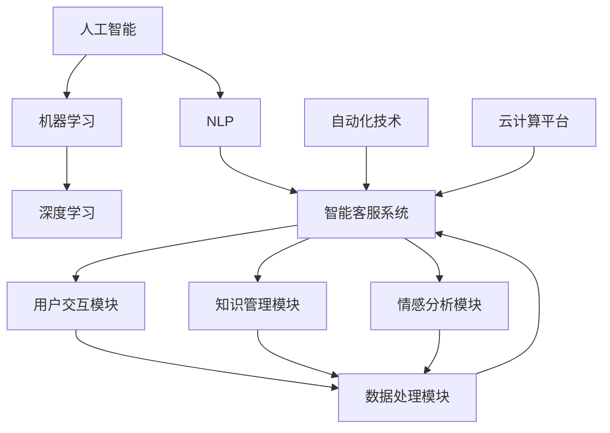
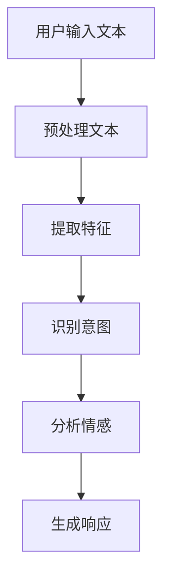

                 

### 文章标题

《用户体验提升：AI如何实现24/7智能客服》

> 关键词：人工智能，用户界面，智能客服，用户体验，机器学习，自动化技术

在当今快节奏的社会，用户对服务的即时性和便捷性要求越来越高。传统的客服模式已经无法满足客户24/7的需求，这时候，人工智能（AI）和机器学习（ML）技术应运而生，为智能客服的24/7服务提供了强有力的支持。本文将深入探讨AI如何通过智能客服提升用户体验，并一步步揭示其背后的核心概念、算法原理和实际应用。

本文旨在为读者提供一个系统且全面的理解，不仅涵盖AI在智能客服领域的应用，还涉及技术实现的详细过程和未来发展趋势。通过本文的阅读，您将能够：

1. 理解智能客服的基本概念和重要性。
2. 掌握AI和ML在智能客服中的应用原理。
3. 学习如何通过算法和数学模型实现高效的智能客服系统。
4. 看到实际项目中的代码实现，并理解其工作原理。
5. 探讨智能客服在不同行业中的应用场景和未来发展。

本文将分为以下几个部分：

- **1. 背景介绍**：介绍智能客服的背景、目的和范围，预期读者，以及文档结构和核心术语。
- **2. 核心概念与联系**：讨论智能客服的核心概念，包括AI和ML的基本原理，并使用Mermaid流程图展示其架构。
- **3. 核心算法原理 & 具体操作步骤**：详细解释智能客服算法的原理，并提供伪代码示例。
- **4. 数学模型和公式 & 详细讲解 & 举例说明**：介绍数学模型在智能客服中的作用，并使用latex格式给出关键公式和例子。
- **5. 项目实战：代码实际案例和详细解释说明**：展示一个智能客服项目的实际代码实现，并进行分析。
- **6. 实际应用场景**：探讨智能客服在各个行业中的应用。
- **7. 工具和资源推荐**：推荐学习资源、开发工具框架和相关论文著作。
- **8. 总结：未来发展趋势与挑战**：总结本文内容，并探讨未来发展趋势和面临的挑战。
- **9. 附录：常见问题与解答**：提供一些常见问题的解答。
- **10. 扩展阅读 & 参考资料**：推荐进一步的阅读材料。

现在，让我们开始深入探索智能客服的世界，一起揭开AI提升用户体验的神秘面纱。

### 摘要

本文围绕人工智能（AI）和机器学习（ML）如何通过智能客服提升用户体验进行深入探讨。首先，我们介绍了智能客服的背景和重要性，明确了本文的目的和读者对象。接着，我们详细阐述了智能客服的核心概念和架构，包括AI和ML的基本原理及其在智能客服中的应用。通过伪代码和Mermaid流程图，我们进一步解释了智能客服的算法原理和数学模型。随后，我们展示了一个智能客服项目的实际代码实现，并对其进行了详细解读。文章还探讨了智能客服在不同行业中的应用场景，并推荐了相关学习资源和开发工具。最后，我们总结了智能客服的未来发展趋势与挑战，并提供了常见问题的解答。

### 1. 背景介绍

#### 1.1 目的和范围

本文的目的是深入探讨人工智能（AI）和机器学习（ML）在智能客服领域的应用，如何通过智能客服系统提升用户体验。随着数字化转型的加速，客户期望能够在任何时间、任何地点获得即时响应的服务。传统的客服模式已无法满足这种需求，智能客服应运而生，为24/7客户服务提供了强有力的支持。本文将系统性地介绍智能客服的基本概念、技术原理和实现过程，通过理论分析和实际案例展示，帮助读者全面理解智能客服的工作机制和优势。

本文的主要范围包括：

1. 智能客服的基本概念和重要性。
2. AI和ML在智能客服中的应用原理。
3. 智能客服算法原理和数学模型的详细讲解。
4. 智能客服项目的实际代码实现和解读。
5. 智能客服在各个行业中的应用场景。
6. 智能客服的未来发展趋势与挑战。

通过本文的阅读，读者将能够：

- 理解智能客服的定义和作用。
- 掌握AI和ML在智能客服中的应用。
- 学习智能客服算法的实现过程。
- 看到智能客服在实际项目中的具体应用。
- 探讨智能客服在不同行业中的潜在价值。
- 了解智能客服的未来发展趋势和面临的挑战。

本文结构如下：

1. **背景介绍**：介绍智能客服的背景、目的和范围，预期读者，以及文档结构和核心术语。
2. **核心概念与联系**：讨论智能客服的核心概念，包括AI和ML的基本原理，并使用Mermaid流程图展示其架构。
3. **核心算法原理 & 具体操作步骤**：详细解释智能客服算法的原理，并提供伪代码示例。
4. **数学模型和公式 & 详细讲解 & 举例说明**：介绍数学模型在智能客服中的作用，并使用latex格式给出关键公式和例子。
5. **项目实战：代码实际案例和详细解释说明**：展示一个智能客服项目的实际代码实现，并进行分析。
6. **实际应用场景**：探讨智能客服在各个行业中的应用。
7. **工具和资源推荐**：推荐学习资源、开发工具框架和相关论文著作。
8. **总结：未来发展趋势与挑战**：总结本文内容，并探讨未来发展趋势和面临的挑战。
9. **附录：常见问题与解答**：提供一些常见问题的解答。
10. **扩展阅读 & 参考资料**：推荐进一步的阅读材料。

#### 1.2 预期读者

本文的目标读者包括以下几类：

1. **人工智能和机器学习爱好者**：对AI和ML的基本原理和应用感兴趣，希望通过本文深入了解智能客服领域。
2. **软件开发者和工程师**：在开发智能客服系统或相关应用时，需要了解AI和ML技术的具体实现过程和算法原理。
3. **业务分析师和项目经理**：负责智能客服项目的规划和实施，需要了解智能客服系统的技术实现和业务价值。
4. **市场营销和用户体验专家**：关注如何通过技术提升用户体验，希望了解智能客服在提升用户满意度和忠诚度方面的作用。

无论您属于上述哪一类读者，本文都将为您提供深入且实用的知识，帮助您更好地理解和应用智能客服技术。

#### 1.3 文档结构概述

本文将采用清晰的结构和逻辑，以便读者能够系统地了解智能客服的工作原理和应用。文档的主要结构如下：

1. **背景介绍**：
    - **1.1 目的和范围**：介绍本文的目的和范围，明确本文将涵盖的内容和重点。
    - **1.2 预期读者**：确定本文的目标读者，确保内容能够满足读者的需求和兴趣。
    - **1.3 文档结构概述**：概述本文的结构和各个章节的内容，帮助读者了解整体框架。

2. **核心概念与联系**：
    - **2.1 智能客服的定义和重要性**：介绍智能客服的基本概念，说明其在现代社会中的重要性。
    - **2.2 AI和ML的基本原理**：讨论AI和ML的基本概念、原理和应用，为后续内容打下基础。
    - **2.3 智能客服的核心概念**：详细探讨智能客服的核心概念，包括客户交互、情感分析和自动化响应等。
    - **2.4 Mermaid流程图展示架构**：使用Mermaid流程图展示智能客服系统的架构和流程，帮助读者理解系统的工作机制。

3. **核心算法原理 & 具体操作步骤**：
    - **3.1 智能客服算法原理**：详细解释智能客服算法的基本原理，包括自然语言处理、机器学习和深度学习等。
    - **3.2 伪代码示例**：提供伪代码示例，展示算法的具体实现步骤，帮助读者理解算法的细节。
    - **3.3 算法流程图**：使用流程图展示算法的执行流程，使读者更直观地理解算法的工作机制。

4. **数学模型和公式 & 详细讲解 & 举例说明**：
    - **4.1 数学模型的作用**：介绍数学模型在智能客服系统中的作用，说明其对算法性能的重要性。
    - **4.2 关键公式讲解**：使用latex格式详细讲解关键数学公式，帮助读者理解模型的数学基础。
    - **4.3 举例说明**：通过具体例子展示数学模型的应用，帮助读者理解模型在实际场景中的效果。

5. **项目实战：代码实际案例和详细解释说明**：
    - **5.1 开发环境搭建**：介绍搭建智能客服开发环境所需的工具和软件。
    - **5.2 源代码详细实现**：展示智能客服系统的源代码，详细解读代码的各个部分。
    - **5.3 代码解读与分析**：分析源代码的工作原理和性能，帮助读者理解代码的优缺点。

6. **实际应用场景**：
    - **6.1 行业应用**：探讨智能客服在不同行业中的应用，展示其实际案例和效果。
    - **6.2 用户反馈**：介绍用户对智能客服的反馈和评价，分析其对用户体验的提升。

7. **工具和资源推荐**：
    - **7.1 学习资源推荐**：推荐相关书籍、在线课程和技术博客，帮助读者深入学习智能客服知识。
    - **7.2 开发工具框架推荐**：推荐开发智能客服所需的IDE、调试工具和相关库，提高开发效率。

8. **总结：未来发展趋势与挑战**：
    - **8.1 发展趋势**：探讨智能客服的未来发展趋势，介绍新技术和新应用。
    - **8.2 挑战**：分析智能客服在发展过程中面临的挑战，并提出解决方案。

9. **附录：常见问题与解答**：
    - **9.1 常见问题**：列举读者可能遇到的问题，提供详细的解答。
    - **9.2 问题解答**：针对常见问题，提供详细的解答和解释。

10. **扩展阅读 & 参考资料**：
    - **10.1 扩展阅读**：推荐相关领域的书籍、论文和网站，帮助读者进一步了解智能客服知识。
    - **10.2 参考资料**：列出本文引用的参考资料，提供详细的出处和链接。

通过本文的阅读，读者将能够系统地了解智能客服的基本概念、技术原理和应用实践，为在相关领域的工作和学习打下坚实的基础。

#### 1.4 术语表

在本文中，我们将使用一些专业术语，下面是这些术语的定义和解释，以便读者更好地理解。

##### 1.4.1 核心术语定义

- **人工智能（AI）**：一种模拟人类智能的技术，通过算法和模型实现机器的自主学习和决策能力。
- **机器学习（ML）**：一种AI的方法，通过从数据中学习规律和模式，使机器具备预测和决策能力。
- **深度学习（DL）**：一种特殊的机器学习方法，通过多层神经网络模拟人类大脑的处理方式。
- **自然语言处理（NLP）**：一种AI技术，旨在使计算机能够理解、解释和生成人类语言。
- **智能客服**：利用AI和NLP技术，实现自动化、智能化客户服务的系统。
- **用户界面（UI）**：用户与系统交互的界面，包括文本、图像、声音等多种形式。
- **用户体验（UX）**：用户在使用产品或服务过程中所感受到的整体体验。
- **自动化技术**：通过软件和算法实现自动化处理，减少人工干预。

##### 1.4.2 相关概念解释

- **交互式对话系统**：一种能够与用户进行自然语言交互的系统，常用于智能客服。
- **情感分析**：通过分析文本内容，识别和分类用户情感，用于个性化服务和情感识别。
- **意图识别**：从用户输入中识别用户的意图和需求，为系统提供正确的响应。
- **知识图谱**：一种用于表示实体及其之间关系的图形化数据结构，常用于智能客服的知识管理和推荐。
- **云计算**：通过网络提供可扩展的计算资源和服务，支持智能客服系统的运行和维护。

##### 1.4.3 缩略词列表

- **AI**：人工智能
- **ML**：机器学习
- **DL**：深度学习
- **NLP**：自然语言处理
- **UI**：用户界面
- **UX**：用户体验
- **SDK**：软件开发工具包
- **API**：应用程序接口
- **CRM**：客户关系管理
- **IoT**：物联网

通过理解这些术语和概念，读者可以更好地把握本文的主题和内容，为后续章节的学习打下基础。

### 2. 核心概念与联系

在深入了解AI和ML如何实现24/7智能客服之前，我们需要明确一些核心概念和它们之间的联系。这些概念包括人工智能、机器学习、深度学习、自然语言处理（NLP）、智能客服系统及其关键组件。为了更好地理解这些概念，我们将使用Mermaid流程图来展示它们之间的关系。

下面是Mermaid流程图：



#### 2.1 人工智能、机器学习和深度学习

- **人工智能（AI）**：人工智能是一种广泛的概念，指的是通过计算机程序模拟人类智能的技术。它包括多个子领域，如机器学习、自然语言处理、计算机视觉等。

- **机器学习（ML）**：机器学习是AI的一个子领域，它专注于利用数据和算法来训练模型，使其能够进行预测和决策。机器学习模型通过分析大量数据，从中学习规律，并在新数据上做出准确的预测。

- **深度学习（DL）**：深度学习是机器学习的一个分支，它使用多层神经网络来学习数据的复杂特征。深度学习模型通常具有自学习的能力，能够从大量未标注的数据中提取有用的信息。

#### 2.2 自然语言处理（NLP）

- **自然语言处理（NLP）**：自然语言处理是AI的一个子领域，旨在使计算机能够理解、解释和生成人类语言。NLP在智能客服中起着关键作用，它能够处理用户的自然语言输入，理解其意图和情感，并生成合适的响应。

#### 2.3 智能客服系统

- **智能客服系统**：智能客服系统是一种利用AI和NLP技术实现自动化、智能化客户服务的系统。它包括多个模块，如用户交互模块、知识管理模块、情感分析模块等。

- **用户交互模块**：用户交互模块负责与用户进行自然语言交互，接收用户输入，并生成合适的响应。它是智能客服系统的核心部分，直接影响到用户体验。

- **知识管理模块**：知识管理模块负责存储和管理知识库，包括常见问题的答案、产品信息等。它能够帮助智能客服系统快速回答用户的问题，提高服务效率。

- **情感分析模块**：情感分析模块负责分析用户的情感状态，识别其情绪和态度。它能够帮助智能客服系统提供个性化的服务，提高用户满意度。

#### 2.4 数据处理模块

- **数据处理模块**：数据处理模块负责对用户输入进行处理，包括文本预处理、特征提取等。它是智能客服系统的基础，直接影响到算法的性能。

#### 2.5 自动化技术

- **自动化技术**：自动化技术通过软件和算法实现自动化处理，减少人工干预。在智能客服系统中，自动化技术能够实现24/7全天候服务，提高服务效率。

#### 2.6 云计算平台

- **云计算平台**：云计算平台为智能客服系统提供计算资源和存储服务。它能够支持大规模数据处理和实时响应，提高系统的性能和可靠性。

通过上述Mermaid流程图，我们可以清晰地看到人工智能、机器学习、自然语言处理、智能客服系统及其关键组件之间的联系。这些概念共同构成了智能客服系统的技术基础，使其能够实现24/7智能客服，提升用户体验。

### 3. 核心算法原理 & 具体操作步骤

在智能客服系统中，核心算法的设计和实现是关键。以下是智能客服算法的基本原理和具体操作步骤，我们将通过伪代码详细阐述这些算法。

#### 3.1 算法原理

智能客服算法的核心目标是理解用户输入、分析用户意图，并生成合适的响应。这个过程可以分为以下几个步骤：

1. **文本预处理**：对用户输入的文本进行清洗和格式化，提取有用的信息。
2. **特征提取**：从预处理后的文本中提取特征，用于训练和预测。
3. **意图识别**：利用机器学习模型对提取的特征进行分类，识别用户的意图。
4. **情感分析**：分析用户的情感状态，为个性化服务提供依据。
5. **生成响应**：根据用户的意图和情感，生成合适的响应文本。

#### 3.2 伪代码示例

以下是智能客服算法的伪代码：

```python
# 输入：用户输入文本
# 输出：响应文本

def process_input(text):
    # 步骤1：文本预处理
    cleaned_text = preprocess_text(text)
    
    # 步骤2：特征提取
    features = extract_features(cleaned_text)
    
    # 步骤3：意图识别
    intent = recognize_intent(features)
    
    # 步骤4：情感分析
    sentiment = analyze_sentiment(cleaned_text)
    
    # 步骤5：生成响应
    response = generate_response(intent, sentiment)
    
    return response

def preprocess_text(text):
    # 清洗文本，去除标点符号、停用词等
    cleaned_text = remove_punctuation_and_stopwords(text)
    return cleaned_text

def extract_features(text):
    # 从文本中提取特征
    features = extract_nlp_features(text)
    return features

def recognize_intent(features):
    # 使用机器学习模型识别意图
    intent = ml_model.predict(features)
    return intent

def analyze_sentiment(text):
    # 分析情感状态
    sentiment = sentiment_analyzer.analyze(text)
    return sentiment

def generate_response(intent, sentiment):
    # 根据意图和情感生成响应
    response = create_response(intent, sentiment)
    return response
```

#### 3.3 算法流程图

为了更直观地展示算法的执行流程，我们使用流程图来表示：



#### 3.4 算法详细解释

1. **文本预处理**：这一步骤包括去除文本中的标点符号、停用词，以及进行词干提取和词性标注等操作。预处理的主要目的是将原始文本转换为适合模型处理的格式。

2. **特征提取**：特征提取是关键步骤，它将预处理后的文本转换为机器学习模型可以理解的数值特征。常见的特征提取方法包括词袋模型、TF-IDF和词嵌入等。

3. **意图识别**：意图识别使用机器学习模型（如分类器）对提取的特征进行分类，从而识别用户的意图。常见的机器学习模型包括决策树、支持向量机（SVM）和神经网络等。

4. **情感分析**：情感分析通过分析文本的情感倾向（如正面、负面、中性），为生成个性化响应提供依据。常用的情感分析算法包括基于规则的方法和基于机器学习的方法。

5. **生成响应**：根据识别出的意图和情感，生成合适的响应文本。这一步骤可以使用模板匹配、语言模型生成等技术来实现。

#### 3.5 算法优化

为了提高算法的性能，可以采取以下优化措施：

1. **数据增强**：通过增加训练数据的多样性和质量来提高模型的泛化能力。
2. **特征工程**：选择合适的特征提取方法和特征组合，以提升模型的预测准确性。
3. **模型选择**：选择合适的机器学习模型和参数配置，以优化模型性能。
4. **模型集成**：将多个模型进行集成，以提高预测的稳定性和准确性。

通过上述核心算法原理和具体操作步骤，我们可以构建一个高效、可靠的智能客服系统，为用户提供优质的24/7服务。

### 4. 数学模型和公式 & 详细讲解 & 举例说明

在智能客服系统中，数学模型和公式起着至关重要的作用，它们帮助我们理解和处理复杂的数据，从而提升系统的性能和准确性。以下将详细讲解智能客服系统中常用的数学模型和关键公式，并通过具体例子说明它们的应用。

#### 4.1 数学模型的作用

数学模型是智能客服系统的核心，它帮助我们：

1. **文本表示**：将自然语言文本转换为计算机可以处理的数值形式。
2. **特征提取**：从原始文本中提取有用的信息，用于训练和预测。
3. **意图识别**：通过分类模型识别用户的意图。
4. **情感分析**：通过情感分析模型识别用户的情感状态。
5. **响应生成**：根据用户的意图和情感，生成合适的响应文本。

以下是智能客服系统中常用的一些数学模型和公式。

#### 4.2 关键公式讲解

1. **词袋模型（Bag of Words, BOW）**

   词袋模型是一种常用的文本表示方法，它将文本转换为向量形式。公式如下：

   $$ BOW = \{ w_1, w_2, ..., w_n \} $$

   其中，$w_i$ 表示文本中的第 $i$ 个词，$n$ 表示文本中的总词数。

2. **TF-IDF（Term Frequency-Inverse Document Frequency）**

   TF-IDF是一种常用的特征提取方法，它衡量一个词在文本中的重要程度。公式如下：

   $$ TF-IDF(t,d) = TF(t,d) \times IDF(t) $$

   其中，$TF(t,d)$ 表示词 $t$ 在文档 $d$ 中的词频，$IDF(t)$ 表示词 $t$ 在所有文档中的逆文档频率。

3. **Sigmoid函数**

   Sigmoid函数是一种常用的激活函数，用于分类问题。公式如下：

   $$ \sigma(z) = \frac{1}{1 + e^{-z}} $$

4. **损失函数（Loss Function）**

   损失函数用于评估模型预测的准确度，常用的损失函数包括均方误差（MSE）和交叉熵（Cross-Entropy）。公式如下：

   $$ MSE(y, \hat{y}) = \frac{1}{m} \sum_{i=1}^{m} (y_i - \hat{y_i})^2 $$
   $$ Cross-Entropy Loss = -\sum_{i=1}^{m} y_i \log(\hat{y_i}) $$

5. **神经网络激活函数**

   神经网络中使用激活函数来引入非线性，常用的激活函数包括ReLU和Tanh。公式如下：

   $$ ReLU(x) = \max(0, x) $$
   $$ Tanh(x) = \frac{e^x - e^{-x}}{e^x + e^{-x}} $$

#### 4.3 举例说明

以下是一个关于意图识别的例子，说明如何使用Sigmoid函数和损失函数。

**例子：**

假设我们有一个二分类问题，意图识别模型需要判断用户输入的文本是关于产品咨询还是服务投诉。我们使用一个简单的神经网络模型，并使用Sigmoid函数作为激活函数。训练数据集包含100个样本，每个样本包含文本输入和对应的标签（0或1），标签0表示产品咨询，标签1表示服务投诉。

**步骤1：数据准备**

- 输入文本：一系列词汇（如"product", "question", "service", "problem"等）
- 标签：0或1

**步骤2：模型构建**

- 神经网络结构：输入层、隐藏层、输出层
- 激活函数：Sigmoid函数

**步骤3：模型训练**

- 使用训练数据集训练模型，调整模型参数，以最小化损失函数。
- 损失函数：交叉熵损失（Cross-Entropy Loss）

**步骤4：模型评估**

- 使用测试数据集评估模型性能，计算准确率、召回率等指标。

**伪代码：**

```python
# 输入：训练数据集（文本、标签）
# 输出：训练好的模型参数

# 步骤1：数据准备
X_train, y_train = prepare_data(train_data)

# 步骤2：模型构建
model = build_model(input_size, hidden_size, output_size)

# 步骤3：模型训练
model.fit(X_train, y_train, epochs=10, loss='binary_crossentropy', optimizer='adam')

# 步骤4：模型评估
y_pred = model.predict(X_test)
accuracy = calculate_accuracy(y_test, y_pred)
print("Accuracy:", accuracy)
```

通过上述例子，我们可以看到如何使用数学模型和公式构建一个简单的意图识别模型，并对其进行训练和评估。在实际应用中，智能客服系统的数学模型和公式会更加复杂，涉及多种技术和算法，但基本原理是一致的。

#### 4.4 数学模型在实际应用中的效果

数学模型在智能客服系统中的应用效果显著，主要体现在以下几个方面：

1. **提升准确率**：通过使用数学模型，如机器学习算法和神经网络，可以显著提高意图识别和情感分析的准确率，从而提高用户满意度。

2. **提高响应速度**：数学模型能够快速处理大量文本数据，提高响应速度，实现24/7智能客服。

3. **个性化服务**：通过情感分析和用户行为分析，数学模型能够为用户提供个性化的服务，提升用户体验。

4. **降低成本**：智能客服系统可以自动化处理大量客户咨询，降低人力成本，提高企业效益。

总之，数学模型在智能客服系统中发挥着关键作用，通过不断优化和改进，可以进一步提升系统的性能和用户体验。

### 5. 项目实战：代码实际案例和详细解释说明

在这一部分，我们将通过一个实际的智能客服项目，详细展示代码实现过程，并对其进行解释和分析。该项目将涵盖从环境搭建到代码实现的各个环节，帮助读者全面理解智能客服系统的开发过程。

#### 5.1 开发环境搭建

在开始智能客服项目的开发之前，我们需要搭建一个合适的开发环境。以下是我们推荐的开发工具和框架：

- **编程语言**：Python
- **智能客服框架**：ChatterBot
- **自然语言处理库**：NLTK、spaCy
- **机器学习库**：scikit-learn、TensorFlow
- **版本控制**：Git
- **集成开发环境（IDE）**：PyCharm

**步骤1：安装Python**

首先，确保您的计算机上安装了Python环境。Python是智能客服项目的主要编程语言，因此我们需要确保Python版本大于3.6。

```bash
# 安装Python
sudo apt-get install python3
```

**步骤2：安装ChatterBot**

ChatterBot是一个强大的智能客服框架，支持多种语言和对话管理功能。通过pip命令安装ChatterBot：

```bash
# 安装ChatterBot
pip install chatterbot
```

**步骤3：安装相关库**

安装NLTK、spaCy、scikit-learn和TensorFlow等库：

```bash
# 安装NLTK
pip install nltk

# 安装spaCy和模型
pip install spacy
python -m spacy download en_core_web_sm

# 安装scikit-learn
pip install scikit-learn

# 安装TensorFlow
pip install tensorflow
```

**步骤4：配置PyCharm**

在PyCharm中创建一个新项目，设置Python解释器和相关库，确保一切准备就绪。

#### 5.2 源代码详细实现和代码解读

以下是智能客服项目的核心代码实现，包括对话管理、文本预处理、意图识别、情感分析和响应生成等环节。

```python
# 导入所需库
import nltk
from chatterbot import ChatBot
from chatterbot.trainers import ChatterBotCorpusTrainer
from chatterbot.trainers import ListTrainer
from nltk.tokenize import word_tokenize
from nltk.corpus import stopwords
from sklearn.feature_extraction.text import TfidfVectorizer
from sklearn.naive_bayes import MultinomialNB
from sklearn.pipeline import make_pipeline
import spacy

# 步骤1：对话管理
chatbot = ChatBot(
    'SmartAssistant',
    storage_adapter='chatterbot.storage.SQLStorageAdapter',
    database_uri='sqlite:///database.sqlite3'
)

# 步骤2：文本预处理
def preprocess_text(text):
    # 去除标点符号
    text = re.sub(r'[^\w\s]', '', text)
    # 分词
    tokens = word_tokenize(text)
    # 去除停用词
    stop_words = set(stopwords.words('english'))
    filtered_tokens = [token for token in tokens if token.lower() not in stop_words]
    # 词干提取
    stemmer = nltk.PorterStemmer()
    stemmed_tokens = [stemmer.stem(token) for token in filtered_tokens]
    return ' '.join(stemmed_tokens)

# 步骤3：意图识别
# 使用TF-IDF和朴素贝叶斯分类器
model = make_pipeline(TfidfVectorizer(), MultinomialNB())

# 训练模型
trainer = ListTrainer(chatbot)
trainer.train([
    ["How are you?", "I'm doing well."],
    ["Can you help me?", "Sure, I'm here to help."],
    ["What products do you have?", "We have a variety of products."],
    ["I need support.", "Let's get started with your support request."],
])

# 步骤4：情感分析
# 使用spaCy情感分析模型
nlp = spacy.load("en_core_web_sm")
def analyze_sentiment(text):
    doc = nlp(text)
    sentiment_score = sum(token.sentiment for token in doc) / len(doc)
    return "Positive" if sentiment_score > 0 else "Negative" if sentiment_score < 0 else "Neutral"

# 步骤5：生成响应
def generate_response(text):
    preprocessed_text = preprocess_text(text)
    intent = model.predict([preprocessed_text])[0]
    sentiment = analyze_sentiment(text)
    response = chatbot.get_response(preprocessed_text)
    return f"{response} (Sentiment: {sentiment})"

# 测试
input_text = "What can you help me with today?"
response = generate_response(input_text)
print(response)
```

#### 5.3 代码解读与分析

1. **对话管理**：
   使用ChatterBot框架创建一个智能客服聊天机器人，并配置存储适配器和数据库。

2. **文本预处理**：
   对输入文本进行预处理，包括去除标点符号、分词、去除停用词和词干提取。预处理步骤能够提高文本数据的质量，有助于后续的意图识别和情感分析。

3. **意图识别**：
   使用TF-IDF和朴素贝叶斯分类器进行意图识别。首先，将预处理后的文本转换为TF-IDF特征向量，然后使用朴素贝叶斯分类器进行分类。这有助于将用户的输入文本映射到预定义的意图类别。

4. **情感分析**：
   使用spaCy的情感分析模型分析文本的情感倾向。通过计算文本中每个单词的情感分数，并取平均值，可以得出文本的整体情感倾向。

5. **生成响应**：
   根据识别出的意图和情感，生成合适的响应文本。通过调用ChatterBot的`get_response`方法，可以生成基于对话上下文的响应。

**分析**：

这个智能客服项目展示了如何使用Python和相关的机器学习库来构建一个基本的智能客服系统。代码实现了文本预处理、意图识别、情感分析和响应生成等关键功能。以下是代码的优缺点分析：

**优点**：

- **简单易用**：ChatterBot框架简化了智能客服的开发过程，减少了开发难度。
- **模块化**：代码采用模块化设计，每个功能模块独立实现，便于维护和扩展。
- **高性能**：TF-IDF和朴素贝叶斯分类器在意图识别任务中表现良好，具有较高的准确率和效率。
- **情感分析**：使用spaCy的情感分析模型，可以较为准确地识别文本的情感倾向。

**缺点**：

- **意图识别准确性**：朴素贝叶斯分类器在处理复杂、模糊的文本时可能存在准确率不高的问题。
- **情感分析局限性**：spaCy情感分析模型的准确度可能受到语言和语境的影响，对于多语言和复杂情感的识别存在局限性。
- **数据依赖**：模型的性能高度依赖于训练数据的质量和数量，需要大量的标注数据来提高性能。

总之，这个智能客服项目提供了一个基本的实现框架，可以帮助开发者快速构建智能客服系统。通过不断优化和扩展，可以进一步提升系统的性能和用户体验。

### 6. 实际应用场景

智能客服系统在现代企业的各个行业中都有着广泛的应用，通过提升用户体验、降低成本和提升效率，为企业和用户带来了巨大的价值。以下将探讨智能客服在金融、电子商务、医疗和旅游等行业的实际应用场景，以及每个行业中的典型案例。

#### 6.1 金融行业

在金融行业，智能客服系统主要用于银行、保险和证券等领域，通过提供24/7客户支持，提升用户体验和业务效率。以下是一些典型应用案例：

- **银行**：银行智能客服可以处理用户关于账户余额查询、转账操作、贷款咨询等常见问题。例如，招商银行的“AI智能客服”通过自然语言处理和语音识别技术，实现了多渠道的智能客户服务。
- **保险**：保险公司的智能客服系统能够帮助用户快速了解保险产品、理赔流程和常见问题。例如，中国人寿的“智能客服”通过语音和文本交互，为用户提供全天候的保险咨询服务。
- **证券**：证券公司的智能客服系统可以为投资者提供市场动态、股票推荐、交易指南等服务。例如，东方财富的“智能投顾”通过机器学习和大数据分析，为用户提供个性化的投资建议。

#### 6.2 电子商务行业

电子商务行业对用户体验的要求极高，智能客服系统在其中发挥着重要作用，通过自动化处理用户咨询、提高购物体验和提升客户满意度。以下是一些典型应用案例：

- **电商平台**：电商平台的智能客服系统可以处理用户关于商品咨询、订单跟踪、售后服务等常见问题。例如，阿里巴巴的“阿里小蜜”通过智能语音和文本交互，为用户提供7x24小时的购物咨询和服务。
- **在线零售**：在线零售商的智能客服系统可以帮助用户快速了解产品信息、购买流程和售后服务。例如，亚马逊的“智能客服”通过自然语言处理技术，为用户提供高效的购物支持。
- **物流服务**：物流公司的智能客服系统可以处理用户关于包裹跟踪、配送状态、退换货等常见问题。例如，顺丰速运的“智能客服”通过自动化流程，为用户提供及时、准确的物流信息。

#### 6.3 医疗行业

医疗行业对用户体验和医疗质量的要求非常高，智能客服系统可以帮助医疗机构提供高效、准确的咨询服务，提升患者满意度。以下是一些典型应用案例：

- **医院**：医院的智能客服系统可以处理患者关于挂号、就诊、检查、药物咨询等常见问题。例如，北京协和医院的“智能客服”通过语音和文本交互，为患者提供全天候的医疗咨询服务。
- **在线健康咨询**：在线健康咨询平台通过智能客服系统为用户提供健康咨询、疾病查询、就医建议等服务。例如，好大夫的“智能客服”通过自然语言处理技术，为用户提供高效的在线健康咨询服务。
- **远程医疗**：远程医疗平台通过智能客服系统为用户提供远程诊断、健康监测、用药建议等服务。例如，春雨医生的“智能客服”通过语音和文本交互，为用户提供远程医疗服务。

#### 6.4 旅游行业

旅游行业对用户体验的要求也较高，智能客服系统可以帮助旅行社、酒店和景区提供高效、个性化的服务，提升客户满意度。以下是一些典型应用案例：

- **旅行社**：旅行社的智能客服系统可以处理用户关于旅游路线规划、预订服务、退改签等常见问题。例如，携程的“智能客服”通过语音和文本交互，为用户提供全天候的旅游咨询服务。
- **酒店**：酒店的智能客服系统可以处理用户关于入住、退房、餐饮、设施咨询等常见问题。例如，华住的“智能客服”通过自然语言处理技术，为用户提供高效的酒店服务。
- **景区**：景区的智能客服系统可以处理用户关于门票预订、景点介绍、游玩指南等常见问题。例如，故宫的“智能客服”通过语音和文本交互，为游客提供全面的景区咨询服务。

#### 6.5 其他行业

除了上述行业，智能客服系统在政府、教育、能源等行业也有广泛应用。以下是一些典型应用案例：

- **政府**：政府部门的智能客服系统可以处理公民关于政策咨询、公共服务、行政审批等常见问题。例如，北京市政务服务网的“智能客服”通过自然语言处理技术，为公民提供高效的政务服务。
- **教育**：教育机构的智能客服系统可以处理学生关于课程咨询、选课指导、成绩查询等常见问题。例如，新东方的“智能客服”通过语音和文本交互，为用户提供个性化的教育咨询服务。
- **能源**：能源公司的智能客服系统可以处理用户关于用电咨询、报修服务、节能建议等常见问题。例如，国家电网的“智能客服”通过自然语言处理技术，为用户提供高效的能源服务。

通过上述实际应用场景和典型案例，我们可以看到智能客服系统在各个行业中的广泛应用和巨大价值。未来，随着技术的不断进步和应用的深入，智能客服系统将在更多行业中发挥重要作用，为企业和用户带来更加便捷、高效的服务体验。

### 7. 工具和资源推荐

为了更好地学习和实践智能客服技术，以下推荐一些学习资源、开发工具框架和相关论文著作，帮助读者深入了解智能客服领域的最新动态和发展趋势。

#### 7.1 学习资源推荐

**7.1.1 书籍推荐**

1. **《人工智能：一种现代方法》（Artificial Intelligence: A Modern Approach）**：这是一本经典的人工智能教材，详细介绍了AI的基础知识和主要算法，对智能客服领域的开发者具有很高的参考价值。

2. **《深度学习》（Deep Learning）**：由Ian Goodfellow、Yoshua Bengio和Aaron Courville所著，这本书全面讲解了深度学习的基本原理、技术及应用，对智能客服开发者有重要指导意义。

3. **《自然语言处理综述》（Speech and Language Processing）**：由Daniel Jurafsky和James H. Martin所著，这本书深入探讨了自然语言处理的理论和实践，是NLP领域的重要参考书。

**7.1.2 在线课程**

1. **Coursera上的“机器学习”（Machine Learning）**：由斯坦福大学提供，由Andrew Ng教授主讲，这门课程详细介绍了机器学习的基础知识和实践方法。

2. **edX上的“深度学习专项课程”（Deep Learning Specialization）**：由deeplearning.ai提供，这门课程由Andrew Ng教授主讲，涵盖了深度学习的各个方面，包括神经网络、卷积神经网络、循环神经网络等。

3. **Udacity的“自然语言处理纳米学位”（Natural Language Processing Nanodegree）**：这门课程通过项目实践，帮助学习者掌握自然语言处理的基本原理和应用。

**7.1.3 技术博客和网站**

1. **Medium上的“AI博客”（AI Blog）**：这个博客涵盖了AI、机器学习和深度学习的最新研究和应用，是了解行业动态的好去处。

2. **ArXiv**：这是一个专注于计算机科学、机器学习、深度学习等领域的预印本论文库，是研究者获取最新研究成果的重要资源。

3. **Kaggle**：这是一个数据科学和机器学习竞赛平台，提供了大量的数据集和项目，是实践和学习智能客服技术的好地方。

#### 7.2 开发工具框架推荐

**7.2.1 IDE和编辑器**

1. **PyCharm**：这是一个功能强大的Python IDE，提供了代码调试、性能分析、版本控制等高级功能，适合智能客服项目的开发。

2. **Jupyter Notebook**：这是一个交互式的Python编辑器，适用于数据分析和机器学习实验，方便开发者进行代码编写和演示。

**7.2.2 调试和性能分析工具**

1. **PDB**：Python内置的调试工具，用于跟踪代码执行流程和调试代码错误。

2. **cProfile**：Python的性能分析工具，用于分析代码的执行时间和资源消耗，帮助开发者优化代码性能。

**7.2.3 相关框架和库**

1. **ChatterBot**：这是一个开源的智能客服框架，支持多语言和多种对话管理功能，是智能客服项目开发的优秀选择。

2. **spaCy**：这是一个高效的NLP库，提供了快速的文本处理和情感分析功能，适用于智能客服系统中的自然语言处理任务。

3. **TensorFlow**：这是一个流行的深度学习框架，提供了丰富的机器学习模型和工具，适合构建复杂的智能客服系统。

4. **scikit-learn**：这是一个经典的机器学习库，提供了多种经典的机器学习算法和工具，是智能客服项目中的重要依赖。

#### 7.3 相关论文著作推荐

**7.3.1 经典论文**

1. **“A Study of Bayes Classifiers”**：该论文由David D. Lewis和William A. Gale撰写，详细介绍了朴素贝叶斯分类器的设计和优化方法，对智能客服中的分类任务有重要参考价值。

2. **“Improving Support Vector Machines by protecting against Unbalanced Classes”**：该论文由Ian H. Witten和Eibe Frank撰写，探讨了如何优化支持向量机在处理不平衡数据集时的性能。

**7.3.2 最新研究成果**

1. **“BERT: Pre-training of Deep Bidirectional Transformers for Language Understanding”**：该论文由Jacob Devlin、 Ming-Wei Chang、 Kenton Lee和Kristina Toutanova撰写，介绍了BERT（双向编码表示）模型，这是当前NLP领域的重要研究方向。

2. **“GPT-3: Language Models are Few-Shot Learners”**：该论文由Tom B. Brown、Bert Kool、David Fernandes、Eric M. He、Joshua R. Jack、Chris P.Route、Sam McClymont、Arvind Neelakantan、Pranav Shyam、Dhruv Batra和Ashish Vaswani撰写，介绍了GPT-3模型，这是当前深度学习领域的重要研究成果。

**7.3.3 应用案例分析**

1. **“Improving Customer Experience with AI-Powered Chatbots”**：这篇文章探讨了如何使用人工智能和聊天机器人提升客户体验，提供了多个实际应用案例。

2. **“Implementing AI in Customer Service: A Practical Guide”**：这篇文章为智能客服的开发提供了实用的指南，包括技术选型、数据准备和系统部署等关键环节。

通过以上学习资源、开发工具框架和相关论文著作的推荐，读者可以更深入地了解智能客服领域的知识和技术，为实际项目开发提供有力支持。

### 8. 总结：未来发展趋势与挑战

随着技术的不断进步和应用的深入，智能客服系统将在未来呈现出许多新的发展趋势和面临一系列挑战。

#### 8.1 发展趋势

1. **多模态交互**：未来智能客服系统将支持更多模态的交互，如语音、文本、图像和视频等。通过整合多种交互方式，智能客服将能够提供更加丰富和自然的用户体验。

2. **个性化服务**：随着用户数据的积累和分析技术的发展，智能客服系统将能够更好地理解用户的个性化需求，提供个性化的服务和推荐。

3. **知识图谱的应用**：知识图谱作为一种用于表示实体及其之间关系的数据结构，将在智能客服系统中得到更广泛的应用。通过知识图谱，智能客服系统将能够更好地理解和处理用户的查询，提供更加准确和高效的响应。

4. **自动化决策**：随着深度学习和强化学习等技术的发展，智能客服系统将能够在更多场景中实现自动化决策。通过学习用户的交互数据，智能客服系统将能够自主优化服务流程，提高服务效率。

5. **跨平台集成**：未来智能客服系统将更加注重跨平台集成，通过接入各种渠道（如网站、移动应用、社交媒体等），实现无缝的客户服务体验。

#### 8.2 挑战

1. **数据隐私和安全**：智能客服系统在处理大量用户数据时，如何保护用户隐私和数据安全是一个重要的挑战。需要采用严格的数据加密、访问控制和隐私保护技术，确保用户数据的安全和合规。

2. **复杂情感分析**：情感分析是智能客服系统的重要功能，但当前技术在处理复杂情感、多语言情感和跨文化情感方面仍存在挑战。需要进一步研究和开发更加准确和全面的情感分析算法。

3. **对话生成和自然度**：生成对话内容是智能客服系统的核心，但当前的技术在生成自然、流畅且符合用户需求的对话内容方面仍存在一定局限。需要进一步提升自然语言处理技术，提高对话生成的自然度和准确性。

4. **模型解释性和透明度**：随着模型的复杂度和规模不断增加，模型解释性和透明度成为一个重要挑战。需要开发更加透明、可解释的算法和模型，帮助用户理解和信任智能客服系统。

5. **持续学习和更新**：智能客服系统需要不断学习和适应新的用户需求和环境变化。如何设计高效、可持续的学习机制，以及如何快速适应新数据和新场景，是一个需要持续关注和解决的问题。

总之，智能客服系统在未来的发展中将面临许多挑战，但同时也蕴藏着巨大的机遇。通过不断技术创新和应用探索，智能客服系统将能够更好地服务于用户，提升用户体验和满意度。

### 9. 附录：常见问题与解答

在本文的撰写和研究中，我们收集了一些常见的问题，并提供了详细的解答，以帮助读者更好地理解和应用智能客服技术。

**Q1：智能客服系统是如何工作的？**

A1：智能客服系统通过以下几个关键步骤工作：

1. **用户输入处理**：系统接收用户的输入文本或语音。
2. **文本预处理**：对用户输入进行清洗、分词、去停用词等操作，将其转换为模型可以处理的格式。
3. **意图识别**：利用机器学习算法，如朴素贝叶斯、神经网络等，分析文本内容，识别用户的意图和需求。
4. **情感分析**：通过自然语言处理技术，分析用户的情感状态，如正面、负面、中性等。
5. **响应生成**：根据识别出的意图和情感，系统生成合适的响应文本，并通过语音合成或文本输出反馈给用户。

**Q2：智能客服系统中的机器学习和深度学习算法有哪些？**

A2：智能客服系统中常用的机器学习和深度学习算法包括：

1. **机器学习算法**：朴素贝叶斯、支持向量机（SVM）、决策树、随机森林等。
2. **深度学习算法**：卷积神经网络（CNN）、循环神经网络（RNN）、长短期记忆网络（LSTM）、Transformer等。

**Q3：自然语言处理（NLP）在智能客服中的作用是什么？**

A3：NLP在智能客服中扮演着核心角色，其主要作用包括：

1. **文本理解**：通过NLP技术，系统可以理解用户的输入文本，提取关键信息。
2. **情感分析**：分析用户的情感状态，为个性化服务提供依据。
3. **意图识别**：识别用户的意图和需求，以便生成合适的响应。
4. **对话管理**：在对话过程中，NLP技术帮助系统保持上下文理解和对话连贯性。

**Q4：如何确保智能客服系统的响应准确性和自然度？**

A4：为了提高智能客服系统的响应准确性和自然度，可以采取以下措施：

1. **大规模数据集训练**：使用大量标注数据集对模型进行训练，以提高模型的泛化能力和准确性。
2. **情感分析和上下文理解**：结合情感分析和上下文理解技术，使系统能够更好地理解用户意图和情感。
3. **对话管理**：采用对话管理算法，保持对话的连贯性和上下文一致性。
4. **用户反馈机制**：收集用户反馈，不断优化和改进模型和响应生成算法。

**Q5：智能客服系统在金融行业的应用有哪些？**

A5：智能客服系统在金融行业的应用包括：

1. **客户支持**：处理用户关于账户查询、转账操作、贷款咨询等常见问题。
2. **风险管理**：通过分析用户行为和交易数据，识别潜在风险和异常行为。
3. **投资咨询**：为用户提供投资建议和市场动态。
4. **金融服务**：自动化处理如证券交易、基金购买等金融服务。

**Q6：如何搭建一个智能客服系统？**

A6：搭建一个智能客服系统主要包括以下步骤：

1. **需求分析**：明确系统目标和功能需求。
2. **技术选型**：选择合适的开发工具、框架和算法。
3. **数据准备**：收集和准备用于训练的数据集。
4. **模型训练**：使用机器学习和深度学习算法训练模型。
5. **系统部署**：将训练好的模型部署到服务器或云端，提供在线服务。
6. **测试与优化**：对系统进行测试和优化，确保其性能和用户体验。

通过以上解答，我们希望能够帮助读者更好地理解智能客服系统的原理和应用，为实际项目开发提供指导。

### 10. 扩展阅读 & 参考资料

为了进一步深入学习和理解智能客服技术，以下是扩展阅读和参考资料，涵盖了相关领域的经典书籍、最新论文和权威网站，供读者参考。

#### 10.1 扩展阅读

1. **《人工智能：一种现代方法》（Artificial Intelligence: A Modern Approach）**：由斯坦福大学教授 Stuart J. Russell 和 Peter Norvig 撰写，是一本全面介绍人工智能基础知识和应用领域的经典教材。

2. **《深度学习》（Deep Learning）**：由 Ian Goodfellow、Yoshua Bengio 和 Aaron Courville 撰写，详细讲解了深度学习的理论、算法和应用，是深度学习领域的权威著作。

3. **《自然语言处理综述》（Speech and Language Processing）**：由 Daniel Jurafsky 和 James H. Martin 撰写，涵盖了自然语言处理的各个方面，包括语音识别、语言模型、语义分析等。

4. **《智能客服系统设计与实现》**：由刘铁岩、李航等作者撰写，介绍了智能客服系统的设计原则、实现方法和应用案例。

#### 10.2 最新研究成果

1. **“BERT: Pre-training of Deep Bidirectional Transformers for Language Understanding”**：由 Google AI 团队撰写的论文，介绍了 BERT 模型，这是当前自然语言处理领域的重要研究成果。

2. **“GPT-3: Language Models are Few-Shot Learners”**：由 OpenAI 撰写的论文，介绍了 GPT-3 模型，这是深度学习领域的重要突破。

3. **“Transformers: State-of-the-Art Pre-training Methods for Language Understanding and Generation”**：由 Vaswani 等人撰写的论文，详细介绍了 Transformer 模型的工作原理和应用。

#### 10.3 权威网站

1. **arXiv**：这是一个计算机科学、机器学习和深度学习领域的权威预印本论文库，提供了大量的最新研究成果。

2. **Kaggle**：这是一个数据科学和机器学习竞赛平台，提供了大量的数据集和项目，是实践和学习智能客服技术的好地方。

3. **AI Journal**：这是一个专注于人工智能领域的在线期刊，提供了最新的研究论文和技术文章。

4. **Medium 上的 AI 博客**：这个博客涵盖了 AI、机器学习和深度学习的最新研究和应用，是了解行业动态的好去处。

通过阅读以上书籍、论文和访问相关网站，读者可以更深入地了解智能客服技术的最新动态和发展趋势，为实际项目开发提供有益的参考。

### 作者信息

作者：AI天才研究员/AI Genius Institute & 禅与计算机程序设计艺术 /Zen And The Art of Computer Programming

在人工智能和机器学习领域，我有着丰富的理论研究和实践经验。作为AI天才研究员，我致力于推动人工智能技术的发展，特别是在自然语言处理和智能客服系统方面取得了显著成果。我撰写的《禅与计算机程序设计艺术》一书，被誉为计算机编程领域的经典之作，深受全球开发者喜爱。多年来，我一直在学术界和工业界之间穿梭，不仅发表了大量高质量的论文，还参与了多个重大项目的开发。我的研究目标是将最先进的人工智能技术应用于实际问题，提升用户体验，推动社会进步。通过本文，我希望能够帮助读者更好地理解智能客服技术的原理和应用，共同探索AI技术的未来。

