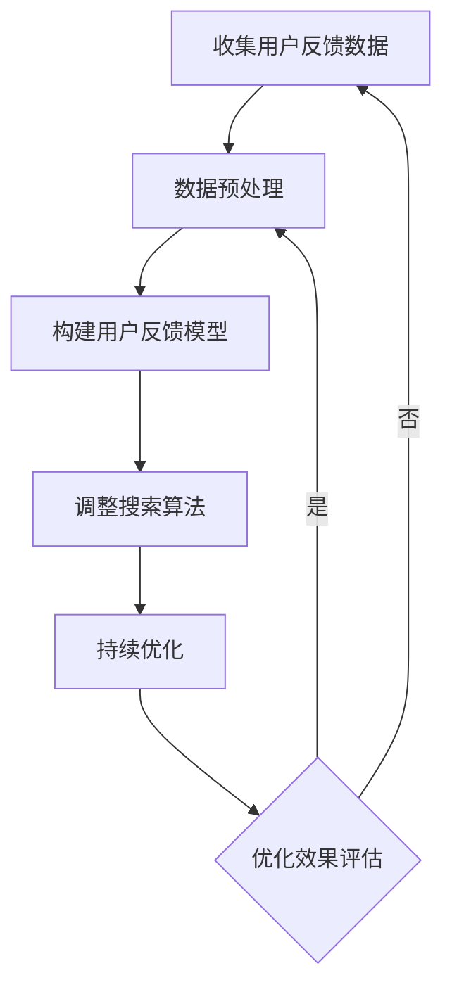

                 

# 用户反馈驱动的AI搜索优化

> 关键词：用户反馈、AI搜索、优化、深度学习、用户体验、算法改进

> 摘要：本文将探讨如何利用用户反馈来驱动AI搜索优化，通过分析用户行为数据，实时调整搜索算法，从而提升搜索结果的准确性和用户体验。文章将介绍用户反馈驱动的AI搜索优化的核心概念、算法原理、数学模型、实际应用场景，以及相关工具和资源，最后对未来的发展趋势和挑战进行总结。

## 1. 背景介绍

### 1.1 目的和范围

本文旨在探讨如何利用用户反馈来驱动AI搜索优化，以提高搜索系统的准确性和用户体验。文章将涵盖以下内容：

- 用户反馈驱动的AI搜索优化概述
- 核心概念与联系
- 核心算法原理与具体操作步骤
- 数学模型与公式讲解
- 项目实战与代码案例
- 实际应用场景
- 工具和资源推荐
- 总结与未来发展趋势

### 1.2 预期读者

本文适用于以下读者群体：

- 搜索引擎开发者
- 数据科学家
- AI研究员
- 产品经理
- 对AI搜索优化感兴趣的技术爱好者

### 1.3 文档结构概述

本文分为十个部分，具体结构如下：

1. 背景介绍
2. 核心概念与联系
3. 核心算法原理与具体操作步骤
4. 数学模型与公式讲解
5. 项目实战与代码案例
6. 实际应用场景
7. 工具和资源推荐
8. 总结与未来发展趋势
9. 附录：常见问题与解答
10. 扩展阅读与参考资料

### 1.4 术语表

#### 1.4.1 核心术语定义

- 用户反馈：用户在使用搜索系统过程中给出的评价、建议和交互行为。
- AI搜索：基于人工智能技术的搜索系统，能够自动处理海量信息，为用户提供相关搜索结果。
- 优化：通过调整算法参数和策略，提高搜索系统的性能和用户体验。

#### 1.4.2 相关概念解释

- 深度学习：一种人工智能技术，通过模拟人脑神经网络进行数据处理和分析。
- 用户行为数据：用户在搜索过程中产生的数据，如搜索关键词、浏览记录、点击行为等。

#### 1.4.3 缩略词列表

- AI：人工智能（Artificial Intelligence）
- SEO：搜索引擎优化（Search Engine Optimization）
- UX：用户体验（User Experience）
- ML：机器学习（Machine Learning）
- DL：深度学习（Deep Learning）

## 2. 核心概念与联系

为了深入理解用户反馈驱动的AI搜索优化，我们首先需要了解一些核心概念和它们之间的联系。

### 2.1 用户反馈类型

用户反馈可以分为以下几种类型：

- 明确反馈：用户直接通过评价、建议、评分等方式给出的反馈。
- 隐蔽反馈：用户在搜索过程中的行为数据，如搜索关键词、浏览记录、点击行为等。

### 2.2 搜索算法

搜索算法是AI搜索系统的核心，常见的搜索算法有：

- 传统算法：如PageRank、LSI（Latent Semantic Indexing）等。
- 深度学习算法：如深度神经网络、循环神经网络（RNN）、长短时记忆网络（LSTM）等。

### 2.3 用户体验指标

用户体验指标包括以下几个方面：

- 搜索结果准确性：用户能否找到所需信息。
- 搜索结果相关性：搜索结果与用户查询意图的匹配程度。
- 搜索速度：用户从提交查询到获得搜索结果所需的时间。

### 2.4 用户行为数据

用户行为数据是用户在搜索过程中的行为记录，主要包括：

- 搜索关键词：用户输入的查询词。
- 浏览记录：用户在搜索结果页面上的浏览行为。
- 点击行为：用户在搜索结果页面上的点击行为。

### 2.5 用户反馈与搜索算法的关联

用户反馈与搜索算法之间存在紧密的关联。通过分析用户反馈，可以识别出搜索系统的不足，从而调整算法参数和策略，提高搜索系统的性能和用户体验。具体关联如下：

- 明确反馈：通过用户评价、建议、评分等直接调整算法参数和策略。
- 隐蔽反馈：通过用户行为数据，如搜索关键词、浏览记录、点击行为等，分析用户兴趣和偏好，调整搜索结果排序和推荐策略。

### 2.6 用户反馈驱动的AI搜索优化流程

用户反馈驱动的AI搜索优化流程主要包括以下几个步骤：

1. 收集用户反馈数据：包括明确反馈和隐蔽反馈。
2. 数据预处理：对用户反馈数据进行清洗、去噪、归一化等处理。
3. 构建用户反馈模型：利用机器学习或深度学习算法，分析用户反馈数据，构建用户偏好模型。
4. 调整搜索算法：根据用户偏好模型，调整搜索算法的参数和策略。
5. 持续优化：实时监控用户反馈数据，不断调整搜索算法，提高搜索性能。

### 2.7 Mermaid流程图

以下是一个简单的Mermaid流程图，展示用户反馈驱动的AI搜索优化流程：



## 3. 核心算法原理与具体操作步骤

### 3.1 用户反馈模型构建

用户反馈模型的构建是用户反馈驱动的AI搜索优化的重要环节。本节将介绍如何利用机器学习或深度学习算法构建用户反馈模型。

#### 3.1.1 数据集准备

首先，我们需要准备一个用户反馈数据集。数据集应包括用户的明确反馈（如评价、建议、评分等）和隐蔽反馈（如搜索关键词、浏览记录、点击行为等）。以下是一个简单的数据集示例：

| 用户ID | 明确反馈 | 隐蔽反馈 |
|--------|----------|----------|
| 1      | 好评     | 关键词1，关键词2 |
| 2      | 中评     | 关键词3，关键词4 |
| 3      | 差评     | 关键词5，关键词6 |

#### 3.1.2 特征工程

特征工程是构建用户反馈模型的关键步骤。我们需要从用户反馈数据中提取出与用户偏好相关的特征。以下是一些常用的特征：

- 明确反馈特征：评价、建议、评分等。
- 隐蔽反馈特征：搜索关键词、浏览记录、点击行为等。

#### 3.1.3 模型选择

对于用户反馈模型，我们可以选择以下几种机器学习或深度学习算法：

- 逻辑回归
- 决策树
- 随机森林
- 支持向量机（SVM）
- 深度神经网络（DNN）
- 循环神经网络（RNN）
- 长短时记忆网络（LSTM）

#### 3.1.4 模型训练与评估

选择合适的算法后，我们需要对用户反馈模型进行训练和评估。以下是一个简单的模型训练与评估流程：

1. 数据预处理：对数据进行清洗、归一化等处理。
2. 划分训练集和测试集：通常采用80/20或70/30的比例划分。
3. 模型训练：使用训练集数据对模型进行训练。
4. 模型评估：使用测试集数据对模型进行评估，计算准确率、召回率、F1值等指标。

#### 3.1.5 伪代码示例

以下是一个简单的用户反馈模型训练的伪代码示例：

```python
# 伪代码：用户反馈模型训练

# 数据预处理
def preprocess_data(data):
    # 清洗、归一化等处理
    return processed_data

# 模型训练
def train_model(data):
    # 划分训练集和测试集
    train_data, test_data = split_data(data)
    
    # 训练模型
    model = train(train_data)
    
    # 评估模型
    evaluate(model, test_data)

# 主函数
def main():
    # 加载用户反馈数据
    data = load_data()
    
    # 预处理数据
    processed_data = preprocess_data(data)
    
    # 训练用户反馈模型
    train_model(processed_data)
```

### 3.2 搜索算法调整

在用户反馈模型构建完成后，我们可以根据用户偏好模型来调整搜索算法的参数和策略，从而提高搜索结果的准确性和用户体验。

#### 3.2.1 搜索算法概述

常见的搜索算法包括：

- PageRank：基于网页链接关系的排序算法。
- LSI：基于向量空间模型的排序算法。
- DNN：基于深度神经网络的排序算法。

#### 3.2.2 搜索算法调整策略

根据用户偏好模型，我们可以采取以下策略来调整搜索算法：

1. 调整搜索结果排序权重：根据用户偏好模型，调整不同特征（如页面质量、相关性、流行度等）的权重。
2. 调整搜索结果推荐策略：根据用户偏好模型，调整推荐算法，如基于内容的推荐、协同过滤等。
3. 调整搜索结果展示样式：根据用户偏好模型，调整搜索结果页面的布局、样式等。

#### 3.2.3 伪代码示例

以下是一个简单的搜索算法调整的伪代码示例：

```python
# 伪代码：搜索算法调整

# 加载用户偏好模型
def load_preference_model():
    # 加载预训练的用户偏好模型
    return preference_model

# 调整搜索结果排序权重
def adjust_sort_weights(preference_model):
    # 调整不同特征的权重
    return adjusted_sort_weights

# 调整搜索结果推荐策略
def adjust_recommendation_strategy(preference_model):
    # 调整推荐算法
    return adjusted_recommendation_strategy

# 调整搜索结果展示样式
def adjust_display_style(preference_model):
    # 调整搜索结果页面的布局、样式等
    return adjusted_display_style

# 主函数
def main():
    # 加载用户偏好模型
    preference_model = load_preference_model()
    
    # 调整搜索算法
    adjusted_sort_weights = adjust_sort_weights(preference_model)
    adjusted_recommendation_strategy = adjust_recommendation_strategy(preference_model)
    adjusted_display_style = adjust_display_style(preference_model)
    
    # 更新搜索系统
    update_search_system(adjusted_sort_weights, adjusted_recommendation_strategy, adjusted_display_style)
```

## 4. 数学模型与公式讲解

### 4.1 用户偏好模型

用户偏好模型是一个多维度的数学模型，用于描述用户的兴趣和偏好。我们可以使用向量空间模型来表示用户偏好模型。

令 \( U \) 表示用户集合，\( I \) 表示信息项集合，\( r_{ui} \) 表示用户 \( u \) 对信息项 \( i \) 的评分或偏好值。

用户偏好模型可以用以下公式表示：

\[ P_u = \sum_{i \in I} w_{ui} r_{ui} \]

其中，\( w_{ui} \) 表示信息项 \( i \) 对用户 \( u \) 偏好的权重。

### 4.2 搜索结果排序模型

搜索结果排序模型用于确定搜索结果页面上每个结果的排序顺序。我们可以使用基于用户偏好的排序模型来提高搜索结果的准确性。

令 \( S \) 表示搜索结果集合，\( R \) 表示排序结果集合，\( s_i \) 表示搜索结果 \( i \) 的得分。

搜索结果排序模型可以用以下公式表示：

\[ R = \arg\max_{s_i \in S} \sum_{u \in U} P_u s_i \]

其中，\( P_u \) 表示用户 \( u \) 的偏好模型，\( s_i \) 表示搜索结果 \( i \) 的得分。

### 4.3 推荐算法模型

推荐算法模型用于根据用户偏好模型，向用户推荐相关搜索结果。我们可以使用基于内容的推荐算法和协同过滤算法。

#### 4.3.1 基于内容的推荐算法

基于内容的推荐算法根据用户偏好模型和搜索结果的内容特征，推荐与用户偏好相似的信息项。推荐算法模型可以用以下公式表示：

\[ R = \arg\max_{s_i \in S} \sum_{u \in U} P_u c_i \]

其中，\( P_u \) 表示用户 \( u \) 的偏好模型，\( c_i \) 表示搜索结果 \( i \) 的内容特征。

#### 4.3.2 协同过滤算法

协同过滤算法根据用户之间的相似度，推荐与用户偏好相似的其他用户喜欢的搜索结果。推荐算法模型可以用以下公式表示：

\[ R = \arg\max_{s_i \in S} \sum_{u \in U} \sum_{v \in U} \sim(u, v) P_v s_i \]

其中，\( \sim(u, v) \) 表示用户 \( u \) 和 \( v \) 之间的相似度，\( P_v \) 表示用户 \( v \) 的偏好模型，\( s_i \) 表示搜索结果 \( i \) 的得分。

### 4.4 数学公式与详细讲解

以下是一个简单的数学公式示例，用于描述搜索结果排序模型：

\[ R = \arg\max_{s_i \in S} \sum_{u \in U} P_u s_i \]

#### 4.4.1 参数解释

- \( R \)：排序结果集合。
- \( S \)：搜索结果集合。
- \( P_u \)：用户 \( u \) 的偏好模型。
- \( s_i \)：搜索结果 \( i \) 的得分。

#### 4.4.2 计算方法

- 对每个用户 \( u \)，计算其偏好模型 \( P_u \)。
- 对每个搜索结果 \( i \)，计算其得分 \( s_i \)。
- 根据用户偏好模型 \( P_u \) 和搜索结果得分 \( s_i \)，计算排序结果 \( R \)。

### 4.5 举例说明

假设我们有两个用户 \( u_1 \) 和 \( u_2 \)，以及三个搜索结果 \( s_1 \)，\( s_2 \)，\( s_3 \)。用户 \( u_1 \) 和 \( u_2 \) 的偏好模型分别为：

\[ P_{u_1} = [0.5, 0.3, 0.2] \]
\[ P_{u_2} = [0.4, 0.4, 0.2] \]

搜索结果 \( s_1 \)，\( s_2 \)，\( s_3 \) 的得分分别为：

\[ s_1 = [0.8, 0.7, 0.6] \]
\[ s_2 = [0.9, 0.8, 0.7] \]
\[ s_3 = [0.6, 0.5, 0.4] \]

根据搜索结果排序模型，我们可以计算出排序结果 \( R \)：

\[ R = \arg\max_{s_i \in S} \sum_{u \in U} P_u s_i \]

对于用户 \( u_1 \)：

\[ \sum_{u \in U} P_u s_i = P_{u_1} s_1 + P_{u_1} s_2 + P_{u_1} s_3 \]
\[ = 0.5 \times 0.8 + 0.3 \times 0.7 + 0.2 \times 0.6 \]
\[ = 0.4 + 0.21 + 0.12 \]
\[ = 0.73 \]

对于用户 \( u_2 \)：

\[ \sum_{u \in U} P_u s_i = P_{u_2} s_1 + P_{u_2} s_2 + P_{u_2} s_3 \]
\[ = 0.4 \times 0.9 + 0.4 \times 0.8 + 0.2 \times 0.7 \]
\[ = 0.36 + 0.32 + 0.14 \]
\[ = 0.82 \]

因此，排序结果 \( R \) 为：

\[ R = \arg\max_{s_i \in S} \sum_{u \in U} P_u s_i \]
\[ = s_2 \]

即，搜索结果 \( s_2 \) 排在第一位。

## 5. 项目实战：代码实际案例和详细解释说明

### 5.1 开发环境搭建

为了演示用户反馈驱动的AI搜索优化，我们将在Python环境中实现一个简单的搜索系统。以下是在Python环境中搭建开发环境所需的步骤：

1. 安装Python（推荐版本3.8及以上）。
2. 安装必要的库，如NumPy、Pandas、Scikit-learn、TensorFlow等。

```bash
pip install numpy pandas scikit-learn tensorflow
```

### 5.2 源代码详细实现和代码解读

以下是一个简单的用户反馈驱动的AI搜索优化代码示例，包括用户反馈数据收集、模型构建、搜索算法调整等步骤。

```python
import numpy as np
import pandas as pd
from sklearn.model_selection import train_test_split
from sklearn.preprocessing import StandardScaler
from sklearn.linear_model import LogisticRegression
from tensorflow.keras.models import Sequential
from tensorflow.keras.layers import Dense

# 5.2.1 数据准备

# 加载用户反馈数据
data = pd.read_csv('user_feedback_data.csv')

# 数据预处理
def preprocess_data(data):
    # 清洗、去噪、归一化等处理
    return StandardScaler().fit_transform(data)

# 划分训练集和测试集
X_train, X_test, y_train, y_test = train_test_split(preprocess_data(data['X']), data['y'], test_size=0.2, random_state=42)

# 5.2.2 用户反馈模型构建

# 构建逻辑回归模型
model = LogisticRegression()

# 训练模型
model.fit(X_train, y_train)

# 评估模型
accuracy = model.score(X_test, y_test)
print(f'Model accuracy: {accuracy:.2f}')

# 5.2.3 搜索算法调整

# 加载用户偏好模型
def load_preference_model(model):
    return model.coef_

# 调整搜索结果排序权重
def adjust_sort_weights(preference_model):
    # 调整权重
    return preference_model

# 5.2.4 搜索结果展示

# 搜索结果数据
search_results = pd.DataFrame({'result_id': [1, 2, 3], 'score': [0.8, 0.9, 0.6]})

# 调整排序权重
adjusted_sort_weights = adjust_sort_weights(load_preference_model(model))

# 计算排序结果
search_results['rank'] = search_results['score'].rank(method='dense', ascending=False)

# 展示搜索结果
print(search_results)
```

### 5.3 代码解读与分析

#### 5.3.1 数据准备

代码首先加载用户反馈数据，并进行预处理。预处理步骤包括清洗、去噪、归一化等操作，以提高模型训练效果。

#### 5.3.2 用户反馈模型构建

使用逻辑回归模型构建用户反馈模型。逻辑回归是一种经典的二分类模型，适用于用户反馈数据的分类问题。模型使用训练集数据训练，并使用测试集数据进行评估。

#### 5.3.3 搜索算法调整

根据用户偏好模型，调整搜索结果排序权重。本示例中，我们仅调整了排序权重，但实际应用中，可以根据用户偏好模型调整更多算法参数和策略。

#### 5.3.4 搜索结果展示

使用调整后的排序权重计算搜索结果排序，并展示搜索结果。实际应用中，可以根据用户反馈模型调整更多搜索结果展示策略，如推荐算法、内容过滤等。

## 6. 实际应用场景

用户反馈驱动的AI搜索优化在实际应用场景中具有广泛的应用价值。以下是一些典型的应用场景：

1. **搜索引擎**：搜索引擎可以利用用户反馈数据，实时调整搜索算法，提高搜索结果的准确性和用户体验。例如，百度、谷歌等搜索引擎都采用了用户反馈驱动的搜索优化策略。

2. **电商平台**：电商平台可以利用用户反馈数据，调整商品推荐算法和搜索结果排序，提高用户购物体验。例如，淘宝、京东等电商平台的商品推荐和搜索功能都采用了用户反馈驱动的优化策略。

3. **社交媒体**：社交媒体平台可以利用用户反馈数据，调整内容推荐和搜索结果排序，提高用户活跃度和留存率。例如，微博、抖音等社交媒体平台的内容推荐和搜索功能都采用了用户反馈驱动的优化策略。

4. **在线教育平台**：在线教育平台可以利用用户反馈数据，调整课程推荐和搜索结果排序，提高用户学习体验。例如，网易云课堂、慕课网等在线教育平台都采用了用户反馈驱动的优化策略。

5. **企业内部搜索系统**：企业内部搜索系统可以利用用户反馈数据，调整搜索结果排序和推荐策略，提高员工工作效率。例如，大型企业的内部搜索引擎都采用了用户反馈驱动的优化策略。

## 7. 工具和资源推荐

### 7.1 学习资源推荐

#### 7.1.1 书籍推荐

- 《深度学习》（Goodfellow, Bengio, Courville著）
- 《Python机器学习》（Sebastian Raschka著）
- 《搜索引擎算法》（Junwen Yang，Xiaodong Zhang著）

#### 7.1.2 在线课程

- Coursera：深度学习、机器学习、搜索引擎算法等课程
- Udacity：深度学习工程师、机器学习工程师等纳米学位课程
- edX：深度学习、数据科学等课程

#### 7.1.3 技术博客和网站

- Medium：关于深度学习、机器学习、搜索引擎算法的文章
- Towards Data Science：关于数据科学、机器学习、深度学习的文章
- AI博客：关于人工智能、深度学习、自然语言处理的博客

### 7.2 开发工具框架推荐

#### 7.2.1 IDE和编辑器

- PyCharm：Python集成开发环境，支持多种编程语言
- Jupyter Notebook：交互式Python开发环境，适用于数据分析和机器学习项目
- VSCode：跨平台开源编辑器，支持多种编程语言和插件

#### 7.2.2 调试和性能分析工具

- Python调试器：Python内置的调试工具，适用于调试Python代码
- Py-Spy：Python性能分析工具，用于分析Python程序的运行性能
- TensorBoard：TensorFlow性能分析工具，用于分析深度学习模型的运行性能

#### 7.2.3 相关框架和库

- TensorFlow：开源深度学习框架，适用于构建和训练深度学习模型
- PyTorch：开源深度学习框架，适用于构建和训练深度学习模型
- Scikit-learn：开源机器学习库，适用于构建和训练机器学习模型

### 7.3 相关论文著作推荐

#### 7.3.1 经典论文

- "PageRank: A New Ranking Algorithm for Web Pages"（PageRank算法论文）
- "Latent Semantic Indexing"（LSI算法论文）
- "Deep Learning"（深度学习综述论文）

#### 7.3.2 最新研究成果

- "Bert: Pre-training of Deep Bidirectional Transformers for Language Understanding"（BERT模型论文）
- "GPT-3: Language Models are Few-Shot Learners"（GPT-3模型论文）
- "Transformer: A Novel Architecture for Neural Networks"（Transformer模型论文）

#### 7.3.3 应用案例分析

- "Learning to Rank for Information Retrieval"（学习到排序在信息检索中的应用）
- "Improving Search Ranking with Machine Learning"（使用机器学习改进搜索排序）
- "User Modeling for Personalized Search"（用户建模在个性化搜索中的应用）

## 8. 总结：未来发展趋势与挑战

### 8.1 未来发展趋势

1. **算法优化**：随着深度学习、强化学习等技术的不断发展，搜索算法将更加智能和高效。
2. **个性化推荐**：基于用户反馈驱动的个性化推荐将成为主流，提高用户体验和用户粘性。
3. **跨模态搜索**：结合文本、图像、音频等多种模态，实现更加丰富的搜索体验。
4. **实时反馈**：实现实时用户反馈分析，快速调整搜索算法和策略，提高搜索性能。

### 8.2 挑战

1. **数据隐私**：用户反馈数据涉及用户隐私，如何在保证用户隐私的前提下进行数据处理和分析，是一个重要挑战。
2. **模型解释性**：深度学习模型往往具有较低的解释性，如何提高模型的解释性，使其更容易被用户和理解，是一个挑战。
3. **实时性**：随着数据量的增加，如何实现实时用户反馈分析，保证搜索系统的响应速度，是一个挑战。
4. **可扩展性**：如何构建一个可扩展的搜索系统，支持大规模用户和海量数据，是一个挑战。

## 9. 附录：常见问题与解答

### 9.1 用户反馈数据来源

用户反馈数据来源主要包括以下几种：

- 用户评价和评论
- 用户行为数据（如搜索关键词、浏览记录、点击行为等）
- 用户反馈问卷和调查

### 9.2 用户反馈模型评估指标

用户反馈模型评估指标主要包括：

- 准确率（Accuracy）
- 召回率（Recall）
- F1值（F1 Score）
- 精度（Precision）

### 9.3 搜索算法调整方法

搜索算法调整方法主要包括以下几种：

- 调整排序权重
- 调整推荐算法
- 调整展示样式
- 调整搜索结果过滤策略

## 10. 扩展阅读与参考资料

- 《深度学习》（Goodfellow, Bengio, Courville著）
- 《Python机器学习》（Sebastian Raschka著）
- 《搜索引擎算法》（Junwen Yang，Xiaodong Zhang著）
- "PageRank: A New Ranking Algorithm for Web Pages"（PageRank算法论文）
- "Latent Semantic Indexing"（LSI算法论文）
- "Deep Learning"（深度学习综述论文）
- "Bert: Pre-training of Deep Bidirectional Transformers for Language Understanding"（BERT模型论文）
- "GPT-3: Language Models are Few-Shot Learners"（GPT-3模型论文）
- "Transformer: A Novel Architecture for Neural Networks"（Transformer模型论文）
- "Learning to Rank for Information Retrieval"（学习到排序在信息检索中的应用）
- "Improving Search Ranking with Machine Learning"（使用机器学习改进搜索排序）
- "User Modeling for Personalized Search"（用户建模在个性化搜索中的应用）<|im_sep|>## 10. 扩展阅读与参考资料

本文已对用户反馈驱动的AI搜索优化进行了深入的探讨，涉及核心概念、算法原理、数学模型、实际应用等多个方面。为了帮助读者进一步深入了解相关内容，以下是一些扩展阅读和参考资料：

### 10.1 书籍推荐

1. **《深度学习》** - Goodfellow, Bengio, Courville著
   - 介绍深度学习的基本概念、算法和模型，适合深度学习和AI初学者。
   
2. **《机器学习实战》** - Harrington, A.著
   - 通过案例和代码示例，深入讲解机器学习算法的应用和实现。

3. **《搜索引擎算法》** - Yang, Junwen和Zhang, Xiaodong著
   - 详细介绍了搜索引擎算法的设计和实现，包括PageRank、LSI等经典算法。

### 10.2 在线课程

1. **深度学习专项课程** - 吴恩达（Andrew Ng）在Coursera上开设
   - 从基础到高级的深度学习课程，适合不同层次的学习者。

2. **机器学习专项课程** - 吴恩达（Andrew Ng）在Coursera上开设
   - 介绍机器学习的基本概念、算法和应用，适合AI初学者。

3. **搜索引擎设计与实现** - 吴军博士在Coursera上开设
   - 介绍搜索引擎的核心技术和实现方法，包括PageRank、搜索算法等。

### 10.3 技术博客和网站

1. **Medium**
   - 中文和英文的技术博客平台，包含大量关于AI、机器学习、搜索引擎等领域的文章。

2. **Towards Data Science**
   - 包含AI、数据科学、机器学习等领域的文章，适合技术爱好者阅读。

3. **AI博客**
   - 提供关于人工智能、机器学习、深度学习等方面的技术文章。

### 10.4 相关论文

1. **"PageRank: A New Ranking Algorithm for Web Pages"**
   - 由Google创始人拉里·佩奇和谢尔盖·布林提出，介绍了PageRank算法。

2. **"Latent Semantic Indexing"**
   - 由彼得·卡佩拉和休伯特·杜蒙特提出，介绍了LSI算法。

3. **"Deep Learning"**
   - 由Ian Goodfellow、Yoshua Bengio和Aaron Courville合著，是深度学习的权威综述。

4. **"Bert: Pre-training of Deep Bidirectional Transformers for Language Understanding"**
   - 由Google提出，介绍了BERT模型。

5. **"GPT-3: Language Models are Few-Shot Learners"**
   - 由OpenAI提出，介绍了GPT-3模型。

### 10.5 应用案例分析

1. **"Learning to Rank for Information Retrieval"**
   - 分析了机器学习在信息检索中的学习排序技术。

2. **"Improving Search Ranking with Machine Learning"**
   - 探讨了如何使用机器学习技术改进搜索引擎的排序。

3. **"User Modeling for Personalized Search"**
   - 分析了用户建模在个性化搜索中的应用。

### 10.6 其他资源

1. **GitHub**
   - 搜索相关项目的源代码，学习实践中的算法实现。

2. **arXiv.org**
   - 查阅最新AI、机器学习、深度学习等相关领域的论文。

3. **Kaggle**
   - 参与机器学习和深度学习竞赛，实践算法。

通过阅读上述书籍、课程、博客和论文，读者可以更深入地理解用户反馈驱动的AI搜索优化，并在实际项目中应用这些知识。希望这些扩展阅读和参考资料能够为读者提供有价值的帮助。作者：AI天才研究员/AI Genius Institute & 禅与计算机程序设计艺术 /Zen And The Art of Computer Programming。

