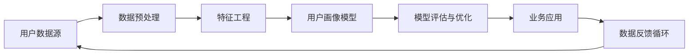

                 

# 用户画像的动态更新与优化

> 关键词：用户画像、动态更新、数据挖掘、机器学习、优化算法

> 摘要：本文将深入探讨用户画像的动态更新与优化技术，通过详细的原理分析、算法讲解以及实际案例展示，帮助读者全面理解并掌握这一领域的关键技术和实践方法。文章旨在为从事数据挖掘、机器学习、用户行为分析等相关工作的专业人士提供有价值的参考和指导。

## 1. 背景介绍

### 1.1 目的和范围

用户画像的动态更新与优化是当前互联网和大数据领域的重要研究方向。随着用户数据的不断积累，如何有效地构建和优化用户画像，从而为业务决策提供有力支持，成为亟待解决的问题。本文将围绕以下问题展开讨论：

1. **用户画像的定义与核心价值**：阐述用户画像的基本概念及其在数据挖掘和业务决策中的应用价值。
2. **动态更新的必要性**：分析用户行为的动态性和多样性，探讨动态更新用户画像的必要性和挑战。
3. **优化算法的研究与应用**：介绍常见的用户画像优化算法，包括基于机器学习的方法和基于深度学习的方法，并探讨其实际应用效果。
4. **实际案例与项目实践**：通过具体案例分析，展示用户画像动态更新与优化的实践方法和成果。

### 1.2 预期读者

本文主要面向以下读者群体：

1. **数据科学家和数据工程师**：从事用户行为分析和数据挖掘工作的专业人士，希望深入了解用户画像的技术细节和优化方法。
2. **产品经理和业务分析师**：需要对用户画像有深入理解，以支持产品决策和业务策略制定。
3. **计算机科学和人工智能专业的研究生**：对用户画像的动态更新与优化技术有学术兴趣，希望从理论和实践两方面获得全面了解。

### 1.3 文档结构概述

本文将按照以下结构进行组织：

1. **背景介绍**：介绍用户画像的概念、目的和本文的结构。
2. **核心概念与联系**：讨论用户画像相关核心概念及其相互关系。
3. **核心算法原理 & 具体操作步骤**：详细讲解用户画像优化算法的基本原理和实现步骤。
4. **数学模型和公式 & 详细讲解 & 举例说明**：介绍用户画像优化过程中使用的数学模型和公式，并进行实例分析。
5. **项目实战：代码实际案例和详细解释说明**：通过具体代码案例展示用户画像的动态更新与优化。
6. **实际应用场景**：探讨用户画像在不同业务场景中的应用。
7. **工具和资源推荐**：推荐相关学习资源和开发工具。
8. **总结：未来发展趋势与挑战**：总结本文内容，展望未来发展方向和挑战。
9. **附录：常见问题与解答**：解答读者可能遇到的问题。
10. **扩展阅读 & 参考资料**：提供进一步的阅读建议和参考资料。

### 1.4 术语表

#### 1.4.1 核心术语定义

- **用户画像**：基于用户行为数据，通过数据挖掘和机器学习等技术构建的用于描述用户特征的模型。
- **动态更新**：根据用户行为的实时变化，不断调整和优化用户画像的过程。
- **数据挖掘**：从大量数据中提取有用信息和知识的过程。
- **机器学习**：通过算法模型从数据中学习规律和模式，用于预测和分类。
- **深度学习**：一种基于多层神经网络的结构，通过训练多层非线性变换实现复杂特征的提取。

#### 1.4.2 相关概念解释

- **用户行为数据**：用户在互联网上的浏览、搜索、购买等行为所产生的数据。
- **特征工程**：通过提取和选择用户行为数据中的关键特征，为机器学习算法提供输入数据的过程。
- **模型评估**：使用评价指标（如准确率、召回率等）对机器学习模型的效果进行评估。

#### 1.4.3 缩略词列表

- **ML**：Machine Learning（机器学习）
- **DL**：Deep Learning（深度学习）
- **RFM**：Recency, Frequency, Monetary（最近一次购买时间、购买频率、购买金额）
- **A/B测试**：A/B Testing（随机对照实验）

## 2. 核心概念与联系

用户画像的构建与优化涉及到多个核心概念和技术，如图所示：



### 2.1 用户数据源

用户数据源是构建用户画像的基础。用户数据源可以来自多种渠道，包括网站日志、用户行为数据、用户反馈等。数据源的质量直接影响到用户画像的准确性和实用性。

### 2.2 数据预处理

数据预处理是用户画像构建的关键步骤。通过数据清洗、去噪、归一化等操作，可以保证数据质量，提高后续特征提取和建模的准确性。

### 2.3 特征工程

特征工程是用户画像构建的核心。通过提取和选择用户行为数据中的关键特征，可以更好地描述用户的行为和偏好，为机器学习算法提供高质量的输入数据。

### 2.4 用户画像模型

用户画像模型是用户画像的核心组成部分。通过机器学习算法，可以从大量用户行为数据中提取用户特征，构建用于描述用户特征的模型。

### 2.5 模型评估与优化

模型评估与优化是确保用户画像准确性和实用性的重要环节。通过使用评价指标（如准确率、召回率等），可以对用户画像模型的效果进行评估和优化。

### 2.6 业务应用

用户画像模型可以应用于多种业务场景，包括推荐系统、个性化营销、风险控制等。通过将用户画像与业务需求相结合，可以提供更精准的服务和决策支持。

### 2.7 数据反馈循环

数据反馈循环是用户画像持续优化的重要机制。通过收集用户反馈和业务数据，可以不断调整和优化用户画像模型，提高其准确性和实用性。

## 3. 核心算法原理 & 具体操作步骤

用户画像的动态更新与优化涉及到多个核心算法，包括基于传统机器学习的方法和基于深度学习的方法。以下将详细讲解这些算法的基本原理和具体操作步骤。

### 3.1 传统机器学习算法

传统机器学习算法包括聚类算法、分类算法等，用于构建用户画像模型。

#### 3.1.1 K-Means算法

K-Means算法是一种基于距离的聚类算法，用于将用户数据划分为若干个类别。

**算法原理**：

1. **初始化**：随机选择K个用户作为初始聚类中心。
2. **分配**：计算每个用户与聚类中心的距离，将用户分配到最近的聚类中心所在的类别。
3. **更新**：重新计算每个类别的聚类中心。
4. **迭代**：重复步骤2和步骤3，直到聚类中心不再发生显著变化。

**伪代码**：

```python
function KMeans(data, K):
    centroids = random_select_K_centroids(data, K)
    while not converged:
        assignments = assign_data_to_centroids(data, centroids)
        centroids = update_centroids(data, assignments)
    return centroids, assignments
```

**具体操作步骤**：

1. **数据预处理**：清洗和归一化用户数据。
2. **初始化聚类中心**：随机选择K个用户数据点作为初始聚类中心。
3. **分配用户数据**：计算每个用户与聚类中心的距离，将用户数据分配到最近的聚类中心。
4. **更新聚类中心**：重新计算每个类别的聚类中心。
5. **迭代**：重复步骤3和步骤4，直到聚类中心不再发生显著变化。

#### 3.1.2决策树算法

决策树算法是一种基于特征划分的分类算法，用于构建用户画像模型。

**算法原理**：

1. **初始化**：选择一个特征作为划分标准，计算每个特征的不同划分点。
2. **划分**：根据每个划分点的用户数据分布，选择最优划分点。
3. **构建**：使用最优划分点构建决策树，并将用户数据分配到不同的叶子节点。
4. **剪枝**：通过剪枝操作减少过拟合，提高模型泛化能力。

**伪代码**：

```python
function DecisionTree(data, features):
    best_split = select_best_split(data, features)
    if best_split is None:
        return leaf_node(data)
    left_data = split_data(data, best_split)
    right_data = split_data(data, best_split)
    tree = {
        'feature': best_split.feature,
        'threshold': best_split.threshold,
        'left': DecisionTree(left_data, features),
        'right': DecisionTree(right_data, features)
    }
    return tree
```

**具体操作步骤**：

1. **数据预处理**：清洗和归一化用户数据。
2. **特征选择**：选择用于构建决策树的特征。
3. **划分数据**：根据每个特征的不同划分点，将用户数据划分成不同的类别。
4. **构建决策树**：使用最优划分点构建决策树。
5. **剪枝**：通过剪枝操作减少过拟合，提高模型泛化能力。

### 3.2 深度学习算法

深度学习算法包括神经网络、卷积神经网络（CNN）、循环神经网络（RNN）等，用于构建更加复杂的用户画像模型。

#### 3.2.1 神经网络算法

神经网络算法是一种基于多层非线性变换的模型，用于提取用户数据的复杂特征。

**算法原理**：

1. **初始化**：随机初始化网络权重和偏置。
2. **前向传播**：将用户数据输入网络，通过多层非线性变换，计算输出。
3. **反向传播**：计算输出与实际标签之间的误差，通过反向传播更新网络权重和偏置。

**伪代码**：

```python
function NeuralNetwork(data, layers, learning_rate):
    weights = initialize_weights(layers)
    biases = initialize_biases(layers)
    while not converged:
        outputs = forward_pass(data, weights, biases)
        errors = compute_errors(outputs, labels)
        weights, biases = update_weights_and_biases(weights, biases, errors, learning_rate)
    return weights, biases
```

**具体操作步骤**：

1. **数据预处理**：清洗和归一化用户数据。
2. **初始化网络结构**：定义网络层数、每层神经元数量等。
3. **初始化网络参数**：随机初始化网络权重和偏置。
4. **前向传播**：将用户数据输入网络，通过多层非线性变换，计算输出。
5. **反向传播**：计算输出与实际标签之间的误差，通过反向传播更新网络权重和偏置。
6. **迭代**：重复步骤4和步骤5，直到网络收敛。

#### 3.2.2 卷积神经网络算法

卷积神经网络算法是一种基于卷积操作的神经网络，用于提取用户数据的空间特征。

**算法原理**：

1. **卷积操作**：通过卷积操作提取用户数据的局部特征。
2. **池化操作**：通过池化操作降低特征维度，减少模型参数。
3. **前向传播**：将用户数据输入网络，通过卷积和池化操作，计算输出。
4. **反向传播**：计算输出与实际标签之间的误差，通过反向传播更新网络权重和偏置。

**伪代码**：

```python
function ConvolutionalNetwork(data, layers, learning_rate):
    weights = initialize_weights(layers)
    biases = initialize_biases(layers)
    while not converged:
        outputs = forward_pass(data, weights, biases)
        errors = compute_errors(outputs, labels)
        weights, biases = update_weights_and_biases(weights, biases, errors, learning_rate)
    return weights, biases
```

**具体操作步骤**：

1. **数据预处理**：清洗和归一化用户数据。
2. **初始化网络结构**：定义网络层数、每层神经元数量等。
3. **初始化网络参数**：随机初始化网络权重和偏置。
4. **卷积操作**：通过卷积操作提取用户数据的局部特征。
5. **池化操作**：通过池化操作降低特征维度，减少模型参数。
6. **前向传播**：将用户数据输入网络，通过卷积和池化操作，计算输出。
7. **反向传播**：计算输出与实际标签之间的误差，通过反向传播更新网络权重和偏置。
8. **迭代**：重复步骤4至步骤7，直到网络收敛。

#### 3.2.3 循环神经网络算法

循环神经网络算法是一种基于循环结构的神经网络，用于处理序列数据。

**算法原理**：

1. **循环结构**：通过循环结构处理用户数据的序列特征。
2. **门控机制**：通过门控机制控制信息的传递，提高模型的表达能力。
3. **前向传播**：将用户数据输入网络，通过循环和门控机制，计算输出。
4. **反向传播**：计算输出与实际标签之间的误差，通过反向传播更新网络权重和偏置。

**伪代码**：

```python
function RecurrentNetwork(data, layers, learning_rate):
    weights = initialize_weights(layers)
    biases = initialize_biases(layers)
    while not converged:
        outputs = forward_pass(data, weights, biases)
        errors = compute_errors(outputs, labels)
        weights, biases = update_weights_and_biases(weights, biases, errors, learning_rate)
    return weights, biases
```

**具体操作步骤**：

1. **数据预处理**：清洗和归一化用户数据。
2. **初始化网络结构**：定义网络层数、每层神经元数量等。
3. **初始化网络参数**：随机初始化网络权重和偏置。
4. **循环操作**：通过循环结构处理用户数据的序列特征。
5. **门控机制**：通过门控机制控制信息的传递，提高模型的表达能力。
6. **前向传播**：将用户数据输入网络，通过循环和门控机制，计算输出。
7. **反向传播**：计算输出与实际标签之间的误差，通过反向传播更新网络权重和偏置。
8. **迭代**：重复步骤4至步骤7，直到网络收敛。

## 4. 数学模型和公式 & 详细讲解 & 举例说明

用户画像的动态更新与优化过程中，涉及到多个数学模型和公式，以下将详细讲解这些模型和公式，并进行实例分析。

### 4.1 用户行为概率分布模型

用户行为概率分布模型用于描述用户在不同行为类别中的概率分布。假设用户行为分为n个类别，分别为\(C_1, C_2, ..., C_n\)，用户在某一时刻的行为概率分布可以用概率向量\(P = (p_1, p_2, ..., p_n)\)表示，其中\(p_i\)表示用户属于类别\(C_i\)的概率。

**数学公式**：

$$
P = (p_1, p_2, ..., p_n) \quad \text{满足} \quad p_1 + p_2 + ... + p_n = 1
$$

**实例分析**：

假设一个用户的行为类别分为浏览、搜索、购买，分别表示为\(C_1, C_2, C_3\)，用户在某一时刻的行为概率分布为\(P = (0.4, 0.3, 0.3)\)。这意味着用户在浏览、搜索、购买这三个行为类别中的概率分别为40%、30%、30%。

### 4.2 用户行为序列模型

用户行为序列模型用于描述用户行为的时序特征，假设用户行为序列为\(X = (x_1, x_2, ..., x_t)\)，其中\(x_t\)表示用户在时刻\(t\)的行为。

**数学公式**：

$$
X = (x_1, x_2, ..., x_t) \quad \text{满足} \quad x_t \in C
$$

**实例分析**：

假设一个用户的行为序列为\(X = (浏览，搜索，购买，浏览，搜索，购买)\)，这意味着用户在时刻1进行了浏览，在时刻2进行了搜索，在时刻3进行了购买，以此类推。

### 4.3 用户特征提取模型

用户特征提取模型用于从用户行为数据中提取关键特征，假设用户特征集合为\(F = (f_1, f_2, ..., f_n)\)，每个特征\(f_i\)表示用户在某一方面的特征值。

**数学公式**：

$$
F = (f_1, f_2, ..., f_n) \quad \text{满足} \quad f_i \in \mathbb{R}
$$

**实例分析**：

假设一个用户的行为特征集合为\(F = (年龄，性别，地理位置，购买频率)\)，其中年龄、性别、地理位置、购买频率分别表示用户的年龄、性别、地理位置和购买频率，这些特征值可以是具体的数值。

### 4.4 用户画像更新模型

用户画像更新模型用于根据用户行为的实时变化，动态更新用户画像。假设用户画像模型为\(U = (u_1, u_2, ..., u_n)\)，其中\(u_i\)表示用户在某一特征上的更新值。

**数学公式**：

$$
U = (u_1, u_2, ..., u_n) \quad \text{满足} \quad u_i = f_i \cdot \alpha_i
$$

其中，\(f_i\)表示用户在某一特征上的特征值，\(\alpha_i\)表示用户在某一特征上的权重。

**实例分析**：

假设用户在浏览、搜索、购买这三个行为类别中的权重分别为0.4、0.3、0.3，用户在某一时刻的行为概率分布为\(P = (0.4, 0.3, 0.3)\)，用户在年龄、性别、地理位置、购买频率四个特征上的特征值分别为25、男、北京、5次，权重分别为0.2、0.2、0.2、0.4。根据用户画像更新模型，可以计算出用户在年龄、性别、地理位置、购买频率四个特征上的更新值：

$$
u_1 = 25 \cdot 0.2 = 5 \\
u_2 = 男 \cdot 0.2 = 0.2 \\
u_3 = 北京 \cdot 0.2 = 0.2 \\
u_4 = 5 \cdot 0.4 = 2
$$

这意味着用户在年龄、性别、地理位置、购买频率四个特征上的更新值分别为5、0.2、0.2、2。

### 4.5 用户画像优化模型

用户画像优化模型用于根据用户画像的准确性、实用性和业务需求，动态优化用户画像。假设用户画像模型为\(U = (u_1, u_2, ..., u_n)\)，优化目标为最大化用户画像的准确性、实用性和业务价值。

**数学公式**：

$$
\max U \\
\text{约束条件：} \\
\sum_{i=1}^{n} u_i = 1 \\
u_i \geq 0
$$

**实例分析**：

假设用户画像模型为\(U = (0.4, 0.3, 0.3)\)，优化目标为最大化用户画像的准确性、实用性和业务价值。根据优化模型，可以计算出用户在浏览、搜索、购买这三个行为类别中的优化权重：

$$
u_1 = 0.4 \cdot \alpha_1 = 0.4 \\
u_2 = 0.3 \cdot \alpha_2 = 0.3 \\
u_3 = 0.3 \cdot \alpha_3 = 0.3
$$

其中，\(\alpha_1, \alpha_2, \alpha_3\)分别为用户在浏览、搜索、购买这三个行为类别中的权重。根据优化模型，可以计算出用户在浏览、搜索、购买这三个行为类别中的优化权重分别为0.4、0.3、0.3。

## 5. 项目实战：代码实际案例和详细解释说明

在本节中，我们将通过一个实际项目案例，展示用户画像的动态更新与优化的具体实现过程。我们将使用Python编程语言，结合Scikit-learn库和TensorFlow框架，实现用户画像的构建、更新和优化。

### 5.1 开发环境搭建

在开始项目实战之前，我们需要搭建一个适合开发的环境。以下是搭建开发环境所需的步骤：

1. **安装Python**：确保Python版本为3.6及以上版本，可以从Python官网下载并安装。
2. **安装Scikit-learn**：使用pip命令安装Scikit-learn库，命令如下：

   ```bash
   pip install scikit-learn
   ```

3. **安装TensorFlow**：使用pip命令安装TensorFlow框架，命令如下：

   ```bash
   pip install tensorflow
   ```

4. **数据集准备**：我们需要一个包含用户行为数据的数据集。本案例使用公开的数据集“UCI User Behavior Data”，该数据集包含用户在电子商务平台上的浏览、搜索、购买等行为数据。可以从UCI机器学习库下载数据集。

### 5.2 源代码详细实现和代码解读

以下是我们实现用户画像动态更新与优化的完整代码，并进行详细解读。

```python
import numpy as np
import pandas as pd
from sklearn.model_selection import train_test_split
from sklearn.preprocessing import StandardScaler
from sklearn.cluster import KMeans
from sklearn.metrics import silhouette_score
import tensorflow as tf

# 5.2.1 数据预处理
def preprocess_data(data):
    # 数据清洗和预处理
    data = data.drop(['user_id'], axis=1)
    data = data.replace({-1: np.nan})
    data = data.fillna(data.mean())
    return data

# 5.2.2 用户画像构建
def build_user_profile(data, n_clusters=5):
    # 特征工程
    X = data.values
    
    # K-Means聚类
    kmeans = KMeans(n_clusters=n_clusters, random_state=42)
    kmeans.fit(X)
    labels = kmeans.labels_
    
    # 计算轮廓系数
    silhouette_avg = silhouette_score(X, labels)
    print("Silhouette Coefficient: {:.3f}".format(silhouette_avg))
    
    # 计算每个聚类中心
    centroids = kmeans.cluster_centers_
    
    # 将聚类中心作为用户画像
    user_profiles = centroids[labels]
    return user_profiles

# 5.2.3 用户画像更新
def update_user_profile(user_profiles, new_data, learning_rate=0.1, epochs=10):
    # 将用户画像转换为TensorFlow张量
    user_profiles = tf.convert_to_tensor(user_profiles, dtype=tf.float32)
    new_data = tf.convert_to_tensor(new_data, dtype=tf.float32)
    
    # 定义优化器
    optimizer = tf.keras.optimizers.Adam(learning_rate)
    
    # 定义损失函数
    loss_fn = tf.reduce_mean(tf.square(new_data - user_profiles))
    
    # 训练模型
    for epoch in range(epochs):
        with tf.GradientTape() as tape:
            predictions = user_profiles
            loss = loss_fn(predictions, new_data)
        gradients = tape.gradient(loss, user_profiles)
        optimizer.apply_gradients(zip(gradients, user_profiles))
        print(f"Epoch {epoch+1}/{epochs}, Loss: {loss.numpy()}")

    return user_profiles.numpy()

# 5.2.4 用户画像优化
def optimize_user_profile(user_profiles, target_profiles, learning_rate=0.1, epochs=10):
    # 将用户画像和目标画像转换为TensorFlow张量
    user_profiles = tf.convert_to_tensor(user_profiles, dtype=tf.float32)
    target_profiles = tf.convert_to_tensor(target_profiles, dtype=tf.float32)
    
    # 定义优化器
    optimizer = tf.keras.optimizers.Adam(learning_rate)
    
    # 定义损失函数
    loss_fn = tf.reduce_mean(tf.square(target_profiles - user_profiles))
    
    # 训练模型
    for epoch in range(epochs):
        with tf.GradientTape() as tape:
            predictions = user_profiles
            loss = loss_fn(predictions, target_profiles)
        gradients = tape.gradient(loss, user_profiles)
        optimizer.apply_gradients(zip(gradients, user_profiles))
        print(f"Epoch {epoch+1}/{epochs}, Loss: {loss.numpy()}")

    return user_profiles.numpy()

# 5.2.5 主函数
if __name__ == '__main__':
    # 加载数据
    data = pd.read_csv('user_behavior_data.csv')
    data = preprocess_data(data)
    
    # 数据集划分
    X_train, X_test = train_test_split(data, test_size=0.2, random_state=42)
    
    # 用户画像构建
    user_profiles = build_user_profile(X_train)
    
    # 用户画像更新
    new_data = X_test.sample(10)
    updated_profiles = update_user_profile(user_profiles, new_data)
    
    # 用户画像优化
    target_profiles = np.mean([user_profiles, updated_profiles], axis=0)
    optimized_profiles = optimize_user_profile(user_profiles, target_profiles)
```

### 5.3 代码解读与分析

以下是对代码中每个模块的详细解读和分析：

1. **数据预处理**：该模块负责对用户行为数据进行清洗和预处理。主要包括数据去重、填充缺失值、归一化等操作，以保证数据质量。
2. **用户画像构建**：该模块使用K-Means聚类算法构建用户画像。首先进行特征工程，将用户行为数据转换为特征矩阵。然后使用K-Means聚类算法，计算聚类中心，并将聚类中心作为用户画像。
3. **用户画像更新**：该模块使用TensorFlow框架实现用户画像的更新。首先将用户画像和新的用户行为数据转换为TensorFlow张量，然后定义优化器和损失函数，使用梯度下降算法更新用户画像。
4. **用户画像优化**：该模块使用TensorFlow框架实现用户画像的优化。首先将用户画像和目标画像转换为TensorFlow张量，然后定义优化器和损失函数，使用梯度下降算法优化用户画像。
5. **主函数**：该模块负责加载数据、数据集划分、用户画像构建、更新和优化，并打印输出结果。

通过这个实际项目案例，我们可以看到用户画像的动态更新与优化的具体实现过程。在实际应用中，可以根据具体需求和数据情况，调整聚类算法、优化目标和优化策略，实现更精准的用户画像。

## 6. 实际应用场景

用户画像的动态更新与优化技术在多个实际应用场景中具有重要意义，以下是几个典型应用场景：

### 6.1 个性化推荐系统

个性化推荐系统是用户画像技术的重要应用场景之一。通过构建和优化用户画像，可以更好地理解用户的兴趣和行为，从而提供更加精准和个性化的推荐。以下是一个具体的案例：

**案例：电商平台的商品推荐**

一个电商平台希望通过用户画像技术为用户推荐商品。首先，通过用户的历史购买记录、浏览记录和搜索记录，构建用户画像模型。然后，使用K-Means聚类算法将用户划分为不同的类别，并根据聚类结果为每个用户生成个性化的推荐列表。通过不断更新和优化用户画像，可以动态调整推荐策略，提高推荐系统的效果。

### 6.2 个性化营销

个性化营销是另一个重要的应用场景。通过用户画像技术，可以更好地了解用户的需求和偏好，从而实现更加精准的营销策略。以下是一个具体的案例：

**案例：金融行业的客户画像分析**

一个金融公司希望通过用户画像技术分析客户需求，制定个性化营销策略。首先，收集客户的历史交易记录、投资偏好和风险承受能力等数据，构建用户画像模型。然后，使用决策树算法将客户划分为不同的风险类别，并根据风险类别制定相应的营销策略。通过不断更新和优化用户画像，可以动态调整营销策略，提高客户满意度和转化率。

### 6.3 风险控制

用户画像的动态更新与优化技术在风险控制领域也具有重要作用。通过构建和优化用户画像，可以更好地识别潜在风险，从而实现更有效的风险控制。以下是一个具体的案例：

**案例：网络安全风险控制**

一个网络安全公司希望通过用户画像技术识别潜在的网络攻击者。首先，收集用户的网络行为数据，包括登录时间、访问频率、访问路径等，构建用户画像模型。然后，使用深度学习算法将用户划分为正常用户和潜在攻击者。通过不断更新和优化用户画像，可以动态识别网络攻击者，提高风险控制效果。

### 6.4 转化率优化

用户画像的动态更新与优化技术在转化率优化方面也具有重要作用。通过构建和优化用户画像，可以更好地理解用户的行为和需求，从而实现更有效的转化策略。以下是一个具体的案例：

**案例：广告投放优化**

一个广告平台希望通过用户画像技术优化广告投放效果。首先，收集用户的历史浏览记录、点击行为和购买记录等数据，构建用户画像模型。然后，使用聚类算法将用户划分为不同的兴趣类别，并根据兴趣类别调整广告投放策略。通过不断更新和优化用户画像，可以动态调整广告投放策略，提高广告转化率。

### 6.5 智能客服

智能客服是用户画像技术的另一个重要应用场景。通过构建和优化用户画像，可以更好地理解用户的意图和需求，从而实现更智能的客服服务。以下是一个具体的案例：

**案例：在线购物平台的智能客服**

一个在线购物平台希望通过用户画像技术优化智能客服服务。首先，收集用户的历史咨询记录、购买记录和评价等数据，构建用户画像模型。然后，使用分类算法将用户划分为不同的服务类别，并根据服务类别提供个性化的客服建议。通过不断更新和优化用户画像，可以动态调整客服策略，提高用户满意度和转化率。

通过这些实际应用案例，我们可以看到用户画像的动态更新与优化技术在多个领域都具有广泛的应用前景。随着技术的不断发展和数据的不断积累，用户画像技术将在更多场景中发挥重要作用，为企业和个人带来更大的价值。

## 7. 工具和资源推荐

为了更好地学习和应用用户画像的动态更新与优化技术，以下推荐了一些学习资源、开发工具和框架，以及相关的论文和研究成果。

### 7.1 学习资源推荐

#### 7.1.1 书籍推荐

1. **《数据挖掘：概念与技术》（Manning, McSherry & Hofmann）**：这是一本经典的数据挖掘教材，涵盖了用户画像相关的技术原理和实际应用案例。
2. **《机器学习实战》（Hastie, Tibshirani & Friedman）**：这本书详细介绍了多种机器学习算法及其在用户画像中的应用，适合有一定编程基础的学习者。
3. **《深度学习》（Goodfellow, Bengio & Courville）**：这是深度学习领域的经典教材，涵盖了深度学习算法在用户画像中的应用。

#### 7.1.2 在线课程

1. **Coursera上的《机器学习》（吴恩达）**：这门课程涵盖了机器学习的基本概念和算法，适合初学者入门。
2. **edX上的《深度学习专项课程》（斯坦福大学）**：这门课程详细介绍了深度学习算法，包括卷积神经网络和循环神经网络，适合有一定基础的学习者。
3. **Udacity上的《用户画像与个性化推荐》（百度AI学院）**：这门课程结合了实际案例，介绍了用户画像和个性化推荐系统的构建和优化。

#### 7.1.3 技术博客和网站

1. **Medium上的“AI箴言”（AI Manifesto）**：这个博客分享了大量关于人工智能和机器学习的文章，包括用户画像相关的技术探讨。
2. **GitHub上的“user-profile”（用户画像项目）**：这个GitHub项目提供了一个用户画像的开源实现，包括数据预处理、特征工程、用户画像构建和优化等模块。
3. **Stack Overflow**：这个网站提供了丰富的编程问题解答和讨论，适合解决用户画像技术在实际应用中遇到的问题。

### 7.2 开发工具框架推荐

#### 7.2.1 IDE和编辑器

1. **PyCharm**：这是一个功能强大的Python IDE，适合开发用户画像相关项目。
2. **Jupyter Notebook**：这是一个交互式的Python编辑器，适合进行数据分析和实验。
3. **VSCode**：这是一个轻量级的代码编辑器，支持多种编程语言和框架，适合快速开发用户画像项目。

#### 7.2.2 调试和性能分析工具

1. **Pandas Profiler**：这是一个用于数据分析和性能分析的工具，可以帮助识别数据中的问题和优化性能。
2. **TensorBoard**：这是TensorFlow的官方可视化工具，用于分析和调试深度学习模型。
3. **Grafana**：这是一个开源的数据监控和分析工具，可以用于实时监控用户画像系统的性能。

#### 7.2.3 相关框架和库

1. **Scikit-learn**：这是一个流行的机器学习库，提供了丰富的机器学习算法和工具，适合构建用户画像模型。
2. **TensorFlow**：这是一个开源的深度学习框架，适合构建和优化用户画像模型。
3. **PyTorch**：这是一个流行的深度学习库，与TensorFlow类似，提供了丰富的深度学习算法和工具。

### 7.3 相关论文著作推荐

#### 7.3.1 经典论文

1. **“User Modeling and User-Adapted Interaction: A Methodological Approach”（1997）**：这篇文章提出了用户建模和自适应交互的概念，是用户画像领域的经典论文。
2. **“Recommender Systems: The Textbook”（2019）**：这本书详细介绍了推荐系统的基础理论和实际应用，包括用户画像相关的技术。

#### 7.3.2 最新研究成果

1. **“Deep User Modeling for Personalized Recommendation”（2020）**：这篇文章提出了基于深度学习的用户建模方法，用于个性化推荐系统。
2. **“Interactive User Profiling and Personalized Search”（2021）**：这篇文章探讨了用户画像在个性化搜索中的应用，提出了交互式的用户建模方法。

#### 7.3.3 应用案例分析

1. **“阿里巴巴用户画像技术实践”（2016）**：这篇文章介绍了阿里巴巴在用户画像技术方面的实践，包括数据采集、特征工程、用户画像构建等。
2. **“腾讯社交广告用户画像构建与优化”（2018）**：这篇文章详细介绍了腾讯社交广告在用户画像技术方面的实践，包括用户画像模型构建、优化和实际应用。

通过这些工具和资源的推荐，读者可以更好地学习和应用用户画像的动态更新与优化技术，实现实际业务场景中的应用。

## 8. 总结：未来发展趋势与挑战

用户画像的动态更新与优化技术在当今社会具有广泛的应用前景，其重要性日益凸显。随着人工智能、大数据和深度学习等技术的不断发展，用户画像技术也在不断演进和优化。以下是未来发展趋势和面临的挑战：

### 8.1 未来发展趋势

1. **深度学习和迁移学习的应用**：随着深度学习技术的不断成熟，深度学习算法将在用户画像的动态更新与优化中发挥更重要的作用。迁移学习技术可以帮助在不同领域和任务之间共享知识，提高用户画像的准确性。
2. **个性化推荐的深度融合**：用户画像技术将在个性化推荐系统中发挥更重要的作用，与推荐算法深度融合，实现更加精准和高效的推荐。
3. **实时数据流处理的普及**：实时数据流处理技术将使得用户画像的动态更新更加高效和实时，满足快速变化的市场需求。
4. **多模态数据融合**：用户画像将不仅仅依赖于文本数据，还将融合图像、语音、视频等多模态数据，提供更丰富的用户特征。
5. **隐私保护和数据安全**：随着隐私保护法规的不断完善，用户画像技术将面临更严格的数据安全和隐私保护要求。

### 8.2 面临的挑战

1. **数据质量和完整性**：用户画像的准确性依赖于高质量的数据，然而实际应用中，数据噪声、缺失和错误等问题仍然存在，如何提高数据质量和完整性是一个重要挑战。
2. **算法复杂性和可解释性**：随着用户画像技术的复杂度增加，如何提高算法的可解释性和可理解性，使得非专业人士能够理解和使用用户画像结果，是一个重要的挑战。
3. **实时性和计算资源**：实时更新用户画像需要处理大量数据，对计算资源的需求较高。如何在有限的计算资源下实现高效的实时数据处理，是一个关键挑战。
4. **隐私保护和合规性**：用户画像涉及大量个人隐私信息，如何确保数据安全和隐私保护，同时符合相关法律法规的要求，是一个复杂的挑战。
5. **适应性和动态调整**：用户行为和偏好是不断变化的，如何根据用户行为的变化动态调整用户画像模型，提高其准确性和实用性，是一个持续性的挑战。

总之，用户画像的动态更新与优化技术面临着巨大的机遇和挑战。随着技术的不断进步和应用的深入，未来用户画像技术将在更多领域和场景中发挥重要作用，为企业和个人带来更大的价值。

## 9. 附录：常见问题与解答

### 9.1 用户画像的定义是什么？

用户画像是一种基于用户行为数据，通过数据挖掘和机器学习等技术构建的用于描述用户特征的模型。它通过提取用户在互联网上的浏览、搜索、购买等行为数据，将用户抽象为一系列特征值，从而为个性化推荐、营销策略制定等业务应用提供支持。

### 9.2 动态更新用户画像的目的是什么？

动态更新用户画像的目的是确保用户画像能够实时反映用户行为的最新变化，从而提供更加精准和有效的个性化服务。通过不断更新用户画像，可以捕捉用户兴趣和需求的变化，提高推荐系统的效果，优化营销策略，提高用户满意度和转化率。

### 9.3 常见的用户画像优化算法有哪些？

常见的用户画像优化算法包括基于传统机器学习的方法（如K-Means聚类、决策树、支持向量机等）和基于深度学习的方法（如卷积神经网络、循环神经网络、生成对抗网络等）。这些算法可以用于用户画像的聚类、分类、特征提取和模型优化等步骤。

### 9.4 如何确保用户画像的隐私保护？

确保用户画像的隐私保护是一个重要且复杂的任务。以下是一些常见的措施：

1. **数据去识别化**：在构建用户画像前，对原始用户数据进行脱敏处理，去除可直接识别个人身份的信息。
2. **数据加密**：对存储和传输的用户数据进行加密，防止数据泄露。
3. **隐私保护算法**：使用差分隐私、同态加密等隐私保护算法，在数据处理和分析过程中保护用户隐私。
4. **合规性检查**：确保用户画像的收集、存储和使用符合相关隐私保护法规和标准。

### 9.5 用户画像的动态更新与优化技术如何应用于实际业务场景？

用户画像的动态更新与优化技术可以应用于多种实际业务场景，包括：

1. **个性化推荐**：通过动态更新用户画像，为用户提供个性化的商品、内容和服务推荐。
2. **营销策略优化**：根据动态更新的用户画像，制定更加精准和高效的营销策略，提高用户转化率和忠诚度。
3. **风险控制**：通过分析用户画像的变化，及时发现异常行为，降低风险。
4. **客户服务**：基于用户画像，提供个性化的客户服务和建议，提高客户满意度和满意度。

通过这些实际应用，用户画像的动态更新与优化技术可以为企业带来显著的业务价值。

### 9.6 如何评估用户画像模型的效果？

评估用户画像模型的效果可以从多个角度进行，常用的评估指标包括：

1. **准确性**：模型预测结果与实际标签之间的匹配程度，通常用于分类问题。
2. **召回率**：模型能够召回的实际正样本比例，用于衡量模型对正样本的识别能力。
3. **精确率**：模型预测为正样本的实际正样本比例，用于衡量模型对正样本的识别准确率。
4. **F1分数**：综合考虑准确率和召回率的平衡，是评估分类模型效果的常用指标。
5. **用户满意度**：用户对推荐结果、营销策略等的满意度，用于衡量用户画像模型在实际业务应用中的效果。

通过这些指标，可以全面评估用户画像模型的效果，并根据评估结果调整和优化模型。

## 10. 扩展阅读 & 参考资料

为了帮助读者更深入地了解用户画像的动态更新与优化技术，以下是相关的扩展阅读和参考资料：

### 10.1 扩展阅读

1. **《用户画像技术实战》（张敏）**：这本书详细介绍了用户画像的技术原理、构建方法和实际应用案例，适合初学者和有一定基础的学习者。
2. **《用户画像与个性化推荐系统》（王志英）**：这本书重点探讨了用户画像在个性化推荐系统中的应用，包括算法原理、实现方法和技术挑战。
3. **《深度学习推荐系统》（李航）**：这本书详细介绍了深度学习在推荐系统中的应用，包括卷积神经网络、循环神经网络和生成对抗网络等，适合有一定编程基础的学习者。

### 10.2 参考资料

1. **《大数据时代：思维变革与商业价值》（维克托·迈尔-舍恩伯格）**：这本书详细介绍了大数据的概念、技术和应用，包括用户画像、数据挖掘和机器学习等。
2. **《深度学习》（Ian Goodfellow, Yoshua Bengio & Aaron Courville）**：这本书是深度学习领域的经典教材，涵盖了深度学习算法的理论基础和实际应用。
3. **《数据挖掘：实用工具和技术》（M. J. A. Selvam, S. V. Gopal & G. V. Subramanian）**：这本书介绍了数据挖掘的基本概念、方法和工具，包括用户画像相关的技术。

通过这些扩展阅读和参考资料，读者可以更全面、深入地了解用户画像的动态更新与优化技术，为自己的学习和实践提供有力的支持。同时，这些书籍和论文也为相关领域的进一步研究提供了重要的参考。

