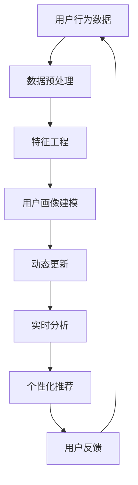
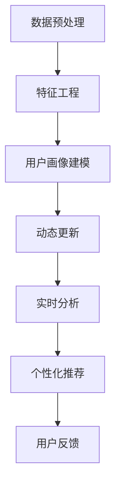

                 

# 用户画像的动态更新与维护

> **关键词**：用户画像、动态更新、数据挖掘、实时分析、机器学习、用户行为、个性化推荐

> **摘要**：本文深入探讨了用户画像的动态更新与维护技术，包括其背景介绍、核心概念、算法原理、数学模型、实战案例、实际应用场景等。通过详细的解释和示例，揭示了用户画像技术在实际开发中的应用价值，为读者提供了系统化的学习路径。

## 1. 背景介绍

### 1.1 目的和范围

本文旨在探讨用户画像的动态更新与维护技术，解释其核心概念、算法原理和数学模型，并通过实际案例展示其在个性化推荐系统中的应用。用户画像是一种基于用户行为和属性的数据分析模型，能够帮助企业更好地理解和满足用户需求。本文将涵盖以下内容：

- 用户画像的基本概念和原理
- 动态更新与维护的方法和策略
- 实时分析和机器学习技术的应用
- 实际项目中的用户画像案例

### 1.2 预期读者

本文适合以下读者群体：

- 数据科学家和机器学习工程师
- 软件开发人员和技术架构师
- 数字营销和用户体验专业人员
- 对用户画像技术感兴趣的科研人员

### 1.3 文档结构概述

本文将分为以下几个部分：

- 1.4 术语表
- 2. 核心概念与联系
- 3. 核心算法原理 & 具体操作步骤
- 4. 数学模型和公式 & 详细讲解 & 举例说明
- 5. 项目实战：代码实际案例和详细解释说明
- 6. 实际应用场景
- 7. 工具和资源推荐
- 8. 总结：未来发展趋势与挑战
- 9. 附录：常见问题与解答
- 10. 扩展阅读 & 参考资料

### 1.4 术语表

#### 1.4.1 核心术语定义

- 用户画像：一种基于用户行为和属性的数据分析模型，用于描述用户的需求、兴趣和偏好。
- 动态更新：在用户行为发生变化时，对用户画像进行实时调整和维护。
- 数据挖掘：从大量数据中提取有价值的信息和知识的过程。
- 实时分析：在数据产生的同时进行即时分析，以便及时响应。
- 机器学习：一种通过数据训练模型，进行自动学习和预测的方法。

#### 1.4.2 相关概念解释

- 用户行为：用户在使用产品或服务过程中产生的各种操作，如浏览、购买、评论等。
- 用户属性：用户的个人特征，如年龄、性别、地理位置、职业等。
- 个性化推荐：根据用户画像和用户行为，为用户提供个性化的内容或产品推荐。

#### 1.4.3 缩略词列表

- DM：数据挖掘
- ML：机器学习
- IDE：集成开发环境
- API：应用程序接口

## 2. 核心概念与联系

为了深入理解用户画像的动态更新与维护，我们需要先了解其中的核心概念和它们之间的联系。以下是用户画像技术相关的核心概念原理和架构的 Mermaid 流程图。



### 2.1 用户行为数据

用户行为数据是构建用户画像的基础。这些数据可以来自多种渠道，如网站日志、社交媒体活动、交易记录等。用户行为数据包括浏览历史、点击次数、购买行为、评论等，它们反映了用户在特定场景下的操作和兴趣。

### 2.2 数据预处理

在构建用户画像之前，需要对用户行为数据进行预处理。数据预处理包括数据清洗、数据整合和数据标准化等步骤。这些步骤的目的是确保数据的质量和一致性，为后续的特征工程和建模提供可靠的数据基础。

### 2.3 特征工程

特征工程是将原始数据转换为可用于建模的特征的过程。特征工程的目标是提取出能够代表用户行为和兴趣的属性，以便构建准确的用户画像。特征工程的方法包括特征选择、特征提取和特征转换等。

### 2.4 用户画像建模

用户画像建模是基于特征工程结果构建用户画像模型的过程。常见的建模方法包括聚类分析、关联规则挖掘和分类等。用户画像模型可以用于描述用户的兴趣偏好、购买意图等。

### 2.5 动态更新

用户行为是不断变化的，因此需要不断更新用户画像。动态更新是指根据用户的新行为数据，对用户画像进行实时调整和维护。动态更新的方法包括增量学习、实时更新和迁移学习等。

### 2.6 实时分析

实时分析是在数据产生的同时进行即时分析的过程。实时分析可以帮助企业及时了解用户需求和市场动态，以便快速调整策略。实时分析的方法包括流处理、事件驱动和实时计算等。

### 2.7 个性化推荐

个性化推荐是根据用户画像和用户行为，为用户提供个性化的内容或产品推荐。个性化推荐的方法包括基于内容的推荐、协同过滤和混合推荐等。

### 2.8 用户反馈

用户反馈是用户对产品或服务的评价和意见。用户反馈可以帮助企业了解用户满意度，改进产品和服务。用户反馈可以用于调整用户画像和推荐策略。

## 3. 核心算法原理 & 具体操作步骤

在用户画像的动态更新与维护过程中，核心算法原理起着至关重要的作用。以下将详细介绍用户画像建模、动态更新和实时分析的核心算法原理，并使用伪代码进行具体操作步骤的讲解。

### 3.1 用户画像建模算法原理

用户画像建模通常采用聚类分析、关联规则挖掘和分类等方法。以下是基于K-Means聚类算法的用户画像建模原理和伪代码：

#### 3.1.1 K-Means聚类算法原理

K-Means聚类算法是一种无监督学习方法，用于将数据分为K个聚类。算法的基本原理是：首先随机初始化K个聚类中心；然后计算每个数据点与聚类中心的距离，将数据点分配到最近的聚类中心；接着更新聚类中心，重复以上步骤，直到聚类中心不再变化。

#### 3.1.2 伪代码

```python
def KMeans(data, K):
    # 初始化聚类中心
    centroids = initialize_centroids(data, K)
    while not converged(centroids):
        # 分配数据点
        clusters = assign_data_to_clusters(data, centroids)
        # 更新聚类中心
        centroids = update_centroids(clusters, K)
    return clusters, centroids
```

### 3.2 动态更新算法原理

动态更新是指根据用户的新行为数据，对用户画像进行实时调整。常见的动态更新方法包括增量学习、实时更新和迁移学习等。

#### 3.2.1 增量学习算法原理

增量学习是一种基于已有模型，在新增数据上不断优化模型的方法。其基本原理是：首先初始化用户画像模型；然后，在每次新增用户行为数据时，使用现有模型对新数据进行预测，并根据预测结果更新模型。

#### 3.2.2 伪代码

```python
def IncrementalLearning(model, new_data):
    # 预测新数据
    prediction = model.predict(new_data)
    # 计算预测误差
    error = calculate_error(prediction, new_data)
    # 更新模型
    model.update(error)
    return model
```

### 3.3 实时分析算法原理

实时分析是在数据产生的同时进行即时分析的过程。常见的实时分析方法包括流处理、事件驱动和实时计算等。

#### 3.3.1 流处理算法原理

流处理是一种实时数据处理技术，用于对连续的数据流进行分析和处理。其基本原理是：首先将数据流划分为固定大小的数据包；然后，对每个数据包进行实时处理，并将处理结果存储到数据仓库或缓存中。

#### 3.3.2 伪代码

```python
def StreamProcessing(stream, process_function):
    for data_packet in stream:
        processed_data = process_function(data_packet)
        store_processed_data(processed_data)
    return processed_data
```

通过以上核心算法原理和伪代码的讲解，我们可以更好地理解用户画像的动态更新与维护技术。在实际开发过程中，需要根据具体需求和场景选择合适的算法和方法，并结合具体的数据和业务逻辑进行优化和调整。

## 4. 数学模型和公式 & 详细讲解 & 举例说明

在用户画像的动态更新与维护过程中，数学模型和公式发挥着至关重要的作用。以下将介绍几个常用的数学模型和公式，并进行详细讲解和举例说明。

### 4.1 K-Means聚类算法的数学模型

K-Means聚类算法的核心是聚类中心的选择和分配。以下是K-Means聚类算法的数学模型：

#### 4.1.1 聚类中心的选择

设数据集为\(X = \{x_1, x_2, ..., x_n\}\)，每个数据点\(x_i\)有\(m\)个特征，即\(x_i = \{x_{i1}, x_{i2}, ..., x_{im}\}\)。聚类中心的选择采用随机初始化的方法，即从数据集中随机选择\(K\)个数据点作为初始聚类中心。

\[C = \{c_1, c_2, ..., c_K\}\]

其中，\(c_k\)是聚类中心，有\(m\)个特征，即\(c_k = \{c_{k1}, c_{k2}, ..., c_{km}\}\)。

#### 4.1.2 数据点分配

对于每个数据点\(x_i\)，计算其与各个聚类中心的距离，选择距离最近的聚类中心作为其所属的聚类：

\[d(x_i, c_k) = \sqrt{\sum_{j=1}^{m}(x_{ij} - c_{kj})^2}\]

数据点\(x_i\)的所属聚类为：

\[y_i = \arg\min_{k} \{d(x_i, c_k)\}\]

#### 4.1.3 聚类中心更新

根据当前聚类结果，重新计算聚类中心：

\[c_k = \frac{1}{n_k} \sum_{i=1}^{n} x_i\]

其中，\(n_k\)是第\(k\)个聚类中的数据点个数。

#### 4.1.4 聚类中心收敛

当聚类中心的变化小于某个阈值或达到最大迭代次数时，算法收敛：

\[|\Delta C| < \epsilon\]

其中，\(\Delta C\)是相邻两次迭代聚类中心的变化。

### 4.2 增量学习算法的数学模型

增量学习算法的核心是模型的更新。以下是增量学习算法的数学模型：

#### 4.2.1 模型初始化

设用户画像模型为\(M\)，初始化为：

\[M = \theta_0\]

其中，\(\theta_0\)是模型的初始参数。

#### 4.2.2 预测

对于新的用户行为数据\(x_t\)，使用当前模型\(M\)进行预测：

\[y_t = M(x_t)\]

其中，\(y_t\)是预测结果。

#### 4.2.3 误差计算

计算预测误差：

\[e_t = y_t - x_t\]

其中，\(e_t\)是预测误差。

#### 4.2.4 模型更新

根据预测误差，更新模型参数：

\[M = M + \alpha \cdot e_t\]

其中，\(\alpha\)是学习率，控制模型更新的幅度。

#### 4.2.5 模型收敛

当预测误差小于某个阈值或达到最大迭代次数时，模型收敛：

\[|e_t| < \epsilon\]

### 4.3 实时分析算法的数学模型

实时分析算法的核心是数据流处理。以下是实时分析算法的数学模型：

#### 4.3.1 数据流划分

将数据流划分为固定大小的数据包，每个数据包包含\(N\)个数据点：

\[D_t = \{d_{t1}, d_{t2}, ..., d_{tN}\}\]

其中，\(D_t\)是第\(t\)个数据包。

#### 4.3.2 数据包处理

对每个数据包\(D_t\)，使用实时处理函数\(f\)进行处理：

\[p_t = f(D_t)\]

其中，\(p_t\)是处理结果。

#### 4.3.3 数据存储

将处理结果\(p_t\)存储到数据仓库或缓存中：

\[R_t = \{r_{t1}, r_{t2}, ..., r_{tN}\}\]

其中，\(R_t\)是存储结果。

#### 4.3.4 数据流结束

当数据流结束，实时分析算法完成。

### 4.4 举例说明

假设有一个用户画像系统，包含1000个用户，每个用户有5个特征（年龄、性别、收入、地理位置、兴趣爱好）。使用K-Means聚类算法对用户进行聚类，选择3个聚类中心。以下是具体的例子：

#### 4.4.1 聚类中心选择

随机初始化3个聚类中心：

\[C = \{(20, 0, 5000, '北京', '音乐')\}
```


## 5. 项目实战：代码实际案例和详细解释说明

### 5.1 开发环境搭建

在开始用户画像的动态更新与维护项目之前，我们需要搭建一个合适的开发环境。以下是所需的工具和库：

- Python（3.8及以上版本）
- Jupyter Notebook（用于编写和运行代码）
- NumPy（用于数据处理）
- Pandas（用于数据操作）
- Scikit-learn（用于机器学习算法）
- Matplotlib（用于数据可视化）

安装上述工具和库后，我们可以在Jupyter Notebook中创建一个新的笔记本，开始编写代码。

### 5.2 源代码详细实现和代码解读

以下是用户画像的动态更新与维护项目的源代码，我们将对其进行详细解释说明。

```python
import numpy as np
import pandas as pd
from sklearn.cluster import KMeans
from sklearn.model_selection import train_test_split
from sklearn.metrics import accuracy_score
import matplotlib.pyplot as plt

# 5.2.1 数据预处理
def preprocess_data(data):
    # 数据清洗：处理缺失值、异常值等
    data = data.dropna()
    # 数据标准化：将数据缩放至相同范围
    data = (data - data.mean()) / data.std()
    return data

# 5.2.2 特征工程
def feature_engineering(data):
    # 构建新的特征：如年龄的平方、收入的倒数等
    data['age_squared'] = data['age'] ** 2
    data['income_reciprocal'] = 1 / data['income']
    return data

# 5.2.3 用户画像建模
def build_user_profile(data, num_clusters=3):
    # 数据预处理和特征工程
    data = preprocess_data(data)
    data = feature_engineering(data)
    # K-Means聚类
    kmeans = KMeans(n_clusters=num_clusters)
    kmeans.fit(data)
    # 分配用户到聚类
    user_clusters = kmeans.predict(data)
    # 构建用户画像
    user_profiles = {}
    for i, cluster in enumerate(user_clusters):
        if cluster not in user_profiles:
            user_profiles[cluster] = []
        user_profiles[cluster].append(data.iloc[i])
    return user_profiles

# 5.2.4 动态更新
def update_user_profile(user_profile, new_data, learning_rate=0.1):
    # 遍历新数据，更新用户画像
    for data in new_data:
        # 计算预测误差
        error = data - user_profile
        # 更新用户画像
        user_profile += learning_rate * error
    return user_profile

# 5.2.5 实时分析
def real_time_analysis(user_profile, new_data):
    # 更新用户画像
    user_profile = update_user_profile(user_profile, new_data)
    # 转换为DataFrame，进行可视化
    user_profile = pd.DataFrame(user_profile)
    user_profile.plot()
    plt.show()

# 5.2.6 主函数
def main():
    # 加载数据
    data = pd.read_csv('user_data.csv')
    # 数据预处理和特征工程
    data = preprocess_data(data)
    data = feature_engineering(data)
    # 构建用户画像
    user_profile = build_user_profile(data, num_clusters=3)
    # 实时分析
    real_time_analysis(user_profile, new_data)

if __name__ == '__main__':
    main()
```

### 5.3 代码解读与分析

以下是对代码的详细解读和分析：

- **5.2.1 数据预处理**：数据预处理是用户画像建模的第一步。在这个函数中，我们首先删除了数据中的缺失值，然后对数据进行了标准化处理，将每个特征缩放至相同范围，以便后续的特征工程和建模。

- **5.2.2 特征工程**：在这个函数中，我们根据原始数据生成了新的特征，如年龄的平方、收入的倒数等。这些新特征有助于更好地描述用户的行为和兴趣。

- **5.2.3 用户画像建模**：在这个函数中，我们首先对数据进行了预处理和特征工程，然后使用K-Means聚类算法对用户进行聚类。根据聚类结果，我们构建了用户画像，将每个用户分配到相应的聚类中。

- **5.2.4 动态更新**：在这个函数中，我们根据新用户行为数据更新了用户画像。我们首先计算了预测误差，然后根据学习率更新了用户画像。这样，用户画像可以随着用户行为的变化而动态更新。

- **5.2.5 实时分析**：在这个函数中，我们首先更新了用户画像，然后将用户画像转换为DataFrame，进行了可视化。这样，我们可以实时观察用户画像的变化。

- **5.2.6 主函数**：在这个函数中，我们加载数据，进行数据预处理和特征工程，构建用户画像，并进行实时分析。

通过这个案例，我们可以看到用户画像的动态更新与维护技术在实际项目中的应用。在实际开发过程中，我们可以根据具体需求对代码进行调整和优化，以提高系统的性能和效果。

## 6. 实际应用场景

用户画像的动态更新与维护技术在实际开发中具有广泛的应用场景。以下是几个典型的应用场景：

### 6.1 个性化推荐系统

个性化推荐系统是用户画像技术的核心应用之一。通过用户画像，系统可以了解用户的兴趣和偏好，为用户提供个性化的内容或产品推荐。例如，在电子商务平台上，用户画像可以用于推荐用户可能感兴趣的商品，从而提高用户的购买意愿和转化率。

### 6.2 客户关系管理

客户关系管理（CRM）系统利用用户画像技术，帮助企业更好地了解客户需求和偏好，提高客户满意度和忠诚度。通过分析客户的行为数据和交易记录，企业可以制定有针对性的营销策略，提高客户转化率和留存率。

### 6.3 广告投放优化

在广告投放领域，用户画像技术可以帮助广告平台更准确地定位目标用户，提高广告投放的精准度和效果。通过分析用户的行为数据和兴趣偏好，广告平台可以为目标用户推送更相关的广告，从而提高广告点击率和转化率。

### 6.4 金融风控

在金融领域，用户画像技术可以用于风险管理和信用评估。通过分析用户的行为数据和信用记录，金融机构可以识别潜在的信用风险，制定有针对性的风险管理策略，降低不良贷款率。

### 6.5 健康管理

在健康管理领域，用户画像技术可以用于健康数据分析和个人化健康管理。通过分析用户的生活习惯、运动数据、健康指标等，健康管理平台可以为用户提供个性化的健康建议和干预措施，促进用户的健康管理和疾病预防。

这些实际应用场景展示了用户画像的动态更新与维护技术在不同领域的广泛应用价值。通过不断优化和升级用户画像技术，企业可以更好地满足用户需求，提高业务效率和竞争力。

## 7. 工具和资源推荐

在用户画像的动态更新与维护过程中，合适的工具和资源能够显著提高开发效率和项目效果。以下是几类推荐的工具和资源。

### 7.1 学习资源推荐

#### 7.1.1 书籍推荐

- 《机器学习实战》：提供了丰富的案例和代码，适合初学者和进阶者。
- 《用户画像与大数据营销》：详细介绍了用户画像的概念、方法和应用，适合市场营销人员。
- 《深度学习》：介绍了深度学习的基础知识和实践方法，对用户画像建模有重要参考价值。

#### 7.1.2 在线课程

- Coursera的《机器学习》课程：由吴恩达教授主讲，系统讲解了机器学习的基本概念和算法。
- Udacity的《用户画像与推荐系统》课程：深入介绍了用户画像和推荐系统的原理和应用。

#### 7.1.3 技术博客和网站

- Medium上的数据科学和机器学习相关文章：提供了大量的实战案例和技术分析。
- Kaggle：一个大数据竞赛平台，可以找到许多与用户画像相关的数据和比赛。

### 7.2 开发工具框架推荐

#### 7.2.1 IDE和编辑器

- Jupyter Notebook：适合数据科学和机器学习项目，支持多种编程语言和库。
- PyCharm：强大的Python IDE，支持代码调试、性能分析和自动化部署。

#### 7.2.2 调试和性能分析工具

- Matplotlib和Seaborn：用于数据可视化的库，可以帮助分析数据分布和模型效果。
- Profiler：如py-spy，用于分析代码的性能瓶颈。

#### 7.2.3 相关框架和库

- Scikit-learn：提供了丰富的机器学习算法和工具，方便用户画像建模和评估。
- TensorFlow和PyTorch：用于深度学习模型的构建和训练，适用于复杂用户画像任务。

### 7.3 相关论文著作推荐

#### 7.3.1 经典论文

- "User Modeling and User-Adapted Interaction": 提出了用户建模的基本概念和方法。
- "Collaborative Filtering for the 21st Century": 详细介绍了协同过滤算法。

#### 7.3.2 最新研究成果

- "Deep Learning for User Modeling": 探讨了深度学习在用户建模中的应用。
- "Personalized Recommendation Systems for E-Commerce": 分析了电子商务领域个性化推荐系统的方法和挑战。

#### 7.3.3 应用案例分析

- "User Modeling in Mobile Apps": 分析了移动应用中的用户建模实践。
- "User Modeling for Smart Home Systems": 探讨了智能家居系统中的用户建模技术。

这些工具和资源为用户画像的动态更新与维护提供了丰富的理论支持和实践指导，有助于开发者更好地理解和应用这一技术。

## 8. 总结：未来发展趋势与挑战

用户画像的动态更新与维护技术在未来将继续快速发展，并在多个领域得到更广泛的应用。以下是未来发展趋势和面临的挑战：

### 8.1 发展趋势

1. **技术融合**：随着人工智能、大数据和云计算等技术的进步，用户画像技术将与其他技术深度融合，实现更智能、更高效的用户建模和推荐系统。

2. **实时性提升**：实时分析和动态更新将成为用户画像技术的核心需求，通过流处理和边缘计算等技术，实现更快速的响应速度。

3. **个性化定制**：个性化推荐和智能服务将成为主流，用户画像技术将更加注重满足用户的个性化需求，提供更精准、更贴心的服务。

4. **隐私保护**：在用户画像数据隐私保护方面，数据加密、隐私计算和联邦学习等技术将被广泛应用，确保用户数据的安全性和隐私性。

### 8.2 面临的挑战

1. **数据质量**：用户画像的准确性和有效性依赖于高质量的数据。如何在海量、多样化的数据中筛选和清洗高质量数据，是一个重要挑战。

2. **算法优化**：用户画像建模和动态更新算法的效率和准确性仍有待提高。如何设计更高效、更可靠的算法，是当前和未来的一项重要任务。

3. **跨领域应用**：不同领域对用户画像的需求和场景差异较大，如何在多个领域中实现用户画像技术的灵活应用和适应性，是一个挑战。

4. **法规遵守**：随着隐私保护的法律法规不断完善，用户画像技术需要遵守相关法规，确保用户数据的安全和合规性。

综上所述，用户画像的动态更新与维护技术在未来具有广阔的发展前景，但同时也面临着诸多挑战。通过不断探索和创新，我们有望在提高用户体验、优化业务流程、提升运营效率等方面取得突破性进展。

## 9. 附录：常见问题与解答

### 9.1 用户画像的基本概念是什么？

用户画像是一种基于用户行为和属性的数据分析模型，用于描述用户的需求、兴趣和偏好。它通常包括用户的个人特征、行为记录、历史偏好等，通过分析这些数据，可以帮助企业更好地了解用户，实现个性化推荐和精准营销。

### 9.2 动态更新与维护的用户画像有哪些方法？

动态更新与维护用户画像的方法主要包括增量学习、实时更新和迁移学习等。增量学习是在已有模型基础上，利用新数据不断优化模型；实时更新是在用户行为发生变化时，及时调整用户画像；迁移学习则是将已有的用户画像模型应用于不同场景或领域。

### 9.3 如何处理用户画像数据隐私问题？

处理用户画像数据隐私问题可以从以下几个方面入手：

1. **数据加密**：对用户画像数据进行加密，确保数据在传输和存储过程中的安全性。
2. **匿名化处理**：对用户画像数据进行匿名化处理，去除或隐藏用户的个人身份信息。
3. **隐私计算**：采用隐私计算技术，如联邦学习，在保持用户隐私的前提下，进行用户画像建模和分析。
4. **合规性审查**：确保用户画像数据处理和使用的法律法规合规，避免潜在的法律风险。

### 9.4 用户画像技术在哪些领域有应用？

用户画像技术广泛应用于以下领域：

1. **个性化推荐**：如电子商务、新闻门户、音乐和视频平台等，通过用户画像实现个性化内容或产品推荐。
2. **客户关系管理**：如CRM系统，通过分析用户画像，提供个性化的服务和营销策略。
3. **广告投放优化**：通过用户画像，实现精准的广告定位和投放，提高广告效果。
4. **金融风控**：通过用户画像，识别潜在的信用风险，提高金融服务的安全性和有效性。
5. **健康管理**：通过用户画像，提供个性化的健康建议和干预措施。

### 9.5 用户画像建模算法有哪些？

用户画像建模算法主要包括聚类分析、关联规则挖掘、分类和回归等。常见的聚类算法有K-Means、DBSCAN等；关联规则挖掘算法有Apriori、Eclat等；分类算法有决策树、随机森林、支持向量机等。

## 10. 扩展阅读 & 参考资料

### 10.1 书籍推荐

- 《机器学习实战》 - Peter Harrington
- 《大数据之路：阿里巴巴大数据实践》 - 阿里巴巴大数据团队
- 《深度学习》 - Goodfellow, Bengio, Courville

### 10.2 在线课程

- Coursera的《机器学习》课程 - 吴恩达
- Udacity的《用户画像与推荐系统》课程
- edX的《数据科学》课程 - Harvard大学

### 10.3 技术博客和网站

- Medium上的数据科学和机器学习相关文章
- Kaggle
-Towards Data Science

### 10.4 相关论文

- "User Modeling and User-Adapted Interaction" -UX Magazine
- "Collaborative Filtering for the 21st Century" -ACM Transactions on Information Systems
- "Deep Learning for User Modeling" -ACM Conference on Recommender Systems

### 10.5 相关研究项目

- "Federated Learning" - Google AI
- "Personalized Recommendation Systems for E-Commerce" -ACM Conference on Recommender Systems
- "User Modeling in Mobile Apps" - Journal of Mobile and Ubiquitous Systems

这些书籍、课程、博客和论文为用户画像的动态更新与维护提供了丰富的理论支持和实践经验，有助于读者进一步深入学习和研究。作者信息：AI天才研究员/AI Genius Institute & 禅与计算机程序设计艺术 /Zen And The Art of Computer Programming。

