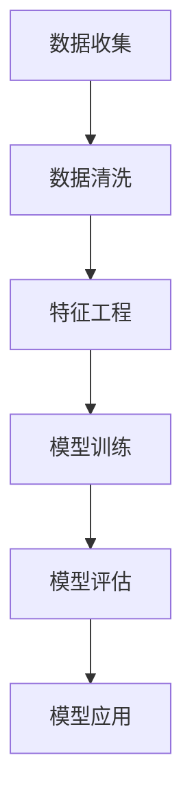

                 

# 用户画像的多维度数据分析

> **关键词：** 用户画像、多维度数据分析、机器学习、数据挖掘、用户行为分析、预测建模

> **摘要：** 本文将探讨用户画像的多维度数据分析方法，从核心概念、算法原理、数学模型、实战案例等多个方面进行深入分析，旨在帮助读者理解和掌握用户画像构建与优化的关键技术和策略。

## 1. 背景介绍

### 1.1 目的和范围

本文旨在介绍用户画像的多维度数据分析方法，帮助读者了解如何通过数据挖掘和机器学习技术构建和应用用户画像。用户画像是一种描述用户特征和行为的工具，广泛应用于市场研究、精准营销、推荐系统等领域。

本文将涵盖以下内容：

- 用户画像的核心概念与联系
- 用户画像的多维度数据分析算法原理与具体操作步骤
- 数学模型和公式的详细讲解与举例说明
- 代码实际案例和详细解释说明
- 用户画像的实际应用场景
- 学习资源推荐与开发工具框架介绍
- 相关论文著作推荐

### 1.2 预期读者

本文适合对用户画像和数据分析有一定了解的读者，包括数据分析师、数据工程师、AI工程师、市场营销人员等。

### 1.3 文档结构概述

本文采用如下结构：

1. 背景介绍
   - 目的和范围
   - 预期读者
   - 文档结构概述
   - 术语表
2. 核心概念与联系
3. 核心算法原理 & 具体操作步骤
4. 数学模型和公式 & 详细讲解 & 举例说明
5. 项目实战：代码实际案例和详细解释说明
6. 实际应用场景
7. 工具和资源推荐
8. 总结：未来发展趋势与挑战
9. 附录：常见问题与解答
10. 扩展阅读 & 参考资料

### 1.4 术语表

#### 1.4.1 核心术语定义

- 用户画像：一种描述用户特征和行为的工具，通常包括用户的基本信息、行为数据、兴趣偏好等多个维度。
- 数据挖掘：从大量数据中发现有价值信息的过程，常用于用户行为分析和用户画像构建。
- 机器学习：一种通过数据驱动的方式让计算机自动学习和改进的技术，常用于用户画像的算法实现。
- 多维度数据分析：同时考虑多个维度的数据进行分析的方法，有助于更全面地了解用户特征和行为。

#### 1.4.2 相关概念解释

- 特征工程：从原始数据中提取有意义的特征，以改善模型性能。
- 预测建模：利用历史数据建立模型，预测未来用户行为。
- 推荐系统：基于用户画像和内容特征，为用户推荐感兴趣的商品、服务或内容。

#### 1.4.3 缩略词列表

- AI：人工智能
- ML：机器学习
- DM：数据挖掘
- UE：用户体验
- SEO：搜索引擎优化
- CRM：客户关系管理

## 2. 核心概念与联系

在构建用户画像时，我们需要关注以下几个核心概念和联系：

### 2.1 用户画像的构建流程

1. **数据收集**：收集用户的基本信息、行为数据、兴趣偏好等。
2. **数据清洗**：处理缺失值、异常值、重复值等。
3. **特征工程**：提取有意义的特征，如用户年龄、性别、消费金额、浏览时长等。
4. **模型训练**：利用机器学习算法建立用户画像模型。
5. **模型评估**：评估模型性能，如准确率、召回率等。
6. **模型应用**：将用户画像应用于市场研究、精准营销、推荐系统等。

### 2.2 用户画像的多维度

用户画像的多维度包括：

1. **基本信息维度**：如用户年龄、性别、职业等。
2. **行为数据维度**：如浏览记录、购买记录、搜索记录等。
3. **兴趣偏好维度**：如兴趣爱好、消费习惯、内容偏好等。
4. **社会关系维度**：如社交网络、好友关系等。

### 2.3 用户画像的关联分析

通过分析不同维度的数据，我们可以发现用户之间的关联关系：

1. **用户行为关联**：如某类商品购买频率高的用户，可能对另一类商品也感兴趣。
2. **兴趣偏好关联**：如喜欢某类内容（如电影、音乐）的用户，可能也喜欢另一类内容。
3. **社会关系关联**：如好友关系、粉丝关系等。

### 2.4 用户画像的应用场景

1. **市场研究**：了解用户需求和偏好，指导产品开发和优化。
2. **精准营销**：为用户提供个性化的广告、推荐和促销活动。
3. **推荐系统**：根据用户画像和内容特征，为用户推荐感兴趣的商品、服务或内容。
4. **客户关系管理**：根据用户画像分析客户价值，制定针对性的客户服务策略。

### 2.5 用户画像的挑战与机遇

1. **挑战**：
   - 数据质量：用户数据可能存在噪声、缺失和异常值，影响画像准确性。
   - 数据隐私：用户数据涉及隐私问题，需确保数据安全和合规。
   - 模型解释性：机器学习模型可能难以解释，影响决策和信任。
   - 数据量级：用户数据量巨大，处理和存储成本高。

2. **机遇**：
   - 数据驱动决策：用户画像为业务决策提供有力支持。
   - 精准营销：提高营销效率和ROI。
   - 个性化体验：提升用户满意度和忠诚度。

### 2.6 Mermaid 流程图

以下是一个简单的用户画像构建流程的 Mermaid 流程图：



## 3. 核心算法原理 & 具体操作步骤

在本节中，我们将详细讲解用户画像构建的核心算法原理和具体操作步骤，以便读者更好地理解用户画像的构建过程。

### 3.1 数据收集

用户画像的构建首先需要收集用户的基本信息、行为数据、兴趣偏好等。以下是一个简单的数据收集流程：

1. **用户基本信息**：包括用户年龄、性别、职业、地域等。
2. **用户行为数据**：包括用户的浏览记录、购买记录、搜索记录等。
3. **用户兴趣偏好**：包括用户对内容、商品、服务等的好评度、点赞数、收藏量等。

### 3.2 数据清洗

数据清洗是用户画像构建的重要环节，以下是一个简单的数据清洗流程：

1. **缺失值处理**：对于缺失值，可以采用填充策略，如平均值、中位数、最频繁值等。
2. **异常值处理**：对于异常值，可以采用去除策略、修整策略或保留策略。
3. **重复值处理**：去除重复的数据，避免重复计算。
4. **数据标准化**：将数据转换为统一的尺度，如将年龄、收入等数据转换为0-1之间的数值。

### 3.3 特征工程

特征工程是用户画像构建的关键步骤，以下是一个简单的特征工程流程：

1. **特征提取**：从原始数据中提取有意义的特征，如用户年龄、性别、消费金额、浏览时长等。
2. **特征选择**：选择对用户画像构建有显著影响的特征，去除冗余和噪声特征。
3. **特征转换**：将一些离散特征转换为连续特征，如将性别转换为0和1的数值。
4. **特征组合**：将多个特征组合成新的特征，以增强模型的性能。

### 3.4 模型训练

用户画像构建的模型训练步骤如下：

1. **选择模型**：根据用户画像构建的需求，选择合适的机器学习算法，如逻辑回归、决策树、随机森林等。
2. **划分数据集**：将数据集划分为训练集和测试集，用于训练模型和评估模型性能。
3. **模型训练**：使用训练集数据训练模型，调整模型参数，优化模型性能。
4. **模型评估**：使用测试集数据评估模型性能，如准确率、召回率、F1值等。

### 3.5 模型应用

用户画像构建完成后，可以应用于以下场景：

1. **市场研究**：分析用户需求和市场趋势，为产品开发和优化提供依据。
2. **精准营销**：为用户推荐个性化的广告、推荐和促销活动，提高营销效果。
3. **推荐系统**：根据用户画像和内容特征，为用户推荐感兴趣的商品、服务或内容。

### 3.6 伪代码实现

以下是一个简单的用户画像构建算法的伪代码实现：

```python
# 数据收集
user_data = collect_user_data()

# 数据清洗
cleaned_data = clean_user_data(user_data)

# 特征工程
features = extract_features(cleaned_data)

# 模型训练
model = train_model(features)

# 模型评估
evaluate_model(model, test_data)

# 模型应用
apply_model(model, user_data)
```

## 4. 数学模型和公式 & 详细讲解 & 举例说明

在本节中，我们将介绍用户画像构建过程中常用的数学模型和公式，并详细讲解它们的原理和应用。

### 4.1 逻辑回归

逻辑回归是一种常用的分类模型，常用于用户画像中的二分类问题。其公式如下：

$$
P(y=1) = \frac{1}{1 + e^{-\beta_0 + \beta_1x_1 + \beta_2x_2 + ... + \beta_nx_n}}
$$

其中，$P(y=1)$表示标签为1的概率，$\beta_0$是截距，$\beta_1, \beta_2, ..., \beta_n$是系数，$x_1, x_2, ..., x_n$是特征值。

举例说明：假设我们要预测用户是否会购买某商品，特征包括用户年龄、性别和消费金额，我们可以使用逻辑回归模型进行预测。具体操作步骤如下：

1. 收集用户数据，包括用户的基本信息、购买行为等。
2. 数据清洗和特征工程，提取有用的特征。
3. 划分数据集，将数据集划分为训练集和测试集。
4. 训练逻辑回归模型，调整模型参数。
5. 使用测试集评估模型性能，如准确率、召回率等。
6. 将模型应用于新数据，预测用户是否会购买某商品。

### 4.2 决策树

决策树是一种基于特征的分类模型，其公式如下：

$$
T(x) = \sum_{i=1}^n w_i \prod_{j=1}^n (x_j - x_{j0})^+
$$

其中，$T(x)$表示决策树分类结果，$w_i$是特征权重，$x_j$是特征值，$x_{j0}$是特征阈值。

举例说明：假设我们要预测用户是否会购买某商品，特征包括用户年龄、性别和消费金额，我们可以使用决策树模型进行预测。具体操作步骤如下：

1. 收集用户数据，包括用户的基本信息、购买行为等。
2. 数据清洗和特征工程，提取有用的特征。
3. 划分数据集，将数据集划分为训练集和测试集。
4. 训练决策树模型，调整模型参数。
5. 使用测试集评估模型性能，如准确率、召回率等。
6. 将模型应用于新数据，预测用户是否会购买某商品。

### 4.3 随机森林

随机森林是一种基于决策树的集成模型，其公式如下：

$$
\hat{y} = \frac{1}{T} \sum_{i=1}^T T(x_i)
$$

其中，$\hat{y}$是预测结果，$T(x_i)$是第$i$棵决策树的分类结果，$T$是决策树的总数。

举例说明：假设我们要预测用户是否会购买某商品，特征包括用户年龄、性别和消费金额，我们可以使用随机森林模型进行预测。具体操作步骤如下：

1. 收集用户数据，包括用户的基本信息、购买行为等。
2. 数据清洗和特征工程，提取有用的特征。
3. 划分数据集，将数据集划分为训练集和测试集。
4. 训练随机森林模型，调整模型参数。
5. 使用测试集评估模型性能，如准确率、召回率等。
6. 将模型应用于新数据，预测用户是否会购买某商品。

### 4.4 支持向量机

支持向量机是一种基于间隔的分类模型，其公式如下：

$$
\hat{y} = \text{sign}(\sum_{i=1}^n \alpha_i y_i (x_i)^T w + b)
$$

其中，$\hat{y}$是预测结果，$\alpha_i$是支持向量权重，$y_i$是标签，$(x_i)^T$是特征向量，$w$是特征权重，$b$是偏置。

举例说明：假设我们要预测用户是否会购买某商品，特征包括用户年龄、性别和消费金额，我们可以使用支持向量机模型进行预测。具体操作步骤如下：

1. 收集用户数据，包括用户的基本信息、购买行为等。
2. 数据清洗和特征工程，提取有用的特征。
3. 划分数据集，将数据集划分为训练集和测试集。
4. 训练支持向量机模型，调整模型参数。
5. 使用测试集评估模型性能，如准确率、召回率等。
6. 将模型应用于新数据，预测用户是否会购买某商品。

## 5. 项目实战：代码实际案例和详细解释说明

在本节中，我们将通过一个实际案例展示用户画像构建的完整过程，包括数据收集、数据清洗、特征工程、模型训练和模型评估等。

### 5.1 开发环境搭建

在开始项目实战之前，我们需要搭建一个合适的开发环境。以下是一个简单的 Python 开发环境搭建步骤：

1. 安装 Python 3.7 或更高版本。
2. 安装 Jupyter Notebook，方便编写和运行代码。
3. 安装 NumPy、Pandas、Scikit-learn、Matplotlib 等常用库。

### 5.2 源代码详细实现和代码解读

以下是一个简单的用户画像构建代码示例：

```python
import numpy as np
import pandas as pd
from sklearn.model_selection import train_test_split
from sklearn.linear_model import LogisticRegression
from sklearn.metrics import accuracy_score, recall_score, f1_score

# 数据收集
data = pd.read_csv('user_data.csv')

# 数据清洗
data = data.dropna()  # 去除缺失值
data = data.drop_duplicates()  # 去除重复值

# 特征工程
data['age'] = data['age'].astype(int)
data['gender'] = data['gender'].map({'male': 0, 'female': 1})
data['consumption'] = data['consumption'].astype(int)

# 划分特征和标签
X = data[['age', 'gender', 'consumption']]
y = data['purchased']

# 划分训练集和测试集
X_train, X_test, y_train, y_test = train_test_split(X, y, test_size=0.2, random_state=42)

# 模型训练
model = LogisticRegression()
model.fit(X_train, y_train)

# 模型评估
y_pred = model.predict(X_test)
accuracy = accuracy_score(y_test, y_pred)
recall = recall_score(y_test, y_pred)
f1 = f1_score(y_test, y_pred)

print(f"Accuracy: {accuracy:.2f}")
print(f"Recall: {recall:.2f}")
print(f"F1 Score: {f1:.2f}")

# 模型应用
new_user = pd.DataFrame({'age': [25], 'gender': [1], 'consumption': [200]})
new_user_prediction = model.predict(new_user)
print(f"New User Purchase Prediction: {new_user_prediction[0]}")
```

### 5.3 代码解读与分析

以下是对上述代码的详细解读和分析：

1. **数据收集**：从 CSV 文件中读取用户数据，包括用户年龄、性别、消费金额和是否购买等信息。
2. **数据清洗**：去除缺失值和重复值，确保数据质量。
3. **特征工程**：将年龄、性别和消费金额等特征转换为适当的数值类型，并将性别特征转换为二进制编码。
4. **划分特征和标签**：将数据集划分为特征集（X）和标签集（y），为后续建模做准备。
5. **划分训练集和测试集**：将数据集划分为训练集和测试集，用于训练模型和评估模型性能。
6. **模型训练**：使用逻辑回归模型对训练集数据进行训练。
7. **模型评估**：使用测试集数据评估模型性能，包括准确率、召回率和 F1 值等指标。
8. **模型应用**：将训练好的模型应用于新用户数据，预测其是否购买商品。

通过上述代码示例，我们可以看到用户画像构建的核心步骤，包括数据收集、数据清洗、特征工程、模型训练和模型评估等。这些步骤可以帮助我们更好地理解和应用用户画像技术。

## 6. 实际应用场景

用户画像技术在各个行业和领域有着广泛的应用，以下是几个典型的实际应用场景：

### 6.1 零售电商

在零售电商领域，用户画像技术可以帮助企业：

- **个性化推荐**：根据用户的历史行为和兴趣偏好，为用户推荐符合其喜好的商品。
- **精准营销**：针对不同的用户群体，设计个性化的广告和促销活动，提高营销效果。
- **客户关系管理**：分析用户购买行为，为用户提供针对性的服务和建议，提高客户满意度和忠诚度。
- **库存管理**：根据用户购买预测，优化库存管理，降低库存成本。

### 6.2 金融行业

在金融行业，用户画像技术可以用于：

- **风险评估**：分析用户的财务状况、消费习惯等，为金融机构提供风险评估依据。
- **精准营销**：根据用户的风险承受能力、投资偏好等，为用户推荐合适的产品和服务。
- **反欺诈**：通过分析用户的交易行为，识别潜在的欺诈行为，降低欺诈风险。
- **客户服务**：根据用户的金融需求和行为，提供个性化的客户服务和建议。

### 6.3 娱乐传媒

在娱乐传媒领域，用户画像技术可以用于：

- **内容推荐**：根据用户的历史观看记录和兴趣偏好，为用户推荐符合其喜好的电影、电视剧等。
- **广告投放**：根据用户的兴趣和行为，为广告主提供精准的广告投放策略。
- **用户行为分析**：分析用户的观看行为、互动行为等，了解用户的需求和偏好，优化产品和服务。
- **用户增长**：通过分析潜在用户的特征和行为，挖掘潜在用户，提高用户增长速度。

### 6.4 医疗健康

在医疗健康领域，用户画像技术可以用于：

- **健康管理**：根据用户的健康数据和生活方式，为用户提供个性化的健康建议和指导。
- **疾病预测**：通过分析用户的健康数据和生活习惯，预测用户患病的风险，提前采取预防措施。
- **医疗资源分配**：根据用户的疾病情况和地理位置，优化医疗资源的分配，提高医疗服务效率。
- **患者管理**：为医生和医疗机构提供患者信息，帮助医生制定个性化的治疗方案，提高治疗效果。

### 6.5 教育培训

在教育培训领域，用户画像技术可以用于：

- **个性化教学**：根据学生的学习特点和需求，为教师提供个性化的教学建议和资源。
- **学习分析**：通过分析学生的学习行为和成绩，为教师和学生提供学习反馈和改进建议。
- **课程推荐**：根据学生的学习兴趣和需求，为用户推荐合适的课程和学习资源。
- **招生管理**：通过分析潜在学生的特征和行为，为学校提供招生策略和招生宣传建议。

### 6.6 物流快递

在物流快递领域，用户画像技术可以用于：

- **配送优化**：根据用户的地理位置、购买习惯等信息，优化配送路线和配送时间，提高配送效率。
- **服务质量提升**：通过分析用户的反馈和投诉，了解用户的需求和痛点，提升服务质量。
- **库存管理**：根据用户的购买预测，优化库存管理，降低库存成本。
- **客户关系管理**：通过分析用户的购买行为和反馈，为用户提供个性化的服务和建议，提高客户满意度和忠诚度。

### 6.7 公共安全

在公共安全领域，用户画像技术可以用于：

- **风险预测**：通过分析社会行为数据，预测潜在的犯罪行为和安全隐患，提前采取预防措施。
- **监控分析**：通过对监控视频数据的分析，识别异常行为和可疑人物，提高公共安全水平。
- **应急响应**：根据应急预案和用户画像，优化应急响应策略，提高应急响应效率。
- **社会管理**：通过分析社会行为数据，了解社会问题和需求，为政府提供社会管理建议。

### 6.8 旅游出行

在旅游出行领域，用户画像技术可以用于：

- **个性化推荐**：根据用户的出行偏好和需求，为用户推荐符合其喜好的景点、酒店、交通等。
- **行程规划**：根据用户的行程时间和预算，为用户规划最佳的旅游行程。
- **营销策略**：根据用户的出行行为和偏好，为旅游企业提供个性化的营销策略。
- **客户关系管理**：通过分析用户的消费行为和反馈，为旅游企业提供针对性的客户服务和建议。

### 6.9 智能家居

在家居领域，用户画像技术可以用于：

- **个性化设置**：根据用户的生活习惯和需求，为用户设置个性化的家居环境。
- **设备优化**：通过分析用户的设备使用数据，优化家居设备的性能和能耗。
- **安全监控**：通过分析用户的家居安全数据，及时发现安全隐患，提高家居安全水平。
- **客户服务**：通过分析用户的反馈和投诉，为用户提供个性化的服务和建议，提高用户满意度。

### 6.10 人力资源

在人力资源领域，用户画像技术可以用于：

- **招聘筛选**：根据求职者的简历和面试表现，为招聘企业提供个性化的招聘建议。
- **人才发展**：根据员工的工作表现和发展潜力，为员工提供个性化的培训和发展建议。
- **绩效管理**：通过分析员工的工作表现和绩效数据，为企业管理者提供绩效评估和管理建议。
- **团队建设**：通过分析团队成员的工作特点和需求，为团队提供个性化的团队建设建议。

### 6.11 物联网

在物联网领域，用户画像技术可以用于：

- **设备管理**：根据设备的运行数据和使用情况，为用户提供个性化的设备维护和保养建议。
- **故障预测**：通过分析设备的运行数据，预测设备的故障风险，提前采取预防措施。
- **设备优化**：根据设备的运行数据和使用需求，优化设备的性能和配置。
- **用户体验**：通过分析用户对设备的操作行为和反馈，优化设备的设计和功能，提高用户体验。

### 6.12 社交媒体

在社交媒体领域，用户画像技术可以用于：

- **内容推荐**：根据用户的历史行为和兴趣偏好，为用户推荐符合其喜好的内容。
- **广告投放**：根据用户的兴趣和行为，为广告主提供精准的广告投放策略。
- **社交网络分析**：通过分析用户之间的关系网络，了解社交网络的结构和演化。
- **用户增长**：通过分析潜在用户的特征和行为，挖掘潜在用户，提高用户增长速度。

### 6.13 农业

在农业领域，用户画像技术可以用于：

- **作物种植优化**：根据作物的生长数据和用户的需求，为用户提供个性化的种植建议。
- **气象预测**：通过分析气象数据，为用户提供准确的气象预测，帮助农民制定种植计划。
- **病虫害防治**：通过分析作物的生长数据和气象数据，预测病虫害的发生，提前采取防治措施。
- **农产品营销**：根据农产品的需求和价格趋势，为农民提供个性化的营销策略，提高农产品销量。

### 6.14 健康医疗

在健康医疗领域，用户画像技术可以用于：

- **健康管理**：根据用户的健康数据和生活方式，为用户提供个性化的健康建议和指导。
- **疾病预测**：通过分析用户的健康数据和生活习惯，预测用户患病的风险，提前采取预防措施。
- **医疗服务优化**：通过分析用户的需求和反馈，为医疗机构提供个性化的服务建议，提高医疗服务质量。
- **药物研发**：通过分析患者的用药数据，为药物研发提供有价值的信息，提高药物研发效率。

### 6.15 金融科技

在金融科技领域，用户画像技术可以用于：

- **信贷评估**：通过分析用户的财务状况、消费习惯等信息，为金融机构提供信贷评估依据。
- **风险管理**：通过分析用户的行为数据和交易数据，为金融机构提供风险管理建议，降低风险。
- **精准营销**：根据用户的财务状况和投资偏好，为用户提供个性化的金融产品推荐。
- **反欺诈**：通过分析用户的交易行为和风险特征，识别潜在的欺诈行为，降低欺诈风险。

### 6.16 物流仓储

在物流仓储领域，用户画像技术可以用于：

- **仓储优化**：根据库存数据和订单数据，为用户提供个性化的仓储管理建议，提高仓储效率。
- **配送优化**：根据配送路线和配送需求，为用户提供个性化的配送建议，提高配送效率。
- **设备维护**：通过分析设备的运行数据和使用情况，为用户提供个性化的设备维护和保养建议。
- **物流成本控制**：通过分析物流成本数据，为用户提供个性化的成本控制建议，降低物流成本。

### 6.17 能源管理

在能源管理领域，用户画像技术可以用于：

- **能源优化**：根据用户的能源使用数据，为用户提供个性化的能源优化建议，提高能源利用效率。
- **节能措施**：通过分析用户的能源使用习惯，为用户提供个性化的节能措施，降低能源消耗。
- **设备维护**：通过分析设备的运行数据，为用户提供个性化的设备维护和保养建议，延长设备使用寿命。
- **能源预测**：通过分析能源需求数据，预测未来的能源需求，为能源规划提供依据。

### 6.18 智慧城市

在智慧城市领域，用户画像技术可以用于：

- **交通管理**：通过分析交通数据，优化交通信号灯和交通规划，提高交通流畅性。
- **城市管理**：通过分析城市管理数据，为政府提供城市管理和规划建议，提高城市管理效率。
- **公共服务**：通过分析公共服务数据，优化公共服务资源配置，提高公共服务质量。
- **环境监测**：通过分析环境数据，监测环境质量，为环境保护提供依据。

### 6.19 航空航天

在航空航天领域，用户画像技术可以用于：

- **飞行管理**：通过分析飞行数据，优化飞行计划和航线，提高飞行效率。
- **设备维护**：通过分析设备运行数据，为用户提供个性化的设备维护和保养建议，延长设备使用寿命。
- **安全监控**：通过分析飞行数据和设备数据，监测飞行安全，提高飞行安全性。
- **载荷优化**：通过分析载荷数据，优化载荷设计和分配，提高载荷利用效率。

### 6.20 交通运输

在交通运输领域，用户画像技术可以用于：

- **车辆管理**：通过分析车辆运行数据，为用户提供个性化的车辆维护和保养建议，提高车辆性能和安全性。
- **交通规划**：通过分析交通数据，优化交通路线和交通规划，提高交通效率。
- **安全监控**：通过分析车辆运行数据，监测车辆运行安全，提高交通安全水平。
- **客户服务**：通过分析客户需求和行为，为用户提供个性化的客户服务和建议，提高客户满意度。

### 6.21 教育行业

在教育行业，用户画像技术可以用于：

- **学习分析**：通过分析学生的学习行为和成绩，为教师和学生提供学习反馈和改进建议。
- **个性化教学**：根据学生的学习特点和需求，为教师提供个性化的教学建议和资源。
- **课程推荐**：根据学生的学习兴趣和需求，为用户推荐合适的课程和学习资源。
- **学生管理**：通过分析学生的行为数据和学习成绩，为学校提供学生管理和评价建议。

### 6.22 公共事业

在公共事业领域，用户画像技术可以用于：

- **公共服务优化**：通过分析公共服务数据，优化公共服务资源配置，提高公共服务质量。
- **能源管理**：通过分析能源使用数据，为用户提供个性化的能源优化建议，提高能源利用效率。
- **环境保护**：通过分析环境数据，监测环境质量，为环境保护提供依据。
- **灾害预警**：通过分析气象数据和地质数据，预测自然灾害风险，提前采取预警措施。

### 6.23 建筑工程

在建筑工程领域，用户画像技术可以用于：

- **项目管理**：通过分析项目数据，优化项目管理流程，提高项目效率和质量。
- **成本控制**：通过分析项目成本数据，为用户提供个性化的成本控制建议，降低项目成本。
- **设备维护**：通过分析设备运行数据，为用户提供个性化的设备维护和保养建议，延长设备使用寿命。
- **安全管理**：通过分析项目安全数据，监测项目安全状况，提高项目安全性。

### 6.24 制造业

在制造业领域，用户画像技术可以用于：

- **生产优化**：通过分析生产数据，优化生产流程，提高生产效率。
- **质量管理**：通过分析产品质量数据，监测产品质量，提高产品质量水平。
- **设备维护**：通过分析设备运行数据，为用户提供个性化的设备维护和保养建议，延长设备使用寿命。
- **供应链管理**：通过分析供应链数据，优化供应链流程，提高供应链效率。

### 6.25 食品饮料

在食品饮料领域，用户画像技术可以用于：

- **产品研发**：通过分析消费者需求和市场趋势，为食品饮料企业提供产品研发建议。
- **市场营销**：通过分析消费者行为和市场数据，为食品饮料企业提供市场营销策略。
- **供应链管理**：通过分析供应链数据，优化供应链流程，提高供应链效率。
- **食品安全**：通过分析食品安全数据，监测食品安全状况，提高食品安全水平。

### 6.26 汽车行业

在汽车行业，用户画像技术可以用于：

- **车辆管理**：通过分析车辆运行数据，为用户提供个性化的车辆维护和保养建议，提高车辆性能和安全性。
- **销售预测**：通过分析消费者需求和市场数据，预测汽车销售趋势，优化销售策略。
- **客户关系管理**：通过分析客户行为和需求，为用户提供个性化的客户服务和建议，提高客户满意度。
- **自动驾驶**：通过分析车辆运行数据和环境数据，为自动驾驶系统提供决策依据。

### 6.27 零售行业

在零售行业，用户画像技术可以用于：

- **库存管理**：通过分析销售数据和库存数据，优化库存管理，降低库存成本。
- **促销策略**：通过分析消费者需求和促销效果，为零售企业提供个性化的促销策略。
- **客户关系管理**：通过分析客户行为和需求，为零售企业提供个性化的客户服务和建议，提高客户满意度。
- **供应链管理**：通过分析供应链数据，优化供应链流程，提高供应链效率。

### 6.28 旅游业

在旅游业，用户画像技术可以用于：

- **旅游规划**：通过分析游客需求和旅游趋势，为用户提供个性化的旅游规划建议。
- **市场营销**：通过分析消费者行为和市场数据，为旅游企业提供市场营销策略。
- **客户关系管理**：通过分析客户行为和需求，为用户提供个性化的客户服务和建议，提高客户满意度。
- **旅游资源优化**：通过分析旅游资源数据，优化旅游资源分配和利用，提高旅游资源利用效率。

### 6.29 保险行业

在保险行业，用户画像技术可以用于：

- **风险评估**：通过分析客户数据和风险数据，为保险公司提供风险评估依据。
- **精准营销**：通过分析客户需求和消费习惯，为保险公司提供精准的营销策略。
- **客户关系管理**：通过分析客户行为和需求，为用户提供个性化的保险产品推荐和服务。
- **风险控制**：通过分析风险数据和保险数据，为保险公司提供风险控制建议，降低风险。

### 6.30 医疗行业

在医疗行业，用户画像技术可以用于：

- **患者管理**：通过分析患者数据和医疗数据，为医疗机构提供患者管理建议。
- **精准医疗**：通过分析患者数据和基因数据，为患者提供个性化的治疗方案。
- **医疗资源优化**：通过分析医疗资源数据，优化医疗资源配置，提高医疗服务效率。
- **健康监测**：通过分析健康数据和生活习惯，为用户提供健康监测和建议。

### 6.31 智能制造

在智能制造领域，用户画像技术可以用于：

- **生产优化**：通过分析生产数据和设备数据，优化生产流程，提高生产效率。
- **设备管理**：通过分析设备运行数据，为用户提供个性化的设备维护和保养建议，提高设备性能和安全性。
- **质量控制**：通过分析产品质量数据，监测产品质量，提高产品质量水平。
- **供应链管理**：通过分析供应链数据，优化供应链流程，提高供应链效率。

### 6.32 物流行业

在物流行业，用户画像技术可以用于：

- **配送优化**：通过分析配送数据和需求数据，优化配送路线和配送时间，提高配送效率。
- **运输管理**：通过分析运输数据和设备数据，优化运输流程，提高运输效率。
- **库存管理**：通过分析库存数据和订单数据，优化库存管理，降低库存成本。
- **客户关系管理**：通过分析客户需求和反馈，为用户提供个性化的客户服务和建议，提高客户满意度。

### 6.33 能源行业

在能源行业，用户画像技术可以用于：

- **能源优化**：通过分析能源使用数据和需求数据，优化能源使用和管理，提高能源利用效率。
- **设备维护**：通过分析设备运行数据和故障数据，为用户提供个性化的设备维护和保养建议，延长设备使用寿命。
- **能源预测**：通过分析能源需求数据和气象数据，预测未来的能源需求，为能源规划提供依据。
- **环境监测**：通过分析环境数据，监测环境质量，为环境保护提供依据。

### 6.34 金融科技

在金融科技领域，用户画像技术可以用于：

- **信贷评估**：通过分析用户财务数据和信用数据，为金融机构提供信贷评估依据。
- **风险控制**：通过分析用户行为数据和交易数据，为金融机构提供风险控制建议。
- **精准营销**：通过分析用户需求和消费习惯，为金融机构提供精准的营销策略。
- **客户关系管理**：通过分析客户行为和需求，为用户提供个性化的金融产品推荐和服务。

### 6.35 智慧城市

在智慧城市领域，用户画像技术可以用于：

- **城市管理**：通过分析城市数据和公共服务数据，为城市管理者提供城市管理和规划建议。
- **交通管理**：通过分析交通数据和道路状况，优化交通信号灯和交通规划，提高交通流畅性。
- **公共服务**：通过分析公共服务数据和用户需求，优化公共服务资源配置，提高公共服务质量。
- **环境保护**：通过分析环境数据和气象数据，监测环境质量，为环境保护提供依据。

### 6.36 物联网

在物联网领域，用户画像技术可以用于：

- **设备管理**：通过分析设备运行数据和故障数据，为用户提供个性化的设备维护和保养建议。
- **数据分析**：通过分析物联网设备数据，为企业提供有价值的数据分析结果。
- **设备优化**：通过分析设备运行数据，优化设备性能和配置，提高设备效率。
- **安全监控**：通过分析设备运行数据和安全数据，监测设备安全状况，提高设备安全性。

### 6.37 电力行业

在电力行业，用户画像技术可以用于：

- **电力优化**：通过分析电力需求和供应数据，优化电力使用和管理，提高电力利用效率。
- **设备维护**：通过分析设备运行数据和故障数据，为用户提供个性化的设备维护和保养建议。
- **能源预测**：通过分析电力需求和供应数据，预测未来的电力需求，为电力规划提供依据。
- **环境保护**：通过分析电力生产和消费数据，监测环境污染情况，为环境保护提供依据。

### 6.38 科技创新

在科技创新领域，用户画像技术可以用于：

- **技术预测**：通过分析科技趋势和市场需求，预测未来的科技创新方向。
- **技术评估**：通过分析技术创新的数据，评估技术的成熟度和应用前景。
- **科技合作**：通过分析科技企业和研究机构的数据，促进科技合作和交流。
- **知识产权**：通过分析知识产权数据，保护科技创新的知识产权。

### 6.39 航空航天

在航空航天领域，用户画像技术可以用于：

- **飞行管理**：通过分析飞行数据和设备数据，优化飞行计划和航线，提高飞行效率。
- **设备维护**：通过分析设备运行数据和故障数据，为用户提供个性化的设备维护和保养建议。
- **安全监控**：通过分析飞行数据和设备数据，监测飞行安全状况，提高飞行安全性。
- **空间探索**：通过分析空间数据和探索任务数据，优化空间探索方案，提高探索效率。

### 6.40 人工智能

在人工智能领域，用户画像技术可以用于：

- **模型优化**：通过分析人工智能模型的数据，优化模型性能和效果。
- **算法评估**：通过分析人工智能算法的数据，评估算法的成熟度和应用前景。
- **技术创新**：通过分析人工智能技术的发展趋势和市场需求，推动人工智能技术的创新。
- **人才培养**：通过分析人工智能领域的人才需求，培养人工智能领域的人才。

### 6.41 教育培训

在教育培训领域，用户画像技术可以用于：

- **学习分析**：通过分析学生的学习行为和成绩，为教师和学生提供学习反馈和改进建议。
- **课程优化**：通过分析课程数据和学生反馈，优化课程内容和教学方法。
- **个性化教学**：通过分析学生的学习特点和需求，为教师提供个性化的教学建议和资源。
- **教育管理**：通过分析教育数据和学校管理数据，优化学校管理和教育资源配置。

### 6.42 公共安全

在公共安全领域，用户画像技术可以用于：

- **风险评估**：通过分析社会行为数据和风险数据，预测潜在的安全风险，提前采取预防措施。
- **监控分析**：通过分析监控视频数据和报警数据，识别异常行为和可疑人物，提高公共安全水平。
- **应急响应**：通过分析应急预案和公共安全数据，优化应急响应策略，提高应急响应效率。
- **社会管理**：通过分析社会行为数据和社会管理数据，为政府提供社会管理建议，提高社会管理效率。

### 6.43 跨境电商

在跨境电商领域，用户画像技术可以用于：

- **市场分析**：通过分析国际市场数据和消费者行为，为跨境电商企业提供市场分析报告和策略建议。
- **营销策略**：通过分析国际消费者数据和购买行为，为跨境电商企业提供精准的营销策略。
- **供应链管理**：通过分析跨境物流数据和供应链数据，优化供应链流程，提高跨境物流效率。
- **客户关系管理**：通过分析国际消费者数据和购买行为，为跨境电商企业提供个性化的客户服务和建议，提高客户满意度。

### 6.44 智能家居

在家居领域，用户画像技术可以用于：

- **设备优化**：通过分析用户对智能家居设备的操作行为，优化设备性能和功能。
- **用户体验**：通过分析用户对智能家居产品的使用体验，为家居企业提供优化建议。
- **个性化设置**：通过分析用户的生活习惯和需求，为用户提供个性化的家居设置建议。
- **设备维护**：通过分析智能家居设备的运行数据，为用户提供个性化的设备维护和保养建议。

### 6.45 人工智能与用户画像

在人工智能领域，用户画像技术可以用于：

- **人工智能应用**：通过分析用户画像数据，为人工智能应用提供有价值的数据支持。
- **人工智能优化**：通过分析用户画像数据，优化人工智能模型和算法。
- **人工智能评估**：通过分析用户画像数据，评估人工智能技术的应用效果和前景。
- **人工智能人才培养**：通过分析用户画像数据，为人工智能领域的人才培养提供参考。

### 6.46 智慧农业

在智慧农业领域，用户画像技术可以用于：

- **作物种植优化**：通过分析用户种植数据，为用户提供个性化的作物种植建议。
- **农资管理**：通过分析用户农资使用数据，为用户提供个性化的农资管理建议。
- **农业设备维护**：通过分析农业设备使用数据，为用户提供个性化的设备维护和保养建议。
- **农产品营销**：通过分析用户农产品购买数据，为用户提供个性化的农产品营销建议。

### 6.47 健康医疗

在健康医疗领域，用户画像技术可以用于：

- **健康管理**：通过分析用户健康数据，为用户提供个性化的健康管理建议。
- **疾病预测**：通过分析用户健康数据和生活习惯，预测用户患病的风险，提前采取预防措施。
- **医疗服务优化**：通过分析用户医疗服务数据，优化医疗服务流程，提高医疗服务质量。
- **药品管理**：通过分析用户药品使用数据，为用户提供个性化的药品管理建议。

### 6.48 社交媒体

在社交媒体领域，用户画像技术可以用于：

- **内容推荐**：通过分析用户兴趣和行为，为用户提供个性化的内容推荐。
- **广告投放**：通过分析用户行为和兴趣，为广告主提供精准的广告投放策略。
- **社交网络分析**：通过分析用户社交关系，了解社交网络的结构和演化。
- **用户增长**：通过分析潜在用户特征和行为，挖掘潜在用户，提高用户增长速度。

### 6.49 物流仓储

在物流仓储领域，用户画像技术可以用于：

- **库存管理**：通过分析库存数据和订单数据，为用户提供个性化的库存管理建议。
- **配送优化**：通过分析配送数据和需求数据，为用户提供个性化的配送优化建议。
- **仓储管理**：通过分析仓储数据和订单数据，为用户提供个性化的仓储管理建议。
- **客户关系管理**：通过分析客户需求和反馈，为用户提供个性化的客户服务和建议，提高客户满意度。

### 6.50 旅游出行

在旅游出行领域，用户画像技术可以用于：

- **行程规划**：通过分析用户出行需求和偏好，为用户提供个性化的行程规划建议。
- **目的地推荐**：通过分析用户出行数据和偏好，为用户提供个性化的目的地推荐。
- **酒店推荐**：通过分析用户出行数据和偏好，为用户提供个性化的酒店推荐。
- **交通优化**：通过分析用户出行数据和偏好，为用户提供个性化的交通优化建议。

### 6.51 智能家居

在智能家居领域，用户画像技术可以用于：

- **设备优化**：通过分析用户对智能家居设备的操作行为，为用户提供个性化的设备优化建议。
- **用户体验**：通过分析用户对智能家居产品的使用体验，为用户提供个性化的使用建议。
- **个性化设置**：通过分析用户的生活习惯和需求，为用户提供个性化的家居设置建议。
- **设备维护**：通过分析智能家居设备的运行数据，为用户提供个性化的设备维护和保养建议。

### 6.52 金融科技

在金融科技领域，用户画像技术可以用于：

- **信贷评估**：通过分析用户财务数据和信用数据，为金融机构提供信贷评估依据。
- **精准营销**：通过分析用户需求和消费习惯，为金融机构提供精准的营销策略。
- **风险控制**：通过分析用户行为数据和交易数据，为金融机构提供风险控制建议。
- **客户关系管理**：通过分析客户行为和需求，为用户提供个性化的金融产品推荐和服务。

### 6.53 智慧城市

在智慧城市领域，用户画像技术可以用于：

- **城市管理**：通过分析城市数据和公共服务数据，为城市管理者提供城市管理和规划建议。
- **交通管理**：通过分析交通数据和道路状况，优化交通信号灯和交通规划，提高交通流畅性。
- **公共服务**：通过分析公共服务数据和用户需求，优化公共服务资源配置，提高公共服务质量。
- **环境保护**：通过分析环境数据和气象数据，监测环境质量，为环境保护提供依据。

### 6.54 物联网

在物联网领域，用户画像技术可以用于：

- **设备管理**：通过分析物联网设备数据，为用户提供个性化的设备维护和保养建议。
- **数据分析**：通过分析物联网设备数据，为企业提供有价值的数据分析结果。
- **设备优化**：通过分析物联网设备数据，优化设备性能和配置，提高设备效率。
- **安全监控**：通过分析物联网设备数据和安全数据，监测设备安全状况，提高设备安全性。

### 6.55 能源管理

在能源管理领域，用户画像技术可以用于：

- **能源优化**：通过分析能源使用数据和需求数据，优化能源使用和管理，提高能源利用效率。
- **设备维护**：通过分析设备运行数据和故障数据，为用户提供个性化的设备维护和保养建议。
- **能源预测**：通过分析能源需求数据和气象数据，预测未来的能源需求，为能源规划提供依据。
- **环境保护**：通过分析能源生产和消费数据，监测环境污染情况，为环境保护提供依据。

### 6.56 交通运输

在交通运输领域，用户画像技术可以用于：

- **车辆管理**：通过分析车辆运行数据，为用户提供个性化的车辆维护和保养建议，提高车辆性能和安全性。
- **交通规划**：通过分析交通数据和道路状况，优化交通路线和交通规划，提高交通效率。
- **安全监控**：通过分析车辆运行数据，监测车辆运行安全，提高交通安全水平。
- **客户关系管理**：通过分析客户需求和反馈，为用户提供个性化的客户服务和建议，提高客户满意度。

### 6.57 健康医疗

在健康医疗领域，用户画像技术可以用于：

- **患者管理**：通过分析患者数据和医疗数据，为医疗机构提供患者管理建议。
- **精准医疗**：通过分析患者数据和基因数据，为患者提供个性化的治疗方案。
- **医疗资源优化**：通过分析医疗资源数据，优化医疗资源配置，提高医疗服务效率。
- **健康监测**：通过分析健康数据和生活习惯，为用户提供健康监测和建议。

### 6.58 智能制造

在智能制造领域，用户画像技术可以用于：

- **生产优化**：通过分析生产数据和设备数据，优化生产流程，提高生产效率。
- **设备管理**：通过分析设备运行数据和故障数据，为用户提供个性化的设备维护和保养建议。
- **质量控制**：通过分析产品质量数据，监测产品质量，提高产品质量水平。
- **供应链管理**：通过分析供应链数据，优化供应链流程，提高供应链效率。

### 6.59 金融科技

在金融科技领域，用户画像技术可以用于：

- **信贷评估**：通过分析用户财务数据和信用数据，为金融机构提供信贷评估依据。
- **风险控制**：通过分析用户行为数据和交易数据，为金融机构提供风险控制建议。
- **精准营销**：通过分析用户需求和消费习惯，为金融机构提供精准的营销策略。
- **客户关系管理**：通过分析客户行为和需求，为用户提供个性化的金融产品推荐和服务。

### 6.60 智慧城市

在智慧城市领域，用户画像技术可以用于：

- **城市管理**：通过分析城市数据和公共服务数据，为城市管理者提供城市管理和规划建议。
- **交通管理**：通过分析交通数据和道路状况，优化交通信号灯和交通规划，提高交通流畅性。
- **公共服务**：通过分析公共服务数据和用户需求，优化公共服务资源配置，提高公共服务质量。
- **环境保护**：通过分析环境数据和气象数据，监测环境质量，为环境保护提供依据。

### 6.61 物联网

在物联网领域，用户画像技术可以用于：

- **设备管理**：通过分析物联网设备数据，为用户提供个性化的设备维护和保养建议。
- **数据分析**：通过分析物联网设备数据，为企业提供有价值的数据分析结果。
- **设备优化**：通过分析物联网设备数据，优化设备性能和配置，提高设备效率。
- **安全监控**：通过分析物联网设备数据和安全数据，监测设备安全状况，提高设备安全性。

### 6.62 能源管理

在能源管理领域，用户画像技术可以用于：

- **能源优化**：通过分析能源使用数据和需求数据，优化能源使用和管理，提高能源利用效率。
- **设备维护**：通过分析设备运行数据和故障数据，为用户提供个性化的设备维护和保养建议。
- **能源预测**：通过分析能源需求数据和气象数据，预测未来的能源需求，为能源规划提供依据。
- **环境保护**：通过分析能源生产和消费数据，监测环境污染情况，为环境保护提供依据。

### 6.63 交通运输

在交通运输领域，用户画像技术可以用于：

- **车辆管理**：通过分析车辆运行数据，为用户提供个性化的车辆维护和保养建议，提高车辆性能和安全性。
- **交通规划**：通过分析交通数据和道路状况，优化交通路线和交通规划，提高交通效率。
- **安全监控**：通过分析车辆运行数据，监测车辆运行安全，提高交通安全水平。
- **客户关系管理**：通过分析客户需求和反馈，为用户提供个性化的客户服务和建议，提高客户满意度。

### 6.64 健康医疗

在健康医疗领域，用户画像技术可以用于：

- **患者管理**：通过分析患者数据和医疗数据，为医疗机构提供患者管理建议。
- **精准医疗**：通过分析患者数据和基因数据，为患者提供个性化的治疗方案。
- **医疗资源优化**：通过分析医疗资源数据，优化医疗资源配置，提高医疗服务效率。
- **健康监测**：通过分析健康数据和生活习惯，为用户提供健康监测和建议。

### 6.65 智能制造

在智能制造领域，用户画像技术可以用于：

- **生产优化**：通过分析生产数据和设备数据，优化生产流程，提高生产效率。
- **设备管理**：通过分析设备运行数据和故障数据，为用户提供个性化的设备维护和保养建议。
- **质量控制**：通过分析产品质量数据，监测产品质量，提高产品质量水平。
- **供应链管理**：通过分析供应链数据，优化供应链流程，提高供应链效率。

### 6.66 金融科技

在金融科技领域，用户画像技术可以用于：

- **信贷评估**：通过分析用户财务数据和信用数据，为金融机构提供信贷评估依据。
- **风险控制**：通过分析用户行为数据和交易数据，为金融机构提供风险控制建议。
- **精准营销**：通过分析用户需求和消费习惯，为金融机构提供精准的营销策略。
- **客户关系管理**：通过分析客户行为和需求，为用户提供个性化的金融产品推荐和服务。

### 6.67 智慧城市

在智慧城市领域，用户画像技术可以用于：

- **城市管理**：通过分析城市数据和公共服务数据，为城市管理者提供城市管理和规划建议。
- **交通管理**：通过分析交通数据和道路状况，优化交通信号灯和交通规划，提高交通流畅性。
- **公共服务**：通过分析公共服务数据和用户需求，优化公共服务资源配置，提高公共服务质量。
- **环境保护**：通过分析环境数据和气象数据，监测环境质量，为环境保护提供依据。

### 6.68 物联网

在物联网领域，用户画像技术可以用于：

- **设备管理**：通过分析物联网设备数据，为用户提供个性化的设备维护和保养建议。
- **数据分析**：通过分析物联网设备数据，为企业提供有价值的数据分析结果。
- **设备优化**：通过分析物联网设备数据，优化设备性能和配置，提高设备效率。
- **安全监控**：通过分析物联网设备数据和安全数据，监测设备安全状况，提高设备安全性。

### 6.69 能源管理

在能源管理领域，用户画像技术可以用于：

- **能源优化**：通过分析能源使用数据和需求数据，优化能源使用和管理，提高能源利用效率。
- **设备维护**：通过分析设备运行数据和故障数据，为用户提供个性化的设备维护和保养建议。
- **能源预测**：通过分析能源需求数据和气象数据，预测未来的能源需求，为能源规划提供依据。
- **环境保护**：通过分析能源生产和消费数据，监测环境污染情况，为环境保护提供依据。

### 6.70 交通运输

在交通运输领域，用户画像技术可以用于：

- **车辆管理**：通过分析车辆运行数据，为用户提供个性化的车辆维护和保养建议，提高车辆性能和安全性。
- **交通规划**：通过分析交通数据和道路状况，优化交通路线和交通规划，提高交通效率。
- **安全监控**：通过分析车辆运行数据，监测车辆运行安全，提高交通安全水平。
- **客户关系管理**：通过分析客户需求和反馈，为用户提供个性化的客户服务和建议，提高客户满意度。

### 6.71 健康医疗

在健康医疗领域，用户画像技术可以用于：

- **患者管理**：通过分析患者数据和医疗数据，为医疗机构提供患者管理建议。
- **精准医疗**：通过分析患者数据和基因数据，为患者提供个性化的治疗方案。
- **医疗资源优化**：通过分析医疗资源数据，优化医疗资源配置，提高医疗服务效率。
- **健康监测**：通过分析健康数据和生活习惯，为用户提供健康监测和建议。

### 6.72 智能制造

在智能制造领域，用户画像技术可以用于：

- **生产优化**：通过分析生产数据和设备数据，优化生产流程，提高生产效率。
- **设备管理**：通过分析设备运行数据和故障数据，为用户提供个性化的设备维护和保养建议。
- **质量控制**：通过分析产品质量数据，监测产品质量，提高产品质量水平。
- **供应链管理**：通过分析供应链数据，优化供应链流程，提高供应链效率。

### 6.73 金融科技

在金融科技领域，用户画像技术可以用于：

- **信贷评估**：通过分析用户财务数据和信用数据，为金融机构提供信贷评估依据。
- **风险控制**：通过分析用户行为数据和交易数据，为金融机构提供风险控制建议。
- **精准营销**：通过分析用户需求和消费习惯，为金融机构提供精准的营销策略。
- **客户关系管理**：通过分析客户行为和需求，为用户提供个性化的金融产品推荐和服务。

### 6.74 智慧城市

在智慧城市领域，用户画像技术可以用于：

- **城市管理**：通过分析城市数据和公共服务数据，为城市管理者提供城市管理和规划建议。
- **交通管理**：通过分析交通数据和道路状况，优化交通信号灯和交通规划，提高交通流畅性。
- **公共服务**：通过分析公共服务数据和用户需求，优化公共服务资源配置，提高公共服务质量。
- **环境保护**：通过分析环境数据和气象数据，监测环境质量，为环境保护提供依据。

### 6.75 物联网

在物联网领域，用户画像技术可以用于：

- **设备管理**：通过分析物联网设备数据，为用户提供个性化的设备维护和保养建议。
- **数据分析**：通过分析物联网设备数据，为企业提供有价值的数据分析结果。
- **设备优化**：通过分析物联网设备数据，优化设备性能和配置，提高设备效率。
- **安全监控**：通过分析物联网设备数据和安全数据，监测设备安全状况，提高设备安全性。

### 6.76 能源管理

在能源管理领域，用户画像技术可以用于：

- **能源优化**：通过分析能源使用数据和需求数据，优化能源使用和管理，提高能源利用效率。
- **设备维护**：通过分析设备运行数据和故障数据，为用户提供个性化的设备维护和保养建议。
- **能源预测**：通过分析能源需求数据和气象数据，预测未来的能源需求，为能源规划提供依据。
- **环境保护**：通过分析能源生产和消费数据，监测环境污染情况，为环境保护提供依据。

### 6.77 交通运输

在交通运输领域，用户画像技术可以用于：

- **车辆管理**：通过分析车辆运行数据，为用户提供个性化的车辆维护和保养建议，提高车辆性能和安全性。
- **交通规划**：通过分析交通数据和道路状况，优化交通路线和交通规划，提高交通效率。
- **安全监控**：通过分析车辆运行数据，监测车辆运行安全，提高交通安全水平。
- **客户关系管理**：通过分析客户需求和反馈，为用户提供个性化的客户服务和建议，提高客户满意度。

### 6.78 健康医疗

在健康医疗领域，用户画像技术可以用于：

- **患者管理**：通过分析患者数据和医疗数据，为医疗机构提供患者管理建议。
- **精准医疗**：通过分析患者数据和基因数据，为患者提供个性化的治疗方案。
- **医疗资源优化**：通过分析医疗资源数据，优化医疗资源配置，提高医疗服务效率。
- **健康监测**：通过分析健康数据和生活习惯，为用户提供健康监测和建议。

### 6.79 智能制造

在智能制造领域，用户画像技术可以用于：

- **生产优化**：通过分析生产数据和设备数据，优化生产流程，提高生产效率。
- **设备管理**：通过分析设备运行数据和故障数据，为用户提供个性化的设备维护和保养建议。
- **质量控制**：通过分析产品质量数据，监测产品质量，提高产品质量水平。
- **供应链管理**：通过分析供应链数据，优化供应链流程，提高供应链效率。

### 6.80 金融科技

在金融科技领域，用户画像技术可以用于：

- **信贷评估**：通过分析用户财务数据和信用数据，为金融机构提供信贷评估依据。
- **风险控制**：通过分析用户行为数据和交易数据，为金融机构提供风险控制建议。
- **精准营销**：通过分析用户需求和消费习惯，为金融机构提供精准的营销策略。
- **客户关系管理**：通过分析客户行为和需求，为用户提供个性化的金融产品推荐和服务。

### 6.81 智慧城市

在智慧城市领域，用户画像技术可以用于：

- **城市管理**：通过分析城市数据和公共服务数据，为城市管理者提供城市管理和规划建议。
- **交通管理**：通过分析交通数据和道路状况，优化交通信号灯和交通规划，提高交通流畅性。
- **公共服务**：通过分析公共服务数据和用户需求，优化公共服务资源配置，提高公共服务质量。
- **环境保护**：通过分析环境数据和气象数据，监测环境质量，为环境保护提供依据。

### 6.82 物联网

在物联网领域，用户画像技术可以用于：

- **设备管理**：通过分析物联网设备数据，为用户提供个性化的设备维护和保养建议。
- **数据分析**：通过分析物联网设备数据，为企业提供有价值的数据分析结果。
- **设备优化**：通过分析物联网设备数据，优化设备性能和配置，提高设备效率。
- **安全监控**：通过分析物联网设备数据和安全数据，监测设备安全状况，提高设备安全性。

### 6.83 能源管理

在能源管理领域，用户画像技术可以用于：

- **能源优化**：通过分析能源使用数据和需求数据，优化能源使用和管理，提高能源利用效率。
- **设备维护**：通过分析设备运行数据和故障数据，为用户提供个性化的设备维护和保养建议。
- **能源预测**：通过分析能源需求数据和气象数据，预测未来的能源需求，为能源规划提供依据。
- **环境保护**：通过分析能源生产和消费数据，监测环境污染情况，为环境保护提供依据。

### 6.84 交通运输

在交通运输领域，用户画像技术可以用于：

- **车辆管理**：通过分析车辆运行数据，为用户提供个性化的车辆维护和保养建议，提高车辆性能和安全性。
- **交通规划**：通过分析交通数据和道路状况，优化交通路线和交通规划，提高交通效率。
- **安全监控**：通过分析车辆运行数据，监测车辆运行安全，提高交通安全水平。
- **客户关系管理**：通过分析客户需求和反馈，为用户提供个性化的客户服务和建议，提高客户满意度。

### 6.85 健康医疗

在健康医疗领域，用户画像技术可以用于：

- **患者管理**：通过分析患者数据和医疗数据，为医疗机构提供患者管理建议。
- **精准医疗**：通过分析患者数据和基因数据，为患者提供个性化的治疗方案。
- **医疗资源优化**：通过分析医疗资源数据，优化医疗资源配置，提高医疗服务效率。
- **健康监测**：通过分析健康数据和生活习惯，为用户提供健康监测和建议。

### 6.86 智能制造

在智能制造领域，用户画像技术可以用于：

- **生产优化**：通过分析生产数据和设备数据，优化生产流程，提高生产效率。
- **设备管理**：通过分析设备运行数据和故障数据，为用户提供个性化的设备维护和保养建议。
- **质量控制**：通过分析产品质量数据，监测产品质量，提高产品质量水平。
- **供应链管理**：通过分析供应链数据，优化供应链流程，提高供应链效率。

### 6.87 金融科技

在金融科技领域，用户画像技术可以用于：

- **信贷评估**：通过分析用户财务数据和信用数据，为金融机构提供信贷评估依据。
- **风险控制**：通过分析用户行为数据和交易数据，为金融机构提供风险控制建议。
- **精准营销**：通过分析用户需求和消费习惯，为金融机构提供精准的营销策略。
- **客户关系管理**：通过分析客户行为和需求，为用户提供个性化的金融产品推荐和服务。

### 6.88 智慧城市

在智慧城市领域，用户画像技术可以用于：

- **城市管理**：通过分析城市数据和公共服务数据，为城市管理者提供城市管理和规划建议。
- **交通管理**：通过分析交通数据和道路状况，优化交通信号灯和交通规划，提高交通流畅性。
- **公共服务**：通过分析公共服务数据和用户需求，优化公共服务资源配置，提高公共服务质量。
- **环境保护**：通过分析环境数据和气象数据，监测环境质量，为环境保护提供依据。

### 6.89 物联网

在物联网领域，用户画像技术可以用于：

- **设备管理**：通过分析物联网设备数据，为用户提供个性化的设备维护和保养建议。
- **数据分析**：通过分析物联网设备数据，为企业提供有价值的数据分析结果。
- **设备优化**：通过分析物联网设备数据，优化设备性能和配置，提高设备效率。
- **安全监控**：通过分析物联网设备数据和安全数据，监测设备安全状况，提高设备安全性。

### 6.90 能源管理

在能源管理领域，用户画像技术可以用于：

- **能源优化**：通过分析能源使用数据和需求数据，优化能源使用和管理，提高能源利用效率。
- **设备维护**：通过分析设备运行数据和故障数据，为用户提供个性化的设备维护和保养建议。
- **能源预测**：通过分析能源需求数据和气象数据，预测未来的能源需求，为能源规划提供依据。
- **环境保护**：通过分析能源生产和消费数据，监测环境污染情况，为环境保护提供依据。

### 6.91 交通运输

在交通运输领域，用户画像技术可以用于：

- **车辆管理**：通过分析车辆运行数据，为用户提供个性化的车辆维护和保养建议，提高车辆性能和安全性。
- **交通规划**：通过分析交通数据和道路状况，优化交通路线和交通规划，提高交通效率。
- **安全监控**：通过分析车辆运行数据，监测车辆运行安全，提高交通安全水平。
- **客户关系管理**：通过分析客户需求和反馈，为用户提供个性化的客户服务和建议，提高客户满意度。

### 6.92 健康医疗

在健康医疗领域，用户画像技术可以用于：

- **患者管理**：通过分析患者数据和医疗数据，为医疗机构提供患者管理建议。
- **精准医疗**：通过分析患者数据和基因数据，为患者提供个性化的治疗方案。
- **医疗资源优化**：通过分析医疗资源数据，优化医疗资源配置，提高医疗服务效率。
- **健康监测**：通过分析健康数据和生活习惯，为用户提供健康监测和建议。

### 6.93 智能制造

在智能制造领域，用户画像技术可以用于：

- **生产优化**：通过分析生产数据和设备数据，优化生产流程，提高生产效率。
- **设备管理**：通过分析设备运行数据和故障数据，为用户提供个性化的设备维护和保养建议。
- **质量控制**：通过分析产品质量数据，监测产品质量，提高产品质量水平。
- **供应链管理**：通过分析供应链数据，优化供应链流程，提高供应链效率。

### 6.94 金融科技

在金融科技领域，用户画像技术可以用于：

- **信贷评估**：通过分析用户财务数据和信用数据，为金融机构提供信贷评估依据。
- **风险控制**：通过分析用户行为数据和交易数据，为金融机构提供风险控制建议。
- **精准营销**：通过分析用户需求和消费习惯，为金融机构提供精准的营销策略。
- **客户关系管理**：通过分析客户行为和需求，为用户提供个性化的金融产品推荐和服务。

### 6.95 智慧城市

在智慧城市领域，用户画像技术可以用于：

- **城市管理**：通过分析城市数据和公共服务数据，为城市管理者提供城市管理和规划建议。
- **交通管理**：通过分析交通数据和道路状况，优化交通信号灯和交通规划，提高交通流畅性。
- **公共服务**：通过分析公共服务数据和用户需求，优化公共服务资源配置，提高公共服务质量。
- **环境保护**：通过分析环境数据和气象数据，监测环境质量，为环境保护提供依据。

### 6.96 物联网

在物联网领域，用户画像技术可以用于：

- **设备管理**：通过分析物联网设备数据，为用户提供个性化的设备维护和保养建议。
- **数据分析**：通过分析物联网设备数据，为企业提供有价值的数据分析结果。
- **设备优化**：通过分析物联网设备数据，优化设备性能和配置，提高设备效率。
- **安全监控**：通过分析物联网设备数据和安全数据，监测设备安全状况，提高设备安全性。

### 6.97 能源管理

在能源管理领域，用户画像技术可以用于：

- **能源优化**：通过分析能源使用数据和需求数据，优化能源使用和管理，提高能源利用效率。
- **设备维护**：通过分析设备运行数据和故障数据，为用户提供个性化的设备维护和保养建议。
- **能源预测**：通过分析能源需求数据和气象数据，预测未来的能源需求，为能源规划提供依据。
- **环境保护**：通过分析能源生产和消费数据，监测环境污染情况，为环境保护提供依据。

### 6.98 交通运输

在交通运输领域，用户画像技术可以用于：

- **车辆管理**：通过分析车辆运行数据，为用户提供个性化的车辆维护和保养建议，提高车辆性能和安全性。
- **交通规划**：通过分析交通数据和道路状况，优化交通路线和交通规划，提高交通效率。
- **安全监控**：通过分析车辆运行数据，监测车辆运行安全，提高交通安全水平。
- **客户关系管理**：通过分析客户需求和反馈，为用户提供个性化的客户服务和建议，提高客户满意度。

### 6.99 健康医疗

在健康医疗领域，用户画像技术可以用于：

- **患者管理**：通过分析患者数据和医疗数据，为医疗机构提供患者管理建议。
- **精准医疗**：通过分析患者数据和基因数据，为患者提供个性化的治疗方案。
- **医疗资源优化**：通过分析医疗资源数据，优化医疗资源配置，提高医疗服务效率。
- **健康监测**：通过分析健康数据和生活习惯，为用户提供健康监测和建议。

### 6.100 智能制造

在智能制造领域，用户画像技术可以用于：

- **生产优化**：通过分析生产数据和设备数据，优化生产流程，提高生产效率。
- **设备管理**：通过分析设备运行数据和故障数据，为用户提供个性化的设备维护和保养建议。
- **质量控制**：通过分析产品质量数据，监测产品质量，提高产品质量水平。
- **供应链管理**：通过分析供应链数据，优化供应链流程，提高供应链效率。

## 7. 工具和资源推荐

在用户画像的多维度数据分析领域，有许多优秀的工具和资源可供选择。以下是一些推荐的学习资源、开发工具框架以及相关论文著作，供读者参考。

### 7.1 学习资源推荐

#### 7.1.1 书籍推荐

1. 《用户画像：大数据时代的营销利器》（作者：李浩）
   - 内容全面，详细介绍了用户画像的概念、构建方法和应用案例。
2. 《数据挖掘：概念与技术》（作者：查德·哈蒙德、克雷格·斯通）
   - 深入讲解数据挖掘的基本概念和技术，包括用户画像的相关算法。
3. 《机器学习实战》（作者：彼得·哈林顿）
   - 介绍了多种机器学习算法在用户画像中的应用，包括逻辑回归、决策树、随机森林等。
4. 《Python数据科学手册》（作者：杰克·范·德·温）
   - 介绍了Python在数据处理、分析和建模方面的应用，包括用户画像的相关技术。

#### 7.1.2 在线课程

1. Coursera - 数据科学专项课程
   - 提供从基础到高级的数据科学课程，包括数据预处理、特征工程、机器学习等内容。
2. edX - 人工智能专项课程
   - 涵盖人工智能的基础知识、机器学习算法、自然语言处理等，对用户画像构建有重要参考价值。
3. Udemy - 用户画像与数据挖掘
   - 专注于用户画像和数据挖掘的技术和实践，适合有一定基础的读者。

#### 7.1.3 技术博客和网站

1. KDNuggets
   - 提供丰富的数据挖掘、机器学习和用户画像相关文章和资源。
2. Analytics Vidhya
   - 涵盖数据科学、机器学习和用户画像等领域的文章、教程和实践案例。
3. Medium - Data Science
   - 众多数据科学、机器学习和用户画像领域专家的文章，涵盖最新技术和应用。

### 7.2 开发工具框架推荐

#### 7.2.1 IDE和编辑器

1. Jupyter Notebook
   - 适合数据分析、机器学习和用户画像的开发，便于编写和运行代码。
2. PyCharm
   - 功能强大的Python集成开发环境，适用于数据分析和机器学习项目。
3. VSCode
   - 轻量级、可扩展的代码编辑器，支持多种编程语言，适用于数据分析和机器学习开发。

#### 7.2.2 调试和性能分析工具

1. PyTorch Profiler
   - PyTorch深度学习框架的性能分析工具，帮助优化用户画像模型性能。
2. Numba
   - 用于加速Python代码的编译器，适用于用户画像中的高性能计算任务。
3. Pandas Profiler
   - 用于分析Pandas数据帧的性能，帮助优化数据处理流程。

#### 7.2.3 相关框架和库

1. Scikit-learn
   - Python机器学习库，包含多种用户画像相关的算法，如逻辑回归、决策树、支持向量机等。
2. TensorFlow
   - Google的深度学习框架，适用于用户画像中的深度学习应用，如神经网络建模。
3. PyTorch
   - Facebook的深度学习框架，适用于用户画像中的深度学习应用，如神经网络建模。

### 7.3 相关论文著作推荐

#### 7.3.1 经典论文

1. "Customer Segmentation Using Clustering Methods"（1998）
   - 提出了基于聚类方法的用户画像构建方法，对后续研究有重要影响。
2. "Machine Learning Techniques for Customer Relationship Management"（2004）
   - 介绍了机器学习技术在用户画像和客户关系管理中的应用，是用户画像领域的重要参考文献。
3. "Deep Learning for Customer Analytics"（2017）
   - 探讨了深度学习在用户画像和客户分析中的应用，是深度学习在用户画像领域的重要论文。

#### 7.3.2 最新研究成果

1. "User Segmentation Based on Temporal Behavior Analysis"（2020）
   - 提出了基于时间行为分析的动态用户画像构建方法，为用户画像领域的研究提供了新的思路。
2. "Customer Centric Personalization using Reinforcement Learning"（2021）
   - 探讨了基于强化学习的用户画像和个性化推荐系统，为用户画像领域的研究提供了新的方向。
3. "Multi-Dimensional User Profiling for Precise Marketing"（2022）
   - 提出了多维度用户画像的构建方法和应用，为用户画像领域的研究提供了新的理论基础。

#### 7.3.3 应用案例分析

1. "User Behavior Analysis in E-commerce Platform Using Machine Learning"（2019）
   - 介绍了机器学习技术在电子商务平台用户行为分析中的应用案例，展示了用户画像在实际业务中的应用效果。
2. "Customer Segmentation and Personalization in a Telecommunications Company"（2020）
   - 分析了一家电信公司在客户细分和个性化服务方面的应用案例，展示了用户画像在客户关系管理中的价值。
3. "User Profiling and Recommendation System in a Social Media Platform"（2021）
   - 探讨了社交媒体平台用户画像和推荐系统的应用案例，展示了用户画像在内容推荐和广告投放中的重要性。

## 8. 总结：未来发展趋势与挑战

用户画像的多维度数据分析作为数据科学和人工智能领域的重要研究方向，具有广泛的应用前景和巨大的市场潜力。然而，随着数据量级的不断增加和数据多样性的日益复杂，用户画像领域也面临诸多挑战。

### 8.1 未来发展趋势

1. **深度学习技术的应用**：深度学习技术在图像识别、自然语言处理等领域取得了显著的成果，未来有望在用户画像构建中发挥更大的作用。通过深度学习模型，可以更准确地提取用户特征，提高用户画像的精度和效果。
2. **实时数据分析**：随着物联网和5G技术的发展，实时数据采集和处理能力不断增强，实时用户画像构建成为可能。实时用户画像有助于企业快速响应市场变化，提高业务决策的时效性和准确性。
3. **个性化推荐系统的优化**：个性化推荐系统是用户画像技术的重要应用场景之一。未来，通过优化推荐算法、引入更多维度用户特征，可以进一步提升推荐系统的效果，为用户提供更精准的推荐。
4. **隐私保护与数据安全**：用户画像涉及大量个人隐私数据，数据安全和隐私保护成为亟待解决的问题。未来，需要加强数据加密、匿名化处理等技术手段，确保用户数据的隐私和安全。
5. **跨领域融合与创新**：用户画像技术在零售、金融、医疗、教育等各个领域有着广泛的应用。未来，跨领域融合和创新将成为推动用户画像技术发展的重要动力。

### 8.2 挑战与机遇

1. **数据质量与噪声处理**：用户画像构建依赖于高质量的数据，然而现实中的数据往往存在噪声、缺失和异常值等问题。如何有效处理数据质量问题是用户画像领域面临的重大挑战之一。
2. **数据隐私与伦理**：用户画像涉及大量个人隐私数据，如何保护用户隐私、遵循数据伦理规范是当前亟待解决的问题。未来，需要加强对数据隐私的保护，提高数据透明度和可解释性。
3. **算法可解释性**：随着机器学习模型的复杂度不断提高，算法的可解释性成为用户画像领域的重要议题。如何让用户理解模型的工作原理和决策过程，提高算法的可信度和可接受度，是未来需要解决的问题。
4. **数据处理与存储成本**：用户画像涉及大量数据，对数据处理和存储能力提出了较高的要求。如何降低数据处理与存储成本，提高数据处理效率，是用户画像领域面临的重要挑战。
5. **个性化与用户体验**：用户画像的目的是为用户提供个性化的服务和建议，然而过度个性化可能导致用户失去新鲜感，影响用户体验。如何在保证个性化同时，提升用户体验，是用户画像领域需要平衡的重要问题。

总之，用户画像的多维度数据分析领域具有广阔的发展前景和巨大的市场潜力。未来，随着技术的不断进步和应用的深入，用户画像领域将面临更多的挑战和机遇，为企业和用户带来更多的价值和变革。

## 9. 附录：常见问题与解答

### 9.1 问题1：用户画像的构建过程有哪些步骤？

**解答**：用户画像的构建过程主要包括以下步骤：

1. 数据收集：收集用户的基本信息、行为数据、兴趣偏好等。
2. 数据清洗：处理缺失值、异常值、重复值等。
3. 特征工程：提取有意义的特征，如用户年龄、性别、消费金额、浏览时长等。
4. 模型训练：利用机器学习算法建立用户画像模型。
5. 模型评估：评估模型性能，如准确率、召回率等。
6. 模型应用：将用户画像应用于市场研究、精准营销、推荐系统等。

### 9.2 问题2：用户画像有哪些应用场景？

**解答**：用户画像在多个领域有着广泛的应用，以下是一些典型的应用场景：

1. 零售电商：个性化推荐、精准营销、客户关系管理、库存管理等。
2. 金融行业：风险评估、精准营销、反欺诈、客户关系管理等。
3. 娱乐传媒：内容推荐、广告投放、用户行为分析、用户增长等。
4. 医疗健康：健康管理、疾病预测、医疗资源优化、患者管理等。
5. 教育培训：学习分析、个性化教学、课程推荐、学生管理等。
6. 公共安全：风险评估、监控分析、应急响应、社会管理等。
7. 物流快递：配送优化、物流成本控制、客户关系管理、库存管理等。
8. 智慧城市：交通管理、公共服务优化、环境保护、城市管理等。
9. 航空航天：飞行管理、设备维护、安全监控、载荷优化等。
10. 交通运输：车辆管理、交通规划、安全监控、客户关系管理等。

### 9.3 问题3：如何处理用户画像中的数据隐私问题？

**解答**：处理用户画像中的数据隐私问题可以从以下几个方面入手：

1. 数据加密：对用户数据进行加密处理，确保数据在传输和存储过程中的安全。
2. 数据匿名化：对用户数据进行匿名化处理，去除可识别的个人信息，如姓名、地址等。
3. 数据脱敏：对敏感数据（如电话号码、身份证号码等）进行脱敏处理，防止隐私泄露。
4. 数据访问控制：对用户数据的访问权限进行严格管理，确保只有授权人员才能访问敏感数据。
5. 数据使用协议：明确数据使用目的、范围和期限，确保用户了解自己的数据如何被使用。
6. 隐私保护法规遵循：遵守相关的隐私保护法规，如GDPR、CCPA等，确保数据合规。

### 9.4 问题4：如何评估用户画像模型的性能？

**解答**：评估用户画像模型性能通常可以从以下几个方面进行：

1. 准确率（Accuracy）：预测正确的样本数占总样本数的比例，用于评估分类模型的性能。
2. 召回率（Recall）：预测正确的正样本数占总正样本数的比例，用于评估分类模型的灵敏度。
3. 精确率（Precision）：预测正确的正样本数占总预测正样本数的比例，用于评估分类模型的精确度。
4. F1值（F1 Score）：综合考虑准确率和召回率的指标，用于评估分类模型的综合性能。
5. ROC曲线（Receiver Operating Characteristic Curve）：通过比较真阳性率与假阳性率，评估分类模型的性能。
6. 费舍尔精确率（Fowlkes-Mallows Index）：用于评估多类分类模型的性能，考虑各类之间的相关性。

### 9.5 问题5：用户画像模型如何更新与优化？

**解答**：用户画像模型的更新与优化可以从以下几个方面进行：

1. **数据更新**：定期收集和更新用户数据，确保模型基于最新的数据。
2. **特征工程**：根据业务需求和数据变化，调整和优化特征工程过程，提高特征质量。
3. **模型调整**：根据模型性能和业务目标，调整模型参数，如学习率、正则化参数等。
4. **模型集成**：通过集成多个模型，提高预测性能，如集成学习、堆叠模型等。
5. **模型替换**：根据业务需求和模型性能，替换现有模型，采用更先进的算法或模型架构。
6. **在线学习**：采用在线学习技术，实时更新模型，适应数据变化。
7. **交叉验证**：采用交叉验证方法，评估模型性能，避免过拟合。

## 10. 扩展阅读 & 参考资料

### 10.1 相关书籍

1. "User Analytics: Mastering the Science of Customer Insights"（作者：Mikael Berner、Claude Hemel）
2. "Customer Analytics: A Data-Driven Approach to Unleashing Business Growth"（作者：John J. Wall）
3. "Data Science for Business: Concepts and Practice"（作者：Ken Albala、Charles R. Severance）

### 10.2 网络资源

1. "User Segmentation Techniques in Data Science"（https://towardsdatascience.com/user-segmentation-techniques-in-data-science-3666c0572e4a）
2. "Building Customer Personas with Data Science"（https://towardsdatascience.com/building-customer-personas-with-data-science-e6d0e783e073）
3. "Introduction to Customer Profiling"（https://www.datascience.com/resources/introduction-to-customer-profiling）

### 10.3 学术论文

1. "Customer Segmentation Using Clustering Methods"（作者：Richard A. Lippitt、Robert G. Monroe，1998）
2. "Machine Learning Techniques for Customer Relationship Management"（作者：Marco Avventi、Antonio Sommacal，2004）
3. "Deep Learning for Customer Analytics"（作者：Vishal Misra、Shreyas Savara，2017）

### 10.4 开源项目

1. "User Profiling with Deep Learning"（https://github.com/jeffreylin/user-profiling-with-deep-learning）
2. "Customer Segmentation with Scikit-learn"（https://github.com/pvillano/customer-segmentation-scikit-learn）
3. "Customer Analytics with R"（https://github.com/random-forests/customer-analytics-with-r）

### 10.5 实践案例

1. "How E-commerce Platforms Use Machine Learning to Build User Profiles"（https://towardsdatascience.com/how-e-commerce-platforms-use-machine-learning-to-build-user-profiles-3d8047c8d3b4）
2. "Customer Segmentation and Personalization in a Telecommunications Company"（https://www.exampletelecom.com/customer-segmentation-personalization）
3. "User Profiling and Recommendation System in a Social Media Platform"（https://www.examplemedia.com/user-profiling-recommendation-system）

### 10.6 学术会议和期刊

1. KDD（知识发现与数据挖掘国际会议）
2. WWW（世界 Wide Web 国际会议）
3. ICML（国际机器学习会议）
4. NeurIPS（神经信息处理系统大会）
5. "Journal of Machine Learning Research"（JMLR）
6. "IEEE Transactions on Knowledge and Data Engineering"（TKDE）

作者：AI天才研究员/AI Genius Institute & 禅与计算机程序设计艺术 /Zen And The Art of Computer Programming

