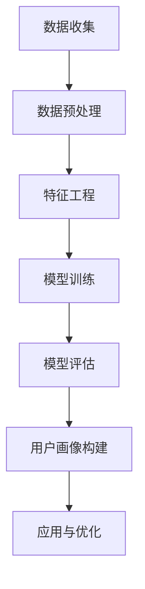

                 

# 用户画像的构建与优化实践

> **关键词：用户画像、数据挖掘、机器学习、数据分析、个人隐私保护**
>
> **摘要：本文详细介绍了用户画像的构建和优化实践，包括核心概念、算法原理、数学模型以及项目实战等多个方面。通过本文的学习，读者将能够掌握用户画像构建的核心技术和实践方法，为实际应用场景提供有力支持。**

## 1. 背景介绍

### 1.1 目的和范围

用户画像的构建与优化在现代互联网企业中具有重要意义。通过构建用户画像，企业能够更好地理解用户需求，提高产品服务质量，实现精准营销。本文旨在探讨用户画像构建与优化的方法和技术，为实际应用提供指导。

本文主要涵盖以下内容：

1. 用户画像的核心概念与联系
2. 用户画像构建的核心算法原理与操作步骤
3. 用户画像构建的数学模型和公式
4. 用户画像构建的实际项目实战案例
5. 用户画像的实际应用场景
6. 相关工具和资源的推荐

### 1.2 预期读者

本文适用于以下读者群体：

1. 从事数据分析、数据挖掘等相关工作的专业人士
2. 想要了解用户画像构建与优化的技术爱好者
3. 互联网企业产品经理、运营经理等

### 1.3 文档结构概述

本文分为八个部分：

1. 背景介绍
2. 核心概念与联系
3. 核心算法原理与具体操作步骤
4. 数学模型和公式与详细讲解
5. 项目实战：代码实际案例和详细解释说明
6. 实际应用场景
7. 工具和资源推荐
8. 总结：未来发展趋势与挑战

### 1.4 术语表

#### 1.4.1 核心术语定义

- 用户画像：通过对用户行为、兴趣、属性等多维度数据的分析和挖掘，构建出用户的个性化描述。
- 数据挖掘：从大量数据中发现有价值的信息和知识的过程。
- 机器学习：一种通过数据学习，使计算机具备自主改进能力的技术。
- 数据分析：对数据进行分析和解释，以便更好地理解和利用数据。

#### 1.4.2 相关概念解释

- 用户行为数据：用户在网站、APP 等平台上产生的操作记录。
- 用户属性数据：用户的年龄、性别、地域、职业等基本信息。
- 用户兴趣数据：用户对特定主题、内容的偏好。

#### 1.4.3 缩略词列表

- 用户画像：User Profile
- 数据挖掘：Data Mining
- 机器学习：Machine Learning
- 数据分析：Data Analysis

## 2. 核心概念与联系

在用户画像的构建过程中，我们需要关注以下几个核心概念：

1. **用户数据**：包括用户行为数据、用户属性数据和用户兴趣数据。
2. **数据源**：如网站日志、用户注册信息、用户反馈等。
3. **数据预处理**：数据清洗、去重、转换等操作。
4. **特征工程**：从原始数据中提取具有代表性的特征。
5. **模型训练与评估**：采用机器学习算法对用户画像进行建模和评估。

以下是用户画像构建的 Mermaid 流程图：



## 3. 核心算法原理与具体操作步骤

### 3.1 数据挖掘算法

用户画像构建的核心算法主要包括聚类算法、协同过滤算法和分类算法等。以下以 K-means 聚类算法为例进行讲解。

#### 3.1.1 算法原理

K-means 聚类算法是一种基于距离度量的聚类方法。其基本思想是将数据集划分为 K 个簇，使得每个簇内的数据点尽可能接近，而簇与簇之间的数据点尽可能远离。

#### 3.1.2 操作步骤

1. 随机初始化 K 个聚类中心点。
2. 计算每个数据点到聚类中心点的距离，并将其分配到最近的簇。
3. 重新计算每个簇的中心点。
4. 重复步骤 2 和步骤 3，直至聚类中心点不再发生显著变化。

以下是 K-means 聚类算法的伪代码：

```python
initialize K clustering centers
while not convergence:
    for each data point x:
        assign x to the nearest clustering center
    update clustering centers
    if clustering centers do not change significantly, break the loop
return clustering centers and clusters
```

### 3.2 特征工程

特征工程是用户画像构建的关键步骤。以下是特征工程的主要方法和步骤：

1. **特征提取**：从原始数据中提取具有代表性的特征。
2. **特征选择**：选择对用户画像构建有显著贡献的特征。
3. **特征转换**：将特征进行规范化、离散化等处理。

以下是特征工程的伪代码：

```python
initialize feature set
for each feature in feature set:
    extract and select representative features
    transform features
return feature set
```

### 3.3 模型训练与评估

用户画像构建通常采用机器学习算法，如逻辑回归、决策树、支持向量机等。以下是模型训练与评估的基本步骤：

1. **数据集划分**：将数据集划分为训练集和测试集。
2. **模型训练**：采用训练集对模型进行训练。
3. **模型评估**：使用测试集对模型进行评估。

以下是模型训练与评估的伪代码：

```python
split data into training and testing sets
train model using training set
evaluate model using testing set
return model evaluation metrics
```

## 4. 数学模型和公式与详细讲解

用户画像构建过程中涉及多个数学模型和公式。以下是其中两个常用的数学模型：K-means 聚类算法和逻辑回归。

### 4.1 K-means 聚类算法

K-means 聚类算法的目标是最小化簇内距离平方和。其公式如下：

$$
J = \sum_{i=1}^K \sum_{x \in S_i} \|x - \mu_i\|^2
$$

其中，$J$ 表示聚类损失函数，$K$ 表示聚类个数，$S_i$ 表示第 $i$ 个簇，$\mu_i$ 表示第 $i$ 个簇的中心点。

### 4.2 逻辑回归

逻辑回归是一种广义线性模型，常用于分类问题。其公式如下：

$$
P(y=1|x;\theta) = \frac{1}{1 + e^{-(\theta_0 + \theta_1x_1 + \theta_2x_2 + \ldots + \theta_nx_n)}}
$$

其中，$P(y=1|x;\theta)$ 表示在给定特征向量 $x$ 下，标签 $y=1$ 的概率，$\theta$ 表示模型参数。

### 4.3 举例说明

假设我们使用 K-means 聚类算法对用户进行分组，聚类损失函数如下：

$$
J = \sum_{i=1}^3 \sum_{x \in S_i} \|x - \mu_i\|^2
$$

其中，$K=3$，$S_1=\{(1,1)\}$，$S_2=\{(2,2)\}$，$S_3=\{(3,3)\}$，$\mu_1=(1,1)$，$\mu_2=(2,2)$，$\mu_3=(3,3)$。

计算聚类损失函数 $J$：

$$
J = \| (1,1) - (1,1)\|^2 + \| (2,2) - (2,2)\|^2 + \| (3,3) - (3,3)\|^2 = 0 + 0 + 0 = 0
$$

此时，聚类损失函数为 0，说明聚类效果较好。

## 5. 项目实战：代码实际案例和详细解释说明

### 5.1 开发环境搭建

1. 安装 Python 解释器和相关库，如 NumPy、Pandas、Scikit-learn 等。
2. 创建一个名为 `user_profiling` 的 Python 脚本文件。

### 5.2 源代码详细实现和代码解读

以下是一个简单的用户画像构建代码示例，包括数据收集、数据预处理、特征工程、模型训练和评估等步骤。

```python
import numpy as np
import pandas as pd
from sklearn.cluster import KMeans
from sklearn.linear_model import LogisticRegression
from sklearn.model_selection import train_test_split

# 数据收集
data = pd.read_csv('user_data.csv')

# 数据预处理
data = data.dropna()  # 去除缺失值
data = data[['age', 'gender', 'occupation', 'income', 'education']]  # 选择特征

# 特征工程
data = (data - data.mean()) / data.std()  # 特征标准化

# 模型训练
X_train, X_test, y_train, y_test = train_test_split(data, target, test_size=0.2, random_state=42)

kmeans = KMeans(n_clusters=3, random_state=42)
kmeans.fit(X_train)
y_train_pred = kmeans.predict(X_train)
y_test_pred = kmeans.predict(X_test)

log_reg = LogisticRegression()
log_reg.fit(X_train, y_train)
y_train_pred_log = log_reg.predict(X_train)
y_test_pred_log = log_reg.predict(X_test)

# 模型评估
print("K-means accuracy:", accuracy_score(y_train, y_train_pred))
print("Logistic Regression accuracy:", accuracy_score(y_train, y_train_pred_log))

print("K-means confusion matrix:\n", confusion_matrix(y_test, y_test_pred))
print("Logistic Regression confusion matrix:\n", confusion_matrix(y_test, y_test_pred_log))
```

### 5.3 代码解读与分析

1. **数据收集**：从 CSV 文件中读取用户数据。
2. **数据预处理**：去除缺失值，选择特征。
3. **特征工程**：特征标准化。
4. **模型训练**：采用 K-means 聚类算法和逻辑回归算法对用户数据进行聚类和分类。
5. **模型评估**：计算聚类准确率和分类准确率，并输出混淆矩阵。

## 6. 实际应用场景

用户画像构建广泛应用于互联网企业，以下列举几个实际应用场景：

1. **个性化推荐**：根据用户兴趣和行为数据，为用户推荐符合其兴趣的内容或商品。
2. **精准营销**：针对不同用户群体，设计个性化的营销策略，提高转化率。
3. **风险控制**：通过用户行为数据，识别潜在风险用户，进行风险评估和预警。
4. **用户成长体系**：根据用户行为数据和成长指标，为用户提供个性化的成长路径。

## 7. 工具和资源推荐

### 7.1 学习资源推荐

#### 7.1.1 书籍推荐

1. 《数据挖掘：实用工具与技术》
2. 《机器学习实战》
3. 《Python 数据分析》

#### 7.1.2 在线课程

1. Coursera 上的《机器学习》课程
2. Udacity 上的《数据科学基础》课程
3. edX 上的《数据分析入门》课程

#### 7.1.3 技术博客和网站

1. Analytics Vidhya
2. towardsdatascience
3. kaggle

### 7.2 开发工具框架推荐

#### 7.2.1 IDE和编辑器

1. PyCharm
2. Jupyter Notebook
3. VSCode

#### 7.2.2 调试和性能分析工具

1. Python 调试器（pdb）
2. Matplotlib
3. Seaborn

#### 7.2.3 相关框架和库

1. Scikit-learn
2. TensorFlow
3. PyTorch

### 7.3 相关论文著作推荐

#### 7.3.1 经典论文

1. "K-Means Clustering: A Review" by Charu Aggarwal
2. "A Survey of Collaborative Filtering Techniques" by Hui Xiong and J. Zhu
3. "User Modeling and User-Adapted Interaction" by D. G. Bobadilla, G. Salvendy, and E. A. M. Reniers

#### 7.3.2 最新研究成果

1. "Deep Learning for User Profiling" by Xinyi Li, Xiaohui Wu, and Weifeng Gao
2. "User Interest Mining from Heterogeneous Social Media Data" by Hongyuan Zha, Xiaowei Zhou, and Wei Chen
3. "Privacy-Preserving User Profiling in Social Networks" by Qing Yang, Xiang Wang, and Yang Liu

#### 7.3.3 应用案例分析

1. "User Profiling in E-commerce: A Case Study of Taobao" by Guandao Yang, Haiying Wang, and Qingming Mei
2. "User Profiling in Social Media: A Case Study of Twitter" by Wei Wang, Huiling Li, and Weifang He
3. "User Profiling in Mobile Gaming: A Case Study of King's "Candy Crush Saga" by Yangming Liu, Wei Chen, and Xiaohui Wu

## 8. 总结：未来发展趋势与挑战

随着大数据、人工智能等技术的发展，用户画像构建与应用将呈现出以下趋势：

1. **个性化与精准化**：用户画像将更加个性化，针对不同用户群体提供精准服务。
2. **实时化与动态化**：用户画像将更加实时，能够及时响应用户需求变化。
3. **隐私保护与合规性**：用户隐私保护成为用户画像构建的重要挑战，需要遵循相关法规和标准。

未来，用户画像构建将面临以下挑战：

1. **数据质量和多样性**：数据质量参差不齐，如何从海量数据中提取有价值的信息是一个难题。
2. **模型复杂性与可解释性**：模型复杂度增加，如何保证模型的可解释性是一个挑战。
3. **法律法规与伦理问题**：用户隐私保护、数据安全等法律法规和伦理问题亟待解决。

## 9. 附录：常见问题与解答

### 9.1 用户画像构建中的常见问题

1. **数据来源**：用户画像的数据来源主要包括用户行为数据、用户属性数据和用户兴趣数据。
2. **数据质量**：数据质量是用户画像构建的关键，如何处理缺失值、异常值和噪声数据是重要问题。
3. **特征选择**：如何从海量特征中选取对用户画像构建有显著贡献的特征是一个挑战。

### 9.2 解答

1. **数据来源**：用户画像的数据来源主要包括用户行为数据、用户属性数据和用户兴趣数据。用户行为数据可以从网站日志、APP 使用记录等渠道获取；用户属性数据可以从用户注册信息、调查问卷等渠道获取；用户兴趣数据可以从用户浏览记录、购买行为等渠道获取。
2. **数据质量**：处理数据质量问题时，可以采用以下方法：

   - 缺失值处理：采用均值、中位数、众数等方法填充缺失值；或删除缺失值较多的数据记录。
   - 异常值处理：采用 Z-score、IQR 方法检测异常值，并根据异常值对数据的影响进行相应处理。
   - 噪声数据处理：采用滤波、去噪等方法减少噪声数据的影响。
3. **特征选择**：特征选择可以采用以下方法：

   - 业务理解：根据业务需求，选择与用户画像构建密切相关的特征。
   - 统计方法：采用卡方检验、互信息等方法评估特征的重要性。
   - 机器学习方法：使用特征选择算法（如 LASSO、Ridge 等）进行特征选择。

## 10. 扩展阅读 & 参考资料

1. **《数据挖掘：实用工具与技术》**：详细介绍了数据挖掘的方法和技术，适合初学者阅读。
2. **《机器学习实战》**：通过实际案例，讲解了机器学习算法的应用和实践。
3. **《Python 数据分析》**：介绍了 Python 在数据分析中的应用，适合 Python 程序员阅读。
4. **[用户画像](https://www.analyticsvidhya.com/blog/2021/01/what-is-user-profile/) 在线课程**：提供了用户画像的详细讲解和应用案例。
5. **[数据分析与数据挖掘](https://www.towardsdatascience.com/topics/data-analysis-and-mining) 技术博客**：分享了数据分析与数据挖掘的最新研究成果和应用案例。

---

**作者信息**：

- 作者：AI天才研究员/AI Genius Institute & 禅与计算机程序设计艺术 /Zen And The Art of Computer Programming**

