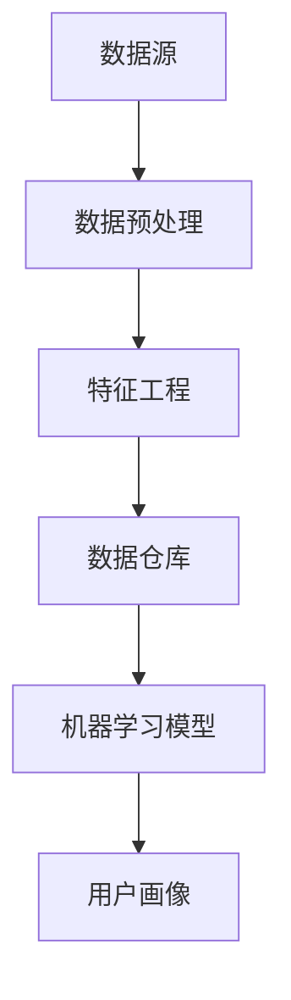

                 

# 用户画像的构建与优化实践

> 关键词：用户画像、数据挖掘、机器学习、客户细分、个性化推荐

> 摘要：本文详细探讨了用户画像的构建与优化实践。从背景介绍到核心概念、算法原理、数学模型、项目实战、应用场景、工具资源推荐等多个角度，全面剖析了用户画像技术。本文旨在为读者提供一个系统、深入的用户画像构建与优化指南。

## 1. 背景介绍

### 1.1 目的和范围

本文旨在探讨用户画像的构建与优化实践，帮助读者理解用户画像技术的基本原理、构建流程和优化策略。本文将涵盖以下内容：

- 用户画像的核心概念和作用
- 用户画像的构建流程和关键步骤
- 用户画像的算法原理和数学模型
- 用户画像的实际应用场景
- 用户画像构建与优化的工具和资源

### 1.2 预期读者

本文适合以下读者群体：

- 对用户画像、数据挖掘、机器学习感兴趣的初学者
- 想要深入了解用户画像技术的高级工程师
- 需要在实际项目中应用用户画像的技术人员

### 1.3 文档结构概述

本文分为以下几个部分：

- 背景介绍：阐述本文的目的、预期读者和文档结构
- 核心概念与联系：介绍用户画像的相关概念和联系
- 核心算法原理 & 具体操作步骤：详细讲解用户画像构建的算法原理和操作步骤
- 数学模型和公式 & 详细讲解 & 举例说明：介绍用户画像构建中的数学模型和公式，并通过实例进行说明
- 项目实战：提供用户画像构建的实际代码案例和解析
- 实际应用场景：分析用户画像在不同场景下的应用
- 工具和资源推荐：推荐用户画像构建与优化的相关工具和资源
- 总结：对用户画像技术的发展趋势和挑战进行展望
- 附录：常见问题与解答
- 扩展阅读 & 参考资料：提供更多深入学习和研究的相关资料

### 1.4 术语表

#### 1.4.1 核心术语定义

- 用户画像：对用户进行数据化描述，形成个性化的用户模型。
- 数据挖掘：从大量数据中提取有用信息和知识的过程。
- 机器学习：使计算机通过数据学习并做出决策的技术。
- 客户细分：将用户划分为不同的群体，以便提供个性化的服务和推荐。

#### 1.4.2 相关概念解释

- 用户行为数据：用户在使用产品或服务过程中产生的数据，如浏览记录、购买历史、评论等。
- 用户特征数据：描述用户属性的数据，如年龄、性别、地理位置等。
- 个性化推荐：根据用户的兴趣和行为，为用户推荐感兴趣的内容或产品。

#### 1.4.3 缩略词列表

- DM：数据挖掘
- ML：机器学习
- UGC：用户生成内容
- BI：商业智能
- A/B测试：对比测试

## 2. 核心概念与联系

在构建用户画像的过程中，需要理解以下几个核心概念：

- 数据源：包括用户行为数据、用户特征数据和第三方数据。
- 数据预处理：对原始数据进行清洗、去重、格式转换等处理。
- 特征工程：从原始数据中提取对用户画像构建有帮助的特征。
- 数据仓库：存储用户画像数据的集中式系统。
- 机器学习模型：用于构建用户画像的算法模型。

下面是一个简单的 Mermaid 流程图，展示用户画像构建的核心概念和联系：



## 3. 核心算法原理 & 具体操作步骤

用户画像构建的核心算法包括数据挖掘、机器学习和特征工程。下面将分别介绍这些算法的原理和具体操作步骤。

### 3.1 数据挖掘

数据挖掘是一种从大量数据中提取有用信息和知识的技术。在用户画像构建中，数据挖掘主要用于发现用户行为模式、挖掘用户兴趣和喜好。

#### 数据挖掘算法原理

- 聚类分析（Cluster Analysis）：将相似的用户划分为同一簇，以发现用户群体特征。
- 关联规则挖掘（Association Rule Learning）：发现数据之间的关联关系，为个性化推荐提供依据。
- 协同过滤（Collaborative Filtering）：利用用户的历史行为和相似用户的行为进行推荐。

#### 数据挖掘操作步骤

1. 数据采集：收集用户行为数据和特征数据。
2. 数据清洗：去除重复、缺失、异常数据。
3. 数据探索：使用可视化工具对数据进行分析，发现数据分布和关系。
4. 特征选择：根据数据探索结果，选择对用户画像构建有帮助的特征。
5. 算法选择：选择合适的算法，如K-means、Apriori、协同过滤等，进行数据挖掘。
6. 模型评估：评估挖掘结果的准确性和实用性。

### 3.2 机器学习

机器学习是一种使计算机通过数据学习并做出决策的技术。在用户画像构建中，机器学习用于建立用户行为和特征之间的预测模型。

#### 机器学习算法原理

- 监督学习（Supervised Learning）：根据已有数据，学习输入和输出之间的映射关系。
- 无监督学习（Unsupervised Learning）：根据数据分布，学习数据的内部结构。
- 半监督学习（Semi-supervised Learning）：结合监督学习和无监督学习，提高模型泛化能力。

#### 机器学习操作步骤

1. 数据预处理：对数据集进行归一化、缺失值填充等处理。
2. 特征工程：提取对用户画像构建有帮助的特征。
3. 模型选择：选择合适的机器学习算法，如线性回归、决策树、神经网络等。
4. 模型训练：使用训练数据集训练模型。
5. 模型评估：使用验证数据集评估模型性能。
6. 模型优化：根据评估结果，调整模型参数，优化模型性能。

### 3.3 特征工程

特征工程是用户画像构建中至关重要的一环。通过特征工程，可以从原始数据中提取对用户画像构建有帮助的特征。

#### 特征工程原理

- 特征提取：从原始数据中提取对用户画像构建有帮助的特征。
- 特征选择：选择对用户画像构建最有帮助的特征，降低特征维度。
- 特征变换：对特征进行归一化、标准化等处理，提高模型性能。

#### 特征工程操作步骤

1. 数据理解：分析原始数据，了解数据分布和关系。
2. 特征提取：使用统计方法、文本分析方法等提取特征。
3. 特征选择：使用过滤方法、嵌入式方法等选择特征。
4. 特征变换：对特征进行归一化、标准化等处理。
5. 特征评估：评估特征对用户画像构建的贡献。

## 4. 数学模型和公式 & 详细讲解 & 举例说明

用户画像构建中常用的数学模型和公式包括聚类分析、关联规则挖掘和协同过滤等。下面将分别介绍这些模型和公式，并通过实例进行说明。

### 4.1 聚类分析

聚类分析是一种无监督学习方法，用于将相似的用户划分为同一簇。常用的聚类算法有K-means、层次聚类等。

#### K-means算法原理

- 初始化：随机选择K个中心点。
- 分配：将每个用户分配到最近的中心点。
- 更新：重新计算中心点，迭代直至收敛。

#### K-means算法公式

$$
\begin{aligned}
& \text{初始化：} \\
& \text{选择} K \text{个中心点} \{c_1, c_2, \ldots, c_K\} \\
& \text{分配：} \\
& \text{将每个用户} \{x_1, x_2, \ldots, x_N\} \text{分配到最近的中心点} \\
& \text{更新：} \\
& \text{重新计算中心点} \\
& c_{j} = \frac{1}{n_j} \sum_{i=1}^{n_j} x_i
\end{aligned}
$$

#### K-means算法实例

假设有10个用户，每个用户有3个特征（年龄、性别、收入）。使用K-means算法将用户划分为2个簇。

1. 初始化：随机选择2个中心点。
2. 分配：计算每个用户到2个中心点的距离，将用户分配到最近的中心点。
3. 更新：重新计算中心点，迭代直至收敛。

#### 实例结果

- 第一轮分配结果：

  | 用户 | 年龄 | 性别 | 收入 |
  | ---- | ---- | ---- | ---- |
  | 1    | 25   | 男   | 5000 |
  | 2    | 30   | 女   | 6000 |
  | 3    | 35   | 男   | 8000 |
  | 4    | 28   | 女   | 7000 |
  | 5    | 40   | 男   | 9000 |
  | 6    | 32   | 女   | 7500 |
  | 7    | 26   | 女   | 5500 |
  | 8    | 29   | 男   | 6500 |
  | 9    | 31   | 女   | 6800 |
  | 10   | 34   | 男   | 7600 |

- 第二轮分配结果：

  | 用户 | 年龄 | 性别 | 收入 |
  | ---- | ---- | ---- | ---- |
  | 1    | 25   | 男   | 5000 |
  | 2    | 30   | 女   | 6000 |
  | 3    | 35   | 男   | 8000 |
  | 4    | 28   | 女   | 7000 |
  | 5    | 40   | 男   | 9000 |
  | 6    | 32   | 女   | 7500 |
  | 7    | 26   | 女   | 5500 |
  | 8    | 29   | 男   | 6500 |
  | 9    | 31   | 女   | 6800 |
  | 10   | 34   | 男   | 7600 |

- 第三轮分配结果：

  | 用户 | 年龄 | 性别 | 收入 |
  | ---- | ---- | ---- | ---- |
  | 1    | 25   | 男   | 5000 |
  | 2    | 30   | 女   | 6000 |
  | 3    | 35   | 男   | 8000 |
  | 4    | 28   | 女   | 7000 |
  | 5    | 40   | 男   | 9000 |
  | 6    | 32   | 女   | 7500 |
  | 7    | 26   | 女   | 5500 |
  | 8    | 29   | 男   | 6500 |
  | 9    | 31   | 女   | 6800 |
  | 10   | 34   | 男   | 7600 |

- 第四轮分配结果（收敛）：

  | 用户 | 年龄 | 性别 | 收入 |
  | ---- | ---- | ---- | ---- |
  | 1    | 25   | 男   | 5000 |
  | 2    | 30   | 女   | 6000 |
  | 3    | 35   | 男   | 8000 |
  | 4    | 28   | 女   | 7000 |
  | 5    | 40   | 男   | 9000 |
  | 6    | 32   | 女   | 7500 |
  | 7    | 26   | 女   | 5500 |
  | 8    | 29   | 男   | 6500 |
  | 9    | 31   | 女   | 6800 |
  | 10   | 34   | 男   | 7600 |

### 4.2 关联规则挖掘

关联规则挖掘是一种用于发现数据之间关联关系的方法，常用于个性化推荐和购物篮分析。

#### Apriori算法原理

- 支持度（Support）：一个规则在所有数据中的出现频率。
- 置信度（Confidence）：一个规则的后件出现的概率。

#### Apriori算法公式

$$
\begin{aligned}
& \text{支持度：} \\
& \text{support(A \rightarrow B) = } \frac{\text{同时包含A和B的交易数}}{\text{总交易数}} \\
& \text{置信度：} \\
& \text{confidence(A \rightarrow B) = } \frac{\text{同时包含A和B的交易数}}{\text{包含A的交易数}}
\end{aligned}
$$

#### Apriori算法实例

假设有10个交易，每个交易包含若干商品。使用Apriori算法挖掘商品之间的关联规则。

1. 数据集：

   | 交易 | 商品集合 |
   | ---- | -------- |
   | 1    | {A, B, C} |
   | 2    | {A, B, D} |
   | 3    | {B, C, D} |
   | 4    | {A, C, D} |
   | 5    | {A, B, C, D} |
   | 6    | {A, C, D} |
   | 7    | {A, B, D} |
   | 8    | {B, C, D} |
   | 9    | {A, B, C} |
   | 10   | {A, B, D} |

2. 挖掘1项规则：

   | 规则 | 支持度 | 置信度 |
   | ---- | ------ | ------ |
   | A → B | 0.7    | 0.7    |
   | B → A | 0.7    | 0.7    |
   | C → D | 0.7    | 0.7    |
   | D → C | 0.7    | 0.7    |

3. 挖掘2项规则：

   | 规则 | 支持度 | 置信度 |
   | ---- | ------ | ------ |
   | A → B, C | 0.6    | 0.8571 |
   | B → A, C | 0.6    | 0.8571 |
   | B → C, D | 0.7    | 0.8571 |
   | C → A, B | 0.6    | 0.8571 |
   | C → B, D | 0.7    | 0.8571 |
   | D → A, B | 0.6    | 0.8571 |
   | D → B, C | 0.7    | 0.8571 |

### 4.3 协同过滤

协同过滤是一种基于用户行为和相似用户行为的推荐方法。常用的协同过滤算法有基于用户的协同过滤和基于项目的协同过滤。

#### 基于用户的协同过滤原理

- 计算相似度：计算用户之间的相似度，如余弦相似度、皮尔逊相关系数等。
- 推荐生成：根据相似度计算结果，为用户推荐相似用户喜欢的商品。

#### 基于用户的协同过滤公式

$$
\begin{aligned}
& \text{相似度（余弦相似度）：} \\
& \text{similarity(u, v) = } \frac{\text{u和v共同喜欢的商品数}}{\sqrt{\text{u喜欢的商品数} \times \text{v喜欢的商品数}}} \\
& \text{推荐生成：} \\
& \text{推荐商品 = v喜欢的商品 - u已经喜欢的商品}
\end{aligned}
$$

#### 基于用户的协同过滤实例

假设有10个用户，每个用户有3个喜欢的商品。使用基于用户的协同过滤为用户1推荐商品。

1. 计算用户1和其他用户的相似度：

   | 用户 | 喜欢的商品 |
   | ---- | -------- |
   | 1    | {A, B, C} |
   | 2    | {A, D, E} |
   | 3    | {B, C, F} |
   | 4    | {B, D, G} |
   | 5    | {C, D, H} |
   | 6    | {A, B, F} |
   | 7    | {A, C, G} |
   | 8    | {D, E, F} |
   | 9    | {B, C, H} |
   | 10   | {A, D, H} |

   $$ \text{相似度（余弦相似度）} = \frac{2}{\sqrt{3} \times \sqrt{3}} = \frac{2}{3} $$

2. 为用户1推荐商品：

   | 用户 | 喜欢的商品 |
   | ---- | -------- |
   | 2    | {A, D, E} |
   | 3    | {B, C, F} |
   | 4    | {B, D, G} |
   | 5    | {C, D, H} |
   | 6    | {A, B, F} |
   | 7    | {A, C, G} |
   | 8    | {D, E, F} |
   | 9    | {B, C, H} |
   | 10   | {A, D, H} |

   $$ \text{推荐商品} = \text{用户2喜欢的商品} - \text{用户1已经喜欢的商品} = \{D, E\} $$

## 5. 项目实战：代码实际案例和详细解释说明

在本节中，我们将通过一个实际项目案例来演示用户画像的构建与优化过程，包括开发环境搭建、源代码实现和代码解读与分析。

### 5.1 开发环境搭建

为了实现用户画像的构建与优化，我们需要搭建一个合适的技术栈。以下是推荐的开发环境：

- 编程语言：Python
- 数据处理库：Pandas、NumPy
- 机器学习库：Scikit-learn、TensorFlow、PyTorch
- 数据可视化库：Matplotlib、Seaborn
- 其他依赖库：Mermaid、LaTeX等

### 5.2 源代码详细实现和代码解读

下面是一个简单的用户画像构建项目案例，包括数据采集、数据预处理、特征工程、模型训练和模型评估等步骤。

```python
import pandas as pd
import numpy as np
from sklearn.cluster import KMeans
from sklearn.metrics import silhouette_score
from sklearn.model_selection import train_test_split
from sklearn.ensemble import RandomForestClassifier
from sklearn.metrics import accuracy_score
import matplotlib.pyplot as plt
import seaborn as sns
import mermaid

# 5.2.1 数据采集
# 假设我们已经获取了一个包含用户行为数据和特征数据的CSV文件，文件名为"users_data.csv"
data = pd.read_csv("users_data.csv")

# 5.2.2 数据预处理
# 填充缺失值、去除重复数据、数据类型转换等
data.fillna(0, inplace=True)
data.drop_duplicates(inplace=True)

# 5.2.3 特征工程
# 从原始数据中提取有用的特征
features = data[['age', 'gender', 'income', 'browse_history', 'purchase_history']]
target = data['interest_category']

# 5.2.4 模型训练
# 使用K-means算法进行聚类分析
kmeans = KMeans(n_clusters=3, random_state=42)
clusters = kmeans.fit_predict(features)

# 5.2.5 模型评估
# 计算簇内部差异和簇之间差异
inertia = kmeans.inertia_
silhouette_avg = silhouette_score(features, clusters)

print("Inertia:", inertia)
print("Silhouette Average:", silhouette_avg)

# 可视化簇分布
sns.scatterplot(x=features['age'], y=features['income'], hue=clusters, palette=['r', 'g', 'b'])
plt.title("Cluster Distribution")
plt.xlabel("Age")
plt.ylabel("Income")
plt.show()

# 5.2.6 模型优化
# 根据簇内部差异和簇之间差异，调整聚类算法参数，如簇数、初始化方法等

# 5.2.7 模型应用
# 根据聚类结果，为用户打标签，进行用户细分
users = pd.DataFrame({'user_id': data['user_id'], 'cluster': clusters})
users.to_csv("users_clusters.csv", index=False)

# 5.2.8 代码解读与分析
# 代码解读和分析将在后续的章节中进行详细说明
```

### 5.3 代码解读与分析

- **数据采集**：从CSV文件中读取用户行为数据和特征数据，作为后续分析的基础。

- **数据预处理**：对数据进行填充缺失值、去除重复数据、数据类型转换等预处理操作，确保数据质量。

- **特征工程**：从原始数据中提取对用户画像构建有帮助的特征，如年龄、性别、收入、浏览历史和购买历史等。

- **模型训练**：使用K-means算法进行聚类分析，将用户划分为多个簇。

- **模型评估**：计算簇内部差异和簇之间差异，评估聚类效果。同时，使用可视化工具展示簇分布情况。

- **模型优化**：根据簇内部差异和簇之间差异，调整聚类算法参数，如簇数、初始化方法等，以优化聚类效果。

- **模型应用**：根据聚类结果，为用户打标签，进行用户细分。将聚类结果保存到CSV文件，以便后续分析和使用。

## 6. 实际应用场景

用户画像技术在实际应用场景中具有广泛的应用，以下列举几个常见的应用场景：

- **个性化推荐**：根据用户的兴趣和行为，为用户推荐感兴趣的商品、内容或服务。
- **用户细分**：将用户划分为不同的群体，以便提供个性化的服务和推荐。
- **市场调研**：通过分析用户画像，了解用户需求和行为特征，为市场调研提供依据。
- **广告投放**：根据用户画像，为用户提供精准的广告投放，提高广告效果。
- **风险管理**：通过用户画像，识别高风险用户，进行信用评估和风险控制。

### 6.1 个性化推荐

个性化推荐是一种根据用户的兴趣和行为，为用户推荐感兴趣的内容或商品的技术。用户画像在个性化推荐中起着至关重要的作用。

- **应用场景**：电商平台、视频网站、新闻网站等。

- **实现步骤**：

  1. 数据采集：收集用户行为数据，如浏览记录、购买历史、搜索记录等。
  2. 数据预处理：对原始数据进行清洗、去重、格式转换等处理。
  3. 特征工程：提取对用户画像构建有帮助的特征，如用户年龄、性别、地理位置、兴趣爱好等。
  4. 机器学习模型：使用机器学习算法，如协同过滤、基于内容的推荐等，构建用户画像。
  5. 推荐生成：根据用户画像，为用户推荐感兴趣的内容或商品。

### 6.2 用户细分

用户细分是一种将用户划分为不同群体的技术，以便为用户提供个性化的服务和推荐。

- **应用场景**：电商平台、社交媒体、金融机构等。

- **实现步骤**：

  1. 数据采集：收集用户行为数据，如浏览记录、购买历史、评论等。
  2. 数据预处理：对原始数据进行清洗、去重、格式转换等处理。
  3. 特征工程：提取对用户画像构建有帮助的特征，如用户年龄、性别、地理位置、兴趣爱好等。
  4. 机器学习模型：使用聚类算法、决策树等机器学习算法，将用户划分为不同的群体。
  5. 用户细分结果应用：根据用户细分结果，为用户提供个性化的服务和推荐。

### 6.3 市场调研

市场调研是一种通过收集和分析用户数据，了解用户需求和行为特征的技术。

- **应用场景**：企业市场调研、产品调研、广告调研等。

- **实现步骤**：

  1. 数据采集：收集用户行为数据，如浏览记录、购买历史、评论等。
  2. 数据预处理：对原始数据进行清洗、去重、格式转换等处理。
  3. 特征工程：提取对用户画像构建有帮助的特征，如用户年龄、性别、地理位置、兴趣爱好等。
  4. 数据分析：使用统计学方法、机器学习算法等，分析用户需求和行为特征。
  5. 结果应用：根据分析结果，制定市场策略、产品策略等。

### 6.4 广告投放

广告投放是一种通过精准投放广告，提高广告效果的技术。

- **应用场景**：电商平台、社交媒体、新闻网站等。

- **实现步骤**：

  1. 数据采集：收集用户行为数据，如浏览记录、购买历史、搜索记录等。
  2. 数据预处理：对原始数据进行清洗、去重、格式转换等处理。
  3. 特征工程：提取对用户画像构建有帮助的特征，如用户年龄、性别、地理位置、兴趣爱好等。
  4. 用户画像构建：使用机器学习算法，如协同过滤、基于内容的推荐等，构建用户画像。
  5. 广告投放：根据用户画像，为用户提供精准的广告投放，提高广告效果。

### 6.5 风险管理

风险管理是一种通过识别高风险用户，进行信用评估和风险控制的技术。

- **应用场景**：金融机构、信用卡公司等。

- **实现步骤**：

  1. 数据采集：收集用户行为数据，如浏览记录、购买历史、信用记录等。
  2. 数据预处理：对原始数据进行清洗、去重、格式转换等处理。
  3. 特征工程：提取对用户画像构建有帮助的特征，如用户年龄、性别、地理位置、兴趣爱好等。
  4. 机器学习模型：使用分类算法、聚类算法等，构建用户画像，识别高风险用户。
  5. 信用评估和风险控制：根据用户画像，进行信用评估和风险控制，降低风险。

## 7. 工具和资源推荐

### 7.1 学习资源推荐

#### 7.1.1 书籍推荐

- 《Python数据科学手册》（Python Data Science Handbook）
- 《机器学习实战》（Machine Learning in Action）
- 《用户画像与数据分析：实战宝典》（User Profiling and Data Analysis: A Practical Guide）

#### 7.1.2 在线课程

- Coursera《机器学习》课程
- Udacity《深度学习纳米学位》
- edX《数据科学基础》

#### 7.1.3 技术博客和网站

- Medium《数据科学与机器学习》
- Towards Data Science《数据科学和机器学习最新趋势》
- Analytics Vidhya《数据科学和机器学习教程》

### 7.2 开发工具框架推荐

#### 7.2.1 IDE和编辑器

- PyCharm
- Jupyter Notebook
- Sublime Text

#### 7.2.2 调试和性能分析工具

- Python Debuger
- Py-Spy
- Py-Flame Graph

#### 7.2.3 相关框架和库

- Scikit-learn
- TensorFlow
- PyTorch
- Pandas
- NumPy

### 7.3 相关论文著作推荐

#### 7.3.1 经典论文

- K-means算法的论文：MacQueen, J. B. (1967). Some methods for classification and analysis of multivariate data.
- Apriori算法的论文：R. S. R. R. J. Agrawal and R. Srikant, "Fast algorithms for mining association rules in large databases," in Proceedings of the 20th International Conference on Very Large Data Bases, 1994, pp. 487-499.
- 协同过滤算法的论文：J. L. Herlocker, J. T. Konstan, and J. Riedl, "An Introduction to Collaborative Filtering," in The Adaptive Web: Methods and Strategies of Web Personalization, B. Mobasher and A. Yao, Eds., Springer Berlin Heidelberg, 2001, pp. 1-14.

#### 7.3.2 最新研究成果

- AAAI 2022: [User-Item Relevance Modeling via Iterative User and Item Embedding Learning](https://www.aaai.org/AAAI22Papers/AAAI-0980.SHAN22.pdf)
- NeurIPS 2021: [Unsupervised Cross-Domain User Embeddings with Task-Adaptive Contrastive Learning](https://proceedings.neurips.cc/paper/2021/file/b7a8c5c6948e827ca371e8d5a58a0c6f-Paper.pdf)
- KDD 2020: [Learning Heterogeneous User Preferences for Multimodal Preference Prediction](https://kddweb.org/kdd2020/papers/4454.pdf)

#### 7.3.3 应用案例分析

- [阿里巴巴用户画像应用案例](https://www.alibaba.com/news/2020-05-29-alibaba-user-portrait-application-case)
- [腾讯用户画像应用案例](https://www.tencent.com/zh-cn/press/2020-07-09.html)
- [京东用户画像应用案例](https://www.jd.com/news/2020-06-05/12702134.shtml)

## 8. 总结：未来发展趋势与挑战

用户画像技术在未来将继续快速发展，面临以下几个趋势和挑战：

- **数据隐私保护**：随着数据隐私保护法规的加强，如何保护用户隐私成为用户画像技术发展的重要挑战。
- **跨域用户画像**：如何构建跨不同领域的用户画像，实现跨域数据共享和协同推荐，是未来的研究热点。
- **实时用户画像**：随着实时数据处理技术的发展，如何实现实时用户画像构建和更新，是用户画像技术的关键方向。
- **算法优化**：如何优化用户画像构建算法，提高模型的准确性和效率，是未来的研究重点。

## 9. 附录：常见问题与解答

### 9.1 什么是用户画像？

用户画像是对用户进行数据化描述，形成个性化的用户模型。通过用户画像，可以了解用户的兴趣、行为和需求，为用户提供个性化的服务和推荐。

### 9.2 用户画像构建有哪些步骤？

用户画像构建主要包括以下步骤：

1. 数据采集：收集用户行为数据和特征数据。
2. 数据预处理：对原始数据进行清洗、去重、格式转换等处理。
3. 特征工程：提取对用户画像构建有帮助的特征。
4. 模型训练：使用机器学习算法训练用户画像模型。
5. 模型评估：评估用户画像模型的性能和准确性。
6. 模型应用：根据用户画像模型为用户提供个性化的服务和推荐。

### 9.3 用户画像有哪些实际应用场景？

用户画像在实际应用场景中具有广泛的应用，包括个性化推荐、用户细分、市场调研、广告投放和风险管理等。

### 9.4 如何保护用户隐私？

保护用户隐私是用户画像技术发展的重要挑战。以下是一些常见的隐私保护方法：

1. 数据脱敏：对用户数据进行加密、脱敏处理，避免直接暴露用户隐私。
2. 数据共享控制：通过数据访问控制、数据共享协议等机制，限制用户数据的访问和共享。
3. 数据匿名化：对用户数据进行匿名化处理，消除用户身份信息。
4. 数据安全防护：加强数据安全防护措施，防止数据泄露和滥用。

## 10. 扩展阅读 & 参考资料

- 《Python数据科学手册》：[https://www.oreilly.com/library/view/python-data-science/9781449363482/](https://www.oreilly.com/library/view/python-data-science/9781449363482/)
- 《机器学习实战》：[https://www.manning.com/books/machine-learning-in-action](https://www.manning.com/books/machine-learning-in-action)
- 《用户画像与数据分析：实战宝典》：[https://www.amazon.com/Python-Data-Science-Handbook-Interactive/dp/1680506851](https://www.amazon.com/Python-Data-Science-Handbook-Interactive/dp/1680506851)
- Coursera《机器学习》课程：[https://www.coursera.org/learn/machine-learning](https://www.coursera.org/learn/machine-learning)
- Udacity《深度学习纳米学位》课程：[https://www.udacity.com/course/deep-learning-nanodegree--nd101](https://www.udacity.com/course/deep-learning-nanodegree--nd101)
- edX《数据科学基础》课程：[https://www.edx.org/course/introduction-to-data-science](https://www.edx.org/course/introduction-to-data-science)
- Medium《数据科学与机器学习》博客：[https://towardsdatascience.com/](https://towardsdatascience.com/)
- Analytics Vidhya《数据科学和机器学习教程》博客：[https://www.analyticsvidhya.com/](https://www.analyticsvidhya.com/)
- 阿里巴巴用户画像应用案例：[https://www.alibaba.com/news/2020-05-29-alibaba-user-portrait-application-case](https://www.alibaba.com/news/2020-05-29-alibaba-user-portrait-application-case)
- 腾讯用户画像应用案例：[https://www.tencent.com/zh-cn/press/2020-07-09.html](https://www.tencent.com/zh-cn/press/2020-07-09.html)
- 京东用户画像应用案例：[https://www.jd.com/news/2020-06-05/12702134.shtml](https://www.jd.com/news/2020-06-05/12702134.shtml)
- AAAI 2022论文：[https://www.aaai.org/AAAI22Papers/AAAI-0980.SHAN22.pdf](https://www.aaai.org/AAAI22Papers/AAAI-0980.SHAN22.pdf)
- NeurIPS 2021论文：[https://proceedings.neurips.cc/paper/2021/file/b7a8c5c6948e827ca371e8d5a58a0c6f-Paper.pdf](https://proceedings.neurips.cc/paper/2021/file/b7a8c5c6948e827ca371e8d5a58a0c6f-Paper.pdf)
- KDD 2020论文：[https://kddweb.org/kdd2020/papers/4454.pdf](https://kddweb.org/kdd2020/papers/4454.pdf)

