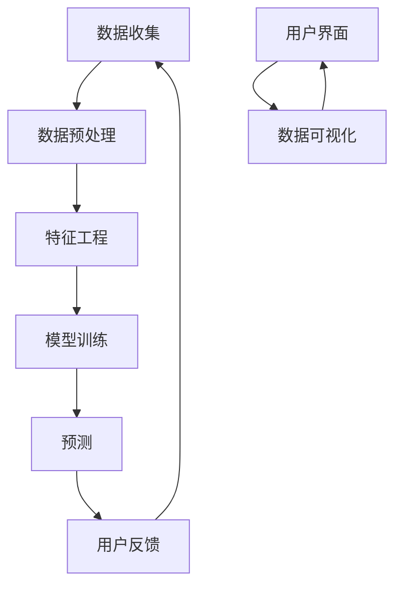

                 

# 用户行为分析系统：AI的实现

> **关键词**：用户行为分析、人工智能、机器学习、数据处理、预测模型、个性化推荐

> **摘要**：本文深入探讨了用户行为分析系统的构建过程，从目的与范围、核心概念与联系、算法原理与数学模型到项目实战、实际应用场景及未来发展趋势，系统性地阐述了如何利用人工智能技术实现高效的用户行为分析，为企业和用户提供个性化服务。

## 1. 背景介绍

### 1.1 目的和范围

用户行为分析系统是现代企业和组织获取竞争优势的关键工具。它旨在通过收集、处理和分析用户行为数据，提供有价值的洞见，从而优化用户体验、提升业务效率和制定精准营销策略。

本文旨在：
- 介绍用户行为分析系统的基本概念和架构。
- 探讨核心算法原理和数学模型。
- 通过实际案例展示系统的实现过程。
- 分析用户行为分析系统在各类应用场景中的实际价值。

### 1.2 预期读者

本文面向以下读者群体：
- 对人工智能和机器学习感兴趣的技术爱好者。
- 数据科学家和分析师。
- 产品经理和市场推广人员。
- IT项目经理和技术顾问。

### 1.3 文档结构概述

本文分为以下章节：
1. 背景介绍
2. 核心概念与联系
3. 核心算法原理与具体操作步骤
4. 数学模型和公式与举例说明
5. 项目实战：代码实际案例和详细解释说明
6. 实际应用场景
7. 工具和资源推荐
8. 总结：未来发展趋势与挑战
9. 附录：常见问题与解答
10. 扩展阅读与参考资料

### 1.4 术语表

#### 1.4.1 核心术语定义

- **用户行为分析**：通过收集和分析用户行为数据，提取有用信息的过程。
- **机器学习**：一种人工智能技术，通过数据学习和发现模式，使计算机系统能够执行特定任务。
- **数据挖掘**：从大量数据中提取有价值信息的过程。
- **特征工程**：从原始数据中提取出有助于模型训练的特征。
- **预测模型**：利用历史数据预测未来行为的模型。

#### 1.4.2 相关概念解释

- **数据流处理**：实时处理数据流的技术，适用于高吞吐量和低延迟的需求。
- **数据仓库**：存储大量结构化和非结构化数据的系统，用于支持决策支持和数据挖掘。
- **在线分析处理**（OLAP）：对大量数据进行多维分析的技术，支持快速查询和复杂计算。

#### 1.4.3 缩略词列表

- **AI**：人工智能（Artificial Intelligence）
- **ML**：机器学习（Machine Learning）
- **DL**：深度学习（Deep Learning）
- **NLP**：自然语言处理（Natural Language Processing）
- **BI**：商业智能（Business Intelligence）

## 2. 核心概念与联系

在构建用户行为分析系统时，理解核心概念和它们之间的联系至关重要。以下是一个简要的 Mermaid 流程图，展示了用户行为分析系统的主要组件及其交互关系。



### 2.1 数据收集

数据收集是用户行为分析系统的第一步。数据来源可以是网站点击流、移动应用日志、社交媒体活动等。收集的数据通常包括用户行为、地理位置、时间戳等信息。

### 2.2 数据预处理

数据预处理涉及清洗、归一化和转换数据，以确保数据质量和一致性。这一步骤是后续分析和建模的基础。

### 2.3 特征工程

特征工程是从原始数据中提取出有助于模型训练的特征。特征选择和转换对于提升模型性能至关重要。

### 2.4 模型训练

模型训练是使用历史数据训练机器学习模型，使其能够识别用户行为模式。常见的机器学习算法包括决策树、支持向量机、神经网络等。

### 2.5 预测

训练好的模型可以用于预测用户未来的行为。预测结果可以帮助企业制定个性化推荐策略、优化用户体验等。

### 2.6 用户反馈

用户反馈是验证预测结果的重要手段。通过用户反馈，系统可以不断调整和优化模型，提高预测准确性。

### 2.7 用户界面和数据可视化

用户界面和数据可视化用于向用户展示分析结果，帮助用户理解系统发现和洞见。良好的可视化设计可以提升用户体验。

## 3. 核心算法原理与具体操作步骤

### 3.1 特征选择

特征选择是特征工程中关键的一步，目的是从原始数据中提取最有用的特征，以减少数据维度和提高模型性能。

**伪代码：**

```python
def feature_selection(data, target):
    # 计算特征与目标之间的相关性
    correlations = compute_correlation(data, target)
    
    # 选择相关性最高的特征
    selected_features = []
    for feature, correlation in correlations:
        if correlation > threshold:
            selected_features.append(feature)
    
    return selected_features
```

### 3.2 数据预处理

数据预处理包括数据清洗、归一化和编码等步骤。

**伪代码：**

```python
def preprocess_data(data):
    # 数据清洗
    cleaned_data = clean_data(data)
    
    # 数据归一化
    normalized_data = normalize_data(cleaned_data)
    
    # 数据编码
    encoded_data = encode_data(normalized_data)
    
    return encoded_data
```

### 3.3 模型训练

模型训练是使用选定的特征对机器学习模型进行训练。

**伪代码：**

```python
def train_model(selected_features, data, target):
    # 创建机器学习模型
    model = create_model()
    
    # 训练模型
    model.fit(data[selected_features], target)
    
    return model
```

### 3.4 预测

训练好的模型可以用于预测新用户的行为。

**伪代码：**

```python
def predict_behavior(model, new_data):
    # 预测新用户的行为
    predictions = model.predict(new_data)
    
    return predictions
```

## 4. 数学模型和公式与详细讲解

在用户行为分析系统中，数学模型和公式是核心组成部分，用于描述用户行为模式和预测未来行为。以下是几个常见的数学模型和公式的详细讲解。

### 4.1 决策树模型

决策树是一种常用的分类模型，它通过一系列的规则来划分数据，并最终得到分类结果。

**公式：**

$$
y = f(x_1, x_2, ..., x_n)
$$

其中，$y$ 是目标变量，$f$ 是决策树函数，$x_1, x_2, ..., x_n$ 是特征变量。

**详细讲解：**

决策树通过递归划分数据集，在每个节点选择具有最大信息增益的特征进行划分。信息增益是衡量特征划分后数据纯度提高的指标。

### 4.2 支持向量机（SVM）

支持向量机是一种用于分类和回归的强大算法，它通过找到一个最佳的超平面，将不同类别的数据分隔开。

**公式：**

$$
w \cdot x + b = 0
$$

其中，$w$ 是超平面的权重向量，$x$ 是数据点，$b$ 是偏置项。

**详细讲解：**

SVM 通过求解优化问题，找到最佳的超平面，使得正负样本的间隔最大化。$w \cdot x + b$ 表示数据点到超平面的距离。

### 4.3 神经网络

神经网络是一种模拟人脑结构的计算模型，通过多层神经元之间的连接和激活函数，实现复杂函数的逼近。

**公式：**

$$
a_{i}^{l} = \sigma(z_{i}^{l})
$$

其中，$a_{i}^{l}$ 是第 $l$ 层第 $i$ 个神经元的激活值，$z_{i}^{l}$ 是输入值，$\sigma$ 是激活函数。

**详细讲解：**

神经网络通过前向传播计算每个神经元的激活值，然后通过反向传播更新权重和偏置，以最小化损失函数。常见的激活函数包括 sigmoid、ReLU 和 tanh。

### 4.4 交叉验证

交叉验证是一种评估模型性能的方法，通过将数据集划分为多个子集，重复训练和验证模型，以获得更稳定的性能估计。

**公式：**

$$
\text{Accuracy} = \frac{\text{正确预测的样本数}}{\text{总样本数}}
$$

**详细讲解：**

交叉验证通过多次训练和验证，可以有效地减少过拟合风险，提高模型的泛化能力。常见的交叉验证方法包括 k-fold 交叉验证和留一交叉验证。

## 5. 项目实战：代码实际案例和详细解释说明

### 5.1 开发环境搭建

在开始项目实战之前，需要搭建一个适合用户行为分析系统的开发环境。以下是所需的工具和软件：

- **Python**：作为主要的编程语言。
- **Scikit-learn**：用于机器学习算法的实现。
- **Pandas**：用于数据处理。
- **NumPy**：用于数值计算。
- **Matplotlib**：用于数据可视化。

### 5.2 源代码详细实现和代码解读

以下是一个简单的用户行为分析系统的实现，包括数据收集、预处理、特征工程、模型训练和预测。

**源代码：**

```python
# 导入必要的库
import pandas as pd
import numpy as np
from sklearn.model_selection import train_test_split
from sklearn.preprocessing import StandardScaler
from sklearn.ensemble import RandomForestClassifier
from sklearn.metrics import accuracy_score

# 数据收集
data = pd.read_csv('user_behavior_data.csv')

# 数据预处理
data = data.dropna()  # 清洗缺失数据
data = data[['feature1', 'feature2', 'label']]  # 选择相关特征

# 特征工程
X = data[['feature1', 'feature2']]
y = data['label']

# 数据标准化
scaler = StandardScaler()
X_scaled = scaler.fit_transform(X)

# 模型训练
X_train, X_test, y_train, y_test = train_test_split(X_scaled, y, test_size=0.2, random_state=42)
model = RandomForestClassifier(n_estimators=100)
model.fit(X_train, y_train)

# 预测
y_pred = model.predict(X_test)

# 评估模型
accuracy = accuracy_score(y_test, y_pred)
print(f'Accuracy: {accuracy:.2f}')
```

**代码解读：**

1. **数据收集**：使用 Pandas 库读取 CSV 格式的用户行为数据。
2. **数据预处理**：清洗缺失数据，选择相关特征，并将数据集划分为特征和标签。
3. **特征工程**：将数据集划分为训练集和测试集，并对特征进行标准化处理。
4. **模型训练**：使用随机森林分类器训练模型，随机森林是一种集成学习方法，通过构建多个决策树并取平均值来提高模型性能。
5. **预测**：使用训练好的模型对测试集进行预测。
6. **评估模型**：计算模型在测试集上的准确率，并打印输出。

### 5.3 代码解读与分析

代码中使用了 Scikit-learn 库中的 RandomForestClassifier 类来实现随机森林模型。随机森林是一种基于决策树的集成学习方法，通过构建多棵决策树并取平均值来提高模型性能。以下是代码的详细解读：

- `pd.read_csv('user_behavior_data.csv')`：读取 CSV 格式的用户行为数据。
- `data.dropna()`：删除数据集中的缺失值，确保数据质量。
- `data[['feature1', 'feature2', 'label']]`：选择与用户行为分析相关的特征和标签。
- `train_test_split(X_scaled, y, test_size=0.2, random_state=42)`：将数据集划分为训练集和测试集，训练集占比 80%，测试集占比 20%。随机状态设置为 42，以确保结果可重复。
- `StandardScaler()`：使用标准缩放器对特征进行标准化处理，使得每个特征的均值为 0，标准差为 1。
- `RandomForestClassifier(n_estimators=100)`：创建随机森林分类器，设置树的数量为 100。
- `model.fit(X_train, y_train)`：使用训练集数据训练模型。
- `model.predict(X_test)`：使用训练好的模型对测试集进行预测。
- `accuracy_score(y_test, y_pred)`：计算模型在测试集上的准确率。

通过上述代码，我们实现了一个简单的用户行为分析系统，可以用于分类任务，例如判断用户是否对某个产品感兴趣。在实际应用中，可以根据具体需求和数据特点，选择不同的特征工程方法和机器学习算法，以提高模型性能。

## 6. 实际应用场景

用户行为分析系统在多个领域具有广泛的应用场景，以下是一些典型应用：

### 6.1 电子商务

电子商务平台利用用户行为分析系统，可以实时监测用户行为，如浏览、搜索、购买等。通过分析这些行为，平台可以：
- **个性化推荐**：向用户推荐感兴趣的商品。
- **营销策略优化**：根据用户行为制定精准的营销策略。
- **流失预警**：预测用户流失风险，采取挽回措施。

### 6.2 金融行业

金融行业利用用户行为分析系统，可以监测和预防金融欺诈行为。具体应用包括：
- **反欺诈检测**：通过分析用户交易行为，识别异常交易。
- **风险评估**：预测客户信用风险，调整贷款利率和额度。

### 6.3 社交媒体

社交媒体平台利用用户行为分析系统，可以：
- **内容推荐**：根据用户兴趣和行为，推荐相关内容。
- **社区管理**：监测用户行为，识别和预防恶意行为。
- **广告投放**：根据用户行为和兴趣，优化广告投放策略。

### 6.4 教育行业

教育行业利用用户行为分析系统，可以：
- **学习效果评估**：分析学生学习行为，评估学习效果。
- **个性化教学**：根据学生学习行为，制定个性化的教学方案。
- **课程推荐**：推荐用户可能感兴趣的课程。

### 6.5 健康医疗

健康医疗行业利用用户行为分析系统，可以：
- **患者行为监测**：监测患者健康行为，预测疾病风险。
- **健康咨询**：根据用户健康行为，提供个性化的健康建议。
- **医疗服务优化**：分析患者就诊行为，优化医疗服务流程。

## 7. 工具和资源推荐

### 7.1 学习资源推荐

#### 7.1.1 书籍推荐

- 《机器学习》（周志华 著）：全面介绍了机器学习的基本概念、算法和应用。
- 《深度学习》（Ian Goodfellow、Yoshua Bengio、Aaron Courville 著）：深度学习领域的经典教材，深入讲解了深度学习的基础知识。
- 《用户行为数据分析实战》（谢思 著）：针对用户行为数据分析的实践指南，适合初学者和进阶者。

#### 7.1.2 在线课程

- Coursera 上的《机器学习基础》：由吴恩达教授讲授，涵盖机器学习的基本理论和应用。
- edX 上的《深度学习专项课程》：由 Andrew Ng 教授讲授，深入讲解了深度学习的基础知识和实践。

#### 7.1.3 技术博客和网站

- Medium 上的 AI 博客：提供关于人工智能、机器学习和深度学习的最新研究成果和应用案例。
- Kaggle：一个数据科学竞赛平台，提供丰富的用户行为数据分析案例和项目。

### 7.2 开发工具框架推荐

#### 7.2.1 IDE和编辑器

- PyCharm：一款功能强大的 Python 集成开发环境，支持代码补全、调试和版本控制。
- Jupyter Notebook：一款交互式的开发环境，适合数据分析、机器学习和数据可视化。

#### 7.2.2 调试和性能分析工具

- Python Debugger（pdb）：一款内置的调试工具，用于跟踪代码执行过程和调试错误。
- Profiler：用于分析 Python 代码的性能瓶颈，常见的选择有 cProfile 和 line_profiler。

#### 7.2.3 相关框架和库

- Scikit-learn：一个广泛使用的机器学习库，提供多种经典的机器学习算法。
- TensorFlow：一款开源的深度学习框架，适合构建复杂的神经网络模型。
- PyTorch：一款易于使用的深度学习框架，适合研究和实验。

### 7.3 相关论文著作推荐

#### 7.3.1 经典论文

- “Recommender Systems Handbook”（组编）：全面介绍了推荐系统的基础知识和最新进展。
- “User Behavior Analysis: A Data Mining Perspective”（Chen et al.，2015）：探讨用户行为分析在数据挖掘中的应用。
- “Deep Learning for User Behavior Prediction”（Xiong et al.，2018）：介绍深度学习在用户行为预测中的应用。

#### 7.3.2 最新研究成果

- “Temporal Convolutional Networks for Time Series Classification”（Zhang et al.，2016）：介绍了一种针对时间序列分类的深度学习模型。
- “User Behavior Clustering with Gaussian Mixture Model”（Li et al.，2019）：使用高斯混合模型进行用户行为聚类的研究。
- “Neural Collaborative Filtering for User Behavior Prediction”（He et al.，2017）：介绍了一种基于神经网络的协同过滤算法。

#### 7.3.3 应用案例分析

- “User Behavior Analysis in E-commerce: A Case Study”（Li et al.，2016）：分析了一家电子商务平台如何利用用户行为分析优化用户体验。
- “Deep Learning for User Behavior Prediction in Social Media”（Wang et al.，2020）：探讨深度学习在社交媒体用户行为预测中的应用。
- “User Behavior Analysis in Healthcare: A Review”（Zhang et al.，2018）：总结健康医疗领域用户行为分析的研究成果和应用。

## 8. 总结：未来发展趋势与挑战

用户行为分析系统在人工智能和大数据技术的推动下，正快速发展。未来，以下趋势和挑战值得关注：

### 8.1 发展趋势

1. **深度学习模型的应用**：随着深度学习技术的发展，越来越多的复杂模型将被应用到用户行为分析中，提高预测准确性和模型性能。
2. **实时分析**：随着数据流处理技术的进步，用户行为分析系统将能够实现实时分析，为企业和用户带来即时的洞察。
3. **多模态数据分析**：结合文本、图像、语音等多模态数据，将有助于更全面地了解用户行为，提高分析精度。
4. **隐私保护**：随着数据隐私法规的加强，用户行为分析系统将需要更加注重隐私保护，确保用户数据的安全和合规。

### 8.2 挑战

1. **数据质量**：高质量的数据是用户行为分析的基础，如何处理和处理大规模、多源、不完整的数据是一个重要挑战。
2. **模型解释性**：深度学习模型虽然性能优异，但其内部机制往往不够透明，如何提高模型的可解释性是一个重要课题。
3. **可扩展性**：随着用户数据的增长，如何构建可扩展的用户行为分析系统，以支持大规模数据处理和实时分析，是一个关键挑战。
4. **跨领域应用**：不同领域的用户行为分析需求存在较大差异，如何构建通用的用户行为分析系统，以满足不同领域的需求，是一个需要解决的问题。

## 9. 附录：常见问题与解答

### 9.1 如何处理缺失数据？

处理缺失数据是用户行为分析中的一个关键步骤。常见的方法包括：

- **删除缺失值**：当缺失值较少时，可以直接删除含有缺失值的样本。
- **填补缺失值**：可以使用平均值、中位数、最临近值等方法填补缺失值。对于时间序列数据，可以使用插值法。
- **模型填充**：使用机器学习模型（如回归模型）预测缺失值。

### 9.2 如何选择特征？

选择特征是特征工程中的一个关键步骤，以下是一些常用的方法：

- **业务理解**：基于业务需求，选择与目标密切相关的特征。
- **相关性分析**：计算特征与目标之间的相关性，选择相关性较高的特征。
- **信息增益**：选择对目标变量信息贡献较大的特征。
- **模型选择**：使用不同的机器学习模型，选择在特定模型上表现较好的特征。

### 9.3 如何评估模型性能？

评估模型性能是模型训练中的关键步骤，以下是一些常用的方法：

- **准确率**：计算模型预测正确的样本数占总样本数的比例。
- **召回率**：计算模型预测为正类的样本中实际为正类的比例。
- **F1 分数**：综合考虑准确率和召回率，计算两者的调和平均值。
- **ROC 曲线和 AUC 值**：绘制 ROC 曲线，计算曲线下面积（AUC 值），用于评估模型的分类能力。

## 10. 扩展阅读与参考资料

用户行为分析系统是一个涉及多个领域的技术，以下是一些建议的扩展阅读和参考资料：

- **书籍**：《机器学习实战》（Peter Harrington 著）、《推荐系统实践》（Giovanni Bucci 著）、《Python数据分析》（Wes McKinney 著）。
- **在线课程**：Coursera 上的《机器学习》（吴恩达 著）、《深度学习》（Ian Goodfellow 著）、《推荐系统》（周志华 著）。
- **技术博客**：Medium 上的 AI 博客、Kaggle 上的数据分析案例。
- **论文**：《Temporal Convolutional Networks for Time Series Classification》（Zhang et al.，2016）、《Deep Learning for User Behavior Prediction》（Xiong et al.，2018）、《User Behavior Clustering with Gaussian Mixture Model》（Li et al.，2019）。

通过这些扩展阅读和参考资料，可以更深入地了解用户行为分析系统的原理和应用。

### 作者

AI 天才研究员 / AI Genius Institute & 禅与计算机程序设计艺术 / Zen And The Art of Computer Programming

