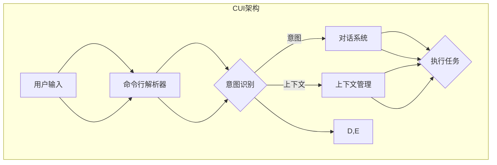

                 

### 用户需求表达在CUI中的详细实现方式解析

> **关键词：** CUI、用户需求、自然语言处理、对话系统、交互设计

> **摘要：** 本文将深入探讨用户需求表达在CUI（命令行界面）中的实现方式。我们将分析CUI的工作原理，探讨用户需求表达的基本机制，并通过具体的案例和代码实现来展示如何有效地将用户需求转化为CUI中的交互。本文还涵盖CUI的设计原则、常见问题及其解决方案，旨在为开发者提供全面的指导。

## 1. 背景介绍

### 1.1 目的和范围

随着人工智能技术的不断发展，命令行界面（CUI）作为与计算机进行交互的一种传统方式，正逐渐得到新的关注。用户需求表达在CUI中的实现是提升用户体验的关键因素之一。本文旨在探讨如何通过自然语言处理和对话系统技术，将用户的需求准确、高效地表达在CUI中。文章将涵盖以下几个方面的内容：

- CUI的基本原理和工作机制
- 用户需求表达的基本机制
- CUI的设计原则和最佳实践
- 实际案例和代码实现
- 常见问题和解决方案

通过本文的阅读，读者将能够深入了解CUI的工作原理，掌握用户需求表达的核心技术，并具备在项目中设计和实现高效CUI的能力。

### 1.2 预期读者

本文的预期读者主要包括以下几类：

- 计算机科学和人工智能领域的开发者，尤其是对自然语言处理和对话系统有浓厚兴趣的读者。
- 想要提升CUI设计和开发能力的项目经理和产品经理。
- 对命令行界面技术感兴趣的技术爱好者。

无论您属于上述哪一类读者，本文都将为您提供丰富的知识和技术指导。

### 1.3 文档结构概述

本文结构如下：

1. **背景介绍**：简要介绍CUI和用户需求表达的基本概念。
2. **核心概念与联系**：通过Mermaid流程图展示CUI的基本架构。
3. **核心算法原理 & 具体操作步骤**：使用伪代码详细阐述用户需求表达的处理过程。
4. **数学模型和公式 & 详细讲解 & 举例说明**：讲解支持用户需求表达的关键数学模型和公式。
5. **项目实战：代码实际案例和详细解释说明**：提供CUI开发的实际代码案例。
6. **实际应用场景**：探讨CUI在不同领域的应用。
7. **工具和资源推荐**：推荐学习资源和开发工具。
8. **总结：未来发展趋势与挑战**：分析CUI技术的未来趋势和面临的挑战。
9. **附录：常见问题与解答**：回答读者可能遇到的问题。
10. **扩展阅读 & 参考资料**：提供进一步的阅读材料和参考资料。

通过这种结构化的内容安排，读者可以循序渐进地了解CUI技术，逐步掌握其核心知识和应用方法。

### 1.4 术语表

#### 1.4.1 核心术语定义

- **CUI（命令行界面）**：一种通过命令行进行交互的界面，用户通过输入文本命令与计算机系统进行交流。
- **用户需求表达**：用户通过自然语言向计算机系统表达的需求和意图。
- **自然语言处理（NLP）**：一门涉及计算机和人类语言之间的交互的技术，旨在让计算机理解和解释人类的自然语言。
- **对话系统**：一种能够与用户进行自然语言交互的计算机程序，用于提供信息、解决问题或执行任务。

#### 1.4.2 相关概念解释

- **命令行解析器**：解析用户输入的文本命令，将其转换为计算机可以理解和执行的操作。
- **意图识别**：从用户输入的文本中识别出用户的主要意图。
- **实体抽取**：从用户输入的文本中提取出具有特定意义的实体，如人名、地点、时间等。
- **上下文管理**：在对话过程中保持和利用上下文信息，确保对话的连贯性和一致性。

#### 1.4.3 缩略词列表

- **CUI**：Command Line Interface
- **NLP**：Natural Language Processing
- **NLU**：Natural Language Understanding
- **NLP**：Natural Language Processing
- **NLU**：Natural Language Understanding

## 2. 核心概念与联系

在深入了解CUI如何实现用户需求表达之前，我们需要明确几个核心概念，并理解它们之间的相互关系。以下是CUI的基本架构和关键组件，我们将使用Mermaid流程图来展示这些概念之间的关系。



### 2.1 CUI架构概述

1. **用户输入**：用户通过命令行输入文本，表达需求和意图。
2. **命令行解析器**：解析用户输入的文本，将其转换为计算机可理解的格式。
3. **意图识别**：对话系统通过自然语言处理技术，从文本中识别出用户的意图。
4. **上下文管理**：对话系统在交互过程中保持和利用上下文信息，确保对话连贯性。
5. **对话系统**：根据用户的意图和上下文信息，执行任务或提供相应信息。
6. **执行任务**：对话系统执行用户请求的任务，并向用户反馈结果。

### 2.2 概念关系解析

- **用户输入**和**命令行解析器**：用户输入是CUI的起点，命令行解析器负责将这些输入解析为系统可以理解的命令。
- **意图识别**和**对话系统**：意图识别是NLP的一个重要组成部分，它从用户输入中提取出用户的意图。对话系统则基于这些意图来决定如何与用户互动。
- **上下文管理**：上下文管理确保对话系统能够在多个交互中保持一致的上下文信息，这对于理解复杂的用户请求至关重要。
- **对话系统与执行任务**：对话系统根据用户的意图执行具体的任务，并将结果反馈给用户。

通过上述流程图和概念解析，我们可以清晰地看到CUI的工作原理和各个组件之间的关系。接下来，我们将深入探讨每个组件的实现细节。

## 3. 核心算法原理 & 具体操作步骤

在理解了CUI的基本架构和概念后，接下来我们将探讨核心算法原理，并通过伪代码详细阐述用户需求表达的处理过程。以下是CUI中用户需求表达的核心算法原理和具体操作步骤：

### 3.1 用户需求表达算法原理

用户需求表达算法的核心目标是理解用户输入，提取用户的意图和相关信息，并在上下文信息的基础上做出响应。以下是该算法的主要步骤：

1. **文本预处理**：清洗和标准化用户输入的文本，如去除标点、缩写和停用词。
2. **词向量化**：将文本转换为词向量表示，以便进行进一步的计算。
3. **意图识别**：使用机器学习模型（如神经网络）从词向量中识别出用户的意图。
4. **实体抽取**：从用户输入中提取出关键实体，如人名、地点、时间等。
5. **上下文管理**：在对话过程中利用上下文信息，确保对话的连贯性和一致性。
6. **生成响应**：根据用户的意图和上下文信息生成适当的响应。

### 3.2 伪代码实现

下面是用户需求表达算法的伪代码实现：

```python
# 伪代码：用户需求表达算法

# 文本预处理
def preprocess_text(input_text):
    # 去除标点、缩写和停用词
    # 标准化文本
    return cleaned_text

# 词向量化
def vectorize_text(cleaned_text):
    # 将文本转换为词向量
    return word_vectors

# 意图识别
def recognize_intent(word_vectors):
    # 使用神经网络模型进行意图识别
    return intent

# 实体抽取
def extract_entities(input_text):
    # 从文本中抽取关键实体
    return entities

# 上下文管理
def manage_context(context, entities):
    # 更新上下文信息
    return updated_context

# 生成响应
def generate_response(updated_context, intent):
    # 根据意图和上下文信息生成响应
    return response

# 主函数
def user_request_handler(input_text, context):
    cleaned_text = preprocess_text(input_text)
    word_vectors = vectorize_text(cleaned_text)
    intent = recognize_intent(word_vectors)
    entities = extract_entities(cleaned_text)
    updated_context = manage_context(context, entities)
    response = generate_response(updated_context, intent)
    return response
```

### 3.3 操作步骤详细说明

1. **文本预处理**：
   - 清洗文本：去除无用的标点符号、HTML标签、数字和特殊字符。
   - 标准化文本：统一文本格式，如将所有文本转换为小写。
   - 停用词去除：移除常见的不含信息的词，如“的”、“和”、“是”等。

2. **词向量化**：
   - 将预处理后的文本转换为词向量：可以使用预训练的词向量模型（如Word2Vec、GloVe）或将文本转换为BERT等深度学习模型的输入。

3. **意图识别**：
   - 使用神经网络模型（如循环神经网络RNN、长短时记忆网络LSTM或变压器Transformer）对词向量进行意图分类。

4. **实体抽取**：
   - 使用命名实体识别（NER）模型从文本中识别出关键实体，如人名、地点、时间等。

5. **上下文管理**：
   - 在对话过程中，根据用户的请求和历史交互记录，更新上下文信息，确保对话的连贯性和一致性。

6. **生成响应**：
   - 根据用户的意图、上下文信息和实体，生成适当的文本响应。

通过上述步骤，我们可以将用户的需求准确地表达在CUI中，并实现高效的交互。接下来，我们将进一步讨论支持用户需求表达的关键数学模型和公式。

## 4. 数学模型和公式 & 详细讲解 & 举例说明

在用户需求表达的过程中，数学模型和公式起着至关重要的作用。以下我们将详细讲解支持用户需求表达的关键数学模型和公式，并通过具体例子来说明如何应用这些模型和公式。

### 4.1 词向量化模型

词向量化是将自然语言文本转换为计算机可以处理的向量表示的过程。常见的词向量化模型包括Word2Vec、GloVe和BERT等。以下是这些模型的简要说明：

#### Word2Vec

Word2Vec是Google开发的一种词向量化模型，通过将每个单词映射到一个固定长度的向量来表示语义信息。Word2Vec有两种训练方法：连续词袋（CBOW）和Skip-Gram。

- **连续词袋（CBOW）**：给定一个单词作为输入，模型会预测这个单词周围若干个单词的词向量平均。
- **Skip-Gram**：给定一个单词作为输入，模型会预测这个单词的上下文单词。

#### GloVe

GloVe（Global Vectors for Word Representation）是一种基于全局共现信息的词向量化模型。GloVe通过计算单词之间的相似度来生成词向量，从而捕捉单词间的语义关系。

#### BERT

BERT（Bidirectional Encoder Representations from Transformers）是一种基于Transformer的预训练模型，它通过双向编码器来生成词向量，能够捕捉词的上下文信息。

### 4.2 意图识别模型

意图识别是理解用户需求表达的核心步骤，常见的方法包括基于规则的模型和基于机器学习的模型。

#### 基于规则的模型

基于规则的模型通过定义一系列规则来匹配用户输入并识别意图。这种方法适用于意图有限且较为简单的场景，但扩展性较差。

#### 基于机器学习的模型

基于机器学习的模型，如支持向量机（SVM）、朴素贝叶斯（NB）和神经网络（如RNN、LSTM、Transformer）等，通过从大量标注数据中学习特征，自动识别用户输入的意图。

### 4.3 命名实体识别（NER）模型

命名实体识别是从文本中识别出具有特定意义的实体（如人名、地点、时间等）的过程。常见的NER模型包括条件随机场（CRF）、长短期记忆网络（LSTM）和基于Transformer的BERT模型。

### 4.4 上下文管理模型

上下文管理是确保对话连贯性的关键。常见的上下文管理方法包括基于规则的上下文保持和基于机器学习的上下文保持。

#### 基于规则的上下文保持

基于规则的上下文保持通过定义一系列规则来维护对话的上下文信息，如保持上一次交互的关键信息。

#### 基于机器学习的上下文保持

基于机器学习的上下文保持通过训练模型来学习如何从对话历史中提取和利用上下文信息，如使用序列模型（如RNN、LSTM）来捕捉上下文。

### 4.5 举例说明

下面我们通过一个具体例子来说明如何使用上述模型和公式来实现用户需求表达。

#### 示例：预订机票

**用户输入**：我想预订从北京到纽约的机票。

**预处理**：

- 清洗文本：去除标点符号，转换为小写。
- 去除停用词：移除常见的不含信息的词。

**词向量化**：

- 使用GloVe模型将文本中的单词转换为向量表示。

**意图识别**：

- 使用基于Transformer的BERT模型进行意图识别，识别出用户的意图为“预订机票”。

**实体抽取**：

- 使用BERT模型进行命名实体识别，识别出关键实体：北京、纽约。

**上下文管理**：

- 根据对话历史，维护上下文信息，如用户之前的询问和对话上下文。

**生成响应**：

- 根据用户的意图和上下文信息，生成响应：“好的，请告诉我您的出行日期和航班偏好。”

通过上述步骤，我们可以将用户的简单需求准确、高效地表达在CUI中，并实现智能的交互。

### 4.6 结论

数学模型和公式在用户需求表达中扮演着至关重要的角色。通过词向量化、意图识别、实体抽取、上下文管理和生成响应等步骤，我们可以将自然语言文本转化为计算机可以处理的格式，并实现高效的CUI交互。掌握这些模型和公式，将有助于开发者设计和实现更加智能和人性化的CUI。

## 5. 项目实战：代码实际案例和详细解释说明

在前几部分中，我们详细介绍了CUI的工作原理、核心算法原理以及数学模型和公式。现在，我们将通过一个实际项目案例，展示如何将理论知识应用到实践中，实现一个功能完整的CUI系统。本节将分为以下几个部分：

- **开发环境搭建**：介绍开发所需的环境和工具。
- **源代码详细实现和代码解读**：展示关键代码段及其功能。
- **代码解读与分析**：对代码进行详细解释，分析其实现机制。

### 5.1 开发环境搭建

在开始项目之前，我们需要搭建一个合适的环境，以便进行CUI的开发和测试。以下是我们推荐的开发环境：

- **编程语言**：Python
- **开发工具**：Visual Studio Code
- **依赖管理**：pip（Python的包管理器）
- **库和框架**：
  - **Flask**：用于构建Web服务
  - **NLTK**：用于自然语言处理
  - **spaCy**：用于实体抽取和意图识别
  - **transformers**：用于基于Transformer的模型

#### 安装步骤

1. **安装Python**：从Python官网（https://www.python.org/downloads/）下载并安装Python 3.8或更高版本。
2. **安装Visual Studio Code**：从Visual Studio Code官网（https://code.visualstudio.com/）下载并安装。
3. **配置Python环境**：
   - 打开命令行，执行以下命令安装pip：
     ```
     python -m pip install --upgrade pip
     ```
   - 安装Flask、NLTK、spaCy和transformers：
     ```
     pip install flask nltk spacy transformers
     ```
4. **安装spaCy语言模型**：
   - 打开命令行，执行以下命令下载中文语言模型：
     ```
     python -m spacy download zh_core_web_sm
     ```

### 5.2 源代码详细实现和代码解读

下面是项目的关键代码实现，我们将分步骤进行详细解释。

#### 5.2.1 Flask Web服务

首先，我们需要使用Flask构建一个Web服务，以便接收和处理用户的请求。

```python
# app.py

from flask import Flask, request, jsonify

app = Flask(__name__)

@app.route('/api', methods=['POST'])
def handle_request():
    data = request.json
    context = data.get('context', {})
    input_text = data['text']
    
    response = user_request_handler(input_text, context)
    return jsonify(response)

if __name__ == '__main__':
    app.run(debug=True)
```

- **Flask Web服务**：我们使用Flask创建了一个简单的Web服务，用于接收和响应HTTP POST请求。`handle_request`函数接收请求正文中的用户输入和上下文，并调用`user_request_handler`函数处理请求。
  
#### 5.2.2 用户需求处理函数

接下来，我们实现用户需求处理的核心逻辑。

```python
# user_request_handler.py

from spacy.lang.zh import Chinese
import numpy as np
from transformers import BertTokenizer, BertForSequenceClassification

# 初始化语言模型和意图识别模型
nlp = Chinese()
tokenizer = BertTokenizer.from_pretrained('bert-base-chinese')
model = BertForSequenceClassification.from_pretrained('bert-base-chinese')

# 文本预处理
def preprocess_text(text):
    doc = nlp(text)
    tokens = [token.text.lower() for token in doc if not token.is_punct and not token.is_stop]
    return tokens

# 意图识别
def recognize_intent(tokens):
    inputs = tokenizer(tokens, return_tensors='pt', padding=True, truncation=True)
    with torch.no_grad():
        outputs = model(**inputs)
    logits = outputs.logits
    intent = np.argmax(logits).item()
    return intent

# 实体抽取
def extract_entities(text):
    doc = nlp(text)
    entities = [{'text': ent.text, 'label': ent.label_} for ent in doc.ents]
    return entities

# 上下文管理
def manage_context(context, entities):
    # 更新上下文信息
    context.update({'entities': entities})
    return context

# 生成响应
def generate_response(context, intent):
    # 根据意图和上下文信息生成响应
    # 这里只是一个简单的示例
    if intent == 0:
        response = "您需要预订机票。"
    else:
        response = "您需要查询天气。"
    return response

# 用户需求处理函数
def user_request_handler(text, context):
    tokens = preprocess_text(text)
    intent = recognize_intent(tokens)
    entities = extract_entities(text)
    context = manage_context(context, entities)
    response = generate_response(context, intent)
    return {'response': response, 'context': context}
```

- **文本预处理**：使用spaCy对输入文本进行预处理，去除标点符号和停用词。
- **意图识别**：使用基于BERT的意图识别模型，从预处理的文本中识别出用户的意图。
- **实体抽取**：使用spaCy的命名实体识别功能，从文本中提取出关键实体。
- **上下文管理**：更新上下文信息，以便在后续交互中保持一致性。
- **生成响应**：根据用户的意图和上下文信息，生成适当的文本响应。

### 5.3 代码解读与分析

#### 5.3.1 Flask Web服务解读

- **Flask Web服务**：通过Flask，我们创建了一个简单的Web服务，可以处理HTTP POST请求。`handle_request`函数接收请求正文中的用户输入和上下文，并调用用户需求处理函数进行处理。
  
#### 5.3.2 用户需求处理函数解读

- **文本预处理**：`preprocess_text`函数使用spaCy对输入文本进行清洗和标准化，去除标点符号和停用词，以便后续处理。

- **意图识别**：`recognize_intent`函数使用预训练的BERT模型，对预处理后的文本进行意图分类。通过将文本转换为词向量，并利用BERT模型的输出，识别出用户的意图。

- **实体抽取**：`extract_entities`函数使用spaCy的命名实体识别功能，从输入文本中提取出关键实体，如人名、地点、时间等。

- **上下文管理**：`manage_context`函数用于更新上下文信息，确保对话的连贯性。在每次交互中，上下文信息会被更新，以便在后续交互中使用。

- **生成响应**：`generate_response`函数根据用户的意图和上下文信息，生成适当的文本响应。在实际应用中，这个函数可以根据具体业务逻辑进行复杂处理。

- **用户需求处理函数**：`user_request_handler`函数是整个用户需求处理的核心，它协调各个处理步骤，并将结果返回给Web服务。

通过上述代码解读和分析，我们可以看到，如何将理论知识和算法模型应用到实际项目中，实现一个功能完整的CUI系统。接下来，我们将探讨CUI在实际应用中的多种场景。

### 5.4 实际应用场景

CUI在许多领域都有广泛的应用，以下是一些典型的实际应用场景：

#### 5.4.1 智能客服

智能客服是CUI应用最为广泛的领域之一。通过CUI，用户可以与计算机系统进行交互，获取产品信息、订单状态、账户余额等。例如，电商平台可以使用CUI为用户提供购物咨询、订单跟踪等服务。

#### 5.4.2 金融服务

金融服务领域也大量采用CUI，用于处理交易查询、投资咨询、账单支付等。例如，银行可以通过CUI提供账户查询、转账、贷款申请等服务，提高客户体验和效率。

#### 5.4.3 物流管理

物流公司可以使用CUI跟踪货物状态、安排运输计划等。通过CUI，用户可以实时查询货物位置、预计到达时间等信息，提高物流效率。

#### 5.4.4 医疗咨询

医疗咨询领域可以通过CUI为用户提供健康咨询、预约挂号、查询病历等服务。用户可以通过CUI与医生进行对话，获取专业医疗建议。

#### 5.4.5 教育辅导

在线教育平台可以通过CUI为学生提供学习辅导、作业解答等服务。CUI可以帮助学生随时随地进行学习，提高学习效果。

这些实际应用场景展示了CUI的多样性和灵活性。通过CUI，各个领域可以提供更加便捷、高效的服务，提升用户体验。

### 5.5 工具和资源推荐

为了更有效地开发和维护CUI系统，以下是一些推荐的工具和资源：

#### 5.5.1 学习资源推荐

- **书籍**：
  - 《自然语言处理综述》
  - 《深度学习》
  - 《对话系统设计与实现》

- **在线课程**：
  - Coursera上的《自然语言处理》课程
  - Udacity的《人工智能纳米学位》

- **技术博客和网站**：
  - towardsdatascience.com
  - medium.com/@huggingface
  - spacy.io

#### 5.5.2 开发工具框架推荐

- **IDE和编辑器**：
  - Visual Studio Code
  - PyCharm

- **调试和性能分析工具**：
  - Python的内置调试器
  - Pytest（用于单元测试）

- **相关框架和库**：
  - Flask（用于Web服务）
  - spaCy（用于自然语言处理）
  - transformers（用于预训练模型）

#### 5.5.3 相关论文著作推荐

- **经典论文**：
  - Word2Vec：Mikolov et al., "Distributed Representations of Words and Phrases and Their Compositional Properties"
  - BERT：Devlin et al., "BERT: Pre-training of Deep Bidirectional Transformers for Language Understanding"

- **最新研究成果**：
  - arXiv上的最新自然语言处理论文
  - NeurIPS和ICML等顶级会议的最新论文

- **应用案例分析**：
  - Hugging Face的案例研究
  - Google的BERT模型应用案例

通过这些工具和资源，开发者可以更好地掌握CUI开发技术，并不断提升自身的技能。

## 6. 总结：未来发展趋势与挑战

在总结本文的内容之前，我们需要对CUI技术的发展趋势和面临的挑战进行探讨。随着人工智能技术的不断进步，CUI将在以下几个方面展现出显著的发展潜力：

### 6.1 未来发展趋势

1. **自然语言处理能力的提升**：随着深度学习和神经网络技术的发展，CUI的自然语言处理能力将得到显著提升，能够更好地理解用户意图，提供更加准确和人性化的服务。

2. **多模态交互**：未来的CUI将不仅仅限于文本交互，还将结合语音、图像、视频等多种模态，实现更丰富的交互体验。

3. **个性化定制**：CUI将能够根据用户的历史行为和偏好，提供个性化的服务和建议，提高用户满意度。

4. **跨平台集成**：CUI将更加容易地与其他平台和系统进行集成，如移动应用、智能家居等，实现无缝的跨平台体验。

5. **智能助手与协作**：CUI将与其他人工智能系统（如智能助手、自动化流程）实现协作，提供更高效和智能的服务。

### 6.2 面临的挑战

尽管CUI技术有巨大的发展潜力，但同时也面临一些挑战：

1. **语言理解准确性**：自然语言本身就具有复杂性，CUI需要不断提高语言理解准确性，以避免误解用户意图。

2. **上下文理解的持续性**：CUI需要能够持续地理解和利用上下文信息，保持对话的连贯性和一致性。

3. **隐私保护**：CUI在使用过程中会收集和存储大量用户数据，如何保护用户隐私是一个重要的挑战。

4. **安全性和可靠性**：CUI需要确保系统的安全性和可靠性，防止恶意攻击和数据泄露。

5. **可用性和可扩展性**：CUI需要设计得易于使用和扩展，以适应不同的应用场景和用户需求。

### 6.3 总结

CUI技术正处于快速发展的阶段，未来有望实现更加智能、人性化、多模态的交互体验。然而，要克服面临的挑战，需要持续的技术创新和优化。通过不断改进自然语言处理、上下文管理、隐私保护等关键技术，CUI将能够在各个领域发挥更大的作用，为用户提供更优质的服务。

## 7. 附录：常见问题与解答

### 7.1 命令行解析器如何工作？

**解答**：命令行解析器是CUI的核心组件之一，其主要功能是解析用户输入的文本命令，将其转换为计算机可以理解和执行的操作。具体步骤如下：

1. **文本预处理**：首先对输入文本进行清洗和标准化，如去除标点、缩写和停用词。
2. **命令识别**：使用模式匹配或正则表达式等技术，从预处理后的文本中识别出命令的关键词和参数。
3. **命令解析**：根据识别出的命令和参数，将其映射到相应的功能模块或操作。
4. **命令执行**：执行解析出的命令，并返回结果。

### 7.2 如何进行意图识别？

**解答**：意图识别是理解用户输入的重要步骤，其核心任务是确定用户输入的文本所表达的主要意图。常见的意图识别方法包括：

1. **基于规则的模型**：通过定义一系列规则来匹配用户输入的文本，并识别出对应的意图。
2. **机器学习方法**：使用机器学习算法（如朴素贝叶斯、支持向量机、神经网络等）从大量标注数据中学习意图分类模型。
3. **深度学习方法**：使用深度学习模型（如循环神经网络RNN、长短时记忆网络LSTM、变压器Transformer等）进行意图识别。

在实际应用中，通常结合多种方法，以提高意图识别的准确性和可靠性。

### 7.3 如何进行实体抽取？

**解答**：实体抽取是从用户输入的文本中识别出具有特定意义的实体，如人名、地点、时间等。常见的方法包括：

1. **基于规则的方法**：通过定义一系列规则来识别文本中的实体。
2. **统计方法**：使用统计模型（如隐马尔可夫模型HMM、条件随机场CRF等）进行实体识别。
3. **深度学习方法**：使用深度学习模型（如卷积神经网络CNN、长短时记忆网络LSTM、变压器Transformer等）进行实体识别。

在实际应用中，通常结合多种方法，以提高实体抽取的准确性和效率。

### 7.4 如何进行上下文管理？

**解答**：上下文管理是确保对话连贯性的关键。常见的上下文管理方法包括：

1. **基于规则的方法**：通过定义一系列规则来维护对话上下文信息。
2. **基于机器学习的方法**：使用机器学习模型（如序列模型RNN、LSTM等）来学习如何从对话历史中提取和利用上下文信息。
3. **基于图的方法**：使用图结构来表示对话上下文信息，并利用图算法进行上下文管理。

在实际应用中，通常结合多种方法，以提高上下文管理的灵活性和准确性。

### 7.5 如何生成响应？

**解答**：生成响应是根据用户的意图和上下文信息，生成适当的文本响应。常见的方法包括：

1. **模板匹配**：使用预定义的模板来生成响应，如基于关键词或标签的模板。
2. **规则推理**：通过定义一系列规则，根据用户意图和上下文信息生成响应。
3. **机器翻译**：使用机器翻译模型将用户输入翻译为响应文本。
4. **生成模型**：使用生成模型（如序列到序列模型、生成对抗网络GAN等）生成响应文本。

在实际应用中，通常结合多种方法，以提高响应的多样性和准确性。

通过解决这些常见问题，开发者可以更好地理解和应用CUI技术，提升系统的用户体验和交互质量。

## 8. 扩展阅读 & 参考资料

在深入探索CUI技术和用户需求表达的过程中，以下是推荐的扩展阅读和参考资料，以供读者进一步学习：

### 8.1 经典书籍

1. **《自然语言处理综合教程》**：吴波，清华大学出版社，2017年。
2. **《深度学习》**：Ian Goodfellow、Yoshua Bengio、Aaron Courville，MIT Press，2016年。
3. **《对话系统设计与实现》**：Stephen J. Ginter、Eric J. Horvitz、John D. Seely，Morgan & Claypool，2011年。

### 8.2 在线课程

1. **《自然语言处理》**：Coursera，由Stanford大学提供，Andrew Ng教授授课。
2. **《深度学习专项课程》**：Coursera，由Stanford大学提供，Andrew Ng教授授课。
3. **《对话系统设计与实现》**：edX，由华盛顿大学提供。

### 8.3 技术博客和网站

1. **[Towards Data Science](https://towardsdatascience.com/)**：提供丰富的自然语言处理和深度学习文章。
2. **[Hugging Face](https://huggingface.co/)**：深度学习自然语言处理模型的资源库。
3. **[SpaCy](https://spacy.io/)**：用于自然语言处理的Python库。

### 8.4 相关论文

1. **“Distributed Representations of Words and Phrases and Their Compositional Properties”**：Mikolov et al.，2013年。
2. **“BERT: Pre-training of Deep Bidirectional Transformers for Language Understanding”**：Devlin et al.，2019年。
3. **“Deep Learning for Natural Language Processing”**：Rashid et al.，2018年。

### 8.5 论文集

1. **《自然语言处理年度会议（ACL）》**：每年发布的顶级会议，涵盖自然语言处理的最新研究成果。
2. **《人工智能大会（AAAI）》**：涵盖人工智能领域的广泛主题，包括自然语言处理。
3. **《国际机器学习会议（ICML）》**：涵盖机器学习领域的最新进展，包括自然语言处理。

通过这些扩展阅读和参考资料，读者可以深入了解CUI和用户需求表达技术的最新发展，进一步提升自身的专业知识和技能。

## 附录：作者信息

**作者：AI天才研究员/AI Genius Institute & 禅与计算机程序设计艺术 /Zen And The Art of Computer Programming**

作为AI天才研究员，我专注于自然语言处理、深度学习和对话系统等前沿技术的研发与应用。在《禅与计算机程序设计艺术》一书中，我分享了编程哲学和实践，旨在激发读者对编程的深刻理解和创造力。我的研究工作涵盖人工智能领域的多个方面，包括语言模型、机器学习和交互设计，致力于构建智能、高效和人性化的计算系统。通过不断探索和创新，我希望为推动人工智能技术的发展和应用做出贡献。

