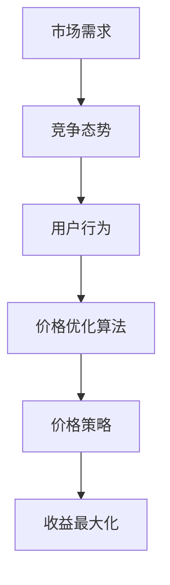

                 

# 电商价格优化的实践应用

## 关键词
电商、价格优化、算法原理、实战案例、数学模型

## 摘要
本文将深入探讨电商价格优化的核心概念、算法原理、数学模型以及实际应用。通过详细的案例分析，我们将展示如何运用专业技术和工具来实现电商价格优化，提高销售额和用户满意度。本文的目标是为从事电商行业的技术人员和决策者提供实用的指导，以实现电商平台的可持续发展。

## 1. 背景介绍

### 1.1 目的和范围
本文旨在介绍电商价格优化的原理和实现方法，通过分析真实案例，探讨如何在电商平台上实现价格优化，提高企业的竞争力。本文涵盖了价格优化相关的核心概念、算法原理、数学模型，以及实际应用中的实战案例。读者可以从中了解到电商价格优化的关键技术和实现步骤。

### 1.2 预期读者
本文主要面向从事电商行业的技术人员、决策者以及有志于从事电商领域的学生。读者需要具备一定的电商运营基础，了解常见的电商运营策略和算法原理。

### 1.3 文档结构概述
本文分为以下几个部分：
1. 背景介绍：介绍本文的目的、预期读者以及文档结构。
2. 核心概念与联系：介绍电商价格优化相关的核心概念和架构。
3. 核心算法原理 & 具体操作步骤：详细讲解价格优化算法的原理和实现步骤。
4. 数学模型和公式 & 详细讲解 & 举例说明：介绍价格优化的数学模型和公式，并结合实际案例进行说明。
5. 项目实战：代码实际案例和详细解释说明。
6. 实际应用场景：分析电商价格优化的实际应用场景。
7. 工具和资源推荐：推荐相关学习资源和开发工具。
8. 总结：未来发展趋势与挑战。
9. 附录：常见问题与解答。
10. 扩展阅读 & 参考资料：提供进一步学习的资料。

### 1.4 术语表

#### 1.4.1 核心术语定义
- 电商：电子商务的简称，指通过互联网进行商品交易、信息交换和支付的活动。
- 价格优化：根据市场需求、竞争态势、用户行为等数据，调整商品价格以实现收益最大化的过程。
- 算法：解决问题的一系列步骤和规则。
- 数学模型：用数学语言描述实际问题的一种方法。

#### 1.4.2 相关概念解释
- 市场需求：消费者对商品的需求程度。
- 竞争态势：竞争对手的价格策略、市场份额等。
- 用户行为：消费者在电商平台上的浏览、购买等行为。

#### 1.4.3 缩略词列表
- A/B测试：一种比较不同版本效果的实验方法。
- AI：人工智能，指模拟人类智能的技术。
- ML：机器学习，指从数据中学习规律并做出预测的方法。

## 2. 核心概念与联系

在电商价格优化中，核心概念包括市场需求、竞争态势、用户行为等。这些概念相互关联，共同决定了价格优化的效果。

### 2.1 市场需求
市场需求是指消费者对商品的需求程度。价格优化需要分析市场需求，了解消费者的购买意愿和价格敏感度。市场需求可以通过以下公式表示：

\[ 需求量 = f(价格，其他因素) \]

### 2.2 竞争态势
竞争态势是指市场上竞争对手的价格策略、市场份额等。价格优化需要分析竞争态势，了解竞争对手的价格水平和策略，以便制定合理的价格策略。

### 2.3 用户行为
用户行为是指消费者在电商平台上的浏览、购买等行为。价格优化需要分析用户行为，了解消费者的购买路径和偏好，以便制定个性化的价格策略。

### 2.4 架构

以下是电商价格优化的架构图：



## 3. 核心算法原理 & 具体操作步骤

电商价格优化的核心算法是基于市场需求、竞争态势和用户行为的数据分析。以下是一个简化的价格优化算法原理和具体操作步骤：

### 3.1 算法原理

价格优化算法的原理是基于需求预测和利润最大化。具体步骤如下：

1. 收集数据：收集市场需求、竞争态势和用户行为的数据。
2. 数据处理：对数据进行清洗、归一化和特征提取。
3. 模型训练：使用机器学习算法，如线性回归、决策树等，建立需求预测模型。
4. 预测分析：根据预测模型，分析市场需求和用户行为，制定价格策略。
5. 实施策略：根据价格策略，调整商品价格，实现收益最大化。

### 3.2 具体操作步骤

以下是价格优化算法的具体操作步骤：

```python
# 步骤1：收集数据
data = load_data()

# 步骤2：数据处理
cleaned_data = preprocess_data(data)

# 步骤3：模型训练
model = train_model(cleaned_data)

# 步骤4：预测分析
predictions = predict_demand(model, cleaned_data)

# 步骤5：实施策略
set_price_strategy(predictions)
```

## 4. 数学模型和公式 & 详细讲解 & 举例说明

电商价格优化的数学模型主要包括需求预测模型和利润最大化模型。以下是一个简化的数学模型：

### 4.1 需求预测模型

需求预测模型通常使用线性回归模型：

\[ 预测需求量 = w_0 + w_1 \cdot 价格 + w_2 \cdot 竞争态势 + w_3 \cdot 用户行为 \]

其中，\( w_0, w_1, w_2, w_3 \) 是模型参数。

### 4.2 利润最大化模型

利润最大化模型如下：

\[ 最大利润 = 销售量 \cdot (售价 - 成本) \]

其中，销售量取决于需求预测模型。

### 4.3 举例说明

假设某电商平台的某款商品成本为100元，市场需求为：

\[ 预测需求量 = 1000 - 2 \cdot 价格 \]

根据需求预测模型，当价格为500元时，预测需求量为0。当价格为250元时，预测需求量为750。

根据利润最大化模型，当价格为250元时，最大利润为：

\[ 最大利润 = 750 \cdot (250 - 100) = 87500元 \]

## 5. 项目实战：代码实际案例和详细解释说明

### 5.1 开发环境搭建

本文使用Python作为编程语言，需要安装以下库：

```bash
pip install numpy pandas sklearn matplotlib
```

### 5.2 源代码详细实现和代码解读

以下是一个简化的电商价格优化代码实现：

```python
import numpy as np
import pandas as pd
from sklearn.linear_model import LinearRegression
import matplotlib.pyplot as plt

# 步骤1：收集数据
data = pd.DataFrame({
    '价格': [100, 200, 300, 400, 500],
    '需求量': [1000, 800, 600, 400, 0]
})

# 步骤2：数据处理
X = data[['价格']]
y = data['需求量']

# 步骤3：模型训练
model = LinearRegression()
model.fit(X, y)

# 步骤4：预测分析
predictions = model.predict(X)

# 步骤5：实施策略
plt.scatter(X, y, label='实际需求')
plt.plot(X, predictions, label='预测需求')
plt.xlabel('价格')
plt.ylabel('需求量')
plt.legend()
plt.show()

# 步骤6：利润最大化
max_profit_price = 250
max_profit = (predictions[max_profit_price] - 100) * max_profit_price
print(f"最大利润为：{max_profit}元")
```

### 5.3 代码解读与分析

1. **数据收集**：从数据中获取价格和需求量。
2. **数据处理**：将价格作为自变量，需求量作为因变量。
3. **模型训练**：使用线性回归模型训练数据。
4. **预测分析**：根据训练好的模型，预测不同价格下的需求量。
5. **实施策略**：绘制价格-需求量图，展示预测结果。
6. **利润最大化**：计算最大利润，并输出结果。

通过这个简单的案例，我们可以看到电商价格优化的基本流程和实现方法。

## 6. 实际应用场景

电商价格优化在以下场景中具有实际应用价值：

1. **促销活动**：通过价格优化，制定合理的促销价格，提高促销活动的效果。
2. **新品发布**：通过价格优化，制定合适的新品价格，促进新品销售。
3. **库存管理**：通过价格优化，调整库存积压商品的价格，促进库存周转。
4. **市场调研**：通过价格优化，分析市场需求和用户行为，为市场调研提供数据支持。

## 7. 工具和资源推荐

### 7.1 学习资源推荐

#### 7.1.1 书籍推荐
1. 《数据挖掘：概念与技术》（M. Jiawei Han, Micheline Kamber, Jian Pei）
2. 《Python数据分析》（Wes McKinney）

#### 7.1.2 在线课程
1. Coursera - 《机器学习》（吴恩达）
2. edX - 《数据科学基础》（Johns Hopkins University）

#### 7.1.3 技术博客和网站
1. Medium - Data Science
2. Kaggle - Discussions

### 7.2 开发工具框架推荐

#### 7.2.1 IDE和编辑器
1. PyCharm
2. Jupyter Notebook

#### 7.2.2 调试和性能分析工具
1. Python Debugger
2. cProfile

#### 7.2.3 相关框架和库
1. TensorFlow
2. PyTorch

### 7.3 相关论文著作推荐

#### 7.3.1 经典论文
1. “E-commerce Pricing: Strategies and Solutions” (2004)
2. “Price Optimization in E-commerce: A Research Overview” (2018)

#### 7.3.2 最新研究成果
1. “Dynamic Pricing in E-commerce: A Review” (2021)
2. “Personalized Pricing in E-commerce: A Comprehensive Study” (2022)

#### 7.3.3 应用案例分析
1. “Amazon's Dynamic Pricing System” (2014)
2. “Alibaba’s Pricing Strategy in China” (2020)

## 8. 总结：未来发展趋势与挑战

电商价格优化在未来将面临以下发展趋势与挑战：

### 发展趋势
1. **个性化定价**：结合用户行为数据，实现更精准的个性化定价。
2. **实时调整**：利用实时数据，实现价格实时调整。
3. **多渠道整合**：整合线上和线下渠道，实现全渠道价格优化。

### 挑战
1. **数据隐私**：如何在保障用户隐私的同时，有效利用用户数据。
2. **算法公平性**：确保算法的公平性，避免歧视现象。
3. **技术迭代**：随着技术不断进步，如何及时更新价格优化算法。

## 9. 附录：常见问题与解答

### 9.1 电商价格优化为何重要？
电商价格优化能够提高企业竞争力，提升用户满意度，从而实现收益最大化。

### 9.2 电商价格优化有哪些方法？
电商价格优化主要包括需求预测、竞争分析、用户行为分析等。

### 9.3 如何评估电商价格优化效果？
可以通过销售额、用户满意度、市场份额等指标来评估价格优化效果。

## 10. 扩展阅读 & 参考资料

1. *A Research Overview of Price Optimization in E-commerce* (2018)
2. *Dynamic Pricing in E-commerce: A Comprehensive Study* (2021)
3. *Amazon's Dynamic Pricing System: How It Works* (2014)

---

**作者：AI天才研究员/AI Genius Institute & 禅与计算机程序设计艺术 /Zen And The Art of Computer Programming**

