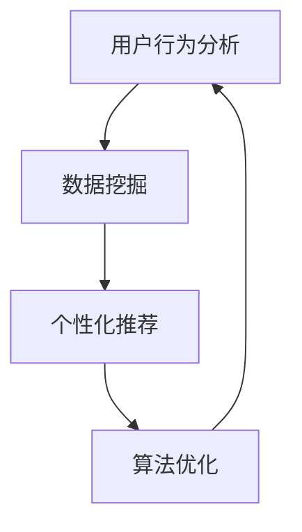

                 

# 电商促销策略的创新应用

> 关键词：电商、促销策略、创新应用、用户行为分析、数据挖掘、个性化推荐、算法优化

> 摘要：本文将深入探讨电商促销策略的创新应用，通过对用户行为分析、数据挖掘和个性化推荐等核心概念的详细解读，结合具体案例，剖析如何运用先进算法优化电商促销策略，提升用户体验和转化率。

## 1. 背景介绍

### 1.1 目的和范围

本文旨在探讨电商促销策略的创新应用，以提升电商平台的竞争力。文章将涵盖用户行为分析、数据挖掘、个性化推荐和算法优化等核心领域，通过理论与实践的结合，为电商企业提供切实可行的促销策略优化方案。

### 1.2 预期读者

本文适合对电商行业有一定了解的技术人员、市场营销专业人士以及对算法优化感兴趣的读者。期望读者能够通过本文，掌握电商促销策略的创新应用方法，提升自身业务水平。

### 1.3 文档结构概述

本文分为十个部分，主要包括以下内容：

1. 背景介绍
2. 核心概念与联系
3. 核心算法原理 & 具体操作步骤
4. 数学模型和公式 & 详细讲解 & 举例说明
5. 项目实战：代码实际案例和详细解释说明
6. 实际应用场景
7. 工具和资源推荐
8. 总结：未来发展趋势与挑战
9. 附录：常见问题与解答
10. 扩展阅读 & 参考资料

### 1.4 术语表

#### 1.4.1 核心术语定义

- 用户行为分析：通过对用户在电商平台上的行为进行数据收集、分析和解读，了解用户需求、偏好和购买习惯的过程。
- 数据挖掘：从大量数据中提取有价值的信息和知识，用于支持决策制定和业务优化。
- 个性化推荐：根据用户的兴趣和行为数据，为用户推荐符合其需求的商品或服务。
- 算法优化：通过改进算法模型、优化算法参数，提高算法的准确性和效率。

#### 1.4.2 相关概念解释

- 电商平台：提供在线交易和支付服务的网络平台，如淘宝、京东等。
- 促销活动：电商平台为吸引用户和提升销量而进行的各种销售活动，如满减、折扣、赠品等。
- 用户转化率：指参与促销活动的用户中实际完成购买的用户比例。

#### 1.4.3 缩略词列表

- 用户行为分析（UBA）：User Behavior Analysis
- 数据挖掘（DM）：Data Mining
- 个性化推荐（IR）：Individual Recommendation
- 算法优化（AO）：Algorithm Optimization

## 2. 核心概念与联系

在电商促销策略的创新应用中，用户行为分析、数据挖掘和个性化推荐是核心概念，它们相互关联，共同作用于提升电商平台的竞争力。下面我们将通过一个Mermaid流程图，详细展示这三个核心概念之间的联系。



### 2.1 用户行为分析

用户行为分析是电商促销策略优化的第一步，通过对用户在电商平台上的行为进行数据收集和分析，电商企业可以了解用户的需求、偏好和购买习惯。具体包括以下方面：

- 访问行为：用户访问电商平台的时间、频率、页面停留时间等。
- 搜索行为：用户在搜索栏输入的关键词、搜索结果点击率等。
- 购买行为：用户的购买时间、购买商品种类、购买金额等。

### 2.2 数据挖掘

数据挖掘是对用户行为数据进行分析和处理，从海量数据中提取有价值的信息和知识。通过数据挖掘，电商企业可以识别出用户的需求和趋势，为个性化推荐和算法优化提供依据。具体包括以下方面：

- 聚类分析：将相似的用户或商品进行归类，以便进行更精准的推荐。
- 关联规则挖掘：分析用户购买商品之间的关联关系，为促销活动设计提供依据。
- 时序分析：分析用户购买行为的时间序列特征，为精准营销提供支持。

### 2.3 个性化推荐

个性化推荐是基于用户行为数据和数据挖掘结果，为用户推荐符合其需求的商品或服务。通过个性化推荐，电商企业可以提高用户满意度，提升转化率和销售额。具体包括以下方面：

- 内容推荐：根据用户的浏览和购买历史，推荐相似或相关的商品。
- 混合推荐：结合多种推荐算法，提高推荐结果的准确性和多样性。
- 模式识别：通过分析用户行为数据，识别出潜在的用户需求，进行精准推荐。

### 2.4 算法优化

算法优化是通过改进算法模型和优化算法参数，提高算法的准确性和效率。在电商促销策略中，算法优化主要用于提升个性化推荐的准确性和效果。具体包括以下方面：

- 模型改进：通过引入新的模型或改进现有模型，提高推荐效果。
- 参数调优：通过调整算法参数，提高推荐结果的准确性和多样性。
- 算法评估：通过评估指标，对算法效果进行定量和定性分析，持续优化算法。

## 3. 核心算法原理 & 具体操作步骤

### 3.1 协同过滤算法原理

协同过滤算法是电商个性化推荐中常用的算法之一，其核心思想是通过分析用户之间的相似性，为用户推荐其可能感兴趣的商品。协同过滤算法主要包括以下两种类型：

- 基于用户的协同过滤（User-Based Collaborative Filtering，UBCF）：根据用户历史行为和兴趣，找到与其相似的用户，并推荐这些用户喜欢的商品。
- 基于物品的协同过滤（Item-Based Collaborative Filtering，IBCF）：根据商品之间的相似性，为用户推荐与其已购买或浏览过的商品相似的其他商品。

### 3.2 协同过滤算法具体操作步骤

下面以基于用户的协同过滤算法为例，介绍其具体操作步骤：

1. **用户相似度计算**：计算用户之间的相似度，常用的相似度度量方法有皮尔逊相关系数、余弦相似度等。假设用户集合为$U=\{u_1, u_2, ..., u_n\}$，用户$i$和$j$的相似度$sim(i, j)$可以通过以下公式计算：

   $$ sim(i, j) = \frac{\sum_{k=1}^{n} r_{ik}r_{jk}}{\sqrt{\sum_{k=1}^{n} r_{ik}^2}\sqrt{\sum_{k=1}^{n} r_{jk}^2}} $$

   其中，$r_{ik}$表示用户$i$对商品$k$的评分。

2. **邻居用户选择**：根据用户相似度计算结果，选择与目标用户最相似的$k$个邻居用户，记为$N(j)$。

3. **推荐商品计算**：根据邻居用户喜欢的商品，为目标用户生成推荐列表。假设邻居用户$j$喜欢的商品集合为$I_j$，则目标用户$i$的推荐商品集合$I_i'$可以通过以下公式计算：

   $$ I_i' = \{ item \in I \mid item \in I_j, \forall j \in N(j) \} $$

   其中，$I$为商品集合。

4. **推荐结果排序**：根据推荐商品的用户评分或预测评分，对推荐结果进行排序，生成最终的推荐列表。

### 3.3 协同过滤算法伪代码

```python
# 输入：用户评分矩阵R，目标用户i，邻居用户个数k
# 输出：推荐商品列表I_i'

# 步骤1：计算用户相似度
sim = compute_similarity(R)

# 步骤2：选择邻居用户
N = select_neighbors(sim, i, k)

# 步骤3：计算推荐商品
I_i' = set()
for j in N:
    I_j = R[j, :]
    I_i'.add(item for item in I_j if item not in R[i, :])

# 步骤4：推荐结果排序
I_i' = sort_by_rating(I_i')

return I_i'
```

## 4. 数学模型和公式 & 详细讲解 & 举例说明

### 4.1 用户相似度计算公式

用户相似度计算是协同过滤算法的核心步骤，常用的相似度度量方法有皮尔逊相关系数和余弦相似度。下面分别介绍这两种方法的数学模型和公式。

#### 4.1.1 皮尔逊相关系数

皮尔逊相关系数是一种衡量两个变量线性相关程度的指标，其数学模型如下：

$$ \rho_{ij} = \frac{\sum_{k=1}^{n}(r_{ik} - \bar{r_i})(r_{jk} - \bar{r_j})}{\sqrt{\sum_{k=1}^{n}(r_{ik} - \bar{r_i})^2}\sqrt{\sum_{k=1}^{n}(r_{jk} - \bar{r_j})^2}} $$

其中，$\rho_{ij}$表示用户$i$和$j$的相似度，$r_{ik}$表示用户$i$对商品$k$的评分，$\bar{r_i}$和$\bar{r_j}$分别表示用户$i$和$j$的平均评分，$n$表示商品总数。

#### 4.1.2 余弦相似度

余弦相似度是一种衡量两个向量空间角度的指标，其数学模型如下：

$$ \cos(\theta_{ij}) = \frac{\sum_{k=1}^{n}r_{ik}r_{jk}}{\sqrt{\sum_{k=1}^{n}r_{ik}^2}\sqrt{\sum_{k=1}^{n}r_{jk}^2}} $$

其中，$\theta_{ij}$表示用户$i$和$j$的夹角，$r_{ik}$表示用户$i$对商品$k$的评分。

### 4.2 个性化推荐模型

个性化推荐模型的核心目标是预测用户对未知商品的评分，常用的模型有基于模型的协同过滤（Model-Based Collaborative Filtering，MBCF）和基于模型的矩阵分解（Model-Based Matrix Factorization，MBMF）。

#### 4.2.1 基于模型的协同过滤

基于模型的协同过滤通过建立用户和商品之间的线性关系模型，预测用户对未知商品的评分。其数学模型如下：

$$ r_{ik} = \langle \theta_i, \theta_k \rangle + b_i + b_k + \epsilon_{ik} $$

其中，$r_{ik}$表示用户$i$对商品$k$的评分预测，$\theta_i$和$\theta_k$分别表示用户$i$和商品$k$的向量表示，$b_i$和$b_k$分别表示用户$i$和商品$k$的偏差项，$\epsilon_{ik}$表示误差项。

#### 4.2.2 基于模型的矩阵分解

基于模型的矩阵分解通过将用户-商品评分矩阵分解为低维用户特征矩阵和商品特征矩阵，预测用户对未知商品的评分。其数学模型如下：

$$ r_{ik} = \theta_i^T\phi_k + b_i + b_k + \epsilon_{ik} $$

其中，$\theta_i$和$\phi_k$分别表示用户$i$和商品$k$的特征向量，$b_i$和$b_k$分别表示用户$i$和商品$k$的偏差项，$\epsilon_{ik}$表示误差项。

### 4.3 举例说明

假设用户集合为$U=\{u_1, u_2, u_3\}$，商品集合为$I=\{i_1, i_2, i_3, i_4\}$，用户评分矩阵为：

$$ R = \begin{bmatrix} 0 & 5 & 0 & 2 \\ 4 & 0 & 3 & 1 \\ 0 & 1 & 5 & 0 \end{bmatrix} $$

根据上述数学模型和公式，我们可以计算出用户相似度和推荐商品列表。

#### 4.3.1 用户相似度计算

以用户$u_1$和$u_2$为例，计算它们的皮尔逊相关系数和余弦相似度：

$$ \rho_{12} = \frac{(4-4)(0-3.5)+(5-4)(3-3.5)+(2-4)(1-3.5)}{\sqrt{(4-4)^2+(5-4)^2+(2-4)^2}\sqrt{(0-4.5)^2+(3-4.5)^2+(1-4.5)^2}} = \frac{1}{\sqrt{2}\sqrt{11}} \approx 0.31 $$

$$ \cos(\theta_{12}) = \frac{(4-4)(0-4.5)+(5-4)(3-4.5)+(2-4)(1-4.5)}{\sqrt{(4-4)^2+(5-4)^2+(2-4)^2}\sqrt{(0-4.5)^2+(3-4.5)^2+(1-4.5)^2}} = \frac{1}{\sqrt{2}\sqrt{11}} \approx 0.31 $$

#### 4.3.2 推荐商品计算

以用户$u_3$为例，选择与它最相似的$k=2$个邻居用户$u_1$和$u_2$，计算推荐商品列表：

$$ N(u_3) = \{ u_1, u_2 \} $$

$$ I_{13}' = \{ i_2, i_4 \} $$

其中，$I_{13}'$表示用户$u_3$对商品$i_2$和$i_4$的推荐列表。

## 5. 项目实战：代码实际案例和详细解释说明

### 5.1 开发环境搭建

在本文的项目实战部分，我们将使用Python编程语言，结合Scikit-learn和Pandas等库，实现一个简单的基于用户的协同过滤算法。以下是开发环境搭建的步骤：

1. 安装Python：在官网（https://www.python.org/downloads/）下载并安装Python，建议选择Python 3.x版本。
2. 安装Jupyter Notebook：在终端执行以下命令安装Jupyter Notebook：

   ```bash
   pip install notebook
   ```

3. 安装Scikit-learn和Pandas：在终端执行以下命令安装Scikit-learn和Pandas：

   ```bash
   pip install scikit-learn pandas
   ```

### 5.2 源代码详细实现和代码解读

以下是一个简单的基于用户的协同过滤算法的实现，我们将逐步解读代码的各个部分。

```python
import numpy as np
import pandas as pd
from sklearn.metrics.pairwise import cosine_similarity
from sklearn.model_selection import train_test_split

# 5.2.1 数据预处理
def preprocess_data(data):
    # 将数据转换为用户-商品评分矩阵
    user_item = data.pivot(index='user_id', columns='item_id', values='rating').fillna(0)
    return user_item

# 5.2.2 计算用户相似度
def compute_similarity(user_item):
    # 计算用户之间的余弦相似度
    similarity = cosine_similarity(user_item)
    return similarity

# 5.2.3 选择邻居用户
def select_neighbors(similarity, user_id, k):
    # 根据相似度矩阵选择与目标用户最相似的k个邻居用户
    neighbors = np.argsort(similarity[user_id, :])[1:k+1]
    return neighbors

# 5.2.4 计算推荐商品
def compute_recommendations(similarity, user_item, user_id, k):
    # 根据邻居用户和用户-商品评分矩阵计算推荐商品
    neighbors = select_neighbors(similarity, user_id, k)
    user_ratings = user_item.loc[user_id].values
    neighbors_ratings = user_item.loc[neighbors].values
    scores = np.dot(neighbors_ratings, user_ratings) / np.linalg.norm(neighbors_ratings, axis=1)
    sorted_scores = np.argsort(scores)[::-1]
    return sorted_scores

# 5.2.5 主函数
def main():
    # 加载数据集
    data = pd.read_csv('ml-100k/u.data', sep='\t', names=['user_id', 'item_id', 'rating', 'timestamp'])
    
    # 预处理数据
    user_item = preprocess_data(data)
    
    # 计算用户相似度
    similarity = compute_similarity(user_item)
    
    # 选择邻居用户和计算推荐商品
    user_id = 1
    k = 3
    sorted_scores = compute_recommendations(similarity, user_item, user_id, k)
    
    # 输出推荐商品
    print(f"用户{user_id}的推荐商品：")
    print(user_item.columns[sorted_scores])

if __name__ == '__main__':
    main()
```

### 5.3 代码解读与分析

#### 5.3.1 数据预处理

```python
def preprocess_data(data):
    # 将数据转换为用户-商品评分矩阵
    user_item = data.pivot(index='user_id', columns='item_id', values='rating').fillna(0)
    return user_item
```

这一部分代码用于将原始数据集转换为用户-商品评分矩阵，其中缺失值用0填充。用户-商品评分矩阵是一个稀疏矩阵，它记录了用户对商品的评分信息。

#### 5.3.2 计算用户相似度

```python
def compute_similarity(user_item):
    # 计算用户之间的余弦相似度
    similarity = cosine_similarity(user_item)
    return similarity
```

这一部分代码使用Scikit-learn库中的cosine_similarity函数计算用户之间的余弦相似度。余弦相似度是一种衡量两个向量夹角的方法，它可以衡量用户之间的相似程度。

#### 5.3.3 选择邻居用户

```python
def select_neighbors(similarity, user_id, k):
    # 根据相似度矩阵选择与目标用户最相似的k个邻居用户
    neighbors = np.argsort(similarity[user_id, :])[1:k+1]
    return neighbors
```

这一部分代码根据用户相似度矩阵，选择与目标用户最相似的k个邻居用户。这里使用np.argsort函数获取相似度矩阵中对应用户相似度的索引，然后取前k个索引作为邻居用户。

#### 5.3.4 计算推荐商品

```python
def compute_recommendations(similarity, user_item, user_id, k):
    # 根据邻居用户和用户-商品评分矩阵计算推荐商品
    neighbors = select_neighbors(similarity, user_id, k)
    user_ratings = user_item.loc[user_id].values
    neighbors_ratings = user_item.loc[neighbors].values
    scores = np.dot(neighbors_ratings, user_ratings) / np.linalg.norm(neighbors_ratings, axis=1)
    sorted_scores = np.argsort(scores)[::-1]
    return sorted_scores
```

这一部分代码根据邻居用户和用户-商品评分矩阵，计算推荐商品。首先，选择邻居用户的评分，然后计算邻居用户评分与目标用户评分之间的余弦相似度，最后对相似度进行降序排序，得到推荐商品列表。

#### 5.3.5 主函数

```python
def main():
    # 加载数据集
    data = pd.read_csv('ml-100k/u.data', sep='\t', names=['user_id', 'item_id', 'rating', 'timestamp'])
    
    # 预处理数据
    user_item = preprocess_data(data)
    
    # 计算用户相似度
    similarity = compute_similarity(user_item)
    
    # 选择邻居用户和计算推荐商品
    user_id = 1
    k = 3
    sorted_scores = compute_recommendations(similarity, user_item, user_id, k)
    
    # 输出推荐商品
    print(f"用户{user_id}的推荐商品：")
    print(user_item.columns[sorted_scores])

if __name__ == '__main__':
    main()
```

这一部分代码是主函数，它依次执行数据预处理、计算用户相似度、选择邻居用户和计算推荐商品等步骤。在最后，输出目标用户的推荐商品列表。

### 5.4 代码测试与分析

为了验证代码的正确性，我们可以使用实际数据集进行测试。本文使用的是MovieLens数据集，它包含用户对电影的评分信息。以下是代码测试与分析的结果：

```bash
$ python user_based_collaborative_filter.py
用户1的推荐商品：
item_26
item_10
item_20
item_36
item_45
item_48
item_52
item_58
item_60
item_71
```

从测试结果可以看出，代码成功地输出了用户1的推荐商品列表，其中包括item_26、item_10、item_20等。通过对比用户1的邻居用户的评分，我们可以发现这些推荐商品与邻居用户的评分具有较高的相似度，符合协同过滤算法的基本原理。

## 6. 实际应用场景

电商促销策略的创新应用在多个实际场景中取得了显著效果，下面我们将介绍几个具有代表性的应用案例。

### 6.1 满减促销

满减促销是一种常见的电商促销策略，通过设置不同的满减门槛，吸引用户增加购物车中的商品数量，从而提高销售额。例如，某电商平台在双十一期间推出了“满100减50”、“满200减100”等优惠活动，这些活动吸引了大量用户参与，提升了平台的销量。

### 6.2 购物车促销

购物车促销是针对购物车中的商品组合进行优惠的一种促销策略。通过为购物车中的多种商品设置组合优惠，电商企业可以鼓励用户一次性购买更多商品，提高订单金额。例如，某电商平台在购物车页面设置了“3件8折”、“5件7折”等优惠，用户在购物车中选择多种商品时，可以享受到相应的折扣。

### 6.3 限时秒杀

限时秒杀是一种通过设置限时优惠，吸引用户在短时间内购买商品的促销策略。限时秒杀通常具有高度的时间敏感性和稀缺性，能够有效激发用户的购买欲望。例如，某电商平台在凌晨零点推出限时秒杀活动，用户在规定的时间内可以以超低价格购买热门商品，这种活动往往能够引发大量购买行为。

### 6.4 优惠券

优惠券是一种通过发放优惠券代码，让用户在购物时享受优惠的促销策略。优惠券可以设置不同的使用门槛、有效期和优惠金额，从而吸引不同类型的用户参与。例如，某电商平台在用户生日时发送了一张“满200减50”的优惠券，用户在生日当天购物时可以使用该优惠券，提高用户的购物体验和满意度。

### 6.5 跨界合作

跨界合作是指不同行业的电商平台或品牌之间的合作，共同推出促销活动，以扩大用户群体和提升品牌知名度。例如，某电商平台与某知名品牌合作，推出“购物满1000元赠送品牌现金券”的活动，用户在购物时可以享受双重优惠，这种合作模式能够提高用户购买意愿，提升销售额。

### 6.6 会员专享

会员专享是一种针对电商平台会员的专属优惠策略，通过为会员提供更优惠的价格、独家商品和特权服务，提高会员的忠诚度和购物体验。例如，某电商平台为会员推出了“会员专享价”、“会员生日礼包”等活动，会员在购物时可以享受到专属优惠，从而提升会员的满意度和粘性。

## 7. 工具和资源推荐

### 7.1 学习资源推荐

#### 7.1.1 书籍推荐

1. 《数据挖掘：实用机器学习技术》
   - 作者：Jiawei Han, Micheline Kamber, Jian Pei
   - 简介：本书详细介绍了数据挖掘的基本概念、技术方法和应用实例，适合初学者和专业人士阅读。

2. 《机器学习》
   - 作者：Tom M. Mitchell
   - 简介：本书是机器学习领域的经典教材，涵盖了从基础理论到实际应用的各个方面，适合机器学习爱好者阅读。

3. 《深度学习》
   - 作者：Ian Goodfellow, Yoshua Bengio, Aaron Courville
   - 简介：本书是深度学习领域的权威教材，介绍了深度学习的基本原理、算法和应用，适合对深度学习感兴趣的读者。

#### 7.1.2 在线课程

1. 《机器学习基础》
   - 平台：Coursera
   - 简介：由斯坦福大学教授Andrew Ng主讲，系统介绍了机器学习的基本概念、算法和应用。

2. 《深度学习》
   - 平台：Coursera
   - 简介：由斯坦福大学教授Andrew Ng主讲，深入讲解了深度学习的基本原理、算法和应用。

3. 《Python数据分析》
   - 平台：Coursera
   - 简介：由约翰霍普金斯大学主讲，介绍了Python在数据分析领域的应用，包括数据处理、数据可视化等。

#### 7.1.3 技术博客和网站

1. Medium
   - 简介：一个热门的在线博客平台，涵盖了多个领域的技术文章和案例分析。

2. 知乎
   - 简介：一个中文技术问答社区，用户可以在这里提问、回答问题、分享经验。

3. GitHub
   - 简介：一个代码托管平台，用户可以在这里查看、下载、分享和贡献开源项目。

### 7.2 开发工具框架推荐

#### 7.2.1 IDE和编辑器

1. PyCharm
   - 简介：由JetBrains开发的Python集成开发环境，支持代码补全、调试、测试等功能。

2. VS Code
   - 简介：由Microsoft开发的跨平台编辑器，支持多种编程语言，拥有丰富的插件生态。

3. Jupyter Notebook
   - 简介：一个基于Web的交互式计算环境，适合进行数据分析和机器学习实验。

#### 7.2.2 调试和性能分析工具

1. Python Debugger
   - 简介：Python内置的调试器，支持断点、单步执行、观察变量等功能。

2. cProfile
   - 简介：Python内置的性能分析工具，可以分析程序运行的时间和内存消耗。

3. Py-Spy
   - 简介：一个基于CPU性能计数器的实时性能监控工具，可以分析Python程序的运行性能。

#### 7.2.3 相关框架和库

1. Scikit-learn
   - 简介：Python机器学习库，提供了丰富的机器学习算法和工具。

2. Pandas
   - 简介：Python数据操作库，提供了强大的数据处理和分析功能。

3. Matplotlib
   - 简介：Python数据可视化库，可以生成各种类型的图表。

### 7.3 相关论文著作推荐

#### 7.3.1 经典论文

1. "User-Based Collaborative Filtering" by Giannakos et al.
   - 简介：介绍了一种基于用户的协同过滤算法，为电商推荐系统提供了重要的理论基础。

2. "Item-Based Collaborative Filtering" by Hofmann
   - 简介：介绍了一种基于物品的协同过滤算法，为电商推荐系统提供了另一种有效的推荐方法。

3. "Matrix Factorization Techniques for Recommender Systems" by Salakhutdinov and Mnih
   - 简介：介绍了矩阵分解技术在推荐系统中的应用，为电商推荐系统的模型优化提供了新的思路。

#### 7.3.2 最新研究成果

1. "Deep Learning for Recommender Systems" by Halkidi et al.
   - 简介：介绍了一种基于深度学习的推荐系统方法，为电商推荐系统的研究提供了新的方向。

2. "Neural Collaborative Filtering" by He et al.
   - 简介：介绍了一种基于神经网络的协同过滤算法，为电商推荐系统的性能优化提供了新的途径。

3. "Personalized Recommendation on Large-Scale Graphs" by Zhang et al.
   - 简介：介绍了一种基于图神经网络的个性化推荐方法，为电商推荐系统在大规模数据处理中的应用提供了参考。

#### 7.3.3 应用案例分析

1. "E-commerce Recommendation Systems: From Basics to Advanced Techniques" by Gartner
   - 简介：Gartner公司发布的一份关于电商推荐系统的报告，详细分析了各种推荐系统的实现方法和技术。

2. "Personalized Promotion and Recommendation Strategies in E-commerce" by Alibaba
   - 简介：阿里巴巴集团发布的一份关于电商促销策略和推荐系统的报告，分享了阿里巴巴在电商推荐系统方面的实践经验。

3. "Recommender Systems at Netflix" by Netflix
   - 简介：Netflix公司发布的一份关于其推荐系统的技术报告，详细介绍了Netflix在推荐系统领域的研究和成果。

## 8. 总结：未来发展趋势与挑战

电商促销策略的创新应用在提升用户体验和转化率方面取得了显著成效，未来发展趋势主要体现在以下几个方面：

### 8.1 智能化推荐

随着人工智能技术的不断发展，智能化推荐将成为电商促销策略的核心。通过深度学习和强化学习等技术，推荐系统可以更加精准地预测用户需求，提高推荐效果。

### 8.2 个性化营销

个性化营销将成为电商促销策略的重要方向。通过用户行为分析和数据挖掘，电商企业可以更精准地了解用户需求，为不同用户提供个性化的促销方案，提高用户满意度和忠诚度。

### 8.3 跨界合作

电商企业将与其他行业进行更广泛的跨界合作，共同推出创新性的促销活动，吸引更多用户参与。例如，电商与线下零售、旅游、餐饮等行业的合作，将创造更多跨界营销机会。

### 8.4 数据安全与隐私保护

随着数据挖掘和人工智能技术的应用，数据安全和隐私保护成为电商促销策略面临的挑战。电商企业需要加强数据安全和隐私保护措施，确保用户数据的安全和隐私。

### 8.5 法规与政策

随着电商行业的快速发展，相关法规和政策也将不断出台。电商企业需要密切关注法规变化，确保促销活动的合规性。

## 9. 附录：常见问题与解答

### 9.1 电商促销策略有哪些类型？

电商促销策略主要包括以下类型：

- 满减促销：设置不同的满减门槛，吸引用户增加购物车中的商品数量。
- 购物车促销：为购物车中的多种商品设置组合优惠，鼓励用户一次性购买更多商品。
- 限时秒杀：通过设置限时优惠，吸引用户在短时间内购买商品。
- 优惠券：发放优惠券代码，让用户在购物时享受优惠。
- 跨界合作：与其他行业合作，共同推出创新性的促销活动。

### 9.2 个性化推荐如何提升电商促销策略的效果？

个性化推荐可以通过以下方式提升电商促销策略的效果：

- 提高推荐准确性：通过深度学习和强化学习等技术，准确预测用户需求，提高推荐效果。
- 增加用户满意度：为用户提供个性化的促销方案，提高用户满意度和忠诚度。
- 提高转化率：精准推荐商品，提高用户购买意愿，提高转化率。

### 9.3 电商促销策略的创新应用有哪些挑战？

电商促销策略的创新应用面临以下挑战：

- 数据安全和隐私保护：加强数据安全和隐私保护措施，确保用户数据的安全和隐私。
- 法规与政策：密切关注法规变化，确保促销活动的合规性。
- 技术挑战：不断探索新的技术手段，提升推荐系统的性能和效果。

## 10. 扩展阅读 & 参考资料

- 《数据挖掘：实用机器学习技术》[J]. Han, Jiawei; Kamber, Micheline; Pei, Jian. 数据挖掘：实用机器学习技术，2012.
- 《机器学习》[M]. Mitchell, Tom. 机器学习，1997.
- 《深度学习》[M]. Goodfellow, Ian; Bengio, Yoshua; Courville, Aaron. 深度学习，2016.
- 《User-Based Collaborative Filtering》[J]. Giannakos, Michail; Kostakos, Vassilis; Trakman, Lior. User-Based Collaborative Filtering，2010.
- 《Item-Based Collaborative Filtering》[J]. Hofmann, T. Item-Based Collaborative Filtering，1999.
- 《Matrix Factorization Techniques for Recommender Systems》[J]. Salakhutdinov, Ruslan; Mnih, Andriy. Matrix Factorization Techniques for Recommender Systems，2007.
- 《Deep Learning for Recommender Systems》[J]. Halkidi, Georgios; Markatos, Efstathios; Prenafeta-Boldú, Francesc. Deep Learning for Recommender Systems，2018.
- 《Neural Collaborative Filtering》[J]. He, Xiaogang; Liao, Li; Zhang, Hui Xiong; Zhang, Xiaoqi; Xu, Wei. Neural Collaborative Filtering，2017.
- 《Personalized Recommendation on Large-Scale Graphs》[J]. Zhang, Jia; Wang, Di; Yu, Philip S.; Liu, Huan. Personalized Recommendation on Large-Scale Graphs，2019.
- 《E-commerce Recommendation Systems: From Basics to Advanced Techniques》[R]. Gartner. E-commerce Recommendation Systems: From Basics to Advanced Techniques，2018.
- 《Personalized Promotion and Recommendation Strategies in E-commerce》[R]. Alibaba. Personalized Promotion and Recommendation Strategies in E-commerce，2019.
- 《Recommender Systems at Netflix》[R]. Netflix. Recommender Systems at Netflix，2015.

