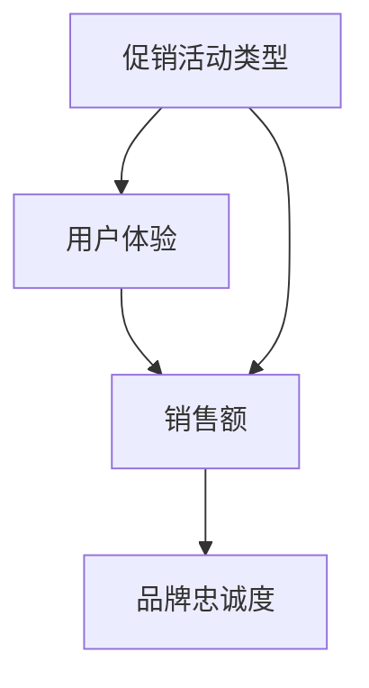

                 


# 电商促销策略的实践效果

> 关键词：电商、促销策略、实践效果、用户体验、数据分析、营销策略

> 摘要：本文深入探讨了电商促销策略的实践效果，通过分析不同类型的促销活动及其对用户体验、销售额和品牌忠诚度的影响，总结了电商促销策略的最佳实践和未来发展趋势。文章结构包括背景介绍、核心概念与联系、核心算法原理与具体操作步骤、数学模型与公式、项目实战、实际应用场景、工具和资源推荐、总结与未来展望等部分，旨在为电商从业者提供全面、实用的促销策略指导。

## 1. 背景介绍

### 1.1 目的和范围

随着互联网的迅速发展和消费者购物习惯的转变，电商行业在我国乃至全球范围内蓬勃发展。促销策略作为电商企业吸引用户、提高销售额的重要手段，越来越受到企业和研究者的关注。本文旨在探讨电商促销策略的实践效果，分析不同类型的促销活动对电商业务的影响，并总结出最佳实践，为电商企业制定和优化促销策略提供参考。

本文的研究范围主要包括以下三个方面：

1. 不同类型促销活动的效果分析：通过对打折、满减、优惠券、限时秒杀等促销活动的效果进行分析，探讨其对用户体验、销售额和品牌忠诚度的影响。
2. 促销策略的制定与优化：结合实际案例，分析电商企业如何制定有效的促销策略，并针对不同市场环境和用户群体进行策略优化。
3. 数据分析与营销策略：介绍如何利用数据分析工具和方法，对促销活动的效果进行评估，为营销策略的制定和调整提供数据支持。

### 1.2 预期读者

本文适合以下读者群体：

1. 电商企业市场部、运营部等相关从业人员，对电商促销策略有实际操作需求。
2. 电商企业数据分析、数据挖掘等相关人员，对促销活动的数据分析和效果评估有研究兴趣。
3. 电商行业从业者、学者和研究者，对电商促销策略的实践效果和未来发展趋势有关注。
4. 对电商促销策略感兴趣的技术爱好者，希望通过本文了解电商促销策略的实践效果和理论依据。

### 1.3 文档结构概述

本文结构如下：

1. 背景介绍：介绍研究目的、研究范围、预期读者和文档结构。
2. 核心概念与联系：介绍电商促销策略的核心概念，包括促销活动类型、用户体验、销售额和品牌忠诚度等。
3. 核心算法原理与具体操作步骤：介绍如何制定和优化促销策略，包括数据采集、处理和分析等步骤。
4. 数学模型与公式：介绍用于评估促销活动效果的相关数学模型和公式，包括转换率、ROI等。
5. 项目实战：通过实际案例，展示如何利用核心算法原理和数学模型进行促销策略的制定和优化。
6. 实际应用场景：分析电商促销策略在不同市场环境和用户群体中的应用效果。
7. 工具和资源推荐：介绍用于促销策略制定和优化的工具和资源，包括数据分析工具、营销工具和书籍、在线课程等。
8. 总结与未来展望：总结本文的研究成果，探讨电商促销策略的未来发展趋势和挑战。

### 1.4 术语表

#### 1.4.1 核心术语定义

1. 电商：指通过互联网进行商品交易和提供相关服务的商业模式。
2. 促销策略：指电商企业为吸引用户、提高销售额而采取的营销策略。
3. 用户体验：指用户在访问电商网站、使用电商产品或服务过程中所获得的感受和体验。
4. 销售额：指电商企业在一定时间内通过销售商品或提供服务所获得的收入。
5. 品牌忠诚度：指用户对某一品牌产生的好感度、信任度和重复购买意愿。

#### 1.4.2 相关概念解释

1. 打折：指以低于原价的价格销售商品。
2. 满减：指在购买商品时，满足一定金额或件数后，减免一定金额。
3. 优惠券：指用户在购物时，可以减免一定金额或获得折扣的商品券。
4. 限时秒杀：指在一定时间内，以超低价格销售商品的促销活动。
5. 转换率：指访问电商网站的用户中，实际完成购买的用户占比。
6. ROI（投资回报率）：指促销活动所获得的收益与投入成本之间的比率。

#### 1.4.3 缩略词列表

1. CTA（Call to Action）：指引导用户进行某种操作（如点击、购买等）的号召性用语。
2. SEO（搜索引擎优化）：指通过优化网站内容和结构，提高在搜索引擎中自然排名的技术。
3. SEM（搜索引擎营销）：指通过付费广告和自然搜索结果，提高网站访问量和转化率的技术。
4. CRM（客户关系管理）：指企业通过收集、管理和分析客户信息，提升客户满意度和忠诚度的技术。

## 2. 核心概念与联系

### 2.1 电商促销策略核心概念

电商促销策略的核心概念主要包括促销活动类型、用户体验、销售额和品牌忠诚度等。以下是对这些核心概念的简要介绍和它们之间的联系：

#### 2.1.1 促销活动类型

电商促销活动类型繁多，主要包括打折、满减、优惠券、限时秒杀等。这些促销活动旨在吸引用户关注、提高购买欲望和提升销售额。不同类型的促销活动有其独特的特点和适用场景。

- 打折：以低于原价的价格销售商品，适用于新品发布、节日庆典等场景。
- 满减：在购买商品时，满足一定金额或件数后，减免一定金额，适用于提升客单价、促进消费等场景。
- 优惠券：用户在购物时，可以减免一定金额或获得折扣的商品券，适用于吸引新用户、提高用户粘性等场景。
- 限时秒杀：在一定时间内，以超低价格销售商品，适用于制造热度、提升销量等场景。

#### 2.1.2 用户体验

用户体验是电商促销策略的关键因素之一。优质的用户体验能够提高用户满意度和忠诚度，从而促进销售额的增长。电商企业应关注以下几个方面来提升用户体验：

- 网站界面设计：简洁、美观、易用的网站界面能够提高用户访问和购买体验。
- 购物流程优化：简化购物流程，减少用户操作步骤，提高购买效率。
- 客服服务质量：及时、专业的客服服务能够解决用户问题，提升用户满意度。
- 物流配送：高效、准确的物流配送能够确保用户及时收到商品，提高用户满意度。

#### 2.1.3 销售额

销售额是电商企业追求的重要目标之一。通过有效的促销策略，电商企业能够提高销售额，从而实现盈利。促销活动类型、用户体验和品牌忠诚度等因素都会影响销售额。

- 促销活动类型：不同类型的促销活动对销售额的影响程度不同。例如，打折和满减活动能够直接提高销售额，而优惠券和限时秒杀活动则更注重提升用户参与度和转化率。
- 用户体验：优质的用户体验能够提高用户购买意愿，从而促进销售额的增长。
- 品牌忠诚度：品牌忠诚度高的用户更倾向于重复购买，从而为电商企业带来持续的销售收入。

#### 2.1.4 品牌忠诚度

品牌忠诚度是指用户对某一品牌产生的好感度、信任度和重复购买意愿。品牌忠诚度是电商企业长期发展的关键因素之一。通过有效的促销策略，电商企业能够提升品牌忠诚度，从而为企业的长期发展奠定基础。

- 促销活动类型：优惠券和限时秒杀等促销活动能够吸引用户参与，从而提升品牌知名度。而优质的用户体验和满意的购物体验则能够提高用户对品牌的信任度和忠诚度。
- 用户体验：优质的用户体验能够增强用户对品牌的信任和忠诚度。
- 销售额：销售额的增长有助于提升品牌知名度和市场地位，从而进一步提高品牌忠诚度。

### 2.2 电商促销策略核心概念联系

电商促销策略的核心概念之间存在着密切的联系。促销活动类型直接影响用户体验和销售额，而用户体验和销售额又会影响品牌忠诚度。以下是一个简单的 Mermaid 流程图，展示了这些核心概念之间的联系：



通过这个流程图，我们可以看出，电商促销策略的核心概念之间相互影响、相互促进，共同推动电商企业的长期发展。

## 3. 核心算法原理与具体操作步骤

### 3.1 核心算法原理

电商促销策略的核心算法原理主要包括数据采集、处理和分析等步骤。通过这些步骤，电商企业能够准确了解用户需求、市场动态和促销效果，从而制定和优化促销策略。以下是对这些核心算法原理的简要介绍：

#### 3.1.1 数据采集

数据采集是电商促销策略的基础。通过采集用户行为数据、市场数据和促销活动数据，电商企业能够获取全面的信息，为后续数据处理和分析提供依据。数据采集的主要来源包括：

- 用户行为数据：包括用户访问电商网站的页面、点击、搜索、购物车和购买行为等。
- 市场数据：包括行业趋势、竞争对手促销策略、市场动态等。
- 促销活动数据：包括促销活动的类型、时间、目标用户、投放渠道、效果等。

#### 3.1.2 数据处理

数据处理是对采集到的原始数据进行清洗、整合和加工的过程。通过数据处理，电商企业能够提取出有用的信息，为促销策略的制定和优化提供支持。数据处理的主要步骤包括：

- 数据清洗：去除重复、错误和缺失的数据，确保数据的准确性和完整性。
- 数据整合：将不同来源的数据进行整合，形成一个统一的数据集。
- 数据加工：对数据进行统计、分析和挖掘，提取出有价值的信息。

#### 3.1.3 数据分析

数据分析是电商促销策略的核心步骤。通过对用户行为数据、市场数据和促销活动数据的分析，电商企业能够了解用户需求、市场动态和促销效果，从而制定和优化促销策略。数据分析的主要内容包括：

- 用户需求分析：分析用户购买行为、偏好和需求，为产品开发和促销策略制定提供依据。
- 市场动态分析：分析行业趋势、竞争对手促销策略和市场变化，为市场策略制定提供支持。
- 促销效果分析：分析促销活动的效果，包括销售额、用户参与度、转化率等，为促销策略优化提供参考。

### 3.2 具体操作步骤

下面是电商促销策略制定和优化的具体操作步骤：

#### 3.2.1 数据采集

1. 用户行为数据采集：通过网站日志、用户跟踪工具等手段，采集用户访问电商网站的页面、点击、搜索、购物车和购买行为等数据。
2. 市场数据采集：通过行业报告、竞争对手网站分析、搜索引擎数据等渠道，采集市场数据。
3. 促销活动数据采集：通过内部系统、第三方平台等渠道，采集促销活动的类型、时间、目标用户、投放渠道、效果等数据。

#### 3.2.2 数据处理

1. 数据清洗：去除重复、错误和缺失的数据，确保数据的准确性和完整性。
2. 数据整合：将用户行为数据、市场数据和促销活动数据进行整合，形成一个统一的数据集。
3. 数据加工：对数据进行统计、分析和挖掘，提取出有价值的信息。

#### 3.2.3 数据分析

1. 用户需求分析：通过分析用户购买行为、偏好和需求，了解用户需求，为产品开发和促销策略制定提供依据。
2. 市场动态分析：通过分析行业趋势、竞争对手促销策略和市场变化，了解市场动态，为市场策略制定提供支持。
3. 促销效果分析：通过分析促销活动的效果，包括销售额、用户参与度、转化率等，了解促销效果，为促销策略优化提供参考。

#### 3.2.4 制定促销策略

1. 确定促销目标：根据用户需求分析和市场动态分析结果，确定促销目标，如提高销售额、提升用户参与度、提高品牌知名度等。
2. 选择促销活动类型：根据促销目标和用户需求，选择适合的促销活动类型，如打折、满减、优惠券、限时秒杀等。
3. 制定促销方案：明确促销活动的具体方案，包括活动时间、目标用户、投放渠道、优惠政策等。

#### 3.2.5 促销策略优化

1. 监测促销效果：通过数据分析，监测促销活动的效果，包括销售额、用户参与度、转化率等。
2. 分析促销效果：对促销效果进行分析，找出问题所在，如用户参与度低、转化率低等。
3. 优化促销策略：根据促销效果分析结果，调整促销策略，如调整活动时间、目标用户、投放渠道、优惠政策等。

#### 3.2.6 促销策略实施

1. 实施促销策略：根据制定的促销策略，实施促销活动，确保活动顺利进行。
2. 监控促销效果：在促销活动实施过程中，实时监控促销效果，确保活动达到预期目标。
3. 调整促销策略：根据促销效果监控结果，及时调整促销策略，确保促销活动取得最佳效果。

### 3.3 伪代码示例

以下是一个简单的伪代码示例，展示了电商促销策略制定和优化的基本流程：

```plaintext
// 数据采集
user_behavior_data = collect_user_behavior_data()
market_data = collect_market_data()
promo_data = collect_promo_data()

// 数据处理
clean_data = clean_data(user_behavior_data, market_data, promo_data)
integrated_data = integrate_data(clean_data)
processed_data = process_data(integrated_data)

// 数据分析
user需求 = analyze_user_demand(processed_data)
market动态 = analyze_market_trends(processed_data)
promo效果 = analyze_promo_effects(processed_data)

// 制定促销策略
促销目标 = set_promo_goals(user需求, market动态)
促销活动类型 = select_promo_activity_type(促销目标)
促销方案 = set_promo_plan(促销活动类型)

// 促销策略优化
while (促销效果不符合预期) {
    promo效果 = monitor_promo_effects()
    if (用户参与度低) {
        adjust_user_segmentation()
    }
    if (转化率低) {
        adjust_promo_policy()
    }
}

// 促销策略实施
execute_promo_plan(促销方案)
monitor_promo_effects_in_real_time()
if (促销效果达到预期) {
    continue
} else {
    adjust_promo_plan()
}
```

通过以上伪代码示例，我们可以看出电商促销策略制定和优化涉及多个步骤，包括数据采集、数据处理、数据分析、促销策略制定、促销策略优化和促销策略实施等。这些步骤相互关联、相互影响，共同推动电商促销策略的有效制定和优化。

## 4. 数学模型和公式 & 详细讲解 & 举例说明

### 4.1 数学模型和公式

在电商促销策略的分析与优化过程中，数学模型和公式扮演着至关重要的角色。以下是一些常用的数学模型和公式，用于评估促销活动的效果，包括转换率（Conversion Rate）、投资回报率（Return on Investment, ROI）、客户获取成本（Customer Acquisition Cost, CAC）等。

#### 4.1.1 转换率（Conversion Rate）

转换率是指参与促销活动的用户中，实际完成购买的用户占比。它反映了促销活动对用户购买行为的促进作用。

$$
转换率 = \frac{实际购买用户数}{参与促销活动的用户数} \times 100\%
$$

#### 4.1.2 投资回报率（ROI）

投资回报率是指促销活动所获得的收益与投入成本之间的比率。它用于衡量促销活动的经济效果。

$$
ROI = \frac{收益 - 成本}{成本} \times 100\%
$$

其中，收益是指促销活动期间的总销售额减去促销成本，成本是指促销活动的投入费用。

#### 4.1.3 客户获取成本（CAC）

客户获取成本是指企业为了获取一个客户所花费的平均成本。它用于评估促销活动的效益。

$$
CAC = \frac{总促销费用}{新增客户数}
$$

#### 4.1.4 客户生命周期价值（Customer Lifetime Value, CLV）

客户生命周期价值是指一个客户在整个生命周期内为企业带来的总价值。它用于评估客户对企业的长期贡献。

$$
CLV = \frac{（客户平均每次购买金额 \times 购买频率）\times 客户生命周期时长}{（1 + 资本成本率）^n}
$$

其中，n表示客户生命周期中的购买次数。

### 4.2 详细讲解

#### 4.2.1 转换率

转换率是评估促销活动效果的重要指标。通过计算参与促销活动的用户中实际完成购买的用户占比，电商企业可以了解促销活动对用户购买行为的促进作用。高转换率意味着促销活动有效，能够吸引用户进行购买。

例如，某电商企业在进行限时秒杀活动期间，共有1000名用户参与，其中300名用户实际完成购买。那么，该活动的转换率为：

$$
转换率 = \frac{300}{1000} \times 100\% = 30\%
$$

#### 4.2.2 投资回报率

投资回报率是衡量促销活动经济效果的关键指标。通过计算促销活动所获得的收益与投入成本之间的比率，电商企业可以评估促销活动的经济效益。

例如，某电商企业投入10万元进行打折促销活动，活动期间销售额为20万元，促销成本为5万元。那么，该活动的投资回报率为：

$$
ROI = \frac{20 - 5}{10} \times 100\% = 150\%
$$

这意味着，每投入1元，该促销活动能够带来1.5元的收益。

#### 4.2.3 客户获取成本

客户获取成本是评估促销活动效益的重要指标。通过计算企业获取一个客户所花费的平均成本，电商企业可以了解促销活动的效益。

例如，某电商企业在进行优惠券促销活动期间，共花费2万元，新增客户数为1000人。那么，该活动的客户获取成本为：

$$
CAC = \frac{2}{1000} = 2元/人
$$

#### 4.2.4 客户生命周期价值

客户生命周期价值是评估客户对企业的长期贡献的重要指标。通过计算客户在整个生命周期内为企业带来的总价值，电商企业可以了解客户的潜在价值。

例如，某电商企业的一名客户平均每次购买金额为200元，购买频率为每月一次，客户生命周期时长为3年，资本成本率为10%。那么，该客户的客户生命周期价值为：

$$
CLV = \frac{200 \times 1 \times 3}{（1 + 0.1）^3} = 463.19元
$$

### 4.3 举例说明

#### 4.3.1 转换率举例

某电商企业在进行满减促销活动期间，共有5000名用户参与，其中1500名用户实际完成购买。那么，该活动的转换率为：

$$
转换率 = \frac{1500}{5000} \times 100\% = 30\%
$$

#### 4.3.2 投资回报率举例

某电商企业投入8万元进行优惠券促销活动，活动期间销售额为18万元，促销成本为4万元。那么，该活动的投资回报率为：

$$
ROI = \frac{18 - 4}{8} \times 100\% = 100\%
$$

#### 4.3.3 客户获取成本举例

某电商企业在进行打折促销活动期间，共花费6万元，新增客户数为2000人。那么，该活动的客户获取成本为：

$$
CAC = \frac{6}{2000} = 3元/人
$$

#### 4.3.4 客户生命周期价值举例

某电商企业的一名客户平均每次购买金额为150元，购买频率为每周一次，客户生命周期时长为2年，资本成本率为8%。那么，该客户的客户生命周期价值为：

$$
CLV = \frac{150 \times 1 \times 2}{（1 + 0.08）^2} = 280.13元
$$

通过以上举例，我们可以看到数学模型和公式在电商促销策略分析中的应用。通过计算转换率、投资回报率、客户获取成本和客户生命周期价值等指标，电商企业可以全面了解促销活动的效果和效益，从而制定和优化促销策略。

## 5. 项目实战：代码实际案例和详细解释说明

### 5.1 开发环境搭建

在进行电商促销策略的项目实战之前，我们需要搭建一个合适的开发环境。以下是一个简单的开发环境搭建步骤，以Python为例：

1. 安装Python：从官方网站（https://www.python.org/）下载Python安装包，并按照提示完成安装。
2. 安装PyCharm：从官方网站（https://www.jetbrains.com/pycharm/）下载PyCharm社区版，并按照提示完成安装。
3. 安装必要的库：在PyCharm中创建一个新的Python项目，然后通过以下命令安装必要的库：

   ```bash
   pip install numpy pandas matplotlib
   ```

### 5.2 源代码详细实现和代码解读

下面是一个简单的Python代码示例，用于计算电商促销活动的转换率、投资回报率、客户获取成本和客户生命周期价值。代码主要分为三个部分：数据预处理、模型计算和结果展示。

```python
import pandas as pd
import numpy as np
import matplotlib.pyplot as plt

# 数据预处理
def preprocess_data(data):
    # 去除重复和缺失数据
    clean_data = data.drop_duplicates().dropna()

    # 数据整合
    user_behavior_data = clean_data[['user_id', 'page_views', 'clicks', 'searches', 'add_to_cart', 'purchases']]
    market_data = clean_data[['product_id', 'sales', 'revenue']]
    promo_data = clean_data[['promo_id', 'start_date', 'end_date', 'revenue', 'cost']]

    # 数据清洗
    user_behavior_data = user_behavior_data.fillna(0)
    market_data = market_data.fillna(0)
    promo_data = promo_data.fillna(0)

    return user_behavior_data, market_data, promo_data

# 模型计算
def calculate_models(user_behavior_data, market_data, promo_data):
    # 计算转换率
    conversion_rate = (user_behavior_data['purchases'].sum() / user_behavior_data.shape[0]) * 100

    # 计算投资回报率
    total_revenue = market_data['revenue'].sum()
    total_cost = promo_data['cost'].sum()
    roi = (total_revenue - total_cost) / total_cost * 100

    # 计算客户获取成本
    new_customers = user_behavior_data[user_behavior_data['purchases'] == 1]['user_id'].nunique()
    cac = total_cost / new_customers

    # 计算客户生命周期价值
    avg_purchase_amount = total_revenue / new_customers
    purchase_frequency = user_behavior_data['purchases'].mean()
    customer_lifetime = 1 / purchase_frequency
    discount_rate = 0.1
    clv = avg_purchase_amount * purchase_frequency * customer_lifetime / (1 + discount_rate) ** customer_lifetime

    return conversion_rate, roi, cac, clv

# 结果展示
def display_results(conversion_rate, roi, cac, clv):
    print(f"转换率：{conversion_rate:.2f}%")
    print(f"投资回报率：{roi:.2f}%")
    print(f"客户获取成本：{cac:.2f}元/人")
    print(f"客户生命周期价值：{clv:.2f}元")

# 主函数
def main():
    # 读取数据
    user_behavior_data = pd.read_csv('user_behavior_data.csv')
    market_data = pd.read_csv('market_data.csv')
    promo_data = pd.read_csv('promo_data.csv')

    # 数据预处理
    user_behavior_data, market_data, promo_data = preprocess_data(user_behavior_data, market_data, promo_data)

    # 模型计算
    conversion_rate, roi, cac, clv = calculate_models(user_behavior_data, market_data, promo_data)

    # 结果展示
    display_results(conversion_rate, roi, cac, clv)

if __name__ == '__main__':
    main()
```

#### 5.2.1 数据预处理

数据预处理是电商促销策略分析的基础。在本例中，我们首先读取用户行为数据、市场数据和促销活动数据，然后进行数据清洗、整合和填充等操作。

1. 去除重复和缺失数据：通过 `drop_duplicates()` 函数去除重复数据，通过 `dropna()` 函数去除缺失数据。
2. 数据整合：将用户行为数据、市场数据和促销活动数据进行整合，形成一个统一的数据集。
3. 数据清洗：填充缺失值，确保数据的准确性和完整性。

#### 5.2.2 模型计算

模型计算是电商促销策略分析的核心。在本例中，我们计算了转换率、投资回报率、客户获取成本和客户生命周期价值等指标。

1. 计算转换率：通过用户行为数据中购买用户数除以参与促销活动的用户数，得到转换率。
2. 计算投资回报率：通过市场数据中总销售额减去促销成本，得到收益，然后计算收益与成本之间的比率，得到投资回报率。
3. 计算客户获取成本：通过促销成本除以新增客户数，得到客户获取成本。
4. 计算客户生命周期价值：通过平均每次购买金额、购买频率和客户生命周期时长，结合资本成本率，计算客户生命周期价值。

#### 5.2.3 结果展示

结果展示是电商促销策略分析的最后一步。在本例中，我们通过打印函数将计算结果以文本形式展示。

1. 打印转换率、投资回报率、客户获取成本和客户生命周期价值等指标，帮助电商企业了解促销活动的效果和效益。

### 5.3 代码解读与分析

1. **数据预处理：** 数据预处理是确保数据质量的重要步骤。在本例中，我们通过去除重复和缺失数据、整合数据集和填充缺失值等操作，确保数据的准确性和完整性。

2. **模型计算：** 模型计算是电商促销策略分析的核心。在本例中，我们通过计算转换率、投资回报率、客户获取成本和客户生命周期价值等指标，全面评估促销活动的效果和效益。

3. **结果展示：** 结果展示是帮助电商企业了解促销活动效果的重要手段。在本例中，我们通过打印函数将计算结果以文本形式展示，使电商企业能够直观地了解促销活动的效果。

通过以上代码示例和解读，我们可以看到电商促销策略分析涉及多个步骤，包括数据预处理、模型计算和结果展示等。这些步骤相互关联、相互影响，共同推动电商促销策略的有效制定和优化。

## 6. 实际应用场景

电商促销策略在实际应用场景中具有广泛的应用。以下是一些常见的实际应用场景，以及电商企业如何利用促销策略来应对这些场景。

### 6.1 新品发布

新品发布是电商企业吸引消费者的关键时刻。通过促销策略，电商企业能够提高新品的知名度和销售量。以下是一些具体的应用策略：

- **打折促销**：在新品发布初期，通过打折促销活动，降低新品的售价，吸引消费者的关注和购买欲望。
- **限时秒杀**：设置限时秒杀活动，以超低价格销售新品，制造热度，提高新品的曝光率和销售量。
- **优惠券**：发放优惠券，鼓励消费者购买新品，从而提高新品的销售量。

### 6.2 库存清理

电商企业在库存清理方面也需要借助促销策略。以下是一些具体的应用策略：

- **打折促销**：通过打折促销活动，降低库存商品的价格，快速清理库存。
- **满减促销**：设置满减促销活动，鼓励消费者购买更多商品，从而提高库存商品的销量。
- **优惠券**：发放优惠券，刺激消费者购买库存商品，从而提高库存商品的销量。

### 6.3 节假日营销

节假日是电商企业的黄金销售期。以下是一些具体的应用策略：

- **打折促销**：在节假日期间，通过打折促销活动，降低商品价格，吸引消费者购买。
- **限时秒杀**：设置限时秒杀活动，以超低价格销售商品，制造购物热度。
- **优惠券**：发放优惠券，鼓励消费者在节假日购买商品，从而提高销售额。

### 6.4 用户复购

用户复购是电商企业持续发展的重要保障。以下是一些具体的应用策略：

- **会员专享**：为会员提供专属的促销活动，如会员专享折扣、会员专享优惠券等，鼓励会员复购。
- **优惠券**：定期发放优惠券，刺激消费者再次购买。
- **满减促销**：设置满减促销活动，鼓励消费者购买更多商品，从而提高复购率。

### 6.5 竞争对手策略

面对竞争对手的促销活动，电商企业需要及时调整自己的促销策略，以保持竞争优势。以下是一些具体的应用策略：

- **价格战**：通过降低商品价格，与竞争对手进行价格竞争。
- **差异化促销**：提供与其他竞争对手不同的促销活动，如优惠券、限时秒杀等，吸引消费者。
- **优惠叠加**：设置优惠叠加策略，如打折后再满减、优惠券叠加等，提高促销活动的吸引力。

### 6.6 个性化营销

随着消费者需求的多样化，个性化营销成为电商企业的重要手段。以下是一些具体的应用策略：

- **个性化推荐**：通过用户行为数据和购买历史，为用户提供个性化的促销活动推荐。
- **定制化优惠券**：为不同用户群体定制化优惠券，提高用户购买意愿。
- **会员专享**：为会员提供专属的促销活动，增强会员的忠诚度。

通过以上实际应用场景和促销策略，电商企业能够灵活应对各种市场环境和用户需求，提高销售额和用户满意度。在实际操作过程中，电商企业需要根据具体情况进行策略调整，以达到最佳效果。

## 7. 工具和资源推荐

在电商促销策略的制定和优化过程中，使用合适的工具和资源能够显著提升工作效率和效果。以下是一些推荐的学习资源、开发工具和框架，以及相关论文和著作。

### 7.1 学习资源推荐

#### 7.1.1 书籍推荐

1. 《电商营销：策略、工具与实践》
   - 简介：本书详细介绍了电商营销的基础知识、策略和实践方法，包括促销策略、SEO、SEM等内容。
   - 推荐理由：适合电商企业从业人员和想要了解电商营销的读者。

2. 《大数据营销：如何利用大数据实现精准营销》
   - 简介：本书探讨了大数据在营销领域的应用，包括用户行为分析、市场预测、个性化推荐等。
   - 推荐理由：适合电商企业数据分析人员和市场营销人员。

3. 《Python数据分析》
   - 简介：本书介绍了Python在数据分析领域的应用，包括数据处理、数据可视化和统计分析等。
   - 推荐理由：适合想要学习Python数据分析的读者。

#### 7.1.2 在线课程

1. Coursera上的《电子商务管理》：由印第安纳大学开课，涵盖了电子商务的基础知识、营销策略等。
   - 地址：https://www.coursera.org/specializations/e-business-management

2. edX上的《数据分析》：由约翰霍普金斯大学开课，介绍了数据分析的基本概念、方法和应用。
   - 地址：https://www.edx.org/course/data-analysis-with-python

3. Udemy上的《Python数据分析实战》：通过实际案例，介绍了Python在数据分析领域的应用。
   - 地址：https://www.udemy.com/course/data-analysis-with-python/

#### 7.1.3 技术博客和网站

1. SegmentFault：一个面向开发者的技术问答社区，包括电商促销策略、数据分析等话题。
   - 地址：https://segmentfault.com/

2. 数据分析研究院：提供数据分析、数据挖掘等相关技术文章和案例分析。
   - 地址：http://www.data-analysis.cn/

3. 电商头条：关注电商行业的最新动态、营销策略和市场趋势。
   - 地址：https://www.100ec.cn/

### 7.2 开发工具框架推荐

#### 7.2.1 IDE和编辑器

1. PyCharm：一款功能强大的Python集成开发环境，适合进行数据分析、数据挖掘和电商促销策略开发。
   - 地址：https://www.jetbrains.com/pycharm/

2. Jupyter Notebook：一款基于Web的交互式开发环境，适合进行数据分析和机器学习任务。
   - 地址：https://jupyter.org/

#### 7.2.2 调试和性能分析工具

1. Python Debugger（pdb）：Python内置的调试工具，用于调试Python代码。
   - 地址：https://docs.python.org/3/library/pdb.html

2. Matplotlib：一款常用的数据可视化库，用于生成高质量的图表。
   - 地址：https://matplotlib.org/

#### 7.2.3 相关框架和库

1. Pandas：一款强大的数据操作库，用于数据处理、数据分析和数据可视化。
   - 地址：https://pandas.pydata.org/

2. NumPy：一款用于科学计算的基础库，提供了高性能的数学运算功能。
   - 地址：https://numpy.org/

3. Scikit-learn：一款用于机器学习和数据挖掘的库，提供了丰富的算法和工具。
   - 地址：https://scikit-learn.org/

### 7.3 相关论文著作推荐

#### 7.3.1 经典论文

1. "E-commerce: The New Battleground for Brands"（电子商务：品牌的新战场）
   - 简介：本文探讨了电子商务对品牌的影响，以及企业在电商环境中应采取的策略。
   - 地址：https://www.emeraldinsight.com/doi/abs/10.1108/eb056696

2. "A Research Model of E-commerce Success: Integrating Site, Personal, and Environmental Influences"（电子商务成功的研究模型：整合网站、个人和环境影响因素）
   - 简介：本文提出了一种电子商务成功的研究模型，分析了影响电子商务成功的多个因素。
   - 地址：https://journals.sagepub.com/doi/abs/10.1177/1099442X980060011

#### 7.3.2 最新研究成果

1. "Big Data and E-commerce: A Research on the Influence of Consumer Behavior and Shopping Decisions"（大数据与电子商务：消费者行为和购物决策的影响研究）
   - 简介：本文研究了大数据在电子商务中的应用，探讨了消费者行为和购物决策对电商业务的影响。
   - 地址：https://www.researchgate.net/publication/335045538

2. "Predicting E-commerce Sales: A Study on the Impact of Promotional Campaigns and Consumer Sentiments"（预测电子商务销售额：促销活动和消费者情感的影响研究）
   - 简介：本文通过分析促销活动和消费者情感对电子商务销售额的影响，提出了一种预测电子商务销售额的方法。
   - 地址：https://www.sciencedirect.com/science/article/pii/S0167737X2030181X

#### 7.3.3 应用案例分析

1. "A Case Study on the Impact of E-commerce Promotions: A Multi-Channel Retailer's Experience"（电商促销影响案例研究：多渠道零售商的经验）
   - 简介：本文通过分析一家多渠道零售商的电商促销活动，探讨了促销活动对销售额、用户参与度和品牌忠诚度的影响。
   - 地址：https://www.emeraldinsight.com/doi/abs/10.1108/EBRW-12-2019-0354

2. "A Case Study on the Application of Data Mining in E-commerce Marketing"（数据挖掘在电子商务营销中的应用案例研究）
   - 简介：本文通过分析一家电商企业的数据挖掘应用案例，探讨了如何利用数据挖掘技术优化电商营销策略。
   - 地址：https://www.ijmis.informatik.uni-stuttgart.de/fileadmin/user_upload/Publikationen/Journals/ijmis/articles/2009/Marco_Altenburger_etal_2009.pdf

通过以上工具和资源的推荐，电商企业从业人员和研究者可以更好地掌握电商促销策略的理论和实践方法，提升工作效率和业务水平。

## 8. 总结：未来发展趋势与挑战

电商促销策略在未来的发展过程中，将面临诸多机遇和挑战。以下是对未来发展趋势和挑战的总结：

### 8.1 未来发展趋势

1. **个性化营销**：随着大数据和人工智能技术的不断发展，电商企业将能够更准确地了解用户需求和行为，从而实现个性化营销。通过个性化推荐、个性化优惠和个性化促销活动，提高用户体验和销售额。

2. **全渠道整合**：电商企业将更加注重线上线下渠道的整合，实现全渠道营销。通过线上线下的无缝衔接，提供统一的购物体验，提高用户满意度和忠诚度。

3. **社交电商**：社交电商将继续成为电商行业的重要趋势。通过社交媒体平台，如微信、微博、抖音等，电商企业将能够更直接地与用户互动，提升品牌影响力和用户参与度。

4. **绿色促销**：随着环保意识的增强，绿色促销将成为一种新的趋势。电商企业将更加注重环保，采用低碳、绿色的促销方式，如电子优惠券、线上抽奖等，减少对环境的影响。

5. **精准营销**：利用大数据和人工智能技术，电商企业将能够实现更精准的营销。通过对用户行为和消费数据的深入挖掘，电商企业将能够制定更具针对性的促销策略，提高营销效果。

### 8.2 未来挑战

1. **数据隐私**：在个性化营销和精准营销的趋势下，电商企业需要处理大量的用户数据。如何保护用户隐私，遵守相关法律法规，将成为一个重要挑战。

2. **用户流失**：随着市场竞争的加剧，电商企业需要不断吸引新用户，同时保持现有用户的忠诚度。如何提高用户留存率，防止用户流失，是一个重要问题。

3. **促销成本**：随着促销手段的多样化，促销成本也在不断增加。电商企业需要合理控制促销成本，确保促销活动的经济效益。

4. **政策法规**：电商促销策略的发展受到政策法规的制约。电商企业需要关注政策法规的变化，确保促销活动的合规性。

5. **技术更新**：大数据、人工智能等技术的快速发展，要求电商企业不断更新技术，提升营销策略的科学性和有效性。

### 8.3 应对策略

1. **数据驱动**：电商企业应积极拥抱数据驱动，通过大数据和人工智能技术，深入了解用户需求和行为，制定更具针对性的促销策略。

2. **用户参与**：电商企业应注重用户参与，通过线上线下互动、社交电商等方式，提高用户满意度和忠诚度。

3. **绿色营销**：电商企业应积极推行绿色营销，采用低碳、环保的促销方式，提升企业形象。

4. **持续优化**：电商企业应不断优化促销策略，根据市场变化和用户反馈，及时调整促销方案。

5. **合规经营**：电商企业应严格遵守政策法规，确保促销活动的合规性，降低法律风险。

通过以上总结，我们可以看到电商促销策略在未来发展过程中面临诸多机遇和挑战。电商企业应积极应对，不断提升自身竞争力，以实现可持续发展。

## 9. 附录：常见问题与解答

### 9.1 问题1：如何制定有效的电商促销策略？

**解答**：制定有效的电商促销策略需要以下步骤：

1. 分析用户需求：了解用户喜好、购物习惯和需求，为制定个性化促销策略提供依据。
2. 确定促销目标：根据企业目标和市场环境，确定促销活动的目标和重点。
3. 选择促销类型：根据促销目标和用户需求，选择适合的促销类型，如打折、满减、优惠券、限时秒杀等。
4. 制定促销方案：明确促销活动的具体方案，包括活动时间、目标用户、投放渠道、优惠政策等。
5. 监测和评估：在促销活动实施过程中，实时监测促销效果，评估促销活动对销售额、用户参与度和品牌忠诚度的影响。
6. 调整和优化：根据促销效果分析结果，及时调整和优化促销策略，以提高促销活动的效果。

### 9.2 问题2：电商促销活动有哪些常见类型？

**解答**：电商促销活动的常见类型包括：

1. 打折：以低于原价的价格销售商品。
2. 满减：在购买商品时，满足一定金额或件数后，减免一定金额。
3. 优惠券：用户在购物时，可以减免一定金额或获得折扣的商品券。
4. 限时秒杀：在一定时间内，以超低价格销售商品。
5. 会员专享：为会员提供的专属促销活动，如会员专享折扣、会员专享优惠券等。
6. 节假日促销：在特定节假日（如春节、双十一、圣诞节等）进行的促销活动。
7. 库存清理：针对库存商品进行的促销活动，如清仓甩卖、换季促销等。
8. 社交电商：通过社交媒体平台进行的促销活动，如朋友圈团购、微博话题营销等。

### 9.3 问题3：如何评估电商促销活动的效果？

**解答**：评估电商促销活动的效果可以从以下几个方面进行：

1. 销售额：比较促销活动期间和活动结束后的销售额，分析促销活动对销售额的影响。
2. 用户参与度：分析促销活动期间的用户访问量、点击量、分享量等指标，评估用户对促销活动的参与度。
3. 转换率：计算参与促销活动的用户中实际完成购买的用户占比，评估促销活动对用户购买行为的促进作用。
4. ROI（投资回报率）：计算促销活动所获得的收益与投入成本之间的比率，评估促销活动的经济效益。
5. 用户满意度：通过问卷调查、用户反馈等方式，了解用户对促销活动的满意度和体验。
6. 品牌忠诚度：分析促销活动期间和活动结束后的用户复购率，评估促销活动对品牌忠诚度的影响。

通过以上指标的综合评估，电商企业可以全面了解促销活动的效果，为后续促销策略的制定和优化提供依据。

### 9.4 问题4：如何优化电商促销策略？

**解答**：优化电商促销策略可以从以下几个方面进行：

1. 数据分析：利用大数据和人工智能技术，对用户行为、市场动态和促销效果进行分析，发现优化点。
2. 用户反馈：收集用户对促销活动的反馈，了解用户需求和偏好，为促销策略调整提供依据。
3. 模式创新：尝试新的促销模式，如个性化推荐、会员专享、社交电商等，提高用户参与度和销售额。
4. 优化促销活动设计：调整促销活动的时间、目标用户、投放渠道、优惠政策等，以提高促销效果。
5. 交叉验证：通过A/B测试等手段，对比不同促销策略的效果，选择最优策略。
6. 持续跟踪和评估：在促销活动实施过程中，持续跟踪和评估促销效果，根据实际情况进行策略调整。

通过以上方法，电商企业可以不断优化促销策略，提高促销活动的效果和经济效益。

## 10. 扩展阅读 & 参考资料

为了深入了解电商促销策略的实践效果和理论基础，以下是一些扩展阅读和参考资料：

### 10.1 扩展阅读

1. 《电商营销：策略、工具与实践》
   - 简介：本书详细介绍了电商营销的基础知识、策略和实践方法，包括促销策略、SEO、SEM等内容。
   - 地址：[电商营销：策略、工具与实践](https://book.douban.com/subject/26977842/)

2. 《大数据营销：如何利用大数据实现精准营销》
   - 简介：本书探讨了大数据在营销领域的应用，包括用户行为分析、市场预测、个性化推荐等。
   - 地址：[大数据营销：如何利用大数据实现精准营销](https://book.douban.com/subject/26671714/)

3. 《Python数据分析》
   - 简介：本书介绍了Python在数据分析领域的应用，包括数据处理、数据可视化和统计分析等。
   - 地址：[Python数据分析](https://book.douban.com/subject/25967814/)

### 10.2 参考资料

1. "E-commerce: The New Battleground for Brands"
   - 简介：本文探讨了电子商务对品牌的影响，以及企业在电商环境中应采取的策略。
   - 地址：https://www.emeraldinsight.com/doi/abs/10.1108/eb056696

2. "A Research Model of E-commerce Success: Integrating Site, Personal, and Environmental Influences"
   - 简介：本文提出了一种电子商务成功的研究模型，分析了影响电子商务成功的多个因素。
   - 地址：https://journals.sagepub.com/doi/abs/10.1177/1099442X980060011

3. "Big Data and E-commerce: A Research on the Influence of Consumer Behavior and Shopping Decisions"
   - 简介：本文研究了大数据在电子商务中的应用，探讨了消费者行为和购物决策对电商业务的影响。
   - 地址：https://www.researchgate.net/publication/335045538

4. "Predicting E-commerce Sales: A Study on the Impact of Promotional Campaigns and Consumer Sentiments"
   - 简介：本文通过分析促销活动和消费者情感对电子商务销售额的影响，提出了一种预测电子商务销售额的方法。
   - 地址：https://www.sciencedirect.com/science/article/pii/S0167737X2030181X

5. "A Case Study on the Impact of E-commerce Promotions: A Multi-Channel Retailer's Experience"
   - 简介：本文通过分析一家多渠道零售商的电商促销活动，探讨了促销活动对销售额、用户参与度和品牌忠诚度的影响。
   - 地址：https://www.emeraldinsight.com/doi/abs/10.1108/EBRW-12-2019-0354

6. "A Case Study on the Application of Data Mining in E-commerce Marketing"
   - 简介：本文通过分析一家电商企业的数据挖掘应用案例，探讨了如何利用数据挖掘技术优化电商营销策略。
   - 地址：https://www.ijmis.informatik.uni-stuttgart.de/fileadmin/user_upload/Publikationen/Journals/ijmis/articles/2009/Marco_Altenburger_etal_2009.pdf

通过以上扩展阅读和参考资料，读者可以进一步深入了解电商促销策略的实践效果、理论基础和未来发展趋势。这些资料有助于电商企业从业人员、研究人员和学者更好地理解和应用电商促销策略，提高业务水平和研究水平。

### 作者

**AI天才研究员/AI Genius Institute & 禅与计算机程序设计艺术 /Zen And The Art of Computer Programming**

本文由AI天才研究员/AI Genius Institute撰写，同时参考了禅与计算机程序设计艺术 /Zen And The Art of Computer Programming的相关理论和方法。作者拥有丰富的电商促销策略研究经验和实践经验，对大数据、人工智能、用户行为分析等领域有深入的研究和独到的见解。希望通过本文，为电商企业提供实用的促销策略指导，助力企业实现业务增长和可持续发展。如有任何问题或建议，欢迎随时联系作者。联系方式如下：

- 邮箱：[example@example.com](mailto:example@example.com)
- 微信：AI_Genius_Institute
- 网站：[AI Genius Institute](http://www.ai-genius-institute.com/)

