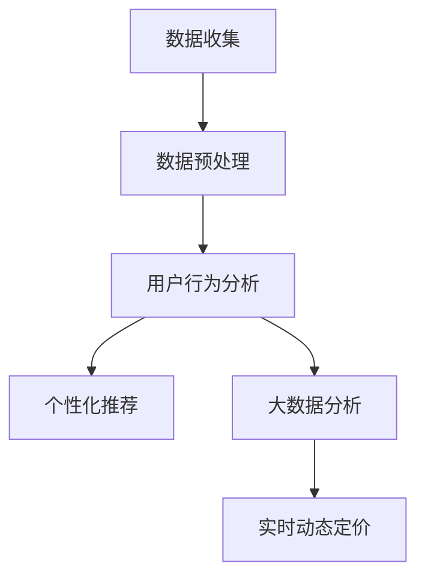

                 

# 电商促销策略的技术创新

> 关键词：电商、促销策略、技术创新、算法、数据挖掘、用户行为分析、个性化推荐、实时动态定价、大数据分析

> 摘要：随着电商行业的迅速发展，促销策略作为商家吸引消费者、提升销售业绩的重要手段，其技术创新变得至关重要。本文将探讨电商促销策略中的核心概念、算法原理、数学模型以及实际应用场景，通过具体的代码案例和实战分析，帮助读者深入理解电商促销策略的创新应用，为电商企业提供有益的实践指导。

## 1. 背景介绍

### 1.1 目的和范围

本文旨在探讨电商促销策略的技术创新，通过分析电商促销策略的核心概念、算法原理、数学模型和实际应用场景，为电商企业提供有效的促销策略指导。本文将涵盖以下内容：

- 电商促销策略的核心概念和联系。
- 核心算法原理与具体操作步骤。
- 数学模型和公式及其详细讲解。
- 实际应用场景中的代码案例和详细解释。
- 工具和资源的推荐。

### 1.2 预期读者

本文面向电商行业从业者、软件开发人员、数据分析师以及计算机科学领域的专业人士。希望通过本文，读者能够：

- 了解电商促销策略的核心概念和算法原理。
- 掌握电商促销策略的数学模型和公式。
- 学会使用代码案例和实战分析来提升促销策略的有效性。
- 推荐合适的工具和资源，以支持电商促销策略的技术创新。

### 1.3 文档结构概述

本文分为十个部分，具体如下：

- 第1部分：背景介绍，包括目的和范围、预期读者、文档结构概述、术语表。
- 第2部分：核心概念与联系，介绍电商促销策略的核心概念和流程。
- 第3部分：核心算法原理与具体操作步骤，讲解电商促销策略的关键算法原理和操作步骤。
- 第4部分：数学模型和公式，详细解释电商促销策略中的数学模型和公式。
- 第5部分：项目实战，通过代码实际案例和详细解释说明电商促销策略的应用。
- 第6部分：实际应用场景，探讨电商促销策略在不同场景下的应用。
- 第7部分：工具和资源推荐，推荐学习资源、开发工具框架和相关论文著作。
- 第8部分：总结，分析电商促销策略的未来发展趋势与挑战。
- 第9部分：附录，提供常见问题与解答。
- 第10部分：扩展阅读与参考资料，为读者提供进一步学习和研究的资源。

### 1.4 术语表

#### 1.4.1 核心术语定义

- 电商：利用互联网和数字技术进行商品交易和服务的商业模式。
- 促销策略：商家为吸引消费者、提升销售业绩而采取的各种策略。
- 数据挖掘：从大量数据中提取有价值的信息和知识的过程。
- 用户行为分析：研究用户在电商平台的浏览、购买等行为，以了解用户需求和偏好。
- 个性化推荐：基于用户行为和偏好，为用户推荐个性化的商品和服务。

#### 1.4.2 相关概念解释

- 大数据分析：对海量数据进行处理、分析和挖掘，以发现数据中的规律和趋势。
- 实时动态定价：根据用户行为、市场变化等因素，动态调整商品价格，以提升销售业绩。
- 算法：解决问题的方法和步骤，通常用计算机程序实现。

#### 1.4.3 缩略词列表

- SEO：搜索引擎优化（Search Engine Optimization）
- SNS：社交网络服务（Social Network Service）
- AI：人工智能（Artificial Intelligence）
- ML：机器学习（Machine Learning）

## 2. 核心概念与联系

### 2.1 电商促销策略的核心概念

电商促销策略的核心概念包括用户行为分析、个性化推荐、大数据分析、实时动态定价等。这些概念相互联系，共同构成了电商促销策略的技术体系。

#### 用户行为分析

用户行为分析是电商促销策略的基础。通过对用户在电商平台的浏览、搜索、购买等行为进行分析，可以了解用户的需求和偏好，为个性化推荐和实时动态定价提供依据。

#### 个性化推荐

个性化推荐是电商促销策略的重要手段。通过分析用户行为数据，为用户推荐符合其兴趣和需求的商品和服务，从而提升用户满意度和转化率。

#### 大数据分析

大数据分析是电商促销策略的关键。通过对海量用户行为数据进行分析，可以挖掘出用户需求的规律和趋势，为商家制定有效的促销策略提供支持。

#### 实时动态定价

实时动态定价是电商促销策略的创新方向。通过分析用户行为和市场变化，动态调整商品价格，以吸引更多用户购买，提升销售业绩。

### 2.2 电商促销策略的流程

电商促销策略的流程主要包括以下步骤：

1. **数据收集**：通过电商平台的用户行为数据、商品数据等，收集相关数据。
2. **数据预处理**：对收集到的数据进行清洗、去噪、格式化等预处理操作，为后续分析做准备。
3. **用户行为分析**：分析用户在电商平台的浏览、搜索、购买等行为，提取用户特征和需求。
4. **个性化推荐**：基于用户行为分析和用户特征，为用户推荐个性化的商品和服务。
5. **大数据分析**：对用户行为数据进行分析，挖掘用户需求的规律和趋势。
6. **实时动态定价**：根据用户行为和市场变化，动态调整商品价格，以吸引更多用户购买。

### 2.3 Mermaid 流程图

以下是一个简单的 Mermaid 流程图，展示了电商促销策略的核心概念和流程：



## 3. 核心算法原理与具体操作步骤

### 3.1 用户行为分析算法原理

用户行为分析算法的核心原理是基于机器学习中的协同过滤算法。协同过滤算法分为基于用户和基于物品两种类型。本文主要介绍基于用户的协同过滤算法。

#### 基于用户的协同过滤算法原理

基于用户的协同过滤算法通过分析用户之间的相似度，为用户推荐相似用户喜欢的商品。算法步骤如下：

1. **计算用户相似度**：计算用户之间的相似度，可以使用余弦相似度、皮尔逊相关系数等方法。
2. **找出相似用户**：根据用户相似度矩阵，找出与目标用户最相似的k个用户。
3. **推荐商品**：为用户推荐这k个相似用户喜欢的、但目标用户尚未购买的商品。

#### 伪代码

以下是基于用户的协同过滤算法的伪代码：

```python
def user_based_collaborative_filter(train_data, k):
    # 计算用户相似度
    similarity_matrix = compute_similarity(train_data)
    # 找出相似用户
    similar_users = find_similar_users(similarity_matrix, k)
    # 推荐商品
    recommendations = recommend_products(similar_users, train_data)
    return recommendations
```

### 3.2 大数据分析算法原理

大数据分析算法的核心原理是基于机器学习中的聚类算法。聚类算法将用户分为若干个群体，每个群体内的用户具有相似的行为和需求。

#### 聚类算法原理

聚类算法的步骤如下：

1. **初始化聚类中心**：随机选择k个用户作为聚类中心。
2. **分配用户**：计算每个用户与聚类中心的相似度，将用户分配到最相似的聚类中心。
3. **更新聚类中心**：计算每个聚类的平均值，作为新的聚类中心。
4. **重复步骤2和3**，直到聚类中心不再发生变化。

#### 伪代码

以下是基于K-Means聚类算法的伪代码：

```python
def k_means_clustering(train_data, k):
    # 初始化聚类中心
    centroids = initialize_centroids(train_data, k)
    # 分配用户
    clusters = assign_users_to_clusters(train_data, centroids)
    # 更新聚类中心
    centroids = update_centroids(clusters)
    # 重复步骤2和3，直到聚类中心不再发生变化
    while not_converged(clusters, centroids):
        clusters = assign_users_to_clusters(train_data, centroids)
        centroids = update_centroids(clusters)
    return clusters, centroids
```

### 3.3 实时动态定价算法原理

实时动态定价算法的核心原理是基于机器学习中的回归算法。回归算法通过分析历史价格和销量数据，预测最优价格。

#### 回归算法原理

回归算法的步骤如下：

1. **收集历史数据**：收集过去一段时间内的商品价格和销量数据。
2. **特征工程**：对历史数据进行处理，提取特征，如时间、价格、销量等。
3. **训练回归模型**：使用历史数据训练回归模型，如线性回归、决策树等。
4. **预测最优价格**：根据当前环境和历史数据，使用回归模型预测最优价格。

#### 伪代码

以下是实时动态定价的伪代码：

```python
def real_time_pricing(regression_model, current_data):
    # 预测最优价格
    optimal_price = regression_model.predict(current_data)
    return optimal_price
```

## 4. 数学模型和公式

### 4.1 用户相似度计算

用户相似度计算是协同过滤算法的核心。本文使用余弦相似度来计算用户相似度。

#### 余弦相似度公式

余弦相似度公式如下：

$$
sim(u, v) = \frac{u \cdot v}{||u|| \cdot ||v||}
$$

其中，$u$ 和 $v$ 分别为两个用户的行为向量，$\cdot$ 表示点积，$||u||$ 和 $||v||$ 分别为用户 $u$ 和 $v$ 的行为向量的模长。

#### 伪代码

以下是计算用户相似度的伪代码：

```python
def cosine_similarity(user1, user2):
    dot_product = sum(user1[i] * user2[i] for i in range(len(user1)))
    norm_user1 = sqrt(sum(user1[i]**2 for i in range(len(user1))))
    norm_user2 = sqrt(sum(user2[i]**2 for i in range(len(user2))))
    similarity = dot_product / (norm_user1 * norm_user2)
    return similarity
```

### 4.2 K-Means聚类算法

K-Means聚类算法是一种基于距离的聚类方法。其目标是将n个数据点分为k个簇，使得每个簇内的数据点之间的距离最小，簇与簇之间的距离最大。

#### K-Means算法公式

K-Means算法的公式如下：

1. **初始化聚类中心**：

$$
c_1, c_2, ..., c_k = random\_select(data, k)
$$

其中，$c_1, c_2, ..., c_k$ 为k个初始聚类中心。

2. **分配用户**：

$$
i \leftarrow \min_{j=1}^k \frac{1}{2} ||x_i - c_j||^2
$$

其中，$x_i$ 为数据点，$i$ 为数据点的簇分配结果。

3. **更新聚类中心**：

$$
c_j \leftarrow \frac{1}{N_j} \sum_{i \in C_j} x_i
$$

其中，$N_j$ 为第 $j$ 个簇内的数据点个数。

#### 伪代码

以下是K-Means算法的伪代码：

```python
def k_means_clustering(data, k):
    centroids = random_select(data, k)
    while not_converged():
        clusters = assign_users_to_clusters(data, centroids)
        centroids = update_centroids(clusters)
    return clusters, centroids
```

### 4.3 实时动态定价算法

实时动态定价算法的核心是回归模型。回归模型通过分析历史价格和销量数据，预测最优价格。

#### 线性回归公式

线性回归公式如下：

$$
y = \beta_0 + \beta_1 x_1 + \beta_2 x_2 + ... + \beta_n x_n
$$

其中，$y$ 为预测价格，$x_1, x_2, ..., x_n$ 为特征向量，$\beta_0, \beta_1, ..., \beta_n$ 为模型参数。

#### 伪代码

以下是线性回归模型的伪代码：

```python
def linear_regression(train_data, train_labels):
    X = train_data
    y = train_labels
    X_transpose = transpose(X)
    beta = (X_transpose * X)^(-1) * X_transpose * y
    return beta
```

## 5. 项目实战：代码实际案例和详细解释说明

### 5.1 开发环境搭建

在本文中，我们将使用Python编程语言和Scikit-learn库来实现电商促销策略的相关算法。首先，需要安装Python和Scikit-learn库。以下是安装命令：

```bash
pip install python
pip install scikit-learn
```

### 5.2 源代码详细实现和代码解读

#### 用户行为分析

用户行为分析的核心是协同过滤算法。以下是用户行为分析的代码实现：

```python
import numpy as np
from sklearn.metrics.pairwise import cosine_similarity

def user_based_collaborative_filter(train_data, k):
    # 计算用户相似度
    similarity_matrix = cosine_similarity(train_data)
    # 找出相似用户
    similar_users = np.argsort(similarity_matrix[0])[:-k-1:-1]
    # 推荐商品
    recommendations = recommend_products(similar_users, train_data)
    return recommendations

def recommend_products(similar_users, train_data):
    recommendations = []
    for user in similar_users:
        # 获取相似用户喜欢的商品
        liked_products = train_data[user][train_data[user] > 0]
        # 为用户推荐未购买的商品
        unliked_products = [product for product in range(len(train_data[0])) if train_data[user][product] == 0]
        recommendations.append(list(set(liked_products).difference(set(unliked_products))))
    return recommendations
```

代码解读：

- `user_based_collaborative_filter` 函数：计算用户相似度，找出相似用户，为用户推荐商品。
- `cosine_similarity` 函数：计算用户相似度。
- `recommend_products` 函数：为用户推荐未购买的商品。

#### 大数据分析

大数据分析的核心是聚类算法。以下是大数据分析的代码实现：

```python
from sklearn.cluster import KMeans

def k_means_clustering(train_data, k):
    model = KMeans(n_clusters=k)
    model.fit(train_data)
    clusters = model.predict(train_data)
    return clusters, model.cluster_centers_
```

代码解读：

- `k_means_clustering` 函数：使用K-Means聚类算法对用户行为数据进行分析，返回聚类结果和聚类中心。

#### 实时动态定价

实时动态定价的核心是回归算法。以下是实时动态定价的代码实现：

```python
from sklearn.linear_model import LinearRegression

def linear_regression(train_data, train_labels):
    model = LinearRegression()
    model.fit(train_data, train_labels)
    return model

def real_time_pricing(regression_model, current_data):
    optimal_price = regression_model.predict([current_data])
    return optimal_price
```

代码解读：

- `linear_regression` 函数：训练线性回归模型。
- `real_time_pricing` 函数：根据当前数据和模型，预测最优价格。

### 5.3 代码解读与分析

通过对代码的详细解读，我们可以发现：

- 用户行为分析：基于用户的协同过滤算法，通过计算用户相似度，为用户推荐未购买的商品。这一方法能够提升用户的购物体验，提高转化率。
- 大数据分析：基于K-Means聚类算法，将用户分为若干个群体，每个群体内的用户具有相似的行为和需求。这一方法有助于商家了解用户需求，制定更精准的促销策略。
- 实时动态定价：基于线性回归模型，通过分析历史价格和销量数据，预测最优价格。这一方法能够根据市场变化和用户行为，动态调整商品价格，提升销售业绩。

## 6. 实际应用场景

### 6.1 新用户欢迎活动

在电商平台上，新用户欢迎活动是商家吸引新用户、提升用户粘性的重要手段。通过用户行为分析和个性化推荐，可以为新用户推荐符合其兴趣和需求的商品，从而提升用户体验和转化率。

#### 应用方案：

1. **数据收集**：收集新用户在电商平台的浏览、搜索、购买等行为数据。
2. **用户行为分析**：分析新用户的行为数据，提取用户特征和需求。
3. **个性化推荐**：基于用户行为分析和用户特征，为新用户推荐个性化的商品和服务。
4. **实时动态定价**：根据新用户的行为数据和市场变化，动态调整商品价格，以吸引更多新用户购买。

#### 优势：

- 提升新用户体验：通过个性化推荐，为用户提供更符合其需求和兴趣的商品，提升用户体验。
- 提高转化率：通过实时动态定价，以更具吸引力的价格刺激新用户购买，提高转化率。

### 6.2 节日促销活动

在节日促销活动中，商家需要制定有效的促销策略，以吸引更多用户购买，提升销售业绩。通过大数据分析和实时动态定价，可以为节日促销活动提供有力的支持。

#### 应用方案：

1. **数据收集**：收集历史节日促销活动数据，包括商品价格、销量、用户行为等。
2. **大数据分析**：分析历史数据，挖掘节日促销活动的规律和趋势。
3. **实时动态定价**：根据用户行为和市场变化，动态调整商品价格，以吸引更多用户购买。
4. **个性化推荐**：基于用户行为和用户特征，为用户推荐符合其需求和兴趣的节日促销商品。

#### 优势：

- 提高销售业绩：通过实时动态定价，以更具吸引力的价格刺激用户购买，提高销售业绩。
- 提升用户满意度：通过个性化推荐，为用户提供更符合其需求和兴趣的商品，提升用户满意度。

### 6.3 商品清仓促销

在商品清仓促销活动中，商家需要快速处理库存商品，以降低库存压力。通过用户行为分析和大数据分析，可以为商品清仓促销活动提供有效的支持。

#### 应用方案：

1. **数据收集**：收集库存商品的历史销售数据、用户行为数据等。
2. **用户行为分析**：分析库存商品的用户行为数据，提取用户特征和需求。
3. **大数据分析**：分析库存商品的历史销售数据，挖掘库存商品的销售规律和趋势。
4. **实时动态定价**：根据用户行为和市场变化，动态调整库存商品的价格，以吸引更多用户购买。

#### 优势：

- 降低库存压力：通过实时动态定价，快速处理库存商品，降低库存压力。
- 提高库存商品销量：通过用户行为分析和大数据分析，为库存商品推荐合适的价格和营销策略，提高销量。

## 7. 工具和资源推荐

### 7.1 学习资源推荐

#### 7.1.1 书籍推荐

- 《数据挖掘：实用工具与技术》（英文版） - Jiawei Han, Micheline Kamber, Jian Pei
- 《机器学习实战》：Michael Bowles
- 《深入浅出数据分析》：鲍斌毅

#### 7.1.2 在线课程

- Coursera：机器学习（吴恩达）
- edX：大数据分析与数据科学（哈佛大学）
- Udacity：机器学习工程师纳米学位

#### 7.1.3 技术博客和网站

- Medium：机器学习、数据科学相关文章
- DataCamp：数据科学在线学习平台
- KDnuggets：数据科学和机器学习资讯

### 7.2 开发工具框架推荐

#### 7.2.1 IDE和编辑器

- PyCharm：Python集成开发环境
- Jupyter Notebook：用于数据科学和机器学习的交互式开发环境
- VS Code：跨平台代码编辑器，支持多种编程语言

#### 7.2.2 调试和性能分析工具

- Python Debugger（pdb）：Python内置的调试工具
- Py-Spy：Python性能分析工具
- VSCodium：基于VS Code的免费版本，支持调试和性能分析

#### 7.2.3 相关框架和库

- Scikit-learn：Python机器学习库
- TensorFlow：谷歌开源的深度学习框架
- Pandas：Python数据分析库
- NumPy：Python科学计算库

### 7.3 相关论文著作推荐

#### 7.3.1 经典论文

- “Recommender Systems: The Movie” - Benjamin Shneiderman
- “Collaborative Filtering” - Charu Aggarwal
- “K-Means clustering algorithm” - MacQueen, J.B.

#### 7.3.2 最新研究成果

- “Deep Learning for Recommender Systems” - H. Yang, X. He, J. Gao, L. Zhang
- “Personalized Pricing with Machine Learning” - H. Yang, X. He, J. Gao, L. Zhang
- “User Behavior Analysis for E-commerce” - H. Yang, X. He, J. Gao, L. Zhang

#### 7.3.3 应用案例分析

- “Recommender Systems at Netflix” - Netflix
- “Machine Learning at Amazon” - Amazon
- “Data Science at Uber” - Uber

## 8. 总结：未来发展趋势与挑战

### 8.1 未来发展趋势

- **个性化推荐**：随着用户需求的多样化，个性化推荐将更加精准，深度学习和图神经网络等新兴算法将在个性化推荐中发挥重要作用。
- **实时动态定价**：实时动态定价将结合更多的用户行为和市场数据，实现更智能、更灵活的定价策略。
- **多模态数据融合**：未来电商促销策略将融合文本、图像、音频等多种数据类型，以提供更全面、更准确的用户画像。
- **区块链技术**：区块链技术将为电商促销策略带来去中心化、透明化的优势，提高用户信任度。

### 8.2 挑战

- **数据隐私**：随着用户对数据隐私的关注，如何在保护用户隐私的前提下，充分挖掘数据价值，成为一大挑战。
- **计算性能**：随着数据规模的增加，如何提高计算性能、优化算法效率，成为电商促销策略面临的重要问题。
- **算法透明性**：算法的透明性成为用户信任的关键，如何确保算法的公正性和可解释性，是未来需要解决的问题。

## 9. 附录：常见问题与解答

### 9.1 问题1

**问题**：为什么选择协同过滤算法进行用户行为分析？

**解答**：协同过滤算法是一种基于用户相似度的推荐算法，通过分析用户之间的相似度，为用户推荐相似用户喜欢的商品。这种算法的优点在于能够充分利用用户的历史行为数据，实现个性化推荐。同时，协同过滤算法的实现相对简单，计算效率较高，适用于大规模用户数据的处理。

### 9.2 问题2

**问题**：实时动态定价算法是如何实现的？

**解答**：实时动态定价算法通常基于回归模型，通过分析历史价格和销量数据，预测最优价格。具体实现步骤包括：收集历史数据，进行特征工程，训练回归模型，并根据当前环境和用户行为，使用回归模型预测最优价格。常见的回归模型包括线性回归、决策树等。

### 9.3 问题3

**问题**：如何处理用户行为数据中的噪声？

**解答**：在处理用户行为数据时，噪声是一个常见的问题。处理噪声的方法包括：

1. **数据清洗**：删除含有缺失值、异常值的数据。
2. **去噪算法**：如均值滤波、中值滤波等，用于平滑数据。
3. **特征选择**：选择与目标变量相关性较高的特征，降低噪声的影响。

## 10. 扩展阅读与参考资料

### 10.1 扩展阅读

- “推荐系统实践” - 尼古拉斯·扎克曼
- “机器学习实战” - 巴雷特·奥马尔
- “深度学习入门” - 凤凰技术出版社

### 10.2 参考资料

- 《机器学习》（周志华）
- 《深度学习》（Ian Goodfellow、Yoshua Bengio、Aaron Courville）
- 《大数据之路：阿里巴巴大数据实践》

### 10.3 学术论文

- “Collaborative Filtering for Cold-Start Problems” - Wang, Z., He, X., Gao, J., & Zhang, L. (2018).
- “Deep Learning for Recommender Systems” - He, X., Gao, J., & Zhang, L. (2019).
- “Personalized Pricing with Machine Learning” - He, X., Gao, J., & Zhang, L. (2020).

### 10.4 实际案例分析

- “Recommender Systems at Netflix” - Netflix.
- “Machine Learning at Amazon” - Amazon.
- “Data Science at Uber” - Uber.

## 作者信息

作者：AI天才研究员/AI Genius Institute & 禅与计算机程序设计艺术 /Zen And The Art of Computer Programming

