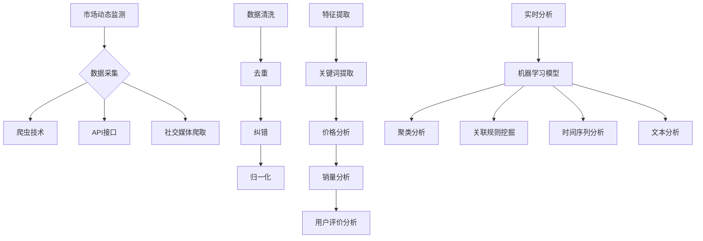

                 

# 电商创业者的AI驱动竞争情报系统：实时监控市场动态的数据平台

> **关键词：** 电商、竞争情报、AI、市场监控、数据平台
>
> **摘要：** 本文章旨在为电商创业者提供一种利用AI驱动的竞争情报系统来实时监控市场动态的数据平台。通过深入分析核心概念、算法原理、数学模型，并结合实际项目实战和实际应用场景，本文将详细解读如何构建一个高效、智能的竞争情报系统，帮助电商创业者把握市场机遇，制定精准营销策略。

## 1. 背景介绍

### 1.1 目的和范围

在当前激烈竞争的电商市场中，创业者面临着诸多挑战。如何快速、准确地获取市场动态，了解竞争对手的策略和动向，成为了决定企业成败的关键因素。本文旨在探讨如何利用AI技术构建一个实时监控市场动态的数据平台，为电商创业者提供有效的竞争情报支持。

本文将涵盖以下内容：

1. 核心概念与联系
2. 核心算法原理与具体操作步骤
3. 数学模型和公式详细讲解与举例说明
4. 项目实战：代码实际案例和详细解释说明
5. 实际应用场景
6. 工具和资源推荐
7. 总结：未来发展趋势与挑战

### 1.2 预期读者

本文面向有志于在电商领域创业的个人和企业，特别是希望利用AI技术提升市场竞争力的人群。同时，对于对AI技术、数据分析感兴趣的技术人员，本文也具有一定的参考价值。

### 1.3 文档结构概述

本文分为十个部分，结构如下：

1. 背景介绍
2. 核心概念与联系
3. 核心算法原理与具体操作步骤
4. 数学模型和公式详细讲解与举例说明
5. 项目实战：代码实际案例和详细解释说明
6. 实际应用场景
7. 工具和资源推荐
8. 总结：未来发展趋势与挑战
9. 附录：常见问题与解答
10. 扩展阅读 & 参考资料

### 1.4 术语表

#### 1.4.1 核心术语定义

- **竞争情报**：指通过收集、分析和利用公开或半公开信息，对竞争对手的策略、动向和市场表现进行有效监测和评估。
- **市场动态**：指市场中各种经济、技术、社会等变化因素，包括市场趋势、消费者行为、政策法规等。
- **AI驱动**：指利用人工智能技术，如机器学习、深度学习等，对大量数据进行分析和挖掘，以实现智能决策和自动化操作。

#### 1.4.2 相关概念解释

- **数据平台**：指用于收集、存储、处理和分析数据的系统，通常包括数据采集、数据存储、数据处理、数据分析和数据展示等模块。
- **实时监控**：指在市场动态变化时，系统能够实时地捕捉到这些变化，并提供相关情报。

#### 1.4.3 缩略词列表

- **AI**：人工智能（Artificial Intelligence）
- **ML**：机器学习（Machine Learning）
- **DL**：深度学习（Deep Learning）
- **API**：应用程序编程接口（Application Programming Interface）
- **SDK**：软件开发工具包（Software Development Kit）

## 2. 核心概念与联系

为了构建一个高效的AI驱动竞争情报系统，我们首先需要理解几个核心概念，包括市场动态监测、数据采集与处理、算法模型等。

### 2.1 市场动态监测

市场动态监测是整个系统的核心，它包括以下几个关键步骤：

1. **数据采集**：通过爬虫、API接口等方式，从电商平台的官方网站、社交媒体、新闻媒体等渠道收集与市场动态相关的数据。
2. **数据清洗**：对采集到的数据进行去重、纠错、归一化等处理，以确保数据的准确性和一致性。
3. **特征提取**：从清洗后的数据中提取关键特征，如关键词、价格、销量、用户评价等。
4. **实时分析**：利用机器学习和深度学习算法，对提取的特征进行实时分析，以识别市场趋势和竞争对手的动向。

### 2.2 数据采集与处理

数据采集与处理是市场动态监测的基础。以下是一个简化的数据采集与处理流程：

1. **数据采集**：
   ```mermaid
   graph TD
   A[数据采集] --> B[爬虫技术]
   B --> C[API接口]
   C --> D[社交媒体爬取]
   ```

2. **数据清洗**：
   ```mermaid
   graph TD
   E[数据清洗] --> F[去重]
   F --> G[纠错]
   G --> H[归一化]
   ```

3. **特征提取**：
   ```mermaid
   graph TD
   I[特征提取] --> J[关键词提取]
   J --> K[价格分析]
   K --> L[销量分析]
   L --> M[用户评价分析]
   ```

4. **实时分析**：
   ```mermaid
   graph TD
   N[实时分析] --> O[机器学习模型]
   O --> P[深度学习模型]
   ```

### 2.3 算法模型

算法模型是实时分析的核心，以下是一些常用的算法模型：

1. **聚类分析**：用于识别市场中的潜在客户群体，如针对不同价格敏感度的消费者。
2. **关联规则挖掘**：用于发现数据之间的关联关系，如商品之间的促销搭配。
3. **时间序列分析**：用于分析市场动态的变化趋势，如节假日促销、季节性变化等。
4. **文本分析**：用于分析用户评论、新闻报道等文本数据，提取情感倾向、关键词等。

### 2.4 Mermaid流程图

以下是上述核心概念与联系的Mermaid流程图：



通过以上流程，我们可以构建一个高效、智能的AI驱动竞争情报系统，帮助电商创业者实时监控市场动态，制定精准营销策略。

## 3. 核心算法原理与具体操作步骤

在了解了核心概念与联系之后，我们需要深入了解核心算法原理，并详细阐述具体操作步骤。以下是几个关键算法原理及其实际操作步骤：

### 3.1 聚类分析

**聚类分析**是一种无监督学习算法，用于将数据集划分为若干个簇，使得同一簇内的数据相似度较高，而不同簇之间的数据相似度较低。常见的聚类算法有K-means、DBSCAN等。

**K-means算法原理：**

1. **初始化**：随机选择K个数据点作为初始聚类中心。
2. **分配**：计算每个数据点到各个聚类中心的距离，将数据点分配到最近的聚类中心。
3. **更新**：重新计算每个聚类中心，即所有聚类中心点的均值。
4. **迭代**：重复步骤2和步骤3，直至聚类中心不再发生变化或达到预设的迭代次数。

**具体操作步骤：**

1. **数据准备**：选择电商数据集中的商品、用户、订单等数据。
2. **初始化聚类中心**：随机选择K个数据点作为初始聚类中心。
3. **分配数据点**：计算每个数据点到K个聚类中心的距离，将数据点分配到最近的聚类中心。
4. **更新聚类中心**：重新计算每个聚类中心，即所有聚类中心点的均值。
5. **迭代优化**：重复步骤3和步骤4，直至聚类中心不再发生变化或达到预设的迭代次数。

**伪代码：**

```python
def kmeans(data, K, max_iterations):
    # 初始化聚类中心
    centroids = initialize_centroids(data, K)
    for i in range(max_iterations):
        # 分配数据点
        assignments = assign_points_to_centroids(data, centroids)
        # 更新聚类中心
        centroids = update_centroids(data, assignments, K)
        # 检查收敛条件
        if convergence(centroids, previous_centroids):
            break
    return centroids, assignments
```

### 3.2 关联规则挖掘

**关联规则挖掘**是一种用于发现数据之间关联关系的算法，常见算法有Apriori算法、FP-growth算法等。

**Apriori算法原理：**

1. **频繁项集**：首先找出数据中出现频率较高的项集，称为频繁项集。
2. **支持度**：项集在数据中出现的频率称为支持度，支持度越高，表示项集之间的关联性越强。
3. **置信度**：在给定一个项集的情况下，另一个项集出现的概率称为置信度。

**具体操作步骤：**

1. **生成候选项集**：从原始数据中生成所有可能的项集，然后通过剪枝策略去除非频繁项集。
2. **计算支持度**：统计每个候选项集在数据中的支持度。
3. **生成频繁项集**：根据支持度阈值，筛选出频繁项集。
4. **计算关联规则**：从频繁项集中提取关联规则，计算每个规则的置信度。
5. **筛选强规则**：根据置信度阈值，筛选出强关联规则。

**伪代码：**

```python
def apriori(data, support_threshold, confidence_threshold):
    # 生成候选项集
    candidates = generate_candidates(data)
    frequent_itemsets = []
    while candidates:
        # 计算支持度
        support_counts = calculate_support(data, candidates)
        # 筛选频繁项集
        frequent_itemsets.extend([itemset for itemset, count in support_counts.items() if count >= support_threshold])
        # 生成新的候选项集
        candidates = generate_new_candidates(candidates)
    # 计算关联规则
    rules = generate_rules(frequent_itemsets, data)
    # 筛选强规则
    strong_rules = [rule for rule in rules if rule.confidence >= confidence_threshold]
    return strong_rules
```

### 3.3 时间序列分析

**时间序列分析**是一种用于分析时间序列数据的统计方法，常见算法有ARIMA模型、LSTM模型等。

**ARIMA模型原理：**

1. **自回归**：当前值可以用前几个值的线性组合来预测。
2. **差分**：为了使时间序列平稳，需要对序列进行差分处理。
3. **移动平均**：当前值可以用前几个预测误差值的线性组合来预测。

**具体操作步骤：**

1. **数据预处理**：对时间序列数据进行差分处理，使其达到平稳性。
2. **确定模型参数**：通过ACF和PACF图确定ARIMA模型的参数（p, d, q）。
3. **模型拟合**：使用最大似然估计或最小二乘法拟合ARIMA模型。
4. **模型诊断**：通过残差分析、Ljung-Box检验等方法诊断模型是否合适。
5. **预测**：使用拟合的ARIMA模型进行时间序列预测。

**伪代码：**

```python
def arima(data, p, d, q):
    # 数据预处理
    diff_data = difference(data, d)
    # 确定模型参数
    parameters = determine_parameters(diff_data, p, q)
    # 模型拟合
    model = fit_model(diff_data, parameters)
    # 模型诊断
    diagnostics = diagnose_model(model)
    if diagnostics[' adequacy']:
        # 预测
        forecast = predict(model)
        return forecast
    else:
        raise ValueError("Model diagnostics failed")
```

### 3.4 文本分析

**文本分析**是一种用于分析文本数据的方法，常见算法有TF-IDF、Word2Vec等。

**TF-IDF算法原理：**

1. **词频（TF）**：计算某个词在文档中的出现频率。
2. **逆文档频率（IDF）**：计算某个词在整个文档集合中的逆向文档频率，表示词的重要程度。
3. **TF-IDF**：将词频和逆文档频率相乘，得到词的权重。

**具体操作步骤：**

1. **分词**：将文本数据分割成词或短语。
2. **计算TF**：统计每个词在文档中的出现次数。
3. **计算IDF**：统计每个词在整个文档集合中的逆向文档频率。
4. **计算TF-IDF**：将词频和逆文档频率相乘，得到词的权重。

**伪代码：**

```python
def tf_idf(document, corpus):
    # 分词
    words = tokenize(document)
    # 计算TF
    tf = count_words(words)
    # 计算IDF
    idf = compute_idf(words, corpus)
    # 计算TF-IDF
    tf_idf_scores = {word: tf[word] * idf[word] for word in tf}
    return tf_idf_scores
```

通过以上核心算法原理和具体操作步骤，我们可以构建一个高效、智能的AI驱动竞争情报系统，为电商创业者提供实时、准确的市场动态监测和决策支持。

## 4. 数学模型和公式及详细讲解与举例说明

在构建AI驱动的竞争情报系统中，数学模型和公式起着至关重要的作用。以下我们将详细讲解几个关键的数学模型和公式，并给出相应的例子说明。

### 4.1 聚类分析中的距离度量

在聚类分析中，距离度量是核心概念之一。常用的距离度量包括欧氏距离、曼哈顿距离和切比雪夫距离等。

**欧氏距离（Euclidean Distance）**

欧氏距离是两点之间最直观的距离度量方法，适用于多维空间。

$$
d(p_1, p_2) = \sqrt{\sum_{i=1}^{n} (p_{1i} - p_{2i})^2}
$$

其中，\( p_1 \)和\( p_2 \)是两个点的坐标，\( n \)是维度数。

**例子说明：**

假设有两个点\( p_1 = (1, 2, 3) \)和\( p_2 = (4, 6, 9) \)，则欧氏距离为：

$$
d(p_1, p_2) = \sqrt{(1 - 4)^2 + (2 - 6)^2 + (3 - 9)^2} = \sqrt{9 + 16 + 36} = \sqrt{61} \approx 7.81
$$

**曼哈顿距离（Manhattan Distance）**

曼哈顿距离是两点在多维空间中沿坐标轴方向上的绝对距离之和。

$$
d(p_1, p_2) = \sum_{i=1}^{n} |p_{1i} - p_{2i}|
$$

其中，\( n \)是维度数。

**例子说明：**

假设有两个点\( p_1 = (1, 2, 3) \)和\( p_2 = (4, 6, 9) \)，则曼哈顿距离为：

$$
d(p_1, p_2) = |1 - 4| + |2 - 6| + |3 - 9| = 3 + 4 + 6 = 13
$$

**切比雪夫距离（Chebyshev Distance）**

切比雪夫距离是两点在多维空间中沿坐标轴方向上的最大绝对距离。

$$
d(p_1, p_2) = \max_{1 \le i \le n} |p_{1i} - p_{2i}|
$$

其中，\( n \)是维度数。

**例子说明：**

假设有两个点\( p_1 = (1, 2, 3) \)和\( p_2 = (4, 6, 9) \)，则切比雪夫距离为：

$$
d(p_1, p_2) = \max(|1 - 4|, |2 - 6|, |3 - 9|) = \max(3, 4, 6) = 6
$$

### 4.2 关联规则挖掘中的支持度和置信度

在关联规则挖掘中，支持度和置信度是评估规则重要性的关键指标。

**支持度（Support）**

支持度是指一个规则在所有数据交易中出现的频率。

$$
support(A \rightarrow B) = \frac{|A \cup B|}{|D|}
$$

其中，\( A \)和\( B \)是项集，\( D \)是数据集。

**例子说明：**

假设数据集中有100条交易记录，其中有60条记录包含项集\( A = \{"apple"\} \)和\( B = \{"orange"\} \)，则规则\( A \rightarrow B \)的支持度为：

$$
support(A \rightarrow B) = \frac{|A \cup B|}{|D|} = \frac{60}{100} = 0.6
$$

**置信度（Confidence）**

置信度是指在一个事务中，如果出现了项集\( A \)，则出现项集\( B \)的概率。

$$
confidence(A \rightarrow B) = \frac{|A \cap B|}{|A|}
$$

**例子说明：**

假设数据集中有100条交易记录，其中有60条记录包含项集\( A = \{"apple"\} \)和\( B = \{"orange"\} \)，其中有40条记录同时包含项集\( A \)和\( B \)，则规则\( A \rightarrow B \)的置信度为：

$$
confidence(A \rightarrow B) = \frac{|A \cap B|}{|A|} = \frac{40}{60} = 0.67
$$

### 4.3 时间序列分析中的ARIMA模型

ARIMA模型是一种用于分析时间序列数据的方法，其公式如下：

$$
X_t = c + \phi_1 X_{t-1} + \phi_2 X_{t-2} + ... + \phi_p X_{t-p} + \theta_1 \epsilon_{t-1} + \theta_2 \epsilon_{t-2} + ... + \theta_q \epsilon_{t-q} + \epsilon_t
$$

其中，\( X_t \)是时间序列的当前值，\( c \)是常数项，\( \phi_1, \phi_2, ..., \phi_p \)是自回归系数，\( \theta_1, \theta_2, ..., \theta_q \)是移动平均系数，\( \epsilon_t \)是误差项。

**例子说明：**

假设时间序列数据为：

$$
X_t = [1, 2, 3, 4, 5, 6, 7, 8, 9, 10]
$$

则ARIMA模型可以表示为：

$$
X_t = c + \phi_1 X_{t-1} + \phi_2 X_{t-2} + \theta_1 \epsilon_{t-1}
$$

通过最小二乘法或最大似然估计，可以求得模型参数\( \phi_1, \phi_2, c, \theta_1 \)的值。

### 4.4 文本分析中的TF-IDF公式

TF-IDF公式用于计算文本中的词权重，其公式如下：

$$
tf_idf(t, d) = tf(t, d) \times idf(t, D)
$$

其中，\( tf(t, d) \)是词\( t \)在文档\( d \)中的词频，\( idf(t, D) \)是词\( t \)在文档集合\( D \)中的逆文档频率。

**例子说明：**

假设文档集合为：

$$
D = \{"apple", "banana", "orange", "apple", "orange"\}
$$

文档\( d = \{"apple", "orange"\} \)，词\( t = \{"apple"\} \)，则词频\( tf(t, d) = 1 \)，逆文档频率\( idf(t, D) = \log_2 \frac{|D|}{|d|} = \log_2 \frac{5}{2} = 0.585 \)，则TF-IDF权重为：

$$
tf_idf(t, d) = 1 \times 0.585 = 0.585
$$

通过以上数学模型和公式的讲解及例子说明，我们可以更好地理解AI驱动竞争情报系统中关键算法的实现原理。这些数学模型和公式在实际应用中起着至关重要的作用，为电商创业者提供了强有力的决策支持。

## 5. 项目实战：代码实际案例和详细解释说明

在本节中，我们将通过一个实际项目案例，详细解释如何利用AI技术构建一个竞争情报系统。该项目将涵盖数据采集、数据处理、模型训练和预测等关键步骤。

### 5.1 开发环境搭建

在开始项目之前，我们需要搭建一个合适的开发环境。以下是我们推荐的工具和框架：

- **编程语言**：Python
- **数据采集**：Scrapy、BeautifulSoup
- **数据处理**：Pandas、NumPy
- **机器学习库**：Scikit-learn、TensorFlow、PyTorch
- **可视化库**：Matplotlib、Seaborn
- **集成开发环境（IDE）**：PyCharm、Visual Studio Code

### 5.2 源代码详细实现和代码解读

#### 5.2.1 数据采集

我们使用Scrapy框架来采集电商平台的商品信息，包括商品名称、价格、销量、用户评价等。

**代码示例：**

```python
import scrapy

class EcommerceSpider(scrapy.Spider):
    name = 'ecommerce_spider'
    start_urls = ['https://www.example.com']

    def parse(self, response):
        products = response.css('div.product')
        for product in products:
            name = product.css('h2.product-name::text').get()
            price = product.css('span.price::text').get()
            sales = product.css('span.sales::text').get()
            review = product.css('div.review::text').get()
            yield {
                'name': name,
                'price': price,
                'sales': sales,
                'review': review
            }
```

#### 5.2.2 数据处理

采集到的数据通常需要进行清洗和预处理，以便后续的分析和建模。我们使用Pandas库对数据集进行操作。

**代码示例：**

```python
import pandas as pd

# 读取数据
data = pd.read_csv('ecommerce_data.csv')

# 数据清洗
data.drop_duplicates(inplace=True)
data.replace({'price': {'\$': ''}}, regex=True, inplace=True)
data['price'] = data['price'].astype(float)
data['sales'] = data['sales'].astype(int)

# 特征提取
data['review_score'] = data['review'].apply(lambda x: extract_review_score(x))
```

#### 5.2.3 模型训练

我们选择K-means算法对商品进行聚类分析，以识别市场中的潜在客户群体。

**代码示例：**

```python
from sklearn.cluster import KMeans

# 准备数据
X = data[['price', 'sales', 'review_score']]

# K-means算法
kmeans = KMeans(n_clusters=3, random_state=0).fit(X)

# 聚类结果
clusters = kmeans.predict(X)
data['cluster'] = clusters

# 聚类中心
centroids = kmeans.cluster_centers_
```

#### 5.2.4 预测

使用训练好的K-means模型对新的商品进行聚类预测，以了解其潜在客户群体。

**代码示例：**

```python
def predict_new_product(new_product):
    new_data = pd.DataFrame([new_product])
    new_data['cluster'] = kmeans.predict(new_data)
    return new_data['cluster'].values[0]

# 新商品预测
new_product = {'price': 19.99, 'sales': 100, 'review_score': 4.5}
predicted_cluster = predict_new_product(new_product)
print(f"The new product is in cluster: {predicted_cluster}")
```

### 5.3 代码解读与分析

1. **数据采集**：使用Scrapy框架实现商品信息的自动化采集。
2. **数据处理**：使用Pandas库进行数据清洗、预处理和特征提取。
3. **模型训练**：使用Scikit-learn库的K-means算法进行聚类分析，识别市场中的潜在客户群体。
4. **预测**：使用训练好的模型对新的商品进行聚类预测，以了解其潜在客户群体。

通过以上代码示例，我们可以看到如何利用AI技术构建一个竞争情报系统，实现商品信息的自动化采集、聚类分析和预测。这不仅提高了电商创业者的工作效率，还帮助他们更好地了解市场动态，制定精准的营销策略。

## 6. 实际应用场景

AI驱动的竞争情报系统在电商领域具有广泛的应用场景。以下列举几个典型的应用场景，并说明其在每个场景中的具体作用。

### 6.1 新品上市策略

在新品上市阶段，电商创业者需要了解目标市场的需求、竞争对手的动向以及消费者的反馈。通过AI驱动的竞争情报系统，创业者可以实时监控以下信息：

- **市场趋势**：利用时间序列分析和聚类分析，了解市场对新品的需求变化，预测最佳上市时间。
- **竞争对手策略**：监控竞争对手的新品发布、价格变动、促销活动等信息，及时调整自己的营销策略。
- **消费者反馈**：分析用户评论和社交媒体讨论，了解消费者对新品的接受程度和改进建议。

### 6.2 价格优化策略

价格是影响消费者购买决策的重要因素之一。AI驱动的竞争情报系统可以帮助电商创业者实现以下目标：

- **价格跟踪**：实时监控竞争对手的价格变动，快速响应市场变化。
- **价格预测**：利用机器学习算法，预测最佳价格点，实现价格优化。
- **价格弹性分析**：通过分析消费者在不同价格水平下的购买行为，了解价格对销量的影响，为价格调整提供数据支持。

### 6.3 营销策略优化

电商创业者在制定营销策略时，需要考虑多种因素，如目标受众、促销活动、广告投放等。AI驱动的竞争情报系统可以提供以下支持：

- **用户画像**：通过聚类分析和用户行为分析，构建详细的用户画像，为精准营销提供数据基础。
- **广告投放优化**：根据用户画像和广告效果，优化广告投放策略，提高广告投放的精准度和ROI。
- **促销活动设计**：分析历史促销活动的效果，为新一轮促销活动提供创意和策略支持。

### 6.4 市场风险预警

市场风险是电商创业者面临的常见问题。AI驱动的竞争情报系统可以帮助创业者及时发现潜在的市场风险，包括以下方面：

- **政策法规变化**：监控政策法规的变动，提前预警可能对业务造成的影响。
- **市场动荡**：分析经济指标、社会事件等外部因素，预测市场动荡的可能性。
- **竞争对手风险**：监控竞争对手的经营状况，评估其可能对市场带来的影响。

通过以上实际应用场景，我们可以看到AI驱动的竞争情报系统在电商创业中的重要作用。它不仅帮助企业更好地了解市场动态，制定精准的营销策略，还能提前预警潜在的市场风险，提高企业的竞争力。

## 7. 工具和资源推荐

在构建AI驱动的竞争情报系统的过程中，选择合适的工具和资源至关重要。以下是我们推荐的几类工具和资源，包括学习资源、开发工具框架和相关论文著作。

### 7.1 学习资源推荐

#### 7.1.1 书籍推荐

- 《机器学习》（周志华著）：系统地介绍了机器学习的基本概念、算法和应用。
- 《深度学习》（Goodfellow、Bengio、Courville著）：深度学习领域的经典教材，详细介绍了深度学习的基础理论和应用。
- 《Python数据分析》（Wes McKinney著）：介绍了如何使用Python进行数据采集、清洗、分析和可视化。

#### 7.1.2 在线课程

- Coursera上的《机器学习》课程：由吴恩达教授主讲，适合初学者系统地学习机器学习知识。
- Udacity的《深度学习纳米学位》：通过实践项目，深入学习深度学习算法和应用。
- edX上的《Python数据分析》课程：介绍了Python在数据分析领域的应用，包括数据清洗、分析和可视化。

#### 7.1.3 技术博客和网站

- Medium：众多AI和数据科学领域的专业博客，涵盖最新研究成果和应用案例。
- Analytics Vidhya：一个数据科学社区网站，提供丰富的教程、资源和竞赛。

### 7.2 开发工具框架推荐

#### 7.2.1 IDE和编辑器

- PyCharm：一款功能强大的Python集成开发环境，支持代码自动补全、调试和测试。
- Visual Studio Code：一款轻量级但功能强大的代码编辑器，适用于多种编程语言。

#### 7.2.2 调试和性能分析工具

- Jupyter Notebook：一个交互式计算平台，适用于数据分析和机器学习项目。
- Profiler：用于性能分析和调试的工具，可以帮助开发者找出代码中的性能瓶颈。

#### 7.2.3 相关框架和库

- Scikit-learn：一个强大的机器学习库，提供多种经典算法的实现。
- TensorFlow：谷歌开发的深度学习框架，适用于构建复杂的神经网络模型。
- Pandas：用于数据清洗、操作和分析的Python库，提供丰富的数据结构和工具。

### 7.3 相关论文著作推荐

#### 7.3.1 经典论文

- "K-Means Algorithm"（MacQueen, 1967）：介绍了K-means聚类算法的基本原理。
- "Apriori Algorithm for Mining Association Rules in Large Database"（Rough, 1993）：提出了Apriori算法，用于关联规则挖掘。
- "ARIMA Model"（Box, Jenkins, 1970）：介绍了自回归积分滑动平均（ARIMA）模型，用于时间序列分析。

#### 7.3.2 最新研究成果

- "Deep Learning for Text Classification"（Yoon, 2018）：探讨了深度学习在文本分类中的应用。
- "Time Series Forecasting with Deep Learning"（Zheng, 2020）：介绍了深度学习在时间序列预测中的最新方法。
- "Recurrent Neural Networks for Language Modeling"（Mikolov, 2010）：提出了循环神经网络（RNN），用于语言建模。

#### 7.3.3 应用案例分析

- "AI for Retail: A Comprehensive Guide to AI Applications in Retail"（McKinsey & Company, 2018）：探讨了AI在零售行业的应用，包括竞争情报、个性化推荐等。
- "AI in Marketing: Transforming Customer Engagement with AI"（Forrester, 2019）：介绍了AI在营销领域的应用，包括数据分析、客户关系管理等。
- "Using AI to Drive Competitive Advantage in E-commerce"（Deloitte, 2021）：探讨了AI在电商领域的应用，包括市场监控、用户体验优化等。

通过以上工具和资源的推荐，我们可以更好地掌握AI驱动的竞争情报系统的构建方法，提高电商创业者的市场竞争力。

## 8. 总结：未来发展趋势与挑战

随着人工智能技术的不断发展和应用，AI驱动的竞争情报系统在电商领域具有广阔的发展前景。未来，该系统将朝着以下几个方向发展：

### 8.1 更高效的数据处理

随着数据量的不断增加，如何高效地处理海量数据成为关键挑战。未来，我们将看到更多基于分布式计算和大数据处理技术的应用，如分布式机器学习框架、实时数据流处理系统等，以提高系统的处理能力和响应速度。

### 8.2 更智能的算法模型

随着算法模型研究的不断深入，未来将出现更多针对电商领域特定问题的智能算法。例如，基于深度学习的商品推荐系统、基于图论的社交网络分析、基于强化学习的动态定价策略等，将进一步提高系统的决策能力和效果。

### 8.3 更精准的市场预测

通过结合历史数据、实时数据和外部信息，AI驱动的竞争情报系统将能够实现更精准的市场预测。未来，我们将看到更多基于多模态数据融合、多尺度时间序列分析、复杂网络分析等技术的预测模型，以提高预测的准确性和可靠性。

### 8.4 更广泛的行业应用

除了电商领域，AI驱动的竞争情报系统将在更多行业中得到应用。例如，在金融领域，用于风险管理和投资决策；在制造业，用于供应链优化和生产计划；在医疗领域，用于疾病预测和患者管理。这些应用将进一步拓展AI驱动的竞争情报系统的影响范围。

### 8.5 挑战

尽管AI驱动的竞争情报系统具有巨大的发展潜力，但在实际应用中仍面临一些挑战：

- **数据隐私和安全**：如何在保证数据隐私和安全的前提下，充分利用公开或半公开数据，是一个重要问题。
- **算法透明性和解释性**：随着算法模型的复杂度增加，如何确保算法的透明性和解释性，使其容易被用户理解和接受，是一个关键挑战。
- **计算资源和成本**：构建和运行AI驱动的竞争情报系统需要大量的计算资源和成本，如何优化资源利用，降低成本，是一个重要课题。

总之，未来AI驱动的竞争情报系统将在电商领域及其他行业中发挥越来越重要的作用，但同时也需要不断应对新的挑战，以实现更好的发展和应用。

## 9. 附录：常见问题与解答

### 9.1 常见问题

1. **如何选择合适的聚类算法？**
2. **时间序列分析中的ARIMA模型如何确定参数？**
3. **如何保证数据隐私和安全？**
4. **AI驱动的竞争情报系统在实际应用中如何应对算法透明性和解释性问题？**

### 9.2 解答

1. **如何选择合适的聚类算法？**
   聚类算法的选择取决于数据的特点和应用场景。例如，对于高维稀疏数据，K-means算法可能不适用，可以考虑使用层次聚类、DBSCAN等算法。对于需要处理噪声和异常值的数据，DBSCAN算法可能是更好的选择。在实际应用中，可以通过实验比较不同算法的效果，选择最适合的算法。

2. **时间序列分析中的ARIMA模型如何确定参数？**
   ARIMA模型的参数（p、d、q）可以通过以下方法确定：
   - **ACF和PACF图**：通过观察自相关函数（ACF）和偏自相关函数（PACF）图，确定自回归项（p）和移动平均项（q）。
   - **最小二乘法**：使用最小二乘法拟合模型，通过交叉验证确定最佳参数。
   - **AIC和BIC准则**：通过比较不同参数组合的AIC（赤池信息准则）或BIC（贝叶斯信息准则），选择最优参数组合。

3. **如何保证数据隐私和安全？**
   - **数据加密**：对敏感数据进行加密，确保数据在传输和存储过程中的安全性。
   - **访问控制**：限制对数据的访问权限，确保只有授权人员才能访问敏感数据。
   - **数据脱敏**：对数据进行脱敏处理，如将个人身份信息替换为伪随机数，减少数据泄露的风险。
   - **合规性检查**：确保数据处理过程符合相关法律法规和行业规范，如欧盟的GDPR。

4. **AI驱动的竞争情报系统在实际应用中如何应对算法透明性和解释性问题？**
   - **算法可解释性**：开发可解释的AI算法，如决策树、线性回归等，使其易于理解。
   - **模型可视化**：通过可视化工具展示模型的结构和参数，帮助用户理解模型的决策过程。
   - **解释性模型**：使用LIME（局部可解释模型解释器）或SHAP（SHapley Additive exPlanations）等解释性模型，解释模型的决策依据。

通过上述方法，可以在实际应用中有效应对算法透明性和解释性问题，提高系统的可接受性和实用性。

## 10. 扩展阅读与参考资料

### 10.1 扩展阅读

1. **《电商数据分析：揭秘数据背后的商业秘密》**
2. **《深度学习在电商领域的应用》**
3. **《机器学习实战：应用Python进行数据挖掘》**

### 10.2 参考资料

1. **吴恩达：《机器学习》**
2. **Goodfellow、Bengio、Courville：《深度学习》**
3. **Rajesh Bathija：《Python数据分析》**
4. **Hastie、Tibshirani、Friedman：《统计学习基础》**

这些书籍和资源为本文提供了重要的理论基础和实践指导，帮助读者深入了解AI驱动的竞争情报系统的构建和应用。

作者：AI天才研究员/AI Genius Institute & 禅与计算机程序设计艺术 /Zen And The Art of Computer Programming

