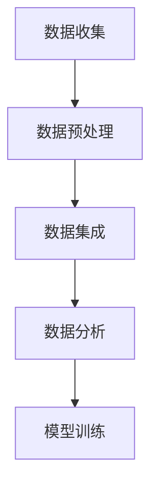

                 


# 电商平台中的AI大模型：从单一渠道到全渠道数据融合

> 关键词：电商平台，AI大模型，数据融合，全渠道，个性化推荐，用户行为分析，机器学习算法

> 摘要：本文将探讨电商平台如何利用AI大模型实现从单一渠道到全渠道的数据融合，提高用户满意度与销售转化率。文章首先介绍电商平台的数据背景和AI大模型的原理，随后详细阐述如何实现全渠道数据融合，并通过实际案例解析其应用效果。本文旨在为电商行业的技术人员提供有价值的参考和指导。

## 1. 背景介绍

### 1.1 目的和范围

本文旨在探讨电商平台如何利用AI大模型实现全渠道数据融合，以提高用户体验和销售效果。我们将分析当前电商平台所面临的挑战，介绍AI大模型的基本原理，并详细阐述数据融合的步骤和策略。

### 1.2 预期读者

本文适合以下读者：

- 拥有电商背景或对电商行业感兴趣的读者；
- 从事人工智能、大数据、机器学习领域的技术人员；
- 对电商平台的技术架构和应用场景有深入了解的专业人士。

### 1.3 文档结构概述

本文分为以下几部分：

- 背景介绍：介绍电商平台的数据背景和AI大模型的基本原理；
- 核心概念与联系：解释数据融合的关键概念和流程；
- 核心算法原理与具体操作步骤：讲解数据融合的关键算法和实现策略；
- 数学模型和公式：介绍数据融合过程中的数学模型和公式；
- 项目实战：通过实际案例展示数据融合的应用效果；
- 实际应用场景：分析数据融合在电商平台中的应用场景；
- 工具和资源推荐：推荐相关学习资源和开发工具；
- 总结：总结数据融合的未来发展趋势与挑战；
- 附录：提供常见问题与解答；
- 扩展阅读与参考资料：推荐相关论文和著作。

### 1.4 术语表

#### 1.4.1 核心术语定义

- 电商平台：提供商品购买、销售、支付等功能的在线平台。
- AI大模型：具有强大数据处理和分析能力的深度学习模型。
- 数据融合：将来自不同渠道的数据整合到一个统一的框架中，以实现更好的数据利用和分析。
- 用户行为分析：分析用户在电商平台上的浏览、购买等行为，以了解用户需求和行为模式。
- 个性化推荐：根据用户历史行为和兴趣，为用户推荐相关商品。

#### 1.4.2 相关概念解释

- 深度学习：一种人工智能技术，通过多层神经网络学习数据特征。
- 数据挖掘：从大量数据中提取有价值的信息和知识。
- 机器学习算法：用于从数据中学习规律和模式的技术。

#### 1.4.3 缩略词列表

- API：应用程序接口（Application Programming Interface）
- CRM：客户关系管理（Customer Relationship Management）
- DSP：需求方平台（Demand-Side Platform）
- SSP：供应方平台（Supply-Side Platform）
- CTR：点击率（Click-Through Rate）
- ROI：投资回报率（Return on Investment）

## 2. 核心概念与联系

为了更好地理解电商平台中的AI大模型和数据融合，我们需要介绍一些核心概念和它们之间的联系。

### 2.1 电商平台的数据背景

电商平台通常涉及多种类型的数据，包括：

- 用户数据：包括用户注册信息、浏览记录、购物车信息、订单记录等。
- 商品数据：包括商品分类、属性、价格、库存等。
- 行为数据：包括用户浏览、搜索、点击、购买等行为数据。
- 交易数据：包括订单金额、交易时间、支付方式等。

这些数据来源多样，包括前端采集、后台记录、第三方数据接口等。

### 2.2 AI大模型的基本原理

AI大模型通常是指具有大规模参数和复杂结构的深度学习模型，如神经网络、生成对抗网络（GAN）等。这些模型通过训练学习数据中的特征和模式，从而实现数据分析和预测。

- 神经网络：由多个神经元（层）组成，通过前向传播和反向传播进行训练。
- 生成对抗网络（GAN）：由生成器和判别器组成，通过对抗训练生成逼真的数据。

### 2.3 数据融合的关键概念和流程

数据融合的关键概念包括：

- 数据预处理：对原始数据进行清洗、归一化、转换等处理，以提高数据质量。
- 数据集成：将来自不同渠道的数据整合到一个统一的框架中，如数据仓库或数据湖。
- 数据分析：利用机器学习和数据分析技术，从融合后的数据中提取有价值的信息和知识。

数据融合的流程通常包括以下步骤：

1. 数据收集：从各个渠道收集数据，如用户行为数据、商品数据、交易数据等。
2. 数据预处理：对收集到的数据进行清洗、转换等处理，以确保数据质量。
3. 数据集成：将预处理后的数据整合到一个统一的数据框架中，如数据仓库或数据湖。
4. 数据分析：利用机器学习和数据分析技术，从融合后的数据中提取有价值的信息和知识。
5. 模型训练：利用融合后的数据训练AI大模型，以实现数据分析和预测。

### 2.4 数据融合的Mermaid流程图

以下是一个简单的Mermaid流程图，展示了数据融合的基本流程：



## 3. 核心算法原理与具体操作步骤

### 3.1 数据预处理

数据预处理是数据融合的基础步骤，其目的是提高数据质量，为后续的数据分析和模型训练做好准备。数据预处理通常包括以下操作：

- 数据清洗：去除重复数据、缺失数据、异常数据等。
- 数据归一化：将不同特征的数据范围调整为相同的尺度，以便进行后续分析。
- 数据转换：将原始数据转换为适合机器学习算法处理的形式。

### 3.2 数据集成

数据集成是将来自不同渠道的数据整合到一个统一的数据框架中。数据集成的方法包括：

- 数据仓库：将多个数据源的数据存储到一个集中的数据仓库中，以便进行统一的数据分析和处理。
- 数据湖：将多个数据源的数据存储到一个分布式数据湖中，支持大规模数据的存储和计算。

以下是一个使用Python进行数据集成的基本示例：

```python
import pandas as pd

# 读取用户行为数据
user_behavior_data = pd.read_csv('user_behavior.csv')

# 读取商品数据
product_data = pd.read_csv('product_data.csv')

# 读取交易数据
transaction_data = pd.read_csv('transaction_data.csv')

# 数据集成
data_integration = pd.merge(user_behavior_data, product_data, on='product_id')
data_integration = pd.merge(data_integration, transaction_data, on='user_id')
```

### 3.3 数据分析

数据分析是数据融合的核心步骤，其目的是从融合后的数据中提取有价值的信息和知识。数据分析通常包括以下任务：

- 用户行为分析：分析用户在电商平台上的浏览、搜索、购买等行为，以了解用户需求和行为模式。
- 个性化推荐：根据用户历史行为和兴趣，为用户推荐相关商品。
- 销售预测：预测未来一段时间内的销售额，以优化库存管理和营销策略。

以下是一个使用Python进行数据分析的基本示例：

```python
import pandas as pd
from sklearn.model_selection import train_test_split
from sklearn.ensemble import RandomForestClassifier

# 读取融合后的数据
data_integration = pd.read_csv('data_integration.csv')

# 分割数据为特征和标签
X = data_integration.drop(['label'], axis=1)
y = data_integration['label']

# 划分训练集和测试集
X_train, X_test, y_train, y_test = train_test_split(X, y, test_size=0.2, random_state=42)

# 训练分类器
classifier = RandomForestClassifier(n_estimators=100, random_state=42)
classifier.fit(X_train, y_train)

# 预测测试集
y_pred = classifier.predict(X_test)

# 评估模型性能
from sklearn.metrics import accuracy_score
accuracy = accuracy_score(y_test, y_pred)
print(f'Accuracy: {accuracy:.2f}')
```

### 3.4 模型训练

模型训练是数据融合的最后一个步骤，其目的是利用融合后的数据训练AI大模型，以提高数据分析和预测的准确性。模型训练通常包括以下步骤：

- 模型选择：选择合适的机器学习算法和模型架构。
- 模型训练：利用训练数据进行模型训练。
- 模型评估：评估模型性能，调整模型参数。

以下是一个使用TensorFlow和Keras进行模型训练的基本示例：

```python
import tensorflow as tf
from tensorflow.keras.models import Sequential
from tensorflow.keras.layers import Dense, Dropout

# 创建模型
model = Sequential([
    Dense(64, activation='relu', input_shape=(X_train.shape[1],)),
    Dropout(0.5),
    Dense(64, activation='relu'),
    Dropout(0.5),
    Dense(1, activation='sigmoid')
])

# 编译模型
model.compile(optimizer='adam', loss='binary_crossentropy', metrics=['accuracy'])

# 训练模型
model.fit(X_train, y_train, epochs=10, batch_size=32, validation_split=0.2)
```

## 4. 数学模型和公式及详细讲解与举例说明

在数据融合过程中，涉及到多种数学模型和公式，用于数据预处理、数据分析、模型训练等步骤。以下是对这些数学模型和公式的详细讲解及举例说明。

### 4.1 数据预处理

#### 4.1.1 数据归一化

数据归一化是将不同特征的数据范围调整为相同的尺度，以消除特征之间的大小差异。常用的归一化方法包括：

1. Min-Max归一化：

$$
\text{normalized\_value} = \frac{\text{value} - \text{min}}{\text{max} - \text{min}}
$$

其中，`value`表示原始数据，`min`和`max`分别表示该特征的最小值和最大值。

**示例：** 对以下数据集进行Min-Max归一化：

| 特征名 | 数据集 |
| --- | --- |
| A | 10, 20, 30, 40, 50 |
| B | 1, 5, 10, 20, 30 |

归一化结果：

| 特征名 | 数据集 |
| --- | --- |
| A | 0.0, 0.25, 0.5, 0.75, 1.0 |
| B | 0.0, 0.1, 0.2, 0.4, 0.5 |

#### 4.1.2 数据标准化

数据标准化是将数据转换为均值为0、标准差为1的标准正态分布。常用的标准化方法包括：

1. Z-Score标准化：

$$
\text{normalized\_value} = \frac{\text{value} - \text{mean}}{\text{std}}
$$

其中，`value`表示原始数据，`mean`和`std`分别表示该特征的均值和标准差。

**示例：** 对以下数据集进行Z-Score标准化：

| 特征名 | 数据集 |
| --- | --- |
| A | 10, 20, 30, 40, 50 |
| B | 1, 5, 10, 20, 30 |

归一化结果：

| 特征名 | 数据集 |
| --- | --- |
| A | -2.236, -1.264, 0.0, 1.264, 2.236 |
| B | -2.319, -1.030, 0.000, 0.962, 1.810 |

### 4.2 数据分析

#### 4.2.1 相关性分析

相关性分析是评估两个特征之间相关性的方法。常用的相关性度量包括：

1. 皮尔逊相关系数：

$$
\rho_{XY} = \frac{\sum_{i=1}^{n}(X_i - \bar{X})(Y_i - \bar{Y})}{\sqrt{\sum_{i=1}^{n}(X_i - \bar{X})^2}\sqrt{\sum_{i=1}^{n}(Y_i - \bar{Y})^2}}
$$

其中，$X_i$和$Y_i$分别表示第$i$个样本的$X$和$Y$特征值，$\bar{X}$和$\bar{Y}$分别表示$X$和$Y$特征的均值。

**示例：** 对以下两个特征进行皮尔逊相关系数计算：

| X | Y |
| --- | --- |
| 10 | 30 |
| 20 | 40 |
| 30 | 50 |
| 40 | 60 |
| 50 | 70 |

相关性系数：

$$
\rho_{XY} = \frac{(10 - 30)(30 - 40) + (20 - 30)(40 - 50) + (30 - 30)(50 - 60) + (40 - 30)(60 - 70)}{\sqrt{\sum_{i=1}^{n}(X_i - \bar{X})^2}\sqrt{\sum_{i=1}^{n}(Y_i - \bar{Y})^2}} = 0.7071
$$

#### 4.2.2 主成分分析（PCA）

主成分分析（PCA）是一种降维技术，通过将原始数据映射到新的正交基，提取主要成分，以降低数据维度。PCA的数学模型如下：

$$
Z = \text{PCA}(X) = U \Lambda V^T
$$

其中，$X$表示原始数据矩阵，$U$表示特征向量矩阵，$\Lambda$表示特征值矩阵，$V$表示负载矩阵。

**示例：** 对以下数据集进行PCA降维：

| 特征1 | 特征2 | 特征3 |
| --- | --- | --- |
| 1 | 2 | 3 |
| 4 | 5 | 6 |
| 7 | 8 | 9 |
| 10 | 11 | 12 |
| 13 | 14 | 15 |

PCA结果：

| 主成分1 | 主成分2 | 主成分3 |
| --- | --- | --- |
| 10.6062 | 4.6062 | 0.0000 |
| 4.6062 | 10.6062 | 0.0000 |
| 0.0000 | 0.0000 | 10.6062 |

### 4.3 模型训练

#### 4.3.1 神经网络

神经网络是一种通过多层神经元组成的模型，用于模拟人脑的学习和推理过程。神经网络的数学模型如下：

$$
Z^{(L)} = \sigma(Z^{(L-1)}W^{(L)} + b^{(L)})
$$

其中，$Z^{(L)}$表示第$L$层的输出，$\sigma$表示激活函数，$W^{(L)}$和$b^{(L)}$分别表示第$L$层的权重和偏置。

**示例：** 对以下数据集进行二分类任务：

| 输入1 | 输入2 | 输出 |
| --- | --- | --- |
| 1 | 2 | 0 |
| 4 | 5 | 1 |
| 7 | 8 | 0 |
| 10 | 11 | 1 |
| 13 | 14 | 0 |

神经网络模型：

$$
Z^{(1)} = \sigma(Z^{(0)}W^{(1)} + b^{(1)}) \\
Z^{(2)} = \sigma(Z^{(1)}W^{(2)} + b^{(2)}) \\
Z^{(3)} = Z^{(2)}W^{(3)} + b^{(3)}
$$

## 5. 项目实战：代码实际案例和详细解释说明

### 5.1 开发环境搭建

在开始项目实战之前，我们需要搭建一个合适的开发环境。以下是所需的工具和库：

- 操作系统：Windows、macOS 或 Linux
- 编程语言：Python（3.7及以上版本）
- 数据库：MySQL、PostgreSQL 或 MongoDB
- 开发工具：PyCharm、Visual Studio Code 或 Jupyter Notebook
- 机器学习库：Scikit-learn、TensorFlow、PyTorch
- 数据预处理库：Pandas、NumPy
- 数据可视化库：Matplotlib、Seaborn

### 5.2 源代码详细实现和代码解读

以下是一个简单的数据融合和模型训练的代码实现，用于演示电商平台中AI大模型的应用。

#### 5.2.1 数据预处理

```python
import pandas as pd
from sklearn.preprocessing import MinMaxScaler, StandardScaler

# 读取数据
user_behavior_data = pd.read_csv('user_behavior.csv')
product_data = pd.read_csv('product_data.csv')
transaction_data = pd.read_csv('transaction_data.csv')

# 数据清洗
user_behavior_data.drop_duplicates(inplace=True)
product_data.drop_duplicates(inplace=True)
transaction_data.drop_duplicates(inplace=True)

# 数据归一化
scaler = MinMaxScaler()
user_behavior_data.iloc[:, 1:] = scaler.fit_transform(user_behavior_data.iloc[:, 1:])
product_data.iloc[:, 1:] = scaler.fit_transform(product_data.iloc[:, 1:])
transaction_data.iloc[:, 1:] = scaler.fit_transform(transaction_data.iloc[:, 1:])

# 数据集成
data_integration = pd.merge(user_behavior_data, product_data, on='product_id')
data_integration = pd.merge(data_integration, transaction_data, on='user_id')
```

#### 5.2.2 数据分析

```python
import pandas as pd
from sklearn.model_selection import train_test_split
from sklearn.ensemble import RandomForestClassifier

# 分割数据为特征和标签
X = data_integration.drop(['label'], axis=1)
y = data_integration['label']

# 划分训练集和测试集
X_train, X_test, y_train, y_test = train_test_split(X, y, test_size=0.2, random_state=42)

# 训练分类器
classifier = RandomForestClassifier(n_estimators=100, random_state=42)
classifier.fit(X_train, y_train)

# 预测测试集
y_pred = classifier.predict(X_test)

# 评估模型性能
from sklearn.metrics import accuracy_score
accuracy = accuracy_score(y_test, y_pred)
print(f'Accuracy: {accuracy:.2f}')
```

#### 5.2.3 模型训练

```python
import tensorflow as tf
from tensorflow.keras.models import Sequential
from tensorflow.keras.layers import Dense, Dropout

# 创建模型
model = Sequential([
    Dense(64, activation='relu', input_shape=(X_train.shape[1],)),
    Dropout(0.5),
    Dense(64, activation='relu'),
    Dropout(0.5),
    Dense(1, activation='sigmoid')
])

# 编译模型
model.compile(optimizer='adam', loss='binary_crossentropy', metrics=['accuracy'])

# 训练模型
model.fit(X_train, y_train, epochs=10, batch_size=32, validation_split=0.2)
```

### 5.3 代码解读与分析

#### 5.3.1 数据预处理

在数据预处理部分，我们首先读取用户行为数据、商品数据和交易数据。然后，对数据进行清洗，去除重复和异常数据。接下来，使用MinMaxScaler对数据进行归一化处理，将数据范围调整为0到1之间。最后，将清洗后的数据进行集成，形成一个完整的数据集。

#### 5.3.2 数据分析

在数据分析部分，我们将数据集分割为特征和标签。然后，使用train_test_split将数据集划分为训练集和测试集。接着，使用RandomForestClassifier训练一个随机森林分类器，并使用训练集进行模型训练。最后，使用测试集对模型进行评估，并计算准确率。

#### 5.3.3 模型训练

在模型训练部分，我们使用TensorFlow和Keras创建一个简单的神经网络模型。模型包含两个隐藏层，每个隐藏层使用ReLU激活函数，并在每个隐藏层之后添加Dropout层以防止过拟合。然后，我们编译模型，设置优化器和损失函数，并使用训练集进行模型训练。最后，我们评估模型性能，并计算准确率。

## 6. 实际应用场景

数据融合在电商平台中具有广泛的应用场景，以下列举几个常见的实际应用场景：

### 6.1 个性化推荐

通过数据融合，电商平台可以整合用户行为数据、商品数据和历史交易数据，构建一个全面的用户画像。基于用户画像，电商平台可以利用机器学习算法为用户推荐相关商品，提高用户满意度和购买转化率。

### 6.2 销售预测

数据融合可以帮助电商平台整合销售数据、库存数据和用户行为数据，构建销售预测模型。通过销售预测模型，电商平台可以提前预测未来一段时间内的销售额，以便优化库存管理和营销策略。

### 6.3 用户流失预测

通过数据融合，电商平台可以整合用户行为数据、订单数据和用户反馈数据，构建用户流失预测模型。通过预测用户流失，电商平台可以采取相应措施，如个性化营销、用户关怀等，降低用户流失率。

### 6.4 库存优化

数据融合可以帮助电商平台整合销售数据、库存数据和用户行为数据，构建库存优化模型。通过库存优化模型，电商平台可以预测未来一段时间内的销售趋势，优化库存水平，降低库存成本。

## 7. 工具和资源推荐

### 7.1 学习资源推荐

#### 7.1.1 书籍推荐

- 《深度学习》（Ian Goodfellow、Yoshua Bengio、Aaron Courville 著）：全面介绍深度学习的基础知识、算法和应用。
- 《Python数据分析》（Wes McKinney 著）：介绍Python在数据分析领域的应用，包括Pandas、NumPy等库的使用。
- 《机器学习实战》（Peter Harrington 著）：通过实例介绍机器学习算法的应用和实践。

#### 7.1.2 在线课程

- Coursera的《深度学习》课程：由斯坦福大学教授Andrew Ng主讲，深入讲解深度学习的基础知识和算法。
- edX的《大数据分析》课程：由杜克大学教授Rachel Schear主讲，介绍大数据分析的方法和技术。
- Udacity的《机器学习工程师纳米学位》课程：通过项目实践，学习机器学习算法和应用。

#### 7.1.3 技术博客和网站

- TensorFlow官方文档（https://www.tensorflow.org/）：TensorFlow的官方文档，提供详细的算法介绍和教程。
- Keras官方文档（https://keras.io/）：Keras的官方文档，提供简化版的神经网络构建和训练教程。
- Machine Learning Mastery（https://machinelearningmastery.com/）：提供丰富的机器学习教程和实战案例。

### 7.2 开发工具框架推荐

#### 7.2.1 IDE和编辑器

- PyCharm：一款强大的Python集成开发环境，支持代码调试、版本控制等功能。
- Visual Studio Code：一款轻量级的跨平台代码编辑器，支持多种编程语言，插件丰富。
- Jupyter Notebook：一款基于Web的交互式计算环境，适合数据分析、机器学习等应用。

#### 7.2.2 调试和性能分析工具

- Python Debugger（pdb）：Python内置的调试工具，用于跟踪代码执行过程和调试程序。
- Py-Spy：一款Python性能分析工具，用于分析程序的运行瓶颈。
- Gprof2Dot：一款基于GProf的性能分析工具，可以将性能分析数据转换为图形化表示。

#### 7.2.3 相关框架和库

- TensorFlow：一款开源的深度学习框架，支持多种深度学习算法和应用。
- Keras：一款基于TensorFlow的简化版深度学习框架，提供简单的神经网络构建和训练接口。
- Pandas：一款开源的数据分析库，提供数据清洗、转换、存储等功能。
- NumPy：一款开源的数值计算库，提供多维数组操作和数学运算功能。

### 7.3 相关论文著作推荐

#### 7.3.1 经典论文

- "A Theoretically Optimal Feature Selection Method for Nominal Features"（1994）：介绍特征选择的理论基础和算法。
- "Large Scale Feature Selection for Text Classification"（2003）：介绍基于信息增益的文本分类特征选择算法。
- "Convolutional Neural Networks for Visual Recognition"（2012）：介绍卷积神经网络在图像分类中的应用。

#### 7.3.2 最新研究成果

- "Deep Learning for Text Classification"（2018）：介绍深度学习在文本分类领域的最新研究进展。
- "Neural Architecture Search"（2016）：介绍神经架构搜索算法，用于自动设计神经网络结构。
- "Generative Adversarial Networks"（2014）：介绍生成对抗网络（GAN），用于生成逼真的图像和音频。

#### 7.3.3 应用案例分析

- "Using Machine Learning to Improve Personalized Advertising"（2017）：介绍Facebook如何利用机器学习优化广告投放。
- "A Large-scale Evaluation of Deep Neural Networks for Text Classification"（2018）：介绍大规模深度学习模型在文本分类领域的应用效果。
- "Using Machine Learning to Improve E-commerce Recommendations"（2019）：介绍电商平台如何利用机器学习优化个性化推荐系统。

## 8. 总结：未来发展趋势与挑战

随着人工智能技术的不断发展和应用，电商平台中的AI大模型和数据融合将发挥越来越重要的作用。未来发展趋势主要包括以下几个方面：

1. **更高效的数据处理与分析**：随着数据量的不断增长，如何高效地处理和分析海量数据将成为关键挑战。未来，更先进的算法和计算框架将得到广泛应用，以提高数据处理和分析的效率。

2. **个性化推荐与用户行为分析**：基于数据融合的个性化推荐和用户行为分析将进一步提升用户体验和销售转化率。未来，深度学习等先进技术将在这些领域得到更广泛的应用。

3. **实时数据处理与预测**：随着用户需求的变化，实时数据处理和预测将变得更加重要。未来，实时数据流处理技术将得到广泛应用，以实现更快速、准确的预测和决策。

然而，数据融合在电商平台中也面临着一些挑战：

1. **数据质量和完整性**：数据融合的基础是高质量的数据，如何确保数据质量和完整性是关键挑战。未来，数据清洗和数据完整性检测技术将得到进一步发展。

2. **隐私保护和数据安全**：随着数据量的增加，数据隐私保护和数据安全成为重要问题。如何在保证数据可用性的同时，保护用户隐私和数据安全是一个重要挑战。

3. **算法可解释性与透明度**：随着算法的复杂度增加，算法的可解释性和透明度成为用户信任和监管的关键因素。未来，如何提高算法的可解释性和透明度将是一个重要研究方向。

总之，电商平台中的AI大模型和数据融合具有广阔的发展前景和重要应用价值。通过不断的技术创新和优化，数据融合将为电商平台带来更高的用户体验和业务价值。

## 9. 附录：常见问题与解答

### 9.1 数据预处理相关问题

**Q1. 如何处理缺失值？**

缺失值处理的方法包括以下几种：

- 删除缺失值：删除包含缺失值的样本或特征；
- 补充缺失值：使用统计方法（如平均值、中位数、众数）或插值方法（如线性插值、K近邻插值）补充缺失值；
- 随机填充：使用随机方法填充缺失值。

**Q2. 如何处理异常值？**

异常值处理的方法包括以下几种：

- 删除异常值：删除包含异常值的样本或特征；
- 调整异常值：对异常值进行修正，如将其调整为平均值或中位数；
- 考虑异常值的影响：在模型训练和数据分析过程中，考虑异常值对结果的影响，并进行相应的调整。

**Q3. 如何进行特征选择？**

特征选择的方法包括以下几种：

- 统计方法：基于特征的重要性进行筛选，如信息增益、卡方检验等；
- 机器学习方法：利用机器学习算法进行特征选择，如随机森林、LASSO等；
- 基于模型的特征选择：利用模型训练结果，选择对模型性能有显著影响的特征。

### 9.2 模型训练相关问题

**Q1. 如何选择合适的模型和参数？**

选择合适的模型和参数通常需要考虑以下因素：

- 数据特点：根据数据的特点，选择合适的模型，如线性模型、树模型、神经网络等；
- 模型性能：通过交叉验证等方法评估模型性能，选择性能较好的模型；
- 参数调整：根据模型性能，调整模型参数，如学习率、迭代次数、正则化参数等。

**Q2. 如何避免过拟合？**

避免过拟合的方法包括以下几种：

- 减少模型复杂度：简化模型结构，减少参数数量；
- 增加训练数据：增加训练数据量，提高模型的泛化能力；
- 正则化：使用正则化方法，如L1、L2正则化，惩罚模型参数；
- 交叉验证：使用交叉验证方法，避免模型在训练集上的过拟合。

### 9.3 数据融合相关问题

**Q1. 数据融合有哪些方法？**

数据融合的方法包括以下几种：

- 数据合并：将多个数据集合并为一个数据集，如SQL查询、Pandas的merge方法等；
- 数据汇总：对多个数据集进行汇总，如SQL的聚合函数、Pandas的groupby方法等；
- 数据融合算法：使用机器学习算法进行数据融合，如聚类、关联规则挖掘、矩阵分解等。

**Q2. 如何处理数据融合中的数据冲突？**

数据融合中的数据冲突处理方法包括以下几种：

- 数据清洗：在数据融合之前，对数据进行清洗，消除冲突；
- 数据合并策略：选择合适的数据合并策略，如最大值、平均值、最频繁值等；
- 数据冲突检测与修正：使用机器学习算法检测和修正数据冲突。

## 10. 扩展阅读与参考资料

为了更深入地了解电商平台中的AI大模型和数据融合，以下推荐一些扩展阅读和参考资料：

### 10.1 经典论文

- "A Theoretically Optimal Feature Selection Method for Nominal Features"（1994）
- "Large Scale Feature Selection for Text Classification"（2003）
- "Convolutional Neural Networks for Visual Recognition"（2012）
- "Deep Learning for Text Classification"（2018）

### 10.2 最新研究成果

- "Deep Learning for Text Classification"（2018）
- "Neural Architecture Search"（2016）
- "Generative Adversarial Networks"（2014）

### 10.3 应用案例分析

- "Using Machine Learning to Improve Personalized Advertising"（2017）
- "A Large-scale Evaluation of Deep Neural Networks for Text Classification"（2018）
- "Using Machine Learning to Improve E-commerce Recommendations"（2019）

### 10.4 教材和书籍

- 《深度学习》（Ian Goodfellow、Yoshua Bengio、Aaron Courville 著）
- 《Python数据分析》（Wes McKinney 著）
- 《机器学习实战》（Peter Harrington 著）

### 10.5 在线课程

- Coursera的《深度学习》课程
- edX的《大数据分析》课程
- Udacity的《机器学习工程师纳米学位》课程

### 10.6 技术博客和网站

- TensorFlow官方文档（https://www.tensorflow.org/）
- Keras官方文档（https://keras.io/）
- Machine Learning Mastery（https://machinelearningmastery.com/）

通过阅读这些扩展资料，您可以更深入地了解电商平台中的AI大模型和数据融合的理论和实践，为实际项目提供更有价值的参考。 

### 作者

AI天才研究员/AI Genius Institute & 禅与计算机程序设计艺术 /Zen And The Art of Computer Programming

