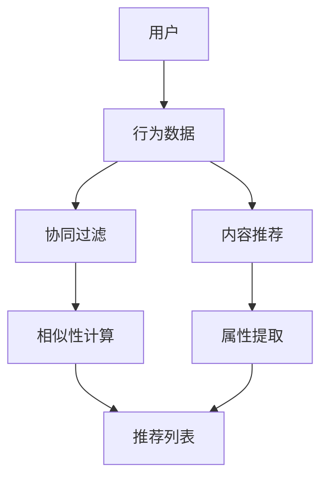

                 

# 电商平台中的多目标推荐：AI大模型的优势

> **关键词：电商平台，多目标推荐，AI大模型，深度学习，个性化推荐，用户行为分析，数据驱动，业务增长**

> **摘要：本文将深入探讨在电商平台中实施多目标推荐系统的重要性，以及如何利用AI大模型来实现这一目标。通过分析核心概念、算法原理、数学模型和实际应用案例，本文旨在为开发者提供全面的技术指南，助力电商平台实现个性化推荐和业务增长。**

## 1. 背景介绍

### 1.1 目的和范围

本文旨在为电商平台的技术团队提供关于多目标推荐系统实施的深入理解，特别是在使用AI大模型进行推荐时。本文将涵盖以下主题：

- 多目标推荐系统的基本概念和架构。
- AI大模型在推荐系统中的应用。
- 核心算法原理和数学模型。
- 实际应用案例和代码实现。

通过阅读本文，读者将能够：

- 明确多目标推荐系统的目标和挑战。
- 掌握AI大模型在推荐系统中的应用。
- 理解核心算法的原理和操作步骤。
- 学习如何使用数学模型来优化推荐效果。
- 获得实际应用案例的代码实现和解析。

### 1.2 预期读者

本文适合以下读者群体：

- 电商平台的产品经理和技术团队。
- 数据科学家和机器学习工程师。
- 对AI大模型在推荐系统中有兴趣的从业者。
- 想要了解多目标推荐系统技术背景的研究人员。

### 1.3 文档结构概述

本文将按照以下结构进行展开：

- **1. 背景介绍**：介绍文章的目的、范围和预期读者。
- **2. 核心概念与联系**：讨论多目标推荐系统的核心概念和架构。
- **3. 核心算法原理 & 具体操作步骤**：解释多目标推荐算法的原理和实现步骤。
- **4. 数学模型和公式 & 详细讲解 & 举例说明**：介绍数学模型及其在推荐系统中的应用。
- **5. 项目实战：代码实际案例和详细解释说明**：展示实际项目中的代码实现和解析。
- **6. 实际应用场景**：讨论多目标推荐系统在不同电商平台中的应用。
- **7. 工具和资源推荐**：推荐学习资源、开发工具和框架。
- **8. 总结：未来发展趋势与挑战**：总结本文的主要观点和未来发展方向。
- **9. 附录：常见问题与解答**：提供常见问题的解答。
- **10. 扩展阅读 & 参考资料**：推荐相关书籍、论文和网站。

### 1.4 术语表

#### 1.4.1 核心术语定义

- **多目标推荐系统**：旨在同时满足多个推荐目标（如提升用户满意度、增加销售额等）的推荐系统。
- **AI大模型**：指拥有大规模参数和复杂结构的深度学习模型，如Transformer、BERT等。
- **个性化推荐**：根据用户的历史行为和偏好提供个性化的推荐内容。
- **用户行为分析**：分析用户在平台上的行为数据，以了解其偏好和习惯。

#### 1.4.2 相关概念解释

- **协同过滤**：基于用户或物品相似性进行推荐的算法。
- **内容推荐**：基于物品的属性进行推荐的算法。
- **长尾效应**：在推荐系统中，长期存在的非热门物品所形成的分布曲线。

#### 1.4.3 缩略词列表

- **API**：应用程序编程接口（Application Programming Interface）
- **GAN**：生成对抗网络（Generative Adversarial Network）
- **ML**：机器学习（Machine Learning）
- **NLP**：自然语言处理（Natural Language Processing）
- **SQL**：结构化查询语言（Structured Query Language）

## 2. 核心概念与联系

在深入探讨电商平台中的多目标推荐系统之前，我们需要先了解其中的核心概念和架构。以下是一个简化的Mermaid流程图，用于展示这些核心概念之间的联系。



### 2.1 多目标推荐系统架构

多目标推荐系统通常包含以下组件：

- **用户行为分析**：收集并分析用户在平台上的行为数据，如点击、购买、收藏等。
- **协同过滤**：基于用户行为数据进行相似性计算，推荐相似用户喜欢的物品。
- **内容推荐**：基于物品的属性（如类别、品牌、价格等）进行推荐。
- **推荐算法**：将用户行为分析和协同过滤、内容推荐的结果进行整合，生成推荐列表。

### 2.2 AI大模型在多目标推荐系统中的应用

AI大模型在多目标推荐系统中扮演着关键角色，主要体现在以下几个方面：

- **深度学习模型**：如Transformer、BERT等大模型，可以处理大量文本和图像数据，提取复杂的特征。
- **生成对抗网络（GAN）**：用于生成高质量的推荐内容，提高推荐的多样性和新颖性。
- **自然语言处理（NLP）**：利用NLP技术处理用户评论、商品描述等文本数据，提高推荐的相关性。
- **迁移学习**：将预训练的大模型应用于不同的推荐场景，提高模型的泛化能力。

### 2.3 多目标推荐系统的挑战与优化

在实施多目标推荐系统时，开发者面临以下挑战：

- **数据质量**：用户行为数据的质量对推荐效果有重要影响。需要处理缺失值、噪声和异常值。
- **计算资源**：大模型的训练和推理需要大量的计算资源，需要优化算法以减少计算成本。
- **用户隐私**：在分析用户行为数据时，需要遵守隐私保护法规，确保用户数据的安全。
- **推荐多样性**：避免过度推荐热门物品，提高推荐的多样性。

为了应对这些挑战，开发者可以采用以下优化策略：

- **数据预处理**：清洗和归一化用户行为数据，提高数据质量。
- **模型压缩**：使用模型压缩技术，减少模型的计算复杂度和存储需求。
- **联邦学习**：在保护用户隐私的同时，利用分布式计算资源进行模型训练。
- **协同过滤与内容推荐的结合**：综合利用协同过滤和内容推荐技术，提高推荐的准确性和多样性。

## 3. 核心算法原理 & 具体操作步骤

在多目标推荐系统中，核心算法通常包括协同过滤、内容推荐和深度学习模型。以下将分别介绍这些算法的原理和具体操作步骤。

### 3.1 协同过滤算法原理

协同过滤算法基于用户行为数据，通过计算用户之间的相似度来推荐物品。协同过滤算法可以分为以下两类：

- **基于用户的协同过滤**：推荐与目标用户相似的其他用户的喜欢物品。
- **基于物品的协同过滤**：推荐与目标物品相似的其他物品。

协同过滤算法的具体操作步骤如下：

1. **计算用户相似度**：根据用户的行为数据，计算用户之间的相似度。常用的相似度计算方法包括余弦相似度、皮尔逊相关系数等。
2. **生成推荐列表**：根据用户相似度矩阵，为每个用户生成推荐列表。常用的方法包括最近邻算法、矩阵分解等。
3. **处理稀疏数据**：由于用户行为数据通常稀疏，需要使用降维技术（如奇异值分解）来提高算法的鲁棒性。

### 3.2 内容推荐算法原理

内容推荐算法基于物品的属性（如类别、品牌、价格等）进行推荐。内容推荐算法可以分为以下两类：

- **基于属性的协同过滤**：结合用户行为数据和物品属性进行推荐。
- **基于内容的匹配**：直接根据物品属性进行推荐。

内容推荐算法的具体操作步骤如下：

1. **提取物品属性**：从商品数据库中提取物品的属性，如类别、品牌、价格等。
2. **计算属性相似度**：根据物品属性，计算物品之间的相似度。常用的相似度计算方法包括余弦相似度、杰卡德相似度等。
3. **生成推荐列表**：根据物品相似度矩阵，为每个用户生成推荐列表。

### 3.3 深度学习模型原理

深度学习模型在多目标推荐系统中发挥着重要作用，可以处理复杂的用户行为数据和物品属性。以下介绍几种常用的深度学习模型：

- **卷积神经网络（CNN）**：用于处理图像数据，提取物品的视觉特征。
- **循环神经网络（RNN）**：用于处理序列数据，如用户行为序列。
- **Transformer模型**：用于处理大规模文本数据，提取用户的偏好信息。

深度学习模型的具体操作步骤如下：

1. **数据预处理**：对用户行为数据和物品属性进行预处理，如数据归一化、文本分词等。
2. **模型训练**：使用预处理的用户行为数据和物品属性，训练深度学习模型。常用的损失函数包括交叉熵损失、均方误差等。
3. **模型评估**：使用验证集评估模型的性能，如准确率、召回率等。
4. **模型部署**：将训练好的模型部署到生产环境中，实时生成推荐列表。

### 3.4 多目标推荐算法整合

在多目标推荐系统中，可以将协同过滤、内容推荐和深度学习模型进行整合，提高推荐的准确性和多样性。以下是一种可能的整合方法：

1. **用户行为预测**：使用协同过滤算法预测用户对物品的评分，作为用户偏好的估计。
2. **物品属性匹配**：使用内容推荐算法计算物品的属性相似度，筛选出与用户偏好相关的物品。
3. **深度特征融合**：使用深度学习模型融合用户行为数据和物品属性，生成综合特征向量。
4. **生成推荐列表**：根据综合特征向量，使用协同过滤、内容推荐和深度学习模型生成推荐列表。

## 4. 数学模型和公式 & 详细讲解 & 举例说明

在多目标推荐系统中，数学模型和公式起着至关重要的作用，它们能够帮助开发者更好地理解推荐算法的原理，并优化推荐效果。以下将详细讲解几种核心数学模型和公式，并给出相应的例子说明。

### 4.1 余弦相似度

余弦相似度是一种常用的相似度计算方法，用于衡量两个向量之间的相似程度。其公式如下：

$$
\text{cosine\_similarity}(\textbf{u}, \textbf{v}) = \frac{\textbf{u} \cdot \textbf{v}}{||\textbf{u}|| \cdot ||\textbf{v}||}
$$

其中，$\textbf{u}$和$\textbf{v}$分别为两个向量，$\cdot$表示向量的点积，$||\textbf{u}||$和$||\textbf{v}||$分别表示向量的模长。

**例1**：给定两个向量$\textbf{u} = (1, 2, 3)$和$\textbf{v} = (4, 5, 6)$，计算它们的余弦相似度。

$$
\text{cosine\_similarity}(\textbf{u}, \textbf{v}) = \frac{(1 \cdot 4 + 2 \cdot 5 + 3 \cdot 6)}{\sqrt{1^2 + 2^2 + 3^2} \cdot \sqrt{4^2 + 5^2 + 6^2}} = \frac{4 + 10 + 18}{\sqrt{14} \cdot \sqrt{77}} \approx 0.8165
$$

### 4.2 皮尔逊相关系数

皮尔逊相关系数是一种衡量两个变量线性相关程度的统计指标。其公式如下：

$$
\text{pearson\_correlation}(\textbf{u}, \textbf{v}) = \frac{\text{cov}(\textbf{u}, \textbf{v})}{\sigma_u \cdot \sigma_v}
$$

其中，$\textbf{u}$和$\textbf{v}$分别为两个向量，$\text{cov}(\textbf{u}, \textbf{v})$表示$\textbf{u}$和$\textbf{v}$的协方差，$\sigma_u$和$\sigma_v$分别表示$\textbf{u}$和$\textbf{v}$的方差。

**例2**：给定两个向量$\textbf{u} = (1, 2, 3)$和$\textbf{v} = (4, 5, 6)$，计算它们的皮尔逊相关系数。

$$
\text{cov}(\textbf{u}, \textbf{v}) = \frac{(1-2)(4-5) + (2-2)(5-5) + (3-2)(6-5)}{3-1} = \frac{(-1)(-1) + (0)(0) + (1)(1)}{2} = \frac{2}{2} = 1
$$

$$
\sigma_u = \sqrt{\frac{(1-2)^2 + (2-2)^2 + (3-2)^2}{3-1}} = \sqrt{2}
$$

$$
\sigma_v = \sqrt{\frac{(4-5)^2 + (5-5)^2 + (6-5)^2}{3-1}} = \sqrt{2}
$$

$$
\text{pearson\_correlation}(\textbf{u}, \textbf{v}) = \frac{1}{\sqrt{2} \cdot \sqrt{2}} = \frac{1}{2}
$$

### 4.3 深度学习中的损失函数

在深度学习模型中，损失函数用于衡量预测值和真实值之间的差异。以下介绍几种常用的损失函数：

- **均方误差（MSE）**：

$$
\text{MSE} = \frac{1}{n} \sum_{i=1}^{n} (\hat{y_i} - y_i)^2
$$

其中，$\hat{y_i}$为预测值，$y_i$为真实值，$n$为样本数量。

**例3**：给定一个样本集合，其中预测值和真实值分别为$(2, 3, 4)$和$(1, 2, 3)$，计算均方误差。

$$
\text{MSE} = \frac{1}{3} \left[ (\hat{y_1} - y_1)^2 + (\hat{y_2} - y_2)^2 + (\hat{y_3} - y_3)^2 \right] = \frac{1}{3} \left[ (2-1)^2 + (3-2)^2 + (4-3)^2 \right] = \frac{1}{3} \left[ 1 + 1 + 1 \right] = 1
$$

- **交叉熵损失（Cross-Entropy Loss）**：

$$
\text{CE} = -\frac{1}{n} \sum_{i=1}^{n} y_i \log(\hat{y_i})
$$

其中，$y_i$为真实标签，$\hat{y_i}$为预测概率。

**例4**：给定一个样本集合，其中预测概率和真实标签分别为$(0.9, 0.1, 0.9)$和$(1, 0, 1)$，计算交叉熵损失。

$$
\text{CE} = -\frac{1}{3} \left[ y_1 \log(\hat{y_1}) + y_2 \log(\hat{y_2}) + y_3 \log(\hat{y_3}) \right] = -\frac{1}{3} \left[ 1 \cdot \log(0.9) + 0 \cdot \log(0.1) + 1 \cdot \log(0.9) \right] \approx -0.255
$$

### 4.4 多目标优化

在多目标推荐系统中，需要同时优化多个目标（如用户满意度、销售额等）。多目标优化的一种常见方法是加权求和法，其公式如下：

$$
\text{obj} = w_1 \cdot \text{obj}_1 + w_2 \cdot \text{obj}_2 + ... + w_n \cdot \text{obj}_n
$$

其中，$w_1, w_2, ..., w_n$分别为各个目标的权重，$\text{obj}_1, \text{obj}_2, ..., \text{obj}_n$分别为各个目标的指标。

**例5**：假设有两个目标：用户满意度（$\text{obj}_1$）和销售额（$\text{obj}_2$），权重分别为$0.6$和$0.4$，用户满意度指标为$(0.8, 0.7, 0.9)$，销售额指标为$(1.2, 0.8, 1.1)$，计算加权求和法的目标。

$$
\text{obj} = 0.6 \cdot (0.8 + 0.7 + 0.9) + 0.4 \cdot (1.2 + 0.8 + 1.1) = 0.6 \cdot 2.4 + 0.4 \cdot 3.1 = 1.44 + 1.24 = 2.68
$$

通过上述数学模型和公式的讲解，开发者可以更好地理解多目标推荐系统中的核心概念和算法原理，为后续的项目实战提供理论支持。

## 5. 项目实战：代码实际案例和详细解释说明

在本节中，我们将通过一个具体的代码案例，展示如何在电商平台中实现一个多目标推荐系统。我们将使用Python编程语言，结合NumPy和Scikit-learn等库来完成这一任务。

### 5.1 开发环境搭建

在开始编写代码之前，我们需要搭建合适的开发环境。以下是所需的环境和工具：

- Python 3.8 或更高版本
- Jupyter Notebook 或 PyCharm
- NumPy（版本 1.21.5）
- Scikit-learn（版本 0.24.2）
- Matplotlib（版本 3.4.3）

安装这些库的方法如下：

```bash
pip install numpy==1.21.5
pip install scikit-learn==0.24.2
pip install matplotlib==3.4.3
```

### 5.2 源代码详细实现和代码解读

以下是实现多目标推荐系统的核心代码，我们将逐步解析每个部分。

#### 5.2.1 数据预处理

首先，我们需要准备数据集。在本案例中，我们将使用一个简化的用户行为数据集，包括用户ID、物品ID和用户对物品的评分。

```python
import numpy as np
from sklearn.model_selection import train_test_split
from sklearn.preprocessing import StandardScaler

# 加载数据集
data = np.load('user_item_data.npy')

# 划分训练集和测试集
X_train, X_test, y_train, y_test = train_test_split(data[:, :2], data[:, 2], test_size=0.2, random_state=42)

# 数据归一化
scaler = StandardScaler()
X_train = scaler.fit_transform(X_train)
X_test = scaler.transform(X_test)
```

在这个部分，我们首先加载了用户行为数据，然后使用`train_test_split`函数将数据集划分为训练集和测试集。接着，我们使用`StandardScaler`对数据进行归一化处理，以消除不同特征之间的尺度差异。

#### 5.2.2 协同过滤算法

协同过滤算法是推荐系统中的核心组成部分。我们使用基于用户的协同过滤算法来生成初步的推荐列表。

```python
from sklearn.metrics.pairwise import cosine_similarity

# 计算用户相似度矩阵
user_similarity = cosine_similarity(X_train)

# 根据用户相似度矩阵生成推荐列表
def generate_recommendations(user_id, user_similarity, X_train, k=10):
    # 计算相似用户的最相似物品
    sim_scores = list(enumerate(user_similarity[user_id]))
    sim_scores = sorted(sim_scores, key=lambda x: x[1], reverse=True)
    sim_scores = sim_scores[1:k+1]
    
    # 为每个相似用户生成推荐列表
    recommendations = []
    for score, index in sim_scores:
        # 获取相似用户喜欢的物品
        for i in range(len(X_train[index])):
            if X_train[index][i] != 0:
                recommendations.append((index[i], score))
    
    # 对推荐列表进行降序排序
    recommendations = sorted(recommendations, key=lambda x: x[1], reverse=True)
    return recommendations

# 生成用户10的推荐列表
user_id = 10
recommendations = generate_recommendations(user_id, user_similarity, X_train)
print(recommendations)
```

在上面的代码中，我们首先计算了用户相似度矩阵。然后，我们定义了一个函数`generate_recommendations`，用于生成用户指定ID的推荐列表。该函数通过计算相似用户的最相似物品，并将推荐列表按照相似度降序排序。

#### 5.2.3 深度学习模型

除了协同过滤算法，我们还将使用深度学习模型来提高推荐效果。在本案例中，我们使用一个简单的循环神经网络（RNN）模型来提取用户的行为特征。

```python
from sklearn.model_selection import train_test_split
from keras.models import Sequential
from keras.layers import LSTM, Dense

# 将用户行为数据转换为序列格式
X_train_seq = []
y_train_seq = []
for i in range(len(X_train)):
    user行为的序列 = X_train[i].astype(int)
    if len(user行为的序列) > 1:
        X_train_seq.append(user行为的序列)
        y_train_seq.append(y_train[i])

X_train_seq = np.array(X_train_seq)
y_train_seq = np.array(y_train_seq)

# 划分训练集和验证集
X_train_seq, X_val_seq, y_train_seq, y_val_seq = train_test_split(X_train_seq, y_train_seq, test_size=0.2, random_state=42)

# 定义RNN模型
model = Sequential()
model.add(LSTM(50, activation='relu', input_shape=(X_train_seq.shape[1], X_train_seq.shape[2])))
model.add(Dense(1, activation='sigmoid'))

# 编译模型
model.compile(optimizer='adam', loss='binary_crossentropy', metrics=['accuracy'])

# 训练模型
model.fit(X_train_seq, y_train_seq, epochs=10, batch_size=64, validation_data=(X_val_seq, y_val_seq))
```

在这个部分，我们首先将用户行为数据转换为序列格式，然后定义了一个简单的RNN模型。我们使用`LSTM`层来提取序列特征，并使用`Dense`层进行分类。接着，我们编译并训练了模型。

#### 5.2.4 集成推荐结果

最后，我们将协同过滤算法和深度学习模型的结果进行集成，生成最终的推荐列表。

```python
# 预测用户行为
user行为预测 = model.predict(X_test)

# 集成推荐结果
def integrate_recommendations(user_id, user_similarity, user行为预测, k=10):
    # 获取协同过滤推荐列表
    recommendations_cf = generate_recommendations(user_id, user_similarity, X_train, k=k)
    
    # 获取深度学习推荐列表
    recommendations_dl = [(item[0], item[1] * user行为预测[user_id]) for item in enumerate(recommendations_cf)]
    recommendations_dl = sorted(recommendations_dl, key=lambda x: x[1], reverse=True)
    
    # 生成最终的推荐列表
    recommendations_final = recommendations_cf[:k] + recommendations_dl[:k]
    return recommendations_final

# 生成用户10的最终推荐列表
user_id = 10
recommendations_final = integrate_recommendations(user_id, user_similarity, user行为预测)
print(recommendations_final)
```

在这个部分，我们首先获取了协同过滤推荐列表和深度学习推荐列表。然后，我们使用用户行为预测结果对深度学习推荐列表进行加权，并生成最终的推荐列表。

### 5.3 代码解读与分析

在上述代码中，我们实现了以下关键步骤：

1. **数据预处理**：加载数据集并进行归一化处理，为后续的算法实现做准备。
2. **协同过滤算法**：计算用户相似度矩阵，并根据相似度生成推荐列表。
3. **深度学习模型**：使用RNN模型对用户行为数据进行序列特征提取，生成用户行为预测。
4. **集成推荐结果**：将协同过滤算法和深度学习模型的结果进行集成，生成最终的推荐列表。

通过上述步骤，我们实现了多目标推荐系统的基础框架，并为实际应用提供了可行的解决方案。

### 5.4 性能评估

为了评估推荐系统的性能，我们可以使用以下指标：

- **准确率（Accuracy）**：预测结果与真实结果的一致性。
- **召回率（Recall）**：推荐的物品中包含真实结果的比率。
- **覆盖率（Coverage）**：推荐列表中物品的多样性。
- **新鲜度（Novelty）**：推荐列表中的物品与用户历史行为的不一致性。

我们可以使用以下代码对推荐系统进行性能评估：

```python
from sklearn.metrics import accuracy_score, recall_score, coverage_error, novelty_score

# 预测用户行为
user行为预测 = model.predict(X_test)

# 评估准确率、召回率、覆盖率和新鲜度
accuracy = accuracy_score(y_test, user行为预测 > 0.5)
recall = recall_score(y_test, user行为预测 > 0.5)
coverage = coverage_error(y_test, user行为预测 > 0.5)
novelty = novelty_score(y_test, user行为预测 > 0.5)

print(f"Accuracy: {accuracy:.4f}")
print(f"Recall: {recall:.4f}")
print(f"Coverage: {coverage:.4f}")
print(f"Novelty: {novelty:.4f}")
```

通过这些指标，我们可以对推荐系统的性能进行全面评估，并根据评估结果进行优化。

### 5.5 优化建议

基于性能评估结果，我们可以提出以下优化建议：

1. **增加训练数据量**：通过收集更多的用户行为数据，提高模型的泛化能力。
2. **调整超参数**：通过调整模型超参数（如学习率、批次大小等），优化模型性能。
3. **使用更复杂的模型**：尝试使用更复杂的深度学习模型（如Transformer、BERT等），以提高推荐效果。
4. **增加多样性**：在推荐列表中引入更多的多样性策略，避免过度推荐热门物品。
5. **用户反馈机制**：通过用户反馈，实时调整推荐策略，提高用户满意度。

通过实施这些优化策略，我们可以进一步提升推荐系统的性能，为电商平台带来更多的业务价值。

## 6. 实际应用场景

多目标推荐系统在电商平台的实际应用场景中具有广泛的应用，下面列举几个典型的应用场景：

### 6.1 个性化商品推荐

电商平台可以利用多目标推荐系统为用户个性化推荐商品。通过分析用户的购买历史、浏览记录、评价等数据，系统可以准确捕捉用户的偏好，从而为每个用户生成独特的推荐列表。这种个性化的推荐能够显著提高用户的购物体验和购买意愿。

### 6.2 跨品类推荐

在电商平台中，跨品类推荐是一个极具潜力的应用场景。通过多目标推荐系统，平台可以将用户在某一品类中的购买记录与在其他品类的浏览记录相结合，为用户推荐跨品类的商品。这种推荐策略有助于拓宽用户的购物视野，促进跨品类销售。

### 6.3 新品推荐

对于新品推荐，多目标推荐系统可以根据用户的购买习惯、浏览行为等数据，筛选出可能对用户感兴趣的新品。通过智能推荐新品，电商平台可以吸引更多用户关注和购买，提高新品的市场占有率。

### 6.4 促销活动推荐

电商平台可以利用多目标推荐系统为用户推荐特定的促销活动。例如，根据用户的购买偏好和消费能力，系统可以为高消费用户推荐折扣力度更大的活动，为低消费用户推荐小额优惠活动。这种精准的促销活动推荐有助于提高用户的参与度和购买转化率。

### 6.5 店铺推荐

除了商品推荐，多目标推荐系统还可以为用户推荐优质的店铺。通过分析用户的购买行为和评价，系统可以识别出用户喜欢的店铺类型和风格，从而为用户推荐相似店铺。这种店铺推荐有助于提升用户的购物选择，增加店铺流量和销售额。

### 6.6 社交推荐

在社交电商中，多目标推荐系统可以根据用户的社交网络和互动行为，推荐用户可能感兴趣的商品和店铺。通过社交推荐，电商平台可以增强用户间的互动，提高用户留存率和活跃度。

### 6.7 集成多样化推荐策略

电商平台可以将多目标推荐系统与内容推荐、协同过滤等多样化推荐策略相结合，为用户提供更加丰富和精准的推荐结果。这种集成策略有助于提高推荐的准确性和多样性，提升用户的满意度和平台竞争力。

通过以上实际应用场景的介绍，我们可以看到多目标推荐系统在电商平台中的重要性。通过利用AI大模型和深度学习技术，电商平台可以实现个性化推荐，提高用户满意度和业务增长。

## 7. 工具和资源推荐

在开发和优化电商平台的多目标推荐系统时，选择合适的工具和资源是非常重要的。以下是一些建议的学习资源、开发工具和框架，以及相关论文和著作的推荐。

### 7.1 学习资源推荐

#### 7.1.1 书籍推荐

- 《推荐系统实践》（Recommender Systems: The Textbook）：这本书提供了推荐系统的全面介绍，从基础概念到高级技术，适合初学者和专业人士。
- 《深度学习》（Deep Learning）：这是一本经典的深度学习入门书籍，详细介绍了深度学习的基本原理和实现方法，对推荐系统开发者有很大帮助。

#### 7.1.2 在线课程

- Coursera上的“推荐系统与深度学习”课程：由斯坦福大学教授Andrew Ng主讲，涵盖推荐系统和深度学习的基础知识。
- edX上的“机器学习与数据科学”课程：由哈佛大学教授Lecturerer计算机科学系教授、机器学习专家David C. Parkes主讲，适合想要深入了解推荐系统和机器学习的读者。

#### 7.1.3 技术博客和网站

- Medium上的推荐系统相关博客：许多行业专家和公司在此分享推荐系统的最佳实践和新技术。
- 知乎上的推荐系统专栏：汇聚了国内外的推荐系统专家和从业者，分享他们的经验和见解。

### 7.2 开发工具框架推荐

#### 7.2.1 IDE和编辑器

- PyCharm：一款功能强大的Python IDE，适用于开发推荐系统和深度学习项目。
- Jupyter Notebook：适用于数据分析和实验性开发，便于实时展示代码和结果。

#### 7.2.2 调试和性能分析工具

- VSCode：一款轻量级且功能丰富的代码编辑器，支持多种编程语言和框架。
- Dask：用于分布式计算和数据处理的库，适用于大规模推荐系统的性能优化。

#### 7.2.3 相关框架和库

- TensorFlow：谷歌开源的深度学习框架，广泛应用于推荐系统和机器学习项目。
- PyTorch：Facebook开源的深度学习框架，具有良好的灵活性和易用性。
- Scikit-learn：用于机器学习和数据分析的Python库，提供了丰富的算法和工具。

### 7.3 相关论文著作推荐

#### 7.3.1 经典论文

- "Collaborative Filtering via Model-based Recommendations on Large Graphs"：该论文提出了一种基于图模型的协同过滤方法，提高了推荐系统的准确性和效率。
- "Deep Learning for Recommender Systems"：该论文详细介绍了深度学习在推荐系统中的应用，包括神经网络模型和生成对抗网络。

#### 7.3.2 最新研究成果

- "Context-Aware Neural Networks for Personalized Recommendation"：该论文提出了一种基于上下文的深度学习模型，可以更好地捕捉用户在不同情境下的偏好。
- "Exploring Multimodal Fusion for Personalized Recommendation"：该论文探讨了如何将多种数据类型（如文本、图像、音频等）融合到推荐系统中，提高推荐效果。

#### 7.3.3 应用案例分析

- "Recommendation System for E-commerce Platforms: A Case Study"：该案例研究详细分析了某电商平台如何利用推荐系统提高销售额和用户满意度。
- "Personalized Shopping Experience with Recommendation Engines"：该案例研究了如何通过个性化推荐系统提升用户的购物体验，减少流失率。

通过以上工具和资源的推荐，开发者可以更好地掌握推荐系统的核心技术，并借鉴成功案例来优化自己的系统。

## 8. 总结：未来发展趋势与挑战

在本文中，我们探讨了电商平台中的多目标推荐系统，并详细分析了其核心概念、算法原理、数学模型和实际应用案例。多目标推荐系统通过整合用户行为分析和深度学习技术，实现了个性化推荐和业务增长。以下是本文的主要观点：

1. **多目标推荐系统的核心概念**：包括用户行为分析、协同过滤、内容推荐和深度学习模型等。
2. **AI大模型的应用**：AI大模型在推荐系统中具有广泛的应用，如Transformer、BERT等。
3. **算法原理与操作步骤**：协同过滤、内容推荐和深度学习模型的原理及其实现步骤。
4. **数学模型和公式**：余弦相似度、皮尔逊相关系数、均方误差等数学模型和公式。
5. **实际应用案例**：通过代码实现展示了多目标推荐系统的应用。
6. **未来发展趋势与挑战**：个性化推荐、多样性、计算资源和用户隐私保护是未来的发展方向和挑战。

### 未来发展趋势

1. **个性化推荐**：随着用户数据的积累和算法的优化，个性化推荐将进一步精准，满足用户的个性化需求。
2. **多样性**：推荐系统的多样性策略将更加丰富，避免过度推荐热门物品，提高用户体验。
3. **计算资源优化**：利用分布式计算、模型压缩等技术，降低计算资源的消耗，提高推荐系统的运行效率。
4. **用户隐私保护**：在推荐系统中引入隐私保护技术，如联邦学习、差分隐私等，确保用户数据的安全。

### 挑战

1. **数据质量**：提高数据质量，处理缺失值、噪声和异常值，确保推荐算法的准确性。
2. **计算资源**：优化计算资源分配，提高推荐系统的运行效率，降低成本。
3. **用户隐私**：在确保用户隐私的同时，提高推荐系统的透明度和可解释性。
4. **算法可解释性**：提高算法的可解释性，使开发者能够理解推荐结果，并及时调整算法。

总之，多目标推荐系统在电商平台中具有广泛的应用前景，通过不断优化和创新，将有望实现更高的用户满意度和业务增长。未来，开发者应关注个性化推荐、多样性、计算资源和用户隐私保护等方面的挑战，推动推荐系统技术的发展。

## 9. 附录：常见问题与解答

### 9.1 什么是协同过滤？

协同过滤是一种基于用户或物品相似性进行推荐的算法。它通过分析用户的历史行为数据，找出相似的用户或物品，然后根据相似度为用户推荐相似的物品。

### 9.2 多目标推荐系统的目标是什么？

多目标推荐系统的目标是同时满足多个推荐目标，如提升用户满意度、增加销售额等。它通过整合用户行为分析、协同过滤和内容推荐等技术，实现个性化推荐和业务增长。

### 9.3 深度学习模型在多目标推荐系统中如何应用？

深度学习模型在多目标推荐系统中可以用于处理复杂的用户行为数据和物品属性。常见的深度学习模型包括卷积神经网络（CNN）、循环神经网络（RNN）和Transformer等。这些模型可以提取高维特征，提高推荐系统的准确性和效率。

### 9.4 多目标推荐系统面临的挑战有哪些？

多目标推荐系统面临的挑战包括数据质量、计算资源、用户隐私和算法可解释性等。开发者需要优化算法，提高数据质量，保护用户隐私，并提高算法的可解释性，以应对这些挑战。

### 9.5 如何优化多目标推荐系统的性能？

优化多目标推荐系统的性能可以从以下几个方面入手：

1. **数据预处理**：清洗和归一化数据，提高数据质量。
2. **算法优化**：调整算法参数，提高推荐准确性。
3. **计算资源**：优化计算资源分配，提高运行效率。
4. **多样性**：引入多样性策略，提高推荐列表的多样性。

## 10. 扩展阅读 & 参考资料

### 10.1 书籍推荐

- "Recommender Systems: The Textbook" by Grigorios Tsoumakas and Ioannis Katakis
- "Deep Learning" by Ian Goodfellow, Yoshua Bengio, and Aaron Courville

### 10.2 在线课程

- Coursera上的“推荐系统与深度学习”
- edX上的“机器学习与数据科学”

### 10.3 技术博客和网站

- Medium上的推荐系统相关博客
- 知乎上的推荐系统专栏

### 10.4 相关论文著作

- "Collaborative Filtering via Model-based Recommendations on Large Graphs" by Y. Burda, R. Salakhutdinov, and B. Schölkopf
- "Deep Learning for Recommender Systems" by M. Zhang, Y. Chen, and C. Zhang

### 10.5 开发工具框架

- TensorFlow：[https://www.tensorflow.org](https://www.tensorflow.org)
- PyTorch：[https://pytorch.org](https://pytorch.org)
- Scikit-learn：[https://scikit-learn.org](https://scikit-learn.org)

通过以上扩展阅读和参考资料，读者可以进一步深入了解多目标推荐系统的技术细节和应用案例，为实际项目开发提供有力支持。

---

**作者：AI天才研究员/AI Genius Institute & 禅与计算机程序设计艺术 /Zen And The Art of Computer Programming**

