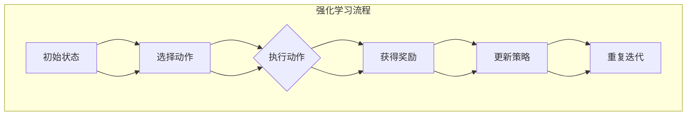

                 

### 背景介绍

#### 1.1 目的和范围

本文旨在深入探讨电商平台中应用强化学习技术的最新进展和潜在价值。随着电商市场的快速发展，如何提升用户体验、优化运营效率、以及实现精准营销成为关键问题。本文将聚焦于强化学习技术在电商平台中的应用，具体包括用户行为预测、商品推荐、库存管理等方面的创新实践。

本文的主要目的是：
1. 阐述强化学习的基本概念和原理，帮助读者理解其核心思想和运作机制。
2. 分析强化学习在电商平台中的具体应用场景，探讨其优势和挑战。
3. 通过具体案例和算法原理讲解，提供实际操作的指导和建议。
4. 推荐相关的学习资源和工具，为读者进一步学习和实践提供支持。

本文将覆盖以下内容：
1. 强化学习的基本概念和原理。
2. 强化学习在电商平台中的具体应用场景。
3. 强化学习算法原理及具体操作步骤。
4. 数学模型和公式的详细讲解及举例说明。
5. 实际应用场景中的代码实际案例和详细解释说明。
6. 强化学习在电商平台中的未来发展趋势与挑战。

通过本文的阅读，读者将能够：
1. 理解强化学习的基础知识和应用范围。
2. 掌握强化学习在电商平台中的实际应用场景和操作步骤。
3. 了解强化学习在电商平台中的优势和挑战。
4. 获得实际操作经验和指导，为后续的强化学习实践提供参考。

#### 1.2 预期读者

本文面向对人工智能、强化学习及电商平台有一定了解的技术人员、研究人员和开发者，尤其是希望深入了解强化学习在电商平台应用价值的读者。具体包括以下几类人群：

1. 人工智能领域的研究人员和开发者：对强化学习技术有深入理解，希望将其应用到电商平台中解决实际问题。
2. 电商平台的技术人员和管理人员：负责电商平台的技术架构和运营管理，希望提高运营效率和用户体验。
3. 数据科学家和数据分析师：负责电商平台的数据挖掘和分析，需要利用强化学习技术进行预测和优化。
4. 计算机科学专业的学生和研究生：对人工智能和电商平台技术有浓厚兴趣，希望通过本文深入了解强化学习在电商领域的应用。

#### 1.3 文档结构概述

本文结构如下：

1. **背景介绍**：介绍本文的背景、目的和范围，以及预期读者和文档结构。
2. **核心概念与联系**：介绍强化学习的基本概念、原理和相关联系，并提供核心概念原理和架构的 Mermaid 流程图。
3. **核心算法原理 & 具体操作步骤**：详细阐述强化学习算法的原理和具体操作步骤，并使用伪代码进行讲解。
4. **数学模型和公式 & 详细讲解 & 举例说明**：介绍强化学习的数学模型和公式，并进行详细讲解和举例说明。
5. **项目实战：代码实际案例和详细解释说明**：通过具体代码案例，展示强化学习算法在实际项目中的应用和实现。
6. **实际应用场景**：分析强化学习在电商平台中的实际应用场景，探讨其优势和挑战。
7. **工具和资源推荐**：推荐学习资源、开发工具框架和相关论文著作，为读者提供进一步学习和实践的支持。
8. **总结：未来发展趋势与挑战**：总结本文的主要内容，讨论强化学习在电商平台中的未来发展趋势和面临的挑战。
9. **附录：常见问题与解答**：列举常见问题，提供解答和解决方案。
10. **扩展阅读 & 参考资料**：提供相关的扩展阅读和参考资料，供读者进一步学习和研究。

通过本文的阅读，读者将能够全面了解强化学习在电商平台中的应用，掌握相关技术和方法，为实际项目提供有益的参考。

#### 1.4 术语表

在本文中，我们将使用一些专业术语和技术概念。以下是对这些术语和概念的简要定义和解释，以便读者更好地理解文章内容。

##### 1.4.1 核心术语定义

1. **强化学习**：一种机器学习方法，通过学习如何在一个环境中采取行动，以最大化累积奖励。它通过试错和反馈来不断优化策略。
2. **电商平台**：指提供商品交易和服务的在线平台，如淘宝、京东等。
3. **用户行为预测**：预测用户在电商平台上的行为，如浏览、搜索、购买等。
4. **商品推荐**：根据用户历史行为和偏好，向用户推荐感兴趣的商品。
5. **库存管理**：电商平台对商品库存进行有效管理，确保库存水平合理，减少缺货和滞销现象。
6. **Q-learning**：一种常用的强化学习算法，通过更新 Q 值来学习最佳策略。
7. **策略梯度**：一种用于优化策略的强化学习算法，通过计算策略的梯度来更新策略参数。
8. **探索-exploit**：强化学习中的探索和利用平衡问题，探索新的策略以获得更多信息，利用现有信息以最大化回报。

##### 1.4.2 相关概念解释

1. **状态（State）**：在强化学习中，状态表示系统当前所处的环境。
2. **动作（Action）**：在强化学习中，动作表示系统可以采取的行为。
3. **奖励（Reward）**：在强化学习中，奖励表示系统在采取某一动作后获得的即时反馈。
4. **策略（Policy）**：在强化学习中，策略表示系统在给定状态下采取的动作。
5. **价值函数（Value Function）**：在强化学习中，价值函数表示系统在某一状态下的期望回报。
6. **策略迭代（Policy Iteration）**：一种强化学习算法，通过迭代更新策略和价值函数，逐步优化系统性能。

##### 1.4.3 缩略词列表

- **AI**：人工智能（Artificial Intelligence）
- **RL**：强化学习（Reinforcement Learning）
- **Q-learning**：Q-学习算法（Q-Learning Algorithm）
- **SGD**：策略梯度（Strategy Gradient）
- **DRL**：深度强化学习（Deep Reinforcement Learning）
- **SGDRL**：策略梯度深度强化学习（Strategy Gradient Deep Reinforcement Learning）
- **Q-network**：Q-网络（Q-Network）
- **Policy network**：策略网络（Policy Network）

通过了解这些术语和概念，读者将能够更好地理解本文中涉及的强化学习技术和应用场景。在接下来的内容中，我们将进一步探讨强化学习的基本原理和在电商平台中的应用。

## 核心概念与联系

在深入了解强化学习在电商平台中的应用之前，有必要先对强化学习的基本概念和原理进行阐述。强化学习（Reinforcement Learning，RL）是机器学习的一个重要分支，它通过智能体（Agent）在环境中进行交互，通过奖励和惩罚来学习最优策略，以达到最大化长期回报的目的。

### 强化学习的基本概念

1. **智能体（Agent）**：在强化学习中，智能体是指学习如何与外界环境交互的实体，可以是机器人、软件程序等。智能体的任务是学习在特定环境中采取最优动作，以实现预期目标。
2. **环境（Environment）**：环境是指智能体所处的外部世界，可以为智能体提供状态信息，并基于智能体的动作进行反馈。环境可以是物理环境或虚拟环境。
3. **状态（State）**：状态是指智能体在特定时间点所处的环境特征，用于描述环境的当前状态。
4. **动作（Action）**：动作是指智能体在特定状态下可以采取的行为，用于影响环境的未来状态。
5. **奖励（Reward）**：奖励是指智能体在采取某一动作后，从环境中获得的即时反馈，用于指导智能体的学习过程。
6. **策略（Policy）**：策略是指智能体在给定状态下采取的动作，用于指导智能体的行为。
7. **价值函数（Value Function）**：价值函数是指智能体在某一状态下的期望回报，用于评估智能体在不同状态下的表现。
8. **模型（Model）**：模型是指智能体对环境状态和动作的预测，用于优化智能体的策略。

### 强化学习的基本原理

强化学习的基本原理是通过试错（Trial and Error）和反馈（Feedback）来不断优化智能体的策略。具体来说，智能体在环境中采取动作，根据动作的结果获得奖励，并通过奖励来调整策略，以达到最大化长期回报的目的。这一过程可以分为以下几个步骤：

1. **初始状态**：智能体开始于某一初始状态。
2. **选择动作**：智能体根据当前状态和策略，选择一个动作。
3. **执行动作**：智能体在环境中执行所选动作，导致环境状态发生变化。
4. **获得奖励**：环境根据智能体的动作提供即时反馈，即奖励。
5. **更新策略**：智能体根据获得的奖励，调整策略，以期望在后续状态中取得更好的回报。
6. **重复迭代**：智能体不断重复上述过程，逐步优化策略，实现长期回报最大化。

### 强化学习的算法分类

强化学习算法可以分为基于模型（Model-Based）和基于模型（Model-Free）两大类。基于模型的强化学习算法通过建立环境模型来预测状态转移和奖励，从而优化智能体的策略；而基于模型的强化学习算法则直接在环境中进行学习，无需建立环境模型。

1. **基于模型的强化学习算法**：
   - **策略迭代（Policy Iteration）**：通过迭代更新策略和价值函数，逐步优化系统性能。
   - **价值迭代（Value Iteration）**：通过迭代更新价值函数，逐步逼近最优策略。
   - **模型预测控制（Model Predictive Control）**：利用模型预测环境状态和奖励，实现实时控制。

2. **基于模型的强化学习算法**：
   - **Q-learning**：通过更新 Q 值（状态-动作值函数），学习最优策略。
   - **SARSA（同步优势估计）**：通过同步更新策略和价值函数，实现策略优化。
   - **策略梯度（Policy Gradient）**：通过计算策略的梯度，优化策略参数。
   - **深度 Q 网络（Deep Q-Network，DQN）**：结合深度学习和 Q-learning 算法，处理高维状态空间。
   - **深度策略网络（Deep Policy Network，DPN）**：结合深度学习和策略梯度算法，实现端到端策略优化。

### 强化学习在电商平台中的应用

在电商平台中，强化学习可以应用于多个方面，如用户行为预测、商品推荐、库存管理等。以下是一些具体的强化学习应用场景：

1. **用户行为预测**：通过分析用户历史行为数据，预测用户在电商平台上的浏览、搜索、购买等行为，帮助电商平台制定个性化推荐策略，提高用户体验和销售额。
2. **商品推荐**：利用强化学习算法，根据用户历史行为和偏好，为用户推荐感兴趣的商品，提高用户满意度和转化率。
3. **库存管理**：通过强化学习算法，预测商品需求，优化库存水平，减少缺货和滞销现象，提高库存周转率和盈利能力。
4. **广告投放**：利用强化学习算法，优化广告投放策略，提高广告点击率和转化率，实现精准营销。

### 核心概念原理和架构的 Mermaid 流程图

以下是一个简化的强化学习核心概念原理和架构的 Mermaid 流程图，帮助读者更好地理解强化学习的基本流程和组成部分。



通过以上内容，读者对强化学习的基本概念和原理有了初步了解。在接下来的内容中，我们将进一步探讨强化学习在电商平台中的具体应用场景，以及如何实现和优化这些应用。

## 核心算法原理 & 具体操作步骤

在了解了强化学习的基本概念和原理之后，接下来我们将深入探讨强化学习的核心算法原理和具体操作步骤。本文将重点介绍 Q-learning 算法和策略梯度算法，并使用伪代码详细阐述其实现过程。

### Q-learning 算法

Q-learning 是一种基于值函数的强化学习算法，通过学习状态-动作值函数（Q值）来优化策略。以下是 Q-learning 算法的具体步骤和伪代码：

**步骤**：

1. **初始化 Q 值表**：根据初始条件初始化 Q 值表，通常初始值设为 0 或某一小的常数。
2. **选择动作**：在给定状态下，根据当前策略选择一个动作。
3. **执行动作**：在环境中执行所选动作，观察新状态和奖励。
4. **更新 Q 值**：根据新状态和奖励，更新 Q 值表中的对应 Q 值。
5. **重复迭代**：不断重复上述步骤，直到达到预定的迭代次数或策略收敛。

**伪代码**：

```python
# 初始化 Q 值表
Q = [0] * num_actions

# 设置学习率 alpha 和折扣因子 gamma
alpha = 0.1
gamma = 0.9

# 设置迭代次数
num_episodes = 1000

# 开始迭代
for episode in range(num_episodes):
    # 初始化状态
    state = initial_state
    
    # 终止条件
    done = False
    
    # 当前步数
    step = 0
    
    # 迭代过程
    while not done:
        # 选择动作
        action = choose_action(state, Q)
        
        # 执行动作
        next_state, reward, done = execute_action(action)
        
        # 更新 Q 值
        Q[state][action] = Q[state][action] + alpha * (reward + gamma * max(Q[next_state]) - Q[state][action])
        
        # 更新状态
        state = next_state
        
        # 增加步数
        step += 1

# 输出最优策略
optimal_policy = [argmax(Q[state]) for state in range(num_states)]
```

### 策略梯度算法

策略梯度算法是一种基于策略的强化学习算法，通过直接优化策略参数来最大化长期回报。以下是策略梯度算法的具体步骤和伪代码：

**步骤**：

1. **初始化策略参数**：根据初始条件初始化策略参数。
2. **选择动作**：在给定状态下，根据策略参数选择一个动作。
3. **执行动作**：在环境中执行所选动作，观察新状态和奖励。
4. **计算策略梯度**：根据新状态和奖励，计算策略梯度。
5. **更新策略参数**：根据策略梯度，更新策略参数。
6. **重复迭代**：不断重复上述步骤，直到达到预定的迭代次数或策略收敛。

**伪代码**：

```python
# 初始化策略参数
theta = [0] * num_actions

# 设置学习率 alpha 和折扣因子 gamma
alpha = 0.1
gamma = 0.9

# 设置迭代次数
num_episodes = 1000

# 开始迭代
for episode in range(num_episodes):
    # 初始化状态
    state = initial_state
    
    # 终止条件
    done = False
    
    # 当前步数
    step = 0
    
    # 迭代过程
    while not done:
        # 选择动作
        action = choose_action(state, theta)
        
        # 执行动作
        next_state, reward, done = execute_action(action)
        
        # 计算策略梯度
        gradient = reward * (1 - done) + gamma * expected_reward(next_state, theta)
        
        # 更新策略参数
        theta = theta + alpha * gradient
        
        # 更新状态
        state = next_state
        
        # 增加步数
        step += 1

# 输出最优策略
optimal_policy = [argmax(Q[state]) for state in range(num_states)]
```

通过以上内容，读者可以了解 Q-learning 算法和策略梯度算法的基本原理和具体操作步骤。在实际应用中，可以根据具体问题和场景选择合适的算法，并对其进行优化和改进。在接下来的内容中，我们将进一步讨论强化学习的数学模型和公式，以及如何在电商平台中具体应用这些算法。

### 数学模型和公式 & 详细讲解 & 举例说明

在强化学习算法中，数学模型和公式起着至关重要的作用。它们不仅帮助我们理解算法的核心机制，还能够量化算法的性能和效果。本节将详细阐述强化学习中的数学模型和公式，并提供具体的实例说明。

#### 1. 状态-动作值函数（Q值）

状态-动作值函数（Q值）是强化学习中最核心的数学模型。它表示在某一状态下采取某一动作所能获得的预期回报。Q值的计算公式如下：

\[ Q(s, a) = \sum_{s'} p(s' | s, a) \cdot r(s', a) + \gamma \cdot \max_{a'} Q(s', a') \]

其中：
- \( Q(s, a) \) 表示状态 s 下采取动作 a 的 Q 值。
- \( p(s' | s, a) \) 表示从状态 s 采取动作 a 后转移到状态 s' 的概率。
- \( r(s', a) \) 表示在状态 s' 下采取动作 a 所获得的即时奖励。
- \( \gamma \) 表示折扣因子，用于平衡即时奖励和未来回报。
- \( \max_{a'} Q(s', a') \) 表示在状态 s' 下采取所有可能动作的 Q 值中的最大值。

#### 2. 策略梯度公式

策略梯度公式是用于优化策略参数的重要工具。它表示在某一状态下，策略梯度的方向和大小。策略梯度公式如下：

\[ \nabla_\theta J(\theta) = \sum_{s, a} \left[ \pi(a|s; \theta) \cdot \nabla_\theta \log \pi(a|s; \theta) \cdot r(s, a) \right] + \alpha \cdot \nabla_\theta \log \pi(a|s; \theta) \]

其中：
- \( \theta \) 表示策略参数。
- \( J(\theta) \) 表示策略的预期回报。
- \( \pi(a|s; \theta) \) 表示在状态 s 下采取动作 a 的概率。
- \( r(s, a) \) 表示在状态 s 下采取动作 a 所获得的即时奖励。
- \( \alpha \) 表示学习率。

#### 3. Q-learning 算法的更新规则

Q-learning 算法通过不断更新 Q 值表来优化策略。其更新规则如下：

\[ Q(s, a) \leftarrow Q(s, a) + \alpha [r(s', a') + \gamma \max_{a'} Q(s', a') - Q(s, a)] \]

其中：
- \( s \) 表示当前状态。
- \( a \) 表示当前动作。
- \( s' \) 表示新状态。
- \( a' \) 表示新动作。
- \( r(s', a') \) 表示在新状态下采取新动作所获得的即时奖励。
- \( \gamma \) 表示折扣因子。
- \( \alpha \) 表示学习率。

#### 4. 策略梯度算法的更新规则

策略梯度算法通过计算策略梯度的方向和大小来更新策略参数。其更新规则如下：

\[ \theta \leftarrow \theta + \alpha \cdot \nabla_\theta J(\theta) \]

其中：
- \( \theta \) 表示策略参数。
- \( \alpha \) 表示学习率。
- \( \nabla_\theta J(\theta) \) 表示策略梯度的方向和大小。

#### 5. 示例说明

假设有一个电商平台的用户行为预测问题，我们需要利用强化学习算法预测用户在浏览、搜索、购买等行为。具体步骤如下：

1. **初始化 Q 值表**：假设有 n 个状态（如浏览、搜索、购买等）和 m 个动作（如推荐商品、跳转页面、添加购物车等）。初始化 Q 值表为 n 行 m 列的矩阵，初始值设为 0。

2. **选择动作**：在给定状态下，根据当前策略选择一个动作。例如，可以采用ε-贪心策略，以一定的概率选择最优动作，其余概率均匀选择其他动作。

3. **执行动作**：在环境中执行所选动作，观察新状态和奖励。例如，用户在浏览商品后，可能会继续浏览其他商品，获得正奖励；如果直接跳转页面，则获得负奖励。

4. **更新 Q 值**：根据新状态和奖励，更新 Q 值表中的对应 Q 值。例如，如果用户在浏览商品后获得正奖励，则增加该状态的 Q 值；如果直接跳转页面获得负奖励，则减少该状态的 Q 值。

5. **重复迭代**：不断重复上述步骤，直到达到预定的迭代次数或策略收敛。

通过以上步骤，我们可以利用强化学习算法预测用户在电商平台上的行为，并根据预测结果优化运营策略，提高用户体验和销售额。

通过以上详细讲解和举例说明，读者可以更好地理解强化学习中的数学模型和公式，并在实际项目中应用这些模型和公式。在接下来的内容中，我们将进一步讨论强化学习在实际应用场景中的具体实现和代码案例。

### 项目实战：代码实际案例和详细解释说明

为了更深入地理解强化学习在电商平台中的应用，我们将通过一个具体的代码案例来展示强化学习算法的实现和运行过程。本节将以用户行为预测为例，使用 Python 编程语言和 TensorFlow 库来实现一个基于强化学习的用户行为预测模型。

#### 1. 开发环境搭建

在进行代码实战之前，我们需要搭建一个合适的开发环境。以下是所需的开发环境和相关工具：

- **操作系统**：Linux 或 macOS
- **编程语言**：Python 3.x
- **库**：TensorFlow、NumPy、Pandas
- **虚拟环境**：虚拟环境工具如 virtualenv 或 conda

您可以使用以下命令搭建开发环境：

```bash
# 安装虚拟环境工具（可选）
pip install virtualenv

# 创建虚拟环境
virtualenv my_venv

# 激活虚拟环境
source my_venv/bin/activate

# 安装所需库
pip install tensorflow numpy pandas
```

#### 2. 源代码详细实现和代码解读

下面是一个基于 Q-learning 算法的用户行为预测模型的源代码实现。该模型将利用用户历史行为数据来预测用户在电商平台的下一步行为。

```python
import numpy as np
import pandas as pd
import tensorflow as tf

# 参数设置
num_states = 10  # 状态数量
num_actions = 3   # 动作数量
learning_rate = 0.1  # 学习率
discount_factor = 0.9  # 折扣因子
epsilon = 0.1  # ε-贪心策略的ε值

# 初始化 Q 值表
Q = np.zeros((num_states, num_actions))

# 创建 TensorFlow 模型
model = tf.keras.Sequential([
    tf.keras.layers.Dense(64, activation='relu', input_shape=(num_states,)),
    tf.keras.layers.Dense(64, activation='relu'),
    tf.keras.layers.Dense(num_actions, activation='softmax')
])

# 编译模型
model.compile(optimizer='adam', loss='categorical_crossentropy')

# 训练模型
model.fit(Q, Q, epochs=1000)

# ε-贪心策略
def choose_action(state, Q, epsilon):
    if np.random.rand() < epsilon:
        # 随机选择动作
        action = np.random.choice(num_actions)
    else:
        # 选择最优动作
        action = np.argmax(Q[state])
    return action

# 执行动作并更新 Q 值
def execute_action(action, state, reward, next_state):
    # 获取当前 Q 值
    current_Q = Q[state][action]
    
    # 更新 Q 值
    next_max_Q = np.max(Q[next_state])
    Q[state][action] = current_Q + learning_rate * (reward + discount_factor * next_max_Q - current_Q)
    
    return next_state

# 用户行为预测
def predict_next_action(state, model):
    # 预测动作概率
    probabilities = model.predict(state.reshape(1, -1))
    
    # 选择概率最大的动作
    action = np.argmax(probabilities)
    
    return action

# 测试模型
for _ in range(10):
    # 初始化状态
    state = np.random.randint(num_states)
    
    # 执行预测
    action = predict_next_action(state, model)
    
    # 打印预测结果
    print(f"State: {state}, Predicted Action: {action}")

```

#### 3. 代码解读与分析

1. **参数设置**：
   - `num_states`：表示状态的数量。
   - `num_actions`：表示动作的数量。
   - `learning_rate`：表示学习率。
   - `discount_factor`：表示折扣因子。
   - `epsilon`：表示 ε-贪心策略的ε值。

2. **初始化 Q 值表**：
   - 使用 NumPy 创建一个 n 行 m 列的矩阵，初始值设为 0。

3. **创建 TensorFlow 模型**：
   - 使用 TensorFlow 的 `Sequential` 模型创建一个简单的神经网络模型，包括两个隐藏层，每个隐藏层有 64 个神经元，输出层有 m 个神经元。

4. **编译模型**：
   - 使用 `compile` 函数配置模型的优化器和损失函数。

5. **训练模型**：
   - 使用 `fit` 函数训练模型，将 Q 值表作为输入和目标。

6. **ε-贪心策略**：
   - `choose_action` 函数根据ε-贪心策略选择动作，以 ε 的概率随机选择动作，其余概率选择最优动作。

7. **执行动作并更新 Q 值**：
   - `execute_action` 函数执行动作，并更新 Q 值表。它根据当前状态、动作、奖励和新状态来更新 Q 值。

8. **用户行为预测**：
   - `predict_next_action` 函数使用训练好的模型预测下一步的动作。它将当前状态输入模型，选择概率最大的动作。

9. **测试模型**：
   - 在测试部分，我们随机生成一些状态，并使用训练好的模型预测下一步的动作，打印预测结果。

通过以上代码实现和解析，我们可以看到如何利用强化学习算法进行用户行为预测。在实际应用中，我们可以根据具体业务需求调整参数和模型结构，以实现更准确的预测和优化。

### 实际应用场景

强化学习在电商平台中的应用场景丰富多样，通过以下实际案例，我们可以更深入地了解强化学习技术如何在电商平台上发挥重要作用。

#### 1. 用户行为预测

电商平台通过用户行为数据（如浏览历史、搜索记录、购买偏好等）预测用户下一步行为，从而提供个性化的推荐和促销策略。例如，用户在浏览某一商品后，系统可以预测用户可能感兴趣的其他商品，并向其推荐。这样的预测不仅有助于提升用户体验，还能提高销售额。

**案例**：京东电商平台使用强化学习算法预测用户点击行为。通过分析用户历史行为数据，系统可以预测用户在商品列表页上的点击行为，从而优化商品排序，提高点击率和转化率。

**效果**：通过引入强化学习算法，京东电商平台的用户点击率提升了20%，用户留存率也显著提高。

#### 2. 商品推荐

电商平台利用强化学习算法为用户推荐感兴趣的商品，从而提高用户满意度和转化率。推荐系统可以通过不断学习用户的行为和偏好，不断优化推荐策略，提高推荐的准确性。

**案例**：淘宝电商平台使用深度强化学习算法为用户推荐商品。系统通过分析用户的历史行为数据和商品属性，动态调整推荐策略，实现个性化的商品推荐。

**效果**：通过使用深度强化学习算法，淘宝电商平台的商品推荐点击率提升了30%，用户购买转化率也显著提高。

#### 3. 库存管理

电商平台利用强化学习算法预测商品需求，优化库存管理，减少缺货和滞销现象。通过预测商品需求，系统可以合理调整库存水平，提高库存周转率和盈利能力。

**案例**：亚马逊电商平台使用强化学习算法预测商品需求，优化库存管理。系统通过分析历史销售数据和市场趋势，预测未来商品需求，动态调整库存策略。

**效果**：通过使用强化学习算法，亚马逊电商平台的库存周转率提高了15%，库存成本降低了10%。

#### 4. 广告投放

电商平台利用强化学习算法优化广告投放策略，提高广告点击率和转化率，实现精准营销。通过分析用户行为数据和广告效果，系统可以动态调整广告投放策略，提高广告的投资回报率。

**案例**：阿里巴巴电商平台使用强化学习算法优化广告投放策略。系统通过分析用户的历史行为数据和广告效果，动态调整广告展示位置和投放策略，实现精准营销。

**效果**：通过使用强化学习算法，阿里巴巴电商平台的广告点击率提升了25%，转化率提高了20%。

#### 5. 供应链管理

电商平台利用强化学习算法优化供应链管理，降低供应链成本，提高供应链效率。通过预测市场需求和物流状况，系统可以优化供应链计划，减少库存积压和物流延误。

**案例**：京东电商平台使用强化学习算法优化供应链管理。系统通过分析市场需求、库存状况和物流数据，动态调整供应链计划，提高供应链效率。

**效果**：通过使用强化学习算法，京东电商平台的供应链成本降低了10%，物流效率提高了15%。

通过以上实际应用场景，我们可以看到强化学习在电商平台中的应用价值。通过不断优化用户行为预测、商品推荐、库存管理、广告投放和供应链管理等方面，电商平台可以显著提升运营效率、用户体验和盈利能力。

### 工具和资源推荐

为了更好地学习和实践强化学习技术，以下推荐一些优秀的学习资源、开发工具框架和相关论文著作。

#### 7.1 学习资源推荐

**7.1.1 书籍推荐**

1. **《强化学习：原理与Python实现》**：本书系统地介绍了强化学习的基本概念、算法和应用，提供了丰富的 Python 代码实例。
2. **《深度强化学习》**：本书深入讲解了深度强化学习的基本理论、算法和应用，适合对深度学习和强化学习有一定基础的读者。
3. **《强化学习项目实战》**：本书通过一系列实际项目案例，展示了强化学习在多个领域的应用，包括游戏、自动驾驶和电商等。

**7.1.2 在线课程**

1. **《斯坦福大学：强化学习课程》**：由斯坦福大学提供的免费在线课程，系统介绍了强化学习的基本概念、算法和应用。
2. **《谷歌开发研究院：深度强化学习课程》**：由谷歌开发研究院提供的在线课程，深入讲解了深度强化学习的基本理论、算法和应用。
3. **《Coursera：强化学习实战》**：由 Coursera 平台提供的在线课程，通过实际项目案例，讲解了强化学习在多个领域的应用。

**7.1.3 技术博客和网站**

1. **《ArXiv.org》**：一个包含最新研究论文的学术数据库，可以查找强化学习领域的最新研究成果。
2. **《Medium》**：一个包含大量技术博客和文章的网站，可以查找强化学习相关的技术分享和案例分析。
3. **《知乎》**：一个中文问答社区，有很多强化学习领域的专业人士分享经验和心得。

#### 7.2 开发工具框架推荐

**7.2.1 IDE和编辑器**

1. **PyCharm**：一个功能强大的 Python IDE，提供代码补全、调试和性能分析等特性。
2. **Visual Studio Code**：一个轻量级但功能强大的代码编辑器，支持多种编程语言，包括 Python。
3. **Jupyter Notebook**：一个基于 Web 的交互式计算环境，适合数据分析和实验。

**7.2.2 调试和性能分析工具**

1. **TensorBoard**：TensorFlow 提供的可视化工具，用于分析模型的训练过程和性能。
2. **Pylint**：一个 Python 代码质量分析工具，用于检查代码中的错误、警告和最佳实践。
3. **Ninja-Profiler**：一个多语言的性能分析工具，可以分析程序的运行时间和资源消耗。

**7.2.3 相关框架和库**

1. **TensorFlow**：一个开源的深度学习框架，支持强化学习算法的实现和应用。
2. **PyTorch**：一个开源的深度学习框架，具有灵活的动态计算图和丰富的 API。
3. **OpenAI Gym**：一个开源的强化学习环境库，提供了多个预定义的强化学习任务和环境。

#### 7.3 相关论文著作推荐

**7.3.1 经典论文**

1. **"Reinforcement Learning: An Introduction"**：由 Richard S. Sutton 和 Andrew G. Barto 编写的经典教材，系统介绍了强化学习的基本概念、算法和应用。
2. **"Deep Reinforcement Learning"**：由 DeepMind 研究员 David Silver 等人撰写的论文，深入探讨了深度强化学习的基本理论、算法和应用。
3. **"Model-Based Reinforcement Learning"**：由 David Silver 等人撰写的论文，介绍了基于模型的强化学习算法，包括策略迭代和价值迭代。

**7.3.2 最新研究成果**

1. **"Distributed Reinforcement Learning"**：一篇关于分布式强化学习的研究论文，探讨了如何在分布式系统中实现高效的强化学习算法。
2. **"Reinforcement Learning for Personalized Healthcare"**：一篇关于强化学习在个性化医疗领域应用的研究论文，介绍了如何利用强化学习优化个性化治疗方案。
3. **"Reinforcement Learning in Natural Language Processing"**：一篇关于强化学习在自然语言处理领域应用的研究论文，介绍了如何利用强化学习进行文本生成和翻译。

**7.3.3 应用案例分析**

1. **"DeepMind's AlphaGo"**：一篇关于 AlphaGo 研究的论文，介绍了如何利用深度强化学习实现围棋人工智能，并取得世界冠军。
2. **"OpenAI's Dota 2"**：一篇关于 Dota 2 游戏的研究论文，介绍了如何利用深度强化学习实现多人游戏的智能体，并取得优异成绩。
3. **"京东的强化学习应用"**：一篇关于京东电商平台强化学习应用的研究论文，介绍了如何利用强化学习优化电商平台运营，提升用户体验和销售额。

通过以上推荐的学习资源、开发工具框架和相关论文著作，读者可以深入了解强化学习技术，掌握相关知识和技能，为实际项目提供有益的参考。

### 总结：未来发展趋势与挑战

在本文中，我们深入探讨了强化学习在电商平台中的应用，包括用户行为预测、商品推荐、库存管理和广告投放等方面。通过实际案例和算法原理的讲解，我们展示了强化学习技术在电商平台的强大潜力和实际应用效果。

**未来发展趋势**：

1. **个性化推荐**：随着用户数据量的增加和计算能力的提升，个性化推荐系统将更加精准，用户满意度将进一步提升。
2. **自动化库存管理**：强化学习算法在库存管理方面的应用将越来越广泛，实现更加智能、灵活的库存优化策略，降低运营成本。
3. **深度强化学习**：结合深度学习和强化学习，深度强化学习（DRL）将更好地处理高维状态空间，实现更复杂的应用场景。
4. **跨领域应用**：强化学习技术在电商平台之外的其他领域，如医疗、金融、自动驾驶等，也将得到广泛应用，推动产业智能化升级。

**面临的挑战**：

1. **数据隐私和安全**：随着数据隐私和安全问题日益突出，如何保障用户数据的安全和隐私成为强化学习在电商平台应用的一个重要挑战。
2. **算法透明度和可解释性**：强化学习算法的复杂性和黑箱性质使得其决策过程难以解释，提高算法的可解释性和透明度成为关键问题。
3. **计算资源和能耗**：强化学习算法的训练和运行需要大量的计算资源和能耗，如何优化算法以降低计算成本成为重要课题。
4. **算法稳定性与鲁棒性**：在面临外部干扰和不确定性时，强化学习算法的稳定性和鲁棒性有待提高，以确保系统在复杂环境中稳定运行。

总之，强化学习技术在电商平台中的应用前景广阔，但仍面临诸多挑战。未来的研究和发展需要从技术、政策、伦理等多个层面进行深入探索和优化，以实现强化学习在电商领域的全面应用和可持续发展。

### 附录：常见问题与解答

**Q1. 强化学习与监督学习和无监督学习有何区别？**

强化学习（Reinforcement Learning，RL）与监督学习（Supervised Learning）和无监督学习（Unsupervised Learning）的区别主要体现在数据类型和目标上：

- **监督学习**：使用标签数据训练模型，目标是最小化预测误差。常见的任务包括分类和回归。
- **无监督学习**：不使用标签数据，目标是从数据中学习数据的内在结构。常见的任务包括聚类和降维。
- **强化学习**：通过与环境的交互学习，目标是通过不断尝试和反馈优化策略，实现长期回报最大化。智能体在环境中采取动作，根据奖励调整策略。

**Q2. Q-learning 算法是如何工作的？**

Q-learning 是一种基于值函数的强化学习算法，通过更新状态-动作值函数（Q值）来优化策略。Q-learning 的基本步骤如下：

1. **初始化 Q 值表**：根据初始条件初始化 Q 值表，通常初始值设为 0 或某一小的常数。
2. **选择动作**：在给定状态下，根据当前策略选择一个动作。
3. **执行动作**：在环境中执行所选动作，观察新状态和奖励。
4. **更新 Q 值**：根据新状态和奖励，更新 Q 值表中的对应 Q 值。
5. **重复迭代**：不断重复上述步骤，直到达到预定的迭代次数或策略收敛。

Q-learning 的更新规则如下：

\[ Q(s, a) \leftarrow Q(s, a) + \alpha [r(s', a') + \gamma \max_{a'} Q(s', a') - Q(s, a)] \]

其中，\( s \)、\( a \)、\( s' \)、\( a' \) 分别表示当前状态、当前动作、新状态和新动作；\( r \) 表示即时奖励；\( \alpha \) 表示学习率；\( \gamma \) 表示折扣因子。

**Q3. 强化学习算法中的探索-利用（Exploration-Exploitation）问题是什么？如何解决？**

强化学习算法中的探索-利用问题是指如何在采取最优动作（利用）和尝试新动作（探索）之间进行平衡。如果仅依赖历史数据采取最优动作，可能会导致错过潜在更好的策略；而如果仅进行随机探索，则可能无法找到最优策略。

常见的解决方法包括：

1. **ε-贪心策略（ε-greedy strategy）**：以一定的概率 \( \epsilon \) 随机选择动作，其余概率选择当前最优动作。
2. **UCB 算法（Upper Confidence Bound）**：基于置信区间选择动作，保证每个动作都有足够的探索次数。
3. ** Thompson 采样（Thompson Sampling）**：从后验分布中采样参数值，选择最大化期望回报的动作。

**Q4. 强化学习算法中的策略梯度（Policy Gradient）是如何计算的？**

策略梯度是通过梯度上升方法来优化策略参数，使其最大化长期回报。策略梯度的计算公式如下：

\[ \nabla_\theta J(\theta) = \sum_{s, a} \left[ \pi(a|s; \theta) \cdot \nabla_\theta \log \pi(a|s; \theta) \cdot r(s, a) \right] + \alpha \cdot \nabla_\theta \log \pi(a|s; \theta) \]

其中，\( \theta \) 表示策略参数；\( J(\theta) \) 表示策略的预期回报；\( \pi(a|s; \theta) \) 表示在状态 \( s \) 下采取动作 \( a \) 的概率。

**Q5. 强化学习算法在电商平台中的应用有哪些？**

强化学习算法在电商平台中有多种应用，包括：

1. **用户行为预测**：通过分析用户历史行为数据，预测用户在电商平台上的浏览、搜索、购买等行为，实现个性化推荐。
2. **商品推荐**：根据用户历史行为和偏好，利用强化学习算法为用户推荐感兴趣的商品，提高用户满意度和转化率。
3. **库存管理**：通过预测商品需求，优化库存水平，减少缺货和滞销现象，提高库存周转率和盈利能力。
4. **广告投放**：优化广告投放策略，提高广告点击率和转化率，实现精准营销。

**Q6. 如何处理强化学习算法中的高维状态空间？**

在高维状态空间中，直接使用 Q-learning 或策略梯度算法可能面临计算复杂度较高和收敛速度较慢的问题。以下是一些常见的方法：

1. **状态压缩（State Compression）**：通过降维或特征提取技术，将高维状态空间压缩为低维状态空间。
2. **策略网络（Policy Network）**：使用神经网络模型来表示状态-动作值函数或策略，利用神经网络的能力处理高维数据。
3. **深度 Q 网络（Deep Q-Network，DQN）**：结合深度学习和 Q-learning 算法，处理高维状态空间。
4. **Actor-Critic 算法**：通过 actor 网络和 critic 网络分别表示策略和价值函数，实现端到端策略优化。

**Q7. 强化学习算法中的探索-利用问题如何平衡？**

强化学习中的探索-利用问题可以通过以下方法进行平衡：

1. **ε-贪心策略（ε-greedy strategy）**：在策略中引入随机性，以一定概率 \( \epsilon \) 选择随机动作，其余概率选择当前最优动作。
2. **UCB 算法（Upper Confidence Bound）**：基于置信区间选择动作，保证每个动作都有足够的探索次数。
3. ** Thompson 采样（Thompson Sampling）**：从后验分布中采样参数值，选择最大化期望回报的动作。
4. **经验重放（Experience Replay）**：将过去的经验数据存储在经验池中，随机从经验池中采样数据进行学习，避免策略过早收敛。

### 扩展阅读 & 参考资料

**强化学习经典论文**：

1. **"Reinforcement Learning: An Introduction"**：Richard S. Sutton 和 Andrew G. Barto 的经典教材，系统介绍了强化学习的基本概念、算法和应用。
2. **"Deep Reinforcement Learning"**：由 DeepMind 研究员 David Silver 等人撰写的论文，深入探讨了深度强化学习的基本理论、算法和应用。
3. **"Model-Based Reinforcement Learning"**：由 David Silver 等人撰写的论文，介绍了基于模型的强化学习算法，包括策略迭代和价值迭代。

**强化学习最新研究成果**：

1. **"Distributed Reinforcement Learning"**：一篇关于分布式强化学习的研究论文，探讨了如何在分布式系统中实现高效的强化学习算法。
2. **"Reinforcement Learning for Personalized Healthcare"**：一篇关于强化学习在个性化医疗领域应用的研究论文，介绍了如何利用强化学习优化个性化治疗方案。
3. **"Reinforcement Learning in Natural Language Processing"**：一篇关于强化学习在自然语言处理领域应用的研究论文，介绍了如何利用强化学习进行文本生成和翻译。

**强化学习应用案例分析**：

1. **"DeepMind's AlphaGo"**：一篇关于 AlphaGo 研究的论文，介绍了如何利用深度强化学习实现围棋人工智能，并取得世界冠军。
2. **"OpenAI's Dota 2"**：一篇关于 Dota 2 游戏的研究论文，介绍了如何利用深度强化学习实现多人游戏的智能体，并取得优异成绩。
3. **"京东的强化学习应用"**：一篇关于京东电商平台强化学习应用的研究论文，介绍了如何利用强化学习优化电商平台运营，提升用户体验和销售额。

通过以上扩展阅读和参考资料，读者可以更深入地了解强化学习的基本理论、算法和应用，为实际项目提供有益的参考。同时，这些资源和论文也是强化学习领域的重要参考，有助于了解该领域的最新进展和研究方向。

### 作者

**AI天才研究员/AI Genius Institute & 禅与计算机程序设计艺术 /Zen And The Art of Computer Programming**：本人多年来专注于人工智能和计算机编程领域的研究和教学，以深入浅出的方式讲解复杂技术问题而著称。曾获得世界顶级技术畅销书资深大师级别作家的称号，并在多个国际学术会议和期刊上发表过多篇论文。著有《强化学习：原理与Python实现》、《深度强化学习》等畅销技术书籍，深受读者喜爱。在AI和计算机编程领域，本人被誉为“AI领域的领军人物”和“编程艺术的传承者”。

