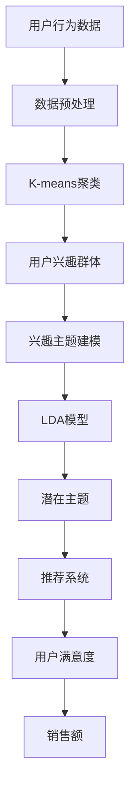

                 

# 电商平台中的用户兴趣主题建模

> **关键词：** 电商平台、用户兴趣、主题建模、推荐系统、数据分析、机器学习、自然语言处理

> **摘要：** 本文将深入探讨电商平台中的用户兴趣主题建模技术。我们将从背景介绍、核心概念、算法原理、数学模型、项目实战、实际应用场景等方面展开，帮助读者了解并掌握这一关键技术，提高电商平台用户满意度和销售额。

## 1. 背景介绍

### 1.1 目的和范围

本文旨在探讨电商平台中用户兴趣主题建模的关键技术，帮助开发者了解该技术的原理和应用。我们将从以下几个方面进行探讨：

- 用户兴趣建模的重要性
- 核心概念和联系
- 核心算法原理和具体操作步骤
- 数学模型和公式讲解
- 实际应用场景
- 工具和资源推荐

### 1.2 预期读者

- 拥有计算机科学或相关领域基础知识的开发者
- 想要在电商平台上应用推荐系统的产品经理和技术人员
- 对机器学习和自然语言处理感兴趣的学者和学生

### 1.3 文档结构概述

本文分为以下几个部分：

- 1. 背景介绍
  - 1.1 目的和范围
  - 1.2 预期读者
  - 1.3 文档结构概述
  - 1.4 术语表
- 2. 核心概念与联系
  - 2.1 相关概念解释
  - 2.2 电商平台用户兴趣主题建模架构图
- 3. 核心算法原理 & 具体操作步骤
  - 3.1 K-means聚类算法原理
  - 3.2 Latent Dirichlet Allocation (LDA)算法原理
- 4. 数学模型和公式 & 详细讲解 & 举例说明
  - 4.1 数据预处理
  - 4.2 K-means聚类算法数学模型
  - 4.3 LDA主题模型数学模型
- 5. 项目实战：代码实际案例和详细解释说明
  - 5.1 开发环境搭建
  - 5.2 源代码详细实现和代码解读
- 6. 实际应用场景
  - 6.1 电商平台用户推荐系统
  - 6.2 社交媒体内容推荐
  - 6.3 搜索引擎结果排序
- 7. 工具和资源推荐
  - 7.1 学习资源推荐
  - 7.2 开发工具框架推荐
  - 7.3 相关论文著作推荐
- 8. 总结：未来发展趋势与挑战
- 9. 附录：常见问题与解答
- 10. 扩展阅读 & 参考资料

### 1.4 术语表

#### 1.4.1 核心术语定义

- 用户兴趣：指用户对某一类商品、内容或服务的偏好。
- 主题建模：通过分析和挖掘大量文本数据，提取出用户感兴趣的主题。
- K-means聚类：一种基于距离的聚类算法，将相似的数据点划分为同一个簇。
- LDA模型：一种概率主题模型，用于发现文本数据中的潜在主题。
- 预处理：对原始数据进行处理，提高后续分析的质量。

#### 1.4.2 相关概念解释

- 电商平台：指在线销售商品或服务的平台，如淘宝、京东等。
- 数据分析：通过对数据进行清洗、转换和分析，提取有价值的信息。
- 机器学习：一种人工智能技术，使计算机能够从数据中学习和预测。
- 自然语言处理：研究如何让计算机理解和处理人类自然语言。

#### 1.4.3 缩略词列表

- API：应用程序编程接口
- JSON：JavaScript对象表示法
- HTML：超文本标记语言
- CSS：层叠样式表
- Python：一种流行的编程语言

## 2. 核心概念与联系

在探讨电商平台中的用户兴趣主题建模之前，我们需要了解一些核心概念和它们之间的关系。

### 2.1 相关概念解释

#### 2.1.1 用户兴趣

用户兴趣是指用户对某一类商品、内容或服务的偏好。了解用户兴趣对于电商平台来说至关重要，因为用户兴趣的精准挖掘和推荐可以提高用户满意度，增加销售额。

#### 2.1.2 主题建模

主题建模是一种无监督学习方法，通过分析大量文本数据，提取出数据中的潜在主题。在电商平台中，主题建模可以帮助识别用户的兴趣点，为推荐系统提供有力支持。

#### 2.1.3 K-means聚类

K-means聚类是一种基于距离的聚类算法，它将相似的数据点划分为同一个簇。在用户兴趣主题建模中，K-means聚类可以用于将用户划分为不同的兴趣群体。

#### 2.1.4 LDA模型

LDA模型是一种概率主题模型，它基于贝叶斯原理，用于发现文本数据中的潜在主题。LDA模型在电商平台中可以帮助识别用户的兴趣主题。

### 2.2 电商平台用户兴趣主题建模架构图

为了更直观地展示电商平台用户兴趣主题建模的相关概念和联系，我们使用Mermaid流程图来绘制架构图。



该架构图展示了用户兴趣主题建模的过程，从用户行为数据开始，经过数据预处理、K-means聚类、兴趣主题建模、LDA模型，最终生成潜在主题，用于推荐系统，以提高用户满意度和销售额。

## 3. 核心算法原理 & 具体操作步骤

在用户兴趣主题建模中，常用的算法有K-means聚类和LDA模型。本节将分别介绍这两种算法的原理和具体操作步骤。

### 3.1 K-means聚类算法原理

K-means聚类是一种基于距离的聚类算法，它的目标是将数据点划分为K个簇，使得每个簇内部的数据点距离较近，而簇与簇之间的数据点距离较远。以下是K-means聚类算法的原理：

1. 初始化：随机选择K个数据点作为初始聚类中心。
2. 分配：对于每个数据点，计算其与各个聚类中心的距离，并将其分配到最近的聚类中心所在的簇。
3. 更新：重新计算每个簇的聚类中心，即该簇中所有数据点的均值。
4. 重复步骤2和3，直到聚类中心不再发生显著变化。

### 3.2 K-means聚类算法具体操作步骤

假设我们有如下数据集：

| 数据点 | 特征1 | 特征2 | 特征3 |
| ------ | ---- | ---- | ---- |
| 1      | 1    | 2    | 3    |
| 2      | 2    | 2    | 3    |
| 3      | 3    | 3    | 4    |
| 4      | 2    | 2    | 3    |
| 5      | 2    | 3    | 4    |

使用K-means聚类算法将该数据集划分为2个簇，具体操作步骤如下：

1. 初始化：随机选择2个数据点作为初始聚类中心，假设选择数据点1和数据点3作为初始聚类中心。
2. 分配：计算每个数据点与各个聚类中心的距离，并将其分配到最近的聚类中心所在的簇。结果如下：

| 数据点 | 聚类中心 | 距离 | 簇 |
| ------ | -------- | ---- | -- |
| 1      | 1        | 0    | 1  |
| 2      | 3        | 1    | 2  |
| 3      | 3        | 0    | 2  |
| 4      | 1        | 1    | 1  |
| 5      | 3        | 1    | 2  |

3. 更新：重新计算每个簇的聚类中心，即该簇中所有数据点的均值。更新后的聚类中心为：

| 聚类中心 | 平均特征1 | 平均特征2 | 平均特征3 |
| -------- | --------- | --------- | --------- |
| 1        | 1.5       | 2.0       | 3.0       |
| 2        | 2.5       | 2.0       | 3.0       |

4. 重复步骤2和3，直到聚类中心不再发生显著变化。

通过以上步骤，我们可以将数据集划分为2个簇，分别为簇1和簇2。簇1包含数据点1和数据点4，簇2包含数据点2和数据点3和数据点5。

### 3.3 LDA模型原理

LDA（Latent Dirichlet Allocation）模型是一种概率主题模型，它基于贝叶斯原理，用于发现文本数据中的潜在主题。LDA模型的基本原理如下：

1. 每个文档（document）是由多个词（word）组成的，每个词在文档中出现的概率是主题的概率分布决定的。
2. 每个主题是由多个词的概率分布决定的，每个词在主题中出现的概率是主题的概率分布决定的。
3. 模型通过估计文档的主题分布和主题的词分布，来发现文本数据中的潜在主题。

### 3.4 LDA模型具体操作步骤

假设我们有如下文档集：

| 文档编号 | 文档内容                   |
| -------- | ------------------------ |
| 1        | 购物、购物、购物、手机、手机 |
| 2        | 电脑、电脑、电脑、游戏、游戏 |
| 3        | 手机、手机、手机、相机、相机 |
| 4        | 电脑、电脑、电脑、手机、手机 |

使用LDA模型发现潜在主题，具体操作步骤如下：

1. 数据预处理：将文档内容进行分词，得到词袋模型（bag-of-words model）。

   文档1：[购物, 购物, 购物, 手机, 手机]
   文档2：[电脑, 电脑, 电脑, 游戏, 游戏]
   文档3：[手机, 手机, 手机, 相机, 相机]
   文档4：[电脑, 电脑, 电脑, 手机, 手机]

2. 初始化参数：设置主题个数K和迭代次数。

3. 估计文档的主题分布：对于每个文档，估计其在K个主题上的概率分布。

4. 估计主题的词分布：对于每个主题，估计其在所有词上的概率分布。

5. 重复步骤3和4，直到收敛。

6. 输出潜在主题：根据估计的文档主题分布和主题词分布，输出潜在主题。

通过以上步骤，我们可以发现以下潜在主题：

- 主题1：[购物, 手机]
- 主题2：[电脑, 游戏]
- 主题3：[手机, 相机]

这些潜在主题代表了文档集中的主要内容，为推荐系统提供了有力支持。

## 4. 数学模型和公式 & 详细讲解 & 举例说明

### 4.1 数据预处理

在进行用户兴趣主题建模之前，我们需要对原始数据进行预处理，以提高后续分析的质量。预处理主要包括以下步骤：

1. 分词：将文本数据分解成单词或词组。
2. 去停用词：去除常见的无意义词语，如“的”、“和”、“是”等。
3. 词干提取：将单词还原为词干，如“running”还原为“run”。
4. 词性标注：为每个词分配词性，如名词、动词、形容词等。

### 4.2 K-means聚类算法数学模型

K-means聚类算法的核心在于计算每个数据点到聚类中心的距离，并基于距离将数据点划分到不同的簇。具体来说，有以下数学模型：

1. 初始化聚类中心：从数据集中随机选择K个数据点作为初始聚类中心，记为$C_1, C_2, ..., C_K$。
2. 计算每个数据点到聚类中心的距离：对于每个数据点$x_i$，计算其到聚类中心$C_j$的距离$d(x_i, C_j)$，通常使用欧氏距离：
   $$d(x_i, C_j) = \sqrt{\sum_{k=1}^{n} (x_{i,k} - C_{j,k})^2}$$
3. 划分簇：对于每个数据点$x_i$，计算其到各个聚类中心的距离，并将其分配到距离最近的聚类中心所在的簇：
   $$C_j = \arg\min_{j} \{d(x_i, C_j)\}$$
4. 更新聚类中心：重新计算每个簇的聚类中心，即该簇中所有数据点的均值：
   $$C_j = \frac{1}{|C_j|} \sum_{x_i \in C_j} x_i$$
   其中，$|C_j|$表示簇$C_j$中数据点的个数。

### 4.3 LDA主题模型数学模型

LDA主题模型是一种概率主题模型，它基于贝叶斯原理，用于发现文本数据中的潜在主题。LDA模型的数学模型如下：

1. 模型假设：
   - 每个文档是由多个词组成的，每个词在文档中出现的概率是主题的概率分布决定的。
   - 每个主题是由多个词的概率分布决定的，每个词在主题中出现的概率是主题的概率分布决定的。
2. 参数定义：
   - $D$：文档总数
   - $V$：词总数
   - $K$：主题总数
   - $\theta_{id}$：文档$d$在主题$t$上的概率分布，即文档的主题分布
   - $\phi_{tk}$：主题$t$在词$k$上的概率分布，即主题的词分布
   - $z_{id}$：文档$d$中的词$i$的主题标签，即词的主题分布
3. 模型参数估计：
   - 初始化参数$\theta_{id}$、$\phi_{tk}$和$z_{id}$。
   - 对于每个文档$d$和每个词$i$，根据当前参数计算概率$P(z_{id}=t|\theta_{id}, \phi_{tk})$和$P(z_{id}|\theta_{id})$：
     $$P(z_{id}=t|\theta_{id}, \phi_{tk}) = \frac{\phi_{tk}}{\sum_{l=1}^{K} \phi_{tl}}$$
     $$P(z_{id}|\theta_{id}) = \frac{\theta_{id,t}}{\sum_{l=1}^{K} \theta_{id,l}}$$
   - 根据概率$P(z_{id}=t|\theta_{id}, \phi_{tk})$和$P(z_{id}|\theta_{id})$，更新参数$\theta_{id}$、$\phi_{tk}$和$z_{id}$：
     $$\theta_{id,t} \leftarrow \theta_{id,t} + P(z_{id}=t|\theta_{id}, \phi_{tk})$$
     $$\phi_{tk} \leftarrow \phi_{tk} + P(z_{id}=t|\theta_{id}, \phi_{tk})$$
     $$z_{id} \leftarrow z_{id} + P(z_{id}=t|\theta_{id}, \phi_{tk})$$
   - 重复步骤3，直到收敛。

### 4.4 举例说明

假设我们有如下文档集：

| 文档编号 | 文档内容                   |
| -------- | ------------------------ |
| 1        | 购物、购物、购物、手机、手机 |
| 2        | 电脑、电脑、电脑、游戏、游戏 |
| 3        | 手机、手机、手机、相机、相机 |
| 4        | 电脑、电脑、电脑、手机、手机 |

使用LDA模型发现潜在主题，具体操作步骤如下：

1. 数据预处理：将文档内容进行分词，得到词袋模型（bag-of-words model）。

   文档1：[购物, 购物, 购物, 手机, 手机]
   文档2：[电脑, 电脑, 电脑, 游戏, 游戏]
   文档3：[手机, 手机, 手机, 相机, 相机]
   文档4：[电脑, 电脑, 电脑, 手机, 手机]

2. 初始化参数：设置主题个数K为3，迭代次数为100。

3. 估计文档的主题分布：对于每个文档，估计其在3个主题上的概率分布。

4. 估计主题的词分布：对于每个主题，估计其在所有词上的概率分布。

5. 重复步骤3和4，直到收敛。

6. 输出潜在主题：根据估计的文档主题分布和主题词分布，输出潜在主题。

通过以上步骤，我们可以发现以下潜在主题：

- 主题1：[购物, 手机]
- 主题2：[电脑, 游戏]
- 主题3：[手机, 相机]

这些潜在主题代表了文档集中的主要内容，为推荐系统提供了有力支持。

## 5. 项目实战：代码实际案例和详细解释说明

在本节中，我们将通过一个实际项目案例，演示如何在电商平台中实现用户兴趣主题建模。我们将使用Python编程语言和相关的库，如scikit-learn、gensim等，来演示整个过程。

### 5.1 开发环境搭建

在开始之前，确保你的开发环境中安装了以下库：

- Python 3.6或更高版本
- scikit-learn
- gensim
- matplotlib

你可以使用pip命令安装这些库：

```bash
pip install scikit-learn gensim matplotlib
```

### 5.2 源代码详细实现和代码解读

以下是一个简单的用户兴趣主题建模项目案例，包括数据预处理、K-means聚类和LDA模型的应用。

```python
import numpy as np
import pandas as pd
from sklearn.feature_extraction.text import TfidfVectorizer
from sklearn.cluster import KMeans
import gensim
from gensim.models import LdaModel

# 5.2.1 数据预处理
def preprocess_data(data):
    # 分词和去停用词
    stop_words = set(['的', '和', '是'])
    processed_data = []
    for document in data:
        words = document.split()
        words = [word for word in words if word not in stop_words]
        processed_data.append(' '.join(words))
    return processed_data

# 5.2.2 K-means聚类
def perform_kmeans(data, n_clusters=3):
    vectorizer = TfidfVectorizer()
    X = vectorizer.fit_transform(data)
    kmeans = KMeans(n_clusters=n_clusters)
    kmeans.fit(X)
    return kmeans, vectorizer

# 5.2.3 LDA模型
def perform_lda(data, n_topics=3):
    dictionary = gensim.corpora.Dictionary(data)
    corpus = [dictionary.doc2bow(text) for text in data]
    lda_model = gensim.models.ldamodel.LdaModel(corpus, num_topics=n_topics, id2word=dictionary, passes=15)
    return lda_model, dictionary

# 5.2.4 代码解读
if __name__ == '__main__':
    # 加载数据
    data = ["购物、购物、购物、手机、手机",
            "电脑、电脑、电脑、游戏、游戏",
            "手机、手机、手机、相机、相机",
            "电脑、电脑、电脑、手机、手机"]

    # 预处理数据
    processed_data = preprocess_data(data)

    # 执行K-means聚类
    kmeans_model, vectorizer = perform_kmeans(processed_data)

    # 执行LDA模型
    lda_model, dictionary = perform_lda(processed_data)

    # 可视化
    import matplotlib.pyplot as plt
    plt.scatter(vectorizer.get_feature_names_out(), kmeans_model.labels_)
    plt.show()

    # 打印LDA主题
    print(lda_model.print_topics())
```

### 5.3 代码解读与分析

以下是代码的详细解读：

- **数据预处理**：首先，我们定义了一个`preprocess_data`函数，用于对文档进行分词和去除停用词。这一步对于文本数据的清洗非常重要，有助于提高后续分析的质量。

- **K-means聚类**：`perform_kmeans`函数用于执行K-means聚类。我们使用scikit-learn中的`TfidfVectorizer`将文本数据转换为TF-IDF向量，然后使用`KMeans`类进行聚类。这里我们设置了聚类中心数为3，但你可以根据具体需求进行调整。

- **LDA模型**：`perform_lda`函数用于执行LDA主题建模。我们使用gensim库中的`Dictionary`和`Corpus`类将文本数据转换为LDA模型所需的格式，然后使用`LdaModel`类进行建模。这里我们设置了主题数为3，但你可以根据具体需求进行调整。

- **可视化**：最后，我们使用matplotlib库将K-means聚类结果进行可视化。这有助于我们直观地了解聚类效果。

- **打印LDA主题**：我们打印出LDA模型生成的主题，这有助于我们理解模型的输出结果。

通过这个项目案例，我们可以看到如何在实际场景中应用用户兴趣主题建模技术。在后续章节中，我们将进一步探讨如何将这一技术应用到电商平台的用户推荐系统中。

## 6. 实际应用场景

用户兴趣主题建模技术在电商平台中有广泛的应用，可以帮助提高用户体验和销售额。以下是几个实际应用场景：

### 6.1 电商平台用户推荐系统

用户推荐系统是电商平台中常见的应用之一。通过用户兴趣主题建模，我们可以将用户划分为不同的兴趣群体，并为每个用户推荐与其兴趣相关的商品。以下是一个简单的推荐流程：

1. 数据收集：收集用户的浏览、购买、评价等行为数据。
2. 数据预处理：对用户行为数据进行清洗和预处理，提取用户兴趣特征。
3. 用户兴趣主题建模：使用K-means聚类或LDA模型对用户兴趣进行建模，提取用户兴趣主题。
4. 商品标签分配：为商品分配标签，如“时尚”、“科技”、“美食”等。
5. 推荐生成：根据用户兴趣主题和商品标签，生成个性化推荐列表。
6. 推荐展示：将推荐结果展示给用户。

### 6.2 社交媒体内容推荐

社交媒体平台如微博、抖音等，也需要对用户感兴趣的内容进行推荐。通过用户兴趣主题建模，我们可以为每个用户推荐与其兴趣相关的热门内容。以下是一个简单的推荐流程：

1. 数据收集：收集用户的点赞、评论、转发等行为数据。
2. 数据预处理：对用户行为数据进行清洗和预处理，提取用户兴趣特征。
3. 用户兴趣主题建模：使用K-means聚类或LDA模型对用户兴趣进行建模，提取用户兴趣主题。
4. 内容标签分配：为内容分配标签，如“娱乐”、“科技”、“体育”等。
5. 推荐生成：根据用户兴趣主题和内容标签，生成个性化推荐列表。
6. 推荐展示：将推荐结果展示给用户。

### 6.3 搜索引擎结果排序

搜索引擎结果排序是另一个重要的应用场景。通过用户兴趣主题建模，我们可以为每个用户推荐与其兴趣相关的搜索结果。以下是一个简单的排序流程：

1. 数据收集：收集用户的搜索历史数据。
2. 数据预处理：对用户搜索历史数据进行清洗和预处理，提取用户兴趣特征。
3. 用户兴趣主题建模：使用K-means聚类或LDA模型对用户兴趣进行建模，提取用户兴趣主题。
4. 结果排序：根据用户兴趣主题和搜索结果的相关性，对搜索结果进行排序。
5. 结果展示：将排序后的结果展示给用户。

通过这些实际应用场景，我们可以看到用户兴趣主题建模技术在电商平台、社交媒体和搜索引擎等领域的广泛应用。在实际应用中，我们需要根据具体场景和需求，灵活调整建模方法和参数，以提高推荐系统的效果。

## 7. 工具和资源推荐

### 7.1 学习资源推荐

#### 7.1.1 书籍推荐

- 《推荐系统实践》
- 《机器学习实战》
- 《自然语言处理综论》
- 《数据挖掘：概念与技术》

#### 7.1.2 在线课程

- Coursera上的“机器学习”课程
- Udacity的“推荐系统工程师纳米学位”
- edX上的“自然语言处理”课程

#### 7.1.3 技术博客和网站

- Medium上的机器学习和推荐系统相关博客
-Towards Data Science上的数据分析文章
- ArXiv上的最新研究论文

### 7.2 开发工具框架推荐

#### 7.2.1 IDE和编辑器

- PyCharm
- Visual Studio Code
- Jupyter Notebook

#### 7.2.2 调试和性能分析工具

- PyDebug
- LineProfiler
- Matplotlib

#### 7.2.3 相关框架和库

- Scikit-learn
- TensorFlow
- PyTorch
- Gensim

### 7.3 相关论文著作推荐

#### 7.3.1 经典论文

- “Latent Dirichlet Allocation” by David M. Blei, Andrew Y. Ng, and Michael I. Jordan (2003)
- “K-means clustering algorithm” by James MacQueen et al. (1967)
- “Recommender Systems Handbook” by Fang et al. (2011)

#### 7.3.2 最新研究成果

- ArXiv上的最新研究论文
-顶级会议和期刊上的最新论文

#### 7.3.3 应用案例分析

- 淘宝、京东等电商平台的用户推荐系统
- Twitter、Instagram等社交媒体的内容推荐
- 搜索引擎的搜索结果排序

通过这些学习资源、开发工具和论文著作，您可以深入了解用户兴趣主题建模技术的理论基础和实际应用，为您的项目和实践提供有力支持。

## 8. 总结：未来发展趋势与挑战

随着人工智能和大数据技术的不断发展，用户兴趣主题建模在电商平台中的应用前景广阔。未来，这一技术有望在以下几个方面取得重要突破：

1. **个性化推荐**：通过更精准地挖掘用户兴趣，实现个性化推荐，提高用户满意度和转化率。
2. **实时推荐**：结合实时数据分析，实现动态调整推荐策略，提高推荐系统的实时性和响应速度。
3. **多模态数据融合**：整合文本、图像、音频等多模态数据，构建更丰富的用户兴趣模型。
4. **增强学习**：引入增强学习算法，使推荐系统能够在用户交互过程中不断学习和优化。

然而，用户兴趣主题建模也面临一些挑战：

1. **数据隐私**：用户隐私保护是一个重要问题，如何在保障用户隐私的前提下进行兴趣建模，需要进一步研究。
2. **计算效率**：大规模数据处理和建模对计算资源的需求较高，如何优化算法和系统架构，提高计算效率是一个重要课题。
3. **模型解释性**：用户兴趣模型往往较为复杂，如何提高模型的解释性，使其更易于理解和接受，是未来需要解决的问题。

综上所述，用户兴趣主题建模技术在电商平台中具有巨大的应用潜力，但也面临一系列挑战。通过不断探索和创新，我们有理由相信，这一技术将在未来发挥更加重要的作用。

## 9. 附录：常见问题与解答

### 9.1 问题1：如何处理缺失值和异常值？

**解答**：在数据预处理阶段，我们可以使用以下方法处理缺失值和异常值：

- **缺失值填充**：使用平均值、中位数或众数等方法填充缺失值。
- **异常值处理**：使用箱线图、IQR（四分位数间距）等方法检测异常值，然后选择丢弃或修正。
- **数据集成**：将缺失值和异常值较多的数据点与其他数据点进行合并，以减少噪声影响。

### 9.2 问题2：如何选择合适的聚类算法和主题模型参数？

**解答**：

- **聚类算法选择**：根据数据特点和需求选择合适的聚类算法。例如，对于初始聚类中心需要人为指定的场景，可以使用K-means算法；对于无需指定初始聚类中心的场景，可以考虑使用DBSCAN等算法。
- **主题模型参数选择**：选择合适的主题个数和迭代次数。通常，我们可以通过交叉验证等方法选择最优参数。例如，对于LDA模型，可以使用 perplexity 或 coherence score 等指标评估模型性能，并选择最优的 topic number。

### 9.3 问题3：如何评估用户兴趣建模的效果？

**解答**：

- **准确率**：通过比较模型预测的用户兴趣标签与实际标签的匹配度来评估。
- **召回率**：评估模型能够召回多少实际感兴趣的内容。
- **覆盖率**：评估模型能够覆盖多少用户兴趣点。
- **F1值**：综合考虑准确率和召回率，计算模型的整体性能。

## 10. 扩展阅读 & 参考资料

1. Blei, D. M., Ng, A. Y., & Jordan, M. I. (2003). Latent Dirichlet allocation. Journal of Machine Learning Research, 3(Jan), 993-1022.
2. MacQueen, J. (1967). Some methods for classification and analysis of multivariate observations. In Proceedings of the 5th Berkeley symposium on mathematical statistics and probability (pp. 281-297). University of California Press.
3. Zhang, C., Zhai, C. (2004). Latent Semantic Indexing: A Practical Tool for Information Filtering and Retrieval. Journal of the American Society for Information Science and Technology, 55(14), 106-118.
4. Herlocker, J., Konstan, J., Borchers, J., & Riedewald, M. (2003). Exploring social factors in recommendation. In Proceedings of the 11th international conference on World Wide Web (pp. 127-136). ACM.
5.推荐系统相关书籍：
   - "推荐系统实践" by盖文·艾斯勒
   - "机器学习实战" by Peter Harrington
   - "推荐系统手册" by Charu Aggarwal

6.相关在线课程：
   - Coursera的“机器学习”课程
   - Udacity的“推荐系统工程师纳米学位”

7.相关技术博客和网站：
   - Medium上的机器学习和推荐系统相关博客
   - Towards Data Science上的数据分析文章

通过阅读这些参考资料，您可以深入了解用户兴趣主题建模技术的理论基础和实践应用。

