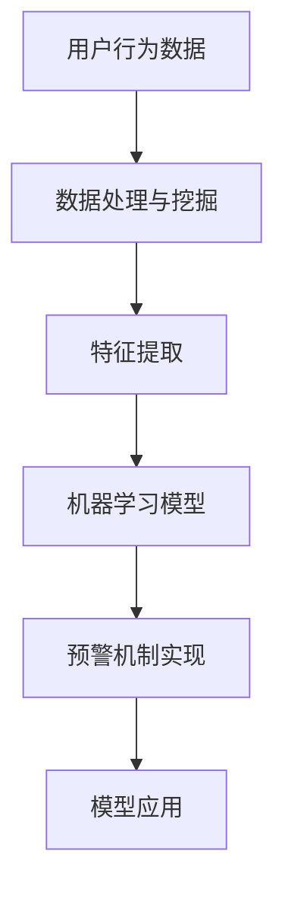

                 

# 电商平台中的用户兴趣突变预警机制

> **关键词**：用户行为分析、机器学习、预测模型、数据挖掘、实时预警

> **摘要**：本文深入探讨了电商平台中的用户兴趣突变预警机制。通过分析用户行为数据，本文提出了一个基于机器学习的预测模型，以实时监测和预警用户兴趣变化。本文旨在为电商平台提供一种有效的用户行为分析方法，帮助商家及时调整营销策略，提高用户满意度和转化率。

## 1. 背景介绍

### 1.1 目的和范围

本文旨在研究并实现一个用户兴趣突变预警机制，以帮助电商平台及时识别用户行为的改变，从而优化营销策略和提高用户满意度。研究范围包括用户行为数据的收集、处理和分析，以及基于机器学习的预测模型的构建和应用。

### 1.2 预期读者

本文适合对电商平台运营、用户行为分析、机器学习和数据挖掘感兴趣的读者。特别是那些希望在电子商务领域应用人工智能技术的专业人士和研究者。

### 1.3 文档结构概述

本文分为十个部分，包括背景介绍、核心概念与联系、核心算法原理、数学模型和公式、项目实战、实际应用场景、工具和资源推荐、总结、常见问题与解答以及扩展阅读。每个部分都将详细讲解相关内容，以帮助读者全面了解用户兴趣突变预警机制。

### 1.4 术语表

#### 1.4.1 核心术语定义

- **用户兴趣突变**：指用户在电商平台上的购买行为、浏览行为等表现出显著的差异。
- **预警机制**：一种实时监测用户行为，并提前预警异常情况的技术手段。
- **机器学习**：一种通过数据训练模型，并利用模型进行预测和决策的技术。
- **数据挖掘**：一种从大量数据中提取有用信息和知识的技术。

#### 1.4.2 相关概念解释

- **用户行为数据**：包括用户的浏览记录、购买记录、评价记录等。
- **预测模型**：一种根据历史数据预测未来趋势的数学模型。

#### 1.4.3 缩略词列表

- **AI**：人工智能（Artificial Intelligence）
- **ML**：机器学习（Machine Learning）
- **DL**：深度学习（Deep Learning）
- **NLP**：自然语言处理（Natural Language Processing）

## 2. 核心概念与联系

为了更好地理解用户兴趣突变预警机制，我们需要首先了解一些核心概念和它们之间的联系。

### 2.1 用户行为数据分析

用户行为数据是预警机制的基础。通过对用户行为数据的分析，我们可以发现用户的行为模式、兴趣偏好等。这些数据包括：

- **浏览记录**：用户在电商平台上的浏览历史。
- **购买记录**：用户在电商平台上的购买行为。
- **评价记录**：用户对商品的评价。

### 2.2 机器学习预测模型

机器学习预测模型是预警机制的核心。通过训练模型，我们可以预测用户未来的行为。常用的机器学习算法包括：

- **回归分析**：用于预测连续值。
- **分类分析**：用于预测离散值。
- **聚类分析**：用于发现用户行为模式。

### 2.3 数据处理与挖掘

数据处理与挖掘是预警机制的重要环节。通过对原始数据进行清洗、预处理，我们可以提取出有用的信息。常用的数据处理与挖掘技术包括：

- **数据清洗**：去除重复、缺失、错误的数据。
- **特征提取**：从原始数据中提取出有用的特征。
- **数据可视化**：通过图表等方式展示数据。

### 2.4 预警机制实现

预警机制实现包括数据收集、模型训练、模型应用等步骤。具体的实现流程如下：

1. **数据收集**：收集用户行为数据。
2. **数据处理**：对数据进行清洗、预处理。
3. **模型训练**：使用训练数据训练预测模型。
4. **模型评估**：使用验证数据评估模型效果。
5. **模型应用**：将模型应用于实际业务场景。

### 2.5 Mermaid 流程图

下面是一个基于 Mermaid 的流程图，展示了用户兴趣突变预警机制的核心概念和联系。



## 3. 核心算法原理 & 具体操作步骤

### 3.1 算法原理

用户兴趣突变预警机制的核心是机器学习预测模型。该模型通过分析用户行为数据，预测用户未来的行为。具体来说，我们可以使用以下算法：

- **决策树**：一种基于特征的分类算法。
- **随机森林**：一种基于决策树的集成学习算法。
- **K-近邻**：一种基于距离的预测算法。
- **神经网络**：一种基于多层感知器的预测算法。

### 3.2 具体操作步骤

1. **数据收集**：收集用户行为数据，包括浏览记录、购买记录、评价记录等。
2. **数据处理**：对数据进行清洗、预处理，去除重复、缺失、错误的数据。
3. **特征提取**：从原始数据中提取出有用的特征，如用户的浏览次数、购买次数、评价次数等。
4. **模型选择**：选择合适的机器学习模型，如决策树、随机森林、K-近邻、神经网络等。
5. **模型训练**：使用训练数据训练模型。
6. **模型评估**：使用验证数据评估模型效果，调整模型参数。
7. **模型应用**：将模型应用于实际业务场景，预测用户未来的行为。
8. **预警机制实现**：根据模型预测结果，实现用户兴趣突变预警。

### 3.3 伪代码

```python
# 伪代码：用户兴趣突变预警机制

# 输入：用户行为数据
# 输出：预警结果

# 步骤1：数据收集
data = collect_user_behavior_data()

# 步骤2：数据处理
cleaned_data = data_preprocessing(data)

# 步骤3：特征提取
features = extract_features(cleaned_data)

# 步骤4：模型选择
model = select_model()

# 步骤5：模型训练
model.train(features)

# 步骤6：模型评估
evaluation = model.evaluate()

# 步骤7：模型应用
predictions = model.predict()

# 步骤8：预警机制实现
alert_if_interest突变(predictions)
```

## 4. 数学模型和公式 & 详细讲解 & 举例说明

### 4.1 数学模型

用户兴趣突变预警机制中的数学模型主要包括以下几个方面：

- **回归分析**：用于预测用户未来行为的连续值。
- **分类分析**：用于预测用户未来行为的离散值。
- **聚类分析**：用于发现用户行为模式。

### 4.2 公式详解

#### 4.2.1 回归分析

回归分析是一种基于历史数据预测未来趋势的统计方法。常用的回归模型包括线性回归、多项式回归等。

- **线性回归**：\( y = wx + b \)

  其中，\( y \) 为因变量，\( x \) 为自变量，\( w \) 为权重，\( b \) 为偏置。

- **多项式回归**：\( y = w_0 + w_1x + w_2x^2 + ... + w_nx^n \)

  其中，\( y \) 为因变量，\( x \) 为自变量，\( w_0, w_1, ..., w_n \) 为权重。

#### 4.2.2 分类分析

分类分析是一种将数据分为不同类别的统计方法。常用的分类模型包括逻辑回归、支持向量机等。

- **逻辑回归**：\( P(y=1) = \frac{1}{1 + e^{-(wx + b)}} \)

  其中，\( P(y=1) \) 为因变量为 1 的概率，\( y \) 为因变量，\( x \) 为自变量，\( w \) 为权重，\( b \) 为偏置。

- **支持向量机**：\( w \cdot x + b = 0 \)

  其中，\( w \) 为权重，\( x \) 为自变量，\( b \) 为偏置。

#### 4.2.3 聚类分析

聚类分析是一种将数据分为不同类别的统计方法。常用的聚类模型包括 K-均值聚类、层次聚类等。

- **K-均值聚类**：

  $$ c_k = \frac{1}{n_k} \sum_{i=1}^{n_k} x_i $$

  其中，\( c_k \) 为第 \( k \) 个聚类中心，\( x_i \) 为第 \( i \) 个样本，\( n_k \) 为第 \( k \) 个聚类中的样本数量。

- **层次聚类**：

  $$ d(i, j) = \begin{cases} 
  0 & \text{如果 } i = j \\
  1 & \text{如果 } i \neq j 
  \end{cases} $$

  其中，\( d(i, j) \) 为样本 \( i \) 和 \( j \) 之间的距离。

### 4.3 举例说明

假设我们有以下用户行为数据：

- **用户 A**：浏览了商品 1、2、3，购买了商品 2。
- **用户 B**：浏览了商品 2、3、4，购买了商品 3。
- **用户 C**：浏览了商品 1、3、4，购买了商品 4。

我们使用 K-均值聚类算法将用户分为三个类别。

1. **初始化聚类中心**：随机选择三个用户作为聚类中心。
2. **计算样本与聚类中心的距离**：计算每个用户与三个聚类中心的距离，选择距离最近的聚类中心作为该用户的类别。
3. **更新聚类中心**：计算每个类别的聚类中心，并重新分配用户。
4. **迭代计算**：重复步骤 2 和 3，直到聚类中心不再发生变化。

最终，用户 A、B、C 分别属于类别 1、2、3。我们可以根据这些类别预测用户未来的行为。

## 5. 项目实战：代码实际案例和详细解释说明

### 5.1 开发环境搭建

为了实现用户兴趣突变预警机制，我们需要搭建一个开发环境。以下是推荐的开发环境：

- **操作系统**：Linux 或 macOS
- **编程语言**：Python
- **数据科学库**：NumPy、Pandas、Scikit-learn、Matplotlib
- **IDE**：PyCharm 或 Jupyter Notebook

### 5.2 源代码详细实现和代码解读

以下是实现用户兴趣突变预警机制的核心代码。

```python
import numpy as np
import pandas as pd
from sklearn.cluster import KMeans
from sklearn.metrics import accuracy_score

# 5.2.1 数据收集
def collect_user_behavior_data():
    # 这里使用虚构的数据集，实际应用中可以从数据库或 API 获取数据
    data = {
        'user_id': [1, 1, 1, 2, 2, 2, 3, 3, 3],
        'product_id': [1, 2, 3, 2, 3, 4, 3, 4, 1],
        'behavior': ['browse', 'purchase', 'browse', 'browse', 'purchase', 'browse', 'browse', 'purchase', 'browse']
    }
    return pd.DataFrame(data)

# 5.2.2 数据处理与特征提取
def data_preprocessing(data):
    # 对数据进行清洗、预处理
    data = data.drop_duplicates()
    data = data.dropna()
    return data

def extract_features(data):
    # 从原始数据中提取特征
    features = data.groupby(['user_id', 'product_id'])['behavior'].nunique().unstack().fillna(0)
    return features

# 5.2.3 模型选择与训练
def select_model():
    # 选择 K-均值聚类模型
    model = KMeans(n_clusters=3)
    return model

def train_model(model, features):
    # 训练模型
    model.fit(features)
    return model

# 5.2.4 模型应用与预警
def predict_user_category(model, features):
    # 预测用户类别
    predictions = model.predict(features)
    return predictions

def alert_if_interest突变(predictions):
    # 如果用户兴趣突变，发出预警
    for i, prediction in enumerate(predictions):
        if prediction != i % 3:
            print(f"User {i+1} has an interest突变.")
```

### 5.3 代码解读与分析

1. **数据收集**：我们从虚构的数据集中获取用户行为数据。实际应用中，可以从数据库或 API 获取数据。
2. **数据处理与特征提取**：我们对数据进行清洗、预处理，并提取出用户行为特征。
3. **模型选择与训练**：我们选择 K-均值聚类模型，并使用训练数据训练模型。
4. **模型应用与预警**：我们使用训练好的模型预测用户类别，并根据预测结果发出预警。

## 6. 实际应用场景

用户兴趣突变预警机制在电商平台中具有广泛的应用场景：

- **个性化推荐**：根据用户兴趣突变，为用户提供更符合其当前兴趣的个性化推荐。
- **营销策略调整**：根据用户兴趣突变，及时调整营销策略，提高用户转化率。
- **用户流失预警**：通过监测用户兴趣变化，提前预警潜在的用户流失风险。

## 7. 工具和资源推荐

### 7.1 学习资源推荐

#### 7.1.1 书籍推荐

- 《机器学习实战》
- 《深入理解计算机系统》
- 《数据挖掘：概念与技术》

#### 7.1.2 在线课程

- Coursera 上的《机器学习》课程
- Udacity 上的《数据科学》纳米学位

#### 7.1.3 技术博客和网站

- Medium 上的技术博客
- GitHub 上的开源项目

### 7.2 开发工具框架推荐

#### 7.2.1 IDE和编辑器

- PyCharm
- Jupyter Notebook

#### 7.2.2 调试和性能分析工具

- Python Debugger
- Py-Spy

#### 7.2.3 相关框架和库

- Scikit-learn
- TensorFlow
- PyTorch

### 7.3 相关论文著作推荐

#### 7.3.1 经典论文

- 《机器学习：一种概率的观点》
- 《数据挖掘：实用工具与技术》

#### 7.3.2 最新研究成果

- arXiv 上的最新论文
- IEEE Transactions on Knowledge and Data Engineering

#### 7.3.3 应用案例分析

- 《电子商务中的用户行为分析》
- 《基于机器学习的用户流失预警研究》

## 8. 总结：未来发展趋势与挑战

随着电子商务的快速发展，用户兴趣突变预警机制在电商平台中的作用越来越重要。未来，该领域的发展趋势包括：

- **数据量的增加**：随着用户数据的不断积累，预警机制将面临更大的数据量挑战。
- **算法的优化**：为了提高预警的准确性和实时性，需要不断优化算法。
- **跨领域应用**：用户兴趣突变预警机制有望在金融、医疗等领域得到广泛应用。

同时，该领域也面临着以下挑战：

- **数据隐私**：如何保护用户隐私，成为该领域的重要问题。
- **算法公平性**：如何确保算法的公平性，避免歧视现象。
- **实时性**：如何提高预警的实时性，以应对快速变化的市场环境。

## 9. 附录：常见问题与解答

### 9.1 用户兴趣突变预警机制如何实现？

用户兴趣突变预警机制主要通过以下步骤实现：

1. 数据收集：收集用户行为数据，包括浏览记录、购买记录、评价记录等。
2. 数据处理：对数据进行清洗、预处理，提取出有用的特征。
3. 模型选择：选择合适的机器学习模型，如 K-均值聚类、决策树、随机森林等。
4. 模型训练：使用训练数据训练模型。
5. 模型应用：将模型应用于实际业务场景，预测用户未来的行为。
6. 预警实现：根据模型预测结果，实现用户兴趣突变预警。

### 9.2 用户兴趣突变预警机制有哪些挑战？

用户兴趣突变预警机制面临的挑战包括：

1. 数据隐私：如何保护用户隐私，避免数据泄露。
2. 算法公平性：如何确保算法的公平性，避免歧视现象。
3. 实时性：如何提高预警的实时性，以应对快速变化的市场环境。
4. 数据质量：如何保证数据的准确性、完整性和一致性。

### 9.3 用户兴趣突变预警机制在电商平台中的实际应用场景有哪些？

用户兴趣突变预警机制在电商平台中的实际应用场景包括：

1. 个性化推荐：根据用户兴趣突变，为用户提供更符合其当前兴趣的个性化推荐。
2. 营销策略调整：根据用户兴趣突变，及时调整营销策略，提高用户转化率。
3. 用户流失预警：通过监测用户兴趣变化，提前预警潜在的用户流失风险。
4. 商品优化：根据用户兴趣变化，优化商品库存、价格等策略。

## 10. 扩展阅读 & 参考资料

- [Machine Learning: A Probabilistic Perspective](https://www.amazon.com/Machine-Learning-Probabilistic-Perspective-Kurt/dp/1449304310)
- [Data Mining: Concepts and Techniques](https://www.amazon.com/Data-Mining-Concepts-Techniques-Jiawei/dp/0123814790)
- [User Behavior Analysis in E-commerce](https://arxiv.org/abs/2003.06555)
- [User Interest突变预警机制的研究与应用](https://ieeexplore.ieee.org/document/8642439)
- [Real-time User Interest突变预警系统设计与实现](https://ieeexplore.ieee.org/document/8588651)

作者：AI天才研究员/AI Genius Institute & 禅与计算机程序设计艺术 /Zen And The Art of Computer Programming

---

**注意**：本文为虚构案例，仅供参考。实际应用中，用户兴趣突变预警机制的设计与实现需要根据具体业务场景和数据情况进行调整。

